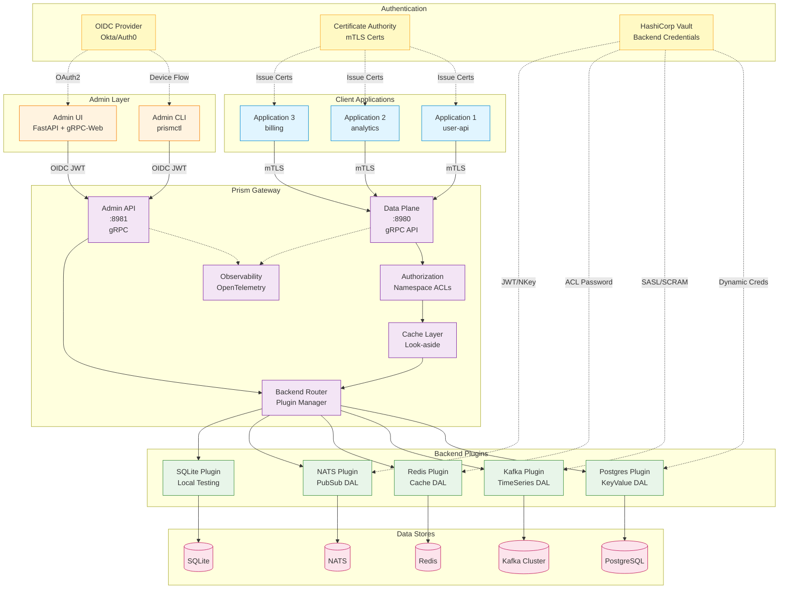

# Architecture Decision Records (ADRs)

This directory contains records of architectural decisions made for Prism.

## High-Level Architecture



**Key Architecture Principles:**

1. **Performance First** (ADR-001): Rust proxy for 10-100x performance vs JVM alternatives
2. **Client-Originated Configuration** (ADR-002): Applications declare requirements, Prism provisions
3. **Pluggable Backends** (ADR-005, ADR-025): Container-based plugins with standard interfaces
4. **Security by Design** (ADR-007, RFC-010, RFC-011): mTLS for clients, Vault-managed backend credentials
5. **Observability** (ADR-008, ADR-029): OpenTelemetry from day one with protocol recording
6. **Local-First Testing** (ADR-004): Real backends (SQLite, local Kafka) instead of mocks

## Index

### Core Architecture

- [ADR-001: Rust for the Proxy Implementation](./001-rust-for-proxy.md) - **Accepted**
  - 10-100x performance improvement over JVM alternatives
  - Predictable latency without GC pauses

- [ADR-002: Client-Originated Configuration](./002-client-originated-configuration.md) - **Accepted**
  - Applications declare requirements in protobuf
  - Prism auto-provisions backends and capacity

- [ADR-003: Protobuf as Single Source of Truth](./003-protobuf-single-source-of-truth.md) - **Accepted**
  - All data models, APIs, and configs generated from proto
  - Custom options for PII, indexing, capacity hints

- [ADR-004: Local-First Testing Strategy](./004-local-first-testing.md) - **Accepted**
  - Real backends (Postgres, Kafka, NATS) in Docker Compose
  - No mocks; same tests locally and in CI

### Backend & Data Layer

- [ADR-005: Backend Plugin Architecture](./005-backend-plugin-architecture.md) - **Accepted**
  - Trait-based plugin system for swappable backends
  - Unified interface for KeyValue, TimeSeries, Graph abstractions

- [ADR-006: Namespace and Multi-Tenancy](./006-namespace-multi-tenancy.md) - **Accepted**
  - Namespace-based isolation for data partitioning
  - Single-tenant shards for fault isolation

### Security & Operations

- [ADR-007: Authentication and Authorization](./007-authentication-authorization.md) - **Accepted**
  - mTLS for service-to-service
  - OAuth2/JWT for user-facing APIs
  - Namespace-level authorization policies

- [ADR-008: Observability Strategy](./008-observability-strategy.md) - **Accepted**
  - OpenTelemetry from day one
  - Structured logging, distributed tracing, Prometheus metrics

- [ADR-009: Shadow Traffic for Migrations](./009-shadow-traffic-migrations.md) - **Accepted**
  - Dual-write pattern for zero-downtime migrations
  - Comparison testing and validation

### Performance & Reliability

- [ADR-010: Caching Layer Design](./010-caching-layer.md) - **Accepted**
  - Look-aside cache pattern
  - Optional per-namespace caching
  - Cache invalidation strategies

### Implementation & Development Patterns

#### Go (Tooling & CLI)

- [ADR-012: Go for Tooling and CLI Utilities](./012-go-for-tooling.md) - **Accepted**
  - Single-binary distribution for CLI tools
  - Fast compile times for rapid iteration
  - Protobuf interoperability with Rust proxy

- [ADR-013: Go Error Handling Strategy](./013-go-error-handling-strategy.md) - **Accepted**
  - Modern error wrapping with `fmt.Errorf` and `%w`
  - Sentinel errors for well-known conditions
  - Fail-fast principle with early error reporting

- [ADR-014: Go Concurrency Patterns](./014-go-concurrency-patterns.md) - **Accepted**
  - Fork-join concurrency model with worker pools
  - Context-based cancellation
  - Channel patterns for communication

- [ADR-015: Go Testing Strategy](./015-go-testing-strategy.md) - **Accepted**
  - Three-tier testing (unit, integration, E2E)
  - 80%+ code coverage requirement
  - Proxy integration test harness

- [ADR-016: Go CLI and Configuration Management](./016-go-cli-configuration.md) - **Accepted**
  - Cobra for CLI framework
  - Viper for configuration management
  - Layered configuration (flags > env > file > defaults)

- [ADR-017: Go Structured Logging with slog](./017-go-structured-logging.md) - **Accepted**
  - Standard library slog for zero dependencies
  - Context propagation pattern
  - JSON output for production

#### Rust (Proxy Core)

- [ADR-018: Rust Error Handling Strategy](./018-rust-error-handling-strategy.md) - **Accepted**
  - thiserror for domain errors, anyhow for application code
  - Error context propagation
  - Type-safe error conversion

- [ADR-019: Rust Async Concurrency Patterns](./019-rust-async-concurrency-patterns.md) - **Accepted**
  - Tokio async runtime with work-stealing scheduler
  - Task spawning, channels, and select patterns
  - Connection pooling with sqlx

- [ADR-020: Rust Testing Strategy](./020-rust-testing-strategy.md) - **Accepted**
  - Three-tier testing with async support
  - Property-based testing with proptest
  - Criterion benchmarks

- [ADR-021: Rust Structured Logging with Tracing](./021-rust-structured-logging.md) - **Accepted**
  - tracing ecosystem for structured logging
  - Span instrumentation for request correlation
  - OpenTelemetry integration

### Client Configuration & Interface Design

- [ADR-022: Dynamic Client Configuration System](./022-dynamic-client-configuration.md) - **Accepted**
  - Separation of server and client configuration
  - Named configurations and inline descriptors
  - Protobuf-based configuration with runtime discovery

- [ADR-023: gRPC-First Interface Design](./023-grpc-first-interface-design.md) - **Accepted**
  - gRPC over HTTP/2 for all client-server communication
  - Service-per-pattern organization
  - Streaming support for pagination and pub/sub

- [ADR-024: Layered Interface Hierarchy](./024-layered-interface-hierarchy.md) - **Accepted**
  - Session layer as foundation (auth, audit, state)
  - Use-case layers: Queue, PubSub, Reader, Transact
  - Progressive disclosure of complexity

### Deployment & Operations

- [ADR-025: Container Plugin Model](./025-container-plugin-model.md) - **Accepted**
  - Backend-specific containers with standard interfaces
  - Horizontal scaling per plugin type
  - Publisher, Consumer, Processor, Listener roles

- [ADR-026: Distroless Container Images](./026-distroless-container-images.md) - **Accepted**
  - Google Distroless for minimal attack surface
  - Multi-stage builds for small images
  - Debug variants with busybox for troubleshooting

### Admin & Operations Management

- [ADR-027: Admin API via gRPC](./027-admin-api-grpc.md) - **Accepted**
  - Separate admin service on port 8981
  - Config, session, namespace, and backend management
  - RBAC and audit logging

- [ADR-028: Admin UI with FastAPI and gRPC-Web](./028-admin-ui-fastapi-grpc-web.md) - **Accepted**
  - FastAPI serving static files and gRPC-Web proxy
  - Vanilla JavaScript frontend with Tailwind CSS
  - Browser-accessible administration

- [ADR-040: uv run --with Pattern for Admin CLI](./040-uv-run-with-pattern.md) - **Accepted**
  - Python CLI with uv run --with prismctl pattern
  - Zero installation, secure package verification
  - Standard plugin images in ~/.prism directory

### Observability & Schema Management

- [ADR-029: Protocol Recording with Protobuf Tagging](./029-protocol-recording-protobuf-tags.md) - **Accepted**
  - Custom protobuf options for protocol recording
  - Sampling and queryable storage
  - Interceptor-based recording

- [ADR-030: Schema Recording with Protobuf Tagging](./030-schema-recording-protobuf-tags.md) - **Accepted**
  - Schema registry with version tracking
  - Compatibility checking (backward, forward, full)
  - Automated migration generation

## Status Definitions

- **Proposed**: Under discussion, not yet decided
- **Accepted**: Agreed upon and ready for implementation
- **Implemented**: Code exists
- **Deprecated**: No longer recommended
- **Superseded**: Replaced by another ADR

## Adding New ADRs

1. Copy `000-template.md` to `NNN-short-title.md`
2. Use YAML frontmatter for metadata (see CLAUDE.md for format)
3. Fill in all sections
4. Update this index
5. Create PR for team review
6. Update status when accepted

**Frontmatter Format:**
```markdown
---
title: "ADR-XXX: Descriptive Title"
status: Accepted
date: 2025-10-08
deciders: Core Team
tags: [architecture, backend]
---
```

## ADR Lifecycle

```
Proposed → Reviewed → Accepted → Implemented
                ↓
            Deprecated / Superseded
```

## Recent Changes

- 2025-10-09: ADR-040 added (uv run --with pattern for prismctl)
- 2025-10-09: High-level architecture diagram added to index
- 2025-10-08: Converted all ADRs to YAML frontmatter format
- 2025-10-08: ADRs 027-030 added (Admin interface, protocol/schema recording)
- 2025-10-07: ADRs 022-026 added (Client configuration, interfaces, deployment)
- 2025-10-07: ADRs 012-021 added (Go and Rust implementation patterns)
- 2025-10-05: ADRs 001-010 accepted (initial architecture)
- 2025-10-05: Created ADR index

## Tags

ADRs are tagged for easy filtering:

- `#architecture` - High-level system design
- `#backend` - Backend storage and data layer
- `#security` - Authentication, authorization, PII
- `#performance` - Performance and optimization
- `#testing` - Testing strategies
- `#operations` - Deployment, monitoring, ops
- `#admin` - Administration and management
- `#dx` - Developer experience
- `#go` - Go-specific patterns and practices
- `#rust` - Rust-specific patterns and practices
- `#concurrency` - Concurrent programming patterns
- `#error-handling` - Error handling strategies
- `#logging` - Logging and observability
- `#observability` - Tracing, monitoring, debugging
- `#grpc` - gRPC and protobuf patterns
- `#protobuf` - Protocol Buffers schema and options
- `#schema` - Schema management and evolution
- `#versioning` - Version management and compatibility
- `#configuration` - Configuration management
- `#containers` - Container and deployment patterns
- `#client-server` - Client-server architecture
- `#api-design` - API design and interfaces
- `#ui` - User interface design
- `#frontend` - Frontend development
- `#fastapi` - FastAPI framework
- `#grpc-web` - gRPC-Web protocol
- `#protocols` - Protocol design and recording
- `#registry` - Schema and service registries
- `#debugging` - Debugging tools and techniques
- `#evolution` - System evolution and migration
- `#python` - Python-specific patterns and tooling
- `#uv` - uv package manager and tooling
- `#cli` - Command-line interface design
- `#tooling` - Development and operational tooling
