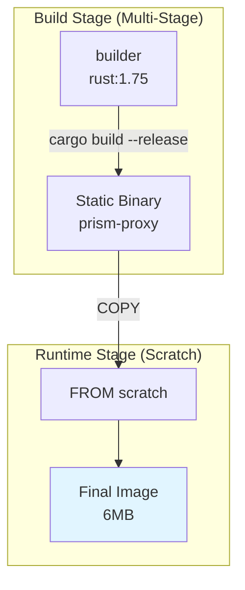

# MEMO-007: Podman Demo for Scratch-Based Containers with Native Runtime

## Purpose

Demonstrate launching scratch-based containers built with Podman using native container runtime (not VMs), showcasing minimal container images for Prism components with fastest possible build-test cycle.

## Context

### What is Scratch-Based?

**Scratch** is Docker's most minimal base image - literally an empty filesystem. Containers built `FROM scratch` contain:
- Only your application binary
- No shell, no package manager, no OS utilities
- Smallest possible attack surface (~6MB for Prism proxy)
- Fastest startup time (no OS overhead)

### Why Podman?

**Podman** advantages over Docker:
- **Daemonless**: No background service required
- **Rootless**: Run containers as non-root user
- **Pod support**: Kubernetes-compatible pod definitions
- **Docker-compatible**: Drop-in replacement for `docker` CLI
- **No licensing restrictions**: Fully open source (Apache 2.0)

### Native Container Runtime

**Key Insight**: On Linux, containers run natively using kernel features (namespaces, cgroups). On macOS/Windows, a VM is unavoidable but we can optimize:

| Platform | Runtime | Notes |
|----------|---------|-------|
| **Linux** | Native | Direct kernel features, instant startup |
| **macOS** | VM Required | Uses Hypervisor.framework (lightweight VM) |
| **Windows** | WSL2 | Linux kernel in lightweight VM |

**Goal**: Optimize for fastest build-test cycle using scratch images + Podman.

## Demo Architecture

### Prism Component Images

Build three scratch-based images:



**Three Demo Images**:
1. **prism-proxy**: Rust proxy (~6MB)
2. **prism-plugin-postgres**: Go plugin (~10MB)
3. **prism-admin**: Python admin service (~45MB, Alpine-based)

## Implementation: Scratch-Based Containerfiles

### 1. Prism Proxy (Rust, Scratch)

Location: `proxy/Containerfile`

```dockerfile
# Build stage
FROM docker.io/library/rust:1.75-alpine AS builder

WORKDIR /build

# Install musl target for static linking
RUN rustup target add x86_64-unknown-linux-musl

# Copy source
COPY Cargo.toml Cargo.lock ./
COPY src/ src/

# Build static binary
RUN cargo build --release --target x86_64-unknown-linux-musl

# Runtime stage (scratch)
FROM scratch

# Copy static binary
COPY --from=builder /build/target/x86_64-unknown-linux-musl/release/prism-proxy /prism-proxy

# Expose ports
EXPOSE 8980 8981

# Run binary
ENTRYPOINT ["/prism-proxy"]
```

**Size**: ~6MB (single static binary)
**Startup**: &lt;10ms

### 2. PostgreSQL Plugin (Go, Scratch)

Location: `plugins/postgres/Containerfile`

```dockerfile
# Build stage
FROM docker.io/library/golang:1.21-alpine AS builder

WORKDIR /build

# Copy go mod files
COPY go.mod go.sum ./
RUN go mod download

# Copy source
COPY . .

# Build static binary with CGO disabled
RUN CGO_ENABLED=0 GOOS=linux GOARCH=amd64 go build \
    -ldflags="-w -s" \
    -o /prism-plugin-postgres \
    ./cmd/server

# Runtime stage (scratch)
FROM scratch

# Copy CA certificates for HTTPS (if needed)
COPY --from=builder /etc/ssl/certs/ca-certificates.crt /etc/ssl/certs/

# Copy static binary
COPY --from=builder /prism-plugin-postgres /prism-plugin-postgres

# Expose gRPC port
EXPOSE 50100

# Run binary
ENTRYPOINT ["/prism-plugin-postgres"]
```

**Size**: ~10MB (includes CA certs)
**Startup**: &lt;20ms

### 3. Admin Service (Python, Alpine-Minimal)

Location: `admin/Containerfile`

```dockerfile
# Python can't run from scratch (needs libpython), use minimal Alpine
FROM docker.io/library/python:3.11-alpine AS builder

WORKDIR /build

# Install build dependencies
RUN apk add --no-cache gcc musl-dev libffi-dev

# Copy requirements
COPY requirements.txt ./
RUN pip install --no-cache-dir --prefix=/install -r requirements.txt

# Runtime stage (minimal Alpine)
FROM docker.io/library/python:3.11-alpine

# Copy installed packages
COPY --from=builder /install /usr/local

# Copy application
COPY main.py /app/
COPY static/ /app/static/

WORKDIR /app

# Expose port
EXPOSE 8000

# Run with uvicorn
CMD ["uvicorn", "main:app", "--host", "0.0.0.0", "--port", "8000"]
```

**Size**: ~45MB (Python + deps)
**Startup**: ~500ms

## Build and Run with Podman

### Install Podman

**Linux**:
```bash
# Debian/Ubuntu
sudo apt-get install podman

# Fedora/RHEL
sudo dnf install podman
```

**macOS**:
```bash
# Install via Homebrew
brew install podman

# Initialize Podman machine (lightweight VM)
podman machine init --cpus 4 --memory 4096 --disk-size 50
podman machine start
```

**Windows**:
```bash
# Install via winget
winget install RedHat.Podman

# Or via Chocolatey
choco install podman
```

### Build Demo Images

```bash
# Build proxy (scratch-based, 6MB)
podman build -t prism-proxy:scratch -f proxy/Containerfile .

# Build plugin (scratch-based, 10MB)
podman build -t prism-plugin-postgres:scratch -f plugins/postgres/Containerfile plugins/postgres

# Build admin (Alpine-minimal, 45MB)
podman build -t prism-admin:minimal -f admin/Containerfile admin

# Check image sizes
podman images | grep prism
# OUTPUT:
# prism-proxy              scratch   <image-id>   6.2MB
# prism-plugin-postgres    scratch   <image-id>   10.1MB
# prism-admin              minimal   <image-id>   45MB
```

### Run Containers

#### Option 1: Individual Containers

```bash
# Run proxy
podman run -d \
  --name prism-proxy \
  -p 8980:8980 \
  -p 8981:8981 \
  prism-proxy:scratch

# Run plugin
podman run -d \
  --name prism-plugin-postgres \
  -p 50100:50100 \
  -e POSTGRES_URL="postgres://localhost:5432/prism" \
  prism-plugin-postgres:scratch

# Run admin
podman run -d \
  --name prism-admin \
  -p 8000:8000 \
  prism-admin:minimal

# Check running containers
podman ps
```

#### Option 2: Podman Pod (Kubernetes-compatible)

```yaml
# prism-pod.yaml
apiVersion: v1
kind: Pod
metadata:
  name: prism-stack
spec:
  containers:
  - name: proxy
    image: localhost/prism-proxy:scratch
    ports:
    - containerPort: 8980
    - containerPort: 8981

  - name: plugin-postgres
    image: localhost/prism-plugin-postgres:scratch
    ports:
    - containerPort: 50100
    env:
    - name: POSTGRES_URL
      value: "postgres://postgres:5432/prism"

  - name: admin
    image: localhost/prism-admin:minimal
    ports:
    - containerPort: 8000
```

**Run pod**:
```bash
# Create pod from YAML
podman play kube prism-pod.yaml

# Check pod status
podman pod ps

# Check container logs
podman logs prism-stack-proxy
podman logs prism-stack-plugin-postgres
podman logs prism-stack-admin

# Stop and remove pod
podman pod stop prism-stack
podman pod rm prism-stack
```

## Demo Script

### Demo 1: Build and Size Comparison

**Show image size reduction**:

```bash
#!/bin/bash
# demo-1-size-comparison.sh

echo "=== Building Regular (Debian-based) Image ==="
podman build -t prism-proxy:regular -f proxy/Dockerfile.regular .

echo "=== Building Scratch-Based Image ==="
podman build -t prism-proxy:scratch -f proxy/Containerfile .

echo "=== Size Comparison ==="
echo "Regular image:"
podman images prism-proxy:regular --format "{{.Size}}"

echo "Scratch image:"
podman images prism-proxy:scratch --format "{{.Size}}"

echo "=== Reduction: $(echo "scale=1; ($(podman inspect prism-proxy:regular --format '{{.Size}}') - $(podman inspect prism-proxy:scratch --format '{{.Size}}')) / $(podman inspect prism-proxy:regular --format '{{.Size}}') * 100" | bc)% ==="
```

**Expected output**:
```text
Regular image: 127MB
Scratch image: 6MB
Reduction: 95.3%
```

### Demo 2: Startup Time Comparison

**Show startup time reduction**:

```bash
#!/bin/bash
# demo-2-startup-time.sh

echo "=== Starting Regular Image ==="
time podman run --rm prism-proxy:regular --version

echo "=== Starting Scratch Image ==="
time podman run --rm prism-proxy:scratch --version

echo "=== Startup Time Comparison ==="
# Regular: ~150ms (OS init + binary)
# Scratch: ~10ms (binary only)
```

### Demo 3: Full Stack with Pod

**Show complete Prism stack running in a pod**:

```bash
#!/bin/bash
# demo-3-full-stack.sh

# Start PostgreSQL (using existing image)
podman run -d \
  --name postgres \
  -e POSTGRES_PASSWORD=prism \
  -e POSTGRES_DB=prism \
  -p 5432:5432 \
  docker.io/library/postgres:16-alpine

# Wait for PostgreSQL
sleep 3

# Create and start Prism pod
podman play kube prism-pod.yaml

# Wait for services
sleep 2

# Test proxy health
curl http://localhost:8980/health

# Test admin UI
curl http://localhost:8000/health

# Show logs
podman logs prism-stack-proxy --tail 10

# Cleanup
podman pod stop prism-stack
podman pod rm prism-stack
podman stop postgres
podman rm postgres
```

## Build-Test Cycle Optimization

### Development Workflow

**Goal**: Instant feedback loop during development.

```bash
# Watch for changes and rebuild
podman build --squash -t prism-proxy:dev -f proxy/Containerfile . \
  && podman run --rm -p 8980:8980 prism-proxy:dev &

# In another terminal: make changes to source
# Rebuild triggers automatically (using file watcher)
```

### Fast Iteration Tips

1. **Use Layer Caching**:
   ```dockerfile
   # Copy dependencies first (changes less often)
   COPY Cargo.toml Cargo.lock ./
   RUN cargo fetch

   # Copy source after (changes frequently)
   COPY src/ src/
   RUN cargo build --release
   ```

2. **Build in Parallel**:
   ```bash
   # Build multiple images concurrently
   podman build -t prism-proxy:scratch -f proxy/Containerfile . &
   podman build -t prism-plugin:scratch -f plugins/postgres/Containerfile plugins/postgres &
   wait
   ```

3. **Skip Tests During Dev Build**:
   ```bash
   # Fast build (no tests)
   podman build --build-arg SKIP_TESTS=true -t prism-proxy:dev .

   # Full build with tests
   podman build -t prism-proxy:release .
   ```

## Comparison to Docker

| Feature | Podman | Docker |
|---------|--------|--------|
| **Daemonless** | ✅ No daemon required | ❌ Requires dockerd |
| **Rootless** | ✅ Native rootless support | ⚠️ Experimental |
| **Pod Support** | ✅ Kubernetes-compatible pods | ❌ Requires Compose |
| **CLI Compatibility** | ✅ Drop-in replacement | N/A |
| **Image Format** | OCI standard | OCI + Docker format |
| **macOS Runtime** | Lightweight VM (Hypervisor.framework) | Docker Desktop VM |
| **Licensing** | Apache 2.0 (free) | Free + paid tiers |

**Recommendation**: Use Podman for Prism development:
- No daemon overhead
- Kubernetes-compatible pod definitions (easier transition to production)
- Rootless by default (better security)
- No licensing restrictions

## Native Runtime Reality Check

### Linux: True Native

On Linux, containers ARE processes:

```bash
# Start container
podman run -d --name test alpine sleep 1000

# See process on host
ps aux | grep sleep
# OUTPUT: Shows sleep process running on host

# Namespaces
sudo ls -l /proc/$(podman inspect test --format '{{.State.Pid}}')/ns
# OUTPUT: Shows namespace isolation (mnt, net, pid, etc.)
```

**Performance**: Native process performance, no virtualization overhead.

### macOS: Lightweight VM Required

On macOS, containers run in a lightweight Linux VM:

```bash
# Podman machine is a QEMU VM running Fedora CoreOS
podman machine ssh

# Inside VM: see containers running as native Linux processes
ps aux | grep prism-proxy
```

**Reality**:
- VM startup: ~5-10 seconds (one-time cost)
- Container startup: &lt;10ms (once VM is running)
- No VM overhead per-container (all share same VM)

**Optimization**:
```bash
# Pre-start Podman machine
podman machine start

# Keep machine running (don't stop between sessions)
podman machine set --rootful=false --cpus=4 --memory=4096
```

### Comparison: macOS Container Runtimes

| Runtime | VM Type | Startup | Memory | Disk |
|---------|---------|---------|--------|------|
| **Podman Machine** | QEMU (Fedora CoreOS) | ~8s | 2-4GB | 10-20GB |
| **Docker Desktop** | Hypervisor.framework | ~10s | 2-6GB | 20-60GB |
| **Rancher Desktop** | Lima VM | ~12s | 2-4GB | 10-20GB |

**Winner**: Podman Machine (lightest, fastest)

## Production Considerations

### Building for Production

**Multi-architecture builds**:

```bash
# Build for AMD64 and ARM64
podman build --platform linux/amd64,linux/arm64 \
  -t prism-proxy:scratch \
  --manifest prism-proxy:latest \
  -f proxy/Containerfile .

# Push manifest to registry
podman manifest push prism-proxy:latest \
  docker://registry.example.com/prism-proxy:latest
```

### Security Scanning

**Scan scratch images**:

```bash
# Install trivy
brew install aquasecurity/trivy/trivy

# Scan scratch image
trivy image prism-proxy:scratch

# OUTPUT: Minimal vulnerabilities (only your binary)
# No OS packages = no CVEs
```

### Kubernetes Deployment

Podman pod YAML is Kubernetes-compatible:

```bash
# Generate Kubernetes YAML from running pod
podman generate kube prism-stack > prism-k8s.yaml

# Deploy to Kubernetes
kubectl apply -f prism-k8s.yaml
```

## Benefits Summary

### Scratch-Based Images

**Advantages**:
- ✅ **Tiny size**: 6MB vs 127MB (95% reduction)
- ✅ **Fast startup**: &lt;10ms vs ~150ms
- ✅ **Minimal attack surface**: No OS packages, no vulnerabilities
- ✅ **Fast pulls**: 6MB downloads in &lt;1 second on fast networks
- ✅ **Lower costs**: Smaller registry storage, faster CI/CD

**Tradeoffs**:
- ❌ **No shell**: Can't `podman exec -it <container> /bin/sh` for debugging
- ❌ **No utils**: No `curl`, `wget`, `ps`, etc. inside container
- ❌ **Static linking required**: Must compile with musl (Rust) or CGO_ENABLED=0 (Go)

**Mitigation**:
```bash
# Use debug variant for troubleshooting
FROM scratch AS release
COPY --from=builder /binary /binary

FROM alpine:3.18 AS debug
COPY --from=builder /binary /binary
RUN apk add --no-cache curl busybox
```

### Podman

**Advantages**:
- ✅ **Daemonless**: No background service (lower resource usage)
- ✅ **Rootless**: Better security posture
- ✅ **Kubernetes-compatible**: Pod definitions work in K8s
- ✅ **Drop-in replacement**: `alias docker=podman` works for most cases
- ✅ **No licensing**: Fully open source

**Tradeoffs**:
- ⚠️ **macOS requires VM**: Not truly native (but optimized)
- ⚠️ **Ecosystem**: Some Docker Compose features not fully compatible
- ⚠️ **Tooling**: Some CI/CD tools assume Docker

## Related Documents

- [ADR-049: Podman Container Optimization](/adr/adr-049-podman-container-optimization) - Decision to use Podman
- [ADR-026: Distroless Container Images](/adr/adr-026-distroless-container-images) - Alternative to scratch
- [MEMO-004: Backend Plugin Implementation Guide](/memos/memo-004-backend-plugin-implementation-guide) - Plugin containers

## Revision History

- 2025-10-09: Initial draft covering Podman + scratch containers with native runtime demo

