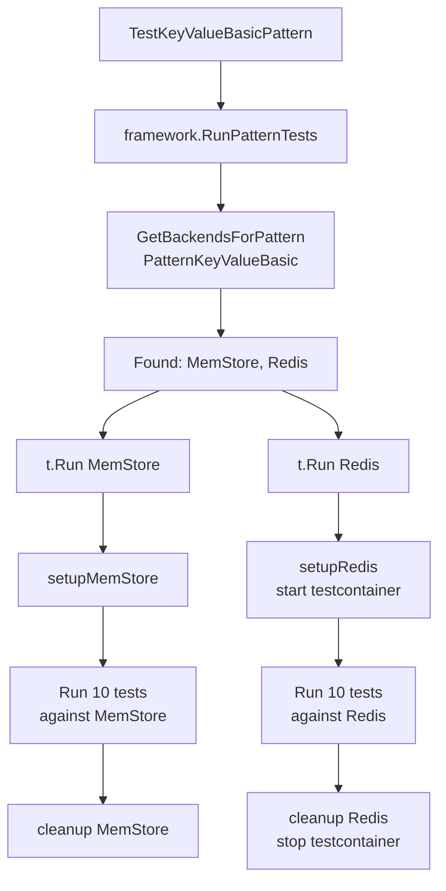

# Pattern-Based Acceptance Testing Framework

## Overview

We've transitioned from backend-specific acceptance tests to a **pattern-based acceptance testing framework**. This new approach tests data access patterns (KeyValue, Consumer, etc.) against multiple backend combinations automatically using interface discovery and registration.

## Motivation

### Problems with Backend-Specific Tests

**Before** (MEMO-015 approach):
```
tests/acceptance/
├── interfaces/
│   └── table_driven_test.go     # 400 lines
├── redis/
│   └── redis_integration_test.go # 200 lines
├── nats/
│   └── nats_integration_test.go  # 300 lines
└── postgres/
    └── postgres_integration_test.go # 415 lines
```

Issues:
- ❌ **Test duplication** - Same KeyValue tests repeated for each backend
- ❌ **Hard to maintain** - Update test logic in multiple files
- ❌ **Backend-focused** - Tests backends, not patterns
- ❌ **Manual updates** - Add new backend = write entire test file
- ❌ **Tight coupling** - Tests know about specific backends

### Pattern-Based Solution

**After** (current approach):
```
tests/acceptance/
├── framework/
│   ├── backend_registry.go      # Backend registration
│   ├── pattern_runner.go        # Test execution
│   └── types.go                 # Shared types
├── backends/
│   ├── memstore.go              # MemStore registration
│   ├── redis.go                 # Redis registration
│   └── nats.go                  # NATS registration
└── patterns/
    ├── keyvalue/
    │   ├── basic_test.go        # KeyValue Basic tests
    │   ├── ttl_test.go          # KeyValue TTL tests
    │   └── concurrent_test.go   # Concurrency tests
    └── consumer/
        ├── consumer_test.go     # Consumer tests
        └── process_test.go      # Message processing tests
```

Benefits:
- ✅ **Zero duplication** - Tests written once, run on all backends
- ✅ **Pattern-focused** - Test pattern behavior, not backends
- ✅ **Auto-discovery** - Backends register themselves at init()
- ✅ **Easy maintenance** - Update test logic in one place
- ✅ **Loose coupling** - Tests don't know about backends

## Architecture

### 1. Backend Registration

Backends register themselves with the framework at package init time:

**File**: `tests/acceptance/backends/memstore.go`
```go
func init() {
    framework.MustRegisterBackend(framework.Backend{
        Name:      "MemStore",
        SetupFunc: setupMemStore,

        SupportedPatterns: []framework.Pattern{
            framework.PatternKeyValueBasic,
            framework.PatternKeyValueTTL,
        },

        Capabilities: framework.Capabilities{
            SupportsTTL:    true,
            SupportsScan:   false,
            SupportsAtomic: false,
            MaxValueSize:   0,    // Unlimited
            MaxKeySize:     0,    // Unlimited
        },
    })
}
```

**File**: `tests/acceptance/backends/redis.go`
```go
func init() {
    framework.MustRegisterBackend(framework.Backend{
        Name:      "Redis",
        SetupFunc: setupRedis,

        SupportedPatterns: []framework.Pattern{
            framework.PatternKeyValueBasic,
            framework.PatternKeyValueTTL,
            framework.PatternPubSubBasic,
        },

        Capabilities: framework.Capabilities{
            SupportsTTL:       true,
            SupportsScan:      true,
            SupportsStreaming: true,
            MaxValueSize:      512 * 1024 * 1024,  // 512MB
            MaxKeySize:        512 * 1024 * 1024,  // 512MB
        },
    })
}
```

### 2. Pattern Test Definition

Pattern tests are written once and run against all compatible backends:

**File**: `tests/acceptance/patterns/keyvalue/basic_test.go`
```go
func TestKeyValueBasicPattern(t *testing.T) {
    tests := []framework.PatternTest{
        {
            Name: "SetAndGet",
            Func: testSetAndGet,
        },
        {
            Name: "GetNonExistent",
            Func: testGetNonExistent,
        },
        {
            Name: "Delete",
            Func: testDeleteExisting,
        },
        // ... more tests
    }

    // This single line runs all tests against all backends
    // that support PatternKeyValueBasic
    framework.RunPatternTests(t, framework.PatternKeyValueBasic, tests)
}

// Test function - backend-agnostic
func testSetAndGet(t *testing.T, driver interface{}, caps framework.Capabilities) {
    kv := driver.(plugin.KeyValueBasicInterface)

    key := fmt.Sprintf("%s:test-key", t.Name())
    err := kv.Set(key, []byte("test-value"), 0)
    require.NoError(t, err)

    value, found, err := kv.Get(key)
    require.NoError(t, err)
    assert.True(t, found)
    assert.Equal(t, []byte("test-value"), value)
}
```

### 3. Framework Test Runner

The framework discovers backends and runs tests automatically:

**File**: `tests/acceptance/framework/pattern_runner.go`
```go
func RunPatternTests(t *testing.T, pattern Pattern, tests []PatternTest) {
    // Find all backends that support this pattern
    backends := GetBackendsForPattern(pattern)

    if len(backends) == 0 {
        t.Skipf("No backends registered for pattern %s", pattern)
        return
    }

    // Run tests against each backend
    for _, backend := range backends {
        t.Run(backend.Name, func(t *testing.T) {
            t.Parallel()

            ctx := context.Background()

            // Setup backend (may start testcontainer)
            driver, cleanup := backend.SetupFunc(t, ctx)
            defer cleanup()

            // Run all tests against this backend
            for _, test := range tests {
                t.Run(test.Name, func(t *testing.T) {
                    // Check capability requirements
                    if test.RequiresCapability != "" {
                        if !backend.Capabilities.HasCapability(test.RequiresCapability) {
                            t.Skipf("Backend %s lacks capability: %s",
                                   backend.Name, test.RequiresCapability)
                            return
                        }
                    }

                    // Run test
                    test.Func(t, driver, backend.Capabilities)
                })
            }
        })
    }
}
```

## Test Execution Flow

### Single Test Run



### Output Example

```text
=== RUN   TestKeyValueBasicPattern
=== RUN   TestKeyValueBasicPattern/MemStore
=== PAUSE TestKeyValueBasicPattern/MemStore
=== RUN   TestKeyValueBasicPattern/Redis
=== PAUSE TestKeyValueBasicPattern/Redis
=== CONT  TestKeyValueBasicPattern/MemStore
=== CONT  TestKeyValueBasicPattern/Redis
🐳 Creating container for image redis:7-alpine
    MemStore/SetAndGet: PASS (0.00s)
    MemStore/GetNonExistent: PASS (0.00s)
    MemStore/Delete: PASS (0.00s)
    ...
    Redis/SetAndGet: PASS (0.03s)
    Redis/GetNonExistent: PASS (0.01s)
    Redis/Delete: PASS (0.02s)
    ...
--- PASS: TestKeyValueBasicPattern (2.15s)
    --- PASS: TestKeyValueBasicPattern/MemStore (0.01s)
    --- PASS: TestKeyValueBasicPattern/Redis (2.14s)
```

## CI/CD Integration

### GitHub Actions Workflow

**File**: `.github/workflows/pattern-acceptance-tests.yml`
```yaml
name: Pattern Acceptance Tests

on:
  push:
    branches: [main]
    paths:
      - 'patterns/**'
      - 'pkg/drivers/**'
      - 'tests/acceptance/patterns/**'

jobs:
  test-keyvalue-pattern:
    name: KeyValue Pattern
    runs-on: ubuntu-latest
    steps:
      - name: Run KeyValue pattern tests
        run: |
          cd tests/acceptance/patterns/keyvalue
          go test -v -timeout 15m ./...
        env:
          PRISM_TEST_QUIET: "1"

  test-consumer-pattern:
    name: Consumer Pattern
    runs-on: ubuntu-latest
    steps:
      - name: Run Consumer pattern tests
        run: |
          cd tests/acceptance/patterns/consumer
          go test -v -timeout 15m ./...
```

### Makefile Targets

```makefile
test-acceptance-patterns: ## Run pattern acceptance tests
	cd tests/acceptance/patterns/keyvalue && go test -v -timeout 15m ./...
	cd tests/acceptance/patterns/consumer && go test -v -timeout 15m ./...

test-acceptance-keyvalue: ## Run KeyValue pattern tests only
	cd tests/acceptance/patterns/keyvalue && go test -v ./...

test-acceptance-consumer: ## Run Consumer pattern tests only
	cd tests/acceptance/patterns/consumer && go test -v ./...
```

## Adding New Patterns

### 1. Create Pattern Test File

**File**: `tests/acceptance/patterns/timeseries/basic_test.go`
```go
package timeseries_test

import (
    "testing"
    "github.com/jrepp/prism-data-layer/tests/acceptance/framework"
    _ "github.com/jrepp/prism-data-layer/tests/acceptance/backends"
)

func TestTimeSeriesBasicPattern(t *testing.T) {
    tests := []framework.PatternTest{
        {
            Name: "WritePoints",
            Func: testWritePoints,
        },
        {
            Name: "QueryRange",
            Func: testQueryRange,
        },
    }

    framework.RunPatternTests(t, framework.PatternTimeSeriesBasic, tests)
}

func testWritePoints(t *testing.T, driver interface{}, caps framework.Capabilities) {
    ts := driver.(plugin.TimeSeriesBasicInterface)
    // ... test logic
}
```

### 2. Register Pattern Constant

**File**: `tests/acceptance/framework/types.go`
```go
type Pattern string

const (
    PatternKeyValueBasic    Pattern = "KeyValueBasic"
    PatternKeyValueTTL      Pattern = "KeyValueTTL"
    PatternPubSubBasic      Pattern = "PubSubBasic"
    PatternConsumer         Pattern = "Consumer"
    PatternTimeSeriesBasic  Pattern = "TimeSeriesBasic"  // Add new pattern
)
```

### 3. Backends Auto-Discover

Backends that implement `TimeSeriesBasicInterface` can register support:

```go
func init() {
    framework.MustRegisterBackend(framework.Backend{
        Name: "InfluxDB",
        SetupFunc: setupInfluxDB,
        SupportedPatterns: []framework.Pattern{
            framework.PatternTimeSeriesBasic,  // Declare support
        },
    })
}
```

**Result**: All TimeSeries tests automatically run against InfluxDB!

## Adding New Backends

### 1. Implement Backend Setup

**File**: `tests/acceptance/backends/influxdb.go`
```go
package backends

import (
    "context"
    "testing"
    "github.com/jrepp/prism-data-layer/tests/acceptance/framework"
    "github.com/jrepp/prism-data-layer/pkg/drivers/influxdb"
)

func init() {
    framework.MustRegisterBackend(framework.Backend{
        Name:      "InfluxDB",
        SetupFunc: setupInfluxDB,

        SupportedPatterns: []framework.Pattern{
            framework.PatternTimeSeriesBasic,
        },

        Capabilities: framework.Capabilities{
            SupportsTTL:       true,
            SupportsStreaming: true,
            MaxValueSize:      10 * 1024 * 1024,  // 10MB
        },
    })
}

func setupInfluxDB(t *testing.T, ctx context.Context) (interface{}, func()) {
    t.Helper()

    // Start InfluxDB container
    container, err := testcontainers.GenericContainer(ctx,
        testcontainers.GenericContainerRequest{
            ContainerRequest: testcontainers.ContainerRequest{
                Image: "influxdb:2.7-alpine",
                ExposedPorts: []string{"8086/tcp"},
                WaitingFor: wait.ForLog("Ready for queries"),
            },
            Started: true,
        })
    require.NoError(t, err)

    // Get connection endpoint
    endpoint, err := container.Endpoint(ctx, "")
    require.NoError(t, err)

    // Create driver
    driver, err := influxdb.NewInfluxDBDriver(ctx, map[string]interface{}{
        "url": fmt.Sprintf("http://%s", endpoint),
        "token": "test-token",
        "org": "test-org",
        "bucket": "test-bucket",
    })
    require.NoError(t, err)

    // Start driver
    err = driver.Start(ctx)
    require.NoError(t, err)

    cleanup := func() {
        driver.Stop(ctx)
        container.Terminate(ctx)
    }

    return driver, cleanup
}
```

### 2. Import in Tests

**File**: `tests/acceptance/patterns/timeseries/basic_test.go`
```go
import (
    _ "github.com/jrepp/prism-data-layer/tests/acceptance/backends"
)
```

**Result**: All TimeSeriesBasicPattern tests automatically run against InfluxDB!

## Benefits

### 1. Zero Test Duplication

Write test logic once:
```go
func testSetAndGet(t *testing.T, driver interface{}, caps framework.Capabilities) {
    // Single implementation
}
```

Runs automatically against:
- MemStore
- Redis
- PostgreSQL (if added)
- DynamoDB (if added)
- Any future backend

### 2. Pattern-Focused Testing

Tests validate **pattern behavior**, not backend implementation:
- Does KeyValue pattern work correctly?
- Does Consumer pattern process messages?
- Does PubSub pattern deliver to subscribers?

Backends are **interchangeable** - tests don't care which backend implements the pattern.

### 3. Easy Backend Addition

**Before**: Write 400-line test file for each backend

**After**:
1. Implement `SetupFunc` (~30 lines)
2. Register backend (~20 lines)
3. Done - all pattern tests run automatically

### 4. Capability-Based Test Skipping

```go
{
    Name: "TTLExpiration",
    Func: testTTLExpiration,
    RequiresCapability: "SupportsTTL",
}
```

- MemStore (supports TTL): runs test
- PostgreSQL (no TTL): skips test automatically

No manual skip logic in test code.

### 5. Parallel Execution

Tests run in parallel by backend:
```go
t.Run(backend.Name, func(t *testing.T) {
    t.Parallel()  // Backends test concurrently
    // ...
})
```

- MemStore and Redis test simultaneously
- Reduces total test time
- Each backend has isolated testcontainer

### 6. Clear Test Organization

```
patterns/
├── keyvalue/         # All KeyValue tests
│   ├── basic_test.go
│   ├── ttl_test.go
│   └── concurrent_test.go
└── consumer/         # All Consumer tests
    ├── consumer_test.go
    └── process_test.go
```

Tests organized by **what they test** (pattern), not **how they test** (backend).

## Running Tests

### All Pattern Tests

```bash
# Run all pattern acceptance tests
make test-acceptance-patterns

# Or directly
cd tests/acceptance/patterns/keyvalue && go test -v ./...
cd tests/acceptance/patterns/consumer && go test -v ./...
```

### Specific Pattern

```bash
# KeyValue pattern only
make test-acceptance-keyvalue

# Consumer pattern only
make test-acceptance-consumer
```

### Specific Backend + Pattern

```bash
# KeyValue tests on Redis only
cd tests/acceptance/patterns/keyvalue
go test -v -run TestKeyValueBasicPattern/Redis

# Consumer tests on NATS only
cd tests/acceptance/patterns/consumer
go test -v -run TestConsumerPattern/NATS
```

### Specific Test + Backend

```bash
# SetAndGet test on MemStore
cd tests/acceptance/patterns/keyvalue
go test -v -run TestKeyValueBasicPattern/MemStore/SetAndGet
```

## Migration from Backend-Specific Tests

### Old Approach (MEMO-015)

```
tests/acceptance/redis/redis_integration_test.go
tests/acceptance/nats/nats_integration_test.go
tests/acceptance/postgres/postgres_integration_test.go
```

Each file: 200-415 lines of duplicated test logic

### New Approach (Current)

```
tests/acceptance/patterns/keyvalue/basic_test.go       # 232 lines
tests/acceptance/patterns/keyvalue/ttl_test.go         # 150 lines
tests/acceptance/patterns/consumer/consumer_test.go    # 200 lines
```

Tests written once, run against all backends

### Migration Steps

1. ✅ **Create pattern test files** - Done
2. ✅ **Implement backend registry** - Done
3. ✅ **Register backends (MemStore, Redis, NATS)** - Done
4. ✅ **Update CI/CD workflows** - Done
5. ⏳ **Deprecate old backend-specific tests** - In Progress
6. ⏳ **Remove old acceptance test workflows** - Pending

## Comparison

| Aspect | Backend-Specific (Old) | Pattern-Based (New) |
|--------|----------------------|---------------------|
| Test Files | 3-4 per backend | 1 per pattern |
| Lines of Code | 200-415 per backend | 150-250 per pattern |
| Duplication | High (same tests repeated) | Zero (tests written once) |
| Maintenance | Update each backend file | Update pattern file once |
| New Backend | Write entire test file (200+ lines) | Register backend (50 lines) |
| Test Focus | Backend implementation | Pattern behavior |
| Backend Discovery | Manual (hardcoded) | Automatic (registration) |
| Parallel Execution | Manual coordination | Automatic (framework) |
| Capability Skipping | Manual skip logic in tests | Declarative (RequiresCapability) |

## Future Enhancements

### 1. Interface-Based Registration

Move to interface-based backend registration:

```go
framework.MustRegisterBackend(framework.Backend{
    Name: "Redis",
    SetupFunc: setupRedis,

    // Instead of patterns, declare interfaces
    Interfaces: []string{
        "KeyValueBasicInterface",
        "KeyValueTTLInterface",
        "PubSubBasicInterface",
    },
})
```

Framework automatically maps interfaces → patterns.

### 2. Multi-Backend Patterns

Test patterns that use multiple backends:

```go
func TestConsumerPatternMultiBackend(t *testing.T) {
    tests := []framework.MultiBackendPatternTest{
        {
            Name: "NATS_Redis_Consumer",
            MessageSource: "NATS",
            StateStore: "Redis",
            Func: testConsumerNATSRedis,
        },
    }

    framework.RunMultiBackendPatternTests(t, tests)
}
```

### 3. Property-Based Testing

Add randomized property-based testing (like MEMO-015):

```go
{
    Name: "PropertyBased_SetGet",
    Func: testPropertyBasedSetGet,
    Iterations: 100,  // Run 100 times with random data
}
```

### 4. Performance Benchmarking

Benchmark pattern operations across backends:

```go
func BenchmarkKeyValueSet(b *testing.B) {
    framework.BenchmarkPatternOperation(b,
        framework.PatternKeyValueBasic,
        func(driver interface{}) {
            kv := driver.(plugin.KeyValueBasicInterface)
            kv.Set("key", []byte("value"), 0)
        })
}
```

Output: ops/sec comparison across all backends

## Conclusion

Pattern-based acceptance testing provides:

- ✅ **Zero duplication** - Write tests once, run everywhere
- ✅ **Pattern-focused** - Test pattern behavior, not backends
- ✅ **Auto-discovery** - Backends register and run automatically
- ✅ **Easy maintenance** - Update tests in one place
- ✅ **Simple backend addition** - 50 lines to add full test coverage
- ✅ **Capability-aware** - Tests skip when requirements not met
- ✅ **Parallel execution** - Faster test runs
- ✅ **Clear organization** - Tests grouped by pattern

This approach scales to:
- 10+ patterns (KeyValue, PubSub, Queue, TimeSeries, Graph, etc.)
- 20+ backends (Redis, Kafka, NATS, PostgreSQL, DynamoDB, S3, etc.)
- 100+ test cases per pattern

...without duplicating a single line of test code.

## References

- [MEMO-015: Cross-Backend Acceptance Test Framework](/memos/memo-015) - Previous backend-specific approach
- [ADR-015: Go Testing Strategy](/adr/adr-015) - Overall Go testing philosophy
- [RFC-015: Plugin Acceptance Test Framework](/rfc/rfc-015) - Original plugin testing RFC
