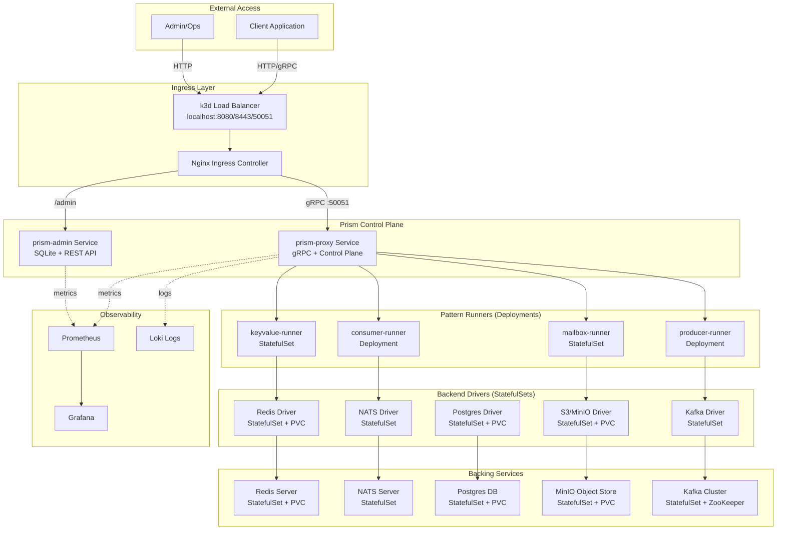

# Local Kubernetes Deployment with k3d for Prism

This memo provides a comprehensive guide for setting up a local Kubernetes cluster using **k3d** (the modern recommended approach) and deploying Prism service components in a production-like environment.

## Executive Summary

**Recommendation: Use k3d for local Kubernetes development**

- **k3d** is the best modern installer for local Kubernetes with Docker
- Lightweight (runs k3s in Docker containers)
- Fast cluster creation (seconds, not minutes)
- Multi-node support with load balancer
- Compatible with existing Docker workflows
- Perfect for CI/CD and local development

## Why k3d Over Alternatives

| Tool | Pros | Cons | Use Case |
|------|------|------|----------|
| **k3d** | • Fastest startup<br>• Built-in load balancer<br>• Multi-node clusters<br>• Docker-based<br>• Production k3s | • Requires Docker | **✅ Best for local dev** |
| kind | • Upstream Kubernetes<br>• Good for testing | • Slower than k3d<br>• More resource-heavy | Kubernetes conformance testing |
| minikube | • Most features<br>• Multiple drivers | • Slowest startup<br>• Heavyweight<br>• Complex | Learning Kubernetes |
| Docker Desktop K8s | • Built-in<br>• Easy setup | • Single node only<br>• No customization<br>• macOS/Windows only | Simple demos |
| k0s/k0sctl | • Production-ready<br>• Bare metal | • Overkill for local<br>• Complex setup | Production clusters |

## Prerequisites

```bash
# macOS
brew install k3d kubectl helm

# Linux
wget -q -O - https://raw.githubusercontent.com/k3d-io/k3d/main/install.sh | bash
curl -LO "https://dl.k8s.io/release/$(curl -L -s https://dl.k8s.io/release/stable.txt)/bin/linux/amd64/kubectl"
sudo install -o root -g root -m 0755 kubectl /usr/local/bin/kubectl

# Verify installations
k3d --version          # v5.6.0+
kubectl version --client # v1.29.0+
helm version           # v3.14.0+
docker --version       # 24.0.0+
```

## Quick Start: Create Prism Cluster

```bash
# Create a multi-node cluster with load balancer
k3d cluster create prism-local \
  --servers 1 \
  --agents 2 \
  --port "8080:80@loadbalancer" \
  --port "8443:443@loadbalancer" \
  --port "50051:50051@loadbalancer" \
  --api-port 6443 \
  --volume "$(pwd)/local-storage:/var/lib/rancher/k3s/storage@all" \
  --k3s-arg "--disable=traefik@server:0"

# Verify cluster is ready
kubectl cluster-info
kubectl get nodes

# Expected output:
# NAME                        STATUS   ROLES                  AGE   VERSION
# k3d-prism-local-server-0    Ready    control-plane,master   30s   v1.28.5+k3s1
# k3d-prism-local-agent-0     Ready    <none>                 28s   v1.28.5+k3s1
# k3d-prism-local-agent-1     Ready    <none>                 28s   v1.28.5+k3s1
```

### Cluster Configuration Explained

| Flag | Purpose |
|------|---------|
| `--servers 1` | 1 control plane node (can increase for HA) |
| `--agents 2` | 2 worker nodes for workload distribution |
| `--port "8080:80@loadbalancer"` | HTTP ingress |
| `--port "8443:443@loadbalancer"` | HTTPS ingress |
| `--port "50051:50051@loadbalancer"` | gRPC (Prism proxy) |
| `--api-port 6443` | Kubernetes API server |
| `--volume` | Persistent storage mount |
| `--disable=traefik` | We'll use Nginx Ingress instead |

## Prism Architecture in Kubernetes



## Step-by-Step Deployment

### 1. Install Nginx Ingress Controller

```bash
# Install Nginx Ingress
kubectl apply -f https://raw.githubusercontent.com/kubernetes/ingress-nginx/controller-v1.10.0/deploy/static/provider/cloud/deploy.yaml

# Wait for ingress to be ready
kubectl wait --namespace ingress-nginx \
  --for=condition=ready pod \
  --selector=app.kubernetes.io/component=controller \
  --timeout=120s

# Verify
kubectl get pods -n ingress-nginx
```

### 2. Create Prism Namespace and Storage

```bash
# Create namespace
kubectl create namespace prism

# Create storage class for local development
cat <<EOF | kubectl apply -f -
apiVersion: storage.k8s.io/v1
kind: StorageClass
metadata:
  name: local-storage
provisioner: rancher.io/local-path
volumeBindingMode: WaitForFirstConsumer
reclaimPolicy: Delete
EOF

# Verify
kubectl get storageclass
```

### 3. Deploy Backing Services

```bash
# Create backing services namespace
kubectl create namespace prism-backends

# Deploy Redis
cat <<EOF | kubectl apply -f -
apiVersion: v1
kind: Service
metadata:
  name: redis
  namespace: prism-backends
spec:
  ports:
  - port: 6379
    name: redis
  clusterIP: None
  selector:
    app: redis
---
apiVersion: apps/v1
kind: StatefulSet
metadata:
  name: redis
  namespace: prism-backends
spec:
  serviceName: redis
  replicas: 1
  selector:
    matchLabels:
      app: redis
  template:
    metadata:
      labels:
        app: redis
    spec:
      containers:
      - name: redis
        image: redis:7-alpine
        ports:
        - containerPort: 6379
        volumeMounts:
        - name: data
          mountPath: /data
        resources:
          requests:
            memory: "256Mi"
            cpu: "100m"
          limits:
            memory: "512Mi"
            cpu: "500m"
  volumeClaimTemplates:
  - metadata:
      name: data
    spec:
      accessModes: [ "ReadWriteOnce" ]
      storageClassName: local-storage
      resources:
        requests:
          storage: 1Gi
EOF

# Deploy NATS
kubectl apply -f https://raw.githubusercontent.com/nats-io/k8s/main/nats-server/single-server-nats.yml -n prism-backends

# Deploy MinIO (S3-compatible)
cat <<EOF | kubectl apply -f -
apiVersion: v1
kind: Service
metadata:
  name: minio
  namespace: prism-backends
spec:
  ports:
  - port: 9000
    name: api
  - port: 9001
    name: console
  selector:
    app: minio
---
apiVersion: apps/v1
kind: StatefulSet
metadata:
  name: minio
  namespace: prism-backends
spec:
  serviceName: minio
  replicas: 1
  selector:
    matchLabels:
      app: minio
  template:
    metadata:
      labels:
        app: minio
    spec:
      containers:
      - name: minio
        image: minio/minio:latest
        args:
        - server
        - /data
        - --console-address
        - ":9001"
        env:
        - name: MINIO_ROOT_USER
          value: "minioadmin"
        - name: MINIO_ROOT_PASSWORD
          value: "minioadmin"
        ports:
        - containerPort: 9000
        - containerPort: 9001
        volumeMounts:
        - name: data
          mountPath: /data
  volumeClaimTemplates:
  - metadata:
      name: data
    spec:
      accessModes: [ "ReadWriteOnce" ]
      storageClassName: local-storage
      resources:
        requests:
          storage: 5Gi
EOF

# Deploy Postgres
cat <<EOF | kubectl apply -f -
apiVersion: v1
kind: Service
metadata:
  name: postgres
  namespace: prism-backends
spec:
  ports:
  - port: 5432
  selector:
    app: postgres
---
apiVersion: apps/v1
kind: StatefulSet
metadata:
  name: postgres
  namespace: prism-backends
spec:
  serviceName: postgres
  replicas: 1
  selector:
    matchLabels:
      app: postgres
  template:
    metadata:
      labels:
        app: postgres
    spec:
      containers:
      - name: postgres
        image: postgres:16-alpine
        env:
        - name: POSTGRES_DB
          value: "prism"
        - name: POSTGRES_USER
          value: "prism"
        - name: POSTGRES_PASSWORD
          value: "prism"
        ports:
        - containerPort: 5432
        volumeMounts:
        - name: data
          mountPath: /var/lib/postgresql/data
        resources:
          requests:
            memory: "256Mi"
            cpu: "100m"
          limits:
            memory: "1Gi"
            cpu: "1000m"
  volumeClaimTemplates:
  - metadata:
      name: data
    spec:
      accessModes: [ "ReadWriteOnce" ]
      storageClassName: local-storage
      resources:
        requests:
          storage: 2Gi
EOF

# Verify all backing services
kubectl get pods -n prism-backends
kubectl get pvc -n prism-backends
```

### 4. Deploy Prism Admin Service

```bash
# Create ConfigMap for prism-admin
cat <<EOF | kubectl apply -f -
apiVersion: v1
kind: ConfigMap
metadata:
  name: prism-admin-config
  namespace: prism
data:
  config.yaml: |
    server:
      port: 8080
      host: 0.0.0.0
    database:
      path: /data/prism-admin.db
    logging:
      level: info
EOF

# Deploy prism-admin
cat <<EOF | kubectl apply -f -
apiVersion: v1
kind: Service
metadata:
  name: prism-admin
  namespace: prism
spec:
  ports:
  - port: 8080
    name: http
  selector:
    app: prism-admin
---
apiVersion: apps/v1
kind: Deployment
metadata:
  name: prism-admin
  namespace: prism
spec:
  replicas: 1
  selector:
    matchLabels:
      app: prism-admin
  template:
    metadata:
      labels:
        app: prism-admin
    spec:
      containers:
      - name: prism-admin
        image: prism-admin:latest
        imagePullPolicy: Never  # Use local image
        ports:
        - containerPort: 8080
        volumeMounts:
        - name: config
          mountPath: /etc/prism
        - name: data
          mountPath: /data
        resources:
          requests:
            memory: "128Mi"
            cpu: "100m"
          limits:
            memory: "256Mi"
            cpu: "500m"
      volumes:
      - name: config
        configMap:
          name: prism-admin-config
      - name: data
        persistentVolumeClaim:
          claimName: prism-admin-data
---
apiVersion: v1
kind: PersistentVolumeClaim
metadata:
  name: prism-admin-data
  namespace: prism
spec:
  accessModes:
  - ReadWriteOnce
  storageClassName: local-storage
  resources:
    requests:
      storage: 1Gi
EOF
```

### 5. Deploy Prism Proxy (gRPC Gateway)

```bash
# Deploy prism-proxy
cat <<EOF | kubectl apply -f -
apiVersion: v1
kind: Service
metadata:
  name: prism-proxy
  namespace: prism
  annotations:
    service.beta.kubernetes.io/aws-load-balancer-type: nlb
spec:
  type: LoadBalancer
  ports:
  - port: 50051
    name: grpc
    protocol: TCP
  - port: 9090
    name: metrics
  selector:
    app: prism-proxy
---
apiVersion: apps/v1
kind: Deployment
metadata:
  name: prism-proxy
  namespace: prism
spec:
  replicas: 2  # Multiple replicas for HA
  selector:
    matchLabels:
      app: prism-proxy
  template:
    metadata:
      labels:
        app: prism-proxy
    spec:
      containers:
      - name: prism-proxy
        image: prism-proxy:latest
        imagePullPolicy: Never
        ports:
        - containerPort: 50051
          name: grpc
        - containerPort: 9090
          name: metrics
        env:
        - name: RUST_LOG
          value: "info"
        - name: PRISM_ADMIN_URL
          value: "http://prism-admin.prism.svc.cluster.local:8080"
        resources:
          requests:
            memory: "256Mi"
            cpu: "200m"
          limits:
            memory: "512Mi"
            cpu: "1000m"
        livenessProbe:
          grpc:
            port: 50051
          initialDelaySeconds: 10
          periodSeconds: 10
        readinessProbe:
          grpc:
            port: 50051
          initialDelaySeconds: 5
          periodSeconds: 5
EOF
```

### 6. Deploy Pattern Runners

```bash
# Deploy KeyValue Pattern Runner
cat <<EOF | kubectl apply -f -
apiVersion: apps/v1
kind: StatefulSet
metadata:
  name: keyvalue-runner
  namespace: prism
spec:
  serviceName: keyvalue-runner
  replicas: 1
  selector:
    matchLabels:
      app: keyvalue-runner
  template:
    metadata:
      labels:
        app: keyvalue-runner
        pattern: keyvalue
    spec:
      containers:
      - name: keyvalue-runner
        image: keyvalue-runner:latest
        imagePullPolicy: Never
        args:
        - --proxy-addr=prism-proxy.prism.svc.cluster.local:50051
        env:
        - name: REDIS_URL
          value: "redis://redis.prism-backends.svc.cluster.local:6379"
        resources:
          requests:
            memory: "128Mi"
            cpu: "100m"
          limits:
            memory: "256Mi"
            cpu: "500m"
EOF

# Deploy Consumer Pattern Runner
cat <<EOF | kubectl apply -f -
apiVersion: apps/v1
kind: Deployment
metadata:
  name: consumer-runner
  namespace: prism
spec:
  replicas: 2
  selector:
    matchLabels:
      app: consumer-runner
  template:
    metadata:
      labels:
        app: consumer-runner
        pattern: consumer
    spec:
      containers:
      - name: consumer-runner
        image: consumer-runner:latest
        imagePullPolicy: Never
        args:
        - --proxy-addr=prism-proxy.prism.svc.cluster.local:50051
        env:
        - name: NATS_URL
          value: "nats://nats.prism-backends.svc.cluster.local:4222"
        resources:
          requests:
            memory: "128Mi"
            cpu: "100m"
          limits:
            memory: "256Mi"
            cpu: "500m"
EOF

# Deploy Producer Pattern Runner
cat <<EOF | kubectl apply -f -
apiVersion: apps/v1
kind: Deployment
metadata:
  name: producer-runner
  namespace: prism
spec:
  replicas: 2
  selector:
    matchLabels:
      app: producer-runner
  template:
    metadata:
      labels:
        app: producer-runner
        pattern: producer
    spec:
      containers:
      - name: producer-runner
        image: producer-runner:latest
        imagePullPolicy: Never
        args:
        - --proxy-addr=prism-proxy.prism.svc.cluster.local:50051
        env:
        - name: NATS_URL
          value: "nats://nats.prism-backends.svc.cluster.local:4222"
        resources:
          requests:
            memory: "128Mi"
            cpu: "100m"
          limits:
            memory: "256Mi"
            cpu: "500m"
EOF

# Deploy Mailbox Pattern Runner
cat <<EOF | kubectl apply -f -
apiVersion: apps/v1
kind: StatefulSet
metadata:
  name: mailbox-runner
  namespace: prism
spec:
  serviceName: mailbox-runner
  replicas: 1
  selector:
    matchLabels:
      app: mailbox-runner
  template:
    metadata:
      labels:
        app: mailbox-runner
        pattern: mailbox
    spec:
      containers:
      - name: mailbox-runner
        image: mailbox-runner:latest
        imagePullPolicy: Never
        args:
        - --proxy-addr=prism-proxy.prism.svc.cluster.local:50051
        env:
        - name: S3_ENDPOINT
          value: "http://minio.prism-backends.svc.cluster.local:9000"
        - name: S3_ACCESS_KEY
          value: "minioadmin"
        - name: S3_SECRET_KEY
          value: "minioadmin"
        resources:
          requests:
            memory: "128Mi"
            cpu: "100m"
          limits:
            memory: "256Mi"
            cpu: "500m"
  volumeClaimTemplates:
  - metadata:
      name: data
    spec:
      accessModes: [ "ReadWriteOnce" ]
      storageClassName: local-storage
      resources:
        requests:
          storage: 1Gi
EOF
```

### 7. Create Ingress Routes

```bash
# Create Ingress for HTTP/gRPC access
cat <<EOF | kubectl apply -f -
apiVersion: networking.k8s.io/v1
kind: Ingress
metadata:
  name: prism-ingress
  namespace: prism
  annotations:
    nginx.ingress.kubernetes.io/backend-protocol: "GRPC"
    nginx.ingress.kubernetes.io/grpc-backend: "true"
spec:
  ingressClassName: nginx
  rules:
  - host: prism.local
    http:
      paths:
      - path: /admin
        pathType: Prefix
        backend:
          service:
            name: prism-admin
            port:
              number: 8080
      - path: /
        pathType: Prefix
        backend:
          service:
            name: prism-proxy
            port:
              number: 50051
EOF

# Add to /etc/hosts
echo "127.0.0.1 prism.local" | sudo tee -a /etc/hosts
```

## Building and Loading Images

```bash
# Build all images from project root
make build-all

# Load images into k3d cluster
k3d image import prism-admin:latest -c prism-local
k3d image import prism-proxy:latest -c prism-local
k3d image import keyvalue-runner:latest -c prism-local
k3d image import consumer-runner:latest -c prism-local
k3d image import producer-runner:latest -c prism-local
k3d image import mailbox-runner:latest -c prism-local

# Alternative: Use local registry
k3d registry create prism-registry --port 5555
docker tag prism-admin:latest localhost:5555/prism-admin:latest
docker push localhost:5555/prism-admin:latest
```

## Verification and Testing

```bash
# Check all pods are running
kubectl get pods -n prism
kubectl get pods -n prism-backends

# Check services
kubectl get svc -n prism
kubectl get svc -n prism-backends

# Check ingress
kubectl get ingress -n prism

# Test admin API
curl http://prism.local:8080/admin/health

# Test gRPC proxy (requires grpcurl)
grpcurl -plaintext prism.local:50051 list

# View logs
kubectl logs -n prism deployment/prism-proxy -f
kubectl logs -n prism deployment/prism-admin -f

# Port forward for direct access
kubectl port-forward -n prism svc/prism-proxy 50051:50051
kubectl port-forward -n prism svc/prism-admin 8080:8080

# Get metrics
kubectl port-forward -n prism svc/prism-proxy 9090:9090
curl http://localhost:9090/metrics
```

## Observability Setup

```bash
# Install Prometheus stack with Helm
helm repo add prometheus-community https://prometheus-community.github.io/helm-charts
helm repo update

helm install prometheus prometheus-community/kube-prometheus-stack \
  --namespace observability \
  --create-namespace \
  --set prometheus.prometheusSpec.serviceMonitorSelectorNilUsesHelmValues=false

# Access Grafana
kubectl port-forward -n observability svc/prometheus-grafana 3000:80
# Default credentials: admin/prom-operator

# Install Loki for logs
helm install loki grafana/loki-stack \
  --namespace observability \
  --set grafana.enabled=false \
  --set promtail.enabled=true
```

## Resource Limits and Scaling

```yaml
# Recommended resource limits for local development

# Small workload (laptop, 8GB RAM)
prism-proxy:
  replicas: 1
  resources:
    requests: { memory: 128Mi, cpu: 100m }
    limits: { memory: 256Mi, cpu: 500m }

# Medium workload (desktop, 16GB RAM)
prism-proxy:
  replicas: 2
  resources:
    requests: { memory: 256Mi, cpu: 200m }
    limits: { memory: 512Mi, cpu: 1000m }

# Large workload (workstation, 32GB+ RAM)
prism-proxy:
  replicas: 3
  resources:
    requests: { memory: 512Mi, cpu: 500m }
    limits: { memory: 1Gi, cpu: 2000m }
```

## Horizontal Pod Autoscaling

```bash
# Enable HPA for prism-proxy
cat <<EOF | kubectl apply -f -
apiVersion: autoscaling/v2
kind: HorizontalPodAutoscaler
metadata:
  name: prism-proxy-hpa
  namespace: prism
spec:
  scaleTargetRef:
    apiVersion: apps/v1
    kind: Deployment
    name: prism-proxy
  minReplicas: 2
  maxReplicas: 10
  metrics:
  - type: Resource
    resource:
      name: cpu
      target:
        type: Utilization
        averageUtilization: 70
  - type: Resource
    resource:
      name: memory
      target:
        type: Utilization
        averageUtilization: 80
EOF
```

## Persistent Data Management

```bash
# List all PVCs
kubectl get pvc -n prism
kubectl get pvc -n prism-backends

# Backup PVC data (example: Redis)
kubectl exec -n prism-backends redis-0 -- redis-cli BGSAVE
kubectl cp prism-backends/redis-0:/data/dump.rdb ./backups/redis-$(date +%Y%m%d).rdb

# Backup Postgres
kubectl exec -n prism-backends postgres-0 -- pg_dump -U prism prism > backups/postgres-$(date +%Y%m%d).sql

# Restore from backup
kubectl cp ./backups/redis-20251016.rdb prism-backends/redis-0:/data/dump.rdb
kubectl exec -n prism-backends redis-0 -- redis-cli SHUTDOWN SAVE
```

## Cleanup and Reset

```bash
# Delete cluster (preserves data in mounted volumes)
k3d cluster delete prism-local

# Full cleanup (including volumes)
k3d cluster delete prism-local
rm -rf ./local-storage

# Restart fresh
k3d cluster create prism-local [... same flags as above ...]
```

## Troubleshooting

### Common Issues

**1. Pods stuck in ImagePullBackOff**
```bash
# Check if images are loaded
k3d image list -c prism-local

# Reload image
k3d image import your-image:tag -c prism-local

# Or use imagePullPolicy: Never in manifests
```

**2. Services not accessible**
```bash
# Check service endpoints
kubectl get endpoints -n prism

# Check pod IPs
kubectl get pods -n prism -o wide

# Test service from another pod
kubectl run -it --rm debug --image=busybox --restart=Never -- sh
# Inside pod:
wget -O- http://prism-admin.prism.svc.cluster.local:8080/health
```

**3. Persistent volume issues**
```bash
# Check PV/PVC status
kubectl get pv
kubectl get pvc -n prism

# Describe PVC for errors
kubectl describe pvc prism-admin-data -n prism

# Check storage class
kubectl get storageclass
```

**4. DNS resolution issues**
```bash
# Test DNS from a pod
kubectl run -it --rm dnstest --image=busybox --restart=Never -- nslookup prism-admin.prism.svc.cluster.local

# Check CoreDNS
kubectl get pods -n kube-system -l k8s-app=kube-dns
kubectl logs -n kube-system -l k8s-app=kube-dns
```

## Advanced: Multi-Cluster Setup

```bash
# Create dev cluster
k3d cluster create prism-dev --servers 1 --agents 1

# Create staging cluster
k3d cluster create prism-staging --servers 1 --agents 2

# Create prod-like cluster
k3d cluster create prism-prod --servers 3 --agents 3

# Switch between clusters
kubectl config use-context k3d-prism-dev
kubectl config use-context k3d-prism-staging
kubectl config use-context k3d-prism-prod
```

## Performance Tuning

```bash
# Increase k3s server resources
k3d cluster create prism-local \
  --servers 1 \
  --agents 2 \
  --k3s-arg "--kube-apiserver-arg=max-requests-inflight=400@server:0" \
  --k3s-arg "--kube-apiserver-arg=max-mutating-requests-inflight=200@server:0"

# Disable unnecessary features
k3d cluster create prism-local \
  --k3s-arg "--disable=servicelb@server:0" \
  --k3s-arg "--disable=traefik@server:0" \
  --k3s-arg "--disable=metrics-server@server:0"
```

## CI/CD Integration

```yaml
# .github/workflows/k8s-test.yml
name: Kubernetes Tests

on: [push, pull_request]

jobs:
  k8s-test:
    runs-on: ubuntu-latest
    steps:
    - uses: actions/checkout@v4

    - name: Install k3d
      run: |
        wget -q -O - https://raw.githubusercontent.com/k3d-io/k3d/main/install.sh | bash

    - name: Create cluster
      run: |
        k3d cluster create test --agents 2 --wait

    - name: Build and load images
      run: |
        make build-all
        k3d image import prism-proxy:latest -c test
        k3d image import prism-admin:latest -c test

    - name: Deploy Prism
      run: |
        kubectl apply -k k8s/overlays/test
        kubectl wait --for=condition=ready pod -l app=prism-proxy -n prism --timeout=120s

    - name: Run integration tests
      run: |
        make test-k8s

    - name: Cleanup
      run: k3d cluster delete test
```

## References

- k3d Documentation: https://k3d.io
- k3s Documentation: https://docs.k3s.io
- Kubernetes Documentation: https://kubernetes.io/docs
- ADR-049: Podman/Docker Container Strategy
- ADR-059: Kubernetes Operator for Declarative Prism Deployment
- MEMO-033: Process Isolation Bulkhead Pattern
- RFC-031: Security Architecture

## Alternative: Kubernetes Operator Deployment

For production deployments requiring runtime flexibility and declarative configuration, consider the **Prism Kubernetes Operator** approach (ADR-059).

### Operator vs Manual YAML

| Aspect | Manual YAML (This Guide) | Kubernetes Operator |
|--------|--------------------------|---------------------|
| **Best For** | Learning, POC, quick start | Production, runtime flexibility |
| **Configuration** | Static (install-time) | Dynamic (runtime changes) |
| **Complexity** | Low (copy-paste YAML) | Higher (CRD + controller) |
| **Updates** | Manual `kubectl apply` | Automatic reconciliation |
| **Self-Healing** | None | Automatic recreation |
| **Pattern Addition** | Edit manifests manually | Edit CRD spec |
| **Backend Management** | Manual ordering | Automatic dependency resolution |

### Quick Operator Example

Instead of 20+ YAML files, define entire Prism stack in single CRD:

```yaml
apiVersion: prism.io/v1alpha1
kind: PrismCluster
metadata:
  name: prism-local
  namespace: prism
spec:
  admin:
    replicas: 1
    storage: {type: sqlite, size: 1Gi}

  proxy:
    replicas: 2
    autoscaling: {enabled: true, minReplicas: 2, maxReplicas: 10}

  patterns:
    - name: keyvalue
      type: StatefulSet
      backends: [redis]

    - name: consumer
      type: Deployment
      replicas: 2
      backends: [nats]

  backends:
    redis: {enabled: true, storage: 1Gi}
    nats: {enabled: true}
```

Apply with:
```bash
kubectl apply -f prismcluster.yaml
```

**Operator handles**:
- Creates all backing services in correct order
- Deploys admin, proxy, pattern runners
- Injects backend connection env vars
- Creates Services and Ingress
- Monitors health and updates status

**Runtime flexibility**:
```bash
# Add new pattern (no manual YAML editing)
kubectl patch prismcluster prism-local --type='json' -p='[
  {"op": "add", "path": "/spec/patterns/-", "value": {
    "name": "mailbox",
    "type": "StatefulSet",
    "backends": ["minio", "sqlite"]
  }}
]'

# Scale proxy
kubectl patch prismcluster prism-local --type='json' -p='[
  {"op": "replace", "path": "/spec/proxy/replicas", "value": 5}
]'

# Enable Kafka
kubectl patch prismcluster prism-local --type='json' -p='[
  {"op": "replace", "path": "/spec/backends/kafka/enabled", "value": true}
]'
```

### When to Use Operator

**Use Manual YAML (This Guide)** if:
- Learning Kubernetes basics
- Quick POC or demo
- Simple, static deployment
- No runtime configuration changes needed

**Use Operator (ADR-059)** if:
- Production deployment
- Frequent topology changes (add/remove patterns)
- Multiple environments (dev/staging/prod)
- GitOps with ArgoCD
- Need self-healing and auto-scaling

### Migration Path

1. **Week 1-2**: Start with this guide (manual YAML)
2. **Week 3-4**: Deploy operator when comfortable with Kubernetes
3. **Production**: Use operator for runtime flexibility

See **ADR-059: Kubernetes Operator for Declarative Prism Deployment** for complete operator design, CRD schema, and implementation plan.

## Next Steps

1. **Add Helm Charts**: Package Prism as a Helm chart for easier deployment
2. **Deploy Kubernetes Operator**: Follow ADR-059 for declarative, flexible deployments
3. **GitOps with ArgoCD**: Implement continuous deployment with ArgoCD
4. **Service Mesh**: Add Istio/Linkerd for advanced traffic management
5. **Chaos Engineering**: Use Chaos Mesh to test resilience
6. **Cost Optimization**: Profile and optimize resource usage

## Appendix: Quick Reference

```bash
# Essential k3d commands
k3d cluster list                          # List clusters
k3d cluster start prism-local             # Start stopped cluster
k3d cluster stop prism-local              # Stop cluster (preserves data)
k3d cluster delete prism-local            # Delete cluster
k3d node list                             # List nodes in cluster
k3d image import IMAGE -c CLUSTER         # Import image into cluster
k3d kubeconfig get prism-local            # Get kubeconfig
k3d registry list                         # List registries

# Essential kubectl commands
kubectl get all -n prism                  # Get all resources
kubectl describe pod POD -n prism         # Describe pod
kubectl logs POD -n prism -f              # Follow logs
kubectl exec -it POD -n prism -- sh       # Shell into pod
kubectl port-forward svc/SERVICE 8080:80  # Port forward
kubectl delete pod POD -n prism --force   # Force delete pod
kubectl rollout restart deploy/NAME       # Restart deployment
kubectl top pods -n prism                 # Resource usage
```
