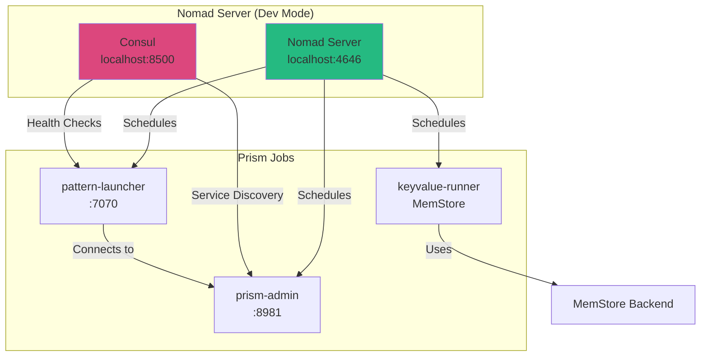

# MEMO-035: Nomad Local Development Setup for Prism Stack

## Purpose

Convert the current local binary testing setup (`prismctl local start`) to HashiCorp Nomad while maintaining the same ease of use, enabling developers to run the full Prism stack with production-like orchestration locally.

## Context

### Current Local Setup

The existing `prismctl local start` command (see `cmd/prismctl/cmd/local.go`) runs:

1. **prism-admin** on `:8981` (admin control plane)
2. **pattern-launcher** on `:7070` (pattern lifecycle manager)
3. **keyvalue-runner** (KeyValue pattern with MemStore backend)

**Current Characteristics**:
- Direct process execution from `build/binaries/`
- PID file management for process tracking
- Log files in `build/logs/`
- Health check polling (100ms intervals)
- Sequential startup with dependency ordering
- Simple commands: `start`, `stop`, `status`, `logs`

### Why Nomad?

**HashiCorp Nomad** provides production-like orchestration locally:

| Feature | Current (`prismctl local`) | Nomad |
|---------|---------------------------|-------|
| **Process Management** | Manual PID files | Automatic supervision |
| **Dependency Ordering** | Sequential delays | Service dependencies |
| **Health Checks** | Manual polling | Built-in health checks |
| **Scaling** | Fixed (1 instance each) | Dynamic scaling |
| **Resource Limits** | None | CPU/memory limits |
| **Service Discovery** | Hardcoded ports | Consul integration |
| **Logs** | File-based | Centralized logging |
| **Restarts** | Manual | Automatic restart policies |

**Benefits**:
- ✅ Production parity (same orchestrator dev → staging → prod)
- ✅ Real service discovery and health checks
- ✅ Resource isolation and limits
- ✅ Automatic restart on failure
- ✅ Rolling deployments and canaries
- ✅ Multi-datacenter support (future)

## Architecture

### Nomad Stack Components



### Job Hierarchy

```text
prism-stack.nomad (job file)
├── admin-group (group)
│   ├── prism-admin (task)
│   └── Health: HTTP :8981
├── launcher-group (group)
│   ├── pattern-launcher (task)
│   └── Health: HTTP :9093/health
└── keyvalue-group (group)
    ├── keyvalue-runner (task)
    └── Health: None (2s delay)
```

## Implementation

### 1. Install Nomad and Consul

#### macOS

```bash
# Install via Homebrew
brew tap hashicorp/tap
brew install hashicorp/tap/nomad
brew install hashicorp/tap/consul

# Verify installation
nomad version
consul version
```

#### Linux

```bash
# Debian/Ubuntu
wget -O- https://apt.releases.hashicorp.com/gpg | sudo gpg --dearmor -o /usr/share/keyrings/hashicorp-archive-keyring.gpg
echo "deb [signed-by=/usr/share/keyrings/hashicorp-archive-keyring.gpg] https://apt.releases.hashicorp.com $(lsb_release -cs) main" | sudo tee /etc/apt/sources.list.d/hashicorp.list
sudo apt update && sudo apt install nomad consul

# Fedora/RHEL
sudo dnf install -y dnf-plugins-core
sudo dnf config-manager --add-repo https://rpm.releases.hashicorp.com/fedora/hashicorp.repo
sudo dnf install nomad consul
```

### 2. Nomad Job Specification

Create `deployments/nomad/prism-stack.nomad`:

```hcl
# Prism Local Development Stack
job "prism-stack" {
  # Run in local datacenter
  datacenters = ["dc1"]

  # System job type (one instance per node)
  type = "service"

  # prism-admin group
  group "admin" {
    # Run exactly 1 instance
    count = 1

    # Network configuration
    network {
      mode = "host"

      port "grpc" {
        static = 8981
        to     = 8981
      }
    }

    # Restart policy
    restart {
      attempts = 3
      delay    = "10s"
      interval = "1m"
      mode     = "fail"
    }

    # prism-admin task
    task "prism-admin" {
      driver = "raw_exec"

      config {
        command = "${NOMAD_TASK_DIR}/../../binaries/prism-admin"
        args    = ["serve", "--port=8981"]
      }

      # Resource limits
      resources {
        cpu    = 500  # 0.5 CPU cores
        memory = 256  # 256 MB
      }

      # Health check
      service {
        name = "prism-admin"
        port = "grpc"

        check {
          type     = "grpc"
          interval = "10s"
          timeout  = "2s"
        }
      }

      # Log configuration
      logs {
        max_files     = 5
        max_file_size = 10  # 10 MB
      }
    }
  }

  # pattern-launcher group
  group "launcher" {
    count = 1

    network {
      mode = "host"

      port "grpc" {
        static = 7070
        to     = 7070
      }

      port "health" {
        static = 9093
        to     = 9093
      }
    }

    restart {
      attempts = 3
      delay    = "10s"
      interval = "1m"
      mode     = "fail"
    }

    task "pattern-launcher" {
      driver = "raw_exec"

      config {
        command = "${NOMAD_TASK_DIR}/../../binaries/pattern-launcher"
        args = [
          "--admin-endpoint=localhost:8981",
          "--launcher-id=launcher-01",
          "--grpc-port=7070",
          "--patterns-dir=${NOMAD_TASK_DIR}/../../patterns"
        ]
      }

      # Wait for admin to be ready
      template {
        data = <<EOF
{{ range service "prism-admin" }}
ADMIN_ADDR={{ .Address }}:{{ .Port }}
{{ end }}
EOF
        destination = "local/admin.env"
        env         = true
      }

      resources {
        cpu    = 1000  # 1 CPU core
        memory = 512   # 512 MB
      }

      service {
        name = "pattern-launcher"
        port = "health"

        check {
          type     = "http"
          path     = "/health"
          interval = "10s"
          timeout  = "2s"
        }
      }

      logs {
        max_files     = 5
        max_file_size = 10
      }
    }
  }

  # keyvalue-runner group
  group "keyvalue" {
    count = 1

    network {
      mode = "host"
    }

    restart {
      attempts = 3
      delay    = "10s"
      interval = "1m"
      mode     = "fail"
    }

    task "keyvalue-runner" {
      driver = "raw_exec"

      config {
        command = "${NOMAD_TASK_DIR}/../../binaries/keyvalue-runner"
        args    = ["--proxy-addr=localhost:9090"]
      }

      resources {
        cpu    = 500
        memory = 256
      }

      service {
        name = "keyvalue-runner"

        # No native health check, just service registration
        check {
          type     = "script"
          command  = "/bin/sh"
          args     = ["-c", "exit 0"]
          interval = "30s"
          timeout  = "5s"
        }
      }

      logs {
        max_files     = 5
        max_file_size = 10
      }
    }
  }
}
```

### 3. Simplified Nomad Job (Docker-Based)

Alternative using Docker driver (cleaner, production-ready):

Create `deployments/nomad/prism-stack-docker.nomad`:

```hcl
job "prism-stack" {
  datacenters = ["dc1"]
  type        = "service"

  group "admin" {
    count = 1

    network {
      port "grpc" {
        static = 8981
      }
    }

    task "prism-admin" {
      driver = "docker"

      config {
        image = "prism-admin:latest"
        ports = ["grpc"]

        # Mount local binaries (for development)
        volumes = [
          "${NOMAD_TASK_DIR}/../../binaries:/app"
        ]

        command = "/app/prism-admin"
        args    = ["serve", "--port=8981"]
      }

      resources {
        cpu    = 500
        memory = 256
      }

      service {
        name = "prism-admin"
        port = "grpc"

        check {
          type     = "grpc"
          interval = "10s"
          timeout  = "2s"
        }
      }
    }
  }

  group "launcher" {
    count = 1

    network {
      port "grpc" {
        static = 7070
      }
      port "health" {
        static = 9093
      }
    }

    task "pattern-launcher" {
      driver = "docker"

      config {
        image = "pattern-launcher:latest"
        ports = ["grpc", "health"]

        volumes = [
          "${NOMAD_TASK_DIR}/../../binaries:/app",
          "${NOMAD_TASK_DIR}/../../patterns:/patterns"
        ]

        command = "/app/pattern-launcher"
        args = [
          "--admin-endpoint=${NOMAD_ADDR_admin_grpc}",
          "--launcher-id=launcher-01",
          "--grpc-port=7070",
          "--patterns-dir=/patterns"
        ]
      }

      resources {
        cpu    = 1000
        memory = 512
      }

      service {
        name = "pattern-launcher"
        port = "health"

        check {
          type     = "http"
          path     = "/health"
          interval = "10s"
          timeout  = "2s"
        }
      }
    }
  }

  group "keyvalue" {
    count = 1

    task "keyvalue-runner" {
      driver = "docker"

      config {
        image = "keyvalue-runner:latest"

        volumes = [
          "${NOMAD_TASK_DIR}/../../binaries:/app"
        ]

        command = "/app/keyvalue-runner"
        args    = ["--proxy-addr=localhost:9090"]
      }

      resources {
        cpu    = 500
        memory = 256
      }

      service {
        name = "keyvalue-runner"
      }
    }
  }
}
```

### 4. Easy-to-Use Wrapper: `prismctl nomad` Command

Add new command to `cmd/prismctl/cmd/nomad.go`:

```go
package cmd

import (
	"fmt"
	"os"
	"os/exec"
	"path/filepath"
	"time"

	"github.com/spf13/cobra"
)

var nomadCmd = &cobra.Command{
	Use:   "nomad",
	Short: "Manage Prism stack using Nomad",
	Long: `Manage a local Prism stack using HashiCorp Nomad orchestration.

The nomad stack includes:
- Consul (service discovery and health checks)
- Nomad (job orchestration)
- prism-admin, pattern-launcher, keyvalue-runner (as Nomad jobs)

Nomad provides production-like orchestration with automatic restarts,
health checks, resource limits, and service discovery.`,
}

var nomadStartCmd = &cobra.Command{
	Use:   "start",
	Short: "Start Nomad and Prism stack",
	Long:  `Start Consul and Nomad in dev mode, then deploy the Prism stack.`,
	RunE: func(cmd *cobra.Command, args []string) error {
		return startNomadStack()
	},
}

var nomadStopCmd = &cobra.Command{
	Use:   "stop",
	Short: "Stop Nomad stack",
	Long:  `Stop the Prism Nomad job and shutdown Consul/Nomad.`,
	RunE: func(cmd *cobra.Command, args []string) error {
		return stopNomadStack()
	},
}

var nomadStatusCmd = &cobra.Command{
	Use:   "status",
	Short: "Show Nomad stack status",
	Long:  `Display the status of Nomad jobs and allocations.`,
	RunE: func(cmd *cobra.Command, args []string) error {
		return showNomadStackStatus()
	},
}

var nomadLogsCmd = &cobra.Command{
	Use:   "logs [task]",
	Short: "Show logs from Nomad tasks",
	Long:  `Show logs from Prism Nomad tasks using nomad alloc logs.`,
	Args:  cobra.MaximumNArgs(1),
	RunE: func(cmd *cobra.Command, args []string) error {
		task := ""
		if len(args) > 0 {
			task = args[0]
		}
		return showNomadStackLogs(task)
	},
}

var nomadUICmd = &cobra.Command{
	Use:   "ui",
	Short: "Open Nomad UI in browser",
	Long:  `Open the Nomad web UI at http://localhost:4646`,
	RunE: func(cmd *cobra.Command, args []string) error {
		fmt.Println("Opening Nomad UI at http://localhost:4646")
		return exec.Command("open", "http://localhost:4646").Run()
	},
}

func init() {
	rootCmd.AddCommand(nomadCmd)
	nomadCmd.AddCommand(nomadStartCmd)
	nomadCmd.AddCommand(nomadStopCmd)
	nomadCmd.AddCommand(nomadStatusCmd)
	nomadCmd.AddCommand(nomadLogsCmd)
	nomadCmd.AddCommand(nomadUICmd)
}

func startNomadStack() error {
	fmt.Println("🚀 Starting Prism stack with Nomad\n")

	// Find project root
	projectRoot, err := findProjectRoot()
	if err != nil {
		return fmt.Errorf("cannot find project root: %w", err)
	}

	// Step 1: Start Consul in dev mode
	fmt.Println("  Starting Consul...")
	consulCmd := exec.Command("consul", "agent", "-dev", "-ui")
	consulCmd.Stdout = os.Stdout
	consulCmd.Stderr = os.Stderr
	if err := consulCmd.Start(); err != nil {
		return fmt.Errorf("failed to start Consul: %w", err)
	}
	fmt.Printf("    ✅ Consul started (PID: %d)\n", consulCmd.Process.Pid)

	// Wait for Consul to be ready
	time.Sleep(2 * time.Second)

	// Step 2: Start Nomad in dev mode
	fmt.Println("  Starting Nomad...")
	nomadServerCmd := exec.Command("nomad", "agent", "-dev", "-bind=127.0.0.1")
	nomadServerCmd.Stdout = os.Stdout
	nomadServerCmd.Stderr = os.Stderr
	if err := nomadServerCmd.Start(); err != nil {
		return fmt.Errorf("failed to start Nomad: %w", err)
	}
	fmt.Printf("    ✅ Nomad started (PID: %d)\n", nomadServerCmd.Process.Pid)

	// Wait for Nomad to be ready
	time.Sleep(3 * time.Second)

	// Step 3: Deploy Prism stack job
	fmt.Println("  Deploying Prism stack...")
	jobFile := filepath.Join(projectRoot, "deployments", "nomad", "prism-stack.nomad")
	deployCmd := exec.Command("nomad", "job", "run", jobFile)
	deployCmd.Stdout = os.Stdout
	deployCmd.Stderr = os.Stderr
	if err := deployCmd.Run(); err != nil {
		return fmt.Errorf("failed to deploy Prism stack: %w", err)
	}
	fmt.Println("    ✅ Prism stack deployed")

	// Step 4: Wait for allocations to be running
	fmt.Println("\n  Waiting for services to be healthy...")
	time.Sleep(5 * time.Second)

	fmt.Printf("\n✅ Prism stack started with Nomad!\n\n")
	fmt.Println("📊 Access Points:")
	fmt.Println("  • Nomad UI:       http://localhost:4646")
	fmt.Println("  • Consul UI:      http://localhost:8500")
	fmt.Println("  • Admin Control:  localhost:8981")
	fmt.Println("  • Pattern Launcher: localhost:7070")
	fmt.Println()
	fmt.Println("📝 Commands:")
	fmt.Println("  • Status:  prismctl nomad status")
	fmt.Println("  • Logs:    prismctl nomad logs [task]")
	fmt.Println("  • UI:      prismctl nomad ui")
	fmt.Println("  • Stop:    prismctl nomad stop")

	return nil
}

func stopNomadStack() error {
	fmt.Println("🛑 Stopping Prism Nomad stack...")

	// Stop Nomad job
	fmt.Println("  Stopping Prism job...")
	stopJobCmd := exec.Command("nomad", "job", "stop", "-purge", "prism-stack")
	if err := stopJobCmd.Run(); err != nil {
		fmt.Printf("    ⚠️  Warning: %v\n", err)
	} else {
		fmt.Println("    ✅ Prism job stopped")
	}

	// Kill Nomad agent
	fmt.Println("  Stopping Nomad agent...")
	exec.Command("pkill", "-f", "nomad agent").Run()
	fmt.Println("    ✅ Nomad stopped")

	// Kill Consul agent
	fmt.Println("  Stopping Consul agent...")
	exec.Command("pkill", "-f", "consul agent").Run()
	fmt.Println("    ✅ Consul stopped")

	fmt.Println("\n✅ Prism Nomad stack stopped")
	return nil
}

func showNomadStackStatus() error {
	fmt.Println("📊 Prism Nomad Stack Status\n")

	// Show job status
	statusCmd := exec.Command("nomad", "job", "status", "prism-stack")
	statusCmd.Stdout = os.Stdout
	statusCmd.Stderr = os.Stderr
	if err := statusCmd.Run(); err != nil {
		return fmt.Errorf("failed to get job status: %w", err)
	}

	return nil
}

func showNomadStackLogs(task string) error {
	if task == "" {
		fmt.Println("Available tasks: admin, launcher, keyvalue")
		fmt.Println("Usage: prismctl nomad logs <task>")
		return nil
	}

	// Get allocation ID for task
	allocCmd := exec.Command("nomad", "job", "allocs", "prism-stack", "-json")
	allocOutput, err := allocCmd.Output()
	if err != nil {
		return fmt.Errorf("failed to get allocations: %w", err)
	}

	// Parse JSON to find allocation ID (simplified)
	// In production, use proper JSON parsing
	fmt.Printf("=== Logs for %s ===\n", task)

	// Show logs (this is simplified - needs proper alloc ID lookup)
	logsCmd := exec.Command("nomad", "alloc", "logs", "-job", "prism-stack", "-task", task)
	logsCmd.Stdout = os.Stdout
	logsCmd.Stderr = os.Stderr
	if err := logsCmd.Run(); err != nil {
		return fmt.Errorf("failed to get logs: %w", err)
	}

	return nil
}

func findProjectRoot() (string, error) {
	// Look for deployments/nomad directory
	cwd, _ := os.Getwd()
	for dir := cwd; dir != "/"; dir = filepath.Dir(dir) {
		nomadDir := filepath.Join(dir, "deployments", "nomad")
		if _, err := os.Stat(nomadDir); err == nil {
			return dir, nil
		}
	}
	return "", fmt.Errorf("could not find project root (looking for deployments/nomad)")
}
```

### 5. Usage Examples

#### Basic Workflow

```bash
# Start Nomad stack (all-in-one command)
prismctl nomad start

# Check status
prismctl nomad status

# View logs
prismctl nomad logs admin
prismctl nomad logs launcher

# Open Nomad UI
prismctl nomad ui

# Stop stack
prismctl nomad stop
```

#### Direct Nomad Commands

```bash
# Start Consul and Nomad manually
consul agent -dev -ui &
nomad agent -dev &

# Deploy job
cd deployments/nomad
nomad job run prism-stack.nomad

# Check status
nomad job status prism-stack
nomad alloc status <alloc-id>

# View logs
nomad alloc logs <alloc-id> prism-admin

# Scale up
nomad job scale prism-stack launcher 3

# Rolling update
nomad job run -check-index <index> prism-stack.nomad

# Stop job
nomad job stop prism-stack
```

#### Consul Service Discovery

```bash
# Query services
consul catalog services

# Get service details
consul catalog service prism-admin

# Health check status
consul watch -type=checks -service=prism-admin

# DNS-based discovery
dig @127.0.0.1 -p 8600 prism-admin.service.consul
```

## Comparison: Local Binary vs Nomad

| Aspect | `prismctl local` | `prismctl nomad` |
|--------|------------------|------------------|
| **Startup Command** | `prismctl local start` | `prismctl nomad start` |
| **Process Management** | PID files | Nomad supervision |
| **Health Checks** | Manual polling | Automatic (Consul) |
| **Service Discovery** | Hardcoded ports | Consul DNS/API |
| **Logs** | File in `build/logs/` | Nomad alloc logs |
| **Scaling** | Fixed 1 instance | Dynamic scaling |
| **Restart on Crash** | Manual | Automatic |
| **Resource Limits** | None | CPU/memory limits |
| **Production Parity** | Low | High |
| **Complexity** | Simple | Moderate |
| **Prerequisites** | None | Nomad + Consul |

**Recommendation**:
- **Development (inner loop)**: Use `prismctl local` for fast iteration
- **Integration testing**: Use `prismctl nomad` for production-like environment
- **CI/CD**: Use Nomad with Docker driver
- **Production**: Use Nomad with proper multi-node cluster

## Advanced Features

### Rolling Deployments

```hcl
job "prism-stack" {
  update {
    max_parallel     = 1
    min_healthy_time = "10s"
    healthy_deadline = "3m"
    auto_revert      = true
  }

  # ... rest of job
}
```

**Usage**:
```bash
# Update job (rolling deployment)
nomad job run prism-stack.nomad

# Monitor deployment
nomad deployment status <deployment-id>

# Promote if canary
nomad deployment promote <deployment-id>
```

### Canary Deployments

```hcl
group "launcher" {
  count = 3

  update {
    canary       = 1
    max_parallel = 1
  }

  # ... rest of group
}
```

**Workflow**:
1. Deploy new version → 1 canary + 2 old
2. Test canary allocation
3. Promote if healthy → rolling update remaining

### Multi-Region Setup

```hcl
job "prism-stack" {
  datacenters = ["dc1", "dc2", "dc3"]
  region      = "global"

  multiregion {
    strategy {
      max_parallel = 1
      on_failure   = "fail_all"
    }

    region {
      name        = "us-west"
      count       = 3
      datacenters = ["us-west-1a", "us-west-1b"]
    }

    region {
      name        = "us-east"
      count       = 3
      datacenters = ["us-east-1a", "us-east-1b"]
    }
  }
}
```

### Vault Integration (Secrets)

```hcl
task "prism-admin" {
  vault {
    policies = ["prism-admin"]
  }

  template {
    data = <<EOF
{{ with secret "secret/prism/admin" }}
DB_PASSWORD={{ .Data.data.password }}
{{ end }}
EOF
    destination = "secrets/db.env"
    env         = true
  }
}
```

## Migration Path

### Phase 1: Hybrid Approach

Run both side-by-side during transition:

```bash
# Option 1: Local binaries (fast iteration)
prismctl local start

# Option 2: Nomad (integration testing)
prismctl nomad start
```

### Phase 2: Nomad by Default

Make Nomad the primary local development method:

```bash
# Default to Nomad
prismctl start  # Alias to: prismctl nomad start

# Fallback to direct execution
prismctl local start  # Still available
```

### Phase 3: Production Deployment

Use the same Nomad job files in production:

```bash
# Dev environment
nomad job run -var="env=dev" prism-stack.nomad

# Staging environment
nomad job run -var="env=staging" prism-stack.nomad

# Production environment
nomad job run -var="env=production" prism-stack.nomad
```

## Troubleshooting

### Nomad Not Starting

```bash
# Check if port 4646 is in use
lsof -i :4646

# View Nomad logs
nomad agent -dev -log-level=debug

# Check Nomad node status
nomad node status
```

### Job Failing to Allocate

```bash
# Check why job not scheduled
nomad job status prism-stack

# View allocation failures
nomad alloc status <alloc-id>

# Check resource availability
nomad node status -verbose
```

### Service Not Registering with Consul

```bash
# Check Consul connectivity
consul members

# View service registrations
consul catalog services

# Check Nomad-Consul integration
nomad agent-info | grep consul
```

### Health Checks Failing

```bash
# View health check status
consul watch -type=checks -service=prism-admin

# Check service endpoint manually
curl http://localhost:8981/health

# View Nomad health check logs
nomad alloc logs <alloc-id> prism-admin
```

## Performance Considerations

### Resource Limits

**Recommended settings for local development**:

```hcl
resources {
  cpu    = 500   # 0.5 CPU cores (50% of 1 core)
  memory = 256   # 256 MB RAM
}
```

**For production**:

```hcl
resources {
  cpu    = 2000  # 2 CPU cores
  memory = 1024  # 1 GB RAM

  memory_max = 2048  # Allow bursting to 2 GB
}
```

### Nomad Agent Configuration

For better local performance:

```hcl
# Save as: nomad-dev.hcl
server {
  enabled = true
  bootstrap_expect = 1
}

client {
  enabled = true

  # Disable resource fingerprinting for faster startup
  options {
    "driver.raw_exec.enable" = "1"
    "docker.cleanup.image"   = "false"
  }
}
```

**Run with config**:
```bash
nomad agent -dev -config=nomad-dev.hcl
```

## Related Documents

- [ADR-049: Podman Container Optimization](/adr/adr-049) - Container runtime decision
- [MEMO-007: Podman Demo for Scratch-Based Containers](/memos/memo-007) - Container image optimization
- [MEMO-034: Pattern Launcher Quickstart](/memos/memo-034) - Pattern launcher guide
- [RFC-016: Local Development Infrastructure](/rfc/rfc-016) - Local dev infrastructure strategy

## Future Enhancements

### 1. Nomad Job Pack

Create HashiCorp Pack for one-command deployment:

```bash
nomad-pack run prism-stack --var="version=latest"
```

### 2. Terraform Integration

Manage Nomad jobs with Terraform:

```hcl
resource "nomad_job" "prism_stack" {
  jobspec = file("${path.module}/prism-stack.nomad")

  hcl2 {
    enabled = true
  }
}
```

### 3. GitHub Actions Integration

Automate deployments in CI:

```yaml
- name: Deploy to Nomad
  run: |
    nomad job run \
      -var="version=${{ github.sha }}" \
      deployments/nomad/prism-stack.nomad
```

### 4. Monitoring with Prometheus

Add metrics collection:

```hcl
task "prism-admin" {
  service {
    name = "prism-admin"

    tags = ["prometheus"]

    meta {
      prometheus_port = "9090"
      prometheus_path = "/metrics"
    }
  }
}
```

## Revision History

- 2025-10-16: Initial draft covering Nomad setup for local Prism stack development
