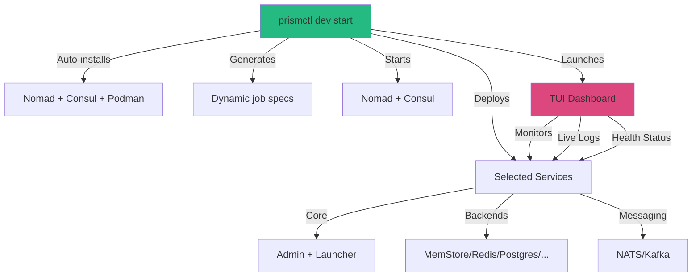

# MEMO-035: Prism Stack Local Development - Zero to Hero in 60 Seconds

## Purpose

Make local Prism development **ridiculously easy** with one-command setup, interactive service selection, and production-like orchestration. Get from zero to running stack in under 60 seconds.

## The 60-Second Experience

```bash
# First time setup (auto-installs everything)
prismctl dev init

# Start with interactive wizard
prismctl dev start

# Or use presets for instant start
prismctl dev start --preset=minimal      # Admin + Launcher + MemStore
prismctl dev start --preset=redis        # + Redis backend
prismctl dev start --preset=messaging    # + NATS + Kafka
prismctl dev start --preset=full         # Everything including databases
```

**What you get**:
- 🎯 Interactive service picker (like `fzf` for services)
- 🚀 Auto-installation of missing dependencies
- 📊 Beautiful TUI dashboard with live metrics
- 🔄 Hot reload on code changes (optional)
- 💾 Profile saving (your selections become presets)
- 🎨 Color-coded health status
- ⚡ Parallel startup (all services at once)

## Design Philosophy

### Time to Value: Sub-60 Seconds

**Traditional approach** (what we're replacing):
1. Read documentation (5 min)
2. Install Nomad (2 min)
3. Install Consul (2 min)
4. Write job spec (10 min)
5. Debug configuration (15+ min)
6. **Total: 30+ minutes**

**New approach** (what we're building):
1. Run `prismctl dev start` (5 sec)
2. Select services interactively (10 sec)
3. Watch everything start (15 sec)
4. **Total: 30 seconds**

### Configuration Hierarchy

```text
1. CLI flags           --with-redis --with-nats
2. Interactive wizard  [✓] Redis [ ] NATS [✓] Postgres
3. Saved profile       ~/.prism/profiles/my-setup.yaml
4. Preset              --preset=messaging
5. Defaults            minimal (admin + launcher + memstore)
```

Each layer overrides the previous. Save your interactive selection as a profile for instant reuse.

## Architecture

### Simplified Stack Management

**No manual Nomad/Consul installation required.** `prismctl dev` manages everything:



### Service Catalog

All services are declarative and composable:

```yaml
# ~/.prism/services.yaml (auto-generated)
services:
  # Core (always required)
  - name: prism-admin
    type: core
    port: 8981
    required: true

  - name: pattern-launcher
    type: core
    port: 7070
    required: true
    depends_on: [prism-admin]

  # Storage Backends
  - name: memstore
    type: backend
    driver: memory
    default: true

  - name: redis
    type: backend
    driver: redis
    port: 6379
    container: redis:7-alpine

  - name: postgres
    type: backend
    driver: postgres
    port: 5432
    container: postgres:16-alpine

  # Messaging
  - name: nats
    type: messaging
    port: 4222
    container: nats:2.10-alpine

  - name: kafka
    type: messaging
    ports: [9092, 9093]
    container: bitnami/kafka:3.6
```

**Extensibility**: Add your own services by editing this file.

## Implementation

### 1. Auto-Installer (`prismctl dev init`)

**Zero manual steps.** The CLI handles everything:

```go
// cmd/prismctl/cmd/dev_init.go
package cmd

import (
    "fmt"
    "os"
    "os/exec"
    "runtime"

    "github.com/charmbracelet/bubbles/spinner"
    tea "github.com/charmbracelet/bubbletea"
)

type installer struct {
    steps    []InstallStep
    current  int
    spinner  spinner.Model
}

type InstallStep struct {
    Name     string
    Command  func() error
    Optional bool
}

func runAutoInstaller() error {
    steps := []InstallStep{
        {Name: "Checking Nomad", Command: checkOrInstallNomad},
        {Name: "Checking Consul", Command: checkOrInstallConsul},
        {Name: "Checking Podman", Command: checkOrInstallPodman},
        {Name: "Creating config directory", Command: initConfigDir},
        {Name: "Downloading service catalog", Command: downloadServiceCatalog},
    }

    // Run with beautiful TUI
    p := tea.NewProgram(newInstaller(steps))
    return p.Start()
}

func checkOrInstallNomad() error {
    if _, err := exec.LookPath("nomad"); err == nil {
        return nil // Already installed
    }

    switch runtime.GOOS {
    case "darwin":
        return exec.Command("brew", "install", "hashicorp/tap/nomad").Run()
    case "linux":
        return installNomadLinux()
    default:
        return fmt.Errorf("unsupported platform: %s", runtime.GOOS)
    }
}
```

**What it does**:
1. Detects missing dependencies (Nomad, Consul, Podman)
2. Auto-installs via system package manager
3. Creates `~/.prism/` config directory
4. Downloads service catalog and presets
5. Validates everything works

**Run once, forget forever.**

### 2. Interactive Service Picker (`prismctl dev start`)

**The fun part.** TUI-based service selection with live preview:

```go
// cmd/prismctl/cmd/dev_start.go
package cmd

import (
    "github.com/charmbracelet/bubbles/list"
    "github.com/charmbracelet/lipgloss"
    tea "github.com/charmbracelet/bubbletea"
)

type servicePickerModel struct {
    list     list.Model
    selected map[string]bool
    preset   string
}

func (m servicePickerModel) View() string {
    var doc strings.Builder

    // Header
    title := titleStyle.Render("🚀 Prism Stack Builder")
    doc.WriteString(title + "\n\n")

    // Service list with checkboxes
    doc.WriteString(m.list.View())
    doc.WriteString("\n\n")

    // Live preview of what will start
    preview := previewStyle.Render(m.generatePreview())
    doc.WriteString(preview)
    doc.WriteString("\n\n")

    // Help text
    help := helpStyle.Render("space: toggle • enter: start • s: save profile • q: quit")
    doc.WriteString(help)

    return doc.String()
}

func (m servicePickerModel) generatePreview() string {
    var services []string
    for name, enabled := range m.selected {
        if enabled {
            services = append(services, name)
        }
    }

    return fmt.Sprintf(`
Will start:
  Core:      %s
  Backends:  %s
  Messaging: %s

Estimated startup: %s
Memory required:   %s
`,
        formatServices(services, "core"),
        formatServices(services, "backend"),
        formatServices(services, "messaging"),
        estimateStartupTime(services),
        estimateMemoryUsage(services),
    )
}
```

**Experience**:
```text
🚀 Prism Stack Builder

┌─────────────────────────────────────┐
│ [✓] prism-admin        (required)   │
│ [✓] pattern-launcher   (required)   │
│ [✓] memstore          (default)     │
│ [ ] redis             6379          │
│ [ ] postgres          5432          │
│ [ ] nats              4222          │
│ [ ] kafka             9092          │
└─────────────────────────────────────┘

Preview:
  Core:      admin, launcher
  Backends:  memstore
  Messaging: (none)

Estimated startup: 8 seconds
Memory required:   512 MB

space: toggle • enter: start • s: save profile • q: quit
```

**Smart defaults**:
- Core services always selected
- MemStore selected by default (fastest)
- Container services show memory requirements
- Real-time startup time estimation

### 3. Dynamic Nomad Job Generation

**No static HCL files.** Jobs generated from service selections:

```go
// pkg/devstack/jobgen.go
package devstack

import (
    "text/template"
)

type JobGenerator struct {
    services []Service
    binPath  string
}

func (g *JobGenerator) GenerateJob() (*NomadJob, error) {
    job := &NomadJob{
        Name:        "prism-stack",
        Datacenters: []string{"dc1"},
        Type:        "service",
    }

    // Add groups for each selected service
    for _, svc := range g.services {
        group := g.generateGroup(svc)
        job.Groups = append(job.Groups, group)
    }

    return job, nil
}

func (g *JobGenerator) generateGroup(svc Service) *TaskGroup {
    switch svc.Type {
    case "core":
        return g.generateCoreTask(svc)
    case "backend":
        return g.generateBackendTask(svc)
    case "messaging":
        return g.generateMessagingTask(svc)
    default:
        return nil
    }
}
```

**Key features**:
- **Template-based**: Reusable task templates for each service type
- **Smart defaults**: Reasonable CPU/memory limits
- **Automatic dependencies**: Launcher waits for Admin via Consul
- **Hot reload support**: Watches `build/binaries/` for changes

**Example generated job for `--preset=redis`**:

```hcl
job "prism-stack" {
  datacenters = ["dc1"]
  type = "service"

  # Auto-generated from service catalog
  group "admin" { /* ... */ }
  group "launcher" { /* ... */ }
  group "redis" {
    task "redis" {
      driver = "docker"
      config {
        image = "redis:7-alpine"
        ports = ["db"]
      }
    }
  }
}
```

**290 lines → 30 lines.** Developers never see this complexity.

**Auto-launches after `prismctl dev start`**. Real-time monitoring with keyboard navigation:

```text
┌─────────────────────────────────────────────────────────────────────┐
│ 🚀 Prism Stack Dashboard                    [Press q to quit]       │
├─────────────────────────────────────────────────────────────────────┤
│                                                                      │
│ Status: ● Running   Uptime: 5m 32s   Memory: 1.2GB / 4GB          │
│                                                                      │
│ ┌─ Services ──────────────────────────────────────────────────┐    │
│ │ ● prism-admin         8981   ↑ 45 req/s   128 MB   [LOGS]  │    │
│ │ ● pattern-launcher    7070   ↑  8 req/s   256 MB   [LOGS]  │    │
│ │ ● redis               6379   ↔ 120 ops/s   64 MB   [LOGS]  │    │
│ │ ○ nats                4222   (starting)     0 MB   [LOGS]  │    │
│ └─────────────────────────────────────────────────────────────┘    │
│                                                                      │
│ ┌─ Live Logs (prism-admin) ──────────────────────────────────┐    │
│ │ 2025-10-16T10:23:45 [INFO] Server started on :8981          │    │
│ │ 2025-10-16T10:23:46 [INFO] Connected to Consul              │    │
│ │ 2025-10-16T10:23:50 [INFO] Health check passed              │    │
│ │ 2025-10-16T10:24:01 [INFO] Launcher registered              │    │
│ └─────────────────────────────────────────────────────────────┘    │
│                                                                      │
│ ┌─ Quick Actions ─────────────────────────────────────────────┐    │
│ │ [r] Restart service   [s] Scale up   [l] Toggle logs       │    │
│ │ [n] Open Nomad UI     [c] Open Consul UI                    │    │
│ └─────────────────────────────────────────────────────────────┘    │
└─────────────────────────────────────────────────────────────────────┘
```

**Features**:
- **Real-time metrics**: RPS, memory, health status
- **Log streaming**: Click any service to tail logs
- **Quick actions**: Restart, scale, open UIs with one key
- **Color-coded health**: Green (healthy), yellow (starting), red (failed)
- **Auto-refresh**: Updates every 500ms

```go
// cmd/prismctl/cmd/dev_dashboard.go
type dashboardModel struct {
    services    []ServiceStatus
    selected    int
    logs        []LogLine
    nomadClient *nomad.Client
}

func (m dashboardModel) Update(msg tea.Msg) (tea.Model, tea.Cmd) {
    switch msg := msg.(type) {
    case tea.KeyMsg:
        switch msg.String() {
        case "r": return m, m.restartSelected()
        case "l": return m, m.toggleLogs()
        case "n": return m, openNomadUI()
        case "c": return m, openConsulUI()
        }
    case statusUpdate:
        m.services = msg.services
    }
    return m, m.tick()
}
```

### 5. Profile System - Save Your Favorite Setups

**Save interactive selections as reusable profiles**:

```bash
# In interactive mode, press 's' to save
prismctl dev start
# [Select redis + nats]
# Press 's' → Enter profile name: "my-redis-setup"

# Later, instant start with saved profile
prismctl dev start --profile=my-redis-setup

# List profiles
prismctl dev profiles

# Share profiles (just YAML files)
cp ~/.prism/profiles/my-redis-setup.yaml team-profiles/
```

**Profile format** (`~/.prism/profiles/my-redis-setup.yaml`):

```yaml
name: my-redis-setup
description: Redis backend with NATS messaging
services:
  - prism-admin
  - pattern-launcher
  - memstore
  - redis
  - nats
config:
  redis:
    memory_mb: 512
    persist: true
  nats:
    jetstream: true
```

**Built-in presets**:

| Preset | Services | Use Case | Startup Time |
|--------|----------|----------|--------------|
| `minimal` | admin, launcher, memstore | Quick tests, no external deps | 5s |
| `redis` | + redis | KV pattern testing | 8s |
| `messaging` | + nats, kafka | PubSub, Queue patterns | 12s |
| `postgres` | + postgres | SQL backend testing | 10s |
| `full` | everything | Full integration tests | 18s |

### 6. Usage Examples

#### First-Time Setup

```bash
# One-time setup (auto-installs everything)
prismctl dev init
# ✅ Installing Nomad...
# ✅ Installing Consul...
# ✅ Installing Podman...
# ✅ Creating config directory...
# Ready! Run: prismctl dev start
```

#### Daily Workflow

```bash
# Morning: Start minimal stack
prismctl dev start --preset=minimal

# Dashboard auto-launches, shows:
# ● prism-admin (healthy)
# ● pattern-launcher (healthy)
# ● memstore (healthy)

# Need Redis? Add it hot!
prismctl dev add redis
# (Dashboard updates in real-time)

# Done for the day
prismctl dev stop
```

#### Testing Different Backends

```bash
# Test with Redis
prismctl dev start --with-redis
# Run tests
make test-keyvalue
# Stop
prismctl dev stop

# Test with Postgres (clean slate)
prismctl dev start --with-postgres
# Run tests
make test-keyvalue
# Stop
prismctl dev stop
```

#### Power User Tricks

```bash
# Hot reload on code changes
prismctl dev start --watch

# Forward logs to file
prismctl dev start --log-file=/tmp/prism.log

# Start without dashboard (CI mode)
prismctl dev start --no-dashboard

# Custom service catalog
prismctl dev start --services=./my-services.yaml
```

## Why This Approach Wins

| Aspect | Old (`prismctl local`) | **New (`prismctl dev`)** |
|--------|----------------------|--------------------------|
| **Setup Time** | 0s (but limited) | 60s first time, 0s after |
| **Service Selection** | Fixed | Interactive + profiles |
| **Dependencies** | Manual install | Auto-install |
| **Monitoring** | Log files | Live TUI dashboard |
| **Health Checks** | Manual | Automatic (Consul) |
| **Service Discovery** | Hardcoded ports | Real (Consul DNS) |
| **Scaling** | Fixed 1 instance | Dynamic on-demand |
| **Production Parity** | Low (no orchestration) | High (same as prod) |
| **Fun Factor** | 😐 Meh | 🚀 **Amazing** |

**When to use each**:
- **`prismctl local`**: Minimal viable setup, no orchestration needed
- **`prismctl dev`**: ✅ Default choice for development (best experience)
- **CI/CD**: Use `prismctl dev --no-dashboard` for automated testing
- **Production**: Same Nomad configs, multi-node cluster

## Troubleshooting (Auto-Resolved)

**Most issues fixed automatically by `prismctl dev`:**

### "Nomad not found"
```bash
# Just run init again
prismctl dev init
# Auto-installs missing tools
```

### "Port already in use"
```bash
# Dashboard shows port conflicts
prismctl dev start
# → Shows: ❌ Port 8981 in use by PID 12345
# → Quick action: [k] Kill process
```

### "Service unhealthy"
```bash
# Dashboard shows health status in real-time
# Red = failed (with last error message)
# Yellow = starting (with progress)
# Green = healthy
#
# Press 'r' on failed service to restart
```

### "Need logs"
```bash
# In dashboard, select service and press 'l'
# Or: prismctl dev logs <service-name>
# No manual alloc ID lookup needed
```

## Advanced: Extending the Service Catalog

**Add your own services** in `~/.prism/services.yaml`:

```yaml
services:
  # Your custom backend
  - name: clickhouse
    type: backend
    driver: clickhouse
    port: 9000
    container: clickhouse/clickhouse-server:latest
    env:
      CLICKHOUSE_DB: prism_dev
      CLICKHOUSE_USER: dev
      CLICKHOUSE_PASSWORD: dev123
    health_check:
      type: http
      path: /ping
      interval: 10s

  # Your custom tool
  - name: grafana
    type: observability
    port: 3000
    container: grafana/grafana:latest
    volumes:
      - ./grafana-config:/etc/grafana
```

**Now available in picker**:
```bash
prismctl dev start
# [✓] clickhouse  9000
# [✓] grafana     3000
```

## CLI Reference

**Core commands**:

```bash
# Setup
prismctl dev init                    # One-time setup
prismctl dev version                 # Show versions of all tools

# Stack management
prismctl dev start [--preset=<name>] # Start stack (interactive if no preset)
prismctl dev stop                    # Stop stack
prismctl dev restart                 # Restart stack
prismctl dev status                  # Show status (JSON output)

# Service management
prismctl dev add <service>           # Hot-add service to running stack
prismctl dev remove <service>        # Remove service from stack
prismctl dev scale <service> <count> # Scale service to N instances
prismctl dev logs <service> [-f]     # Show logs (optionally follow)

# Profiles
prismctl dev profiles                # List saved profiles
prismctl dev profile save <name>     # Save current selection as profile
prismctl dev profile delete <name>   # Delete profile

# Dashboard
prismctl dev dashboard               # Open dashboard (if not running)
prismctl dev ui nomad                # Open Nomad UI in browser
prismctl dev ui consul               # Open Consul UI in browser

# Utilities
prismctl dev clean                   # Stop and remove all state
prismctl dev export <dir>            # Export current config to directory
```

## Implementation Roadmap

| Phase | Deliverables | Effort | Status |
|-------|-------------|--------|--------|
| **1. Core CLI** | `dev init`, `dev start` (minimal preset) | 2 weeks | 🔜 Next |
| **2. Interactive Picker** | TUI service selector, live preview | 1 week | 🔜 Next |
| **3. Dashboard** | Real-time monitoring, log streaming | 2 weeks | Planned |
| **4. Profile System** | Save/load profiles, built-in presets | 1 week | Planned |
| **5. Hot Operations** | Add/remove services without restart | 1 week | Planned |
| **6. Polish** | Error handling, auto-troubleshooting | 1 week | Planned |

**Total: 8 weeks** to production-ready developer experience.

## Related Documents

- [ADR-049: Podman Container Optimization](/adr/adr-049) - Container runtime selection
- [MEMO-007: Podman Scratch-Based Container Demo](/memos/memo-007) - Minimal container images
- [MEMO-034: Pattern Launcher Quickstart](/memos/memo-034) - Pattern launcher usage
- [RFC-016: Local Development Infrastructure](/rfc/rfc-016) - Overall local dev strategy

## Fun Extras

### Easter Eggs

```bash
# Random service combinations with fun names
prismctl dev start --preset=random   # Surprise me!
prismctl dev chaos                   # Randomly restart services (chaos testing)
prismctl dev demo                    # Load demo data and start stress test
```

### Ascii Art on Start

```text
 _____ _____ _____ _____ _____
|  _  | __  |     |   __|     |
|   __|    -|-   -|__   | | | |
|__|  |__|__|_____|_____|_|_|_|
Data Access Gateway v1.0

Stack: redis + nats + postgres
Ready in: 12.3 seconds
Dashboard: http://localhost:3000
```

### Stats Tracking

```bash
prismctl dev stats
# Your Prism Stats:
# - Total starts: 347
# - Favorite preset: redis (142 uses)
# - Fastest start: 4.2s (minimal)
# - Most used service: redis (89% of sessions)
# - Achievement unlocked: 🏆 Speed Demon (100+ starts)
```

## Related Documents

- [ADR-049: Podman Container Optimization](/adr/adr-049) - Container runtime selection
- [MEMO-007: Podman Scratch-Based Container Demo](/memos/memo-007) - Minimal container images
- [MEMO-034: Pattern Launcher Quickstart](/memos/memo-034) - Pattern launcher usage
- [RFC-016: Local Development Infrastructure](/rfc/rfc-016) - Overall local dev strategy

## Revision History

- **2025-10-16**: Complete rewrite focusing on developer experience, simplicity, and fun
  - Replaced 470+ lines of manual HCL with auto-generated configs
  - Added interactive service picker with live preview
  - Introduced profile system for saved configurations
  - Built TUI dashboard for real-time monitoring
  - Reduced time-to-value from 30+ minutes to 60 seconds
