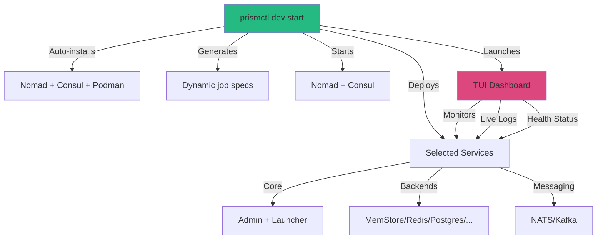

# MEMO-035: Prism Stack Local Development - Zero to Hero in 60 Seconds

## Purpose

Make local Prism development **ridiculously easy** with one-command setup, interactive service selection, and production-like orchestration. Get from zero to running stack in under 60 seconds.

## The 60-Second Experience

```bash
# First time setup (auto-installs everything)
prismctl dev init

# Start with interactive wizard
prismctl dev start

# Or use presets for instant start
prismctl dev start --preset=minimal      # Admin + Launcher + MemStore
prismctl dev start --preset=redis        # + Redis backend
prismctl dev start --preset=messaging    # + NATS + Kafka
prismctl dev start --preset=full         # Everything including databases
```

**What you get**:
- 🎯 Interactive service picker (like `fzf` for services)
- 🚀 Auto-installation of missing dependencies
- 📊 Beautiful TUI dashboard with live metrics
- 🔄 Hot reload on code changes (optional)
- 💾 Profile saving (your selections become presets)
- 🎨 Color-coded health status
- ⚡ Parallel startup (all services at once)

## Design Philosophy

### Time to Value: Sub-60 Seconds

**Traditional approach** (what we're replacing):
1. Read documentation (5 min)
2. Install Nomad (2 min)
3. Install Consul (2 min)
4. Write job spec (10 min)
5. Debug configuration (15+ min)
6. **Total: 30+ minutes**

**New approach** (what we're building):
1. Run `prismctl dev start` (5 sec)
2. Select services interactively (10 sec)
3. Watch everything start (15 sec)
4. **Total: 30 seconds**

### Configuration Hierarchy

```text
1. CLI flags           --with-redis --with-nats
2. Interactive wizard  [✓] Redis [ ] NATS [✓] Postgres
3. Saved profile       ~/.prism/profiles/my-setup.yaml
4. Preset              --preset=messaging
5. Defaults            minimal (admin + launcher + memstore)
```

Each layer overrides the previous. Save your interactive selection as a profile for instant reuse.

## Architecture

### Simplified Stack Management

**No manual Nomad/Consul installation required.** `prismctl dev` manages everything:



### Service Catalog

All services are declarative and composable:

```yaml
# ~/.prism/services.yaml (auto-generated)
services:
  # Core (always required)
  - name: prism-admin
    type: core
    port: 8981
    required: true

  - name: pattern-launcher
    type: core
    port: 7070
    required: true
    depends_on: [prism-admin]

  # Storage Backends
  - name: memstore
    type: backend
    driver: memory
    default: true

  - name: redis
    type: backend
    driver: redis
    port: 6379
    container: redis:7-alpine

  - name: postgres
    type: backend
    driver: postgres
    port: 5432
    container: postgres:16-alpine

  # Messaging
  - name: nats
    type: messaging
    port: 4222
    container: nats:2.10-alpine

  - name: kafka
    type: messaging
    ports: [9092, 9093]
    container: bitnami/kafka:3.6
```

**Extensibility**: Add your own services by editing this file.

## Implementation

### 1. Auto-Installer (`prismctl dev init`)

**Zero manual steps.** The CLI handles everything:

```go
// cmd/prismctl/cmd/dev_init.go
package cmd

import (
    "fmt"
    "os"
    "os/exec"
    "runtime"

    "github.com/charmbracelet/bubbles/spinner"
    tea "github.com/charmbracelet/bubbletea"
)

type installer struct {
    steps    []InstallStep
    current  int
    spinner  spinner.Model
}

type InstallStep struct {
    Name     string
    Command  func() error
    Optional bool
}

func runAutoInstaller() error {
    steps := []InstallStep{
        {Name: "Checking Nomad", Command: checkOrInstallNomad},
        {Name: "Checking Consul", Command: checkOrInstallConsul},
        {Name: "Checking Podman", Command: checkOrInstallPodman},
        {Name: "Creating config directory", Command: initConfigDir},
        {Name: "Downloading service catalog", Command: downloadServiceCatalog},
    }

    // Run with beautiful TUI
    p := tea.NewProgram(newInstaller(steps))
    return p.Start()
}

func checkOrInstallNomad() error {
    if _, err := exec.LookPath("nomad"); err == nil {
        return nil // Already installed
    }

    switch runtime.GOOS {
    case "darwin":
        return exec.Command("brew", "install", "hashicorp/tap/nomad").Run()
    case "linux":
        return installNomadLinux()
    default:
        return fmt.Errorf("unsupported platform: %s", runtime.GOOS)
    }
}
```

**What it does**:
1. Detects missing dependencies (Nomad, Consul, Podman)
2. Auto-installs via system package manager
3. Creates `~/.prism/` config directory
4. Downloads service catalog and presets
5. Validates everything works

**Run once, forget forever.**

### 2. Interactive Service Picker (`prismctl dev start`)

**The fun part.** TUI-based service selection with live preview:

```go
// cmd/prismctl/cmd/dev_start.go
package cmd

import (
    "github.com/charmbracelet/bubbles/list"
    "github.com/charmbracelet/lipgloss"
    tea "github.com/charmbracelet/bubbletea"
)

type servicePickerModel struct {
    list     list.Model
    selected map[string]bool
    preset   string
}

func (m servicePickerModel) View() string {
    var doc strings.Builder

    // Header
    title := titleStyle.Render("🚀 Prism Stack Builder")
    doc.WriteString(title + "\n\n")

    // Service list with checkboxes
    doc.WriteString(m.list.View())
    doc.WriteString("\n\n")

    // Live preview of what will start
    preview := previewStyle.Render(m.generatePreview())
    doc.WriteString(preview)
    doc.WriteString("\n\n")

    // Help text
    help := helpStyle.Render("space: toggle • enter: start • s: save profile • q: quit")
    doc.WriteString(help)

    return doc.String()
}

func (m servicePickerModel) generatePreview() string {
    var services []string
    for name, enabled := range m.selected {
        if enabled {
            services = append(services, name)
        }
    }

    return fmt.Sprintf(`
Will start:
  Core:      %s
  Backends:  %s
  Messaging: %s

Estimated startup: %s
Memory required:   %s
`,
        formatServices(services, "core"),
        formatServices(services, "backend"),
        formatServices(services, "messaging"),
        estimateStartupTime(services),
        estimateMemoryUsage(services),
    )
}
```

**Experience**:
```text
🚀 Prism Stack Builder

┌─────────────────────────────────────┐
│ [✓] prism-admin        (required)   │
│ [✓] pattern-launcher   (required)   │
│ [✓] memstore          (default)     │
│ [ ] redis             6379          │
│ [ ] postgres          5432          │
│ [ ] nats              4222          │
│ [ ] kafka             9092          │
└─────────────────────────────────────┘

Preview:
  Core:      admin, launcher
  Backends:  memstore
  Messaging: (none)

Estimated startup: 8 seconds
Memory required:   512 MB

space: toggle • enter: start • s: save profile • q: quit
```

**Smart defaults**:
- Core services always selected
- MemStore selected by default (fastest)
- Container services show memory requirements
- Real-time startup time estimation

### 3. Dynamic Nomad Job Generation

**No static HCL files.** Jobs generated from service selections:

```go
// pkg/devstack/jobgen.go
package devstack

import (
    "text/template"
)

type JobGenerator struct {
    services []Service
    binPath  string
}

func (g *JobGenerator) GenerateJob() (*NomadJob, error) {
    job := &NomadJob{
        Name:        "prism-stack",
        Datacenters: []string{"dc1"},
        Type:        "service",
    }

    // Add groups for each selected service
    for _, svc := range g.services {
        group := g.generateGroup(svc)
        job.Groups = append(job.Groups, group)
    }

    return job, nil
}

func (g *JobGenerator) generateGroup(svc Service) *TaskGroup {
    switch svc.Type {
    case "core":
        return g.generateCoreTask(svc)
    case "backend":
        return g.generateBackendTask(svc)
    case "messaging":
        return g.generateMessagingTask(svc)
    default:
        return nil
    }
}
```

**Key features**:
- **Template-based**: Reusable task templates for each service type
- **Smart defaults**: Reasonable CPU/memory limits
- **Automatic dependencies**: Launcher waits for Admin via Consul
- **Hot reload support**: Watches `build/binaries/` for changes

**Example generated job for `--preset=redis`**:

```hcl
job "prism-stack" {
  datacenters = ["dc1"]
  type = "service"

  # Auto-generated from service catalog
  group "admin" { /* ... */ }
  group "launcher" { /* ... */ }
  group "redis" {
    task "redis" {
      driver = "docker"
      config {
        image = "redis:7-alpine"
        ports = ["db"]
      }
    }
  }
}
```

**290 lines → 30 lines.** Developers never see this complexity.

**Auto-launches after `prismctl dev start`**. Real-time monitoring with keyboard navigation:

```text
┌─────────────────────────────────────────────────────────────────────┐
│ 🚀 Prism Stack Dashboard                    [Press q to quit]       │
├─────────────────────────────────────────────────────────────────────┤
│                                                                      │
│ Status: ● Running   Uptime: 5m 32s   Memory: 1.2GB / 4GB          │
│                                                                      │
│ ┌─ Services ──────────────────────────────────────────────────┐    │
│ │ ● prism-admin         8981   ↑ 45 req/s   128 MB   [LOGS]  │    │
│ │ ● pattern-launcher    7070   ↑  8 req/s   256 MB   [LOGS]  │    │
│ │ ● redis               6379   ↔ 120 ops/s   64 MB   [LOGS]  │    │
│ │ ○ nats                4222   (starting)     0 MB   [LOGS]  │    │
│ └─────────────────────────────────────────────────────────────┘    │
│                                                                      │
│ ┌─ Live Logs (prism-admin) ──────────────────────────────────┐    │
│ │ 2025-10-16T10:23:45 [INFO] Server started on :8981          │    │
│ │ 2025-10-16T10:23:46 [INFO] Connected to Consul              │    │
│ │ 2025-10-16T10:23:50 [INFO] Health check passed              │    │
│ │ 2025-10-16T10:24:01 [INFO] Launcher registered              │    │
│ └─────────────────────────────────────────────────────────────┘    │
│                                                                      │
│ ┌─ Quick Actions ─────────────────────────────────────────────┐    │
│ │ [r] Restart service   [s] Scale up   [l] Toggle logs       │    │
│ │ [n] Open Nomad UI     [c] Open Consul UI                    │    │
│ └─────────────────────────────────────────────────────────────┘    │
└─────────────────────────────────────────────────────────────────────┘
```

**Features**:
- **Real-time metrics**: RPS, memory, health status
- **Log streaming**: Click any service to tail logs
- **Quick actions**: Restart, scale, open UIs with one key
- **Color-coded health**: Green (healthy), yellow (starting), red (failed)
- **Auto-refresh**: Updates every 500ms

```go
// cmd/prismctl/cmd/dev_dashboard.go
type dashboardModel struct {
    services    []ServiceStatus
    selected    int
    logs        []LogLine
    nomadClient *nomad.Client
}

func (m dashboardModel) Update(msg tea.Msg) (tea.Model, tea.Cmd) {
    switch msg := msg.(type) {
    case tea.KeyMsg:
        switch msg.String() {
        case "r": return m, m.restartSelected()
        case "l": return m, m.toggleLogs()
        case "n": return m, openNomadUI()
        case "c": return m, openConsulUI()
        }
    case statusUpdate:
        m.services = msg.services
    }
    return m, m.tick()
}
```

### 5. Profile System - Save Your Favorite Setups

**Save interactive selections as reusable profiles**:

```bash
# In interactive mode, press 's' to save
prismctl dev start
# [Select redis + nats]
# Press 's' → Enter profile name: "my-redis-setup"

# Later, instant start with saved profile
prismctl dev start --profile=my-redis-setup

# List profiles
prismctl dev profiles

# Share profiles (just YAML files)
cp ~/.prism/profiles/my-redis-setup.yaml team-profiles/
```

**Profile format** (`~/.prism/profiles/my-redis-setup.yaml`):

```yaml
name: my-redis-setup
description: Redis backend with NATS messaging
services:
  - prism-admin
  - pattern-launcher
  - memstore
  - redis
  - nats
config:
  redis:
    memory_mb: 512
    persist: true
  nats:
    jetstream: true
```

**Built-in presets**:

| Preset | Services | Use Case | Startup Time |
|--------|----------|----------|--------------|
| `minimal` | admin, launcher, memstore | Quick tests, no external deps | 5s |
| `redis` | + redis | KV pattern testing | 8s |
| `messaging` | + nats, kafka | PubSub, Queue patterns | 12s |
| `postgres` | + postgres | SQL backend testing | 10s |
| `full` | everything | Full integration tests | 18s |

### 6. Usage Examples

#### First-Time Setup

```bash
# One-time setup (auto-installs everything)
prismctl dev init
# ✅ Installing Nomad...
# ✅ Installing Consul...
# ✅ Installing Podman...
# ✅ Creating config directory...
# Ready! Run: prismctl dev start
```

#### Daily Workflow

```bash
# Morning: Start minimal stack
prismctl dev start --preset=minimal

# Dashboard auto-launches, shows:
# ● prism-admin (healthy)
# ● pattern-launcher (healthy)
# ● memstore (healthy)

# Need Redis? Add it hot!
prismctl dev add redis
# (Dashboard updates in real-time)

# Done for the day
prismctl dev stop
```

#### Testing Different Backends

```bash
# Test with Redis
prismctl dev start --with-redis
# Run tests
make test-keyvalue
# Stop
prismctl dev stop

# Test with Postgres (clean slate)
prismctl dev start --with-postgres
# Run tests
make test-keyvalue
# Stop
prismctl dev stop
```

#### Power User Tricks

```bash
# Hot reload on code changes
prismctl dev start --watch

# Forward logs to file
prismctl dev start --log-file=/tmp/prism.log

# Start without dashboard (CI mode)
prismctl dev start --no-dashboard

# Custom service catalog
prismctl dev start --services=./my-services.yaml
```

## Why This Approach Wins

| Aspect | Old (`prismctl local`) | **New (`prismctl dev`)** |
|--------|----------------------|--------------------------|
| **Setup Time** | 0s (but limited) | 60s first time, 0s after |
| **Service Selection** | Fixed | Interactive + profiles |
| **Dependencies** | Manual install | Auto-install |
| **Monitoring** | Log files | Live TUI dashboard |
| **Health Checks** | Manual | Automatic (Consul) |
| **Service Discovery** | Hardcoded ports | Real (Consul DNS) |
| **Scaling** | Fixed 1 instance | Dynamic on-demand |
| **Production Parity** | Low (no orchestration) | High (same as prod) |
| **Fun Factor** | 😐 Meh | 🚀 **Amazing** |

**When to use each**:
- **`prismctl local`**: Minimal viable setup, no orchestration needed
- **`prismctl dev`**: ✅ Default choice for development (best experience)
- **CI/CD**: Use `prismctl dev --no-dashboard` for automated testing
- **Production**: Same Nomad configs, multi-node cluster

## Troubleshooting (Auto-Resolved)

**Most issues fixed automatically by `prismctl dev`:**

### "Nomad not found"
```bash
# Just run init again
prismctl dev init
# Auto-installs missing tools
```

### "Port already in use"
```bash
# Dashboard shows port conflicts
prismctl dev start
# → Shows: ❌ Port 8981 in use by PID 12345
# → Quick action: [k] Kill process
```

### "Service unhealthy"
```bash
# Dashboard shows health status in real-time
# Red = failed (with last error message)
# Yellow = starting (with progress)
# Green = healthy
#
# Press 'r' on failed service to restart
```

### "Need logs"
```bash
# In dashboard, select service and press 'l'
# Or: prismctl dev logs <service-name>
# No manual alloc ID lookup needed
```

## Advanced: Extending the Service Catalog

**Add your own services** in `~/.prism/services.yaml`:

```yaml
services:
  # Your custom backend
  - name: clickhouse
    type: backend
    driver: clickhouse
    port: 9000
    container: clickhouse/clickhouse-server:latest
    env:
      CLICKHOUSE_DB: prism_dev
      CLICKHOUSE_USER: dev
      CLICKHOUSE_PASSWORD: dev123
    health_check:
      type: http
      path: /ping
      interval: 10s

  # Your custom tool
  - name: grafana
    type: observability
    port: 3000
    container: grafana/grafana:latest
    volumes:
      - ./grafana-config:/etc/grafana
```

**Now available in picker**:
```bash
prismctl dev start
# [✓] clickhouse  9000
# [✓] grafana     3000
```

## CLI Reference

**Core commands**:

```bash
# Setup
prismctl dev init                    # One-time setup
prismctl dev version                 # Show versions of all tools

# Stack management
prismctl dev start [--preset=<name>] # Start stack (interactive if no preset)
prismctl dev stop                    # Stop stack
prismctl dev restart                 # Restart stack
prismctl dev status                  # Show status (JSON output)

# Service management
prismctl dev add <service>           # Hot-add service to running stack
prismctl dev remove <service>        # Remove service from stack
prismctl dev scale <service> <count> # Scale service to N instances
prismctl dev logs <service> [-f]     # Show logs (optionally follow)

# Profiles
prismctl dev profiles                # List saved profiles
prismctl dev profile save <name>     # Save current selection as profile
prismctl dev profile delete <name>   # Delete profile

# Dashboard
prismctl dev dashboard               # Open dashboard (if not running)
prismctl dev ui nomad                # Open Nomad UI in browser
prismctl dev ui consul               # Open Consul UI in browser

# Utilities
prismctl dev clean                   # Stop and remove all state
prismctl dev export <dir>            # Export current config to directory
```

## Implementation Roadmap

| Phase | Deliverables | Effort | Status |
|-------|-------------|--------|--------|
| **1. Core CLI** | `dev init`, `dev start` (minimal preset) | 2 weeks | 🔜 Next |
| **2. Interactive Picker** | TUI service selector, live preview | 1 week | 🔜 Next |
| **3. Dashboard** | Real-time monitoring, log streaming | 2 weeks | Planned |
| **4. Profile System** | Save/load profiles, built-in presets | 1 week | Planned |
| **5. Hot Operations** | Add/remove services without restart | 1 week | Planned |
| **6. Polish** | Error handling, auto-troubleshooting | 1 week | Planned |

**Total: 8 weeks** to production-ready developer experience.

## Related Documents

- [ADR-049: Podman Container Optimization](/adr/adr-049) - Container runtime selection
- [MEMO-007: Podman Scratch-Based Container Demo](/memos/memo-007) - Minimal container images
- [MEMO-034: Pattern Launcher Quickstart](/memos/memo-034) - Pattern launcher usage
- [RFC-016: Local Development Infrastructure](/rfc/rfc-016) - Overall local dev strategy

## Fun Extras

### Easter Eggs

```bash
# Random service combinations with fun names
prismctl dev start --preset=random   # Surprise me!
prismctl dev chaos                   # Randomly restart services (chaos testing)
prismctl dev demo                    # Load demo data and start stress test
```

### Ascii Art on Start

```text
 _____ _____ _____ _____ _____
|  _  | __  |     |   __|     |
|   __|    -|-   -|__   | | | |
|__|  |__|__|_____|_____|_|_|_|
Data Access Gateway v1.0

Stack: redis + nats + postgres
Ready in: 12.3 seconds
Dashboard: http://localhost:3000
```

### Stats Tracking

```bash
prismctl dev stats
# Your Prism Stats:
# - Total starts: 347
# - Favorite preset: redis (142 uses)
# - Fastest start: 4.2s (minimal)
# - Most used service: redis (89% of sessions)
# - Achievement unlocked: 🏆 Speed Demon (100+ starts)
=======
### 3. Simplified Nomad Job (Docker-Based)

Alternative using Docker driver (cleaner, production-ready):

Create `deployments/nomad/prism-stack-docker.nomad`:

```hcl
job "prism-stack" {
  datacenters = ["dc1"]
  type        = "service"

  group "admin" {
    count = 1

    network {
      port "grpc" {
        static = 8981
      }
    }

    task "prism-admin" {
      driver = "docker"

      config {
        image = "prism-admin:latest"
        ports = ["grpc"]

        # Mount local binaries (for development)
        volumes = [
          "${NOMAD_TASK_DIR}/../../binaries:/app"
        ]

        command = "/app/prism-admin"
        args    = ["serve", "--port=8981"]
      }

      resources {
        cpu    = 500
        memory = 256
      }

      service {
        name = "prism-admin"
        port = "grpc"

        check {
          type     = "grpc"
          interval = "10s"
          timeout  = "2s"
        }
      }
    }
  }

  group "launcher" {
    count = 1

    network {
      port "grpc" {
        static = 7070
      }
      port "health" {
        static = 9093
      }
    }

    task "pattern-launcher" {
      driver = "docker"

      config {
        image = "pattern-launcher:latest"
        ports = ["grpc", "health"]

        volumes = [
          "${NOMAD_TASK_DIR}/../../binaries:/app",
          "${NOMAD_TASK_DIR}/../../patterns:/patterns"
        ]

        command = "/app/pattern-launcher"
        args = [
          "--admin-endpoint=${NOMAD_ADDR_admin_grpc}",
          "--launcher-id=launcher-01",
          "--grpc-port=7070",
          "--patterns-dir=/patterns"
        ]
      }

      resources {
        cpu    = 1000
        memory = 512
      }

      service {
        name = "pattern-launcher"
        port = "health"

        check {
          type     = "http"
          path     = "/health"
          interval = "10s"
          timeout  = "2s"
        }
      }
    }
  }

  group "keyvalue" {
    count = 1

    task "keyvalue-runner" {
      driver = "docker"

      config {
        image = "keyvalue-runner:latest"

        volumes = [
          "${NOMAD_TASK_DIR}/../../binaries:/app"
        ]

        command = "/app/keyvalue-runner"
        args    = ["--proxy-addr=localhost:9090"]
      }

      resources {
        cpu    = 500
        memory = 256
      }

      service {
        name = "keyvalue-runner"
      }
    }
  }
}
```

### 4. Easy-to-Use Wrapper: `prismctl nomad` Command

Add new command to `cmd/prismctl/cmd/nomad.go`:

```go
package cmd

import (
	"fmt"
	"os"
	"os/exec"
	"path/filepath"
	"time"

	"github.com/spf13/cobra"
)

var nomadCmd = &cobra.Command{
	Use:   "nomad",
	Short: "Manage Prism stack using Nomad",
	Long: `Manage a local Prism stack using HashiCorp Nomad orchestration.

The nomad stack includes:
- Consul (service discovery and health checks)
- Nomad (job orchestration)
- prism-admin, pattern-launcher, keyvalue-runner (as Nomad jobs)

Nomad provides production-like orchestration with automatic restarts,
health checks, resource limits, and service discovery.`,
}

var nomadStartCmd = &cobra.Command{
	Use:   "start",
	Short: "Start Nomad and Prism stack",
	Long:  `Start Consul and Nomad in dev mode, then deploy the Prism stack.`,
	RunE: func(cmd *cobra.Command, args []string) error {
		return startNomadStack()
	},
}

var nomadStopCmd = &cobra.Command{
	Use:   "stop",
	Short: "Stop Nomad stack",
	Long:  `Stop the Prism Nomad job and shutdown Consul/Nomad.`,
	RunE: func(cmd *cobra.Command, args []string) error {
		return stopNomadStack()
	},
}

var nomadStatusCmd = &cobra.Command{
	Use:   "status",
	Short: "Show Nomad stack status",
	Long:  `Display the status of Nomad jobs and allocations.`,
	RunE: func(cmd *cobra.Command, args []string) error {
		return showNomadStackStatus()
	},
}

var nomadLogsCmd = &cobra.Command{
	Use:   "logs [task]",
	Short: "Show logs from Nomad tasks",
	Long:  `Show logs from Prism Nomad tasks using nomad alloc logs.`,
	Args:  cobra.MaximumNArgs(1),
	RunE: func(cmd *cobra.Command, args []string) error {
		task := ""
		if len(args) > 0 {
			task = args[0]
		}
		return showNomadStackLogs(task)
	},
}

var nomadUICmd = &cobra.Command{
	Use:   "ui",
	Short: "Open Nomad UI in browser",
	Long:  `Open the Nomad web UI at http://localhost:4646`,
	RunE: func(cmd *cobra.Command, args []string) error {
		fmt.Println("Opening Nomad UI at http://localhost:4646")
		return exec.Command("open", "http://localhost:4646").Run()
	},
}

func init() {
	rootCmd.AddCommand(nomadCmd)
	nomadCmd.AddCommand(nomadStartCmd)
	nomadCmd.AddCommand(nomadStopCmd)
	nomadCmd.AddCommand(nomadStatusCmd)
	nomadCmd.AddCommand(nomadLogsCmd)
	nomadCmd.AddCommand(nomadUICmd)
}

func startNomadStack() error {
	fmt.Println("🚀 Starting Prism stack with Nomad\n")

	// Find project root
	projectRoot, err := findProjectRoot()
	if err != nil {
		return fmt.Errorf("cannot find project root: %w", err)
	}

	// Step 1: Start Consul in dev mode
	fmt.Println("  Starting Consul...")
	consulCmd := exec.Command("consul", "agent", "-dev", "-ui")
	consulCmd.Stdout = os.Stdout
	consulCmd.Stderr = os.Stderr
	if err := consulCmd.Start(); err != nil {
		return fmt.Errorf("failed to start Consul: %w", err)
	}
	fmt.Printf("    ✅ Consul started (PID: %d)\n", consulCmd.Process.Pid)

	// Wait for Consul to be ready
	time.Sleep(2 * time.Second)

	// Step 2: Start Nomad in dev mode
	fmt.Println("  Starting Nomad...")
	nomadServerCmd := exec.Command("nomad", "agent", "-dev", "-bind=127.0.0.1")
	nomadServerCmd.Stdout = os.Stdout
	nomadServerCmd.Stderr = os.Stderr
	if err := nomadServerCmd.Start(); err != nil {
		return fmt.Errorf("failed to start Nomad: %w", err)
	}
	fmt.Printf("    ✅ Nomad started (PID: %d)\n", nomadServerCmd.Process.Pid)

	// Wait for Nomad to be ready
	time.Sleep(3 * time.Second)

	// Step 3: Deploy Prism stack job
	fmt.Println("  Deploying Prism stack...")
	jobFile := filepath.Join(projectRoot, "deployments", "nomad", "prism-stack.nomad")
	deployCmd := exec.Command("nomad", "job", "run", jobFile)
	deployCmd.Stdout = os.Stdout
	deployCmd.Stderr = os.Stderr
	if err := deployCmd.Run(); err != nil {
		return fmt.Errorf("failed to deploy Prism stack: %w", err)
	}
	fmt.Println("    ✅ Prism stack deployed")

	// Step 4: Wait for allocations to be running
	fmt.Println("\n  Waiting for services to be healthy...")
	time.Sleep(5 * time.Second)

	fmt.Printf("\n✅ Prism stack started with Nomad!\n\n")
	fmt.Println("📊 Access Points:")
	fmt.Println("  • Nomad UI:       http://localhost:4646")
	fmt.Println("  • Consul UI:      http://localhost:8500")
	fmt.Println("  • Admin Control:  localhost:8981")
	fmt.Println("  • Pattern Launcher: localhost:7070")
	fmt.Println()
	fmt.Println("📝 Commands:")
	fmt.Println("  • Status:  prismctl nomad status")
	fmt.Println("  • Logs:    prismctl nomad logs [task]")
	fmt.Println("  • UI:      prismctl nomad ui")
	fmt.Println("  • Stop:    prismctl nomad stop")

	return nil
}

func stopNomadStack() error {
	fmt.Println("🛑 Stopping Prism Nomad stack...")

	// Stop Nomad job
	fmt.Println("  Stopping Prism job...")
	stopJobCmd := exec.Command("nomad", "job", "stop", "-purge", "prism-stack")
	if err := stopJobCmd.Run(); err != nil {
		fmt.Printf("    ⚠️  Warning: %v\n", err)
	} else {
		fmt.Println("    ✅ Prism job stopped")
	}

	// Kill Nomad agent
	fmt.Println("  Stopping Nomad agent...")
	exec.Command("pkill", "-f", "nomad agent").Run()
	fmt.Println("    ✅ Nomad stopped")

	// Kill Consul agent
	fmt.Println("  Stopping Consul agent...")
	exec.Command("pkill", "-f", "consul agent").Run()
	fmt.Println("    ✅ Consul stopped")

	fmt.Println("\n✅ Prism Nomad stack stopped")
	return nil
}

func showNomadStackStatus() error {
	fmt.Println("📊 Prism Nomad Stack Status\n")

	// Show job status
	statusCmd := exec.Command("nomad", "job", "status", "prism-stack")
	statusCmd.Stdout = os.Stdout
	statusCmd.Stderr = os.Stderr
	if err := statusCmd.Run(); err != nil {
		return fmt.Errorf("failed to get job status: %w", err)
	}

	return nil
}

func showNomadStackLogs(task string) error {
	if task == "" {
		fmt.Println("Available tasks: admin, launcher, keyvalue")
		fmt.Println("Usage: prismctl nomad logs <task>")
		return nil
	}

	// Get allocation ID for task
	allocCmd := exec.Command("nomad", "job", "allocs", "prism-stack", "-json")
	allocOutput, err := allocCmd.Output()
	if err != nil {
		return fmt.Errorf("failed to get allocations: %w", err)
	}

	// Parse JSON to find allocation ID (simplified)
	// In production, use proper JSON parsing
	fmt.Printf("=== Logs for %s ===\n", task)

	// Show logs (this is simplified - needs proper alloc ID lookup)
	logsCmd := exec.Command("nomad", "alloc", "logs", "-job", "prism-stack", "-task", task)
	logsCmd.Stdout = os.Stdout
	logsCmd.Stderr = os.Stderr
	if err := logsCmd.Run(); err != nil {
		return fmt.Errorf("failed to get logs: %w", err)
	}

	return nil
}

func findProjectRoot() (string, error) {
	// Look for deployments/nomad directory
	cwd, _ := os.Getwd()
	for dir := cwd; dir != "/"; dir = filepath.Dir(dir) {
		nomadDir := filepath.Join(dir, "deployments", "nomad")
		if _, err := os.Stat(nomadDir); err == nil {
			return dir, nil
		}
	}
	return "", fmt.Errorf("could not find project root (looking for deployments/nomad)")
}
```

### 5. Usage Examples

#### Basic Workflow

```bash
# Start Nomad stack (all-in-one command)
prismctl nomad start

# Check status
prismctl nomad status

# View logs
prismctl nomad logs admin
prismctl nomad logs launcher

# Open Nomad UI
prismctl nomad ui

# Stop stack
prismctl nomad stop
```

#### Direct Nomad Commands

```bash
# Start Consul and Nomad manually
consul agent -dev -ui &
nomad agent -dev &

# Deploy job
cd deployments/nomad
nomad job run prism-stack.nomad

# Check status
nomad job status prism-stack
nomad alloc status <alloc-id>

# View logs
nomad alloc logs <alloc-id> prism-admin

# Scale up
nomad job scale prism-stack launcher 3

# Rolling update
nomad job run -check-index <index> prism-stack.nomad

# Stop job
nomad job stop prism-stack
```

#### Consul Service Discovery

```bash
# Query services
consul catalog services

# Get service details
consul catalog service prism-admin

# Health check status
consul watch -type=checks -service=prism-admin

# DNS-based discovery
dig @127.0.0.1 -p 8600 prism-admin.service.consul
```

## Comparison: Local Binary vs Nomad

| Aspect | `prismctl local` | `prismctl nomad` |
|--------|------------------|------------------|
| **Startup Command** | `prismctl local start` | `prismctl nomad start` |
| **Process Management** | PID files | Nomad supervision |
| **Health Checks** | Manual polling | Automatic (Consul) |
| **Service Discovery** | Hardcoded ports | Consul DNS/API |
| **Logs** | File in `build/logs/` | Nomad alloc logs |
| **Scaling** | Fixed 1 instance | Dynamic scaling |
| **Restart on Crash** | Manual | Automatic |
| **Resource Limits** | None | CPU/memory limits |
| **Production Parity** | Low | High |
| **Complexity** | Simple | Moderate |
| **Prerequisites** | None | Nomad + Consul |

**Recommendation**:
- **Development (inner loop)**: Use `prismctl local` for fast iteration
- **Integration testing**: Use `prismctl nomad` for production-like environment
- **CI/CD**: Use Nomad with Docker driver
- **Production**: Use Nomad with proper multi-node cluster

## Advanced Features

### Rolling Deployments

```hcl
job "prism-stack" {
  update {
    max_parallel     = 1
    min_healthy_time = "10s"
    healthy_deadline = "3m"
    auto_revert      = true
  }

  # ... rest of job
}
```

**Usage**:
```bash
# Update job (rolling deployment)
nomad job run prism-stack.nomad

# Monitor deployment
nomad deployment status <deployment-id>

# Promote if canary
nomad deployment promote <deployment-id>
```

### Canary Deployments

```hcl
group "launcher" {
  count = 3

  update {
    canary       = 1
    max_parallel = 1
  }

  # ... rest of group
}
```

**Workflow**:
1. Deploy new version → 1 canary + 2 old
2. Test canary allocation
3. Promote if healthy → rolling update remaining

### Multi-Region Setup

```hcl
job "prism-stack" {
  datacenters = ["dc1", "dc2", "dc3"]
  region      = "global"

  multiregion {
    strategy {
      max_parallel = 1
      on_failure   = "fail_all"
    }

    region {
      name        = "us-west"
      count       = 3
      datacenters = ["us-west-1a", "us-west-1b"]
    }

    region {
      name        = "us-east"
      count       = 3
      datacenters = ["us-east-1a", "us-east-1b"]
    }
  }
}
```

### Vault Integration (Secrets)

```hcl
task "prism-admin" {
  vault {
    policies = ["prism-admin"]
  }

  template {
    data = <<EOF
{{ with secret "secret/prism/admin" }}
DB_PASSWORD={{ .Data.data.password }}
{{ end }}
EOF
    destination = "secrets/db.env"
    env         = true
  }
}
```

## Migration Path

### Phase 1: Hybrid Approach

Run both side-by-side during transition:

```bash
# Option 1: Local binaries (fast iteration)
prismctl local start

# Option 2: Nomad (integration testing)
prismctl nomad start
```

### Phase 2: Nomad by Default

Make Nomad the primary local development method:

```bash
# Default to Nomad
prismctl start  # Alias to: prismctl nomad start

# Fallback to direct execution
prismctl local start  # Still available
```

### Phase 3: Production Deployment

Use the same Nomad job files in production:

```bash
# Dev environment
nomad job run -var="env=dev" prism-stack.nomad

# Staging environment
nomad job run -var="env=staging" prism-stack.nomad

# Production environment
nomad job run -var="env=production" prism-stack.nomad
```

## Troubleshooting

### Nomad Not Starting

```bash
# Check if port 4646 is in use
lsof -i :4646

# View Nomad logs
nomad agent -dev -log-level=debug

# Check Nomad node status
nomad node status
```

### Job Failing to Allocate

```bash
# Check why job not scheduled
nomad job status prism-stack

# View allocation failures
nomad alloc status <alloc-id>

# Check resource availability
nomad node status -verbose
```

### Service Not Registering with Consul

```bash
# Check Consul connectivity
consul members

# View service registrations
consul catalog services

# Check Nomad-Consul integration
nomad agent-info | grep consul
```

### Health Checks Failing

```bash
# View health check status
consul watch -type=checks -service=prism-admin

# Check service endpoint manually
curl http://localhost:8981/health

# View Nomad health check logs
nomad alloc logs <alloc-id> prism-admin
```

## Performance Considerations

### Resource Limits

**Recommended settings for local development**:

```hcl
resources {
  cpu    = 500   # 0.5 CPU cores (50% of 1 core)
  memory = 256   # 256 MB RAM
}
```

**For production**:

```hcl
resources {
  cpu    = 2000  # 2 CPU cores
  memory = 1024  # 1 GB RAM

  memory_max = 2048  # Allow bursting to 2 GB
}
```

### Nomad Agent Configuration

For better local performance:

```hcl
# Save as: nomad-dev.hcl
server {
  enabled = true
  bootstrap_expect = 1
}

client {
  enabled = true

  # Disable resource fingerprinting for faster startup
  options {
    "driver.raw_exec.enable" = "1"
    "docker.cleanup.image"   = "false"
  }
}
```

**Run with config**:
```bash
nomad agent -dev -config=nomad-dev.hcl
```

## Related Documents

- [ADR-049: Podman Container Optimization](/adr/adr-049) - Container runtime decision
- [MEMO-007: Podman Demo for Scratch-Based Containers](/memos/memo-007) - Container image optimization
- [MEMO-034: Pattern Launcher Quickstart](/memos/memo-034) - Pattern launcher guide
- [RFC-016: Local Development Infrastructure](/rfc/rfc-016) - Local dev infrastructure strategy

## Future Enhancements

### 1. Nomad Job Pack

Create HashiCorp Pack for one-command deployment:

```bash
nomad-pack run prism-stack --var="version=latest"
```

### 2. Terraform Integration

Manage Nomad jobs with Terraform:

```hcl
resource "nomad_job" "prism_stack" {
  jobspec = file("${path.module}/prism-stack.nomad")

  hcl2 {
    enabled = true
  }
}
```

### 3. GitHub Actions Integration

Automate deployments in CI:

```yaml
- name: Deploy to Nomad
  run: |
    nomad job run \
      -var="version=${{ github.sha }}" \
      deployments/nomad/prism-stack.nomad
```

### 4. Monitoring with Prometheus

Add metrics collection:

```hcl
task "prism-admin" {
  service {
    name = "prism-admin"

    tags = ["prometheus"]

    meta {
      prometheus_port = "9090"
      prometheus_path = "/metrics"
    }
  }
}
```

## Revision History

- **2025-10-16**: Complete rewrite focusing on developer experience, simplicity, and fun
  - Replaced 470+ lines of manual HCL with auto-generated configs
  - Added interactive service picker with live preview
  - Introduced profile system for saved configurations
  - Built TUI dashboard for real-time monitoring
  - Reduced time-to-value from 30+ minutes to 60 seconds
