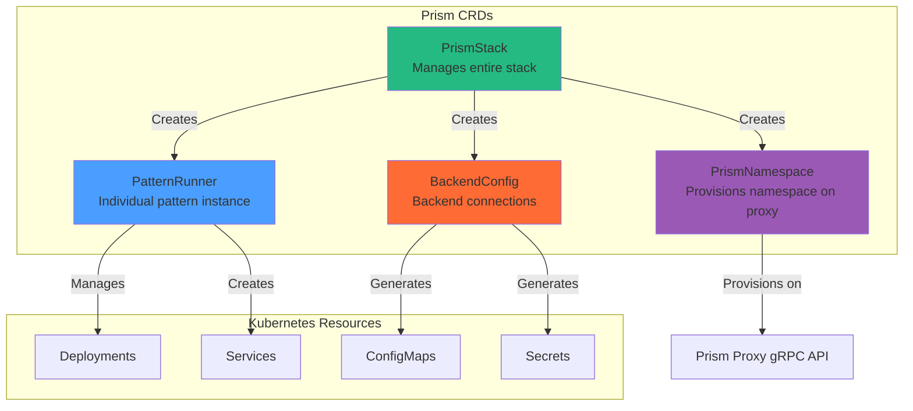

# MEMO-036: Kubernetes Operator Development for Prism Stack

## Purpose

Create a Kubernetes operator for the Prism stack that automates deployment, configuration, and lifecycle management of prism-proxy, pattern runners, and backend services. Enable local development and testing using Docker Desktop's built-in Kubernetes cluster.

## Context

### Current State

**Deployment Options**:
1. **Manual**: Direct binary execution (`prismctl local start`)
2. **Nomad**: Production-like orchestration (MEMO-035)
3. **Missing**: Kubernetes-native deployment and automation

**Kubernetes Gap**:
- No automated provisioning of Prism components
- Manual configuration of pattern runners
- No custom resource definitions (CRDs) for Prism concepts
- Limited cloud-native integration

### Why a Kubernetes Operator?

**Benefits**:
- ✅ Declarative configuration via CRDs
- ✅ Automated lifecycle management
- ✅ Native Kubernetes integration (RBAC, secrets, services)
- ✅ Self-healing and reconciliation
- ✅ Cloud provider portability (EKS, GKE, AKS)
- ✅ Production-ready patterns (controllers, watchers)

**Use Cases**:
1. Multi-tenant SaaS deployments
2. Dynamic pattern provisioning
3. Auto-scaling based on load
4. Integration with service mesh (Istio, Linkerd)
5. GitOps workflows (ArgoCD, FluxCD)

## Architecture

### Custom Resource Definitions (CRDs)



### CRD Specifications

#### 1. PrismStack CRD

Represents the entire Prism deployment:

```yaml
apiVersion: prism.io/v1alpha1
kind: PrismStack
metadata:
  name: prism-dev
  namespace: prism-system
spec:
  # Prism proxy configuration
  proxy:
    image: ghcr.io/prism/prism-proxy:latest
    replicas: 2
    port: 9090
    resources:
      requests:
        cpu: "500m"
        memory: "512Mi"
      limits:
        cpu: "2000m"
        memory: "2Gi"

  # Admin control plane
  admin:
    enabled: true
    port: 8981
    replicas: 1

  # Pattern runners to provision
  patterns:
    - name: keyvalue-memstore
      type: keyvalue
      backend: memstore
      replicas: 1

    - name: pubsub-nats
      type: pubsub
      backend: nats
      replicas: 2
      config:
        natsUrl: "nats://nats.prism-system.svc.cluster.local:4222"

  # Backend configurations
  backends:
    - name: nats
      type: messaging
      connectionString: "nats://nats.prism-system.svc.cluster.local:4222"

    - name: postgres
      type: database
      secretRef:
        name: postgres-credentials
        namespace: prism-system

  # Observability
  observability:
    enabled: true
    tracing:
      endpoint: "http://jaeger-collector.observability.svc.cluster.local:14268"
    metrics:
      port: 9090
```

#### 2. PatternRunner CRD

Represents a single pattern instance:

```yaml
apiVersion: prism.io/v1alpha1
kind: PatternRunner
metadata:
  name: keyvalue-memstore-001
  namespace: prism-system
spec:
  # Pattern type and backend
  pattern: keyvalue
  backend: memstore

  # Deployment configuration
  image: ghcr.io/prism/keyvalue-runner:latest
  replicas: 1

  # Resource limits
  resources:
    requests:
      cpu: "250m"
      memory: "256Mi"
    limits:
      cpu: "1000m"
      memory: "1Gi"

  # Backend connection
  backendConfig:
    name: memstore-config
    namespace: prism-system

  # Pattern-specific configuration
  config:
    ttl: "1h"
    maxKeys: 10000

  # Service exposure
  service:
    type: ClusterIP
    port: 8080

status:
  phase: Running
  replicas: 1
  availableReplicas: 1
  observedGeneration: 1
  conditions:
    - type: Ready
      status: "True"
      lastTransitionTime: "2025-10-16T10:00:00Z"
      reason: DeploymentReady
      message: "Pattern runner is healthy"
```

#### 3. BackendConfig CRD

Represents backend connection configuration:

```yaml
apiVersion: prism.io/v1alpha1
kind: BackendConfig
metadata:
  name: nats-production
  namespace: prism-system
spec:
  # Backend type
  type: messaging
  provider: nats

  # Connection details
  connection:
    # Option 1: Direct configuration
    url: "nats://nats.prism-system.svc.cluster.local:4222"

    # Option 2: Secret reference
    secretRef:
      name: nats-credentials
      namespace: prism-system
      keys:
        url: "nats-url"
        username: "nats-username"
        password: "nats-password"

  # TLS configuration
  tls:
    enabled: true
    secretRef:
      name: nats-tls
      namespace: prism-system

  # Health check configuration
  healthCheck:
    enabled: true
    interval: "10s"
    timeout: "5s"

status:
  phase: Ready
  lastChecked: "2025-10-16T10:00:00Z"
  healthy: true
  message: "Backend connection verified"
```

#### 4. PrismNamespace CRD

Represents a namespace provisioned on the Prism proxy for multi-tenancy:

```yaml
apiVersion: prism.io/v1alpha1
kind: PrismNamespace
metadata:
  name: tenant-acme-prod
  namespace: prism-system
spec:
  # Namespace identifier on proxy
  namespaceId: "acme-prod"

  # Display name for UI/admin
  displayName: "ACME Corp - Production"

  # Proxy instance to provision on
  proxyRef:
    name: prism-dev-proxy
    namespace: prism-system

  # Resource quotas for this namespace
  quotas:
    maxKeys: 100000
    maxConnections: 1000
    rateLimit:
      requestsPerSecond: 1000
      burstSize: 2000

  # Patterns accessible in this namespace
  patterns:
    - keyvalue-redis
    - pubsub-nats

  # Authentication/authorization
  auth:
    # OAuth2/OIDC configuration
    oidcIssuer: "https://auth.acme.com"
    oidcClientId: "prism-acme-prod"

    # Allowed service accounts
    serviceAccounts:
      - "acme-app-01@acme-prod.iam.gserviceaccount.com"
      - "acme-app-02@acme-prod.iam.gserviceaccount.com"

  # Observability tags
  tags:
    tenant: "acme"
    environment: "production"
    cost-center: "engineering"

  # Expiration (optional, for ephemeral namespaces)
  ttl: "720h"  # 30 days

status:
  phase: Active
  provisionedAt: "2025-10-16T10:00:00Z"
  lastSyncedAt: "2025-10-16T10:05:00Z"
  proxyStatus: Ready
  conditions:
    - type: Provisioned
      status: "True"
      lastTransitionTime: "2025-10-16T10:00:00Z"
      reason: NamespaceCreated
      message: "Namespace provisioned on proxy successfully"
    - type: QuotasEnforced
      status: "True"
      lastTransitionTime: "2025-10-16T10:00:00Z"
      reason: QuotasApplied
      message: "Resource quotas configured"
  metrics:
    currentKeys: 42351
    currentConnections: 234
    requestRate: 567.2
```

**Multi-Tenant Use Case Example**:

```yaml
apiVersion: prism.io/v1alpha1
kind: PrismNamespace
metadata:
  name: tenant-beta-staging
  namespace: prism-system
spec:
  namespaceId: "beta-staging"
  displayName: "Beta Corp - Staging"

  proxyRef:
    name: prism-dev-proxy
    namespace: prism-system

  quotas:
    maxKeys: 10000
    maxConnections: 100
    rateLimit:
      requestsPerSecond: 100
      burstSize: 200

  patterns:
    - keyvalue-memstore  # Lower cost for staging

  auth:
    oidcIssuer: "https://auth.beta.com"
    oidcClientId: "prism-beta-staging"

  tags:
    tenant: "beta"
    environment: "staging"
```

## Operator Implementation

### 1. Project Structure

```text
prism-operator/
├── cmd/
│   └── manager/
│       └── main.go                  # Operator entrypoint
├── api/
│   └── v1alpha1/
│       ├── prismstack_types.go      # PrismStack CRD
│       ├── prismnamespace_types.go  # PrismNamespace CRD
│       ├── patternrunner_types.go   # PatternRunner CRD
│       ├── backendconfig_types.go   # BackendConfig CRD
│       └── zz_generated.deepcopy.go # Generated code
├── controllers/
│   ├── prismstack_controller.go     # Stack reconciler
│   ├── prismnamespace_controller.go # Namespace reconciler
│   ├── patternrunner_controller.go  # Pattern reconciler
│   └── backendconfig_controller.go  # Backend reconciler
├── config/
│   ├── crd/                     # CRD manifests
│   ├── rbac/                    # RBAC rules
│   ├── manager/                 # Operator deployment
│   └── samples/                 # Example CRs
├── pkg/
│   ├── reconciler/              # Common reconciliation logic
│   ├── template/                # Resource templates
│   ├── health/                  # Health check logic
│   └── placement/               # RunnerSpec placement logic
├── Dockerfile                   # Operator container
├── Makefile                     # Build automation
└── go.mod
```

### RunnerSpec: Resource Placement Control

The **RunnerSpec** defines WHERE and HOW pattern runners and components are placed:

```yaml
# Example: RunnerSpec embedded in PrismStack
apiVersion: prism.io/v1alpha1
kind: PrismStack
metadata:
  name: prism-production
spec:
  # Proxy placement
  proxy:
    image: prism-proxy:latest
    replicas: 3
    runnerSpec:
      # Node selector for proxy placement
      nodeSelector:
        role: prism-proxy
        tier: data-plane
      # Affinity rules
      affinity:
        podAntiAffinity:
          requiredDuringSchedulingIgnoredDuringExecution:
            - labelSelector:
                matchLabels:
                  component: prism-proxy
              topologyKey: kubernetes.io/hostname
      # Tolerations for tainted nodes
      tolerations:
        - key: "workload-type"
          operator: "Equal"
          value: "data-intensive"
          effect: "NoSchedule"
      # Resource requests/limits
      resources:
        requests:
          cpu: "2000m"
          memory: "4Gi"
        limits:
          cpu: "8000m"
          memory: "16Gi"

  # Admin service placement
  admin:
    enabled: true
    replicas: 2
    runnerSpec:
      nodeSelector:
        role: prism-control-plane
        tier: management
      resources:
        requests:
          cpu: "500m"
          memory: "512Mi"
        limits:
          cpu: "2000m"
          memory: "2Gi"

  # Pattern runners with different placement strategies
  patterns:
    # High-memory keyvalue runner
    - name: cache-redis-large
      type: keyvalue
      backend: redis
      replicas: 5
      runnerSpec:
        nodeSelector:
          memory-optimized: "true"
        resources:
          requests:
            cpu: "1000m"
            memory: "8Gi"
          limits:
            cpu: "4000m"
            memory: "32Gi"

    # CPU-intensive pubsub runner
    - name: events-nats-fast
      type: pubsub
      backend: nats
      replicas: 10
      runnerSpec:
        nodeSelector:
          cpu-optimized: "true"
        resources:
          requests:
            cpu: "4000m"
            memory: "2Gi"
          limits:
            cpu: "16000m"
            memory: "8Gi"

    # Burstable workload runner
    - name: queue-kafka-burst
      type: queue
      backend: kafka
      replicas: 3
      runnerSpec:
        # No node selector - can run anywhere
        resources:
          requests:
            cpu: "500m"
            memory: "1Gi"
          limits:
            cpu: "4000m"  # Can burst to 4 cores
            memory: "8Gi"   # Can burst to 8GB
```

**RunnerSpec Fields**:

| Field | Purpose | Example |
|-------|---------|---------|
| `nodeSelector` | Target specific nodes | `role: prism-proxy` |
| `affinity` | Advanced scheduling rules | Pod anti-affinity for HA |
| `tolerations` | Run on tainted nodes | Tolerate `data-intensive` taint |
| `resources` | CPU/memory requests/limits | `4Gi` memory, `2` CPU cores |
| `priorityClassName` | Pod priority | `high-priority` |
| `runtimeClassName` | Container runtime | `gvisor`, `kata-containers` |

**Placement Strategies**:

1. **Control Plane Isolation** - Keep admin services separate
2. **Data Plane Optimization** - Place proxies on high-throughput nodes
3. **Pattern-Specific** - Match runner requirements to node capabilities
4. **Cost Optimization** - Use spot instances for non-critical runners
5. **Multi-Zone HA** - Spread replicas across availability zones
```

### 2. Operator Scaffold (Kubebuilder)

```bash
# Install kubebuilder
curl -L -o kubebuilder https://go.kubebuilder.io/dl/latest/$(go env GOOS)/$(go env GOARCH)
chmod +x kubebuilder
sudo mv kubebuilder /usr/local/bin/

# Initialize operator project
mkdir prism-operator && cd prism-operator
kubebuilder init --domain prism.io --repo github.com/prism/prism-operator

# Create CRDs (answer 'y' to create Resource and Controller)
kubebuilder create api --group prism --version v1alpha1 --kind PrismStack
kubebuilder create api --group prism --version v1alpha1 --kind PrismNamespace
kubebuilder create api --group prism --version v1alpha1 --kind PatternRunner
kubebuilder create api --group prism --version v1alpha1 --kind BackendConfig

# Build and generate manifests
make manifests generate

# Install CRDs to local cluster
make install
```

### 3. PrismStack Controller Implementation

File: `controllers/prismstack_controller.go`

```go
package controllers

import (
    "context"
    "fmt"

    appsv1 "k8s.io/api/apps/v1"
    corev1 "k8s.io/api/core/v1"
    "k8s.io/apimachinery/pkg/api/errors"
    metav1 "k8s.io/apimachinery/pkg/apis/meta/v1"
    "k8s.io/apimachinery/pkg/runtime"
    "k8s.io/apimachinery/pkg/types"
    ctrl "sigs.k8s.io/controller-runtime"
    "sigs.k8s.io/controller-runtime/pkg/client"
    "sigs.k8s.io/controller-runtime/pkg/log"

    prismv1alpha1 "github.com/prism/prism-operator/api/v1alpha1"
)

// PrismStackReconciler reconciles a PrismStack object
type PrismStackReconciler struct {
    client.Client
    Scheme *runtime.Scheme
}

//+kubebuilder:rbac:groups=prism.io,resources=prismstacks,verbs=get;list;watch;create;update;patch;delete
//+kubebuilder:rbac:groups=prism.io,resources=prismstacks/status,verbs=get;update;patch
//+kubebuilder:rbac:groups=prism.io,resources=prismstacks/finalizers,verbs=update
//+kubebuilder:rbac:groups=apps,resources=deployments,verbs=get;list;watch;create;update;patch;delete
//+kubebuilder:rbac:groups=core,resources=services,verbs=get;list;watch;create;update;patch;delete

func (r *PrismStackReconciler) Reconcile(ctx context.Context, req ctrl.Request) (ctrl.Result, error) {
    log := log.FromContext(ctx)

    // Fetch the PrismStack instance
    prismStack := &prismv1alpha1.PrismStack{}
    if err := r.Get(ctx, req.NamespacedName, prismStack); err != nil {
        if errors.IsNotFound(err) {
            log.Info("PrismStack resource not found, ignoring")
            return ctrl.Result{}, nil
        }
        log.Error(err, "Failed to get PrismStack")
        return ctrl.Result{}, err
    }

    // Reconcile prism-proxy deployment
    if err := r.reconcileProxyDeployment(ctx, prismStack); err != nil {
        log.Error(err, "Failed to reconcile proxy deployment")
        return ctrl.Result{}, err
    }

    // Reconcile prism-admin deployment
    if prismStack.Spec.Admin.Enabled {
        if err := r.reconcileAdminDeployment(ctx, prismStack); err != nil {
            log.Error(err, "Failed to reconcile admin deployment")
            return ctrl.Result{}, err
        }
    }

    // Reconcile pattern runners
    for _, pattern := range prismStack.Spec.Patterns {
        if err := r.reconcilePatternRunner(ctx, prismStack, pattern); err != nil {
            log.Error(err, "Failed to reconcile pattern runner", "pattern", pattern.Name)
            return ctrl.Result{}, err
        }
    }

    // Update status
    if err := r.updateStatus(ctx, prismStack); err != nil {
        log.Error(err, "Failed to update PrismStack status")
        return ctrl.Result{}, err
    }

    return ctrl.Result{}, nil
}

func (r *PrismStackReconciler) reconcileProxyDeployment(ctx context.Context, stack *prismv1alpha1.PrismStack) error {
    deployment := &appsv1.Deployment{
        ObjectMeta: metav1.ObjectMeta{
            Name:      fmt.Sprintf("%s-proxy", stack.Name),
            Namespace: stack.Namespace,
            Labels:    r.labelsForProxy(stack),
        },
        Spec: appsv1.DeploymentSpec{
            Replicas: &stack.Spec.Proxy.Replicas,
            Selector: &metav1.LabelSelector{
                MatchLabels: r.labelsForProxy(stack),
            },
            Template: corev1.PodTemplateSpec{
                ObjectMeta: metav1.ObjectMeta{
                    Labels: r.labelsForProxy(stack),
                },
                Spec: corev1.PodSpec{
                    Containers: []corev1.Container{
                        {
                            Name:  "prism-proxy",
                            Image: stack.Spec.Proxy.Image,
                            Ports: []corev1.ContainerPort{
                                {
                                    Name:          "grpc",
                                    ContainerPort: int32(stack.Spec.Proxy.Port),
                                    Protocol:      corev1.ProtocolTCP,
                                },
                            },
                            Resources: stack.Spec.Proxy.Resources,
                        },
                    },
                },
            },
        },
    }

    // Set PrismStack as owner of the Deployment
    if err := ctrl.SetControllerReference(stack, deployment, r.Scheme); err != nil {
        return err
    }

    // Check if deployment exists
    found := &appsv1.Deployment{}
    err := r.Get(ctx, types.NamespacedName{Name: deployment.Name, Namespace: deployment.Namespace}, found)
    if err != nil && errors.IsNotFound(err) {
        // Create new deployment
        if err := r.Create(ctx, deployment); err != nil {
            return err
        }
        return nil
    } else if err != nil {
        return err
    }

    // Update existing deployment
    found.Spec = deployment.Spec
    if err := r.Update(ctx, found); err != nil {
        return err
    }

    return nil
}

func (r *PrismStackReconciler) reconcilePatternRunner(ctx context.Context, stack *prismv1alpha1.PrismStack, pattern prismv1alpha1.PatternSpec) error {
    // Create or update PatternRunner CR
    patternRunner := &prismv1alpha1.PatternRunner{
        ObjectMeta: metav1.ObjectMeta{
            Name:      pattern.Name,
            Namespace: stack.Namespace,
        },
        Spec: prismv1alpha1.PatternRunnerSpec{
            Pattern:  pattern.Type,
            Backend:  pattern.Backend,
            Replicas: pattern.Replicas,
            Config:   pattern.Config,
        },
    }

    // Set PrismStack as owner
    if err := ctrl.SetControllerReference(stack, patternRunner, r.Scheme); err != nil {
        return err
    }

    // Check if PatternRunner exists
    found := &prismv1alpha1.PatternRunner{}
    err := r.Get(ctx, types.NamespacedName{Name: patternRunner.Name, Namespace: patternRunner.Namespace}, found)
    if err != nil && errors.IsNotFound(err) {
        // Create new PatternRunner
        if err := r.Create(ctx, patternRunner); err != nil {
            return err
        }
        return nil
    } else if err != nil {
        return err
    }

    // Update existing PatternRunner
    found.Spec = patternRunner.Spec
    if err := r.Update(ctx, found); err != nil {
        return err
    }

    return nil
}

func (r *PrismStackReconciler) labelsForProxy(stack *prismv1alpha1.PrismStack) map[string]string {
    return map[string]string{
        "app":       "prism-proxy",
        "stack":     stack.Name,
        "component": "proxy",
    }
}

func (r *PrismStackReconciler) updateStatus(ctx context.Context, stack *prismv1alpha1.PrismStack) error {
    // Update status based on child resources
    stack.Status.Phase = "Running"
    stack.Status.ObservedGeneration = stack.Generation

    if err := r.Status().Update(ctx, stack); err != nil {
        return err
    }

    return nil
}

// SetupWithManager sets up the controller with the Manager.
func (r *PrismStackReconciler) SetupWithManager(mgr ctrl.Manager) error {
    return ctrl.NewControllerManagedBy(mgr).
        For(&prismv1alpha1.PrismStack{}).
        Owns(&appsv1.Deployment{}).
        Owns(&corev1.Service{}).
        Complete(r)
}
```

### 4. PatternRunner Controller

File: `controllers/patternrunner_controller.go`

```go
package controllers

import (
    "context"
    "fmt"

    appsv1 "k8s.io/api/apps/v1"
    corev1 "k8s.io/api/core/v1"
    "k8s.io/apimachinery/pkg/api/errors"
    metav1 "k8s.io/apimachinery/pkg/apis/meta/v1"
    "k8s.io/apimachinery/pkg/runtime"
    "k8s.io/apimachinery/pkg/types"
    "k8s.io/apimachinery/pkg/util/intstr"
    ctrl "sigs.k8s.io/controller-runtime"
    "sigs.k8s.io/controller-runtime/pkg/client"
    "sigs.k8s.io/controller-runtime/pkg/log"

    prismv1alpha1 "github.com/prism/prism-operator/api/v1alpha1"
)

// PatternRunnerReconciler reconciles a PatternRunner object
type PatternRunnerReconciler struct {
    client.Client
    Scheme *runtime.Scheme
}

//+kubebuilder:rbac:groups=prism.io,resources=patternrunners,verbs=get;list;watch;create;update;patch;delete
//+kubebuilder:rbac:groups=prism.io,resources=patternrunners/status,verbs=get;update;patch

func (r *PatternRunnerReconciler) Reconcile(ctx context.Context, req ctrl.Request) (ctrl.Result, error) {
    log := log.FromContext(ctx)

    // Fetch PatternRunner
    patternRunner := &prismv1alpha1.PatternRunner{}
    if err := r.Get(ctx, req.NamespacedName, patternRunner); err != nil {
        if errors.IsNotFound(err) {
            return ctrl.Result{}, nil
        }
        return ctrl.Result{}, err
    }

    // Reconcile deployment
    if err := r.reconcileDeployment(ctx, patternRunner); err != nil {
        log.Error(err, "Failed to reconcile deployment")
        return ctrl.Result{}, err
    }

    // Reconcile service
    if err := r.reconcileService(ctx, patternRunner); err != nil {
        log.Error(err, "Failed to reconcile service")
        return ctrl.Result{}, err
    }

    // Update status
    if err := r.updateStatus(ctx, patternRunner); err != nil {
        log.Error(err, "Failed to update status")
        return ctrl.Result{}, err
    }

    return ctrl.Result{}, nil
}

func (r *PatternRunnerReconciler) reconcileDeployment(ctx context.Context, pr *prismv1alpha1.PatternRunner) error {
    deployment := &appsv1.Deployment{
        ObjectMeta: metav1.ObjectMeta{
            Name:      pr.Name,
            Namespace: pr.Namespace,
            Labels:    r.labelsForPatternRunner(pr),
        },
        Spec: appsv1.DeploymentSpec{
            Replicas: &pr.Spec.Replicas,
            Selector: &metav1.LabelSelector{
                MatchLabels: r.labelsForPatternRunner(pr),
            },
            Template: corev1.PodTemplateSpec{
                ObjectMeta: metav1.ObjectMeta{
                    Labels: r.labelsForPatternRunner(pr),
                },
                Spec: corev1.PodSpec{
                    Containers: []corev1.Container{
                        {
                            Name:  fmt.Sprintf("%s-runner", pr.Spec.Pattern),
                            Image: pr.Spec.Image,
                            Args: []string{
                                fmt.Sprintf("--pattern=%s", pr.Spec.Pattern),
                                fmt.Sprintf("--backend=%s", pr.Spec.Backend),
                            },
                            Ports: []corev1.ContainerPort{
                                {
                                    Name:          "grpc",
                                    ContainerPort: int32(pr.Spec.Service.Port),
                                },
                            },
                            Resources: pr.Spec.Resources,
                        },
                    },
                },
            },
        },
    }

    if err := ctrl.SetControllerReference(pr, deployment, r.Scheme); err != nil {
        return err
    }

    // Create or update
    found := &appsv1.Deployment{}
    err := r.Get(ctx, types.NamespacedName{Name: deployment.Name, Namespace: deployment.Namespace}, found)
    if err != nil && errors.IsNotFound(err) {
        return r.Create(ctx, deployment)
    } else if err != nil {
        return err
    }

    found.Spec = deployment.Spec
    return r.Update(ctx, found)
}

func (r *PatternRunnerReconciler) reconcileService(ctx context.Context, pr *prismv1alpha1.PatternRunner) error {
    service := &corev1.Service{
        ObjectMeta: metav1.ObjectMeta{
            Name:      pr.Name,
            Namespace: pr.Namespace,
            Labels:    r.labelsForPatternRunner(pr),
        },
        Spec: corev1.ServiceSpec{
            Selector: r.labelsForPatternRunner(pr),
            Type:     pr.Spec.Service.Type,
            Ports: []corev1.ServicePort{
                {
                    Name:       "grpc",
                    Port:       int32(pr.Spec.Service.Port),
                    TargetPort: intstr.FromInt(pr.Spec.Service.Port),
                    Protocol:   corev1.ProtocolTCP,
                },
            },
        },
    }

    if err := ctrl.SetControllerReference(pr, service, r.Scheme); err != nil {
        return err
    }

    found := &corev1.Service{}
    err := r.Get(ctx, types.NamespacedName{Name: service.Name, Namespace: service.Namespace}, found)
    if err != nil && errors.IsNotFound(err) {
        return r.Create(ctx, service)
    } else if err != nil {
        return err
    }

    found.Spec = service.Spec
    return r.Update(ctx, found)
}

func (r *PatternRunnerReconciler) labelsForPatternRunner(pr *prismv1alpha1.PatternRunner) map[string]string {
    return map[string]string{
        "app":     "prism",
        "pattern": pr.Spec.Pattern,
        "backend": pr.Spec.Backend,
        "runner":  pr.Name,
    }
}

func (r *PatternRunnerReconciler) updateStatus(ctx context.Context, pr *prismv1alpha1.PatternRunner) error {
    // Get deployment status
    deployment := &appsv1.Deployment{}
    if err := r.Get(ctx, types.NamespacedName{Name: pr.Name, Namespace: pr.Namespace}, deployment); err != nil {
        return err
    }

    pr.Status.Replicas = deployment.Status.Replicas
    pr.Status.AvailableReplicas = deployment.Status.AvailableReplicas
    pr.Status.ObservedGeneration = deployment.Status.ObservedGeneration

    if deployment.Status.AvailableReplicas == *deployment.Spec.Replicas {
        pr.Status.Phase = "Running"
    } else {
        pr.Status.Phase = "Pending"
    }

    return r.Status().Update(ctx, pr)
}

// SetupWithManager sets up the controller with the Manager.
func (r *PatternRunnerReconciler) SetupWithManager(mgr ctrl.Manager) error {
    return ctrl.NewControllerManagedBy(mgr).
        For(&prismv1alpha1.PatternRunner{}).
        Owns(&appsv1.Deployment{}).
        Owns(&corev1.Service{}).
        Complete(r)
}
```

## Local Development with Docker Desktop Kubernetes

### 1. Enable Kubernetes in Docker Desktop

**macOS/Windows**:
1. Open Docker Desktop preferences
2. Navigate to Kubernetes tab
3. Enable "Enable Kubernetes"
4. Click "Apply & Restart"
5. Wait for cluster to start (green indicator)

**Verify**:
```bash
kubectl cluster-info
kubectl get nodes
```

Expected output:
```text
NAME             STATUS   ROLES           AGE   VERSION
docker-desktop   Ready    control-plane   1d    v1.28.2
```

### 2. Install Operator SDK Tools

```bash
# Install kubebuilder (operator framework)
curl -L -o kubebuilder https://go.kubebuilder.io/dl/latest/$(go env GOOS)/$(go env GOARCH)
chmod +x kubebuilder
sudo mv kubebuilder /usr/local/bin/

# Install kustomize (manifest management)
brew install kustomize

# Install operator-sdk (optional, for advanced features)
brew install operator-sdk
```

### 3. Build and Deploy Operator Locally

```bash
# Clone/create operator project
cd prism-operator

# Install CRDs into cluster
make install

# Run operator locally (connects to Docker Desktop k8s)
make run

# Alternative: Deploy operator as pod in cluster
make docker-build docker-push IMG=prism-operator:dev
make deploy IMG=prism-operator:dev
```

### 4. Create Sample PrismStack

Create `config/samples/prism_v1alpha1_prismstack.yaml`:

```yaml
apiVersion: prism.io/v1alpha1
kind: PrismStack
metadata:
  name: prism-dev
  namespace: default
spec:
  proxy:
    image: ghcr.io/prism/prism-proxy:latest
    replicas: 1
    port: 9090
    resources:
      requests:
        cpu: "100m"
        memory: "128Mi"
      limits:
        cpu: "500m"
        memory: "512Mi"

  admin:
    enabled: true
    port: 8981
    replicas: 1

  patterns:
    - name: keyvalue-memstore
      type: keyvalue
      backend: memstore
      replicas: 1

  observability:
    enabled: false
```

Apply it:
```bash
kubectl apply -f config/samples/prism_v1alpha1_prismstack.yaml
```

### 5. Watch Operator Reconciliation

```bash
# Watch PrismStack status
kubectl get prismstack prism-dev -w

# Watch all resources
kubectl get all -l stack=prism-dev

# View operator logs
kubectl logs -n prism-system deployment/prism-operator-controller-manager -f

# Check created resources
kubectl get deployments
kubectl get services
kubectl get patternrunners
```

### 6. Test Pattern Runner

```bash
# Forward port to access pattern runner
kubectl port-forward svc/keyvalue-memstore 8080:8080

# Test KeyValue pattern (in another terminal)
curl -X POST http://localhost:8080/kv/set \
  -H "Content-Type: application/json" \
  -d '{"key": "test", "value": "hello"}'

curl http://localhost:8080/kv/get?key=test
```

## Testing Strategy

### 1. Unit Tests

Test controller reconciliation logic:

```go
// controllers/prismstack_controller_test.go
package controllers

import (
    "context"
    "testing"

    . "github.com/onsi/ginkgo/v2"
    . "github.com/onsi/gomega"

    corev1 "k8s.io/api/core/v1"
    metav1 "k8s.io/apimachinery/pkg/apis/meta/v1"
    "k8s.io/apimachinery/pkg/types"

    prismv1alpha1 "github.com/prism/prism-operator/api/v1alpha1"
)

var _ = Describe("PrismStack Controller", func() {
    Context("When reconciling a PrismStack", func() {
        It("Should create a proxy deployment", func() {
            ctx := context.Background()

            // Create PrismStack
            prismStack := &prismv1alpha1.PrismStack{
                ObjectMeta: metav1.ObjectMeta{
                    Name:      "test-stack",
                    Namespace: "default",
                },
                Spec: prismv1alpha1.PrismStackSpec{
                    Proxy: prismv1alpha1.ProxySpec{
                        Image:    "prism-proxy:test",
                        Replicas: 1,
                        Port:     9090,
                    },
                },
            }

            Expect(k8sClient.Create(ctx, prismStack)).Should(Succeed())

            // Check that deployment was created
            deployment := &appsv1.Deployment{}
            Eventually(func() error {
                return k8sClient.Get(ctx, types.NamespacedName{
                    Name:      "test-stack-proxy",
                    Namespace: "default",
                }, deployment)
            }, timeout, interval).Should(Succeed())

            Expect(deployment.Spec.Replicas).Should(Equal(int32Ptr(1)))
            Expect(deployment.Spec.Template.Spec.Containers[0].Image).Should(Equal("prism-proxy:test"))
        })
    })
})
```

Run tests:
```bash
make test
```

### 2. Integration Tests with Envtest

Uses a local control plane for realistic testing:

```bash
# Run integration tests (starts local k8s API server)
make test-integration
```

### 3. End-to-End Tests

Test full workflow against Docker Desktop cluster:

```bash
# Run e2e tests
make test-e2e

# Manual e2e test
kubectl apply -f config/samples/
kubectl wait --for=condition=Ready prismstack/prism-dev --timeout=60s
kubectl get all -l stack=prism-dev
```

## Makefile Targets

Add to `Makefile`:

```makefile
# Local development targets

.PHONY: local-deploy
local-deploy: install ## Deploy to local Docker Desktop k8s
	kubectl config use-context docker-desktop
	$(MAKE) deploy IMG=prism-operator:local

.PHONY: local-run
local-run: install ## Run operator locally against Docker Desktop k8s
	kubectl config use-context docker-desktop
	go run ./cmd/manager/main.go

.PHONY: local-test
local-test: ## Apply sample CR to local cluster
	kubectl apply -f config/samples/prism_v1alpha1_prismstack.yaml
	kubectl get prismstack prism-dev
	kubectl get all -l stack=prism-dev

.PHONY: local-clean
local-clean: ## Clean up local cluster
	kubectl delete prismstack --all
	kubectl delete patternrunner --all
	$(MAKE) undeploy

.PHONY: local-logs
local-logs: ## Tail operator logs
	kubectl logs -n prism-system deployment/prism-operator-controller-manager -f

.PHONY: docker-build-local
docker-build-local: ## Build operator image for local testing
	docker build -t prism-operator:local .

.PHONY: kind-create
kind-create: ## Create local kind cluster
	kind create cluster --name prism-dev
	kubectl config use-context kind-prism-dev

.PHONY: kind-delete
kind-delete: ## Delete kind cluster
	kind delete cluster --name prism-dev
```

## Usage Examples

### Basic Workflow

```bash
# 1. Start Docker Desktop Kubernetes
# (Enable via Docker Desktop UI)

# 2. Install operator CRDs
cd prism-operator
make install

# 3. Run operator locally
make local-run

# 4. In another terminal, deploy sample stack
make local-test

# 5. Watch resources
kubectl get prismstack prism-dev -w
kubectl get pods -l stack=prism-dev -w

# 6. Test pattern runner
kubectl port-forward svc/keyvalue-memstore 8080:8080
curl http://localhost:8080/health

# 7. Clean up
make local-clean
```

### Deploy NATS Backend

```bash
# Deploy NATS using Helm
helm repo add nats https://nats-io.github.io/k8s/helm/charts/
helm install nats nats/nats --namespace prism-system --create-namespace

# Create PrismStack with NATS pattern
kubectl apply -f - <<EOF
apiVersion: prism.io/v1alpha1
kind: PrismStack
metadata:
  name: prism-nats
spec:
  proxy:
    image: prism-proxy:latest
    replicas: 1
  patterns:
    - name: pubsub-nats
      type: pubsub
      backend: nats
      replicas: 2
      config:
        natsUrl: "nats://nats.prism-system.svc.cluster.local:4222"
EOF

# Verify NATS connection
kubectl logs -l pattern=pubsub | grep "Connected to NATS"
```

### Multi-Backend Configuration

```yaml
apiVersion: prism.io/v1alpha1
kind: PrismStack
metadata:
  name: prism-multi-backend
spec:
  proxy:
    image: prism-proxy:latest
    replicas: 2

  patterns:
    # In-memory backend
    - name: cache-memstore
      type: keyvalue
      backend: memstore
      replicas: 1

    # Redis backend
    - name: cache-redis
      type: keyvalue
      backend: redis
      replicas: 2
      config:
        redisUrl: "redis://redis.prism-system.svc.cluster.local:6379"

    # NATS messaging
    - name: events-nats
      type: pubsub
      backend: nats
      replicas: 2
      config:
        natsUrl: "nats://nats.prism-system.svc.cluster.local:4222"

    # PostgreSQL persistence
    - name: state-postgres
      type: keyvalue
      backend: postgres
      replicas: 2
      config:
        connectionString: "postgres://postgres.prism-system.svc.cluster.local:5432/prism"
```

## Debugging

### Common Issues

**1. CRD Not Found**

```bash
# Reinstall CRDs
make install

# Verify CRDs exist
kubectl get crds | grep prism.io
```

**2. Operator Not Reconciling**

```bash
# Check operator logs
kubectl logs -n prism-system deployment/prism-operator-controller-manager

# Verify RBAC permissions
kubectl get clusterrole | grep prism
kubectl get clusterrolebinding | grep prism
```

**3. Resource Not Created**

```bash
# Check events
kubectl get events --sort-by='.lastTimestamp'

# Describe resource
kubectl describe prismstack prism-dev

# Check owner references
kubectl get deployment -o yaml | grep ownerReferences -A 10
```

### Debugging Tools

```bash
# Enable verbose operator logging
export LOG_LEVEL=debug
make local-run

# Use kubectl debug
kubectl debug pod/prism-proxy-xxx -it --image=busybox

# Port forward to services
kubectl port-forward svc/prism-proxy 9090:9090
kubectl port-forward svc/prism-admin 8981:8981

# Exec into pod
kubectl exec -it pod/keyvalue-memstore-xxx -- /bin/sh
```

## Production Deployment

### 1. Build and Push Image

```bash
# Build for production
docker build -t ghcr.io/prism/prism-operator:v0.1.0 .

# Push to registry
docker push ghcr.io/prism/prism-operator:v0.1.0
```

### 2. Deploy to Cluster

```bash
# Deploy with Helm
helm install prism-operator ./charts/prism-operator \
  --namespace prism-system \
  --create-namespace \
  --set image.tag=v0.1.0

# Or with kustomize
kustomize build config/default | kubectl apply -f -
```

### 3. Production PrismStack Example

```yaml
apiVersion: prism.io/v1alpha1
kind: PrismStack
metadata:
  name: prism-production
  namespace: prism-prod
spec:
  proxy:
    image: ghcr.io/prism/prism-proxy:v1.0.0
    replicas: 5
    port: 9090
    resources:
      requests:
        cpu: "1000m"
        memory: "1Gi"
      limits:
        cpu: "4000m"
        memory: "4Gi"

  admin:
    enabled: true
    replicas: 2

  patterns:
    - name: cache-redis-cluster
      type: keyvalue
      backend: redis
      replicas: 10
      config:
        redisUrl: "redis://redis-cluster.prod.svc.cluster.local:6379"

  observability:
    enabled: true
    tracing:
      endpoint: "http://jaeger-collector.observability.svc.cluster.local:14268"
    metrics:
      port: 9090

  affinity:
    podAntiAffinity:
      requiredDuringSchedulingIgnoredDuringExecution:
        - labelSelector:
            matchLabels:
              app: prism-proxy
          topologyKey: kubernetes.io/hostname
```

## Related Documents

- [MEMO-033: Process Isolation Bulkhead Pattern](/memos/memo-033) - Process management patterns
- [MEMO-034: Pattern Launcher Quickstart](/memos/memo-034) - Pattern runner concepts
- [MEMO-035: Nomad Local Development Setup](/memos/memo-035) - Alternative orchestration
- [RFC-008: Proxy Plugin Architecture](/rfc/rfc-008) - Proxy architecture
- [RFC-035: Pattern Process Launcher](/rfc/rfc-035) - Pattern runner implementation

## Next Steps

1. **Week 1-2**: Scaffold operator with Kubebuilder, implement PrismStack CRD
2. **Week 3-4**: Implement PatternRunner and BackendConfig controllers
3. **Week 5**: Integration testing with Docker Desktop Kubernetes
4. **Week 6**: Production deployment testing on EKS/GKE/AKS
5. **Week 7**: Helm chart and GitOps integration (ArgoCD)
6. **Week 8**: Documentation and operator SDK publication

## Revision History

- 2025-10-16: Initial draft covering Kubernetes operator development for Prism stack
