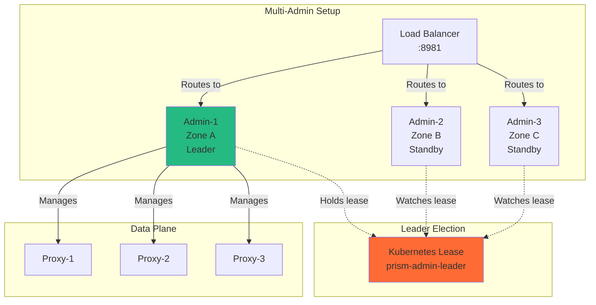

# MEMO-036: Kubernetes Operator Development for Prism Stack

## Purpose

Create a Kubernetes operator for the Prism stack that automates deployment, configuration, and lifecycle management of prism-proxy, pattern runners, and backend services. Enable local development and testing using Docker Desktop's built-in Kubernetes cluster.

## Context

### Current State

**Deployment Options**:
1. **Manual**: Direct binary execution (`prismctl local start`)
2. **Nomad**: Production-like orchestration (MEMO-035)
3. **Missing**: Kubernetes-native deployment and automation

**Kubernetes Gap**:
- No automated provisioning of Prism components
- Manual configuration of pattern runners
- No custom resource definitions (CRDs) for Prism concepts
- Limited cloud-native integration

### Why a Kubernetes Operator?

**Benefits**:
- ✅ Declarative configuration via CRDs
- ✅ Automated lifecycle management
- ✅ Native Kubernetes integration (RBAC, secrets, services)
- ✅ Self-healing and reconciliation
- ✅ Cloud provider portability (EKS, GKE, AKS)
- ✅ Production-ready patterns (controllers, watchers)

**Use Cases**:
1. Multi-tenant SaaS deployments
2. Dynamic pattern provisioning
3. Auto-scaling based on load
4. Integration with service mesh (Istio, Linkerd)
5. GitOps workflows (ArgoCD, FluxCD)

## Architecture

### Naming Convention

**API Group**: `prism.io/v1alpha1`

**Resource Naming**: All CRDs use the `Prism` prefix for clarity and immediate recognition:

| CRD | Full Name | Purpose |
|-----|-----------|---------|
| `PrismStack` | `prismstacks.prism.io` | Manages entire Prism deployment |
| `PrismNamespace` | `prismnamespaces.prism.io` | Provisions multi-tenant namespaces |
| `PrismPattern` | `prismpatterns.prism.io` | Individual pattern instance |
| `PrismBackend` | `prismbackends.prism.io` | Backend connection configuration |

**Rationale**:
- ✅ **Consistent branding** - All resources immediately identifiable as Prism
- ✅ **Avoids conflicts** - Clear distinction from other operators
- ✅ **IDE-friendly** - Easy autocomplete with `Prism` prefix
- ✅ **kubectl clarity** - `kubectl get prismstack` is more explicit than `kubectl get stack`

**Alternative considered**: Drop prefix and rely on API group (`stack.prism.io`), but rejected for reduced clarity in kubectl output.

### Custom Resource Definitions (CRDs)


### CRD Specifications

#### 1. PrismStack CRD

Represents the entire Prism deployment:

```yaml
apiVersion: prism.io/v1alpha1
kind: PrismStack
metadata:
  name: prism-dev
  namespace: prism-system
spec:
  # Prism proxy configuration
  proxy:
    image: ghcr.io/prism/prism-proxy:latest
    replicas: 2
    port: 9090
    resources:
      requests:
        cpu: "500m"
        memory: "512Mi"
      limits:
        cpu: "2000m"
        memory: "2Gi"

  # Admin control plane
  admin:
    enabled: true
    port: 8981
    replicas: 1

  # Pattern runners to provision
  patterns:
    - name: keyvalue-memstore
      type: keyvalue
      backend: memstore
      replicas: 1

    - name: pubsub-nats
      type: pubsub
      backend: nats
      replicas: 2
      config:
        natsUrl: "nats://nats.prism-system.svc.cluster.local:4222"

  # Backend configurations
  backends:
    - name: nats
      type: messaging
      connectionString: "nats://nats.prism-system.svc.cluster.local:4222"

    - name: postgres
      type: database
      secretRef:
        name: postgres-credentials
        namespace: prism-system

  # Observability
  observability:
    enabled: true
    tracing:
      endpoint: "http://jaeger-collector.observability.svc.cluster.local:14268"
    metrics:
      port: 9090
```

#### 2. PrismPattern CRD

Represents a single pattern instance:

```yaml
apiVersion: prism.io/v1alpha1
kind: PrismPattern
metadata:
  name: keyvalue-memstore-001
  namespace: prism-system
spec:
  # Pattern type and backend
  pattern: keyvalue
  backend: memstore

  # Deployment configuration
  image: ghcr.io/prism/keyvalue-runner:latest
  replicas: 1

  # Resource limits
  resources:
    requests:
      cpu: "250m"
      memory: "256Mi"
    limits:
      cpu: "1000m"
      memory: "1Gi"

  # Backend connection
  backendConfig:
    name: memstore-config
    namespace: prism-system

  # Pattern-specific configuration
  config:
    ttl: "1h"
    maxKeys: 10000

  # Service exposure
  service:
    type: ClusterIP
    port: 8080

status:
  phase: Running
  replicas: 1
  availableReplicas: 1
  observedGeneration: 1
  conditions:
    - type: Ready
      status: "True"
      lastTransitionTime: "2025-10-16T10:00:00Z"
      reason: DeploymentReady
      message: "Pattern runner is healthy"
```

#### 3. PrismBackend CRD

Represents backend connection configuration:

```yaml
apiVersion: prism.io/v1alpha1
kind: PrismBackend
metadata:
  name: nats-production
  namespace: prism-system
spec:
  # Backend type
  type: messaging
  provider: nats

  # Connection details
  connection:
    # Option 1: Direct configuration
    url: "nats://nats.prism-system.svc.cluster.local:4222"

    # Option 2: Secret reference
    secretRef:
      name: nats-credentials
      namespace: prism-system
      keys:
        url: "nats-url"
        username: "nats-username"
        password: "nats-password"

  # TLS configuration
  tls:
    enabled: true
    secretRef:
      name: nats-tls
      namespace: prism-system

  # Health check configuration
  healthCheck:
    enabled: true
    interval: "10s"
    timeout: "5s"

status:
  phase: Ready
  lastChecked: "2025-10-16T10:00:00Z"
  healthy: true
  message: "Backend connection verified"
```

#### 4. PrismNamespace CRD

Represents a namespace provisioned on the Prism proxy for multi-tenancy:

```yaml
apiVersion: prism.io/v1alpha1
kind: PrismNamespace
metadata:
  name: tenant-acme-prod
  namespace: prism-system
spec:
  # Namespace identifier on proxy
  namespaceId: "acme-prod"

  # Display name for UI/admin
  displayName: "ACME Corp - Production"

  # Proxy instance to provision on
  proxyRef:
    name: prism-dev-proxy
    namespace: prism-system

  # Resource quotas for this namespace
  quotas:
    maxKeys: 100000
    maxConnections: 1000
    rateLimit:
      requestsPerSecond: 1000
      burstSize: 2000

  # Patterns accessible in this namespace
  patterns:
    - keyvalue-redis
    - pubsub-nats

  # Authentication/authorization
  auth:
    # OAuth2/OIDC configuration
    oidcIssuer: "https://auth.acme.com"
    oidcClientId: "prism-acme-prod"

    # Allowed service accounts
    serviceAccounts:
      - "acme-app-01@acme-prod.iam.gserviceaccount.com"
      - "acme-app-02@acme-prod.iam.gserviceaccount.com"

  # Observability tags
  tags:
    tenant: "acme"
    environment: "production"
    cost-center: "engineering"

  # Expiration (optional, for ephemeral namespaces)
  ttl: "720h"  # 30 days

status:
  phase: Active
  provisionedAt: "2025-10-16T10:00:00Z"
  lastSyncedAt: "2025-10-16T10:05:00Z"
  proxyStatus: Ready
  conditions:
    - type: Provisioned
      status: "True"
      lastTransitionTime: "2025-10-16T10:00:00Z"
      reason: NamespaceCreated
      message: "Namespace provisioned on proxy successfully"
    - type: QuotasEnforced
      status: "True"
      lastTransitionTime: "2025-10-16T10:00:00Z"
      reason: QuotasApplied
      message: "Resource quotas configured"
  metrics:
    currentKeys: 42351
    currentConnections: 234
    requestRate: 567.2
```

**Multi-Tenant Use Case Example**:

```yaml
apiVersion: prism.io/v1alpha1
kind: PrismNamespace
metadata:
  name: tenant-beta-staging
  namespace: prism-system
spec:
  namespaceId: "beta-staging"
  displayName: "Beta Corp - Staging"

  proxyRef:
    name: prism-dev-proxy
    namespace: prism-system

  quotas:
    maxKeys: 10000
    maxConnections: 100
    rateLimit:
      requestsPerSecond: 100
      burstSize: 200

  patterns:
    - keyvalue-memstore  # Lower cost for staging

  auth:
    oidcIssuer: "https://auth.beta.com"
    oidcClientId: "prism-beta-staging"

  tags:
    tenant: "beta"
    environment: "staging"
```

## Operator Implementation

### 1. Project Structure

```text
prism-operator/
├── cmd/
│   └── manager/
│       └── main.go                  # Operator entrypoint
├── api/
│   └── v1alpha1/
│       ├── prismstack_types.go      # PrismStack CRD
│       ├── prismnamespace_types.go  # PrismNamespace CRD
│       ├── prismpattern_types.go    # PrismPattern CRD
│       ├── prismbackend_types.go    # PrismBackend CRD
│       └── zz_generated.deepcopy.go # Generated code
├── controllers/
│   ├── prismstack_controller.go     # Stack reconciler
│   ├── prismnamespace_controller.go # Namespace reconciler
│   ├── prismpattern_controller.go   # Pattern reconciler
│   └── prismbackend_controller.go   # Backend reconciler
├── config/
│   ├── crd/                     # CRD manifests
│   ├── rbac/                    # RBAC rules
│   ├── manager/                 # Operator deployment
│   └── samples/                 # Example CRs
├── pkg/
│   ├── reconciler/              # Common reconciliation logic
│   ├── template/                # Resource templates
│   ├── health/                  # Health check logic
│   └── placement/               # RunnerSpec placement logic
├── Dockerfile                   # Operator container
├── Makefile                     # Build automation
└── go.mod
```

### RunnerSpec: Resource Placement Control

The **RunnerSpec** defines WHERE and HOW pattern runners and components are placed:

```yaml
# Example: RunnerSpec embedded in PrismStack
apiVersion: prism.io/v1alpha1
kind: PrismStack
metadata:
  name: prism-production
spec:
  # Proxy placement - control WHERE proxies run
  proxy:
    image: prism-proxy:latest
    replicas: 3

    # Proxy placement strategy
    placement:
      # Strategy: spread across zones for HA
      strategy: MultiZone

      # Node selector - run on dedicated proxy nodes
      nodeSelector:
        role: prism-proxy
        tier: data-plane
        topology.kubernetes.io/zone: us-east-1a  # Or use labels

      # Affinity rules for HA
      affinity:
        # Anti-affinity: Don't run multiple proxies on same node
        podAntiAffinity:
          requiredDuringSchedulingIgnoredDuringExecution:
            - labelSelector:
                matchLabels:
                  component: prism-proxy
              topologyKey: kubernetes.io/hostname

        # Prefer spreading across zones
        podAntiAffinity:
          preferredDuringSchedulingIgnoredDuringExecution:
            - weight: 100
              podAffinityTerm:
                labelSelector:
                  matchLabels:
                    component: prism-proxy
                topologyKey: topology.kubernetes.io/zone

      # Tolerations for tainted nodes
      tolerations:
        - key: "workload-type"
          operator: "Equal"
          value: "data-intensive"
          effect: "NoSchedule"

      # Resource requests/limits
      resources:
        requests:
          cpu: "2000m"
          memory: "4Gi"
        limits:
          cpu: "8000m"
          memory: "16Gi"

      # Optional: Pin to specific nodes by name
      # nodeName: "node-proxy-01"

      # Optional: Topology spread constraints
      topologySpreadConstraints:
        - maxSkew: 1
          topologyKey: topology.kubernetes.io/zone
          whenUnsatisfiable: DoNotSchedule
          labelSelector:
            matchLabels:
              component: prism-proxy

  # Multi-admin configuration - control plane HA
  admin:
    enabled: true
    replicas: 3  # Odd number for leader election

    # Admin placement strategy
    placement:
      # Strategy: spread across zones for control plane HA
      strategy: MultiZone

      # Node selector - run on control plane nodes
      nodeSelector:
        role: prism-control-plane
        tier: management

      # Anti-affinity: spread admins across nodes/zones
      affinity:
        podAntiAffinity:
          requiredDuringSchedulingIgnoredDuringExecution:
            - labelSelector:
                matchLabels:
                  component: prism-admin
              topologyKey: kubernetes.io/hostname

      # Resource allocation
      resources:
        requests:
          cpu: "500m"
          memory: "512Mi"
        limits:
          cpu: "2000m"
          memory: "2Gi"

      # Topology spread for multi-zone HA
      topologySpreadConstraints:
        - maxSkew: 1
          topologyKey: topology.kubernetes.io/zone
          whenUnsatisfiable: DoNotSchedule
          labelSelector:
            matchLabels:
              component: prism-admin

    # Leader election for multi-admin
    leaderElection:
      enabled: true
      leaseDuration: "15s"
      renewDeadline: "10s"
      retryPeriod: "2s"

    # Service configuration
    service:
      type: LoadBalancer  # Or ClusterIP with Ingress
      port: 8981
      annotations:
        service.beta.kubernetes.io/aws-load-balancer-type: "nlb"
        service.beta.kubernetes.io/aws-load-balancer-cross-zone-load-balancing-enabled: "true"

  # Pattern runners with different placement strategies
  patterns:
    # High-memory keyvalue runner
    - name: cache-redis-large
      type: keyvalue
      backend: redis
      replicas: 5
      runnerSpec:
        nodeSelector:
          memory-optimized: "true"
        resources:
          requests:
            cpu: "1000m"
            memory: "8Gi"
          limits:
            cpu: "4000m"
            memory: "32Gi"

    # CPU-intensive pubsub runner
    - name: events-nats-fast
      type: pubsub
      backend: nats
      replicas: 10
      runnerSpec:
        nodeSelector:
          cpu-optimized: "true"
        resources:
          requests:
            cpu: "4000m"
            memory: "2Gi"
          limits:
            cpu: "16000m"
            memory: "8Gi"

    # Burstable workload runner
    - name: queue-kafka-burst
      type: queue
      backend: kafka
      replicas: 3
      runnerSpec:
        # No node selector - can run anywhere
        resources:
          requests:
            cpu: "500m"
            memory: "1Gi"
          limits:
            cpu: "4000m"  # Can burst to 4 cores
            memory: "8Gi"   # Can burst to 8GB
```

**RunnerSpec Fields**:

| Field | Purpose | Example |
|-------|---------|---------|
| `nodeSelector` | Target specific nodes | `role: prism-proxy` |
| `affinity` | Advanced scheduling rules | Pod anti-affinity for HA |
| `tolerations` | Run on tainted nodes | Tolerate `data-intensive` taint |
| `resources` | CPU/memory requests/limits | `4Gi` memory, `2` CPU cores |
| `priorityClassName` | Pod priority | `high-priority` |
| `runtimeClassName` | Container runtime | `gvisor`, `kata-containers` |

**Placement Strategies**:

1. **Control Plane Isolation** - Keep admin services separate
2. **Data Plane Optimization** - Place proxies on high-throughput nodes
3. **Pattern-Specific** - Match runner requirements to node capabilities
4. **Cost Optimization** - Use spot instances for non-critical runners
5. **Multi-Zone HA** - Spread replicas across availability zones

### Multi-Admin Architecture

For production deployments, multiple admin instances provide:
- **High Availability** - No single point of failure
- **Leader Election** - One active admin, others standby
- **Load Balancing** - Distribute admin API requests
- **Rolling Updates** - Zero-downtime deployments



**Multi-Admin Configuration Examples**:

```yaml
# Example 1: Single-Zone Multi-Admin (3 replicas)
apiVersion: prism.io/v1alpha1
kind: PrismStack
metadata:
  name: prism-single-zone
spec:
  admin:
    enabled: true
    replicas: 3
    placement:
      nodeSelector:
        role: prism-control-plane
      affinity:
        podAntiAffinity:
          requiredDuringSchedulingIgnoredDuringExecution:
            - labelSelector:
                matchLabels:
                  component: prism-admin
              topologyKey: kubernetes.io/hostname
    leaderElection:
      enabled: true

---
# Example 2: Multi-Zone Multi-Admin (5 replicas across 3 zones)
apiVersion: prism.io/v1alpha1
kind: PrismStack
metadata:
  name: prism-multi-zone
spec:
  admin:
    enabled: true
    replicas: 5
    placement:
      strategy: MultiZone
      nodeSelector:
        role: prism-control-plane
      topologySpreadConstraints:
        - maxSkew: 2  # Allow 2 admins per zone max
          topologyKey: topology.kubernetes.io/zone
          whenUnsatisfiable: DoNotSchedule
          labelSelector:
            matchLabels:
              component: prism-admin
    leaderElection:
      enabled: true
      leaseDuration: "15s"

---
# Example 3: Multi-Region Multi-Admin (9 replicas across 3 regions)
apiVersion: prism.io/v1alpha1
kind: PrismStack
metadata:
  name: prism-multi-region
spec:
  admin:
    enabled: true
    replicas: 9  # 3 per region
    placement:
      strategy: MultiRegion
      topologySpreadConstraints:
        # Spread across regions
        - maxSkew: 1
          topologyKey: topology.kubernetes.io/region
          whenUnsatisfiable: DoNotSchedule
          labelSelector:
            matchLabels:
              component: prism-admin
        # Spread across zones within region
        - maxSkew: 1
          topologyKey: topology.kubernetes.io/zone
          whenUnsatisfiable: DoNotSchedule
          labelSelector:
            matchLabels:
              component: prism-admin
    leaderElection:
      enabled: true
      leaseDuration: "30s"  # Longer for multi-region
    service:
      type: LoadBalancer
      annotations:
        service.beta.kubernetes.io/aws-load-balancer-cross-zone-load-balancing-enabled: "true"
```

### Proxy Placement Control

Control WHERE proxies run in the cluster:

```yaml
# Example 1: Dedicated Proxy Nodes
apiVersion: prism.io/v1alpha1
kind: PrismStack
metadata:
  name: prism-dedicated-proxies
spec:
  proxy:
    replicas: 10
    placement:
      strategy: DedicatedNodes
      nodeSelector:
        node-type: prism-proxy  # Label your nodes
        instance-type: c5.4xlarge  # High CPU nodes
      tolerations:
        - key: "dedicated"
          operator: "Equal"
          value: "prism-proxy"
          effect: "NoSchedule"

---
# Example 2: Multi-Zone Proxy Spread
apiVersion: prism.io/v1alpha1
kind: PrismStack
metadata:
  name: prism-zone-spread
spec:
  proxy:
    replicas: 9  # 3 per zone
    placement:
      strategy: MultiZone
      topologySpreadConstraints:
        - maxSkew: 1
          topologyKey: topology.kubernetes.io/zone
          whenUnsatisfiable: DoNotSchedule
          labelSelector:
            matchLabels:
              component: prism-proxy
      affinity:
        podAntiAffinity:
          requiredDuringSchedulingIgnoredDuringExecution:
            - labelSelector:
                matchLabels:
                  component: prism-proxy
              topologyKey: kubernetes.io/hostname

---
# Example 3: Proximity to Backends
apiVersion: prism.io/v1alpha1
kind: PrismStack
metadata:
  name: prism-backend-proximity
spec:
  proxy:
    replicas: 6
    placement:
      # Run proxies on same nodes as Redis for low latency
      affinity:
        podAffinity:
          preferredDuringSchedulingIgnoredDuringExecution:
            - weight: 100
              podAffinityTerm:
                labelSelector:
                  matchLabels:
                    app: redis
                topologyKey: kubernetes.io/hostname

---
# Example 4: Spot Instance Proxies (Cost Optimization)
apiVersion: prism.io/v1alpha1
kind: PrismStack
metadata:
  name: prism-spot-proxies
spec:
  proxy:
    replicas: 20
    placement:
      nodeSelector:
        node-lifecycle: spot  # EKS spot instances
      tolerations:
        - key: "node-lifecycle"
          operator: "Equal"
          value: "spot"
          effect: "NoSchedule"
      # Use PodDisruptionBudget to handle spot interruptions
```
```

### 2. Operator Scaffold (Kubebuilder)

```bash
# Install kubebuilder
curl -L -o kubebuilder https://go.kubebuilder.io/dl/latest/$(go env GOOS)/$(go env GOARCH)
chmod +x kubebuilder
sudo mv kubebuilder /usr/local/bin/

# Initialize operator project
mkdir prism-operator && cd prism-operator
kubebuilder init --domain prism.io --repo github.com/prism/prism-operator

# Create CRDs (answer 'y' to create Resource and Controller)
kubebuilder create api --group prism --version v1alpha1 --kind PrismStack
kubebuilder create api --group prism --version v1alpha1 --kind PrismNamespace
kubebuilder create api --group prism --version v1alpha1 --kind PrismPattern
kubebuilder create api --group prism --version v1alpha1 --kind PrismBackend

# Build and generate manifests
make manifests generate

# Install CRDs to local cluster
make install
```

### 3. PrismStack Controller Implementation

File: `controllers/prismstack_controller.go`

```go
package controllers

import (
    "context"
    "fmt"

    appsv1 "k8s.io/api/apps/v1"
    corev1 "k8s.io/api/core/v1"
    "k8s.io/apimachinery/pkg/api/errors"
    metav1 "k8s.io/apimachinery/pkg/apis/meta/v1"
    "k8s.io/apimachinery/pkg/runtime"
    "k8s.io/apimachinery/pkg/types"
    ctrl "sigs.k8s.io/controller-runtime"
    "sigs.k8s.io/controller-runtime/pkg/client"
    "sigs.k8s.io/controller-runtime/pkg/log"

    prismv1alpha1 "github.com/prism/prism-operator/api/v1alpha1"
)

// PrismStackReconciler reconciles a PrismStack object
type PrismStackReconciler struct {
    client.Client
    Scheme *runtime.Scheme
}

//+kubebuilder:rbac:groups=prism.io,resources=prismstacks,verbs=get;list;watch;create;update;patch;delete
//+kubebuilder:rbac:groups=prism.io,resources=prismstacks/status,verbs=get;update;patch
//+kubebuilder:rbac:groups=prism.io,resources=prismstacks/finalizers,verbs=update
//+kubebuilder:rbac:groups=apps,resources=deployments,verbs=get;list;watch;create;update;patch;delete
//+kubebuilder:rbac:groups=core,resources=services,verbs=get;list;watch;create;update;patch;delete

func (r *PrismStackReconciler) Reconcile(ctx context.Context, req ctrl.Request) (ctrl.Result, error) {
    log := log.FromContext(ctx)

    // Fetch the PrismStack instance
    prismStack := &prismv1alpha1.PrismStack{}
    if err := r.Get(ctx, req.NamespacedName, prismStack); err != nil {
        if errors.IsNotFound(err) {
            log.Info("PrismStack resource not found, ignoring")
            return ctrl.Result{}, nil
        }
        log.Error(err, "Failed to get PrismStack")
        return ctrl.Result{}, err
    }

    // Reconcile prism-proxy deployment
    if err := r.reconcileProxyDeployment(ctx, prismStack); err != nil {
        log.Error(err, "Failed to reconcile proxy deployment")
        return ctrl.Result{}, err
    }

    // Reconcile prism-admin deployment
    if prismStack.Spec.Admin.Enabled {
        if err := r.reconcileAdminDeployment(ctx, prismStack); err != nil {
            log.Error(err, "Failed to reconcile admin deployment")
            return ctrl.Result{}, err
        }
    }

    // Reconcile patterns
    for _, pattern := range prismStack.Spec.Patterns {
        if err := r.reconcilePattern(ctx, prismStack, pattern); err != nil {
            log.Error(err, "Failed to reconcile pattern", "pattern", pattern.Name)
            return ctrl.Result{}, err
        }
    }

    // Update status
    if err := r.updateStatus(ctx, prismStack); err != nil {
        log.Error(err, "Failed to update PrismStack status")
        return ctrl.Result{}, err
    }

    return ctrl.Result{}, nil
}

func (r *PrismStackReconciler) reconcileProxyDeployment(ctx context.Context, stack *prismv1alpha1.PrismStack) error {
    deployment := &appsv1.Deployment{
        ObjectMeta: metav1.ObjectMeta{
            Name:      fmt.Sprintf("%s-proxy", stack.Name),
            Namespace: stack.Namespace,
            Labels:    r.labelsForProxy(stack),
        },
        Spec: appsv1.DeploymentSpec{
            Replicas: &stack.Spec.Proxy.Replicas,
            Selector: &metav1.LabelSelector{
                MatchLabels: r.labelsForProxy(stack),
            },
            Template: corev1.PodTemplateSpec{
                ObjectMeta: metav1.ObjectMeta{
                    Labels: r.labelsForProxy(stack),
                },
                Spec: corev1.PodSpec{
                    Containers: []corev1.Container{
                        {
                            Name:  "prism-proxy",
                            Image: stack.Spec.Proxy.Image,
                            Ports: []corev1.ContainerPort{
                                {
                                    Name:          "grpc",
                                    ContainerPort: int32(stack.Spec.Proxy.Port),
                                    Protocol:      corev1.ProtocolTCP,
                                },
                            },
                            Resources: stack.Spec.Proxy.Resources,
                        },
                    },
                },
            },
        },
    }

    // Set PrismStack as owner of the Deployment
    if err := ctrl.SetControllerReference(stack, deployment, r.Scheme); err != nil {
        return err
    }

    // Check if deployment exists
    found := &appsv1.Deployment{}
    err := r.Get(ctx, types.NamespacedName{Name: deployment.Name, Namespace: deployment.Namespace}, found)
    if err != nil && errors.IsNotFound(err) {
        // Create new deployment
        if err := r.Create(ctx, deployment); err != nil {
            return err
        }
        return nil
    } else if err != nil {
        return err
    }

    // Update existing deployment
    found.Spec = deployment.Spec
    if err := r.Update(ctx, found); err != nil {
        return err
    }

    return nil
}

func (r *PrismStackReconciler) reconcilePattern(ctx context.Context, stack *prismv1alpha1.PrismStack, pattern prismv1alpha1.PatternSpec) error {
    // Create or update PrismPattern CR
    prismPattern := &prismv1alpha1.PrismPattern{
        ObjectMeta: metav1.ObjectMeta{
            Name:      pattern.Name,
            Namespace: stack.Namespace,
        },
        Spec: prismv1alpha1.PrismPatternSpec{
            Pattern:  pattern.Type,
            Backend:  pattern.Backend,
            Replicas: pattern.Replicas,
            Config:   pattern.Config,
        },
    }

    // Set PrismStack as owner
    if err := ctrl.SetControllerReference(stack, prismPattern, r.Scheme); err != nil {
        return err
    }

    // Check if PrismPattern exists
    found := &prismv1alpha1.PrismPattern{}
    err := r.Get(ctx, types.NamespacedName{Name: prismPattern.Name, Namespace: prismPattern.Namespace}, found)
    if err != nil && errors.IsNotFound(err) {
        // Create new PrismPattern
        if err := r.Create(ctx, prismPattern); err != nil {
            return err
        }
        return nil
    } else if err != nil {
        return err
    }

    // Update existing PrismPattern
    found.Spec = prismPattern.Spec
    if err := r.Update(ctx, found); err != nil {
        return err
    }

    return nil
}

func (r *PrismStackReconciler) labelsForProxy(stack *prismv1alpha1.PrismStack) map[string]string {
    return map[string]string{
        "app":       "prism-proxy",
        "stack":     stack.Name,
        "component": "proxy",
    }
}

func (r *PrismStackReconciler) updateStatus(ctx context.Context, stack *prismv1alpha1.PrismStack) error {
    // Update status based on child resources
    stack.Status.Phase = "Running"
    stack.Status.ObservedGeneration = stack.Generation

    if err := r.Status().Update(ctx, stack); err != nil {
        return err
    }

    return nil
}

// SetupWithManager sets up the controller with the Manager.
func (r *PrismStackReconciler) SetupWithManager(mgr ctrl.Manager) error {
    return ctrl.NewControllerManagedBy(mgr).
        For(&prismv1alpha1.PrismStack{}).
        Owns(&appsv1.Deployment{}).
        Owns(&corev1.Service{}).
        Complete(r)
}
```

### 4. PrismPattern Controller

File: `controllers/prismpattern_controller.go`

```go
package controllers

import (
    "context"
    "fmt"

    appsv1 "k8s.io/api/apps/v1"
    corev1 "k8s.io/api/core/v1"
    "k8s.io/apimachinery/pkg/api/errors"
    metav1 "k8s.io/apimachinery/pkg/apis/meta/v1"
    "k8s.io/apimachinery/pkg/runtime"
    "k8s.io/apimachinery/pkg/types"
    "k8s.io/apimachinery/pkg/util/intstr"
    ctrl "sigs.k8s.io/controller-runtime"
    "sigs.k8s.io/controller-runtime/pkg/client"
    "sigs.k8s.io/controller-runtime/pkg/log"

    prismv1alpha1 "github.com/prism/prism-operator/api/v1alpha1"
)

// PrismPatternReconciler reconciles a PrismPattern object
type PrismPatternReconciler struct {
    client.Client
    Scheme *runtime.Scheme
}

//+kubebuilder:rbac:groups=prism.io,resources=prismpatterns,verbs=get;list;watch;create;update;patch;delete
//+kubebuilder:rbac:groups=prism.io,resources=prismpatterns/status,verbs=get;update;patch

func (r *PrismPatternReconciler) Reconcile(ctx context.Context, req ctrl.Request) (ctrl.Result, error) {
    log := log.FromContext(ctx)

    // Fetch PrismPattern
    pattern := &prismv1alpha1.PrismPattern{}
    if err := r.Get(ctx, req.NamespacedName, pattern); err != nil {
        if errors.IsNotFound(err) {
            return ctrl.Result{}, nil
        }
        return ctrl.Result{}, err
    }

    // Reconcile deployment
    if err := r.reconcileDeployment(ctx, pattern); err != nil {
        log.Error(err, "Failed to reconcile deployment")
        return ctrl.Result{}, err
    }

    // Reconcile service
    if err := r.reconcileService(ctx, pattern); err != nil {
        log.Error(err, "Failed to reconcile service")
        return ctrl.Result{}, err
    }

    // Update status
    if err := r.updateStatus(ctx, pattern); err != nil {
        log.Error(err, "Failed to update status")
        return ctrl.Result{}, err
    }

    return ctrl.Result{}, nil
}

func (r *PrismPatternReconciler) reconcileDeployment(ctx context.Context, pattern *prismv1alpha1.PrismPattern) error {
    deployment := &appsv1.Deployment{
        ObjectMeta: metav1.ObjectMeta{
            Name:      pattern.Name,
            Namespace: pattern.Namespace,
            Labels:    r.labelsForPattern(pattern),
        },
        Spec: appsv1.DeploymentSpec{
            Replicas: &pattern.Spec.Replicas,
            Selector: &metav1.LabelSelector{
                MatchLabels: r.labelsForPattern(pattern),
            },
            Template: corev1.PodTemplateSpec{
                ObjectMeta: metav1.ObjectMeta{
                    Labels: r.labelsForPattern(pattern),
                },
                Spec: corev1.PodSpec{
                    Containers: []corev1.Container{
                        {
                            Name:  fmt.Sprintf("%s-runner", pattern.Spec.Pattern),
                            Image: pattern.Spec.Image,
                            Args: []string{
                                fmt.Sprintf("--pattern=%s", pattern.Spec.Pattern),
                                fmt.Sprintf("--backend=%s", pattern.Spec.Backend),
                            },
                            Ports: []corev1.ContainerPort{
                                {
                                    Name:          "grpc",
                                    ContainerPort: int32(pattern.Spec.Service.Port),
                                },
                            },
                            Resources: pattern.Spec.Resources,
                        },
                    },
                },
            },
        },
    }

    if err := ctrl.SetControllerReference(pattern, deployment, r.Scheme); err != nil {
        return err
    }

    // Create or update
    found := &appsv1.Deployment{}
    err := r.Get(ctx, types.NamespacedName{Name: deployment.Name, Namespace: deployment.Namespace}, found)
    if err != nil && errors.IsNotFound(err) {
        return r.Create(ctx, deployment)
    } else if err != nil {
        return err
    }

    found.Spec = deployment.Spec
    return r.Update(ctx, found)
}

func (r *PrismPatternReconciler) reconcileService(ctx context.Context, pattern *prismv1alpha1.PrismPattern) error {
    service := &corev1.Service{
        ObjectMeta: metav1.ObjectMeta{
            Name:      pattern.Name,
            Namespace: pattern.Namespace,
            Labels:    r.labelsForPattern(pattern),
        },
        Spec: corev1.ServiceSpec{
            Selector: r.labelsForPattern(pattern),
            Type:     pattern.Spec.Service.Type,
            Ports: []corev1.ServicePort{
                {
                    Name:       "grpc",
                    Port:       int32(pattern.Spec.Service.Port),
                    TargetPort: intstr.FromInt(pattern.Spec.Service.Port),
                    Protocol:   corev1.ProtocolTCP,
                },
            },
        },
    }

    if err := ctrl.SetControllerReference(pattern, service, r.Scheme); err != nil {
        return err
    }

    found := &corev1.Service{}
    err := r.Get(ctx, types.NamespacedName{Name: service.Name, Namespace: service.Namespace}, found)
    if err != nil && errors.IsNotFound(err) {
        return r.Create(ctx, service)
    } else if err != nil {
        return err
    }

    found.Spec = service.Spec
    return r.Update(ctx, found)
}

func (r *PrismPatternReconciler) labelsForPattern(pattern *prismv1alpha1.PrismPattern) map[string]string {
    return map[string]string{
        "app":     "prism",
        "pattern": pattern.Spec.Pattern,
        "backend": pattern.Spec.Backend,
        "runner":  pattern.Name,
    }
}

func (r *PrismPatternReconciler) updateStatus(ctx context.Context, pattern *prismv1alpha1.PrismPattern) error {
    // Get deployment status
    deployment := &appsv1.Deployment{}
    if err := r.Get(ctx, types.NamespacedName{Name: pattern.Name, Namespace: pattern.Namespace}, deployment); err != nil {
        return err
    }

    pattern.Status.Replicas = deployment.Status.Replicas
    pattern.Status.AvailableReplicas = deployment.Status.AvailableReplicas
    pattern.Status.ObservedGeneration = deployment.Status.ObservedGeneration

    if deployment.Status.AvailableReplicas == *deployment.Spec.Replicas {
        pattern.Status.Phase = "Running"
    } else {
        pattern.Status.Phase = "Pending"
    }

    return r.Status().Update(ctx, pattern)
}

// SetupWithManager sets up the controller with the Manager.
func (r *PrismPatternReconciler) SetupWithManager(mgr ctrl.Manager) error {
    return ctrl.NewControllerManagedBy(mgr).
        For(&prismv1alpha1.PrismPattern{}).
        Owns(&appsv1.Deployment{}).
        Owns(&corev1.Service{}).
        Complete(r)
}
```

## Local Development with Docker Desktop Kubernetes

### 1. Enable Kubernetes in Docker Desktop

**macOS/Windows**:
1. Open Docker Desktop preferences
2. Navigate to Kubernetes tab
3. Enable "Enable Kubernetes"
4. Click "Apply & Restart"
5. Wait for cluster to start (green indicator)

**Verify**:
```bash
kubectl cluster-info
kubectl get nodes
```

Expected output:
```text
NAME             STATUS   ROLES           AGE   VERSION
docker-desktop   Ready    control-plane   1d    v1.28.2
```

### 2. Install Operator SDK Tools

```bash
# Install kubebuilder (operator framework)
curl -L -o kubebuilder https://go.kubebuilder.io/dl/latest/$(go env GOOS)/$(go env GOARCH)
chmod +x kubebuilder
sudo mv kubebuilder /usr/local/bin/

# Install kustomize (manifest management)
brew install kustomize

# Install operator-sdk (optional, for advanced features)
brew install operator-sdk
```

### 3. Build and Deploy Operator Locally

```bash
# Clone/create operator project
cd prism-operator

# Install CRDs into cluster
make install

# Run operator locally (connects to Docker Desktop k8s)
make run

# Alternative: Deploy operator as pod in cluster
make docker-build docker-push IMG=prism-operator:dev
make deploy IMG=prism-operator:dev
```

### 4. Create Sample PrismStack

Create `config/samples/prism_v1alpha1_prismstack.yaml`:

```yaml
apiVersion: prism.io/v1alpha1
kind: PrismStack
metadata:
  name: prism-dev
  namespace: default
spec:
  proxy:
    image: ghcr.io/prism/prism-proxy:latest
    replicas: 1
    port: 9090
    resources:
      requests:
        cpu: "100m"
        memory: "128Mi"
      limits:
        cpu: "500m"
        memory: "512Mi"

  admin:
    enabled: true
    port: 8981
    replicas: 1

  patterns:
    - name: keyvalue-memstore
      type: keyvalue
      backend: memstore
      replicas: 1

  observability:
    enabled: false
```

Apply it:
```bash
kubectl apply -f config/samples/prism_v1alpha1_prismstack.yaml
```

### 5. Watch Operator Reconciliation

```bash
# Watch PrismStack status
kubectl get prismstack prism-dev -w

# Watch all resources
kubectl get all -l stack=prism-dev

# View operator logs
kubectl logs -n prism-system deployment/prism-operator-controller-manager -f

# Check created resources
kubectl get deployments
kubectl get services
kubectl get patternrunners
```

### 6. Test Pattern Runner

```bash
# Forward port to access pattern runner
kubectl port-forward svc/keyvalue-memstore 8080:8080

# Test KeyValue pattern (in another terminal)
curl -X POST http://localhost:8080/kv/set \
  -H "Content-Type: application/json" \
  -d '{"key": "test", "value": "hello"}'

curl http://localhost:8080/kv/get?key=test
```

## Testing Strategy

### 1. Unit Tests

Test controller reconciliation logic:

```go
// controllers/prismstack_controller_test.go
package controllers

import (
    "context"
    "testing"

    . "github.com/onsi/ginkgo/v2"
    . "github.com/onsi/gomega"

    corev1 "k8s.io/api/core/v1"
    metav1 "k8s.io/apimachinery/pkg/apis/meta/v1"
    "k8s.io/apimachinery/pkg/types"

    prismv1alpha1 "github.com/prism/prism-operator/api/v1alpha1"
)

var _ = Describe("PrismStack Controller", func() {
    Context("When reconciling a PrismStack", func() {
        It("Should create a proxy deployment", func() {
            ctx := context.Background()

            // Create PrismStack
            prismStack := &prismv1alpha1.PrismStack{
                ObjectMeta: metav1.ObjectMeta{
                    Name:      "test-stack",
                    Namespace: "default",
                },
                Spec: prismv1alpha1.PrismStackSpec{
                    Proxy: prismv1alpha1.ProxySpec{
                        Image:    "prism-proxy:test",
                        Replicas: 1,
                        Port:     9090,
                    },
                },
            }

            Expect(k8sClient.Create(ctx, prismStack)).Should(Succeed())

            // Check that deployment was created
            deployment := &appsv1.Deployment{}
            Eventually(func() error {
                return k8sClient.Get(ctx, types.NamespacedName{
                    Name:      "test-stack-proxy",
                    Namespace: "default",
                }, deployment)
            }, timeout, interval).Should(Succeed())

            Expect(deployment.Spec.Replicas).Should(Equal(int32Ptr(1)))
            Expect(deployment.Spec.Template.Spec.Containers[0].Image).Should(Equal("prism-proxy:test"))
        })
    })
})
```

Run tests:
```bash
make test
```

### 2. Integration Tests with Envtest

Uses a local control plane for realistic testing:

```bash
# Run integration tests (starts local k8s API server)
make test-integration
```

### 3. End-to-End Tests

Test full workflow against Docker Desktop cluster:

```bash
# Run e2e tests
make test-e2e

# Manual e2e test
kubectl apply -f config/samples/
kubectl wait --for=condition=Ready prismstack/prism-dev --timeout=60s
kubectl get all -l stack=prism-dev
```

## Makefile Targets

Add to `Makefile`:

```makefile
# Local development targets

.PHONY: local-deploy
local-deploy: install ## Deploy to local Docker Desktop k8s
	kubectl config use-context docker-desktop
	$(MAKE) deploy IMG=prism-operator:local

.PHONY: local-run
local-run: install ## Run operator locally against Docker Desktop k8s
	kubectl config use-context docker-desktop
	go run ./cmd/manager/main.go

.PHONY: local-test
local-test: ## Apply sample CR to local cluster
	kubectl apply -f config/samples/prism_v1alpha1_prismstack.yaml
	kubectl get prismstack prism-dev
	kubectl get all -l stack=prism-dev

.PHONY: local-clean
local-clean: ## Clean up local cluster
	kubectl delete prismstack --all
	kubectl delete patternrunner --all
	$(MAKE) undeploy

.PHONY: local-logs
local-logs: ## Tail operator logs
	kubectl logs -n prism-system deployment/prism-operator-controller-manager -f

.PHONY: docker-build-local
docker-build-local: ## Build operator image for local testing
	docker build -t prism-operator:local .

.PHONY: kind-create
kind-create: ## Create local kind cluster
	kind create cluster --name prism-dev
	kubectl config use-context kind-prism-dev

.PHONY: kind-delete
kind-delete: ## Delete kind cluster
	kind delete cluster --name prism-dev
```

## Usage Examples

### Basic Workflow

```bash
# 1. Start Docker Desktop Kubernetes
# (Enable via Docker Desktop UI)

# 2. Install operator CRDs
cd prism-operator
make install

# 3. Run operator locally
make local-run

# 4. In another terminal, deploy sample stack
make local-test

# 5. Watch resources
kubectl get prismstack prism-dev -w
kubectl get pods -l stack=prism-dev -w

# 6. Test pattern runner
kubectl port-forward svc/keyvalue-memstore 8080:8080
curl http://localhost:8080/health

# 7. Clean up
make local-clean
```

### Deploy NATS Backend

```bash
# Deploy NATS using Helm
helm repo add nats https://nats-io.github.io/k8s/helm/charts/
helm install nats nats/nats --namespace prism-system --create-namespace

# Create PrismStack with NATS pattern
kubectl apply -f - <<EOF
apiVersion: prism.io/v1alpha1
kind: PrismStack
metadata:
  name: prism-nats
spec:
  proxy:
    image: prism-proxy:latest
    replicas: 1
  patterns:
    - name: pubsub-nats
      type: pubsub
      backend: nats
      replicas: 2
      config:
        natsUrl: "nats://nats.prism-system.svc.cluster.local:4222"
EOF

# Verify NATS connection
kubectl logs -l pattern=pubsub | grep "Connected to NATS"
```

### Multi-Backend Configuration

```yaml
apiVersion: prism.io/v1alpha1
kind: PrismStack
metadata:
  name: prism-multi-backend
spec:
  proxy:
    image: prism-proxy:latest
    replicas: 2

  patterns:
    # In-memory backend
    - name: cache-memstore
      type: keyvalue
      backend: memstore
      replicas: 1

    # Redis backend
    - name: cache-redis
      type: keyvalue
      backend: redis
      replicas: 2
      config:
        redisUrl: "redis://redis.prism-system.svc.cluster.local:6379"

    # NATS messaging
    - name: events-nats
      type: pubsub
      backend: nats
      replicas: 2
      config:
        natsUrl: "nats://nats.prism-system.svc.cluster.local:4222"

    # PostgreSQL persistence
    - name: state-postgres
      type: keyvalue
      backend: postgres
      replicas: 2
      config:
        connectionString: "postgres://postgres.prism-system.svc.cluster.local:5432/prism"
```

## Installation Guide

### Prerequisites

```bash
# Verify k8s cluster access
kubectl cluster-info
kubectl get nodes

# Verify required tools
go version          # Go 1.21+
kubebuilder version # v3.0+
kustomize version   # v4.0+
```

### Install Operator (Local Development)

**Method 1: Run Operator Out-of-Cluster** (fastest for development):

```bash
cd prism-operator

# Install CRDs only
make install

# Run operator locally (connects to k8s cluster)
make run

# Operator logs appear in terminal
# Press Ctrl+C to stop
```

**Method 2: Deploy Operator In-Cluster**:

```bash
cd prism-operator

# Build operator image
make docker-build IMG=prism-operator:dev

# Load image into Docker Desktop (skip for remote clusters)
docker image save prism-operator:dev | docker image load

# Install CRDs and deploy operator
make install deploy IMG=prism-operator:dev

# Verify deployment
kubectl get deployment -n prism-system
kubectl get pods -n prism-system
```

**Method 3: Install via Helm** (production-ready):

```bash
# Add Prism operator Helm repo
helm repo add prism https://charts.prism.io
helm repo update

# Install operator
helm install prism-operator prism/prism-operator \
  --namespace prism-system \
  --create-namespace \
  --set image.tag=v0.1.0

# Verify installation
helm status prism-operator -n prism-system
kubectl get pods -n prism-system
```

### Verify Installation

```bash
# Check CRDs are installed
kubectl get crds | grep prism.io

# Expected output:
# prismstacks.prism.io
# prismnamespaces.prism.io
# prismpatterns.prism.io
# prismbackends.prism.io

# Check operator pod is running
kubectl get pods -n prism-system

# Expected output:
# NAME                                     READY   STATUS    RESTARTS   AGE
# prism-operator-controller-manager-xxx    2/2     Running   0          30s

# Check operator logs
kubectl logs -n prism-system deployment/prism-operator-controller-manager -c manager
```

### Deploy First PrismStack

```bash
# Deploy minimal stack
kubectl apply -f - <<EOF
apiVersion: prism.io/v1alpha1
kind: PrismStack
metadata:
  name: prism-quickstart
  namespace: default
spec:
  proxy:
    image: ghcr.io/prism/prism-proxy:latest
    replicas: 1
  admin:
    enabled: true
    replicas: 1
  patterns:
    - name: kv-memstore
      type: keyvalue
      backend: memstore
      replicas: 1
EOF

# Wait for stack to be ready
kubectl wait --for=condition=Ready prismstack/prism-quickstart --timeout=60s

# Check resources
kubectl get prismstack
kubectl get prismpattern
kubectl get pods -l stack=prism-quickstart
```

## Uninstall Guide

### Uninstall Operator (Keep Resources)

```bash
# Method 1: Helm uninstall
helm uninstall prism-operator -n prism-system

# Method 2: Makefile undeploy
make undeploy

# Verify operator removed
kubectl get deployment -n prism-system
```

### Uninstall CRDs (⚠️ Deletes ALL PrismStack/Pattern/Backend resources)

```bash
# WARNING: This deletes ALL Prism resources in cluster!
make uninstall

# Verify CRDs removed
kubectl get crds | grep prism.io
```

### Complete Cleanup

```bash
# Delete all Prism resources first
kubectl delete prismstack --all --all-namespaces
kubectl delete prismpattern --all --all-namespaces
kubectl delete prismbackend --all --all-namespaces
kubectl delete prismnamespace --all --all-namespaces

# Uninstall operator
helm uninstall prism-operator -n prism-system

# Remove CRDs
make uninstall

# Delete namespace
kubectl delete namespace prism-system

# Verify cleanup
kubectl get all -n prism-system
kubectl get crds | grep prism.io
```

### Uninstall from Docker Desktop

```bash
# Complete cleanup
make local-clean

# Reset Docker Desktop k8s cluster (nuclear option)
# Docker Desktop > Preferences > Kubernetes > Reset Kubernetes Cluster
```

## Debug Guide

### Enable Debug Logging

**Option 1: Operator Running Locally** (`make run`):

```bash
# Set log level before running
export LOG_LEVEL=debug
make run
```

**Option 2: Operator Running In-Cluster**:

```bash
# Edit deployment to add debug flag
kubectl edit deployment prism-operator-controller-manager -n prism-system

# Add to container args:
spec:
  template:
    spec:
      containers:
      - args:
        - --zap-log-level=debug  # Add this line
```

**Option 3: Using Helm**:

```bash
helm upgrade prism-operator prism/prism-operator \
  --namespace prism-system \
  --set logLevel=debug \
  --reuse-values
```

### Debug Reconciliation Loop

```bash
# Watch reconciliation in real-time
kubectl logs -n prism-system deployment/prism-operator-controller-manager -f | grep -E "Reconcile|Error"

# Filter for specific resource
kubectl logs -n prism-system deployment/prism-operator-controller-manager -f | grep prism-dev

# Get structured logs (JSON format)
kubectl logs -n prism-system deployment/prism-operator-controller-manager --tail=100 -c manager | jq 'select(.msg | contains("Reconcile"))'
```

### Debug Resource Creation

```bash
# Check if CRD is registered
kubectl explain prismstack
kubectl explain prismstack.spec
kubectl explain prismstack.spec.proxy

# Describe custom resource
kubectl describe prismstack prism-dev

# Check status field
kubectl get prismstack prism-dev -o jsonpath='{.status}' | jq

# View events
kubectl get events --field-selector involvedObject.name=prism-dev
```

### Debug Controller RBAC

```bash
# Check if operator has required permissions
kubectl auth can-i create deployments --as=system:serviceaccount:prism-system:prism-operator-controller-manager

# List operator's permissions
kubectl describe clusterrole prism-operator-manager-role

# Check role bindings
kubectl get clusterrolebinding | grep prism-operator
kubectl describe clusterrolebinding prism-operator-manager-rolebinding
```

### Debug Pod Scheduling

```bash
# Check why pod is not scheduling
kubectl describe pod prism-proxy-xxx

# Common scheduling issues:
# - Insufficient resources: Look for "FailedScheduling" events
# - Node selector mismatch: Check nodeSelector vs node labels
# - Tolerations missing: Check taints on nodes

# List node labels
kubectl get nodes --show-labels

# Check node taints
kubectl describe node docker-desktop | grep Taints

# Check if resources are available
kubectl describe nodes | grep -A 5 "Allocated resources"
```

### Debug Network/Connectivity

```bash
# Test service DNS resolution
kubectl run debug --image=busybox --rm -it -- nslookup prism-admin.prism-system.svc.cluster.local

# Test service connectivity
kubectl run debug --image=nicolaka/netshoot --rm -it -- bash
# Inside pod:
curl http://prism-admin.prism-system.svc.cluster.local:8981/health
grpcurl -plaintext prism-admin.prism-system.svc.cluster.local:8981 list

# Check service endpoints
kubectl get endpoints -n prism-system
```

### Debug Operator Webhook (If Using Validating/Mutating Webhooks)

```bash
# Check webhook configuration
kubectl get validatingwebhookconfigurations | grep prism
kubectl describe validatingwebhookconfiguration prism-validating-webhook-configuration

# Test webhook certificate
kubectl get secret -n prism-system webhook-server-cert -o jsonpath='{.data.tls\.crt}' | base64 -d | openssl x509 -noout -text

# Webhook logs
kubectl logs -n prism-system deployment/prism-operator-controller-manager -c manager | grep webhook
```

## Troubleshooting Guide

### Issue 1: CRD Not Found After Install

**Symptoms**:
```text
error: the server doesn't have a resource type "prismstack"
```

**Solution**:
```bash
# Reinstall CRDs
make install

# Verify CRDs exist
kubectl get crds | grep prism.io

# If still missing, check kubebuilder manifests
ls config/crd/bases/
kubectl apply -f config/crd/bases/
```

### Issue 2: Operator Pod CrashLoopBackOff

**Symptoms**:
```bash
$ kubectl get pods -n prism-system
NAME                                     READY   STATUS             RESTARTS   AGE
prism-operator-controller-manager-xxx    0/2     CrashLoopBackOff   5          2m
```

**Diagnosis**:
```bash
# Check pod logs
kubectl logs -n prism-system prism-operator-controller-manager-xxx -c manager

# Common causes:
# 1. Missing RBAC permissions
# 2. CRDs not installed
# 3. Image pull errors
# 4. Invalid configuration
```

**Solutions**:
```bash
# Solution 1: Fix RBAC
make manifests
kubectl apply -f config/rbac/

# Solution 2: Reinstall CRDs
make install

# Solution 3: Check image
kubectl describe pod -n prism-system prism-operator-controller-manager-xxx | grep Image

# Solution 4: Check events
kubectl get events -n prism-system --sort-by='.lastTimestamp'
```

### Issue 3: PrismStack Not Reconciling

**Symptoms**:
- PrismStack created but no pods appear
- Status not updating

**Diagnosis**:
```bash
# Check PrismStack status
kubectl get prismstack prism-dev -o yaml | grep -A 20 status

# Check operator logs for reconciliation
kubectl logs -n prism-system deployment/prism-operator-controller-manager | grep prism-dev

# Check for errors
kubectl describe prismstack prism-dev
```

**Solutions**:
```bash
# Solution 1: Check controller is watching correct namespace
kubectl logs -n prism-system deployment/prism-operator-controller-manager | grep "Starting workers"

# Solution 2: Trigger reconciliation by updating resource
kubectl annotate prismstack prism-dev debug=true

# Solution 3: Restart operator
kubectl rollout restart deployment prism-operator-controller-manager -n prism-system
```

### Issue 4: Pods Not Scheduling (Node Selector)

**Symptoms**:
```text
0/1 nodes are available: 1 node(s) didn't match Pod's node affinity/selector
```

**Diagnosis**:
```bash
# Check pod scheduling failure
kubectl describe pod prism-proxy-xxx

# Check node labels
kubectl get nodes --show-labels

# Check node selector in deployment
kubectl get deployment prism-dev-proxy -o jsonpath='{.spec.template.spec.nodeSelector}'
```

**Solutions**:
```bash
# Solution 1: Label nodes to match selector
kubectl label nodes docker-desktop role=prism-proxy

# Solution 2: Remove node selector from PrismStack
kubectl edit prismstack prism-dev
# Remove or modify nodeSelector in placement section

# Solution 3: Use node affinity instead of node selector (more flexible)
```

### Issue 5: Multi-Admin Leader Election Not Working

**Symptoms**:
- Multiple admins show as "Leader" in logs
- No lease object found

**Diagnosis**:
```bash
# Check for lease object
kubectl get lease -n prism-system

# Check admin logs for leader election
kubectl logs -l component=prism-admin -n prism-system | grep "leader"

# Check RBAC for lease permissions
kubectl auth can-i create leases --as=system:serviceaccount:prism-system:prism-admin --namespace=prism-system
```

**Solutions**:
```bash
# Solution 1: Add lease RBAC
kubectl apply -f - <<EOF
apiVersion: rbac.authorization.k8s.io/v1
kind:Role
metadata:
  name: prism-admin-leader-election
  namespace: prism-system
rules:
- apiGroups: ["coordination.k8s.io"]
  resources: ["leases"]
  verbs: ["get", "create", "update"]
---
apiVersion: rbac.authorization.k8s.io/v1
kind: RoleBinding
metadata:
  name: prism-admin-leader-election
  namespace: prism-system
roleRef:
  apiGroup: rbac.authorization.k8s.io
  kind: Role
  name: prism-admin-leader-election
subjects:
- kind: ServiceAccount
  name: prism-admin
  namespace: prism-system
EOF

# Solution 2: Verify leader election config in PrismStack
kubectl get prismstack prism-dev -o jsonpath='{.spec.admin.leaderElection}'
```

###Issue 6: Pattern Pods ImagePullBackOff

**Symptoms**:
```text
Back-off pulling image "ghcr.io/prism/keyvalue-runner:latest"
```

**Diagnosis**:
```bash
# Check image pull status
kubectl describe pod keyvalue-memstore-xxx | grep -A 10 Events

# Check imagePullSecrets
kubectl get pod keyvalue-memstore-xxx -o jsonpath='{.spec.imagePullSecrets}'
```

**Solutions**:
```bash
# Solution 1: Create image pull secret for private registries
kubectl create secret docker-registry ghcr-secret \
  --docker-server=ghcr.io \
  --docker-username=$GITHUB_USER \
  --docker-password=$GITHUB_TOKEN \
  --namespace=prism-system

# Solution 2: Add imagePullSecrets to PrismStack
kubectl patch prismstack prism-dev --type=json -p='[
  {"op": "add", "path": "/spec/imagePullSecrets", "value": [{"name": "ghcr-secret"}]}
]'

# Solution 3: Use public image or build locally
make docker-build IMG=keyvalue-runner:local
```

### Issue 7: Operator Using Too Much Memory/CPU

**Symptoms**:
- Operator pod OOMKilled or throttled
- Slow reconciliation

**Diagnosis**:
```bash
# Check resource usage
kubectl top pod -n prism-system

# Check resource limits
kubectl get deployment prism-operator-controller-manager -n prism-system -o jsonpath='{.spec.template.spec.containers[0].resources}'
```

**Solutions**:
```bash
# Solution 1: Increase operator resource limits
kubectl set resources deployment prism-operator-controller-manager \
  -n prism-system \
  --limits=cpu=2000m,memory=2Gi \
  --requests=cpu=500m,memory=512Mi

# Solution 2: Reduce reconciliation frequency
# Edit controller to add rate limiting:
# workqueue.NewItemExponentialFailureRateLimiter(5*time.Second, 1000*time.Second)

# Solution 3: Enable leader election for operator (if multiple replicas)
```

## Debugging

### Common Issues

**1. CRD Not Found**

```bash
# Reinstall CRDs
make install

# Verify CRDs exist
kubectl get crds | grep prism.io
```

**2. Operator Not Reconciling**

```bash
# Check operator logs
kubectl logs -n prism-system deployment/prism-operator-controller-manager

# Verify RBAC permissions
kubectl get clusterrole | grep prism
kubectl get clusterrolebinding | grep prism
```

**3. Resource Not Created**

```bash
# Check events
kubectl get events --sort-by='.lastTimestamp'

# Describe resource
kubectl describe prismstack prism-dev

# Check owner references
kubectl get deployment -o yaml | grep ownerReferences -A 10
```

### Debugging Tools

```bash
# Enable verbose operator logging
export LOG_LEVEL=debug
make local-run

# Use kubectl debug
kubectl debug pod/prism-proxy-xxx -it --image=busybox

# Port forward to services
kubectl port-forward svc/prism-proxy 9090:9090
kubectl port-forward svc/prism-admin 8981:8981

# Exec into pod
kubectl exec -it pod/keyvalue-memstore-xxx -- /bin/sh
```

## Production Deployment

### 1. Build and Push Image

```bash
# Build for production
docker build -t ghcr.io/prism/prism-operator:v0.1.0 .

# Push to registry
docker push ghcr.io/prism/prism-operator:v0.1.0
```

### 2. Deploy to Cluster

```bash
# Deploy with Helm
helm install prism-operator ./charts/prism-operator \
  --namespace prism-system \
  --create-namespace \
  --set image.tag=v0.1.0

# Or with kustomize
kustomize build config/default | kubectl apply -f -
```

### 3. Production PrismStack Example

```yaml
apiVersion: prism.io/v1alpha1
kind: PrismStack
metadata:
  name: prism-production
  namespace: prism-prod
spec:
  proxy:
    image: ghcr.io/prism/prism-proxy:v1.0.0
    replicas: 5
    port: 9090
    resources:
      requests:
        cpu: "1000m"
        memory: "1Gi"
      limits:
        cpu: "4000m"
        memory: "4Gi"

  admin:
    enabled: true
    replicas: 2

  patterns:
    - name: cache-redis-cluster
      type: keyvalue
      backend: redis
      replicas: 10
      config:
        redisUrl: "redis://redis-cluster.prod.svc.cluster.local:6379"

  observability:
    enabled: true
    tracing:
      endpoint: "http://jaeger-collector.observability.svc.cluster.local:14268"
    metrics:
      port: 9090

  affinity:
    podAntiAffinity:
      requiredDuringSchedulingIgnoredDuringExecution:
        - labelSelector:
            matchLabels:
              app: prism-proxy
          topologyKey: kubernetes.io/hostname
```

## Related Documents

- [MEMO-033: Process Isolation Bulkhead Pattern](/memos/memo-033) - Process management patterns
- [MEMO-034: Pattern Launcher Quickstart](/memos/memo-034) - Pattern runner concepts
- [MEMO-035: Nomad Local Development Setup](/memos/memo-035) - Alternative orchestration
- [RFC-008: Proxy Plugin Architecture](/rfc/rfc-008) - Proxy architecture
- [RFC-035: Pattern Process Launcher](/rfc/rfc-035) - Pattern runner implementation

## Next Steps

1. **Week 1-2**: Scaffold operator with Kubebuilder, implement PrismStack CRD
2. **Week 3-4**: Implement PatternRunner and BackendConfig controllers
3. **Week 5**: Integration testing with Docker Desktop Kubernetes
4. **Week 6**: Production deployment testing on EKS/GKE/AKS
5. **Week 7**: Helm chart and GitOps integration (ArgoCD)
6. **Week 8**: Documentation and operator SDK publication

## Revision History

- 2025-10-16: Initial draft covering Kubernetes operator development for Prism stack
