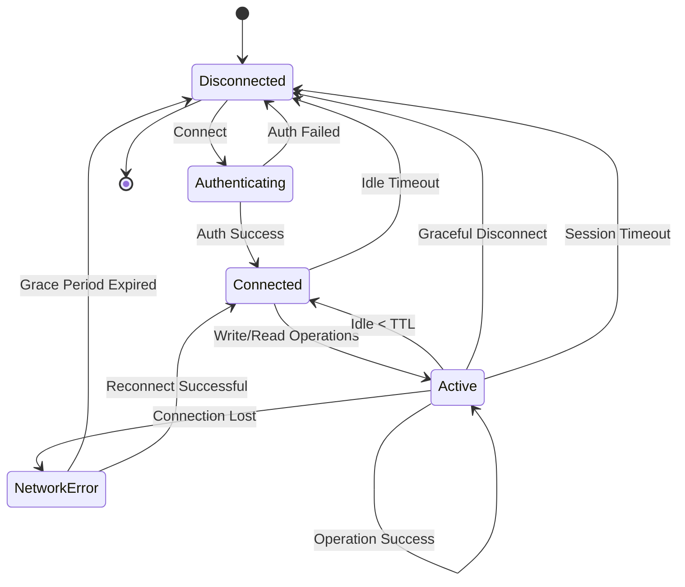
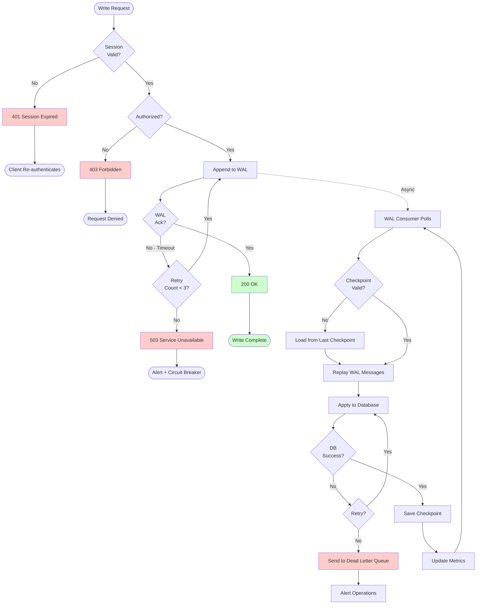

# WAL Full Transaction Flow

This diagram shows the complete lifecycle of a Write-Ahead Log transaction in Prism, including:
- Client authentication and authorization
- Write operations to WAL
- Async database application
- Session disconnection scenarios
- Crash recovery

## Sequence Diagram

```mermaid
sequenceDiagram
    actor Client
    participant Proxy as Prism Proxy
    participant Auth as Auth Service
    participant Session as Session Store
    participant WAL as WAL (Kafka)
    participant Consumer as WAL Consumer
    participant DB as Database (Postgres)
    participant Monitor as Health Monitor

    %% ========================================
    %% Phase 1: Authentication & Authorization
    %% ========================================

    Note over Client,Session: Phase 1: Authentication & Session Setup

    Client->>Proxy: Connect (credentials/mTLS)
    Proxy->>Auth: Authenticate(credentials)

    alt Invalid Credentials
        Auth-->>Proxy: AuthError
        Proxy-->>Client: 401 Unauthorized
    else Valid Credentials
        Auth-->>Proxy: Token + Claims
        Proxy->>Session: CreateSession(client_id, token, ttl=3600s)
        Session-->>Proxy: session_id
        Proxy-->>Client: 200 OK + session_id
    end

    Note over Client,Session: Session Active (TTL: 3600s)

    %% ========================================
    %% Phase 2: Normal Write Operation
    %% ========================================

    Note over Client,DB: Phase 2: Normal Write Flow

    Client->>Proxy: Write(namespace="orders", key="order:123", data={...}, session_id)

    Proxy->>Session: ValidateSession(session_id)

    alt Session Expired
        Session-->>Proxy: SessionExpired
        Proxy-->>Client: 401 Session Expired
        Note over Client,Proxy: Client must re-authenticate
    else Session Valid
        Session-->>Proxy: SessionInfo(client_id, permissions)

        Proxy->>Auth: Authorize(client_id, namespace="orders", operation="write")

        alt Unauthorized
            Auth-->>Proxy: Forbidden
            Proxy-->>Client: 403 Forbidden
        else Authorized
            Auth-->>Proxy: Allowed

            %% Write to WAL
            Proxy->>WAL: Append(topic="order-wal", msg={<br/>  client_id: "client123",<br/>  key: "order:123",<br/>  data: {...},<br/>  timestamp: 1704931200,<br/>  checksum: "abc123"<br/>})

            Note over WAL: Replicate across 3 brokers<br/>fsync to disk

            WAL-->>Proxy: Ack(offset=523, partition=0)

            Proxy->>Session: UpdateLastActivity(session_id)
            Proxy-->>Client: 200 OK {<br/>  wal_offset: 523,<br/>  partition: 0,<br/>  latency_ms: 1.2<br/>}

            Note over Client: Write complete!<br/>Latency: 1-2ms
        end
    end

    %% ========================================
    %% Phase 3: Async DB Application
    %% ========================================

    Note over Consumer,DB: Phase 3: Async Apply to Database

    loop Background Consumer
        Consumer->>WAL: Poll(topic="order-wal", offset=523)
        WAL-->>Consumer: Batch[msg1, msg2, ..., msgN]

        Consumer->>Consumer: ValidateChecksum(msgs)

        alt Checksum Failed
            Consumer->>Monitor: Alert(ChecksumError)
            Note over Consumer: Skip corrupt message<br/>or retry from backup
        else Checksum Valid
            Consumer->>DB: BeginTransaction()

            loop For each message in batch
                Consumer->>DB: Apply(INSERT INTO orders ...)
            end

            alt DB Write Failed
                DB-->>Consumer: Error(DeadlockDetected)
                Consumer->>DB: Rollback()
                Note over Consumer: Retry with backoff
            else DB Write Success
                Consumer->>DB: Commit()
                DB-->>Consumer: Success
                Consumer->>Consumer: UpdateCheckpoint(offset=523)
                Note over Consumer: Checkpoint saved<br/>Recovery point updated
            end
        end
    end

    %% ========================================
    %% Phase 4: Read-Your-Writes
    %% ========================================

    Note over Client,DB: Phase 4: Read Operation (Read-Your-Writes)

    Client->>Proxy: Read(namespace="orders", key="order:123", session_id)

    Proxy->>Session: ValidateSession(session_id)
    Session-->>Proxy: SessionInfo

    Proxy->>Auth: Authorize(client_id, namespace="orders", operation="read")
    Auth-->>Proxy: Allowed

    Proxy->>Consumer: GetAppliedOffset()
    Consumer-->>Proxy: applied_offset=520

    alt Data not yet applied (offset 523 > 520)
        Note over Proxy: WAL_FIRST read mode:<br/>Check WAL for unapplied writes

        Proxy->>WAL: Fetch(topic="order-wal", offset=520..523)
        WAL-->>Proxy: [order:123 data]
        Proxy-->>Client: 200 OK {data, source: "wal"}

    else Data already applied
        Proxy->>DB: SELECT * FROM orders WHERE key = 'order:123'
        DB-->>Proxy: {order data}
        Proxy-->>Client: 200 OK {data, source: "db"}
    end

    %% ========================================
    %% Phase 5: Session Disconnection Scenarios
    %% ========================================

    Note over Client,Monitor: Phase 5: Session Disconnection

    par Scenario A: Graceful Disconnect
        Client->>Proxy: Disconnect(session_id)
        Proxy->>Session: InvalidateSession(session_id)
        Session-->>Proxy: Deleted
        Proxy-->>Client: Connection Closed
        Note over Client,Proxy: Session cleaned up<br/>Resources released
    and Scenario B: Idle Timeout
        Note over Session: No activity for 3600s
        Session->>Session: TTL Expired
        Session->>Monitor: SessionExpired(session_id)
        Monitor->>Proxy: CloseConnection(session_id)
        Proxy-->>Client: Connection Closed (Timeout)
        Note over Session: Session auto-deleted
    and Scenario C: Network Failure
        Note over Client: Network partition<br/>Client unreachable
        Proxy->>Client: Heartbeat
        Note over Proxy: Timeout (no response)
        Proxy->>Session: MarkSessionDead(session_id)
        Session->>Session: Schedule cleanup (grace period: 30s)
        Note over Session: If no reconnect in 30s,<br/>session deleted
    end

    %% ========================================
    %% Phase 6: Crash Recovery
    %% ========================================

    Note over Consumer,DB: Phase 6: Crash Recovery

    Note over Consumer: Consumer crashes!

    rect rgb(255, 200, 200)
        Note over Consumer,DB: Recovery Process

        Consumer->>Consumer: Restart
        Consumer->>Consumer: LoadCheckpoint()
        Note over Consumer: Last checkpoint: offset=500

        Consumer->>WAL: Poll(topic="order-wal", offset=500)
        WAL-->>Consumer: Messages [500..523]

        Consumer->>Consumer: Check idempotency keys
        Note over Consumer: Skip already-applied messages<br/>using idempotency table

        Consumer->>DB: BeginTransaction()

        loop Replay unapplied messages
            Consumer->>DB: Apply(INSERT ... ON CONFLICT DO NOTHING)
        end

        Consumer->>DB: Commit()
        Consumer->>Consumer: UpdateCheckpoint(offset=523)

        Note over Consumer: Recovery complete!<br/>Back to normal operation
    end

    %% ========================================
    %% Phase 7: Health Monitoring
    %% ========================================

    Note over Proxy,Monitor: Phase 7: Continuous Health Monitoring

    loop Every 10s
        Monitor->>WAL: GetLatestOffset()
        WAL-->>Monitor: latest_offset=600

        Monitor->>Consumer: GetAppliedOffset()
        Consumer-->>Monitor: applied_offset=590

        Monitor->>Monitor: CalculateLag(600 - 590 = 10)

        alt Lag > Threshold (100)
            Monitor->>Monitor: Alert(HighWALLag)
            Note over Monitor: Page on-call engineer
        else Lag Acceptable
            Monitor->>Monitor: Metrics(wal_lag_seconds=0.15)
            Note over Monitor: All systems nominal
        end
    end
```



## State Transitions



## Error Scenarios and Recovery



## Key Components

### Session Store Schema

```yaml
session:
  session_id: uuid
  client_id: string
  created_at: timestamp
  last_activity: timestamp
  ttl: integer (seconds)
  permissions: json
  metadata:
    ip_address: string
    user_agent: string
    connection_type: "mTLS" | "OAuth2"
```

### WAL Message Schema

```yaml
wal_message:
  client_id: string
  namespace: string
  key: string
  operation: "insert" | "update" | "delete"
  data: bytes
  timestamp: int64
  checksum: string (SHA256)
  idempotency_key: uuid
  metadata:
    partition: int
    offset: int64
```

### Checkpoint Schema

```yaml
checkpoint:
  consumer_id: string
  topic: string
  partition: int
  offset: int64
  timestamp: int64
  message_count: int64
```

## Metrics

```promql
# WAL lag (critical for monitoring)
prism_wal_lag_seconds{namespace="orders"} 0.15

# Unapplied entries
prism_wal_unapplied_entries{namespace="orders"} 10

# Session metrics
prism_active_sessions{proxy="proxy-1"} 1250
prism_session_expirations_total{reason="timeout"} 45
prism_session_expirations_total{reason="network_error"} 12

# Auth metrics
prism_auth_requests_total{result="success"} 50000
prism_auth_requests_total{result="forbidden"} 120

# Write latency (target: <2ms)
prism_wal_write_latency_seconds{quantile="0.99"} 0.0018

# DB apply latency
prism_db_apply_latency_seconds{quantile="0.99"} 0.015
```

## References

- RFC-009: Distributed Reliability Data Patterns (Write-Ahead Log Pattern)
- ADR-002: Client-Originated Configuration
- ADR-035: Connection Pooling and Resource Management