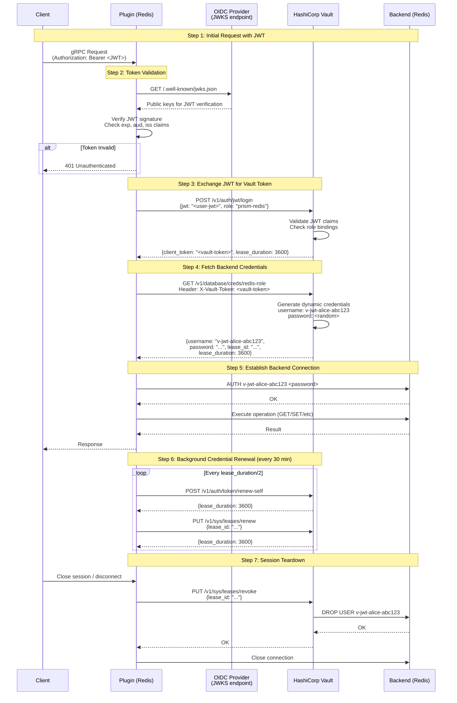
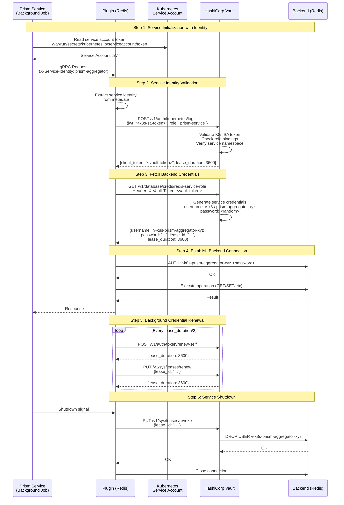

# MEMO-008: Vault Token Exchange Flow for Plugin Authentication

## Purpose

This memo documents the complete token exchange flow between Prism plugins and HashiCorp Vault for obtaining dynamic, per-session backend credentials. This flow is critical for implementing the architectural decision from RFC-019 to push token validation and credential exchange to the plugin layer.

## Overview

**Problem**: Plugins need to securely obtain backend credentials (database username/password, API keys) without using shared long-lived credentials.

**Solution**: Plugins exchange validated user JWT tokens with Vault to receive dynamic, short-lived credentials that are unique per session.

**Benefits**:
- Per-user audit trails in backend logs
- Automatic credential rotation
- Zero shared credentials (breach of one session doesn't compromise others)
- Fine-grained access control at backend level

## Token Exchange Flows

Prism supports two authentication flows:

1. **Human-Originated Requests**: User applications with OIDC JWT tokens
2. **Service-Originated Requests**: Service-to-service with machine identity

### Human-Originated Flow (Primary)

```text
┌──────────────────────────────────────────────────────────────────┐
│              Human-Originated Token Exchange Lifecycle           │
│                                                                  │
│  1. Client Request       → JWT token in gRPC metadata           │
│  2. Token Validation     → Plugin verifies JWT signature        │
│  3. Vault JWT Auth       → Exchange user JWT for Vault token    │
│  4. Credential Fetch     → Use Vault token to get DB creds      │
│  5. Backend Connection   → Establish connection with creds      │
│  6. Credential Renewal   → Background goroutine renews lease    │
│  7. Session Teardown     → Revoke Vault lease, close connection │
│                                                                  │
└──────────────────────────────────────────────────────────────────┘
```

### Service-Originated Flow

```text
┌──────────────────────────────────────────────────────────────────┐
│            Service-Originated Token Exchange Lifecycle           │
│                                                                  │
│  1. Service Request      → Service identity (K8s SA, IAM role)  │
│  2. Identity Validation  → Plugin validates service identity    │
│  3. Vault Auth           → Exchange identity for Vault token    │
│  4. Credential Fetch     → Use Vault token to get DB creds      │
│  5. Backend Connection   → Establish connection with creds      │
│  6. Credential Renewal   → Background goroutine renews lease    │
│  7. Service Shutdown     → Revoke Vault lease, close connection │
│                                                                  │
└──────────────────────────────────────────────────────────────────┘
```

### Detailed Sequence Diagram (Human-Originated)



### Detailed Sequence Diagram (Service-Originated)



## Implementation Details

### Service Authentication Methods

Prism supports multiple service authentication methods:

1. **Kubernetes Service Accounts** (Recommended for K8s deployments)
2. **AWS IAM Roles** (Recommended for AWS deployments)
3. **Azure Managed Identity** (Recommended for Azure deployments)
4. **GCP Service Accounts** (Recommended for GCP deployments)

### Kubernetes Service Account Authentication

```go
// pkg/authz/k8s_auth.go
package authz

import (
    "context"
    "fmt"
    "os"
    "time"

    vault "github.com/hashicorp/vault/api"
)

const (
    // Default service account token path
    k8sTokenPath = "/var/run/secrets/kubernetes.io/serviceaccount/token"
)

// K8sAuthenticator handles Kubernetes service account authentication
type K8sAuthenticator struct {
    client      *vault.Client
    role        string
    tokenPath   string
    mountPath   string
}

type K8sAuthConfig struct {
    VaultAddr  string // https://vault:8200
    Role       string // prism-service
    TokenPath  string // Optional, defaults to k8sTokenPath
    MountPath  string // auth/kubernetes
}

func NewK8sAuthenticator(config K8sAuthConfig) (*K8sAuthenticator, error) {
    vaultConfig := vault.DefaultConfig()
    vaultConfig.Address = config.VaultAddr

    client, err := vault.NewClient(vaultConfig)
    if err != nil {
        return nil, fmt.Errorf("failed to create Vault client: %w", err)
    }

    tokenPath := config.TokenPath
    if tokenPath == "" {
        tokenPath = k8sTokenPath
    }

    return &K8sAuthenticator{
        client:    client,
        role:      config.Role,
        tokenPath: tokenPath,
        mountPath: config.MountPath,
    }, nil
}

// AuthenticateServiceAccount exchanges K8s SA token for Vault token
func (k *K8sAuthenticator) AuthenticateServiceAccount(ctx context.Context) (string, time.Duration, error) {
    // Read service account token
    saToken, err := os.ReadFile(k.tokenPath)
    if err != nil {
        return "", 0, fmt.Errorf("failed to read service account token: %w", err)
    }

    // Prepare authentication request
    authPath := fmt.Sprintf("%s/login", k.mountPath)
    data := map[string]interface{}{
        "jwt":  string(saToken),
        "role": k.role,
    }

    // Authenticate to Vault
    secret, err := k.client.Logical().WriteWithContext(ctx, authPath, data)
    if err != nil {
        return "", 0, fmt.Errorf("K8s authentication failed: %w", err)
    }

    if secret == nil || secret.Auth == nil {
        return "", 0, fmt.Errorf("no auth data in response")
    }

    // Extract Vault token
    vaultToken := secret.Auth.ClientToken
    leaseDuration := time.Duration(secret.Auth.LeaseDuration) * time.Second

    // Set token on client
    k.client.SetToken(vaultToken)

    return vaultToken, leaseDuration, nil
}
```

### AWS IAM Role Authentication

```go
// pkg/authz/aws_auth.go
package authz

import (
    "context"
    "fmt"
    "time"

    vault "github.com/hashicorp/vault/api"
    "github.com/aws/aws-sdk-go/aws/session"
    "github.com/aws/aws-sdk-go/service/sts"
)

type AWSAuthenticator struct {
    client    *vault.Client
    role      string
    mountPath string
}

type AWSAuthConfig struct {
    VaultAddr string // https://vault:8200
    Role      string // prism-service-role
    MountPath string // auth/aws
}

func NewAWSAuthenticator(config AWSAuthConfig) (*AWSAuthenticator, error) {
    vaultConfig := vault.DefaultConfig()
    vaultConfig.Address = config.VaultAddr

    client, err := vault.NewClient(vaultConfig)
    if err != nil {
        return nil, fmt.Errorf("failed to create Vault client: %w", err)
    }

    return &AWSAuthenticator{
        client:    client,
        role:      config.Role,
        mountPath: config.MountPath,
    }, nil
}

// AuthenticateIAMRole exchanges AWS IAM role for Vault token
func (a *AWSAuthenticator) AuthenticateIAMRole(ctx context.Context) (string, time.Duration, error) {
    // Get AWS session (uses IAM role credentials automatically)
    sess := session.Must(session.NewSession())
    stsClient := sts.New(sess)

    // Get caller identity to prove IAM role
    identity, err := stsClient.GetCallerIdentityWithContext(ctx, &sts.GetCallerIdentityInput{})
    if err != nil {
        return "", 0, fmt.Errorf("failed to get AWS caller identity: %w", err)
    }

    // Prepare authentication request
    authPath := fmt.Sprintf("%s/login", a.mountPath)
    data := map[string]interface{}{
        "role":              a.role,
        "iam_http_request_method": "POST",
        "iam_request_url":   "https://sts.amazonaws.com/",
        "iam_request_body":  "Action=GetCallerIdentity&Version=2011-06-15",
        // AWS SigV4 headers would be added here
    }

    // Authenticate to Vault
    secret, err := a.client.Logical().WriteWithContext(ctx, authPath, data)
    if err != nil {
        return "", 0, fmt.Errorf("AWS authentication failed: %w", err)
    }

    if secret == nil || secret.Auth == nil {
        return "", 0, fmt.Errorf("no auth data in response")
    }

    vaultToken := secret.Auth.ClientToken
    leaseDuration := time.Duration(secret.Auth.LeaseDuration) * time.Second

    a.client.SetToken(vaultToken)

    return vaultToken, leaseDuration, nil
}
```

### Service Identity Propagation

```go
// pkg/authz/service_identity.go
package authz

import (
    "context"
    "fmt"

    "google.golang.org/grpc/metadata"
)

const (
    // Metadata key for service identity
    ServiceIdentityKey = "x-service-identity"
)

// ServiceIdentity represents a service's identity
type ServiceIdentity struct {
    ServiceName string
    Namespace   string
    ClusterName string
}

// ExtractServiceIdentity extracts service identity from gRPC metadata
func ExtractServiceIdentity(ctx context.Context) (*ServiceIdentity, error) {
    md, ok := metadata.FromIncomingContext(ctx)
    if !ok {
        return nil, fmt.Errorf("no metadata in request")
    }

    // Check for service identity header
    identityHeaders := md.Get(ServiceIdentityKey)
    if len(identityHeaders) == 0 {
        return nil, fmt.Errorf("no service identity header")
    }

    // Parse service identity
    // Format: "service-name.namespace.cluster"
    identity := identityHeaders[0]

    // Simple parsing (could be more sophisticated)
    return &ServiceIdentity{
        ServiceName: identity,
    }, nil
}

// InjectServiceIdentity adds service identity to outgoing gRPC metadata
func InjectServiceIdentity(ctx context.Context, identity *ServiceIdentity) context.Context {
    md := metadata.Pairs(
        ServiceIdentityKey, identity.ServiceName,
    )

    return metadata.NewOutgoingContext(ctx, md)
}
```

### Service Session Manager

```go
// pkg/authz/service_session.go
package authz

import (
    "context"
    "fmt"
    "sync"

    "github.com/go-redis/redis/v8"
)

// ServiceSessionManager manages service-to-service sessions
type ServiceSessionManager struct {
    k8sAuth     *K8sAuthenticator
    awsAuth     *AWSAuthenticator
    vault       *VaultClient
    connections map[string]*redis.Client
    mu          sync.RWMutex
}

func NewServiceSessionManager(k8s *K8sAuthenticator, aws *AWSAuthenticator, vault *VaultClient) *ServiceSessionManager {
    return &ServiceSessionManager{
        k8sAuth:     k8s,
        awsAuth:     aws,
        vault:       vault,
        connections: make(map[string]*redis.Client),
    }
}

// CreateServiceSession establishes service session with appropriate auth method
func (ssm *ServiceSessionManager) CreateServiceSession(ctx context.Context, serviceID string) (*redis.Client, error) {
    // Check if session already exists
    ssm.mu.RLock()
    if client, ok := ssm.connections[serviceID]; ok {
        ssm.mu.RUnlock()
        return client, nil
    }
    ssm.mu.RUnlock()

    // Authenticate to Vault based on environment
    var vaultToken string
    var leaseDuration time.Duration
    var err error

    // Try Kubernetes first (most common for Prism services)
    if ssm.k8sAuth != nil {
        vaultToken, leaseDuration, err = ssm.k8sAuth.AuthenticateServiceAccount(ctx)
        if err == nil {
            goto authenticated
        }
    }

    // Try AWS IAM role
    if ssm.awsAuth != nil {
        vaultToken, leaseDuration, err = ssm.awsAuth.AuthenticateIAMRole(ctx)
        if err == nil {
            goto authenticated
        }
    }

    return nil, fmt.Errorf("all service authentication methods failed")

authenticated:
    // Set Vault token on client
    ssm.vault.client.SetToken(vaultToken)

    // Fetch backend credentials
    creds, err := ssm.vault.GetBackendCredentials(ctx)
    if err != nil {
        return nil, fmt.Errorf("failed to get credentials: %w", err)
    }

    // Establish backend connection
    redisClient := redis.NewClient(&redis.Options{
        Addr:     "localhost:6379",
        Username: creds.Username,
        Password: creds.Password,
        DB:       0,
    })

    // Test connection
    if err := redisClient.Ping(ctx).Err(); err != nil {
        redisClient.Close()
        return nil, fmt.Errorf("Redis connection failed: %w", err)
    }

    // Start credential renewal
    sessionCtx, cancel := context.WithCancel(context.Background())
    go func() {
        ssm.vault.StartCredentialRenewal(sessionCtx, creds)
    }()

    // Store connection
    ssm.mu.Lock()
    ssm.connections[serviceID] = redisClient
    ssm.mu.Unlock()

    return redisClient, nil
}
```

### Vault Configuration for Service Authentication

#### Kubernetes Auth Method

```bash
# Enable Kubernetes auth method
vault auth enable kubernetes

# Configure Kubernetes auth with API server
vault write auth/kubernetes/config \
    kubernetes_host="https://kubernetes.default.svc:443" \
    kubernetes_ca_cert=@/var/run/secrets/kubernetes.io/serviceaccount/ca.crt \
    token_reviewer_jwt=@/var/run/secrets/kubernetes.io/serviceaccount/token

# Create role for Prism services
vault write auth/kubernetes/role/prism-service \
    bound_service_account_names="prism-aggregator,prism-worker" \
    bound_service_account_namespaces="prism-system" \
    token_ttl="1h" \
    token_max_ttl="2h" \
    token_policies="prism-service-policy"
```

#### AWS IAM Auth Method

```bash
# Enable AWS auth method
vault auth enable aws

# Configure AWS auth
vault write auth/aws/config/client \
    access_key="AKIA..." \
    secret_key="..." \
    region="us-west-2"

# Create role for EC2 instances
vault write auth/aws/role/prism-service-role \
    auth_type="iam" \
    bound_iam_principal_arn="arn:aws:iam::123456789012:role/prism-service" \
    token_ttl="1h" \
    token_max_ttl="2h" \
    token_policies="prism-service-policy"
```

### Service vs Human Authentication Comparison

| Aspect | Human-Originated | Service-Originated |
|--------|------------------|-------------------|
| **Identity Source** | OIDC provider (Dex, Auth0) | Platform (K8s SA, IAM role) |
| **Token Format** | User JWT (email, groups) | Service JWT (service name, namespace) |
| **Credential Username** | `v-jwt-alice-abc123` | `v-k8s-prism-aggregator-xyz` |
| **Session Lifetime** | Variable (user session) | Long-lived (service uptime) |
| **Audit Logging** | User email in backend logs | Service name in backend logs |
| **Revocation** | On user logout | On service shutdown |
| **Common Use Cases** | Interactive applications | Background jobs, aggregators, ETL |

## Implementation Details (Human-Originated)

### Step 1: Extract JWT from gRPC Metadata

```go
// pkg/authz/token_extractor.go
package authz

import (
    "context"
    "fmt"
    "strings"

    "google.golang.org/grpc/metadata"
)

// ExtractToken extracts JWT token from gRPC metadata
func ExtractToken(ctx context.Context) (string, error) {
    md, ok := metadata.FromIncomingContext(ctx)
    if !ok {
        return "", fmt.Errorf("no metadata in request")
    }

    // Check Authorization header (Bearer token)
    authHeaders := md.Get("authorization")
    if len(authHeaders) == 0 {
        return "", fmt.Errorf("no authorization header")
    }

    // Extract token from "Bearer <token>"
    authHeader := authHeaders[0]
    if !strings.HasPrefix(authHeader, "Bearer ") {
        return "", fmt.Errorf("invalid authorization header format")
    }

    token := strings.TrimPrefix(authHeader, "Bearer ")
    if token == "" {
        return "", fmt.Errorf("empty token")
    }

    return token, nil
}
```

### Step 2: Validate JWT Token

```go
// pkg/authz/token_validator.go
package authz

import (
    "context"
    "fmt"
    "time"

    "github.com/coreos/go-oidc/v3/oidc"
    "github.com/golang-jwt/jwt/v5"
)

type TokenValidator struct {
    issuer   string
    audience string
    verifier *oidc.IDTokenVerifier
}

type Claims struct {
    UserID    string    `json:"sub"`
    Email     string    `json:"email"`
    Groups    []string  `json:"groups"`
    ExpiresAt time.Time `json:"exp"`
    IssuedAt  time.Time `json:"iat"`
    Issuer    string    `json:"iss"`
}

func NewTokenValidator(issuer, audience string) (*TokenValidator, error) {
    ctx := context.Background()

    // Initialize OIDC provider
    provider, err := oidc.NewProvider(ctx, issuer)
    if err != nil {
        return nil, fmt.Errorf("failed to create OIDC provider: %w", err)
    }

    // Create verifier
    verifier := provider.Verifier(&oidc.Config{
        ClientID: audience,
    })

    return &TokenValidator{
        issuer:   issuer,
        audience: audience,
        verifier: verifier,
    }, nil
}

func (v *TokenValidator) Validate(ctx context.Context, tokenString string) (*Claims, error) {
    // Verify token with OIDC provider
    idToken, err := v.verifier.Verify(ctx, tokenString)
    if err != nil {
        return nil, fmt.Errorf("token verification failed: %w", err)
    }

    // Extract claims
    var claims Claims
    if err := idToken.Claims(&claims); err != nil {
        return nil, fmt.Errorf("failed to parse claims: %w", err)
    }

    // Additional validation
    if claims.UserID == "" {
        return nil, fmt.Errorf("missing subject (sub) claim")
    }

    if time.Now().After(claims.ExpiresAt) {
        return nil, fmt.Errorf("token expired at %v", claims.ExpiresAt)
    }

    return &claims, nil
}
```

### Step 3: Exchange JWT for Vault Token

```go
// pkg/authz/vault_client.go
package authz

import (
    "context"
    "fmt"
    "time"

    vault "github.com/hashicorp/vault/api"
)

type VaultClient struct {
    client *vault.Client
    config VaultConfig
}

type VaultConfig struct {
    Address       string        // https://vault:8200
    Namespace     string        // Optional Vault namespace
    Role          string        // JWT auth role (prism-redis)
    AuthPath      string        // JWT auth mount path (auth/jwt)
    SecretPath    string        // Secret engine path (database/creds/redis-role)
    RenewInterval time.Duration // Renew credentials every X (default: lease/2)
    TLS           TLSConfig     // TLS configuration
}

type TLSConfig struct {
    Enabled  bool
    CACert   string // Path to CA certificate
    SkipVerify bool // Skip TLS verification (dev only)
}

func NewVaultClient(config VaultConfig) (*VaultClient, error) {
    // Create Vault client config
    vaultConfig := vault.DefaultConfig()
    vaultConfig.Address = config.Address

    // Configure TLS if enabled
    if config.TLS.Enabled {
        tlsConfig := &vault.TLSConfig{
            CACert: config.TLS.CACert,
            Insecure: config.TLS.SkipVerify,
        }
        if err := vaultConfig.ConfigureTLS(tlsConfig); err != nil {
            return nil, fmt.Errorf("failed to configure TLS: %w", err)
        }
    }

    // Create client
    client, err := vault.NewClient(vaultConfig)
    if err != nil {
        return nil, fmt.Errorf("failed to create Vault client: %w", err)
    }

    // Set namespace if provided
    if config.Namespace != "" {
        client.SetNamespace(config.Namespace)
    }

    return &VaultClient{
        client: client,
        config: config,
    }, nil
}

// AuthenticateWithJWT exchanges user JWT for Vault token
func (v *VaultClient) AuthenticateWithJWT(ctx context.Context, userJWT string) (string, time.Duration, error) {
    // Prepare JWT auth request
    authPath := fmt.Sprintf("%s/login", v.config.AuthPath)
    data := map[string]interface{}{
        "jwt":  userJWT,
        "role": v.config.Role,
    }

    // Authenticate to Vault
    secret, err := v.client.Logical().WriteWithContext(ctx, authPath, data)
    if err != nil {
        return "", 0, fmt.Errorf("JWT authentication failed: %w", err)
    }

    if secret == nil || secret.Auth == nil {
        return "", 0, fmt.Errorf("no auth data in response")
    }

    // Extract Vault token and lease duration
    vaultToken := secret.Auth.ClientToken
    leaseDuration := time.Duration(secret.Auth.LeaseDuration) * time.Second

    // Set token on client
    v.client.SetToken(vaultToken)

    return vaultToken, leaseDuration, nil
}
```

### Step 4: Fetch Backend Credentials

```go
// pkg/authz/vault_credentials.go
package authz

import (
    "context"
    "fmt"
    "time"
)

type BackendCredentials struct {
    Username      string
    Password      string
    LeaseID       string
    LeaseDuration time.Duration
    VaultToken    string
    RenewedAt     time.Time
}

// GetBackendCredentials fetches dynamic credentials from Vault
func (v *VaultClient) GetBackendCredentials(ctx context.Context) (*BackendCredentials, error) {
    // Read credentials from Vault secret engine
    secret, err := v.client.Logical().ReadWithContext(ctx, v.config.SecretPath)
    if err != nil {
        return nil, fmt.Errorf("failed to read credentials: %w", err)
    }

    if secret == nil || secret.Data == nil {
        return nil, fmt.Errorf("no credential data in response")
    }

    // Extract credentials
    username, ok := secret.Data["username"].(string)
    if !ok {
        return nil, fmt.Errorf("username not found in response")
    }

    password, ok := secret.Data["password"].(string)
    if !ok {
        return nil, fmt.Errorf("password not found in response")
    }

    leaseDuration := time.Duration(secret.LeaseDuration) * time.Second

    creds := &BackendCredentials{
        Username:      username,
        Password:      password,
        LeaseID:       secret.LeaseID,
        LeaseDuration: leaseDuration,
        VaultToken:    v.client.Token(),
        RenewedAt:     time.Now(),
    }

    return creds, nil
}
```

### Step 5: Background Credential Renewal

```go
// pkg/authz/vault_renewal.go
package authz

import (
    "context"
    "log"
    "time"
)

// StartCredentialRenewal starts background goroutine to renew credentials
func (v *VaultClient) StartCredentialRenewal(ctx context.Context, creds *BackendCredentials) {
    // Calculate renewal interval (half of lease duration)
    renewInterval := creds.LeaseDuration / 2
    if v.config.RenewInterval > 0 {
        renewInterval = v.config.RenewInterval
    }

    ticker := time.NewTicker(renewInterval)
    defer ticker.Stop()

    log.Printf("Starting credential renewal (interval: %v, lease_id: %s)",
        renewInterval, creds.LeaseID)

    for {
        select {
        case <-ctx.Done():
            log.Printf("Stopping credential renewal: context cancelled")
            return

        case <-ticker.C:
            if err := v.renewCredentials(ctx, creds); err != nil {
                log.Printf("Failed to renew credentials: %v", err)
                // Continue trying - don't exit on error
                continue
            }

            log.Printf("Successfully renewed credentials (lease_id: %s)", creds.LeaseID)
        }
    }
}

func (v *VaultClient) renewCredentials(ctx context.Context, creds *BackendCredentials) error {
    // Renew Vault token first
    tokenSecret, err := v.client.Auth().Token().RenewSelfWithContext(
        ctx,
        int(creds.LeaseDuration.Seconds()),
    )
    if err != nil {
        return fmt.Errorf("failed to renew Vault token: %w", err)
    }

    log.Printf("Renewed Vault token (new lease: %ds)", tokenSecret.Auth.LeaseDuration)

    // Renew backend credentials lease
    leaseSecret, err := v.client.Logical().WriteWithContext(
        ctx,
        "/sys/leases/renew",
        map[string]interface{}{
            "lease_id": creds.LeaseID,
            "increment": int(creds.LeaseDuration.Seconds()),
        },
    )
    if err != nil {
        return fmt.Errorf("failed to renew credential lease: %w", err)
    }

    // Update lease duration if changed
    if leaseSecret != nil {
        creds.LeaseDuration = time.Duration(leaseSecret.LeaseDuration) * time.Second
        creds.RenewedAt = time.Now()
    }

    return nil
}

// RevokeCredentials revokes Vault lease (cleanup on session end)
func (v *VaultClient) RevokeCredentials(ctx context.Context, leaseID string) error {
    _, err := v.client.Logical().WriteWithContext(
        ctx,
        "/sys/leases/revoke",
        map[string]interface{}{
            "lease_id": leaseID,
        },
    )

    if err != nil {
        return fmt.Errorf("failed to revoke lease %s: %w", leaseID, err)
    }

    log.Printf("Revoked Vault lease: %s", leaseID)
    return nil
}
```

### Step 6: Complete Plugin Integration

```go
// patterns/redis/session.go
package main

import (
    "context"
    "fmt"
    "sync"

    "github.com/go-redis/redis/v8"
    "github.com/prism/pattern-sdk/authz"
)

// PluginSession represents a single client session with credentials
type PluginSession struct {
    SessionID   string
    UserID      string
    Claims      *authz.Claims
    Credentials *authz.BackendCredentials
    RedisClient *redis.Client
    CancelFunc  context.CancelFunc

    mu sync.RWMutex
}

// SessionManager manages per-session credentials and connections
type SessionManager struct {
    validator *authz.TokenValidator
    vault     *authz.VaultClient
    sessions  map[string]*PluginSession
    mu        sync.RWMutex
}

func NewSessionManager(validator *authz.TokenValidator, vault *authz.VaultClient) *SessionManager {
    return &SessionManager{
        validator: validator,
        vault:     vault,
        sessions:  make(map[string]*PluginSession),
    }
}

// CreateSession establishes new session with token exchange
func (sm *SessionManager) CreateSession(ctx context.Context, sessionID, token string) (*PluginSession, error) {
    // Step 1: Validate JWT token
    claims, err := sm.validator.Validate(ctx, token)
    if err != nil {
        return nil, fmt.Errorf("token validation failed: %w", err)
    }

    // Step 2: Exchange JWT for Vault token
    vaultToken, leaseDuration, err := sm.vault.AuthenticateWithJWT(ctx, token)
    if err != nil {
        return nil, fmt.Errorf("Vault authentication failed: %w", err)
    }

    // Step 3: Fetch backend credentials
    creds, err := sm.vault.GetBackendCredentials(ctx)
    if err != nil {
        return nil, fmt.Errorf("failed to get credentials: %w", err)
    }

    // Step 4: Establish Redis connection with dynamic credentials
    redisClient := redis.NewClient(&redis.Options{
        Addr:     "localhost:6379",
        Username: creds.Username,
        Password: creds.Password,
        DB:       0,
    })

    // Test connection
    if err := redisClient.Ping(ctx).Err(); err != nil {
        redisClient.Close()
        return nil, fmt.Errorf("Redis connection failed: %w", err)
    }

    // Create session context for renewal goroutine
    sessionCtx, cancel := context.WithCancel(context.Background())

    session := &PluginSession{
        SessionID:   sessionID,
        UserID:      claims.UserID,
        Claims:      claims,
        Credentials: creds,
        RedisClient: redisClient,
        CancelFunc:  cancel,
    }

    // Step 5: Start background credential renewal
    go sm.vault.StartCredentialRenewal(sessionCtx, creds)

    // Store session
    sm.mu.Lock()
    sm.sessions[sessionID] = session
    sm.mu.Unlock()

    return session, nil
}

// GetSession retrieves existing session
func (sm *SessionManager) GetSession(sessionID string) (*PluginSession, error) {
    sm.mu.RLock()
    defer sm.mu.RUnlock()

    session, ok := sm.sessions[sessionID]
    if !ok {
        return nil, fmt.Errorf("session not found: %s", sessionID)
    }

    return session, nil
}

// CloseSession terminates session and revokes credentials
func (sm *SessionManager) CloseSession(ctx context.Context, sessionID string) error {
    sm.mu.Lock()
    session, ok := sm.sessions[sessionID]
    if !ok {
        sm.mu.Unlock()
        return fmt.Errorf("session not found: %s", sessionID)
    }
    delete(sm.sessions, sessionID)
    sm.mu.Unlock()

    // Stop renewal goroutine
    session.CancelFunc()

    // Close Redis connection
    if err := session.RedisClient.Close(); err != nil {
        return fmt.Errorf("failed to close Redis connection: %w", err)
    }

    // Revoke Vault lease
    if err := sm.vault.RevokeCredentials(ctx, session.Credentials.LeaseID); err != nil {
        return fmt.Errorf("failed to revoke Vault lease: %w", err)
    }

    return nil
}
```

## Vault Configuration

### JWT Auth Method Setup

```bash
# Enable JWT auth method
vault auth enable jwt

# Configure JWT auth with OIDC provider
vault write auth/jwt/config \
    oidc_discovery_url="https://auth.prism.io" \
    default_role="prism-redis"

# Create role for Redis pattern provider
vault write auth/jwt/role/prism-redis \
    role_type="jwt" \
    bound_audiences="prism-patterns" \
    user_claim="sub" \
    groups_claim="groups" \
    token_ttl="1h" \
    token_max_ttl="2h" \
    token_policies="prism-redis"
```

### Database Secrets Engine Setup

```bash
# Enable database secrets engine
vault secrets enable database

# Configure Redis connection
vault write database/config/redis \
    plugin_name="redis-database-plugin" \
    host="redis" \
    port=6379 \
    username="vault-admin" \
    password="admin-password" \
    allowed_roles="redis-role"

# Create role for dynamic credentials
vault write database/roles/redis-role \
    db_name="redis" \
    creation_statements='["ACL SETUSER {{username}} on >{{password}} ~* +@all"]' \
    revocation_statements='["ACL DELUSER {{username}}"]' \
    default_ttl="1h" \
    max_ttl="2h"
```

### Vault Policy

```hcl
# Policy for Redis pattern provider
path "auth/token/renew-self" {
  capabilities = ["update"]
}

path "sys/leases/renew" {
  capabilities = ["update"]
}

path "database/creds/redis-role" {
  capabilities = ["read"]
}
```

Apply policy:
```bash
vault policy write prism-redis prism-redis.hcl
```

## Error Handling

### Common Failure Scenarios

1. **JWT Validation Fails**
   - Check: Token expiry, issuer, audience claims
   - Action: Return 401 Unauthenticated to client
   - Log: Token validation error with reason

2. **Vault Authentication Fails**
   - Check: JWT role binding, Vault connectivity
   - Action: Return 503 Service Unavailable
   - Log: Vault authentication error

3. **Credential Fetch Fails**
   - Check: Vault token validity, database secrets engine
   - Action: Return 503 Service Unavailable
   - Log: Credential fetch error

4. **Backend Connection Fails**
   - Check: Credentials correctness, backend availability
   - Action: Retry with exponential backoff (3 attempts)
   - Log: Backend connection error

5. **Credential Renewal Fails**
   - Check: Vault token validity, lease expiry
   - Action: Continue retrying, alert if consecutive failures > 3
   - Log: Renewal failure with lease_id

### Retry Logic Example

```go
func connectWithRetry(ctx context.Context, creds *authz.BackendCredentials, maxRetries int) (*redis.Client, error) {
    var client *redis.Client
    var lastErr error

    backoff := time.Second

    for i := 0; i < maxRetries; i++ {
        client = redis.NewClient(&redis.Options{
            Addr:     "localhost:6379",
            Username: creds.Username,
            Password: creds.Password,
        })

        if err := client.Ping(ctx).Err(); err == nil {
            return client, nil
        } else {
            lastErr = err
            client.Close()

            if i < maxRetries-1 {
                log.Printf("Connection attempt %d failed: %v, retrying in %v",
                    i+1, err, backoff)
                time.Sleep(backoff)
                backoff *= 2 // Exponential backoff
            }
        }
    }

    return nil, fmt.Errorf("failed after %d attempts: %w", maxRetries, lastErr)
}
```

## Performance Considerations

### Token Validation Caching

Cache JWKS public keys to avoid fetching on every validation:

```go
type CachedValidator struct {
    validator *authz.TokenValidator
    cache     *sync.Map
    cacheTTL  time.Duration
}

type cachedToken struct {
    claims    *authz.Claims
    expiresAt time.Time
}

func (cv *CachedValidator) Validate(ctx context.Context, token string) (*authz.Claims, error) {
    // Check cache first (keyed by token hash)
    tokenHash := sha256Hash(token)

    if cached, ok := cv.cache.Load(tokenHash); ok {
        ct := cached.(cachedToken)
        if time.Now().Before(ct.expiresAt) {
            return ct.claims, nil
        }
        cv.cache.Delete(tokenHash)
    }

    // Validate token
    claims, err := cv.validator.Validate(ctx, token)
    if err != nil {
        return nil, err
    }

    // Cache for shorter of: token expiry or cache TTL
    cacheExpiry := time.Now().Add(cv.cacheTTL)
    if claims.ExpiresAt.Before(cacheExpiry) {
        cacheExpiry = claims.ExpiresAt
    }

    cv.cache.Store(tokenHash, cachedToken{
        claims:    claims,
        expiresAt: cacheExpiry,
    })

    return claims, nil
}
```

### Connection Pooling

Maintain connection pool per session (not per request):

```go
type SessionConnectionPool struct {
    pools map[string]*redis.Client
    mu    sync.RWMutex
}

func (scp *SessionConnectionPool) GetConnection(sessionID string) (*redis.Client, error) {
    scp.mu.RLock()
    client, ok := scp.pools[sessionID]
    scp.mu.RUnlock()

    if ok {
        return client, nil
    }

    return nil, fmt.Errorf("no connection for session %s", sessionID)
}
```

## Security Best Practices

1. **Never Log Credentials**
   - Log lease_id, username, but NEVER passwords or tokens
   - Use `[REDACTED]` placeholder in logs

2. **Secure Token Transmission**
   - Always use TLS for gRPC connections
   - Verify client certificates (mTLS) in production

3. **Vault Token Rotation**
   - Renew Vault tokens every lease_duration/2
   - Use short TTLs (1h default)

4. **Credential Isolation**
   - Each session gets unique credentials
   - Backend ACLs enforce user-specific permissions

5. **Lease Revocation**
   - Always revoke leases on session close
   - Implement timeout for idle sessions

## Related Documents

- [RFC-019: Pattern SDK Authorization Layer](/rfc/rfc-019) - Authorization architecture
- [RFC-011: Data Proxy Authentication](/rfc/rfc-011-data-proxy-authentication) - Secrets provider abstraction
- [ADR-050: Topaz for Policy Authorization](/adr/adr-050-topaz-policy-authorization) - Policy enforcement

## Revision History

- 2025-10-11: Updated terminology from "Plugin SDK" to "Pattern SDK" for consistency with RFC-022
- 2025-10-10: Added service-originated request flow (K8s SA, AWS IAM, Azure MI, GCP SA authentication)
- 2025-10-09: Initial memo documenting Vault token exchange flow for human-originated requests