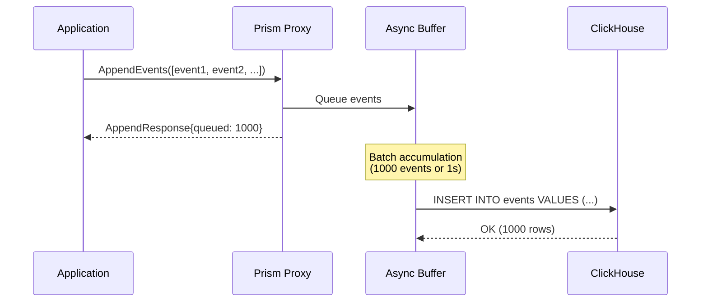
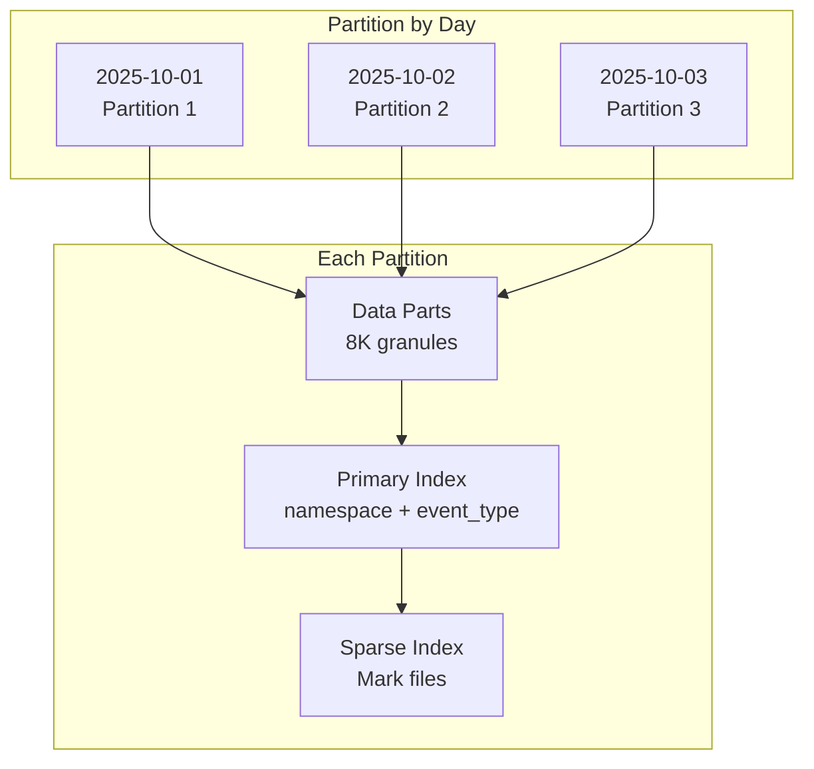
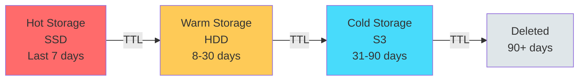

## Abstract

This RFC specifies the integration of ClickHouse into Prism as a high-performance OLAP database optimized for time series analytics. ClickHouse provides columnar storage, real-time ingestion, and lightning-fast analytical queries, making it ideal for metrics, logs, events, and observability data.

## 1. Introduction

### 1.1 Purpose

ClickHouse integration addresses analytical time series workloads:

1. **Metrics Storage**: Application metrics, system metrics, business KPIs
2. **Event Logging**: Application logs, audit logs, user activity events
3. **Observability**: Traces, spans, and distributed system telemetry
4. **Analytics**: Real-time aggregations, rollups, and dashboards

### 1.2 Goals

- **Ingestion Rate**: 1M+ events/sec sustained write throughput
- **Query Performance**: Sub-second aggregations over billions of rows
- **Compression**: 10-100x compression ratio for time series data
- **Retention**: Automatic data lifecycle with TTL and tiered storage
- **Scalability**: Horizontal scaling with ReplicatedMergeTree

### 1.3 Non-Goals

- **Not for OLTP**: Use Postgres for transactional workloads
- **Not for full-text search**: Use Elasticsearch or TypeSense
- **Not for updates**: ClickHouse is append-only (use Postgres for mutable data)
- **Not for joins**: Optimized for denormalized data, avoid complex joins

## 2. Architecture Overview

### 2.1 Time Series Pipeline

```mermaid
graph TB
    subgraph "Ingestion"
        Client[Client Applications]
        Proxy[Prism Proxy]
        Buffer[Async Buffer<br/>Batching]
    end

    subgraph "ClickHouse Cluster"
        Shard1[Shard 1<br/>ReplicatedMergeTree]
        Shard2[Shard 2<br/>ReplicatedMergeTree]
        Replica1[Replica 1]
        Replica2[Replica 2]
    end

    subgraph "Query"
        Query[Query Service]
        Materialized[Materialized Views<br/>Pre-aggregations]
    end

    Client -->|Write Batch| Proxy
    Proxy --> Buffer
    Buffer -->|Distributed Write| Shard1
    Buffer -->|Distributed Write| Shard2

    Shard1 -.->|Replication| Replica1
    Shard2 -.->|Replication| Replica2

    Client -->|Analytical Query| Proxy
    Proxy --> Query
    Query --> Materialized
    Materialized --> Shard1
    Materialized --> Shard2
```

### 2.2 Data Flow



## 3. Time Series Access Pattern

### 3.1 Use Cases

**Metrics**
- Application performance metrics (request rate, latency, errors)
- Infrastructure metrics (CPU, memory, disk, network)
- Business metrics (revenue, conversions, user activity)

**Logs**
- Application logs (errors, warnings, debug)
- Access logs (HTTP requests, API calls)
- Audit logs (security events, compliance)

**Events**
- User activity (clicks, page views, sessions)
- System events (deployments, configuration changes)
- IoT telemetry (sensor data, device events)

**Traces**
- Distributed tracing spans
- Service dependencies and call graphs
- Performance profiling

### 3.2 Interface

```protobuf
syntax = "proto3";

package prism.timeseries.v1;

service TimeSeriesService {
  // Append events (batched, async)
  rpc AppendEvents(AppendEventsRequest) returns (AppendEventsResponse);

  // Stream events (for high-throughput ingestion)
  rpc StreamEvents(stream Event) returns (StreamEventsResponse);

  // Query events with time range and filters
  rpc QueryEvents(QueryRequest) returns (QueryResponse);

  // Query with aggregations
  rpc QueryAggregates(AggregateRequest) returns (AggregateResponse);

  // Stream query results (for large datasets)
  rpc StreamQuery(QueryRequest) returns (stream Event);
}

message Event {
  // Timestamp (nanosecond precision)
  google.protobuf.Timestamp timestamp = 1;

  // Event metadata
  string event_type = 2;
  string source = 3;

  // Dimensions (indexed)
  map<string, string> dimensions = 4;

  // Metrics (columnar storage)
  map<string, double> metrics = 5;

  // Payload (compressed)
  bytes payload = 6;
}

message AppendEventsRequest {
  string session_id = 1;
  string namespace = 2;
  repeated Event events = 3;

  // Async mode (immediate response)
  bool async = 4;
}

message QueryRequest {
  string session_id = 1;
  string namespace = 2;

  // Time range (required for partition pruning)
  google.protobuf.Timestamp start_time = 3;
  google.protobuf.Timestamp end_time = 4;

  // Filters (WHERE clause)
  map<string, string> filters = 5;

  // SQL-like query (optional)
  string sql = 6;

  // Pagination
  int32 limit = 7;
  int32 offset = 8;
}

message AggregateRequest {
  string session_id = 1;
  string namespace = 2;

  google.protobuf.Timestamp start_time = 3;
  google.protobuf.Timestamp end_time = 4;

  // Aggregation function
  enum AggregateFunc {
    COUNT = 0;
    SUM = 1;
    AVG = 2;
    MIN = 3;
    MAX = 4;
    QUANTILE_95 = 5;
    QUANTILE_99 = 6;
  }

  // Metrics to aggregate
  repeated string metric_names = 5;
  repeated AggregateFunc functions = 6;

  // Group by dimensions
  repeated string group_by = 7;

  // Time bucket (for time series)
  google.protobuf.Duration bucket_size = 8;
}
```

### 3.3 Schema Design

```sql
-- Main events table (sharded by timestamp)
CREATE TABLE events ON CLUSTER '{cluster}' (
    timestamp DateTime64(9),
    event_type LowCardinality(String),
    source LowCardinality(String),
    namespace LowCardinality(String),

    -- Dimensions (indexed)
    dimensions Map(String, String),

    -- Metrics (columnar)
    metrics Map(String, Float64),

    -- Payload (compressed)
    payload String CODEC(ZSTD(3))
)
ENGINE = ReplicatedMergeTree('/clickhouse/tables/{shard}/events', '{replica}')
PARTITION BY toYYYYMMDD(timestamp)
ORDER BY (namespace, event_type, timestamp)
TTL timestamp + INTERVAL 90 DAY
SETTINGS index_granularity = 8192;

-- Distributed table (query interface)
CREATE TABLE events_distributed ON CLUSTER '{cluster}' AS events
ENGINE = Distributed('{cluster}', default, events, rand());
```

### 3.4 Materialized Views for Pre-aggregations

```sql
-- 1-minute rollups
CREATE MATERIALIZED VIEW events_1m ON CLUSTER '{cluster}'
ENGINE = ReplicatedSummingMergeTree('/clickhouse/tables/{shard}/events_1m', '{replica}')
PARTITION BY toYYYYMMDD(timestamp)
ORDER BY (namespace, event_type, timestamp_1m)
AS SELECT
    toStartOfMinute(timestamp) AS timestamp_1m,
    namespace,
    event_type,
    count() AS event_count,
    sumMap(metrics) AS metrics_sum,
    avgMap(metrics) AS metrics_avg
FROM events
GROUP BY timestamp_1m, namespace, event_type;

-- 1-hour rollups (from 1-minute)
CREATE MATERIALIZED VIEW events_1h ON CLUSTER '{cluster}'
ENGINE = ReplicatedSummingMergeTree('/clickhouse/tables/{shard}/events_1h', '{replica}')
PARTITION BY toYYYYMM(timestamp)
ORDER BY (namespace, event_type, timestamp_1h)
AS SELECT
    toStartOfHour(timestamp_1m) AS timestamp_1h,
    namespace,
    event_type,
    sum(event_count) AS event_count,
    sumMap(metrics_sum) AS metrics_sum
FROM events_1m
GROUP BY timestamp_1h, namespace, event_type;
```

## 4. Query Patterns

### 4.1 Time Range Queries

```sql
-- Recent events (last 1 hour)
SELECT *
FROM events_distributed
WHERE namespace = 'app:production'
  AND timestamp >= now() - INTERVAL 1 HOUR
ORDER BY timestamp DESC
LIMIT 100;
```

### 4.2 Aggregations

```sql
-- Request rate per minute (last 24 hours)
SELECT
    toStartOfMinute(timestamp) AS minute,
    count() AS request_count,
    avg(metrics['duration_ms']) AS avg_duration,
    quantile(0.95)(metrics['duration_ms']) AS p95_duration
FROM events_distributed
WHERE namespace = 'api:requests'
  AND timestamp >= now() - INTERVAL 24 HOUR
GROUP BY minute
ORDER BY minute;
```

### 4.3 Top-N Queries

```sql
-- Top 10 endpoints by error rate
SELECT
    dimensions['endpoint'] AS endpoint,
    countIf(dimensions['status'] >= '500') AS error_count,
    count() AS total_count,
    error_count / total_count AS error_rate
FROM events_distributed
WHERE namespace = 'api:requests'
  AND timestamp >= now() - INTERVAL 1 HOUR
GROUP BY endpoint
ORDER BY error_rate DESC
LIMIT 10;
```

### 4.4 Time Series Bucketing

```sql
-- P99 latency per 5-minute bucket
SELECT
    toStartOfInterval(timestamp, INTERVAL 5 MINUTE) AS bucket,
    quantile(0.99)(metrics['latency_ms']) AS p99_latency
FROM events_distributed
WHERE namespace = 'service:checkout'
  AND timestamp >= now() - INTERVAL 6 HOUR
GROUP BY bucket
ORDER BY bucket;
```

## 5. Performance Optimizations

### 5.1 Partitioning Strategy



**Benefits**:
- **Partition Pruning**: Only scan relevant days
- **TTL**: Drop old partitions efficiently
- **Parallel Queries**: Query partitions in parallel

### 5.2 Compression

```sql
-- Codec comparison
ALTER TABLE events MODIFY COLUMN payload String CODEC(ZSTD(3));  -- 10x compression
ALTER TABLE events MODIFY COLUMN dimensions Map(String, String) CODEC(LZ4);  -- 3x, faster
```

**Compression Ratios**:
- **ZSTD(3)**: 10-15x (best compression)
- **LZ4**: 2-3x (fastest)
- **Delta + LZ4**: 20x+ for monotonic data (timestamps, counters)

### 5.3 Async Inserts

```sql
-- Enable async inserts (client-side batching)
SET async_insert = 1;
SET wait_for_async_insert = 0;
SET async_insert_max_data_size = 10000000;  -- 10MB batches
SET async_insert_busy_timeout_ms = 1000;     -- 1s max wait
```

## 6. Configuration

### 6.1 Client Configuration

```protobuf
message ClickHouseBackendConfig {
  // Connection
  repeated string hosts = 1;
  int32 port = 2;
  string database = 3;
  string username = 4;
  string password = 5;

  // Cluster settings
  bool cluster_mode = 6;
  string cluster_name = 7;
  int32 num_shards = 8;
  int32 num_replicas = 9;

  // Performance
  int32 batch_size = 10;             // Events per batch
  google.protobuf.Duration batch_timeout = 11;  // Max wait time
  bool async_insert = 12;
  int32 insert_threads = 13;

  // Retention
  int32 ttl_days = 14;
  bool enable_tiered_storage = 15;

  // Table settings
  string partition_by = 16;  // "toYYYYMMDD(timestamp)"
  string order_by = 17;      // "(namespace, event_type, timestamp)"
  int32 index_granularity = 18;
}
```

### 6.2 Server Configuration

```yaml
# config/clickhouse.yaml
clickhouse:
  cluster:
    name: "prism_cluster"
    shards:
      - hosts: ["ch-shard1-1.internal:9000", "ch-shard1-2.internal:9000"]
      - hosts: ["ch-shard2-1.internal:9000", "ch-shard2-2.internal:9000"]

  tables:
    events:
      engine: "ReplicatedMergeTree"
      partition_by: "toYYYYMMDD(timestamp)"
      order_by: "(namespace, event_type, timestamp)"
      ttl_days: 90
      compression: "ZSTD(3)"

  performance:
    batch_size: 10000
    batch_timeout: "1s"
    async_insert: true
    insert_threads: 4
    max_memory_usage: "10GB"

  materialized_views:
    - name: "events_1m"
      enabled: true
    - name: "events_1h"
      enabled: true
    - name: "events_1d"
      enabled: false  # Enable for long-term storage
```

## 7. Operational Considerations

### 7.1 Capacity Planning

**Storage Calculation**:
```
daily_volume = events_per_day × avg_event_size_bytes
compressed_size = daily_volume / compression_ratio
retention_storage = compressed_size × retention_days × (1 + replica_count)
```

**Example**:
- 1B events/day × 200 bytes = 200GB/day uncompressed
- 200GB / 10 (ZSTD) = 20GB/day compressed
- 20GB × 90 days × 2 (replication) = 3.6TB total

**Query Performance**:
- 1M events/sec ingestion requires ~4 shards
- Sub-second queries over 1TB datasets
- 100 concurrent analytical queries supported

### 7.2 Monitoring

```yaml
metrics:
  ingestion:
    - insert_rate_events_per_sec
    - insert_throughput_bytes_per_sec
    - async_insert_queue_size
    - insert_latency_p99

  storage:
    - disk_usage_bytes
    - compression_ratio
    - parts_count
    - partition_count

  queries:
    - query_rate_per_sec
    - query_latency_p50
    - query_latency_p99
    - memory_usage_per_query
    - running_queries_count

  replication:
    - replication_lag_seconds
    - replica_queue_size
```

### 7.3 Data Lifecycle



```sql
-- Tiered storage with TTL
ALTER TABLE events MODIFY TTL
    timestamp + INTERVAL 7 DAY TO VOLUME 'hot',
    timestamp + INTERVAL 30 DAY TO VOLUME 'warm',
    timestamp + INTERVAL 90 DAY TO VOLUME 'cold',
    timestamp + INTERVAL 90 DAY DELETE;
```

## 8. Migration Path

### 8.1 Phase 1: Single Node (Week 1-2)

- Deploy ClickHouse standalone
- Implement TimeSeriesService gRPC interface
- Create basic events table
- Integration tests with mock data

### 8.2 Phase 2: Cluster Setup (Week 3-4)

- Deploy 2-shard cluster with replication
- Configure Distributed tables
- Implement async batching
- Load testing (1M events/sec)

### 8.3 Phase 3: Materialized Views (Week 5-6)

- Create 1-minute rollups
- Create 1-hour rollups
- Query optimization with pre-aggregations
- Benchmarking (query latency)

### 8.4 Phase 4: Production (Week 7-8)

- Tiered storage configuration
- Alerting and monitoring
- Backup and disaster recovery
- Documentation and runbooks

## 9. Use Case Recommendations

### 9.1 When to Use ClickHouse

✅ **Use When**:
- Append-only time series data
- Analytical queries over large datasets
- Real-time aggregations needed
- High ingestion rate (`>100k` events/sec)
- Data has natural time dimension

❌ **Avoid When**:
- Need updates/deletes (use Postgres)
- Complex joins required (use Postgres)
- Full-text search needed (use Elasticsearch)
- Small dataset (`<1M` rows, use Postgres)

### 9.2 ClickHouse vs Alternatives

| Use Case | ClickHouse | Postgres | Kafka |
|----------|-----------|----------|-------|
| Metrics storage | ✅ Excellent | ❌ Poor | ❌ No analytics |
| Event logging | ✅ Excellent | ⚠️ Limited | ✅ Good |
| Real-time dashboards | ✅ Excellent | ❌ Slow | ❌ No queries |
| Retention (90+ days) | ✅ Efficient | ❌ Expensive | ⚠️ Complex |
| Complex aggregations | ✅ Fast | ⚠️ Moderate | ❌ Not supported |

## 10. References

- [ClickHouse Documentation](https://clickhouse.com/docs/)
- [ReplicatedMergeTree Engine](https://clickhouse.com/docs/en/engines/table-engines/mergetree-family/replication)
- [Materialized Views](https://clickhouse.com/docs/en/guides/developer/cascading-materialized-views)
- [Compression Codecs](https://clickhouse.com/docs/en/sql-reference/statements/create/table#column_compression_codec)

## 11. Revision History

- 2025-10-08: Initial draft
