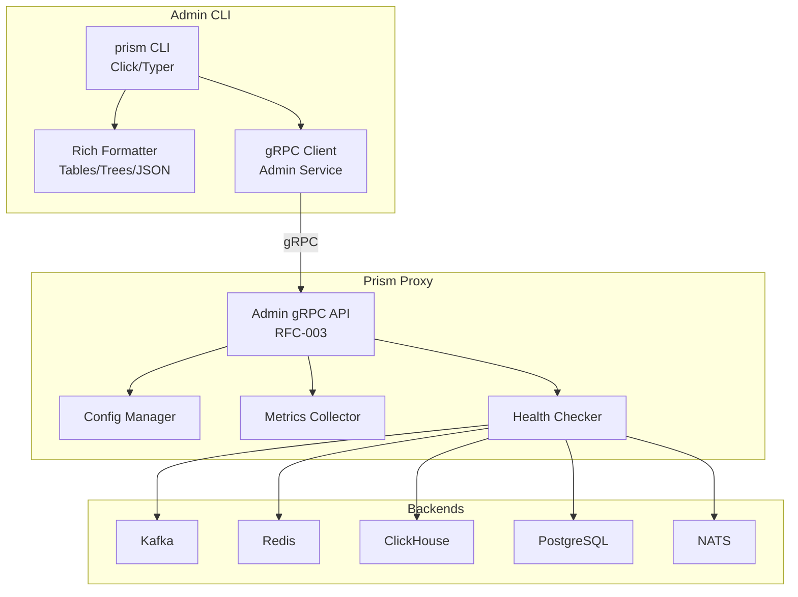

# RFC-006: Python Admin CLI
**Author**: System
**Created**: 2025-10-08
**Updated**: 2025-10-08

## Abstract

This RFC proposes a comprehensive Python-based command-line interface (CLI) for administering Prism data access gateway. The CLI provides operational visibility, configuration management, and troubleshooting capabilities before building a full web-based admin UI. By delivering CLI-first tooling, we enable automation, scripting, and CI/CD integration while validating the admin API design.

The CLI will interact with Prism's admin gRPC services (RFC-003) to manage namespaces, monitor sessions, inspect backend health, and configure data access patterns across all supported backends (Kafka, NATS, PostgreSQL, Redis, ClickHouse).

## Motivation

### Why CLI First?

1. **Faster Time to Value**: CLI tools can be developed and iterated faster than full UIs
2. **Automation Ready**: Enable scripting and CI/CD integration from day one
3. **API Validation**: Using the CLI validates admin API design before UI investment
4. **DevOps Friendly**: Operators prefer CLI tools for troubleshooting and automation
5. **Low Barrier**: Python + Click/Typer = rapid development with excellent UX

### Real-World Use Cases

- **Namespace Management**: Create, configure, and delete namespaces
- **Health Monitoring**: Check backend connectivity and performance metrics
- **Session Inspection**: Debug active client sessions and connection pools
- **Configuration Changes**: Update backend settings, capacity limits, consistency levels
- **Traffic Analysis**: Inspect request rates, latency distributions, error rates
- **Migration Support**: Shadow traffic configuration, backend switching, rollback

## Goals

- Provide complete admin functionality via CLI before building web UI
- Support all operations defined in RFC-003 Admin gRPC API
- Enable automation and scripting for operational workflows
- Deliver excellent developer experience with rich formatting and feedback
- Support YAML-first configuration with automatic config file discovery
- Integrate with existing Python tooling ecosystem (uv, pytest)

## Non-Goals

- **Not replacing web UI**: CLI is a stepping stone and complementary tool
- **Not a data client**: Use language-specific client SDKs for data access
- **Not a full TUI**: Keep it simple; use Rich for formatting, not full-screen apps

## Architecture

### High-Level Design



### Command Structure

```
prism
├── namespace
│   ├── create      # Create new namespace
│   ├── list        # List all namespaces
│   ├── describe    # Show namespace details
│   ├── update      # Update namespace config
│   └── delete      # Delete namespace
├── backend
│   ├── list        # List configured backends
│   ├── health      # Check backend health
│   ├── stats       # Show backend statistics
│   └── test        # Test backend connectivity
├── session
│   ├── list        # List active sessions
│   ├── describe    # Show session details
│   ├── kill        # Terminate session
│   └── trace       # Trace session requests
├── config
│   ├── show        # Display current config
│   ├── validate    # Validate config file
│   └── apply       # Apply config changes
├── metrics
│   ├── summary     # Overall metrics summary
│   ├── namespace   # Namespace-level metrics
│   └── export      # Export metrics (Prometheus format)
└── shadow
    ├── enable      # Enable shadow traffic
    ├── disable     # Disable shadow traffic
    └── status      # Show shadow traffic status
```

## Command Specifications

### Namespace Management

#### Create Namespace

```bash
# Preferred: Declarative mode from config file
prism namespace create --config namespace.yaml

# Config file discovery (searches . and parent dirs for .config.yaml)
prism namespace create my-app  # Uses .config.yaml from current or parent dir

# Inline configuration (for simple cases or scripting)
prism namespace create my-app \
  --backend postgres \
  --pattern keyvalue \
  --consistency strong \
  --cache-ttl 300
```

**Output (Rich table)**:
```
┏━━━━━━━━━━━━┳━━━━━━━━━━┳━━━━━━━━━━━━┳━━━━━━━━━━━━━━┓
┃ Namespace  ┃ Backend  ┃ Pattern    ┃ Status       ┃
┡━━━━━━━━━━━━╇━━━━━━━━━━╇━━━━━━━━━━━━╇━━━━━━━━━━━━━━┩
│ my-app     │ postgres │ keyvalue   │ ✓ Created    │
└────────────┴──────────┴────────────┴──────────────┘

Created namespace 'my-app' successfully
gRPC endpoint: localhost:50051
Admin endpoint: localhost:50052
```

#### List Namespaces

```bash
# Default table view
prism namespace list

# JSON output for scripting
prism namespace list --output json

# Filter by backend
prism namespace list --backend redis

# Show inactive namespaces
prism namespace list --include-inactive
```

**Output**:
```
┏━━━━━━━━━━━━━━━━┳━━━━━━━━━━━━┳━━━━━━━━━━━━┳━━━━━━━━━━┳━━━━━━━━━━━━┓
┃ Namespace      ┃ Backend    ┃ Pattern    ┃ Sessions ┃ RPS        ┃
┡━━━━━━━━━━━━━━━━╇━━━━━━━━━━━━╇━━━━━━━━━━━━╇━━━━━━━━━━╇━━━━━━━━━━━━┩
│ user-profiles  │ postgres   │ keyvalue   │ 24       │ 1,234      │
│ event-stream   │ kafka      │ stream     │ 8        │ 45,678     │
│ session-cache  │ redis      │ cache      │ 156      │ 89,012     │
│ metrics-olap   │ clickhouse │ timeseries │ 4        │ 12,345     │
└────────────────┴────────────┴────────────┴──────────┴────────────┘
```

#### Describe Namespace

```bash
prism namespace describe my-app

# Include recent errors
prism namespace describe my-app --show-errors

# Include configuration
prism namespace describe my-app --show-config
```

**Output**:
```
Namespace: my-app
Status: Active
Created: 2025-10-01 14:23:45 UTC
Updated: 2025-10-08 09:12:34 UTC

Backend Configuration:
  Type: PostgreSQL
  Pattern: KeyValue
  Connection: postgres://prism-pg-1:5432/prism_my_app
  Consistency: Strong
  Connection Pool: 20 max connections

Performance:
  Current RPS: 1,234
  P50 Latency: 2.3ms
  P99 Latency: 12.7ms
  Error Rate: 0.02%

Active Sessions: 24
  ├─ session-abc123: 2 connections, 45 RPS
  ├─ session-def456: 5 connections, 234 RPS
  └─ ... (22 more)

Recent Errors (last 10):
  [2025-10-08 09:05:12] Connection timeout (1 occurrence)
```

### Backend Management

#### Health Check

```bash
# Check all backends
prism backend health

# Check specific backend
prism backend health --backend postgres

# Detailed health check with diagnostics
prism backend health --detailed
```

**Output**:
```
Backend Health Status
━━━━━━━━━━━━━━━━━━━━━━━━━━━━━━━━━━━━━━━━━━━━━━━━━━

✓ PostgreSQL (postgres-1)
  Status: Healthy
  Latency: 1.2ms
  Connections: 45/100 used
  Last Check: 2s ago

✓ Redis (redis-cache-1)
  Status: Healthy
  Latency: 0.3ms
  Memory: 2.1GB / 8GB
  Last Check: 2s ago

✓ ClickHouse (clickhouse-1)
  Status: Healthy
  Latency: 3.4ms
  Queries: 234 active
  Last Check: 2s ago

✗ Kafka (kafka-1)
  Status: Degraded
  Error: Connection refused to broker-3
  Last Success: 5m ago
  Action: Check broker-3 connectivity
```

#### Backend Statistics

```bash
# Show stats for all backends
prism backend stats

# Stats for specific namespace
prism backend stats --namespace my-app

# Export to JSON
prism backend stats --output json
```

### Session Management

#### List Sessions

```bash
# List all active sessions across all namespaces
prism session list

# Scope to specific namespace (preferred for focused inspection)
prism session list --namespace my-app

# Scope using config file (.config.yaml must specify namespace)
prism session list  # Auto-scopes if .config.yaml has namespace set

# Show long-running sessions
prism session list --duration ">1h"
```

**Output**:
```
┏━━━━━━━━━━━━━━━┳━━━━━━━━━━━━━━━━┳━━━━━━━━━━━━┳━━━━━━━━━━━━┳━━━━━━━━━━━━┓
┃ Session ID    ┃ Namespace      ┃ Duration   ┃ Requests   ┃ RPS        ┃
┡━━━━━━━━━━━━━━━╇━━━━━━━━━━━━━━━━╇━━━━━━━━━━━━╇━━━━━━━━━━━━╇━━━━━━━━━━━━┩
│ sess-abc123   │ user-profiles  │ 2h 34m     │ 456,789    │ 45         │
│ sess-def456   │ event-stream   │ 45m        │ 123,456    │ 234        │
│ sess-ghi789   │ session-cache  │ 12m        │ 89,012     │ 567        │
└───────────────┴────────────────┴────────────┴────────────┴────────────┘
```

#### Trace Session

```bash
# Live trace of session requests
prism session trace sess-abc123

# Trace with filtering
prism session trace sess-abc123 --min-latency 100ms

# Export trace to file
prism session trace sess-abc123 --duration 60s --output trace.json
```

**Output (live streaming)**:
```
Tracing session sess-abc123 (Ctrl+C to stop)
━━━━━━━━━━━━━━━━━━━━━━━━━━━━━━━━━━━━━━━━━━━━━━━━━━

09:15:23.456 | GET    | user_profiles:user:12345    | 2.3ms  | ✓
09:15:23.489 | SET    | user_profiles:user:12345    | 3.1ms  | ✓
09:15:23.512 | GET    | user_profiles:user:67890    | 1.8ms  | ✓
09:15:23.534 | DELETE | user_profiles:user:11111    | 145ms  | ✗ Not Found

Statistics:
  Requests: 4
  Success: 3 (75%)
  Avg Latency: 38.05ms
  P99 Latency: 145ms
```

### Configuration Management

#### Show Configuration

```bash
# Show proxy-wide configuration
prism config show

# Show namespace-specific config (scoped view)
prism config show --namespace my-app

# Auto-scope using .config.yaml (if namespace specified in config)
prism config show  # Uses namespace from .config.yaml if present

# Export configuration
prism config show --output yaml > prism-config.yaml
```

#### Validate Configuration

```bash
# Validate config file before applying
prism config validate prism-config.yaml

# Dry-run mode
prism config validate prism-config.yaml --dry-run
```

**Output**:
```
Validating configuration: prism-config.yaml
━━━━━━━━━━━━━━━━━━━━━━━━━━━━━━━━━━━━━━━━━━━━━━━━━━

✓ YAML syntax valid
✓ Schema validation passed
✓ Backend connections verified (3/3)
✓ Namespace uniqueness verified
✓ Capacity limits within bounds
✗ Warning: Redis memory limit (16GB) exceeds available (12GB)

Validation: PASSED (1 warning)
Safe to apply: Yes (with warnings)
```

### Metrics and Monitoring

#### Metrics Summary

```bash
# Overall metrics across all namespaces
prism metrics summary

# Namespace-specific metrics (scoped view)
prism metrics summary --namespace my-app

# Auto-scope using .config.yaml
prism metrics summary  # Uses namespace from .config.yaml if present

# Time range filtering
prism metrics summary --since "1h ago" --namespace my-app
```

**Output**:
```
Prism Metrics Summary (Last 1 hour)
━━━━━━━━━━━━━━━━━━━━━━━━━━━━━━━━━━━━━━━━━━━━━━━━━━

Request Volume:
  Total Requests: 12,456,789
  Success Rate: 99.98%
  Error Rate: 0.02%

Performance:
  P50 Latency: 2.3ms
  P95 Latency: 8.7ms
  P99 Latency: 23.4ms

Top Namespaces by RPS:
  1. event-stream      45,678 RPS
  2. session-cache     12,345 RPS
  3. user-profiles      1,234 RPS

Backend Health:
  ✓ PostgreSQL    (5 instances)
  ✓ Redis         (3 instances)
  ✓ ClickHouse    (2 instances)
  ✗ Kafka         (1 degraded)
```

#### Export Metrics

```bash
# Prometheus format
prism metrics export --format prometheus > metrics.prom

# JSON format with metadata
prism metrics export --format json --include-metadata > metrics.json
```

### Shadow Traffic

#### Enable Shadow Traffic

```bash
# Enable shadow traffic for migration
prism shadow enable my-app \
  --source postgres \
  --target redis \
  --percentage 10

# Gradual rollout
prism shadow enable my-app \
  --source postgres \
  --target redis \
  --ramp-up "10%,25%,50%,100%" \
  --interval 1h
```

**Output**:
```
Enabling shadow traffic for namespace 'my-app'
━━━━━━━━━━━━━━━━━━━━━━━━━━━━━━━━━━━━━━━━━━━━━━━━━━

Configuration:
  Source: postgres
  Target: redis
  Initial Percentage: 10%
  Ramp-up Schedule:
    • 10% at 09:15:00 (now)
    • 25% at 10:15:00 (+1h)
    • 50% at 11:15:00 (+2h)
    • 100% at 12:15:00 (+3h)

✓ Shadow traffic enabled
  Monitor: prism shadow status my-app
  Disable: prism shadow disable my-app
```

#### Shadow Status

```bash
prism shadow status my-app
```

**Output**:
```
Shadow Traffic Status: my-app
━━━━━━━━━━━━━━━━━━━━━━━━━━━━━━━━━━━━━━━━━━━━━━━━━━

Status: Active
Current Stage: 25% traffic to target
Next Stage: 50% at 11:15:00 (+45m)

Backends:
  Source: postgres
  Target: redis

Traffic Distribution:
  ┌────────────────────────────────────────┐
  │ ████████████████████████████           │ 75% → postgres (source)
  │ ████████                               │ 25% → redis (target)
  └────────────────────────────────────────┘

Comparison Metrics:
  ┏━━━━━━━━━━━━┳━━━━━━━━━━━━┳━━━━━━━━━━━━┳━━━━━━━━━━━━┓
  ┃ Metric     ┃ Source     ┃ Target     ┃ Delta      ┃
  ┡━━━━━━━━━━━━╇━━━━━━━━━━━━╇━━━━━━━━━━━━╇━━━━━━━━━━━━┩
  │ P50        │ 2.3ms      │ 0.8ms      │ -65%       │
  │ P99        │ 12.7ms     │ 3.2ms      │ -75%       │
  │ Error Rate │ 0.02%      │ 0.01%      │ -50%       │
  └────────────┴────────────┴────────────┴────────────┘

✓ Target performing well, ready for next stage
```

## Protobuf Integration

The CLI communicates with Prism via the Admin gRPC API defined in RFC-003:

```protobuf
// CLI uses these services from RFC-003
service AdminService {
  // Namespace operations
  rpc CreateNamespace(CreateNamespaceRequest) returns (Namespace);
  rpc ListNamespaces(ListNamespacesRequest) returns (ListNamespacesResponse);
  rpc DescribeNamespace(DescribeNamespaceRequest) returns (Namespace);
  rpc UpdateNamespace(UpdateNamespaceRequest) returns (Namespace);
  rpc DeleteNamespace(DeleteNamespaceRequest) returns (DeleteNamespaceResponse);

  // Backend operations
  rpc ListBackends(ListBackendsRequest) returns (ListBackendsResponse);
  rpc CheckBackendHealth(HealthCheckRequest) returns (HealthCheckResponse);
  rpc GetBackendStats(BackendStatsRequest) returns (BackendStatsResponse);

  // Session operations
  rpc ListSessions(ListSessionsRequest) returns (ListSessionsResponse);
  rpc DescribeSession(DescribeSessionRequest) returns (Session);
  rpc KillSession(KillSessionRequest) returns (KillSessionResponse);
  rpc TraceSession(TraceSessionRequest) returns (stream TraceEvent);

  // Configuration operations
  rpc GetConfig(GetConfigRequest) returns (Config);
  rpc ValidateConfig(ValidateConfigRequest) returns (ValidationResult);
  rpc ApplyConfig(ApplyConfigRequest) returns (ApplyConfigResponse);

  // Metrics operations
  rpc GetMetrics(MetricsRequest) returns (MetricsResponse);
  rpc ExportMetrics(ExportMetricsRequest) returns (ExportMetricsResponse);

  // Shadow traffic operations
  rpc EnableShadowTraffic(ShadowTrafficRequest) returns (ShadowTrafficResponse);
  rpc DisableShadowTraffic(DisableShadowTrafficRequest) returns (ShadowTrafficResponse);
  rpc GetShadowStatus(ShadowStatusRequest) returns (ShadowStatus);
}
```

## Implementation

### Technology Stack

- **CLI Framework**: Click or Typer (Typer preferred for type safety)
- **gRPC Client**: grpcio + protobuf-generated stubs
- **Formatting**: Rich (tables, progress bars, colors, trees)
- **Configuration**: YAML via PyYAML
- **Testing**: pytest with fixtures for gRPC mocking
- **Packaging**: Python package with entry point, distributed via uv

### Project Structure

```
prism-cli/
├── pyproject.toml           # Package definition
├── src/
│   └── prism_cli/
│       ├── __init__.py
│       ├── main.py          # CLI entry point
│       ├── commands/
│       │   ├── __init__.py
│       │   ├── namespace.py # Namespace commands
│       │   ├── backend.py   # Backend commands
│       │   ├── session.py   # Session commands
│       │   ├── config.py    # Config commands
│       │   ├── metrics.py   # Metrics commands
│       │   └── shadow.py    # Shadow traffic commands
│       ├── client/
│       │   ├── __init__.py
│       │   ├── admin.py     # Admin gRPC client wrapper
│       │   └── auth.py      # Authentication helpers
│       ├── formatters/
│       │   ├── __init__.py
│       │   ├── table.py     # Rich table formatters
│       │   ├── tree.py      # Tree formatters
│       │   └── json.py      # JSON output
│       └── proto/           # Generated protobuf stubs
│           └── admin_pb2.py
└── tests/
    ├── test_namespace.py
    ├── test_backend.py
    └── fixtures/
        └── mock_grpc.py
```

### Example Implementation (Namespace Commands)

```python
# src/prism_cli/commands/namespace.py
import typer
from rich.console import Console
from rich.table import Table
from typing import Optional
from ..client.admin import AdminClient
from ..formatters.table import format_namespace_table

app = typer.Typer(help="Namespace management commands")
console = Console()

@app.command()
def create(
    name: str = typer.Argument(..., help="Namespace name"),
    backend: str = typer.Option(None, help="Backend type (postgres, redis, etc.)"),
    pattern: str = typer.Option(None, help="Data access pattern"),
    consistency: str = typer.Option("eventual", help="Consistency level"),
    cache_ttl: Optional[int] = typer.Option(None, help="Cache TTL in seconds"),
    config: Optional[str] = typer.Option(None, help="Path to config file (or .config.yaml)"),
):
    """Create a new namespace.

    Prefers YAML configuration. If --config not specified, searches for .config.yaml
    in current directory and parent directories.
    """
    client = AdminClient()

    # Load config from file (explicit or discovered)
    if config:
        config_data = load_yaml_config(config)
    else:
        config_data = discover_config()  # Search for .config.yaml

    # Override with CLI args if provided
    config_data.update({
        k: v for k, v in {
            'backend': backend,
            'pattern': pattern,
            'consistency': consistency,
            'cache_ttl': cache_ttl,
        }.items() if v is not None
    })

    try:
        namespace = client.create_namespace(name=name, **config_data)

        # Display result
        table = Table(title="Namespace Created")
        table.add_column("Namespace", style="cyan")
        table.add_column("Backend", style="green")
        table.add_column("Pattern", style="yellow")
        table.add_column("Status", style="green")

        table.add_row(
            namespace.name,
            namespace.backend,
            namespace.pattern,
            "✓ Created"
        )

        console.print(table)
        console.print(f"\nCreated namespace '{name}' successfully")
        console.print(f"gRPC endpoint: {namespace.grpc_endpoint}")
        console.print(f"Admin endpoint: {namespace.admin_endpoint}")

    except Exception as e:
        console.print(f"[red]Error creating namespace: {e}[/red]")
        raise typer.Exit(1)

@app.command()
def list(
    output: str = typer.Option("table", help="Output format (table, json)"),
    backend: Optional[str] = typer.Option(None, help="Filter by backend"),
    include_inactive: bool = typer.Option(False, help="Include inactive namespaces"),
):
    """List all namespaces."""
    client = AdminClient()

    try:
        namespaces = client.list_namespaces(
            backend=backend,
            include_inactive=include_inactive,
        )

        if output == "json":
            console.print_json([ns.to_dict() for ns in namespaces])
        else:
            table = format_namespace_table(namespaces)
            console.print(table)

    except Exception as e:
        console.print(f"[red]Error listing namespaces: {e}[/red]")
        raise typer.Exit(1)

@app.command()
def describe(
    name: str = typer.Argument(..., help="Namespace name"),
    show_errors: bool = typer.Option(False, help="Show recent errors"),
    show_config: bool = typer.Option(False, help="Show configuration"),
):
    """Describe a namespace in detail."""
    client = AdminClient()

    try:
        namespace = client.describe_namespace(
            name=name,
            include_errors=show_errors,
            include_config=show_config,
        )

        # Rich formatted output
        console.print(f"\n[bold cyan]Namespace: {namespace.name}[/bold cyan]")
        console.print(f"Status: [green]{namespace.status}[/green]")
        console.print(f"Created: {namespace.created_at}")
        console.print(f"Updated: {namespace.updated_at}")

        console.print("\n[bold]Backend Configuration:[/bold]")
        console.print(f"  Type: {namespace.backend}")
        console.print(f"  Pattern: {namespace.pattern}")
        console.print(f"  Connection: {namespace.connection_string}")
        console.print(f"  Consistency: {namespace.consistency}")

        console.print("\n[bold]Performance:[/bold]")
        console.print(f"  Current RPS: {namespace.current_rps:,}")
        console.print(f"  P50 Latency: {namespace.p50_latency}ms")
        console.print(f"  P99 Latency: {namespace.p99_latency}ms")
        console.print(f"  Error Rate: {namespace.error_rate:.2%}")

        if namespace.sessions:
            console.print(f"\n[bold]Active Sessions: {len(namespace.sessions)}[/bold]")
            for session in namespace.sessions[:3]:
                console.print(f"  ├─ {session.id}: {session.connections} connections, {session.rps} RPS")
            if len(namespace.sessions) > 3:
                console.print(f"  └─ ... ({len(namespace.sessions) - 3} more)")

        if show_errors and namespace.errors:
            console.print("\n[bold]Recent Errors (last 10):[/bold]")
            for error in namespace.errors[:10]:
                console.print(f"  [{error.timestamp}] {error.message} ({error.count} occurrence(s))")

    except Exception as e:
        console.print(f"[red]Error describing namespace: {e}[/red]")
        raise typer.Exit(1)
```

### Admin gRPC Client Wrapper

```python
# src/prism_cli/client/admin.py
import grpc
from typing import List, Optional
from ..proto import admin_pb2, admin_pb2_grpc
from .auth import get_credentials

class AdminClient:
    """Wrapper around Admin gRPC client for CLI operations."""

    def __init__(self, endpoint: str = "localhost:50052"):
        self.endpoint = endpoint
        self.credentials = get_credentials()
        self.channel = grpc.secure_channel(
            endpoint,
            self.credentials,
        )
        self.stub = admin_pb2_grpc.AdminServiceStub(self.channel)

    def create_namespace(
        self,
        name: str,
        backend: str,
        pattern: str,
        consistency: str = "eventual",
        cache_ttl: Optional[int] = None,
    ) -> Namespace:
        """Create a new namespace."""
        request = admin_pb2.CreateNamespaceRequest(
            name=name,
            backend=backend,
            pattern=pattern,
            consistency=consistency,
            cache_ttl=cache_ttl,
        )
        response = self.stub.CreateNamespace(request)
        return Namespace.from_proto(response)

    def list_namespaces(
        self,
        backend: Optional[str] = None,
        include_inactive: bool = False,
    ) -> List[Namespace]:
        """List all namespaces."""
        request = admin_pb2.ListNamespacesRequest(
            backend=backend,
            include_inactive=include_inactive,
        )
        response = self.stub.ListNamespaces(request)
        return [Namespace.from_proto(ns) for ns in response.namespaces]

    def describe_namespace(
        self,
        name: str,
        include_errors: bool = False,
        include_config: bool = False,
    ) -> Namespace:
        """Get detailed namespace information."""
        request = admin_pb2.DescribeNamespaceRequest(
            name=name,
            include_errors=include_errors,
            include_config=include_config,
        )
        response = self.stub.DescribeNamespace(request)
        return Namespace.from_proto(response)

    def check_backend_health(
        self,
        backend: Optional[str] = None,
    ) -> List[BackendHealth]:
        """Check health of backends."""
        request = admin_pb2.HealthCheckRequest(backend=backend)
        response = self.stub.CheckBackendHealth(request)
        return [BackendHealth.from_proto(h) for h in response.backends]

    def trace_session(
        self,
        session_id: str,
        min_latency_ms: Optional[int] = None,
    ):
        """Stream trace events for a session."""
        request = admin_pb2.TraceSessionRequest(
            session_id=session_id,
            min_latency_ms=min_latency_ms,
        )
        for event in self.stub.TraceSession(request):
            yield TraceEvent.from_proto(event)

    def __enter__(self):
        return self

    def __exit__(self, *args):
        self.channel.close()
```

## Use-Case Recommendations

### ✅ When to Use CLI

- **Operational Tasks**: Health checks, session management, troubleshooting
- **Automation**: CI/CD pipelines, infrastructure-as-code, scripting
- **Quick Checks**: Rapid inspection without opening web UI
- **SSH Sessions**: Remote administration without GUI requirements
- **Development**: Local testing and debugging during development

### ❌ When CLI is Less Suitable

- **Complex Visualizations**: Graphs, charts, time-series plots (use web UI)
- **Interactive Exploration**: Clicking through related entities (web UI better)
- **Long-Running Monitoring**: Real-time dashboards (use web UI or Grafana)
- **Non-Technical Users**: Prefer graphical interfaces

### Migration to Web UI

The CLI validates the admin API design and provides immediate value. Web UI development can proceed in parallel:

1. **Phase 1**: CLI delivers all admin functionality
2. **Phase 2**: Web UI built using same Admin gRPC API
3. **Phase 3**: Both CLI and Web UI coexist (CLI for automation, UI for exploration)

## Configuration

### Configuration File Discovery

The CLI follows a hierarchical configuration search strategy:

1. **Explicit `--config` flag**: Highest priority, direct path to config file
2. **`.config.yaml` in current directory**: Checked first for project-specific config
3. **`.config.yaml` in parent directories**: Walks up the tree to find inherited config
4. **`~/.prism/config.yaml`**: User-level global configuration
5. **Command-line arguments**: Override any config file settings

**Example `.config.yaml` (project-level)**:
```yaml
# .config.yaml - Project configuration for my-app namespace
namespace: my-app  # Default namespace for scoped commands
endpoint: localhost:50052

backend:
  type: postgres
  pattern: keyvalue
  consistency: strong
  cache_ttl: 300

# Sessions, config, metrics will auto-scope to this namespace unless --namespace specified
```

**Example `~/.prism/config.yaml` (user-level)**:
```yaml
# ~/.prism/config.yaml - Global CLI configuration
default_endpoint: localhost:50052
auth:
  method: mtls
  cert_path: ~/.prism/client.crt
  key_path: ~/.prism/client.key
  ca_path: ~/.prism/ca.crt

output:
  format: table  # table, json, yaml
  color: auto    # auto, always, never

timeouts:
  connect: 5s
  request: 30s

logging:
  level: info
  file: ~/.prism/cli.log
```

**Usage pattern**:
```bash
# In project directory with .config.yaml (namespace: my-app):
cd ~/projects/my-app
prism session list          # Auto-scopes to my-app namespace
prism metrics summary       # Shows metrics for my-app
prism config show           # Shows my-app configuration

# Override with --namespace flag:
prism session list --namespace other-app

# Parent directory search:
cd ~/projects/my-app/src/handlers
prism session list          # Finds .config.yaml in ~/projects/my-app/
```

### Environment Variables

```bash
# Override config file settings
export PRISM_ENDPOINT="prism.example.com:50052"
export PRISM_AUTH_METHOD="oauth2"
export PRISM_OUTPUT_FORMAT="json"
```

## Performance and UX

### Performance Targets

- **Command Startup**: &lt;100ms cold start, &lt;50ms warm start
- **gRPC Calls**: &lt;10ms for simple queries, &lt;100ms for complex operations
- **Streaming**: Live trace output with &lt;10ms latency
- **Large Lists**: Pagination and streaming for 1000+ items

### UX Enhancements

- **Rich Formatting**: Colors, tables, trees, progress bars
- **Config File Discovery**: Automatic `.config.yaml` lookup in current and parent directories
- **Smart Defaults**: Sensible defaults for all optional parameters
- **Helpful Errors**: Clear error messages with suggested fixes
- **Autocomplete**: Shell completion for commands and options
- **Aliases**: Common shortcuts (e.g., `ns` for `namespace`, `be` for `backend`)

## Testing Strategy

### Unit Tests

```python
# tests/test_namespace.py
from typer.testing import CliRunner
from prism_cli.main import app
from .fixtures.mock_grpc import MockAdminService

runner = CliRunner()

def test_namespace_create():
    with MockAdminService() as mock:
        mock.set_response("CreateNamespace", Namespace(
            name="test-ns",
            backend="postgres",
            pattern="keyvalue",
        ))

        result = runner.invoke(app, [
            "namespace", "create", "test-ns",
            "--backend", "postgres",
            "--pattern", "keyvalue",
        ])

        assert result.exit_code == 0
        assert "Created namespace 'test-ns'" in result.stdout

def test_namespace_list_json():
    with MockAdminService() as mock:
        mock.set_response("ListNamespaces", ListNamespacesResponse(
            namespaces=[
                Namespace(name="ns1", backend="postgres"),
                Namespace(name="ns2", backend="redis"),
            ]
        ))

        result = runner.invoke(app, ["namespace", "list", "--output", "json"])

        assert result.exit_code == 0
        data = json.loads(result.stdout)
        assert len(data) == 2
        assert data[0]["name"] == "ns1"
```

### Integration Tests

```python
# tests/integration/test_admin_client.py
import pytest
from prism_cli.client.admin import AdminClient

@pytest.fixture
def admin_client():
    """Connect to local test proxy."""
    return AdminClient(endpoint="localhost:50052")

def test_create_and_list_namespace(admin_client):
    # Create namespace
    ns = admin_client.create_namespace(
        name="test-integration",
        backend="sqlite",
        pattern="keyvalue",
    )
    assert ns.name == "test-integration"

    # List and verify
    namespaces = admin_client.list_namespaces()
    names = [ns.name for ns in namespaces]
    assert "test-integration" in names

    # Cleanup
    admin_client.delete_namespace("test-integration")
```

## Deployment

### Installation

```bash
# Install via uv (development)
cd prism-cli
uv pip install -e .

# Install from package (production)
uv pip install prism-cli

# Verify installation
prism --version
prism --help
```

### Shell Completion

```bash
# Bash
prism --install-completion bash

# Zsh
prism --install-completion zsh

# Fish
prism --install-completion fish
```

## Migration Path

### Phase 1: Core CLI (Week 1-2)

- Namespace CRUD operations
- Backend health checks
- Session listing
- Basic metrics

**Deliverable**: Functional CLI covering 80% of admin use cases

### Phase 2: Advanced Features (Week 3-4)

- Session tracing (streaming)
- Shadow traffic management
- Configuration validation
- Metrics export

**Deliverable**: Complete feature parity with Admin gRPC API

### Phase 3: Polish and Documentation (Week 5-6)

- Comprehensive tests (unit + integration)
- Shell completion
- Man pages and documentation
- CI/CD integration examples

**Deliverable**: Production-ready CLI with excellent docs

### Phase 4: Web UI Development (Parallel)

- RFC-007: Web Admin UI specification
- Ember.js application using same Admin gRPC API
- CLI and web UI coexist and complement each other

## Monitoring and Observability

### CLI Usage Metrics

Track CLI adoption and usage patterns:

- **Command Usage**: Which commands are most popular
- **Error Rates**: Which commands fail most often
- **Latency**: gRPC call latency from CLI
- **Authentication**: Success/failure rates for auth

### Logging

CLI logs structured events:

```json
{
  "timestamp": "2025-10-08T09:15:23.456Z",
  "level": "info",
  "command": "namespace create",
  "args": {"name": "my-app", "backend": "postgres"},
  "duration_ms": 234,
  "status": "success"
}
```

## Security Considerations

- **mTLS by Default**: All gRPC connections use mutual TLS
- **Credential Storage**: Secure storage for certificates and tokens
- **Audit Logging**: All admin operations logged server-side
- **Least Privilege**: Role-based access control (RBAC) enforced by proxy
- **No Secrets in Logs**: Sanitize sensitive data from CLI logs

## Open Questions

1. **OAuth2 Integration**: Should CLI support OAuth2 device flow for cloud deployments?
2. **Plugin System**: Allow third-party commands to extend CLI?
3. **TUI Mode**: Add full-screen TUI for real-time monitoring?
4. **Multi-Proxy**: Manage multiple Prism proxies from single CLI?

## References

- RFC-003: Admin gRPC API specification
- Typer Documentation: https://typer.tiangolo.com/
- Rich Documentation: https://rich.readthedocs.io/
- Click Documentation: https://click.palletsprojects.com/

## Appendix: Command Reference

### All Commands

```bash
prism namespace create <name> [options]
prism namespace list [options]
prism namespace describe <name> [options]
prism namespace update <name> [options]
prism namespace delete <name> [options]

prism backend list [options]
prism backend health [options]
prism backend stats [options]
prism backend test <backend> [options]

prism session list [options]
prism session describe <session-id>
prism session kill <session-id>
prism session trace <session-id> [options]

prism config show [options]
prism config validate <file> [options]
prism config apply <file> [options]

prism metrics summary [options]
prism metrics namespace <name> [options]
prism metrics export [options]

prism shadow enable <namespace> [options]
prism shadow disable <namespace>
prism shadow status <namespace>

prism version
prism help [command]
```

### Global Options

```bash
--endpoint <url>        # Proxy endpoint (default: localhost:50052)
--output <format>       # Output format: table, json, yaml
--no-color              # Disable colored output
--verbose, -v           # Verbose logging
--quiet, -q             # Suppress non-error output
--config <file>         # CLI config file
--help, -h              # Show help
```

---

**Status**: Ready for Implementation
**Next Steps**:
1. Implement core CLI structure with Typer
2. Add namespace commands as proof-of-concept
3. Test against local Prism proxy
4. Iterate based on user feedback
