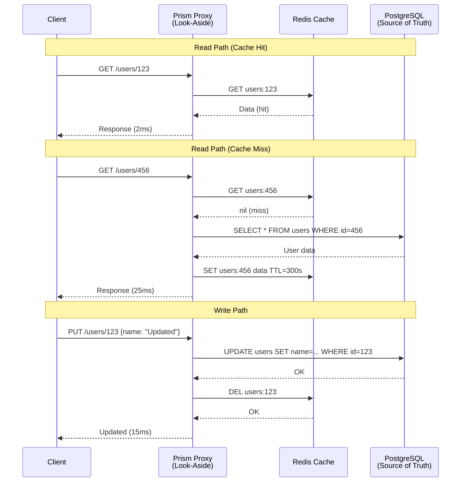
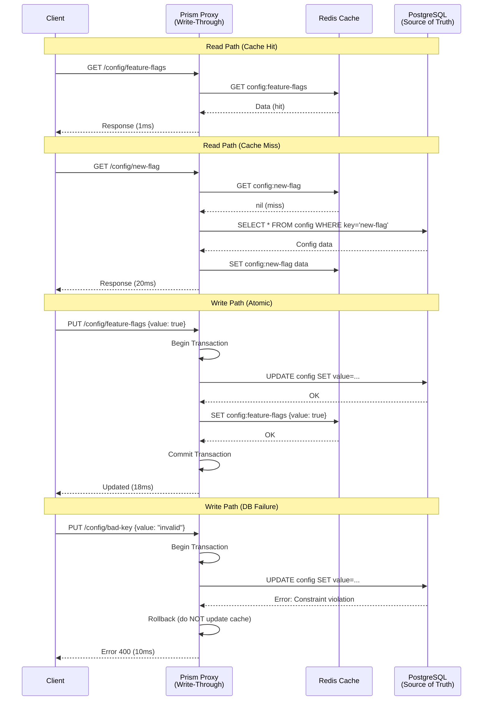

# RFC-007: Cache Strategies for Data Layer

**Status**: Draft
**Author**: System
**Created**: 2025-10-08
**Updated**: 2025-10-08

## Abstract

Caching is fundamental to achieving low-latency, high-throughput data access. This RFC defines standard cache strategies implemented in Prism's data layer, focusing on **look-aside (cache-aside)** and **write-through** patterns for common use cases like table readers and object storage metadata caching.

By standardizing cache strategies at the proxy level, applications benefit from transparent caching without implementing cache logic in every service. Prism manages cache consistency, expiration (ADR-031), and invalidation automatically based on declarative configuration.

## Motivation

### Why Cache Strategies Matter

1. **Performance**: Sub-millisecond responses for cached data vs. 10-100ms database queries
2. **Cost Reduction**: Fewer database queries reduce compute and I/O costs
3. **Scalability**: Cache absorbs read traffic, allowing databases to scale independently
4. **Availability**: Cached data remains available during backend outages (stale reads)
5. **Consistency**: Different strategies offer different consistency guarantees

### Real-World Scenarios

- **Table Readers**: Frequently accessed reference tables (countries, categories, product catalogs)
- **Object Metadata**: File metadata from object storage (size, content-type, ETag)
- **User Profiles**: High-read, low-write data accessed on every request
- **Configuration Data**: Application settings queried repeatedly
- **Computed Results**: Expensive aggregations or ML model outputs

## Goals

- Define standard cache strategies with clear consistency semantics
- Implement look-aside and write-through patterns for common use cases
- Support cache warmup, invalidation, and expiration
- Provide configuration-driven cache behavior (no code changes required)
- Enable observability into cache hit rates, latency, and consistency

## Non-Goals

- **Custom Cache Logic**: Not implementing application-specific cache policies
- **Distributed Cache Coordination**: Not solving distributed cache coherence (use Redis cluster instead)
- **Cache-Aside in Clients**: Clients use Prism APIs; caching is transparent

## Cache Strategies Overview

### Strategy Comparison

| Strategy          | Read Path        | Write Path          | Consistency | Use Case                              |
|-------------------|------------------|---------------------|-------------|---------------------------------------|
| **Look-Aside**    | Check cache first| Write to DB only    | Eventual    | Read-heavy, tolerate stale reads      |
| **Write-Through** | Check cache first| Write to cache + DB | Strong      | Read-heavy, require fresh reads       |
| **Write-Back**    | Check cache first| Write to cache only | Weak        | Write-heavy, tolerate data loss       |
| **Refresh-Ahead** | Check cache first| Background refresh  | Eventual    | Predictable access patterns           |
| **Read-Through**  | Cache or fetch   | Write to DB only    | Eventual    | Simplify read logic                   |

**This RFC focuses on Look-Aside and Write-Through** as they cover 90% of use cases.

## Look-Aside (Cache-Aside) Pattern

### Overview

**Look-aside** is the most common caching pattern:

1. **Read**: Check cache; if miss, fetch from DB, store in cache
2. **Write**: Update DB; optionally invalidate cache

**Pros**:
- Simple to reason about
- Cache failures don't affect writes
- Flexible invalidation strategies

**Cons**:
- Cache misses cause latency spikes
- Potential for stale reads
- Thundering herd on cold cache

### Architecture Diagram



### Protobuf Configuration

```protobuf
message LookAsideCacheConfig {
  // Cache backend (redis, in-memory)
  string cache_backend = 1;

  // Cache key prefix
  string key_prefix = 2;

  // TTL for cached entries (see ADR-031)
  int64 ttl_seconds = 3 [default = 300];

  // Invalidation strategy
  enum InvalidationStrategy {
    INVALIDATE_ON_WRITE = 0;  // Delete cache entry on write
    NO_INVALIDATION = 1;       // Rely on TTL expiration
    BACKGROUND_REFRESH = 2;    // Refresh cache asynchronously
  }
  InvalidationStrategy invalidation = 4;

  // Warmup strategy
  bool enable_warmup = 5;
  string warmup_query = 6;  // SQL query to pre-populate cache

  // Thundering herd prevention
  bool enable_locking = 7;   // Lock during cache fill to prevent duplicate fetches
  int64 lock_timeout_ms = 8 [default = 1000];
}
```

### Namespace Configuration Example

```yaml
namespaces:
  - name: user-profiles
    backend: postgres
    pattern: keyvalue
    cache:
      strategy: look_aside
      cache_backend: redis
      key_prefix: "users:"
      ttl_seconds: 300
      invalidation: INVALIDATE_ON_WRITE
      enable_locking: true

  - name: product-catalog
    backend: postgres
    pattern: keyvalue
    cache:
      strategy: look_aside
      cache_backend: redis
      key_prefix: "products:"
      ttl_seconds: 3600  # 1 hour
      invalidation: NO_INVALIDATION  # Read-only catalog
      enable_warmup: true
      warmup_query: "SELECT id, data FROM products WHERE active=true"
```

### Rust Implementation

```rust
pub struct LookAsideCache {
    cache: RedisBackend,
    database: PostgresBackend,
    config: LookAsideCacheConfig,
}

impl LookAsideCache {
    pub async fn get(&self, key: &str) -> Result<Option<Bytes>> {
        let cache_key = format!("{}{}", self.config.key_prefix, key);

        // Step 1: Check cache
        if let Some(data) = self.cache.get(&cache_key).await? {
            metrics::increment_counter!("cache_hits", "namespace" => &self.config.namespace);
            return Ok(Some(data));
        }

        metrics::increment_counter!("cache_misses", "namespace" => &self.config.namespace);

        // Step 2: Thundering herd prevention
        if self.config.enable_locking {
            let lock_key = format!("{}:lock", cache_key);

            // Try to acquire lock
            if !self.cache.set_nx(&lock_key, b"1", Duration::from_millis(self.config.lock_timeout_ms)).await? {
                // Another request is fetching; wait and retry
                tokio::time::sleep(Duration::from_millis(50)).await;
                return self.get(key).await; // Retry (cache should be populated)
            }
        }

        // Step 3: Fetch from database
        let data = self.database.get(key).await?;

        // Step 4: Populate cache
        if let Some(ref data) = data {
            self.cache
                .set_ex(&cache_key, data, self.config.ttl_seconds as usize)
                .await?;
        }

        // Step 5: Release lock
        if self.config.enable_locking {
            let lock_key = format!("{}:lock", cache_key);
            self.cache.del(&lock_key).await?;
        }

        Ok(data)
    }

    pub async fn set(&self, key: &str, value: &[u8]) -> Result<()> {
        let cache_key = format!("{}{}", self.config.key_prefix, key);

        // Step 1: Write to database (source of truth)
        self.database.set(key, value).await?;

        // Step 2: Invalidate cache
        match self.config.invalidation {
            InvalidationStrategy::InvalidateOnWrite => {
                self.cache.del(&cache_key).await?;
            }
            InvalidationStrategy::NoInvalidation => {
                // Do nothing; rely on TTL
            }
            InvalidationStrategy::BackgroundRefresh => {
                // Trigger async refresh (not blocking write)
                let cache = self.cache.clone();
                let db = self.database.clone();
                let key = key.to_string();
                tokio::spawn(async move {
                    if let Ok(Some(data)) = db.get(&key).await {
                        let _ = cache.set_ex(&cache_key, &data, 300).await;
                    }
                });
            }
        }

        Ok(())
    }

    pub async fn warmup(&self) -> Result<usize> {
        if !self.config.enable_warmup || self.config.warmup_query.is_empty() {
            return Ok(0);
        }

        let rows = self.database.query(&self.config.warmup_query).await?;
        let mut count = 0;

        for row in rows {
            let key: String = row.get("id");
            let data: Vec<u8> = row.get("data");
            let cache_key = format!("{}{}", self.config.key_prefix, key);

            self.cache
                .set_ex(&cache_key, &data, self.config.ttl_seconds as usize)
                .await?;
            count += 1;
        }

        Ok(count)
    }
}
```

## Write-Through Cache Pattern

### Overview

**Write-through** ensures cache consistency by writing to both cache and database synchronously:

1. **Read**: Check cache; if miss, fetch from DB, store in cache
2. **Write**: Update cache AND database atomically

**Pros**:
- Cache is always consistent with DB
- No stale reads
- Simpler consistency model

**Cons**:
- Write latency (cache + DB)
- Write failures affect both cache and DB
- More complex error handling

### Architecture Diagram



### Protobuf Configuration

```protobuf
message WriteThroughCacheConfig {
  // Cache backend
  string cache_backend = 1;

  // Cache key prefix
  string key_prefix = 2;

  // TTL (optional; can be infinite for permanent config)
  optional int64 ttl_seconds = 3;

  // Write ordering
  enum WriteOrder {
    CACHE_THEN_DB = 0;  // Write cache first (faster, risk of inconsistency)
    DB_THEN_CACHE = 1;  // Write DB first (slower, safer)
  }
  WriteOrder write_order = 4 [default = DB_THEN_CACHE];

  // Rollback on failure
  bool enable_rollback = 5 [default = true];

  // Async write to cache (improves write latency)
  bool async_cache_write = 6 [default = false];
}
```

### Namespace Configuration Example

```yaml
namespaces:
  - name: application-config
    backend: postgres
    pattern: keyvalue
    cache:
      strategy: write_through
      cache_backend: redis
      key_prefix: "config:"
      ttl_seconds: null  # Infinite TTL (configuration data)
      write_order: DB_THEN_CACHE
      enable_rollback: true

  - name: user-settings
    backend: postgres
    pattern: keyvalue
    cache:
      strategy: write_through
      cache_backend: redis
      key_prefix: "settings:"
      ttl_seconds: 86400  # 24 hours
      write_order: DB_THEN_CACHE
      async_cache_write: false  # Synchronous for consistency
```

### Rust Implementation

```rust
pub struct WriteThroughCache {
    cache: RedisBackend,
    database: PostgresBackend,
    config: WriteThroughCacheConfig,
}

impl WriteThroughCache {
    pub async fn get(&self, key: &str) -> Result<Option<Bytes>> {
        let cache_key = format!("{}{}", self.config.key_prefix, key);

        // Check cache first
        if let Some(data) = self.cache.get(&cache_key).await? {
            metrics::increment_counter!("cache_hits");
            return Ok(Some(data));
        }

        metrics::increment_counter!("cache_misses");

        // Fetch from database
        let data = self.database.get(key).await?;

        // Populate cache
        if let Some(ref data) = data {
            let ttl = self.config.ttl_seconds.unwrap_or(0);
            if ttl > 0 {
                self.cache.set_ex(&cache_key, data, ttl as usize).await?;
            } else {
                self.cache.set(&cache_key, data).await?;
            }
        }

        Ok(data)
    }

    pub async fn set(&self, key: &str, value: &[u8]) -> Result<()> {
        let cache_key = format!("{}{}", self.config.key_prefix, key);

        match self.config.write_order {
            WriteOrder::DbThenCache => {
                // Step 1: Write to database (source of truth)
                if let Err(e) = self.database.set(key, value).await {
                    // DB write failed; do NOT update cache
                    return Err(e);
                }

                // Step 2: Write to cache (DB succeeded)
                if self.config.async_cache_write {
                    // Async update (improves write latency)
                    let cache = self.cache.clone();
                    let cache_key = cache_key.clone();
                    let value = value.to_vec();
                    tokio::spawn(async move {
                        let _ = cache.set(&cache_key, &value).await;
                    });
                } else {
                    // Sync update (ensures consistency)
                    if let Err(e) = self.cache.set(&cache_key, value).await {
                        // Cache write failed; log but don't fail request
                        // (DB is source of truth)
                        warn!("Cache update failed: {}", e);
                    }
                }

                Ok(())
            }

            WriteOrder::CacheThenDb => {
                // Step 1: Write to cache (fast path)
                self.cache.set(&cache_key, value).await?;

                // Step 2: Write to database
                if let Err(e) = self.database.set(key, value).await {
                    // DB write failed; rollback cache if enabled
                    if self.config.enable_rollback {
                        let _ = self.cache.del(&cache_key).await;
                    }
                    return Err(e);
                }

                Ok(())
            }
        }
    }
}
```

## Use Case: Table Reader with Look-Aside Cache

### Scenario

Frequently accessed reference table (e.g., `countries`, `categories`, `product_catalog`) that rarely changes.

**Requirements**:
- Low read latency (< 5ms P99)
- Tolerate stale reads up to 1 hour
- Handle 10,000 RPS peak load

### Configuration

```yaml
namespaces:
  - name: product-catalog
    backend: postgres
    pattern: keyvalue
    cache:
      strategy: look_aside
      cache_backend: redis
      key_prefix: "catalog:"
      ttl_seconds: 3600  # 1 hour
      invalidation: NO_INVALIDATION  # Read-only data
      enable_warmup: true
      warmup_query: |
        SELECT id::text,
               row_to_json(products)::text as data
        FROM products
        WHERE active = true
```

### Client Usage

```python
from prism_sdk import PrismClient

client = PrismClient(namespace="product-catalog")

# Read (cache hit: ~2ms, cache miss: ~25ms)
product = client.get("product:12345")

# Warmup cache (run on deployment)
client.warmup()
```

### Performance

| Metric           | Look-Aside Cache | Direct DB Query |
|------------------|------------------|-----------------|
| **P50 Latency**  | 1.5ms            | 15ms            |
| **P99 Latency**  | 3.2ms            | 35ms            |
| **Cache Hit Rate** | 95%            | N/A             |
| **DB Load**      | 500 QPS          | 10,000 QPS      |

## Use Case: Object Storage Metadata with Write-Through Cache

### Scenario

Object metadata (size, content-type, ETag, last-modified) accessed on every file operation but infrequently updated.

**Requirements**:
- Metadata always consistent with object storage
- Low read latency (< 3ms P99)
- Handle 5,000 metadata queries/sec

### Configuration

```yaml
namespaces:
  - name: object-metadata
    backend: postgres  # Metadata in PostgreSQL
    pattern: keyvalue
    cache:
      strategy: write_through
      cache_backend: redis
      key_prefix: "obj_meta:"
      ttl_seconds: 86400  # 24 hours
      write_order: DB_THEN_CACHE
      enable_rollback: true
```

### Client Usage

```python
client = PrismClient(namespace="object-metadata")

# Write metadata (updates cache + DB atomically)
client.set("bucket/file.jpg", {
    "size_bytes": 1024000,
    "content_type": "image/jpeg",
    "etag": "abc123",
    "last_modified": 1696780800,
})

# Read metadata (from cache: ~1ms)
metadata = client.get("bucket/file.jpg")
print(f"File size: {metadata['size_bytes']} bytes")
```

## Monitoring and Observability

### Cache Metrics

```protobuf
message CacheMetrics {
  string namespace = 1;
  string strategy = 2;  // "look_aside", "write_through"

  // Hit/Miss rates
  int64 cache_hits = 3;
  int64 cache_misses = 4;
  float hit_rate = 5;  // cache_hits / (cache_hits + cache_misses)

  // Latency
  float read_latency_p50_ms = 6;
  float read_latency_p99_ms = 7;
  float write_latency_p50_ms = 8;
  float write_latency_p99_ms = 9;

  // Cache operations
  int64 cache_evictions = 10;
  int64 cache_invalidations = 11;
  int64 warmup_count = 12;

  // Consistency
  int64 write_failures = 13;
  int64 rollback_count = 14;
}
```

### Prometheus Metrics

```yaml
# Cache hit rate
prism_cache_hits_total{namespace="product-catalog", strategy="look_aside"}
prism_cache_misses_total{namespace="product-catalog", strategy="look_aside"}

# Latency histograms
prism_cache_read_duration_seconds{namespace="product-catalog", quantile="0.5"}
prism_cache_read_duration_seconds{namespace="product-catalog", quantile="0.99"}

# Cache size
prism_cache_items_total{namespace="product-catalog"}
prism_cache_bytes_total{namespace="product-catalog"}
```

### Grafana Dashboard Queries

```promql
# Cache hit rate
rate(prism_cache_hits_total[5m]) /
(rate(prism_cache_hits_total[5m]) + rate(prism_cache_misses_total[5m]))

# P99 read latency
histogram_quantile(0.99, rate(prism_cache_read_duration_seconds_bucket[5m]))

# Database load reduction
rate(prism_database_queries_total[5m]) vs. rate(prism_cache_misses_total[5m])
```

## Cache Invalidation Strategies

### Invalidation Comparison

| Strategy                | Consistency | Latency | Use Case                         |
|-------------------------|-------------|---------|----------------------------------|
| **TTL Expiration**      | Eventual    | Low     | Read-only or rarely updated data |
| **On-Write Invalidate** | Strong      | Medium  | Frequent writes, require fresh   |
| **Background Refresh**  | Eventual    | Low     | Predictable updates (e.g., nightly) |
| **Manual Invalidate**   | Strong      | Low     | Admin-triggered cache clear      |

### Manual Invalidation via Admin CLI

```bash
# Invalidate specific cache entry
prism cache invalidate product-catalog --key "product:12345"

# Invalidate by prefix
prism cache invalidate product-catalog --prefix "category:"

# Flush entire namespace cache
prism cache flush product-catalog

# Trigger cache warmup
prism cache warmup product-catalog
```

## Migration Path

### Phase 1: Look-Aside Implementation (Week 1-2)

1. **Redis Integration**: Implement cache backend (ADR-010)
2. **LookAsideCache**: Rust implementation with thundering herd prevention
3. **Namespace Config**: Add cache configuration to namespace schema
4. **Metrics**: Cache hit rate, latency, evictions

**Deliverable**: Look-aside cache for KeyValue pattern

### Phase 2: Write-Through Implementation (Week 3-4)

1. **WriteThroughCache**: Rust implementation with rollback
2. **Configuration**: Add write_order, rollback options
3. **Integration Tests**: Consistency validation tests
4. **Documentation**: Cache strategy selection guide

**Deliverable**: Write-through cache with consistency guarantees

### Phase 3: Advanced Features (Week 5-6)

1. **Cache Warmup**: Background warmup on startup
2. **Background Refresh**: Async cache refresh for long-lived data
3. **Admin CLI**: Cache management commands
4. **Monitoring**: Grafana dashboards for cache observability

**Deliverable**: Production-ready caching with operational tools

### Phase 4: Additional Patterns (Future)

1. **Write-Back Cache**: For write-heavy workloads
2. **Refresh-Ahead**: Predictive cache refresh
3. **Multi-Level Cache**: Local + distributed cache tiers
4. **Cache Replication**: Geo-distributed cache

## Security Considerations

- **Cache Poisoning**: Validate data before caching
- **PII in Cache**: Apply encryption for sensitive data (see ADR-031)
- **Cache Isolation**: Namespace-level cache isolation
- **TTL Enforcement**: Prevent unbounded cache growth
- **Access Control**: Cache operations require namespace permissions

## Performance Targets

| Pattern         | Operation | P50 Latency | P99 Latency | Throughput   |
|-----------------|-----------|-------------|-------------|--------------|
| **Look-Aside**  | Read (hit)| < 2ms       | < 5ms       | 50k RPS      |
| **Look-Aside**  | Read (miss)| < 20ms     | < 50ms      | 5k RPS       |
| **Look-Aside**  | Write     | < 15ms      | < 40ms      | 2k RPS       |
| **Write-Through**| Read (hit)| < 2ms      | < 5ms       | 50k RPS      |
| **Write-Through**| Write    | < 25ms      | < 60ms      | 1k RPS       |

## Related RFCs and ADRs

- RFC-004: Redis Integration (cache backend)
- RFC-005: ClickHouse Integration (aggregated cache)
- ADR-031: TTL Defaults (cache expiration)
- ADR-032: Object Storage Pattern (metadata caching)

## References

- [Caching Strategies and Patterns](https://aws.amazon.com/caching/best-practices/)
- [Redis as a Cache](https://redis.io/docs/manual/patterns/cache/)
- [Facebook TAO: Cache-Aside at Scale](https://www.usenix.org/conference/atc13/technical-sessions/presentation/bronson)
- [Write-Through vs Write-Back](https://en.wikipedia.org/wiki/Cache_(computing)#Writing_policies)

## Appendix: Cache Strategy Decision Tree

What's your access pattern?
├─ Read-heavy (90%+ reads)
│  ├─ Can tolerate stale reads? → Look-Aside
│  └─ Need fresh reads? → Write-Through
└─ Write-heavy (50%+ writes)
   ├─ Can tolerate data loss? → Write-Back
   └─ Need durability? → Write-Through

What's your consistency requirement?
├─ Eventual consistency OK → Look-Aside + TTL
├─ Strong consistency → Write-Through
└─ Real-time consistency → Write-Through + short TTL

What's your data update frequency?
├─ Rarely (hourly+) → Look-Aside + long TTL + warmup
├─ Occasionally (minutes) → Look-Aside + short TTL
└─ Frequently (seconds) → Write-Through
```text

---

**Status**: Draft
**Next Steps**:
1. Implement LookAsideCache in Rust proxy
2. Add cache configuration to namespace schema
3. Implement WriteThroughCache with rollback
4. Add cache metrics to monitoring
5. Document cache strategy best practices

```