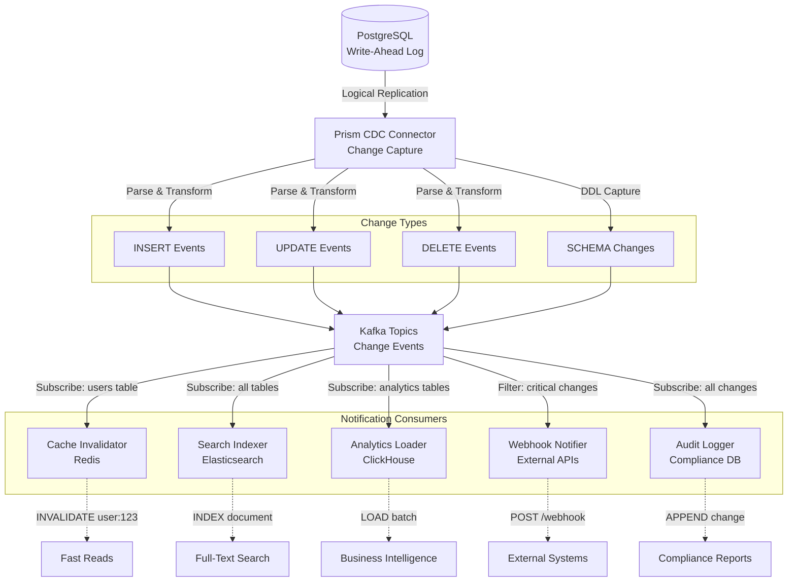

# RFC-009: Distributed Reliability Data Patterns

## Overview

This RFC documents high-level distributed reliability patterns that push complexity into the data access layer. These patterns typically require either **multiple data stores** or **specific patterned access** on a single data store, and are critical for building scalable, fault-tolerant systems.

**Core Philosophy**: Rather than implementing complex reliability logic in every application, Prism provides these patterns as **data access abstractions**, making them easy to adopt and operationally sound.

---

## Implementation Priority

Patterns are ordered by complexity and value. Prism will implement in this order:

| Priority | Pattern | Complexity | Value | Status |
|----------|---------|------------|-------|--------|
| **P0** | Claim Check | Low | High | Planned for Phase 1 |
| **P0** | Outbox | Low | High | Planned for Phase 1 |
| **P1** | Write-Ahead Log | Medium | High | Planned for Phase 2 |
| **P1** | Tiered Storage | Medium | Medium | Planned for Phase 2 |
| **P1** | CDC | Medium | High | Planned for Phase 2 |
| **P2** | Event Sourcing | High | Medium | Planned for Phase 3 |
| **P2** | CQRS | High | Medium | Planned for Phase 3 |

**Complexity ratings**:
- **Low**: Single-backend or simple orchestration, &lt;1 week implementation
- **Medium**: Multi-backend coordination, background workers, 2-4 weeks implementation
- **High**: Complex state management, multiple projections, 4-8 weeks implementation

---

## Pattern Catalog

### 1. Tiered Storage Pattern

**Problem**: Hot data (recent, frequently accessed) requires expensive, fast storage. Cold data (old, rarely accessed) wastes resources on premium storage.

**Solution**: Automatically migrate data between hot/warm/cold storage tiers based on access patterns and age.

#### Architecture

```
┌─────────────────────────────────────────────────────────────┐
│                    Application Layer                        │
│              (Sees unified interface)                       │
└─────────────────────────────────────────────────────────────┘
                          │
                          ▼
┌─────────────────────────────────────────────────────────────┐
│              Prism Tiered Storage DAL                       │
│                                                             │
│  ┌──────────┐      ┌──────────┐      ┌──────────┐         │
│  │   Hot    │ ───► │   Warm   │ ───► │   Cold   │         │
│  │  Tier    │      │   Tier   │      │   Tier   │         │
│  └──────────┘      └──────────┘      └──────────┘         │
│       │                 │                 │                │
└───────┼─────────────────┼─────────────────┼────────────────┘
        │                 │                 │
        ▼                 ▼                 ▼
   ┌────────┐       ┌──────────┐     ┌──────────┐
   │ Redis  │       │ Postgres │     │   S3     │
   │ (ms)   │       │ (10ms)   │     │ (100ms)  │
   └────────┘       └──────────┘     └──────────┘
```

#### Prism Configuration

```yaml
# .config.yaml
namespaces:
  - name: user-activity-logs
    pattern: tiered-storage

    # Reference store tracks which tier holds each key
    reference_store:
      backend: postgres
      table: tier_metadata
      # Schema: (key, tier, last_access, access_count, size)

    tiers:
      hot:
        backend: redis
        ttl: 86400  # 1 day
        capacity: 10GB

      warm:
        backend: postgres
        ttl: 2592000  # 30 days
        capacity: 1TB

      cold:
        backend: s3
        ttl: null  # Forever
        lifecycle:
          glacier_after: 7776000  # 90 days

    promotion_rules:
      - condition: access_count > 10
        action: promote_to_hot

      - condition: age > 1_day AND tier == hot
        action: demote_to_warm

      - condition: age > 30_days AND tier == warm
        action: demote_to_cold
```

#### Client Code

```rust
// Application sees unified interface
let log = client.get("user-activity-logs", "user:12345:2025-01-15").await?;

// Prism automatically:
// 1. Checks hot tier (Redis) - CACHE MISS
// 2. Checks warm tier (Postgres) - HIT
// 3. Returns result
// 4. Optionally promotes to hot tier (if access_count > 10)
```

#### Key Characteristics

- **Automatic migration**: No application logic needed
- **Transparent access**: Applications don't know which tier serves the request
- **Cost optimization**: Pay for performance only where needed
- **Tunable policies**: Per-namespace tier rules

#### Use Cases

- **Time-series data**: Recent metrics in Redis, historical in S3
- **User sessions**: Active in Redis, archived in Postgres
- **Log aggregation**: Hot logs searchable, cold logs compressed

---

### 2. Write-Ahead Log (WAL) Pattern

**Problem**: Direct writes to databases can be slow and block application threads. Need durability without sacrificing write latency.

**Solution**: Write to fast, durable append-only log first; apply to database asynchronously.

**CRITICAL**: WAL requires a **durable** queue backend (Kafka, NATS JetStream). Basic NATS (in-memory) is NOT sufficient for WAL patterns as it doesn't provide durability guarantees.

#### Architecture

```
┌─────────────────────────────────────────────────────────┐
│                   Application                           │
└─────────────────────────────────────────────────────────┘
              │
              │ write(key, value)
              ▼
┌─────────────────────────────────────────────────────────┐
│            Prism WAL DAL                                │
│                                                         │
│  1. Append to WAL (Kafka/NATS) ◄──────┐                │
│  2. Return success to client          │                │
│  3. Async apply to database ──────────┘                │
│                                                         │
└─────────────────────────────────────────────────────────┘
         │                            │
         │ (fast, durable)            │ (async, replayed)
         ▼                            ▼
    ┌────────┐                   ┌──────────┐
    │ Kafka  │                   │ Postgres │
    │ (1ms)  │                   │ (10ms)   │
    └────────┘                   └──────────┘
```

#### Prism Configuration

```yaml
namespaces:
  - name: order-writes
    pattern: write-ahead-log
    backend: postgres

    wal:
      backend: kafka  # or nats-jetstream (MUST be durable!)
      topic: order-wal
      retention: 604800  # 7 days
      replication: 3  # Durability: survive 2 broker failures

      # Apply strategy
      apply_mode: async  # or sync, hybrid
      batch_size: 1000
      batch_timeout: 100ms

      # Consumer-style compute (replay, compaction, transformations)
      consumers:
        - name: db-applier
          type: database_writer
          backend: postgres
          parallelism: 4

        - name: compactor
          type: log_compactor
          strategy: keep_latest  # For key-value style data
          interval: 3600s  # Compact hourly

      # Crash recovery
      checkpoint_interval: 60s

    consistency:
      read_mode: wal_first  # Read from WAL if not yet applied

    durability:
      wal_fsync: true  # Kafka fsync before ack
```

#### Client Code

```rust
// Write returns immediately after WAL append
client.set("order-writes", "order:789", order_data).await?;
// ✅ Durable in Kafka (1ms)
// ⏳ Applying to Postgres asynchronously

// Read checks WAL first, then database
let order = client.get("order-writes", "order:789").await?;
// Returns even if not yet applied to Postgres
```

#### Key Characteristics

- **Fast writes**: 1-2ms (Kafka append) vs 10-20ms (database write)
- **Durability**: Kafka replication ensures no data loss
- **Crash recovery**: Replay WAL from last checkpoint
- **Read-your-writes**: Reads check WAL for unapplied writes

#### Use Cases

- **High-throughput writes**: Order processing, financial transactions
- **Event sourcing**: Event log as source of truth
- **Database migration**: Replay WAL to populate new database

---

### 3. Claim Check Pattern

**Problem**: Messaging systems (Kafka, NATS, SQS) have message size limits (1MB-10MB). Large payloads (images, videos, ML models) can't be published directly.

**Solution**: Store large payloads in object storage; publish reference (claim check) to queue.

#### Architecture

```
┌─────────────────────────────────────────────────────────┐
│                   Producer                              │
└─────────────────────────────────────────────────────────┘
              │
              │ publish(event)
              ▼
┌─────────────────────────────────────────────────────────┐
│            Prism Claim Check DAL                        │
│                                                         │
│  1. if payload > threshold:                            │
│     - Store payload in S3                              │
│     - Generate claim_check_id                          │
│     - Publish {claim_check_id, metadata} to Kafka      │
│  2. else:                                              │
│     - Publish payload directly to Kafka                │
│                                                         │
└─────────────────────────────────────────────────────────┘
         │                            │
         │ (small: pointer)           │ (large: full data)
         ▼                            ▼
    ┌────────┐                   ┌──────────┐
    │ Kafka  │                   │   S3     │
    │        │                   │          │
    └────────┘                   └──────────┘
         │
         ▼
┌─────────────────────────────────────────────────────────┐
│                   Consumer                              │
│                                                         │
│  1. Receive message from Kafka                         │
│  2. if has claim_check_id:                             │
│     - Fetch payload from S3                            │
│  3. Process full payload                               │
│                                                         │
└─────────────────────────────────────────────────────────┘
```

#### Prism Configuration

```yaml
namespaces:
  - name: video-processing-events
    pattern: claim-check
    backend: kafka

    claim_check:
      threshold: 1MB  # Payloads > 1MB go to S3

      storage:
        backend: s3
        bucket: prism-claim-checks
        prefix: video-events/
        ttl: 604800  # 7 days (match Kafka retention)

      message:
        include_metadata: true  # Include size, content_type in queue message
        compression: gzip

    # Automatic cleanup
    cleanup:
      on_consume: true  # Delete S3 object after consumer acks
      # OR retain for replay
      on_consume: false
      retention: 604800  # 7 days
```

#### Client Code

```rust
// Producer: Prism handles claim check automatically
let event = VideoProcessingEvent {
    video_id: "vid123",
    raw_video: vec![0u8; 50_000_000],  // 50MB - exceeds threshold
};

client.publish("video-processing-events", event).await?;
// Prism:
// 1. Detects payload > 1MB
// 2. Stores raw_video in S3 → claim_check_id = "s3://prism-claim-checks/video-events/abc123"
// 3. Publishes to Kafka: { video_id: "vid123", claim_check_id: "abc123", size: 50MB }

// Consumer: Prism fetches claim check automatically
let event: VideoProcessingEvent = client.consume("video-processing-events").await?;
// Prism:
// 1. Receives Kafka message with claim_check_id
// 2. Fetches raw_video from S3
// 3. Reconstructs full VideoProcessingEvent
// 4. Returns to consumer

assert_eq!(event.raw_video.len(), 50_000_000);
```

#### Key Characteristics

- **Transparent**: Applications don't implement claim check logic
- **Automatic threshold**: Prism decides when to use S3 vs inline payload
- **Lifecycle management**: Auto-cleanup after consumption or TTL
- **Compression**: Reduce S3 storage costs

#### Use Cases

- **Media processing**: Images, videos, audio files in event streams
- **ML pipelines**: Model weights, training datasets
- **ETL pipelines**: Large CSV/Parquet files in data pipelines
- **Document workflows**: PDF rendering, OCR processing

---

### 4. Event Sourcing Pattern

**Problem**: Traditional CRUD loses history. Need to reconstruct state at any point in time, audit all changes.

**Solution**: Store all state changes as immutable events; materialize current state by replaying events.

#### Architecture

```
┌─────────────────────────────────────────────────────────┐
│                   Application                           │
└─────────────────────────────────────────────────────────┘
         │                            │
         │ command                    │ query
         ▼                            ▼
┌──────────────────┐         ┌──────────────────┐
│  Command Handler │         │  Query Handler   │
│                  │         │                  │
│  Append Event    │         │  Read View       │
└──────────────────┘         └──────────────────┘
         │                            │
         ▼                            ▼
┌──────────────────┐         ┌──────────────────┐
│  Event Store     │ ──────► │ Materialized     │
│  (Kafka/NATS)    │ replay  │ View (Postgres)  │
│                  │         │                  │
│ - Immutable      │         │ - Current state  │
│ - Append-only    │         │ - Projections    │
│ - Full history   │         │ - Queryable      │
└──────────────────┘         └──────────────────┘
```

#### Prism Configuration

```yaml
namespaces:
  - name: bank-account-events
    pattern: event-sourcing

    event_store:
      backend: kafka
      topic: bank-account-events
      retention: infinite  # Keep all events forever

    materialized_views:
      - name: account-balances
        backend: postgres
        projection: |
          CREATE TABLE account_balances (
            account_id TEXT PRIMARY KEY,
            balance BIGINT NOT NULL,
            version BIGINT NOT NULL
          );

        event_handlers:
          - event: AccountCreated
            sql: |
              INSERT INTO account_balances (account_id, balance, version)
              VALUES ($event.account_id, 0, 1);

          - event: MoneyDeposited
            sql: |
              UPDATE account_balances
              SET balance = balance + $event.amount,
                  version = version + 1
              WHERE account_id = $event.account_id;

          - event: MoneyWithdrawn
            sql: |
              UPDATE account_balances
              SET balance = balance - $event.amount,
                  version = version + 1
              WHERE account_id = $event.account_id;

    snapshots:
      enabled: true
      interval: 100  # Snapshot every 100 events
      backend: postgres
```

#### Client Code

```rust
// Append events
client.append_event("bank-account-events", BankAccountEvent::AccountCreated {
    account_id: "acct123",
    owner: "Alice",
    timestamp: now(),
}).await?;

client.append_event("bank-account-events", BankAccountEvent::MoneyDeposited {
    account_id: "acct123",
    amount: 1000,
    timestamp: now(),
}).await?;

// Query materialized view
let balance: i64 = client.query("account-balances", "acct123").await?;
assert_eq!(balance, 1000);

// Time-travel: replay events up to specific timestamp
let balance_yesterday = client.query_at_time("account-balances", "acct123", yesterday).await?;

// Full audit trail
let events = client.get_event_history("bank-account-events", "acct123").await?;
for event in events {
    println!("{:?}", event);  // Full history of account
}
```

#### Key Characteristics

- **Immutable events**: Never update or delete events
- **Full audit trail**: Complete history of state changes
- **Time-travel**: Reconstruct state at any point in time
- **Snapshots**: Avoid replaying millions of events

#### Use Cases

- **Financial systems**: Account balances, transactions
- **Inventory management**: Stock levels, warehouse movements
- **User management**: Profile changes, permission grants
- **Collaboration tools**: Document edits, comments

---

### 5. Change Data Capture (CDC) Pattern

**Problem**: Need to replicate database changes to other systems (search indexes, caches, analytics warehouses) without dual writes.

**Solution**: Capture database transaction log; stream changes as events.

#### Change Notification Flow



**Key Change Notification Patterns:**

1. **Cache Invalidation**: UPDATE/DELETE → Invalidate cache entries
2. **Search Indexing**: INSERT/UPDATE → Update search index
3. **Analytics Sync**: All changes → Append to data warehouse
4. **Webhook Notifications**: Filtered changes → Notify external systems
5. **Audit Trail**: All changes → Append to immutable log

#### Architecture

```
┌─────────────────────────────────────────────────────────┐
│                   Application                           │
│               (Normal CRUD operations)                  │
└─────────────────────────────────────────────────────────┘
              │
              ▼
┌─────────────────────────────────────────────────────────┐
│                   PostgreSQL                            │
│                                                         │
│  ┌───────────────────────────────────────┐             │
│  │  Write-Ahead Log (WAL)                │             │
│  │  - INSERT INTO users ...              │             │
│  │  - UPDATE orders SET status = ...     │             │
│  └───────────────────────────────────────┘             │
└─────────────────────────────────────────────────────────┘
              │
              │ (logical replication)
              ▼
┌─────────────────────────────────────────────────────────┐
│            Prism CDC Connector                          │
│            (Debezium-style)                             │
│                                                         │
│  1. Read WAL via replication slot                      │
│  2. Parse changes (INSERT/UPDATE/DELETE)               │
│  3. Publish to Kafka topic                             │
│                                                         │
└─────────────────────────────────────────────────────────┘
              │
              ▼
┌─────────────────────────────────────────────────────────┐
│                 Kafka (CDC Events)                      │
└─────────────────────────────────────────────────────────┘
         │              │              │
         ▼              ▼              ▼
   ┌─────────┐    ┌─────────┐    ┌─────────────┐
   │  Redis  │    │ Elastic │    │ ClickHouse  │
   │ (Cache) │    │ (Search)│    │ (Analytics) │
   └─────────┘    └─────────┘    └─────────────┘
```

#### Prism Configuration

```yaml
namespaces:
  - name: user-cdc
    pattern: change-data-capture

    source:
      backend: postgres
      database: prod
      schema: public
      tables:
        - users
        - user_profiles

      # Postgres-specific CDC config
      replication_slot: prism_cdc_slot
      publication: prism_publication

    sink:
      backend: kafka
      topic_prefix: cdc.postgres.public
      # Results in topics:
      # - cdc.postgres.public.users
      # - cdc.postgres.public.user_profiles

      message_format: json  # or avro, protobuf
      include_old_value: true  # For UPDATEs, include old row

    # Downstream consumers
    consumers:
      - name: user-cache
        backend: redis
        operations: [INSERT, UPDATE, DELETE]
        key_pattern: "user:{id}"

      - name: user-search
        backend: elasticsearch
        operations: [INSERT, UPDATE, DELETE]
        index: users

      - name: user-analytics
        backend: clickhouse
        operations: [INSERT, UPDATE]
        table: user_events
```

#### CDC Event Format

```json
{
  "op": "u",  // c=create, u=update, d=delete
  "source": {
    "db": "prod",
    "schema": "public",
    "table": "users",
    "lsn": 123456789
  },
  "before": {
    "id": 42,
    "email": "old@example.com",
    "name": "Old Name"
  },
  "after": {
    "id": 42,
    "email": "new@example.com",
    "name": "New Name"
  },
  "ts_ms": 1704931200000
}
```

#### Client Code

```python
# Application does normal database operations
db.execute("UPDATE users SET email = 'new@example.com' WHERE id = 42")

# Prism CDC automatically:
# 1. Captures change from Postgres WAL
# 2. Publishes to Kafka: cdc.postgres.public.users
# 3. Updates Redis cache: user:42
# 4. Updates Elasticsearch: users index
# 5. Inserts into ClickHouse: user_events table

# No dual writes needed!
```

#### Key Characteristics

- **Single source of truth**: Database WAL is authoritative
- **No dual writes**: Avoid consistency issues
- **Guaranteed delivery**: Replication slot ensures no missed changes
- **Schema evolution**: Handle ALTER TABLE gracefully

#### Use Cases

- **Cache invalidation**: Keep Redis in sync with Postgres
- **Search indexing**: Elasticsearch follows database changes
- **Data warehousing**: Stream changes to ClickHouse/Snowflake
- **Microservices sync**: Replicate data across service boundaries

---

### 6. CQRS (Command Query Responsibility Segregation)

**Problem**: Read and write workloads have different scaling characteristics. Single database struggles with both.

**Solution**: Separate write model (optimized for transactions) from read model (optimized for queries).

#### Architecture

```
┌─────────────────────────────────────────────────────────┐
│                   Application                           │
└─────────────────────────────────────────────────────────┘
         │                            │
         │ commands                   │ queries
         ▼                            ▼
┌──────────────────┐         ┌──────────────────┐
│  Write Model     │         │  Read Model      │
│  (Postgres)      │ ──────► │  (Postgres +     │
│                  │ events  │   Elasticsearch) │
│  - Normalized    │         │                  │
│  - ACID          │         │  - Denormalized  │
│  - Low volume    │         │  - Eventually    │
│                  │         │    consistent    │
│                  │         │  - High volume   │
└──────────────────┘         └──────────────────┘
         │                            ▲
         │                            │
         └────────► Kafka ────────────┘
                    (Change events)
```

#### Prism Configuration

```yaml
namespaces:
  - name: product-catalog
    pattern: cqrs

    write_model:
      backend: postgres
      schema: normalized
      tables:
        - products
        - categories
        - inventory
      consistency: strong

    read_models:
      - name: product-search
        backend: elasticsearch
        index: products
        denormalization: |
          {
            "product_id": product.id,
            "name": product.name,
            "category_name": category.name,  # Joined from categories
            "in_stock": inventory.quantity > 0  # Computed
          }

      - name: product-listings
        backend: postgres_replica
        materialized_view: |
          CREATE MATERIALIZED VIEW product_listings AS
          SELECT p.id, p.name, c.name AS category, i.quantity
          FROM products p
          JOIN categories c ON p.category_id = c.id
          JOIN inventory i ON p.id = i.product_id;
        refresh_strategy: on_change  # or periodic

    synchronization:
      backend: kafka
      topic: product-events
      lag_tolerance: 1000ms  # Alert if read model lags > 1s
```

#### Client Code

```rust
// Write: Goes to write model (Postgres)
client.execute_command("product-catalog", CreateProduct {
    name: "Widget",
    category_id: 5,
    price: 1999,
}).await?;

// Prism:
// 1. Inserts into products table (write model)
// 2. Publishes ProductCreated event to Kafka
// 3. Async updates read models (Elasticsearch, materialized view)

// Read: Goes to read model (Elasticsearch)
let results = client.search("product-search", "widget").await?;
// Returns denormalized, pre-joined data for fast search

// Another read: Goes to different read model (Postgres replica)
let listings = client.query("product-listings", filters).await?;
```

#### Key Characteristics

- **Independent scaling**: Scale write DB for transactions, read DBs for queries
- **Optimized schemas**: Normalized writes, denormalized reads
- **Eventual consistency**: Acceptable lag between write and read models
- **Multiple read models**: Same data, different projections

#### Use Cases

- **E-commerce**: Product catalog (complex queries, high read volume)
- **Social media**: Posts (write once, read many)
- **Analytics dashboards**: Pre-aggregated metrics
- **Reporting**: Historical data in OLAP format

---

### 7. Outbox Pattern

**Problem**: Need to atomically update database AND publish event. Dual writes can fail partially (database succeeds, Kafka publish fails).

**Solution**: Write event to outbox table in same transaction as business data; separate process publishes events.

#### Architecture

```
┌─────────────────────────────────────────────────────────┐
│                   Application                           │
└─────────────────────────────────────────────────────────┘
              │
              │ BEGIN TRANSACTION
              ▼
┌─────────────────────────────────────────────────────────┐
│                   PostgreSQL                            │
│                                                         │
│  ┌─────────────────────────────────────────┐           │
│  │  Business Table                         │           │
│  │  INSERT INTO orders (id, status, ...)   │           │
│  └─────────────────────────────────────────┘           │
│                                                         │
│  ┌─────────────────────────────────────────┐           │
│  │  Outbox Table                           │           │
│  │  INSERT INTO outbox (event_type,        │           │
│  │                      payload, ...)      │           │
│  └─────────────────────────────────────────┘           │
│                                                         │
│  COMMIT TRANSACTION                                     │
└─────────────────────────────────────────────────────────┘
              │
              │ (polling or CDC)
              ▼
┌─────────────────────────────────────────────────────────┐
│            Prism Outbox Publisher                       │
│                                                         │
│  1. Poll outbox table for unpublished events           │
│  2. Publish to Kafka                                   │
│  3. Mark as published (or delete)                      │
│                                                         │
└─────────────────────────────────────────────────────────┘
              │
              ▼
┌─────────────────────────────────────────────────────────┐
│                 Kafka (Events)                          │
└─────────────────────────────────────────────────────────┘
```

#### Prism Configuration

```yaml
namespaces:
  - name: order-service
    pattern: outbox

    database:
      backend: postgres

    outbox:
      table: outbox
      schema: |
        CREATE TABLE outbox (
          id BIGSERIAL PRIMARY KEY,
          event_type TEXT NOT NULL,
          aggregate_id TEXT NOT NULL,
          payload JSONB NOT NULL,
          created_at TIMESTAMP DEFAULT NOW(),
          published_at TIMESTAMP
        );
        CREATE INDEX idx_outbox_unpublished ON outbox (created_at) WHERE published_at IS NULL;

      publisher:
        mode: polling  # or cdc
        interval: 100ms
        batch_size: 1000

        destination:
          backend: kafka
          topic_pattern: "{event_type}"  # OrderCreated → order-created topic

        cleanup:
          strategy: delete  # or mark_published
          retention: 86400  # Keep published events for 1 day
```

#### Client Code

```rust
// Application: Single transaction
let tx = db.begin().await?;

// 1. Insert business data
tx.execute(
    "INSERT INTO orders (id, user_id, total) VALUES ($1, $2, $3)",
    &[&order_id, &user_id, &total],
).await?;

// 2. Insert into outbox (same transaction)
tx.execute(
    "INSERT INTO outbox (event_type, aggregate_id, payload) VALUES ($1, $2, $3)",
    &["OrderCreated", &order_id, &json!({"order_id": order_id, "total": total})],
).await?;

// 3. Commit (atomic!)
tx.commit().await?;

// Prism Outbox Publisher:
// - Polls outbox table every 100ms
// - Finds unpublished events
// - Publishes to Kafka topic: order-created
// - Deletes from outbox (or marks published_at)

// Guaranteed: If order exists in database, event will be published.
```

#### Key Characteristics

- **Atomicity**: Event publishing guaranteed if transaction commits
- **No dual writes**: Single transaction for database + outbox
- **At-least-once delivery**: Outbox publisher may retry failed publishes
- **Cleanup**: Delete published events or mark with timestamp

#### Use Cases

- **Order processing**: Guarantee OrderCreated event after order insertion
- **User registration**: Guarantee UserRegistered event after user creation
- **Inventory updates**: Guarantee InventoryChanged event after stock update
- **Any transactional messaging**: Need ACID + event publishing

---

## Pattern Selection Guide

| Pattern | When to Use | Backends | Complexity |
|---------|-------------|----------|------------|
| **Tiered Storage** | Hot/warm/cold data lifecycle | Redis + Postgres + S3 | Medium |
| **Write-Ahead Log** | High write throughput, durability | Kafka + Postgres | Medium |
| **Claim Check** | Large payloads in messaging | Kafka + S3 | Low |
| **Event Sourcing** | Full audit trail, time-travel | Kafka + Postgres | High |
| **CDC** | Sync database to cache/search/warehouse | Postgres + Kafka → (Redis/ES/ClickHouse) | Medium |
| **CQRS** | Different read/write scaling needs | Postgres + Elasticsearch | High |
| **Outbox** | Transactional messaging | Postgres + Kafka | Low |

---

## Pattern Composition and Layering

**Key Insight**: Patterns can be **layered together** to create powerful distributed systems. Prism supports composing multiple patterns in a single namespace.

### Common Pattern Combinations

#### 1. Claim Check + Pub/Sub Queue

**Use Case**: Video processing pipeline where videos are too large for Kafka, but you want pub/sub semantics.

```yaml
namespaces:
  - name: video-processing
    patterns:
      - claim-check   # Layer 1: Handle large payloads
      - pub-sub       # Layer 2: Multiple consumers

    backend: kafka

    claim_check:
      threshold: 1MB
      storage:
        backend: s3
        bucket: video-processing
      # Claim check field is automatically injected
      claim_check_field: "s3_reference"

    pub_sub:
      consumer_groups:
        - name: thumbnail-generator
        - name: transcoder
        - name: metadata-extractor
```

**How it works**:
1. Producer publishes large video (50MB)
2. Prism stores video in S3, generates `claim_check_id`
3. Prism publishes lightweight message to Kafka: `{video_id: "abc", s3_reference: "s3://..."}`
4. All consumer groups receive message with S3 reference
5. Each consumer fetches video from S3 independently

#### 2. Outbox + Claim Check

**Use Case**: Transactionally publish large payloads (e.g., ML model weights after training).

```yaml
namespaces:
  - name: ml-model-releases
    patterns:
      - outbox       # Layer 1: Transactional guarantees
      - claim-check  # Layer 2: Handle large model files

    database:
      backend: postgres

    outbox:
      table: model_outbox

    claim_check:
      threshold: 10MB
      storage:
        backend: s3
        bucket: ml-models
      claim_check_field: "model_s3_path"

    publisher:
      destination:
        backend: kafka
        topic: model-releases
```

**How it works**:
1. Application saves model metadata + model weights to outbox table (single transaction)
2. Outbox publisher polls for new entries
3. For each entry, Prism checks if payload &gt; 10MB
4. If yes, stores model weights in S3, updates outbox entry with S3 path
5. Publishes Kafka event with S3 reference
6. Consumers receive lightweight event, fetch model from S3

#### 3. WAL + Tiered Storage

**Use Case**: High-throughput writes with automatic hot/warm/cold tiering.

```yaml
namespaces:
  - name: user-activity
    patterns:
      - write-ahead-log  # Layer 1: Fast, durable writes
      - tiered-storage   # Layer 2: Cost-optimized storage

    wal:
      backend: kafka
      topic: activity-wal
      consumers:
        - name: tier-applier
          type: tiered_storage_writer

    reference_store:
      backend: postgres
      table: activity_tiers

    tiers:
      hot:
        backend: redis
        ttl: 86400
      warm:
        backend: postgres
        ttl: 2592000
      cold:
        backend: s3
```

**How it works**:
1. Application writes activity log (fast Kafka append)
2. WAL consumer reads from Kafka
3. Based on data freshness, writes to appropriate tier (hot = Redis)
4. Background tier migration moves data: hot → warm → cold
5. Reads check reference store to find current tier

#### 4. CDC + CQRS

**Use Case**: Keep read models in sync with write model using change data capture.

```yaml
namespaces:
  - name: product-catalog
    patterns:
      - cqrs  # Layer 1: Separate read/write models
      - cdc   # Layer 2: Automatic sync via database WAL

    write_model:
      backend: postgres
      tables: [products, categories]

    cdc:
      source:
        backend: postgres
        tables: [products, categories]
      sink:
        backend: kafka
        topic_prefix: product-cdc

    read_models:
      - name: product-search
        backend: elasticsearch
        sync_from: product-cdc.products

      - name: product-cache
        backend: redis
        sync_from: product-cdc.products
```

**How it works**:
1. Application writes to Postgres (write model)
2. CDC captures changes from Postgres WAL
3. Publishes changes to Kafka topics
4. Read models (Elasticsearch, Redis) consume from Kafka
5. Each read model stays in sync automatically

### Pattern Layering Guidelines

**When to layer patterns:**
- ✅ Patterns address different concerns (e.g., Claim Check = payload size, Pub/Sub = routing)
- ✅ Later patterns build on earlier patterns (e.g., Outbox → Claim Check → Kafka)
- ✅ Combined complexity is manageable (two low-complexity patterns = medium complexity)

**When NOT to layer:**
- ❌ Patterns conflict (e.g., Event Sourcing + CQRS both define event storage)
- ❌ Over-engineering (don't layer patterns "just in case")
- ❌ Combined complexity exceeds team capability

**Pattern Compatibility Matrix:**

| Pattern | Compatible With | Conflicts With |
|---------|-----------------|----------------|
| Claim Check | Pub/Sub, Outbox, CDC | - |
| Outbox | Claim Check, CDC | Event Sourcing |
| WAL | Tiered Storage, CDC | Event Sourcing |
| Tiered Storage | WAL, Claim Check | - |
| CDC | CQRS, Claim Check | - |
| Event Sourcing | CQRS | Outbox, WAL |
| CQRS | CDC, Event Sourcing | - |

---

## Prism Implementation Strategy

### 1. Pattern as Namespace Configuration

Each pattern is a first-class `pattern` type in namespace config:

```yaml
namespaces:
  - name: my-data
    pattern: tiered-storage  # or event-sourcing, cqrs, etc.
    backend: multi  # Indicates multiple backends
    # Pattern-specific config follows
```

### 2. Code Generation from Patterns

Prism generates:
- **Client SDKs**: Type-safe APIs for each pattern
- **Proxy routes**: Pattern-specific request handlers
- **Background jobs**: Tier migration, outbox publishing, CDC streaming

### 3. Observability

Pattern-specific metrics:

```
# Tiered Storage
prism_tiered_storage_tier_size{namespace="user-activity-logs", tier="hot"} 8.5e9
prism_tiered_storage_promotion_count{namespace="user-activity-logs"} 1234

# Write-Ahead Log
prism_wal_lag_seconds{namespace="order-writes"} 0.15
prism_wal_unapplied_entries{namespace="order-writes"} 523

# Claim Check
prism_claim_check_stored_count{namespace="video-processing-events"} 89
prism_claim_check_storage_bytes{namespace="video-processing-events"} 4.5e9

# CDC
prism_cdc_replication_lag_ms{namespace="user-cdc", table="users"} 120
prism_cdc_events_published{namespace="user-cdc", table="users"} 15234

# Outbox
prism_outbox_unpublished_count{namespace="order-service"} 12
prism_outbox_publish_latency_ms{namespace="order-service"} 45
```

---

## References

### Enterprise Integration Patterns
- [Enterprise Integration Patterns (Hohpe & Woolf)](https://www.enterpriseintegrationpatterns.com/)
- [Claim Check Pattern](https://www.enterpriseintegrationpatterns.com/patterns/messaging/StoreInLibrary.html)

### Event Sourcing & CQRS
- [Event Sourcing (Martin Fowler)](https://martinfowler.com/eaaDev/EventSourcing.html)
- [CQRS (Martin Fowler)](https://martinfowler.com/bliki/CQRS.html)
- [Axon Framework Documentation](https://docs.axoniq.io/)

### Change Data Capture
- [Debezium Documentation](https://debezium.io/)
- [PostgreSQL Logical Replication](https://www.postgresql.org/docs/current/logical-replication.html)
- [Kafka Connect CDC](https://docs.confluent.io/platform/current/connect/index.html)

### Outbox Pattern
- [Transactional Outbox (Microservices.io)](https://microservices.io/patterns/data/transactional-outbox.html)
- [Outbox Pattern (Debezium)](https://debezium.io/documentation/reference/stable/transformations/outbox-event-router.html)

### Netflix Data Gateway
- ADR-034: Product/Feature Sharding Strategy (Netflix-informed)
- ADR-035: Connection Pooling
- ADR-036: SQLite Config Storage

---

## Revision History

- 2025-10-08: Initial draft documenting 7 distributed reliability patterns
- 2025-10-09: Added change notification flow diagram to CDC pattern showing notification consumers and change types
