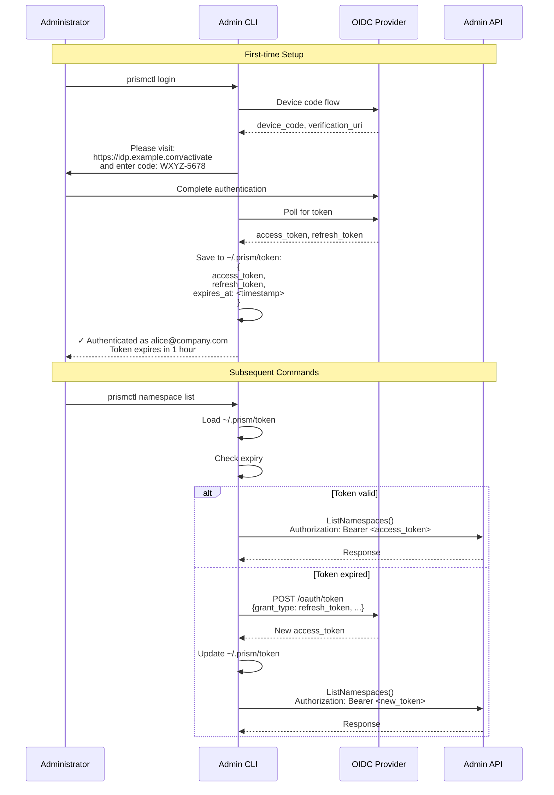

## Abstract

This RFC specifies the complete Admin Protocol for Prism, including OIDC-based authentication with provable identity, request/response flows, session management, and operational procedures. The Admin API enables platform teams to manage configurations, monitor sessions, check backend health, and perform operational tasks with strong authentication and audit trails.

## Motivation

Platform teams require secure, authenticated access to Prism administration with:
- **Provable Identity**: OIDC tokens with claims from identity provider
- **Role-Based Access**: Different permission levels (admin, operator, viewer)
- **Audit Trail**: Every administrative action logged with actor identity
- **Session Management**: Long-lived sessions for interactive use, short-lived for automation
- **Network Isolation**: Admin API on separate port, internal-only access

**Goals:**
- Define complete Admin gRPC protocol
- Specify OIDC authentication flow with token acquisition
- Document request/response patterns with sequence diagrams
- Establish session lifecycle and management
- Enable audit logging for compliance

**Non-Goals:**
- Data plane authentication (covered in RFC-011)
- User-facing authentication (application responsibility)
- Multi-cluster admin (single cluster scope)

## Protocol Overview

### Architecture

┌───────────────────────────────────────────────────────────────┐
│                      Admin Workflow                           │
└───────────────────────────────────────────────────────────────┘

Administrator → OIDC Provider → Admin CLI/UI → Prism Admin API → Backends
     (1)            (2)              (3)              (4)

1. Request identity token
2. Receive JWT with claims
3. Present JWT in gRPC metadata
4. Authorized operations
```text

### Ports and Endpoints

- **Data Plane**: Port 8980 (gRPC, public)
- **Admin API**: Port 8981 (gRPC, internal-only)
- **Metrics**: Port 9090 (Prometheus, internal-only)

### Protocol Stack

┌────────────────────────────────────────────────┐
│ Admin Client (CLI/UI/Automation)               │
└────────────────┬───────────────────────────────┘
                 │
                 │ gRPC/HTTP2 + TLS
                 │ Authorization: Bearer <jwt>
                 │
┌────────────────▼───────────────────────────────┐
│ Prism Admin Service (:8981)                    │
│                                                │
│  ┌──────────────────────────────────────────┐ │
│  │ Authentication Middleware                │ │
│  │ - JWT validation                         │ │
│  │ - Claims extraction                      │ │
│  │ - RBAC policy check                      │ │
│  └──────────────────────────────────────────┘ │
│                                                │
│  ┌──────────────────────────────────────────┐ │
│  │ AdminService Implementation              │ │
│  │ - Configuration management               │ │
│  │ - Session monitoring                     │ │
│  │ - Backend health                         │ │
│  │ - Operational commands                   │ │
│  └──────────────────────────────────────────┘ │
│                                                │
│  ┌──────────────────────────────────────────┐ │
│  │ Audit Logger                             │ │
│  │ - Records actor + operation + result     │ │
│  └──────────────────────────────────────────┘ │
└────────────────────────────────────────────────┘
```

## OIDC Authentication Flow

### Token Acquisition


### JWT Structure

```json
{
  "header": {
    "alg": "RS256",
    "typ": "JWT",
    "kid": "key-2024-10"
  },
  "payload": {
    "iss": "https://idp.example.com",
    "sub": "user:alice@company.com",
    "aud": "prismctl-api",
    "exp": 1696867200,
    "iat": 1696863600,
    "email": "alice@company.com",
    "email_verified": true,
    "groups": ["platform-team", "admins"],
    "scope": "admin:read admin:write admin:operational"
  },
  "signature": "..."
}
```

### Token Validation

```rust
use jsonwebtoken::{decode, DecodingKey, Validation};
use serde::{Deserialize, Serialize};

#[derive(Debug, Serialize, Deserialize)]
pub struct Claims {
    pub sub: String,
    pub email: String,
    pub email_verified: bool,
    pub groups: Vec<String>,
    pub scope: String,
    pub exp: u64,
    pub iat: u64,
}

pub struct JwtValidator {
    issuer: String,
    audience: String,
    jwks_client: JwksClient,
}

impl JwtValidator {
    pub async fn validate_token(&self, token: &str) -> Result<Claims> {
        // Decode header to get key ID
        let header = decode_header(token)?;
        let kid = header.kid.ok_or(Error::MissingKeyId)?;

        // Fetch public key from JWKS endpoint
        let jwk = self.jwks_client.get_key(&kid).await?;
        let decoding_key = DecodingKey::from_jwk(&jwk)?;

        // Validate signature and claims
        let mut validation = Validation::new(jsonwebtoken::Algorithm::RS256);
        validation.set_issuer(&[&self.issuer]);
        validation.set_audience(&[&self.audience]);
        validation.validate_exp = true;

        let token_data = decode::<Claims>(token, &decoding_key, &validation)?;

        // Additional validation
        if !token_data.claims.email_verified {
            return Err(Error::EmailNotVerified);
        }

        Ok(token_data.claims)
    }
}
```

## Request/Response Flows

### Namespace Creation Flow


### Session Monitoring Flow


### Backend Health Check Flow


## Session Management

### Session Lifecycle

Admin sessions support both interactive use (CLI) and automation (CI/CD):

**Interactive Session:**
- Acquire OIDC token via device code flow
- Token cached to `~/.prism/token`
- Token expires after 1 hour (refresh_token extends to 7 days)
- Automatic token refresh on expiry

**Automation Session:**
- Service account with client_credentials grant
- Token expires after 1 hour (no refresh token)
- Must re-authenticate for new token

### Session Establishment



## gRPC Protocol Specification

### Service Definition

```protobuf
syntax = "proto3";

package prism.admin.v1;

import "google/protobuf/timestamp.proto";
import "google/protobuf/duration.proto";
import "google/protobuf/empty.proto";

service AdminService {
  // Configuration Management
  rpc ListConfigs(ListConfigsRequest) returns (ListConfigsResponse);
  rpc GetConfig(GetConfigRequest) returns (GetConfigResponse);
  rpc CreateConfig(CreateConfigRequest) returns (CreateConfigResponse);
  rpc UpdateConfig(UpdateConfigRequest) returns (UpdateConfigResponse);
  rpc DeleteConfig(DeleteConfigRequest) returns (DeleteConfigResponse);

  // Namespace Management
  rpc ListNamespaces(ListNamespacesRequest) returns (ListNamespacesResponse);
  rpc CreateNamespace(CreateNamespaceRequest) returns (CreateNamespaceResponse);
  rpc UpdateNamespace(UpdateNamespaceRequest) returns (UpdateNamespaceResponse);
  rpc DeleteNamespace(DeleteNamespaceRequest) returns (DeleteNamespaceResponse);
  rpc GetNamespace(GetNamespaceRequest) returns (GetNamespaceResponse);

  // Session Management
  rpc ListSessions(ListSessionsRequest) returns (ListSessionsResponse);
  rpc GetSession(GetSessionRequest) returns (GetSessionResponse);
  rpc TerminateSession(TerminateSessionRequest) returns (TerminateSessionResponse);

  // Backend Health
  rpc GetBackendStatus(GetBackendStatusRequest) returns (GetBackendStatusResponse);
  rpc ListBackends(ListBackendsRequest) returns (ListBackendsResponse);

  // Operational Commands
  rpc SetMaintenanceMode(SetMaintenanceModeRequest) returns (SetMaintenanceModeResponse);
  rpc DrainConnections(DrainConnectionsRequest) returns (DrainConnectionsResponse);
  rpc GetMetrics(GetMetricsRequest) returns (GetMetricsResponse);

  // Audit
  rpc GetAuditLog(GetAuditLogRequest) returns (stream AuditLogEntry);
}
```

### Metadata Requirements

All requests must include:

authorization: Bearer <jwt_token>
request-id: <uuid>  // Optional but recommended
```text

### Error Codes

Standard gRPC status codes:

- `OK (0)`: Success
- `INVALID_ARGUMENT (3)`: Invalid request parameters
- `NOT_FOUND (5)`: Resource not found
- `ALREADY_EXISTS (6)`: Resource already exists
- `PERMISSION_DENIED (7)`: Insufficient permissions
- `UNAUTHENTICATED (16)`: Missing or invalid JWT
- `INTERNAL (13)`: Server error

## RBAC Policy

### Roles

```
roles:
  admin:
    description: Full administrative access
    permissions:
      - admin:read
      - admin:write
      - admin:operational
      - admin:audit

  operator:
    description: Operational tasks, read-only config
    permissions:
      - admin:read
      - admin:operational

  viewer:
    description: Read-only access
    permissions:
      - admin:read
```text

### Permission Mapping

| Operation | Required Permission |
|-----------|-------------------|
| ListNamespaces | `admin:read` |
| CreateNamespace | `admin:write` |
| UpdateNamespace | `admin:write` |
| DeleteNamespace | `admin:write` |
| ListSessions | `admin:read` |
| TerminateSession | `admin:operational` |
| GetBackendStatus | `admin:read` |
| SetMaintenanceMode | `admin:operational` |
| DrainConnections | `admin:operational` |
| GetAuditLog | `admin:audit` |

### Authorization Middleware

```
use tonic::{Request, Status};
use tonic::metadata::MetadataMap;

pub struct AuthInterceptor {
    jwt_validator: Arc<JwtValidator>,
    rbac: Arc<RbacService>,
}

impl AuthInterceptor {
    pub async fn intercept(&self, mut req: Request<()>) -> Result<Request<()>, Status> {
        // Extract JWT from metadata
        let token = req.metadata()
            .get("authorization")
            .and_then(|v| v.to_str().ok())
            .and_then(|s| s.strip_prefix("Bearer "))
            .ok_or_else(|| Status::unauthenticated("Missing authorization header"))?;

        // Validate JWT
        let claims = self.jwt_validator.validate_token(token).await
            .map_err(|e| Status::unauthenticated(format!("Invalid token: {}", e)))?;

        // Extract required permission from method
        let method = req.uri().path();
        let required_permission = self.method_to_permission(method);

        // Check RBAC
        if !self.rbac.has_permission(&claims, &required_permission).await {
            return Err(Status::permission_denied(format!(
                "User {} lacks permission {}",
                claims.email, required_permission
            )));
        }

        // Inject claims into request extensions
        req.extensions_mut().insert(claims);

        Ok(req)
    }

    fn method_to_permission(&self, method: &str) -> String {
        match method {
            "/prism.admin.v1.AdminService/CreateNamespace" => "admin:write",
            "/prism.admin.v1.AdminService/ListNamespaces" => "admin:read",
            "/prism.admin.v1.AdminService/SetMaintenanceMode" => "admin:operational",
            "/prism.admin.v1.AdminService/GetAuditLog" => "admin:audit",
            _ => "admin:read",
        }.to_string()
    }
}
```text

## Audit Logging

### Audit Entry Structure

```
#[derive(Debug, Serialize)]
pub struct AuditLogEntry {
    pub id: Uuid,
    pub timestamp: DateTime<Utc>,
    pub actor: String,              // Claims.email
    pub actor_groups: Vec<String>,  // Claims.groups
    pub operation: String,           // "CreateNamespace"
    pub resource_type: String,       // "namespace"
    pub resource_id: String,         // "analytics"
    pub namespace: Option<String>,
    pub request_id: Option<String>,
    pub success: bool,
    pub error: Option<String>,
    pub metadata: serde_json::Value,
}
```text

### Storage

```
CREATE TABLE admin_audit_log (
    id UUID PRIMARY KEY,
    timestamp TIMESTAMPTZ NOT NULL,
    actor VARCHAR(255) NOT NULL,
    actor_groups TEXT[] NOT NULL,
    operation VARCHAR(255) NOT NULL,
    resource_type VARCHAR(100) NOT NULL,
    resource_id VARCHAR(255) NOT NULL,
    namespace VARCHAR(255),
    request_id VARCHAR(100),
    success BOOLEAN NOT NULL,
    error TEXT,
    metadata JSONB,

    INDEX idx_audit_timestamp ON admin_audit_log(timestamp DESC),
    INDEX idx_audit_actor ON admin_audit_log(actor),
    INDEX idx_audit_operation ON admin_audit_log(operation),
    INDEX idx_audit_namespace ON admin_audit_log(namespace)
);
```text

## Security Considerations

### Network Isolation

```
# Kubernetes NetworkPolicy
apiVersion: networking.k8s.io/v1
kind: NetworkPolicy
metadata:
  name: prismctl-policy
spec:
  podSelector:
    matchLabels:
      app: prism-proxy
  ingress:
  - from:
    - podSelector:
        matchLabels:
          role: admin  # Only admin pods
    ports:
    - protocol: TCP
      port: 8981
```text

### Rate Limiting

```
use governor::{Quota, RateLimiter};

pub struct RateLimitInterceptor {
    limiter: Arc<RateLimiter<String>>,  // Key: actor email
}

impl RateLimitInterceptor {
    pub fn new() -> Self {
        // 100 requests per minute per user
        let quota = Quota::per_minute(NonZeroU32::new(100).unwrap());
        Self {
            limiter: Arc::new(RateLimiter::keyed(quota)),
        }
    }

    pub async fn check(&self, claims: &Claims) -> Result<(), Status> {
        if self.limiter.check_key(&claims.email).is_err() {
            return Err(Status::resource_exhausted(format!(
                "Rate limit exceeded for {}",
                claims.email
            )));
        }
        Ok(())
    }
}
```text

### TLS Configuration

```
use tonic::transport::{Server, ServerTlsConfig};

let tls_config = ServerTlsConfig::new()
    .identity(Identity::from_pem(cert_pem, key_pem))
    .client_ca_root(Certificate::from_pem(ca_pem));

Server::builder()
    .tls_config(tls_config)?
    .add_service(AdminServiceServer::new(admin_service))
    .serve("[::]:8981".parse()?)
    .await?;
```text

## Deployment

### Docker Compose

```
services:
  prism-proxy:
    image: prism/proxy:latest
    ports:
      - "8980:8980"  # Data plane
      - "8981:8981"  # Admin API (bind to internal network only)
    environment:
      PRISM_ADMIN_PORT: 8981
      PRISM_OIDC_ISSUER: https://idp.example.com
      PRISM_OIDC_AUDIENCE: prismctl-api
      PRISM_OIDC_JWKS_URI: https://idp.example.com/.well-known/jwks.json
    networks:
      - internal  # Admin API not exposed publicly

networks:
  internal:
    internal: true
```text

### Kubernetes

```
apiVersion: apps/v1
kind: Deployment
metadata:
  name: prism-proxy
spec:
  template:
    spec:
      containers:
      - name: proxy
        image: prism/proxy:latest
        ports:
        - containerPort: 8980
          name: data
        - containerPort: 8981
          name: admin
        env:
        - name: PRISM_OIDC_ISSUER
          valueFrom:
            secretKeyRef:
              name: prism-oidc
              key: issuer
        - name: PRISM_OIDC_AUDIENCE
          valueFrom:
            secretKeyRef:
              name: prism-oidc
              key: audience
---
apiVersion: v1
kind: Service
metadata:
  name: prismctl
spec:
  type: ClusterIP  # Internal only
  selector:
    app: prism-proxy
  ports:
  - port: 8981
    targetPort: 8981
    name: admin
```text

## Testing

### Integration Tests

```
func TestAdminProtocol(t *testing.T) {
    // Start mock OIDC server
    oidcServer := mockoidc.NewServer(t)
    defer oidcServer.Close()

    // Start Prism Admin API
    adminAPI := startAdminAPI(t, oidcServer.URL)
    defer adminAPI.Close()

    // Acquire token
    token, err := oidcServer.AcquireToken(
        "alice@example.com",
        []string{"admin:read", "admin:write"},
    )
    require.NoError(t, err)

    // Create namespace
    conn, err := grpc.Dial(adminAPI.Address(),
        grpc.WithTransportCredentials(insecure.NewCredentials()),
        grpc.WithPerRPCCredentials(BearerToken{token}),
    )
    require.NoError(t, err)
    defer conn.Close()

    client := admin.NewAdminServiceClient(conn)
    resp, err := client.CreateNamespace(context.Background(), &admin.CreateNamespaceRequest{
        Name: "test-namespace",
        Description: "Test namespace",
    })
    require.NoError(t, err)
    assert.Equal(t, "test-namespace", resp.Namespace.Name)
}
```text

## Open Questions

1. **OIDC Provider Choice**: Support multiple providers (Okta, Auth0, Google, Azure AD)?
   - **Feedback**: Yes, support AWS Cognito, Azure AD, Google, Okta, Auth0, and Dex
   - Multi-provider support enables flexibility across different organizational setups
   - Implementation approach:
     - OIDC discovery endpoint (`.well-known/openid-configuration`) for automatic configuration
     - Provider-specific configuration overrides for edge cases
     - Common JWT validation logic across all providers
   - **Provider Matrix**:
     - **AWS Cognito**: User pools, federated identities, integrates with AWS IAM
     - **Azure AD**: Enterprise identity, conditional access policies, group claims
     - **Google Workspace**: Google SSO, organization-wide policies
     - **Okta**: Enterprise SSO, MFA, rich group/role management
     - **Auth0**: Developer-friendly, custom rules, social logins
     - **Dex**: Self-hosted, LDAP/SAML connector, Kubernetes-native
   - **Recommended**: Start with Dex (self-hosted, testing) and one enterprise provider (Okta/Azure AD)

2. **Token Caching**: How long to cache validated JWTs before re-validating?
   - **Feedback**: Is that up to us? Make it configurable, default to 24 hours. Do we have support for refreshing tokens?
   - **Token Validation Caching**:
     - Validated JWTs can be cached to reduce JWKS fetches and validation overhead
     - Cache keyed by token hash, value contains validated claims
     - **Recommended**: Cache until token expiry (not beyond), configurable max TTL
     - Default: Cache for min(token.exp - now, 24 hours)
   - **JWKS Caching**:
     - Public keys from JWKS endpoint should be cached aggressively
     - **Recommended**: Cache for 24 hours with background refresh
     - Invalidate on signature validation failure (key rotation)
   - **Refresh Token Support**:
     - Yes, implement refresh token flow for long-lived CLI sessions
     - Flow: When access_token expires, use refresh_token to get new access_token
     - Refresh tokens stored securely in `~/.prism/token` (mode 0600)
     - Configuration:
       ```
       token_cache:
         jwt_validation_ttl: 24h  # How long to cache validated JWTs
         jwks_cache_ttl: 24h      # How long to cache public keys
         auto_refresh: true       # Automatically refresh expired tokens
       ```text
   - **Security Trade-offs**:
     - Longer caching = better performance, but delayed revocation
     - Shorter caching = more validation overhead, but faster revocation response
     - **Recommended**: Default 24h for trusted environments, 1h for high-security

3. **Offline Access**: Support for offline token validation (signed JWTs)?
   - **Feedback**: Yes, discuss how, tradeoffs, and tech needed
   - **Offline Validation Benefits**:
     - No dependency on OIDC provider for every request (reduces latency)
     - Proxy continues working during identity provider outage
     - Reduces load on identity provider
   - **How to Implement**:
     - Cache JWKS (public keys) locally with periodic refresh
     - Validate JWT signature using cached public keys
     - Check standard claims (iss, aud, exp, nbf) locally
     - **No online validation** = Can't check real-time revocation
   - **Technology Stack**:
     ```
     use jsonwebtoken::{decode, DecodingKey, Validation, Algorithm};
     use reqwest::Client;

     pub struct OfflineValidator {
         jwks_cache: Arc<RwLock<HashMap<String, Jwk>>>,
         issuer: String,
         audience: String,
     }

     impl OfflineValidator {
         pub async fn validate(&self, token: &str) -> Result<Claims> {
             let header = decode_header(token)?;
             let kid = header.kid.ok_or(Error::MissingKeyId)?;

             // Use cached key
             let jwks = self.jwks_cache.read().await;
             let jwk = jwks.get(&kid).ok_or(Error::UnknownKey)?;

             // Validate offline (no network call)
             let key = DecodingKey::from_jwk(jwk)?;
             let mut validation = Validation::new(Algorithm::RS256);
             validation.set_issuer(&[&self.issuer]);
             validation.set_audience(&[&self.audience]);

             let token_data = decode::<Claims>(token, &key, &validation)?;
             Ok(token_data.claims)
         }

         // Periodic background refresh of JWKS
         pub async fn refresh_jwks(&self) -> Result<()> {
             let jwks_uri = format!("{}/.well-known/jwks.json", self.issuer);
             let jwks: JwkSet = reqwest::get(&jwks_uri).await?.json().await?;

             let mut cache = self.jwks_cache.write().await;
             for jwk in jwks.keys {
                 if let Some(kid) = &jwk.common.key_id {
                     cache.insert(kid.clone(), jwk);
                 }
             }
             Ok(())
         }
     }
     ```text
   - **Trade-offs**:
     - ✅ **Pros**: Lower latency, no OIDC dependency per-request, better availability
     - ❌ **Cons**: Can't detect real-time revocation, stale keys if JWKS refresh fails
   - **Security Considerations**:
     - **Risk**: Revoked tokens remain valid until expiry
     - **Mitigation**:
       - Use short-lived access tokens (1 hour)
       - Implement token revocation list (check periodically)
       - Alert on JWKS refresh failures
   - **Recommended**: Enable offline validation with 1-hour token expiry and background JWKS refresh every 6 hours

4. **Multi-Tenancy**: How to map OIDC tenants to Prism namespaces?
   - **Feedback**: Provide some options with tradeoffs
   - **Option 1: Group-Based Mapping**
     - Use OIDC group claims to authorize namespace access
     - Example: Group `platform-team` → Can access all namespaces
     - Example: Group `team-analytics` → Can access `analytics` namespace
     - Configuration:
       ```
       namespace_access:
         analytics:
           groups: ["team-analytics", "platform-team"]
         user-profiles:
           groups: ["team-users", "platform-team"]
       ```text
     - **Pros**: Simple, leverages existing IdP groups, easy to understand
     - **Cons**: Tight coupling to IdP group structure, requires group sync
   - **Option 2: Claim-Based Mapping**
     - Custom JWT claims define namespace access
     - Example: `"namespaces": ["analytics", "user-profiles"]`
     - IdP adds custom claims during token issuance
     - Configuration:
       ```
       let authorized_namespaces = claims.custom
           .get("namespaces")
           .and_then(|v| v.as_array())
           .map(|arr| arr.iter().filter_map(|v| v.as_str()).collect())
           .unwrap_or_default();
       ```text
     - **Pros**: Explicit, no group interpretation needed, flexible
     - **Cons**: Requires custom IdP configuration, claim size limits
   - **Option 3: Dynamic RBAC with External Policy**
     - JWT provides identity, external policy engine (OPA/Cedar) decides access
     - Policy checks: `allow if user.email in namespace.allowed_users`
     - Configuration:
       ```
       # OPA policy
       allow {
           input.user.email == "alice@company.com"
           input.namespace == "analytics"
       }

       allow {
           "platform-team" in input.user.groups
       }
       ```text
     - **Pros**: Most flexible, centralized policy management, audit trail
     - **Cons**: Additional dependency (OPA), higher latency, more complex
   - **Option 4: Tenant-Scoped OIDC Providers**
     - Each tenant has separate OIDC provider/application
     - Token issuer determines namespace access
     - Example: `iss: https://tenant-analytics.idp.com` → `analytics` namespace
     - Configuration:
       ```
       namespaces:
         analytics:
           oidc_issuer: https://tenant-analytics.idp.com
         user-profiles:
           oidc_issuer: https://tenant-users.idp.com
       ```text
     - **Pros**: Strong isolation, tenant-specific policies, clear boundaries
     - **Cons**: Complex setup, multiple IdP integrations, higher overhead
   - **Comparison Table**:
     | Approach | Complexity | Flexibility | Isolation | Performance |
     |----------|-----------|------------|-----------|-------------|
     | Group-Based | Low | Medium | Low | High |
     | Claim-Based | Medium | High | Medium | High |
     | External Policy | High | Very High | Medium | Medium |
     | Tenant-Scoped | Very High | Low | Very High | Medium |
   - **Recommended**: Start with **Group-Based** for simplicity, evolve to **External Policy (OPA)** for enterprise multi-tenancy

5. **Service Accounts**: Best practices for automation tokens?
   - **Feedback**: Include some recommendations and tradeoffs
   - **Recommendation 1: OAuth2 Client Credentials Flow**
     - Service accounts use client_id/client_secret to obtain tokens
     - No user interaction required (headless authentication)
     - Flow:
       ```
       curl -X POST https://idp.example.com/oauth/token \
         -H "Content-Type: application/x-www-form-urlencoded" \
         -d "grant_type=client_credentials" \
         -d "client_id=prism-ci-service" \
         -d "client_secret=<secret>" \
         -d "scope=admin:read admin:write"
       ```text
     - Configuration:
       ```
       # CI/CD environment
       PRISM_CLIENT_ID=prism-ci-service
       PRISM_CLIENT_SECRET=<secret>

       # CLI auto-detects and uses client credentials
       prismctl --auth=client-credentials namespace list
       ```text
     - **Pros**: Standard OAuth2 flow, widely supported, short-lived tokens
     - **Cons**: Secret management required, no refresh tokens (must re-authenticate)
   - **Recommendation 2: Long-Lived API Keys**
     - Prism issues API keys directly (bypass OIDC for service accounts)
     - Keys stored in database, validated by Prism (not IdP)
     - Flow:
       ```
       # Generate key (admin operation)
       prismctl serviceaccount create ci-deploy --scopes admin:write
       # Returns: prism_key_abc123...

       # Use key
       export PRISM_API_KEY=prism_key_abc123...
       prismctl namespace create prod-analytics
       ```text
     - Configuration:
       ```
       CREATE TABLE service_accounts (
           id UUID PRIMARY KEY,
           name VARCHAR(255) NOT NULL,
           key_hash VARCHAR(255) NOT NULL,  -- bcrypt hash
           scopes TEXT[] NOT NULL,
           created_at TIMESTAMPTZ NOT NULL,
           expires_at TIMESTAMPTZ,
           last_used_at TIMESTAMPTZ
       );
       ```text
     - **Pros**: Simple, no IdP dependency, fine-grained scopes
     - **Cons**: Not standard OAuth2, custom implementation, key rotation complexity
   - **Recommendation 3: Kubernetes Service Account Tokens**
     - For K8s deployments, use projected service account tokens
     - Tokens automatically rotated by Kubernetes
     - Flow:
       ```
       # Pod spec
       volumes:
       - name: prism-token
         projected:
           sources:
           - serviceAccountToken:
               audience: prism-admin-api
               expirationSeconds: 3600
               path: token

       # Mount at /var/run/secrets/prism/token
       # CLI auto-detects and uses
       ```text
     - **Pros**: Automatic rotation, no secret management, K8s-native
     - **Cons**: K8s-only, requires TokenRequest API, audience configuration
   - **Recommendation 4: Short-Lived Tokens with Secure Storage**
     - Store client credentials in secret manager (Vault/AWS Secrets Manager)
     - Fetch credentials at runtime, obtain token, use, discard
     - Configuration:
       ```
       # Fetch from Vault
       export PRISM_CLIENT_SECRET=$(vault kv get -field=secret prism/ci-service)

       # Obtain token (automatically by CLI)
       prismctl namespace list
       ```text
     - **Pros**: Secrets never stored on disk, audit trail in secret manager
     - **Cons**: Dependency on secret manager, additional latency
   - **Comparison Table**:
     | Approach | Security | Ease of Use | Rotation | K8s Native |
     |----------|---------|------------|----------|-----------|
     | Client Credentials | Medium | High | Manual | No |
     | API Keys | Low-Medium | Very High | Manual | No |
     | K8s SA Tokens | High | High | Automatic | Yes |
     | Secret Manager | High | Medium | Automatic | No |
   - **Recommended Practices**:
     - ✅ Use **Client Credentials** for general automation (CI/CD, scripts)
     - ✅ Use **K8s SA Tokens** for in-cluster automation (CronJobs, Operators)
     - ✅ Use **Secret Manager** for high-security environments
     - ❌ Avoid long-lived API keys unless absolutely necessary
     - ✅ Implement token rotation (max 90 days)
     - ✅ Audit service account usage regularly
     - ✅ Use least-privilege scopes (e.g., `admin:read` for monitoring)

## References

- [OAuth 2.0 Device Authorization Grant](https://datatracker.ietf.org/doc/html/rfc8628)
- [OpenID Connect Core 1.0](https://openid.net/specs/openid-connect-core-1_0.html)
- [JSON Web Token (JWT)](https://datatracker.ietf.org/doc/html/rfc7519)
- [gRPC Authentication](https://grpc.io/docs/guides/auth/)
- ADR-007: Authentication and Authorization
- ADR-027: Admin API via gRPC
- RFC-003: Admin Interface for Prism

## Revision History

- 2025-10-09: Initial draft with OIDC flows and sequence diagrams
- 2025-10-09: Expanded open questions with feedback on multi-provider support (AWS/Azure/Google/Okta/Auth0/Dex), token caching (24h default with refresh token support), offline validation with JWKS caching, multi-tenancy mapping options (group/claim/OPA/tenant-scoped), and service account best practices (client credentials/API keys/K8s tokens/secret manager)

```