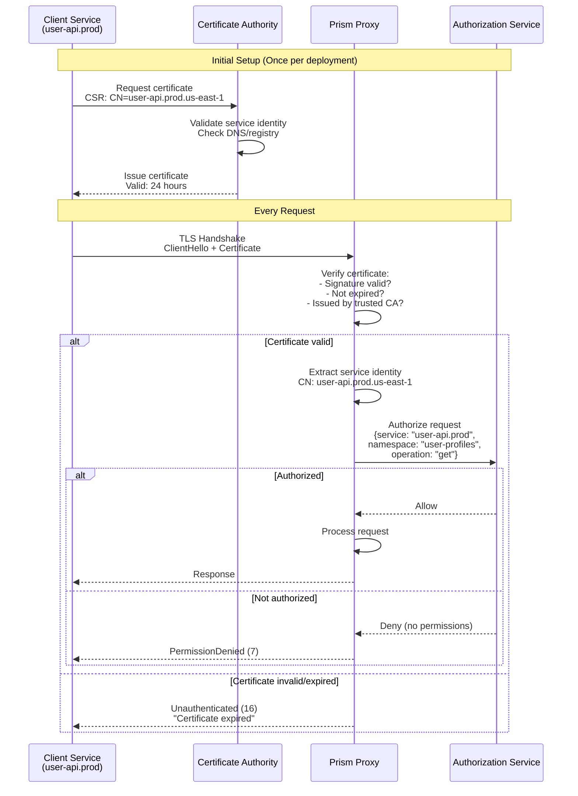
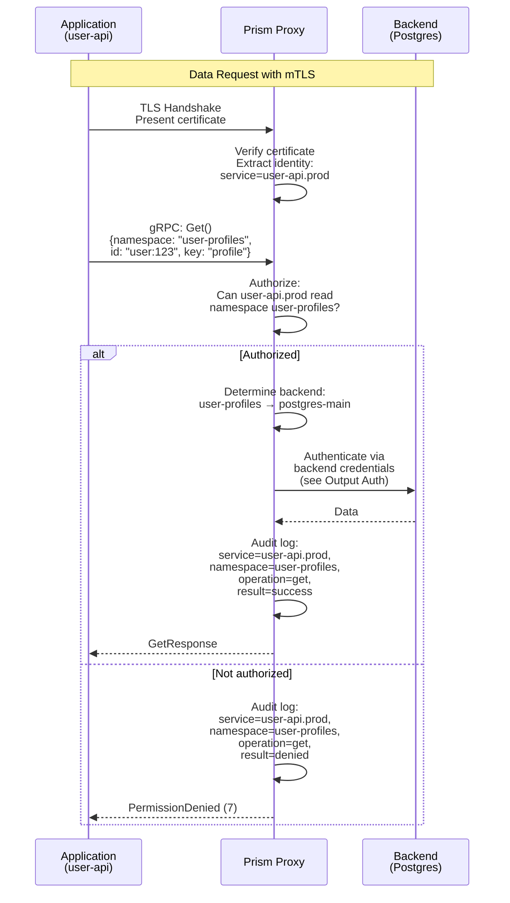
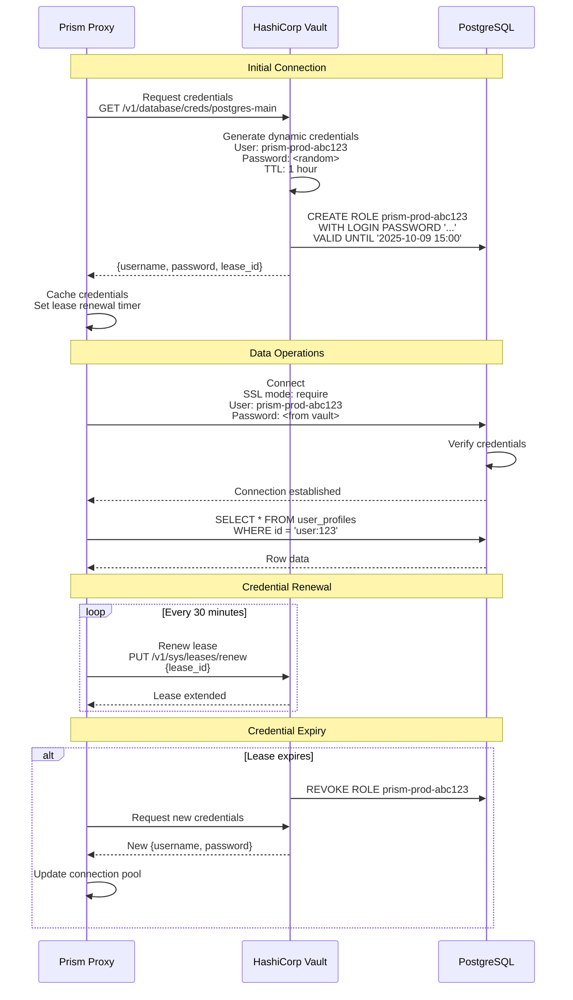
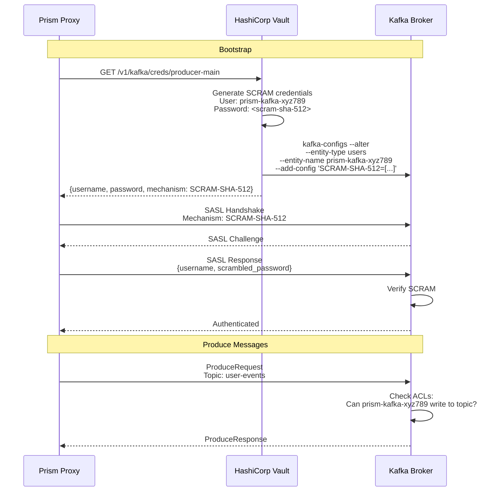
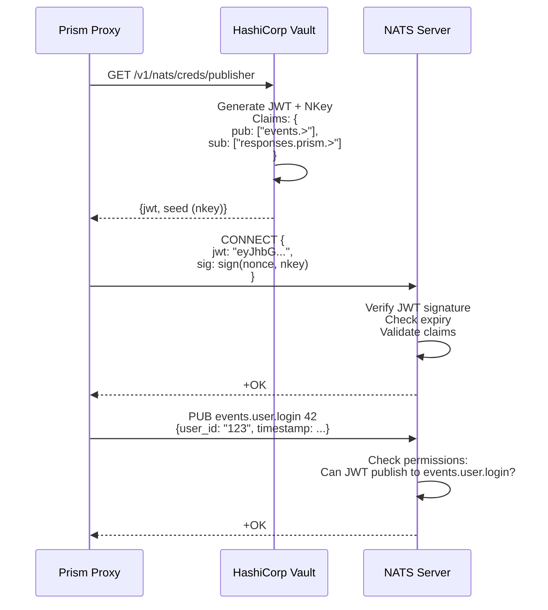
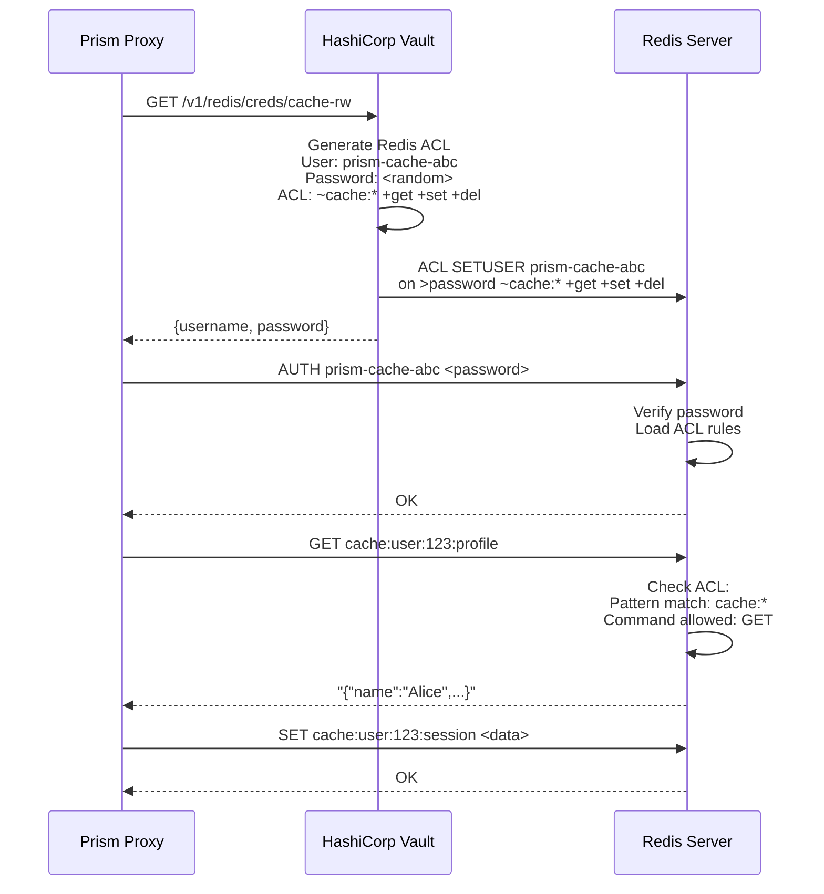
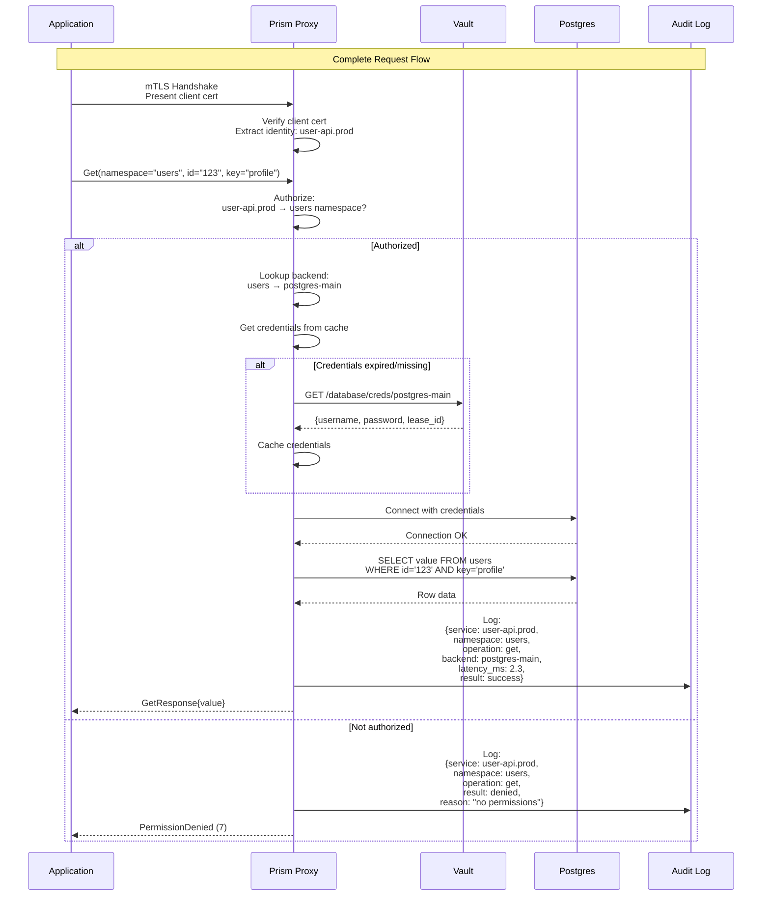

## Abstract

This RFC specifies the complete authentication model for Prism's data proxy, covering both **input authentication** (how clients authenticate to the proxy) and **output authentication** (how the proxy authenticates to backend data stores). The design emphasizes mTLS for service-to-service communication, certificate management, and secure backend connectivity.

## Motivation

The Prism data proxy sits between client applications and heterogeneous backends, requiring:

**Input Authentication (Client → Proxy):**
- Verify client service identity
- Prevent unauthorized access to data plane
- Support namespace-level access control
- Provide audit trail of data access

**Output Authentication (Proxy → Backend):**
- Authenticate proxy to backend services
- Manage credentials for multiple backend types
- Support credential rotation without downtime
- Isolate backend credentials from clients

**Goals:**
- Define mTLS-based client authentication
- Specify backend authentication patterns per backend type
- Document credential management and rotation
- Provide sequence diagrams for all authentication flows

**Non-Goals:**
- Admin API authentication (covered in RFC-010)
- Application user authentication (application responsibility)
- Data encryption at rest (backend responsibility)

## Architecture Overview

```
┌──────────────────────────────────────────────────────────────────┐
│                      Authentication Boundaries                   │
└──────────────────────────────────────────────────────────────────┘

Client Service → [mTLS] → Prism Proxy → [Backend Auth] → Backends
  (Input Auth)              (Identity)    (Output Auth)

Input:  mTLS certificates validate client identity
Output: Backend-specific credentials (mTLS, passwords, API keys)
```

### Ports and Security Zones

```
┌─────────────────────────────────────────────────────────────────┐
│                        Security Zones                           │
└─────────────────────────────────────────────────────────────────┘

Zone 1: Client Services (Service Mesh)
  - mTLS enforced
  - Certificates issued by company CA
  - Short-lived (24 hours)

Zone 2: Prism Proxy (DMZ)
  - Accepts mTLS from clients
  - Holds backend credentials
  - Enforces namespace ACLs

Zone 3: Backend Services (Secure Network)
  - Postgres: mTLS or password
  - Kafka: SASL/SCRAM or mTLS
  - NATS: JWT or mTLS
  - Redis: ACL + password
```

## Input Authentication (Client → Proxy)

### mTLS Certificate-Based Authentication



### Certificate Structure

Client certificates must include:

```yaml
Subject:
  CN: user-api.prod.us-east-1        # Service name + env + region
  O: Company Name
  OU: Platform Services

Subject Alternative Names:
  - DNS: user-api.prod.us-east-1.internal
  - DNS: user-api.prod.svc.cluster.local
  - URI: spiffe://company.com/ns/prod/sa/user-api

Extensions:
  Key Usage: Digital Signature, Key Encipherment
  Extended Key Usage: Client Authentication
  Validity: 24 hours
```

### Rust Implementation

```rust
use rustls::{ServerConfig, ClientCertVerifier, Certificate};
use x509_parser::prelude::*;

pub struct PrismClientVerifier {
    ca_cert: Certificate,
}

impl ClientCertVerifier for PrismClientVerifier {
    fn verify_client_cert(
        &self,
        cert_chain: &[Certificate],
        _sni: Option<&str>,
    ) -> Result<ClientCertVerified, TLSError> {
        if cert_chain.is_empty() {
            return Err(TLSError::NoCertificatesPresented);
        }

        let client_cert = &cert_chain[0];

        // Verify signature chain
        self.verify_cert_chain(client_cert, &self.ca_cert)?;

        // Check expiry
        let (_, parsed) = X509Certificate::from_der(&client_cert.0)
            .map_err(|_| TLSError::InvalidCertificateData("Failed to parse".into()))?;

        if !parsed.validity().is_valid() {
            return Err(TLSError::InvalidCertificateData("Expired".into()));
        }

        Ok(ClientCertVerified::assertion())
    }
}

pub struct ServiceIdentity {
    pub service_name: String,
    pub environment: String,
    pub region: String,
}

impl ServiceIdentity {
    pub fn from_certificate(cert: &Certificate) -> Result<Self> {
        let (_, parsed) = X509Certificate::from_der(&cert.0)?;

        // Extract CN from subject
        let cn = parsed.subject()
            .iter_common_name()
            .next()
            .and_then(|cn| cn.as_str().ok())
            .ok_or(Error::MissingCommonName)?;

        // Parse: user-api.prod.us-east-1
        let parts: Vec<&str> = cn.split('.').collect();
        if parts.len() < 2 {
            return Err(Error::InvalidCommonName);
        }

        Ok(ServiceIdentity {
            service_name: parts[0].to_string(),
            environment: parts.get(1).unwrap_or(&"unknown").to_string(),
            region: parts.get(2).unwrap_or(&"unknown").to_string(),
        })
    }
}
```

### Request Flow with mTLS



### Certificate Rotation

```rust
use notify::{Watcher, RecursiveMode};

pub struct CertificateReloader {
    cert_path: PathBuf,
    key_path: PathBuf,
    server_config: Arc<RwLock<ServerConfig>>,
}

impl CertificateReloader {
    pub async fn watch(&self) -> Result<()> {
        let (tx, rx) = mpsc::channel();
        let mut watcher = notify::watcher(tx, Duration::from_secs(30))?;

        watcher.watch(&self.cert_path, RecursiveMode::NonRecursive)?;
        watcher.watch(&self.key_path, RecursiveMode::NonRecursive)?;

        loop {
            match rx.recv() {
                Ok(DebouncedEvent::Write(_) | DebouncedEvent::Create(_)) => {
                    tracing::info!("Certificate files changed, reloading...");

                    let new_config = self.load_server_config().await?;

                    let mut config = self.server_config.write().await;
                    *config = new_config;

                    tracing::info!("Certificate reloaded successfully");
                }
                _ => {}
            }
        }
    }
}
```

## Output Authentication (Proxy → Backend)

### Per-Backend Authentication Strategies

```
┌─────────────────────────────────────────────────────────────────┐
│                 Backend Authentication Matrix                   │
└─────────────────────────────────────────────────────────────────┘

Backend      | Primary Auth      | Fallback       | Credential Store
-------------|-------------------|----------------|------------------
Postgres     | mTLS              | Password       | Vault/K8s Secret
Kafka        | SASL/SCRAM        | mTLS           | Vault/K8s Secret
NATS         | JWT               | NKey           | Vault/K8s Secret
Redis        | ACL + Password    | None           | Vault/K8s Secret
SQLite       | File permissions  | None           | N/A (local)
S3           | IAM Role          | Access Keys    | Instance Profile
```

### Postgres Authentication



### Kafka Authentication (SASL/SCRAM)



### NATS Authentication (JWT)



### Redis Authentication (ACL)



### Credential Management

```rust
use vaultrs::client::VaultClient;
use vaultrs::kv2;

pub struct BackendCredentials {
    pub backend_type: String,
    pub username: String,
    pub password: String,
    pub lease_id: Option<String>,
    pub expires_at: DateTime<Utc>,
}

pub struct CredentialManager {
    vault_client: VaultClient,
    credentials: Arc<RwLock<HashMap<String, BackendCredentials>>>,
}

impl CredentialManager {
    pub async fn get_credentials(&self, backend_id: &str) -> Result<BackendCredentials> {
        // Check cache
        {
            let creds = self.credentials.read().await;
            if let Some(cached) = creds.get(backend_id) {
                if cached.expires_at > Utc::now() + Duration::minutes(5) {
                    return Ok(cached.clone());
                }
            }
        }

        // Fetch from Vault
        let path = format!("database/creds/{}", backend_id);
        let creds: VaultCredentials = self.vault_client
            .read(&path)
            .await?;

        let backend_creds = BackendCredentials {
            backend_type: creds.backend_type,
            username: creds.username,
            password: creds.password,
            lease_id: Some(creds.lease_id),
            expires_at: Utc::now() + Duration::hours(1),
        };

        // Update cache
        {
            let mut cache = self.credentials.write().await;
            cache.insert(backend_id.to_string(), backend_creds.clone());
        }

        // Schedule renewal
        self.schedule_renewal(backend_id, &creds.lease_id).await;

        Ok(backend_creds)
    }

    async fn schedule_renewal(&self, backend_id: &str, lease_id: &str) {
        let vault_client = self.vault_client.clone();
        let lease_id = lease_id.to_string();

        tokio::spawn(async move {
            loop {
                tokio::time::sleep(Duration::minutes(30)).await;

                match vault_client.renew_lease(&lease_id).await {
                    Ok(_) => {
                        tracing::info!(
                            backend_id = %backend_id,
                            lease_id = %lease_id,
                            "Renewed backend credentials"
                        );
                    }
                    Err(e) => {
                        tracing::error!(
                            backend_id = %backend_id,
                            error = %e,
                            "Failed to renew credentials, will fetch new ones"
                        );
                        break;
                    }
                }
            }
        });
    }
}
```

## End-to-End Authentication Flow



## Configuration

### Proxy Configuration

```yaml
# prism-proxy.yaml
data_port: 8980
admin_port: 8981

# Input Authentication
input_auth:
  type: mtls
  ca_cert: /etc/prism/certs/ca.crt
  server_cert: /etc/prism/certs/server.crt
  server_key: /etc/prism/certs/server.key
  client_cert_required: true
  verify_depth: 3

# Output Authentication
output_auth:
  credential_provider: vault
  vault:
    address: https://vault.internal:8200
    token_path: /var/run/secrets/vault-token
    namespace: prism-prod

backends:
  - name: postgres-main
    type: postgres
    auth:
      type: vault-dynamic
      path: database/creds/postgres-main
    connection:
      host: postgres.internal
      port: 5432
      database: users
      ssl_mode: require

  - name: kafka-events
    type: kafka
    auth:
      type: vault-dynamic
      path: kafka/creds/producer-main
    connection:
      brokers: [kafka-1:9092, kafka-2:9092, kafka-3:9092]
      security_protocol: SASL_SSL
      sasl_mechanism: SCRAM-SHA-512

  - name: nats-messages
    type: nats
    auth:
      type: vault-jwt
      path: nats/creds/publisher
    connection:
      servers: [nats://nats-1:4222, nats://nats-2:4222]
      tls_required: true
```

## Security Considerations

### Credential Isolation

```
Principle: Clients never see backend credentials

✓ Client presents certificate → Proxy validates
✓ Proxy fetches backend credentials → From Vault
✓ Proxy connects to backend → Using fetched credentials
✗ Client NEVER gets backend credentials
```

### Credential Rotation

```
Automatic rotation schedule:

1. Vault generates new credentials (TTL: 1 hour)
2. Proxy caches and renews every 30 minutes
3. On renewal failure, fetch new credentials
4. Gracefully drain old connections
5. Old credentials revoked by Vault after TTL
```

### Audit Requirements

Every data access must log:
- Client service identity (from mTLS cert)
- Namespace accessed
- Operation performed (get, put, delete, scan)
- Backend used
- Success/failure
- Latency

## Testing

### Integration Tests

```rust
#[tokio::test]
async fn test_mtls_authentication() {
    let ca = generate_test_ca();
    let client_cert = ca.issue_cert("test-service.prod.us-east-1");

    let proxy = ProxyServer::new_test()
        .with_ca(ca.cert())
        .start()
        .await;

    let client = Client::new()
        .with_mtls(client_cert, client_key)
        .connect(proxy.address())
        .await
        .unwrap();

    // Should succeed with valid cert
    let resp = client.get("test-namespace", "key:123", "field").await;
    assert!(resp.is_ok());

    // Should fail with expired cert
    let expired_cert = ca.issue_cert_with_ttl("expired", Duration::seconds(-1));
    let bad_client = Client::new()
        .with_mtls(expired_cert, key)
        .connect(proxy.address())
        .await;

    assert!(bad_client.is_err());
}
```

## Open Questions

1. **Certificate Authority**: Use company CA or service mesh (Linkerd/Istio)?
2. **Credential Caching**: How long to cache backend credentials?
3. **Connection Pooling**: Pool connections per backend or per credential?
4. **Fallback Auth**: What to do when Vault is unavailable?
5. **Observability**: How to monitor credential rotation and health?

## References

- [mTLS in Microservices](https://www.cloudflare.com/learning/access-management/what-is-mutual-tls/)
- [HashiCorp Vault Dynamic Secrets](https://www.vaultproject.io/docs/secrets/databases)
- [Kafka SASL/SCRAM](https://kafka.apache.org/documentation/#security_sasl_scram)
- [NATS JWT Authentication](https://docs.nats.io/running-a-nats-service/configuration/securing_nats/auth_intro/jwt)
- ADR-007: Authentication and Authorization
- RFC-010: Admin Protocol with OIDC

## Revision History

- 2025-10-09: Initial draft with mTLS and backend authentication flows
