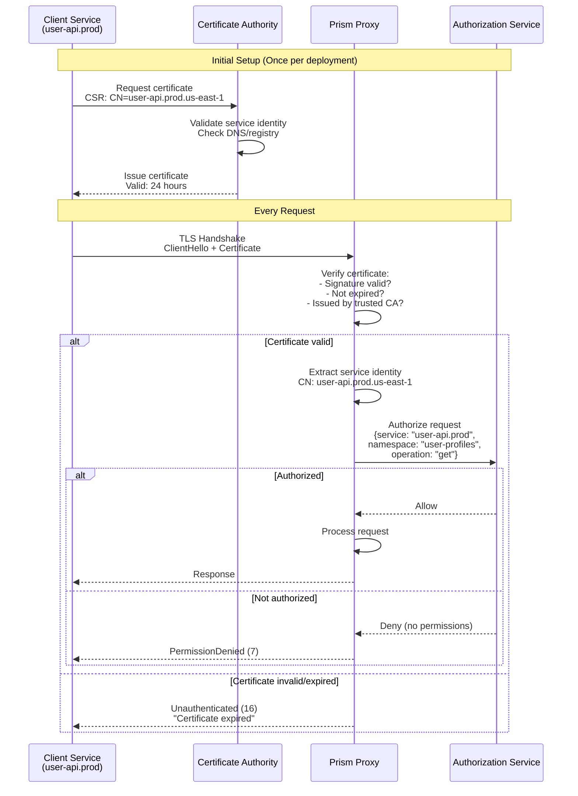
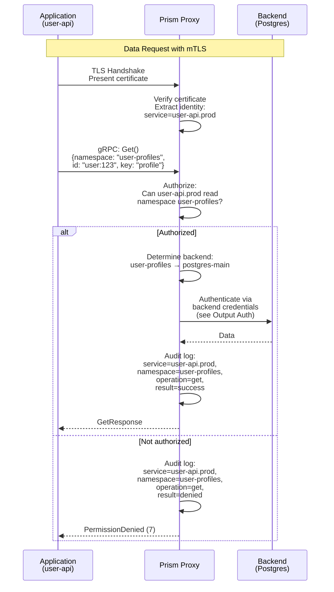

## Abstract

This RFC specifies the complete authentication model for Prism's data proxy, covering both **input authentication** (how clients authenticate to the proxy) and **output authentication** (how the proxy authenticates to backend data stores). The design emphasizes mTLS for service-to-service communication, certificate management, and secure backend connectivity.

## Motivation

The Prism data proxy sits between client applications and heterogeneous backends, requiring:

**Input Authentication (Client → Proxy):**
- Verify client service identity
- Prevent unauthorized access to data plane
- Support namespace-level access control
- Provide audit trail of data access

**Output Authentication (Proxy → Backend):**
- Authenticate proxy to backend services
- Manage credentials for multiple backend types
- Support credential rotation without downtime
- Isolate backend credentials from clients

**Goals:**
- Define mTLS-based client authentication
- Specify backend authentication patterns per backend type
- Document credential management and rotation
- Provide sequence diagrams for all authentication flows

**Non-Goals:**
- Admin API authentication (covered in RFC-010)
- Application user authentication (application responsibility)
- Data encryption at rest (backend responsibility)

## Architecture Overview

┌──────────────────────────────────────────────────────────────────┐
│                      Authentication Boundaries                   │
└──────────────────────────────────────────────────────────────────┘

Client Service → [mTLS] → Prism Proxy → [Backend Auth] → Backends
  (Input Auth)              (Identity)    (Output Auth)

Input:  mTLS certificates validate client identity
Output: Backend-specific credentials (mTLS, passwords, API keys)
```text

### Ports and Security Zones

┌─────────────────────────────────────────────────────────────────┐
│                        Security Zones                           │
└─────────────────────────────────────────────────────────────────┘

Zone 1: Client Services (Service Mesh)
  - mTLS enforced
  - Certificates issued by company CA
  - Short-lived (24 hours)

Zone 2: Prism Proxy (DMZ)
  - Accepts mTLS from clients
  - Holds backend credentials
  - Enforces namespace ACLs

Zone 3: Backend Services (Secure Network)
  - Postgres: mTLS or password
  - Kafka: SASL/SCRAM or mTLS
  - NATS: JWT or mTLS
  - Redis: ACL + password
```

## Input Authentication (Client → Proxy)

### mTLS Certificate-Based Authentication



### Certificate Structure

Client certificates must include:

```yaml
Subject:
  CN: user-api.prod.us-east-1        # Service name + env + region
  O: Company Name
  OU: Platform Services

Subject Alternative Names:
  - DNS: user-api.prod.us-east-1.internal
  - DNS: user-api.prod.svc.cluster.local
  - URI: spiffe://company.com/ns/prod/sa/user-api

Extensions:
  Key Usage: Digital Signature, Key Encipherment
  Extended Key Usage: Client Authentication
  Validity: 24 hours
```

### Rust Implementation

```rust
use rustls::{ServerConfig, ClientCertVerifier, Certificate};
use x509_parser::prelude::*;

pub struct PrismClientVerifier {
    ca_cert: Certificate,
}

impl ClientCertVerifier for PrismClientVerifier {
    fn verify_client_cert(
        &self,
        cert_chain: &[Certificate],
        _sni: Option<&str>,
    ) -> Result<ClientCertVerified, TLSError> {
        if cert_chain.is_empty() {
            return Err(TLSError::NoCertificatesPresented);
        }

        let client_cert = &cert_chain[0];

        // Verify signature chain
        self.verify_cert_chain(client_cert, &self.ca_cert)?;

        // Check expiry
        let (_, parsed) = X509Certificate::from_der(&client_cert.0)
            .map_err(|_| TLSError::InvalidCertificateData("Failed to parse".into()))?;

        if !parsed.validity().is_valid() {
            return Err(TLSError::InvalidCertificateData("Expired".into()));
        }

        Ok(ClientCertVerified::assertion())
    }
}

pub struct ServiceIdentity {
    pub service_name: String,
    pub environment: String,
    pub region: String,
}

impl ServiceIdentity {
    pub fn from_certificate(cert: &Certificate) -> Result<Self> {
        let (_, parsed) = X509Certificate::from_der(&cert.0)?;

        // Extract CN from subject
        let cn = parsed.subject()
            .iter_common_name()
            .next()
            .and_then(|cn| cn.as_str().ok())
            .ok_or(Error::MissingCommonName)?;

        // Parse: user-api.prod.us-east-1
        let parts: Vec<&str> = cn.split('.').collect();
        if parts.len() < 2 {
            return Err(Error::InvalidCommonName);
        }

        Ok(ServiceIdentity {
            service_name: parts[0].to_string(),
            environment: parts.get(1).unwrap_or(&"unknown").to_string(),
            region: parts.get(2).unwrap_or(&"unknown").to_string(),
        })
    }
}
```

### Request Flow with mTLS



### Certificate Rotation

```rust
use notify::{Watcher, RecursiveMode};

pub struct CertificateReloader {
    cert_path: PathBuf,
    key_path: PathBuf,
    server_config: Arc<RwLock<ServerConfig>>,
}

impl CertificateReloader {
    pub async fn watch(&self) -> Result<()> {
        let (tx, rx) = mpsc::channel();
        let mut watcher = notify::watcher(tx, Duration::from_secs(30))?;

        watcher.watch(&self.cert_path, RecursiveMode::NonRecursive)?;
        watcher.watch(&self.key_path, RecursiveMode::NonRecursive)?;

        loop {
            match rx.recv() {
                Ok(DebouncedEvent::Write(_) | DebouncedEvent::Create(_)) => {
                    tracing::info!("Certificate files changed, reloading...");

                    let new_config = self.load_server_config().await?;

                    let mut config = self.server_config.write().await;
                    *config = new_config;

                    tracing::info!("Certificate reloaded successfully");
                }
                _ => {}
            }
        }
    }
}
```

## Output Authentication (Proxy → Backend)

### Per-Backend Authentication Strategies

┌─────────────────────────────────────────────────────────────────┐
│                 Backend Authentication Matrix                   │
└─────────────────────────────────────────────────────────────────┘

Backend      | Primary Auth      | Fallback       | Credential Store
-------------|-------------------|----------------|------------------
Postgres     | mTLS              | Password       | Vault/K8s Secret
Kafka        | SASL/SCRAM        | mTLS           | Vault/K8s Secret
NATS         | JWT               | NKey           | Vault/K8s Secret
Redis        | ACL + Password    | None           | Vault/K8s Secret
SQLite       | File permissions  | None           | N/A (local)
S3           | IAM Role          | Access Keys    | Instance Profile
```text

### Postgres Authentication

```
sequenceDiagram
    participant Proxy as Prism Proxy
    participant Vault as HashiCorp Vault
    participant PG as PostgreSQL

    Note over Proxy,PG: Initial Connection

    Proxy->>Vault: Request credentials<br/>GET /v1/database/creds/postgres-main
    Vault->>Vault: Generate dynamic credentials<br/>User: prism-prod-abc123<br/>Password: <random><br/>TTL: 1 hour
    Vault->>PG: CREATE ROLE prism-prod-abc123<br/>WITH LOGIN PASSWORD '...'<br/>VALID UNTIL '2025-10-09 15:00'
    Vault-->>Proxy: {username, password, lease_id}

    Proxy->>Proxy: Cache credentials<br/>Set lease renewal timer

    Note over Proxy,PG: Data Operations

    Proxy->>PG: Connect<br/>SSL mode: require<br/>User: prism-prod-abc123<br/>Password: <from vault>
    PG->>PG: Verify credentials
    PG-->>Proxy: Connection established

    Proxy->>PG: SELECT * FROM user_profiles<br/>WHERE id = 'user:123'
    PG-->>Proxy: Row data

    Note over Proxy,PG: Credential Renewal

    loop Every 30 minutes
        Proxy->>Vault: Renew lease<br/>PUT /v1/sys/leases/renew<br/>{lease_id}
        Vault-->>Proxy: Lease extended
    end

    Note over Proxy,PG: Credential Expiry

    alt Lease expires
        Vault->>PG: REVOKE ROLE prism-prod-abc123
        Proxy->>Vault: Request new credentials
        Vault-->>Proxy: New {username, password}
        Proxy->>Proxy: Update connection pool
    end
```text

### Kafka Authentication (SASL/SCRAM)

```
sequenceDiagram
    participant Proxy as Prism Proxy
    participant Vault as HashiCorp Vault
    participant Kafka as Kafka Broker

    Note over Proxy,Kafka: Bootstrap

    Proxy->>Vault: GET /v1/kafka/creds/producer-main
    Vault->>Vault: Generate SCRAM credentials<br/>User: prism-kafka-xyz789<br/>Password: <scram-sha-512>
    Vault->>Kafka: kafka-configs --alter<br/>--entity-type users<br/>--entity-name prism-kafka-xyz789<br/>--add-config 'SCRAM-SHA-512=[...]'
    Vault-->>Proxy: {username, password, mechanism: SCRAM-SHA-512}

    Proxy->>Kafka: SASL Handshake<br/>Mechanism: SCRAM-SHA-512
    Kafka-->>Proxy: SASL Challenge

    Proxy->>Kafka: SASL Response<br/>{username, scrambled_password}
    Kafka->>Kafka: Verify SCRAM
    Kafka-->>Proxy: Authenticated

    Note over Proxy,Kafka: Produce Messages

    Proxy->>Kafka: ProduceRequest<br/>Topic: user-events
    Kafka->>Kafka: Check ACLs:<br/>Can prism-kafka-xyz789 write to topic?
    Kafka-->>Proxy: ProduceResponse
```text

### NATS Authentication (JWT)

```
sequenceDiagram
    participant Proxy as Prism Proxy
    participant Vault as HashiCorp Vault
    participant NATS as NATS Server

    Proxy->>Vault: GET /v1/nats/creds/publisher
    Vault->>Vault: Generate JWT + NKey<br/>Claims: {<br/>  pub: ["events.>"],<br/>  sub: ["responses.prism.>"]<br/>}
    Vault-->>Proxy: {jwt, seed (nkey)}

    Proxy->>NATS: CONNECT {<br/>  jwt: "eyJhbG...",<br/>  sig: sign(nonce, nkey)<br/>}
    NATS->>NATS: Verify JWT signature<br/>Check expiry<br/>Validate claims
    NATS-->>Proxy: +OK

    Proxy->>NATS: PUB events.user.login 42<br/>{user_id: "123", timestamp: ...}
    NATS->>NATS: Check permissions:<br/>Can JWT publish to events.user.login?
    NATS-->>Proxy: +OK
```text

### Redis Authentication (ACL)

```
sequenceDiagram
    participant Proxy as Prism Proxy
    participant Vault as HashiCorp Vault
    participant Redis as Redis Server

    Proxy->>Vault: GET /v1/redis/creds/cache-rw
    Vault->>Vault: Generate Redis ACL<br/>User: prism-cache-abc<br/>Password: <random><br/>ACL: ~cache:* +get +set +del
    Vault->>Redis: ACL SETUSER prism-cache-abc<br/>on >password ~cache:* +get +set +del
    Vault-->>Proxy: {username, password}

    Proxy->>Redis: AUTH prism-cache-abc <password>
    Redis->>Redis: Verify password<br/>Load ACL rules
    Redis-->>Proxy: OK

    Proxy->>Redis: GET cache:user:123:profile
    Redis->>Redis: Check ACL:<br/>Pattern match: cache:*<br/>Command allowed: GET
    Redis-->>Proxy: "{"name":"Alice",...}"

    Proxy->>Redis: SET cache:user:123:session <data>
    Redis-->>Proxy: OK
```text

### Credential Management

```
use vaultrs::client::VaultClient;
use vaultrs::kv2;

pub struct BackendCredentials {
    pub backend_type: String,
    pub username: String,
    pub password: String,
    pub lease_id: Option<String>,
    pub expires_at: DateTime<Utc>,
}

pub struct CredentialManager {
    vault_client: VaultClient,
    credentials: Arc<RwLock<HashMap<String, BackendCredentials>>>,
}

impl CredentialManager {
    pub async fn get_credentials(&self, backend_id: &str) -> Result<BackendCredentials> {
        // Check cache
        {
            let creds = self.credentials.read().await;
            if let Some(cached) = creds.get(backend_id) {
                if cached.expires_at > Utc::now() + Duration::minutes(5) {
                    return Ok(cached.clone());
                }
            }
        }

        // Fetch from Vault
        let path = format!("database/creds/{}", backend_id);
        let creds: VaultCredentials = self.vault_client
            .read(&path)
            .await?;

        let backend_creds = BackendCredentials {
            backend_type: creds.backend_type,
            username: creds.username,
            password: creds.password,
            lease_id: Some(creds.lease_id),
            expires_at: Utc::now() + Duration::hours(1),
        };

        // Update cache
        {
            let mut cache = self.credentials.write().await;
            cache.insert(backend_id.to_string(), backend_creds.clone());
        }

        // Schedule renewal
        self.schedule_renewal(backend_id, &creds.lease_id).await;

        Ok(backend_creds)
    }

    async fn schedule_renewal(&self, backend_id: &str, lease_id: &str) {
        let vault_client = self.vault_client.clone();
        let lease_id = lease_id.to_string();

        tokio::spawn(async move {
            loop {
                tokio::time::sleep(Duration::minutes(30)).await;

                match vault_client.renew_lease(&lease_id).await {
                    Ok(_) => {
                        tracing::info!(
                            backend_id = %backend_id,
                            lease_id = %lease_id,
                            "Renewed backend credentials"
                        );
                    }
                    Err(e) => {
                        tracing::error!(
                            backend_id = %backend_id,
                            error = %e,
                            "Failed to renew credentials, will fetch new ones"
                        );
                        break;
                    }
                }
            }
        });
    }
}
```text

## End-to-End Authentication Flow

```
sequenceDiagram
    participant App as Application
    participant Proxy as Prism Proxy
    participant Vault as Vault
    participant PG as Postgres
    participant Audit as Audit Log

    Note over App,Audit: Complete Request Flow

    App->>Proxy: mTLS Handshake<br/>Present client cert
    Proxy->>Proxy: Verify client cert<br/>Extract identity: user-api.prod

    App->>Proxy: Get(namespace="users", id="123", key="profile")

    Proxy->>Proxy: Authorize:<br/>user-api.prod → users namespace?

    alt Authorized
        Proxy->>Proxy: Lookup backend:<br/>users → postgres-main

        Proxy->>Proxy: Get credentials from cache

        alt Credentials expired/missing
            Proxy->>Vault: GET /database/creds/postgres-main
            Vault-->>Proxy: {username, password, lease_id}
            Proxy->>Proxy: Cache credentials
        end

        Proxy->>PG: Connect with credentials
        PG-->>Proxy: Connection OK

        Proxy->>PG: SELECT value FROM users<br/>WHERE id='123' AND key='profile'
        PG-->>Proxy: Row data

        Proxy->>Audit: Log:<br/>{service: user-api.prod,<br/> namespace: users,<br/> operation: get,<br/> backend: postgres-main,<br/> latency_ms: 2.3,<br/> result: success}

        Proxy-->>App: GetResponse{value}

    else Not authorized
        Proxy->>Audit: Log:<br/>{service: user-api.prod,<br/> namespace: users,<br/> operation: get,<br/> result: denied,<br/> reason: "no permissions"}

        Proxy-->>App: PermissionDenied (7)
    end
```text

## Secrets Provider Abstraction

To support multiple secret management services (Vault, AWS Secrets Manager, Google Secret Manager, Azure Key Vault), Prism implements a pluggable secrets provider architecture.

### Secrets Provider Interface

```
#[async_trait]
pub trait SecretsProvider: Send + Sync {
    /// Fetch credentials for a backend
    async fn get_credentials(&self, path: &str) -> Result<Credentials>;

    /// Renew a credential lease (if supported)
    async fn renew_credentials(&self, lease_id: &str) -> Result<()>;

    /// Check if provider supports dynamic credentials
    fn supports_dynamic_credentials(&self) -> bool;

    /// Get provider metadata
    fn provider_type(&self) -> &str;
}

pub struct Credentials {
    pub username: Option<String>,
    pub password: Option<String>,
    pub api_key: Option<String>,
    pub certificate: Option<String>,
    pub private_key: Option<String>,
    pub jwt_token: Option<String>,
    pub metadata: HashMap<String, String>,
    pub lease_id: Option<String>,
    pub expires_at: Option<DateTime<Utc>>,
}
```text

### Provider Implementations

#### HashiCorp Vault Provider

```
use vaultrs::client::VaultClient;

pub struct VaultProvider {
    client: VaultClient,
    namespace: Option<String>,
}

#[async_trait]
impl SecretsProvider for VaultProvider {
    async fn get_credentials(&self, path: &str) -> Result<Credentials> {
        let response: VaultCredResponse = self.client
            .read(path)
            .await?;

        Ok(Credentials {
            username: Some(response.data.username),
            password: Some(response.data.password),
            lease_id: Some(response.lease_id),
            expires_at: Some(Utc::now() + Duration::seconds(response.lease_duration)),
            metadata: response.metadata,
            ..Default::default()
        })
    }

    async fn renew_credentials(&self, lease_id: &str) -> Result<()> {
        self.client.renew_lease(lease_id).await?;
        Ok(())
    }

    fn supports_dynamic_credentials(&self) -> bool {
        true  // Vault supports dynamic credential generation
    }

    fn provider_type(&self) -> &str {
        "vault"
    }
}
```text

#### AWS Secrets Manager Provider

```
use aws_sdk_secretsmanager::Client as SecretsManagerClient;
use aws_sdk_secretsmanager::types::SecretString;

pub struct AwsSecretsProvider {
    client: SecretsManagerClient,
    region: String,
}

#[async_trait]
impl SecretsProvider for AwsSecretsProvider {
    async fn get_credentials(&self, path: &str) -> Result<Credentials> {
        // path format: "arn:aws:secretsmanager:region:account:secret:name"
        // or simple: "prism/postgres-main"
        let response = self.client
            .get_secret_value()
            .secret_id(path)
            .send()
            .await?;

        let secret_string = response.secret_string()
            .ok_or(Error::MissingSecretValue)?;

        // Parse JSON secret
        let secret_data: SecretData = serde_json::from_str(secret_string)?;

        Ok(Credentials {
            username: secret_data.username,
            password: secret_data.password,
            api_key: secret_data.api_key,
            expires_at: None,  // AWS Secrets Manager doesn't auto-expire
            metadata: secret_data.metadata.unwrap_or_default(),
            ..Default::default()
        })
    }

    async fn renew_credentials(&self, _lease_id: &str) -> Result<()> {
        // AWS Secrets Manager doesn't support dynamic credential renewal
        Ok(())
    }

    fn supports_dynamic_credentials(&self) -> bool {
        false  // Static secrets only
    }

    fn provider_type(&self) -> &str {
        "aws-secrets-manager"
    }
}

#[derive(Deserialize)]
struct SecretData {
    username: Option<String>,
    password: Option<String>,
    api_key: Option<String>,
    metadata: Option<HashMap<String, String>>,
}
```text

#### Google Secret Manager Provider

```
use google_secretmanager::v1::SecretManagerServiceClient;

pub struct GcpSecretsProvider {
    client: SecretManagerServiceClient,
    project_id: String,
}

#[async_trait]
impl SecretsProvider for GcpSecretsProvider {
    async fn get_credentials(&self, path: &str) -> Result<Credentials> {
        // path format: "projects/{project}/secrets/{secret}/versions/latest"
        // or simple: "prism-postgres-main" (auto-expanded)
        let name = if path.starts_with("projects/") {
            path.to_string()
        } else {
            format!("projects/{}/secrets/{}/versions/latest",
                self.project_id, path)
        };

        let response = self.client
            .access_secret_version(&name)
            .await?;

        let payload = response.payload
            .ok_or(Error::MissingPayload)?;

        let secret_string = String::from_utf8(payload.data)?;
        let secret_data: SecretData = serde_json::from_str(&secret_string)?;

        Ok(Credentials {
            username: secret_data.username,
            password: secret_data.password,
            api_key: secret_data.api_key,
            expires_at: None,
            metadata: secret_data.metadata.unwrap_or_default(),
            ..Default::default()
        })
    }

    async fn renew_credentials(&self, _lease_id: &str) -> Result<()> {
        // GCP Secret Manager doesn't support dynamic renewal
        Ok(())
    }

    fn supports_dynamic_credentials(&self) -> bool {
        false
    }

    fn provider_type(&self) -> &str {
        "gcp-secret-manager"
    }
}
```text

#### Azure Key Vault Provider

```
use azure_security_keyvault::KeyvaultClient;
use azure_identity::DefaultAzureCredential;

pub struct AzureKeyVaultProvider {
    client: KeyvaultClient,
    vault_url: String,
}

#[async_trait]
impl SecretsProvider for AzureKeyVaultProvider {
    async fn get_credentials(&self, path: &str) -> Result<Credentials> {
        // path format: "prism-postgres-main"
        let response = self.client
            .get_secret(&self.vault_url, path)
            .await?;

        let secret_value = response.value()
            .ok_or(Error::MissingSecretValue)?;

        let secret_data: SecretData = serde_json::from_str(secret_value)?;

        Ok(Credentials {
            username: secret_data.username,
            password: secret_data.password,
            api_key: secret_data.api_key,
            expires_at: response.attributes().expires_on(),
            metadata: secret_data.metadata.unwrap_or_default(),
            ..Default::default()
        })
    }

    async fn renew_credentials(&self, _lease_id: &str) -> Result<()> {
        // Azure Key Vault doesn't support dynamic renewal
        Ok(())
    }

    fn supports_dynamic_credentials(&self) -> bool {
        false
    }

    fn provider_type(&self) -> &str {
        "azure-keyvault"
    }
}
```text

### Provider Comparison

| Feature | Vault | AWS Secrets | GCP Secret | Azure Key Vault |
|---------|-------|-------------|------------|-----------------|
| **Dynamic Credentials** | ✅ Yes | ❌ No | ❌ No | ❌ No |
| **Auto-Rotation** | ✅ Yes (TTL) | ⚠️ Manual | ⚠️ Manual | ⚠️ Manual |
| **Versioning** | ✅ Yes | ✅ Yes | ✅ Yes | ✅ Yes |
| **Audit Logging** | ✅ Yes | ✅ CloudTrail | ✅ Cloud Audit | ✅ Monitor Logs |
| **IAM Integration** | ⚠️ Policies | ✅ Native IAM | ✅ Native IAM | ✅ Native RBAC |
| **Multi-Cloud** | ✅ Yes | ❌ AWS Only | ❌ GCP Only | ❌ Azure Only |
| **Self-Hosted** | ✅ Yes | ❌ No | ❌ No | ❌ No |
| **Cost** | Free (OSS) | $0.40/secret/month | $0.06/10k accesses | ~$0.03/10k ops |

### Provider Selection Strategy

```
pub enum ProviderConfig {
    Vault {
        address: String,
        token_path: String,
        namespace: Option<String>,
    },
    AwsSecretsManager {
        region: String,
        role_arn: Option<String>,
    },
    GcpSecretManager {
        project_id: String,
        service_account: Option<String>,
    },
    AzureKeyVault {
        vault_url: String,
        tenant_id: String,
        client_id: Option<String>,
    },
}

pub fn create_provider(config: &ProviderConfig) -> Result<Arc<dyn SecretsProvider>> {
    match config {
        ProviderConfig::Vault { address, token_path, namespace } => {
            let token = std::fs::read_to_string(token_path)?;
            let client = VaultClient::new(address, &token, namespace.as_deref())?;
            Ok(Arc::new(VaultProvider { client, namespace: namespace.clone() }))
        }
        ProviderConfig::AwsSecretsManager { region, role_arn } => {
            let aws_config = aws_config::from_env()
                .region(region)
                .load()
                .await;
            let client = SecretsManagerClient::new(&aws_config);
            Ok(Arc::new(AwsSecretsProvider { client, region: region.clone() }))
        }
        ProviderConfig::GcpSecretManager { project_id, service_account } => {
            let client = SecretManagerServiceClient::new().await?;
            Ok(Arc::new(GcpSecretsProvider { client, project_id: project_id.clone() }))
        }
        ProviderConfig::AzureKeyVault { vault_url, tenant_id, client_id } => {
            let credential = DefaultAzureCredential::new()?;
            let client = KeyvaultClient::new(vault_url, credential)?;
            Ok(Arc::new(AzureKeyVaultProvider { client, vault_url: vault_url.clone() }))
        }
    }
}
```text

### Credential Manager with Multiple Providers

```
pub struct CredentialManager {
    provider: Arc<dyn SecretsProvider>,
    credentials: Arc<RwLock<HashMap<String, BackendCredentials>>>,
    refresh_interval: Duration,
}

impl CredentialManager {
    pub fn new(provider: Arc<dyn SecretsProvider>) -> Self {
        Self {
            provider,
            credentials: Arc::new(RwLock::new(HashMap::new())),
            refresh_interval: Duration::minutes(30),
        }
    }

    pub async fn get_credentials(&self, backend_id: &str, path: &str) -> Result<BackendCredentials> {
        // Check cache
        {
            let cache = self.credentials.read().await;
            if let Some(cached) = cache.get(backend_id) {
                // For static providers, use longer cache TTL
                let cache_valid = if self.provider.supports_dynamic_credentials() {
                    cached.expires_at > Utc::now() + Duration::minutes(5)
                } else {
                    cached.expires_at > Utc::now()
                };

                if cache_valid {
                    return Ok(cached.clone());
                }
            }
        }

        // Fetch from provider
        let creds = self.provider.get_credentials(path).await?;

        let backend_creds = BackendCredentials {
            backend_type: backend_id.to_string(),
            username: creds.username.unwrap_or_default(),
            password: creds.password.unwrap_or_default(),
            api_key: creds.api_key,
            certificate: creds.certificate,
            lease_id: creds.lease_id.clone(),
            expires_at: creds.expires_at.unwrap_or_else(|| {
                // For static providers, cache for 24 hours
                Utc::now() + Duration::hours(24)
            }),
        };

        // Update cache
        {
            let mut cache = self.credentials.write().await;
            cache.insert(backend_id.to_string(), backend_creds.clone());
        }

        // Schedule renewal if provider supports dynamic credentials
        if self.provider.supports_dynamic_credentials() {
            if let Some(lease_id) = &creds.lease_id {
                self.schedule_renewal(backend_id, lease_id).await;
            }
        }

        Ok(backend_creds)
    }

    async fn schedule_renewal(&self, backend_id: &str, lease_id: &str) {
        let provider = self.provider.clone();
        let lease_id = lease_id.to_string();
        let backend_id = backend_id.to_string();
        let interval = self.refresh_interval;

        tokio::spawn(async move {
            loop {
                tokio::time::sleep(interval).await;

                match provider.renew_credentials(&lease_id).await {
                    Ok(_) => {
                        tracing::info!(
                            backend_id = %backend_id,
                            lease_id = %lease_id,
                            provider = %provider.provider_type(),
                            "Renewed backend credentials"
                        );
                    }
                    Err(e) => {
                        tracing::error!(
                            backend_id = %backend_id,
                            provider = %provider.provider_type(),
                            error = %e,
                            "Failed to renew credentials, will fetch new ones"
                        );
                        break;
                    }
                }
            }
        });
    }
}
```text

## Configuration

### Proxy Configuration with Secrets Providers

#### Option 1: HashiCorp Vault (Recommended for Dynamic Credentials)

```
# prism-proxy.yaml
data_port: 8980
admin_port: 8981

# Input Authentication
input_auth:
  type: mtls
  ca_cert: /etc/prism/certs/ca.crt
  server_cert: /etc/prism/certs/server.crt
  server_key: /etc/prism/certs/server.key
  client_cert_required: true
  verify_depth: 3

# Output Authentication with Vault
output_auth:
  credential_provider: vault
  vault:
    address: https://vault.internal:8200
    token_path: /var/run/secrets/vault-token
    namespace: prism-prod

backends:
  - name: postgres-main
    type: postgres
    auth:
      type: vault-dynamic
      path: database/creds/postgres-main
    connection:
      host: postgres.internal
      port: 5432
      database: users
      ssl_mode: require

  - name: kafka-events
    type: kafka
    auth:
      type: vault-dynamic
      path: kafka/creds/producer-main
    connection:
      brokers: [kafka-1:9092, kafka-2:9092, kafka-3:9092]
      security_protocol: SASL_SSL
      sasl_mechanism: SCRAM-SHA-512

  - name: nats-messages
    type: nats
    auth:
      type: vault-jwt
      path: nats/creds/publisher
    connection:
      servers: [nats://nats-1:4222, nats://nats-2:4222]
      tls_required: true
```text

#### Option 2: AWS Secrets Manager (AWS Native)

```
# prism-proxy.yaml
data_port: 8980
admin_port: 8981

# Input Authentication
input_auth:
  type: mtls
  ca_cert: /etc/prism/certs/ca.crt
  server_cert: /etc/prism/certs/server.crt
  server_key: /etc/prism/certs/server.key
  client_cert_required: true

# Output Authentication with AWS Secrets Manager
output_auth:
  credential_provider: aws-secrets-manager
  aws:
    region: us-east-1
    # Uses IAM role attached to EC2/ECS/EKS for authentication

backends:
  - name: postgres-main
    type: postgres
    auth:
      type: aws-secret
      # Can use ARN or friendly name
      path: arn:aws:secretsmanager:us-east-1:123456789012:secret:prism/postgres-main
      # Or: path: prism/postgres-main
    connection:
      host: postgres.internal
      port: 5432
      database: users
      ssl_mode: require

  - name: kafka-events
    type: kafka
    auth:
      type: aws-secret
      path: prism/kafka-producer
    connection:
      brokers: [kafka-1:9092, kafka-2:9092, kafka-3:9092]
      security_protocol: SASL_SSL
      sasl_mechanism: SCRAM-SHA-512
```text

**AWS Secrets Manager Secret Format** (JSON):
```
{
  "username": "prism-postgres-user",
  "password": "securepassword123",
  "metadata": {
    "backend_type": "postgres",
    "environment": "production"
  }
}
```text

#### Option 3: Google Secret Manager (GCP Native)

```
# prism-proxy.yaml
data_port: 8980
admin_port: 8981

# Input Authentication
input_auth:
  type: mtls
  ca_cert: /etc/prism/certs/ca.crt
  server_cert: /etc/prism/certs/server.crt
  server_key: /etc/prism/certs/server.key
  client_cert_required: true

# Output Authentication with Google Secret Manager
output_auth:
  credential_provider: gcp-secret-manager
  gcp:
    project_id: prism-production-123456
    # Uses Workload Identity or service account for authentication

backends:
  - name: postgres-main
    type: postgres
    auth:
      type: gcp-secret
      # Can use full path or friendly name
      path: projects/prism-production-123456/secrets/prism-postgres-main/versions/latest
      # Or: path: prism-postgres-main (auto-expanded)
    connection:
      host: postgres.internal
      port: 5432
      database: users
      ssl_mode: require

  - name: kafka-events
    type: kafka
    auth:
      type: gcp-secret
      path: prism-kafka-producer
    connection:
      brokers: [kafka-1:9092, kafka-2:9092, kafka-3:9092]
      security_protocol: SASL_SSL
      sasl_mechanism: SCRAM-SHA-512
```text

#### Option 4: Azure Key Vault (Azure Native)

```
# prism-proxy.yaml
data_port: 8980
admin_port: 8981

# Input Authentication
input_auth:
  type: mtls
  ca_cert: /etc/prism/certs/ca.crt
  server_cert: /etc/prism/certs/server.crt
  server_key: /etc/prism/certs/server.key
  client_cert_required: true

# Output Authentication with Azure Key Vault
output_auth:
  credential_provider: azure-keyvault
  azure:
    vault_url: https://prism-prod.vault.azure.net
    tenant_id: 12345678-1234-1234-1234-123456789012
    # Uses Managed Identity or Service Principal for authentication

backends:
  - name: postgres-main
    type: postgres
    auth:
      type: azure-secret
      path: prism-postgres-main
    connection:
      host: postgres.internal
      port: 5432
      database: users
      ssl_mode: require

  - name: kafka-events
    type: kafka
    auth:
      type: azure-secret
      path: prism-kafka-producer
    connection:
      brokers: [kafka-1:9092, kafka-2:9092, kafka-3:9092]
      security_protocol: SASL_SSL
      sasl_mechanism: SCRAM-SHA-512
```text

### Multi-Provider Deployment (Hybrid Cloud)

For hybrid cloud deployments, you can configure different providers per backend:

```
# prism-proxy.yaml
data_port: 8980
admin_port: 8981

# Input Authentication
input_auth:
  type: mtls
  ca_cert: /etc/prism/certs/ca.crt
  server_cert: /etc/prism/certs/server.crt
  server_key: /etc/prism/certs/server.key
  client_cert_required: true

# Output Authentication - Multiple Providers
output_auth:
  providers:
    # Vault for dynamic credentials (on-prem backends)
    - name: vault-onprem
      type: vault
      vault:
        address: https://vault.internal:8200
        token_path: /var/run/secrets/vault-token
        namespace: prism-prod

    # AWS Secrets for AWS backends
    - name: aws-prod
      type: aws-secrets-manager
      aws:
        region: us-east-1

    # GCP Secrets for GCP backends
    - name: gcp-prod
      type: gcp-secret-manager
      gcp:
        project_id: prism-production-123456

backends:
  # On-prem Postgres using Vault dynamic credentials
  - name: postgres-main
    type: postgres
    auth:
      provider: vault-onprem
      type: vault-dynamic
      path: database/creds/postgres-main
    connection:
      host: postgres.internal
      port: 5432
      database: users
      ssl_mode: require

  # AWS RDS using AWS Secrets Manager
  - name: rds-analytics
    type: postgres
    auth:
      provider: aws-prod
      type: aws-secret
      path: prism/rds-analytics
    connection:
      host: analytics.abc123.us-east-1.rds.amazonaws.com
      port: 5432
      database: analytics
      ssl_mode: require

  # GCP Cloud SQL using GCP Secret Manager
  - name: cloudsql-reports
    type: postgres
    auth:
      provider: gcp-prod
      type: gcp-secret
      path: prism-cloudsql-reports
    connection:
      host: /cloudsql/prism-prod:us-central1:reports
      port: 5432
      database: reports
      ssl_mode: require
```text

## Security Considerations

### Credential Isolation

Principle: Clients never see backend credentials

✓ Client presents certificate → Proxy validates
✓ Proxy fetches backend credentials → From Vault
✓ Proxy connects to backend → Using fetched credentials
✗ Client NEVER gets backend credentials
```

### Credential Rotation

Automatic rotation schedule:

1. Vault generates new credentials (TTL: 1 hour)
2. Proxy caches and renews every 30 minutes
3. On renewal failure, fetch new credentials
4. Gracefully drain old connections
5. Old credentials revoked by Vault after TTL
```text

### Audit Requirements

Every data access must log:
- Client service identity (from mTLS cert)
- Namespace accessed
- Operation performed (get, put, delete, scan)
- Backend used
- Success/failure
- Latency

## Testing

### Integration Tests

```
#[tokio::test]
async fn test_mtls_authentication() {
    let ca = generate_test_ca();
    let client_cert = ca.issue_cert("test-service.prod.us-east-1");

    let proxy = ProxyServer::new_test()
        .with_ca(ca.cert())
        .start()
        .await;

    let client = Client::new()
        .with_mtls(client_cert, client_key)
        .connect(proxy.address())
        .await
        .unwrap();

    // Should succeed with valid cert
    let resp = client.get("test-namespace", "key:123", "field").await;
    assert!(resp.is_ok());

    // Should fail with expired cert
    let expired_cert = ca.issue_cert_with_ttl("expired", Duration::seconds(-1));
    let bad_client = Client::new()
        .with_mtls(expired_cert, key)
        .connect(proxy.address())
        .await;

    assert!(bad_client.is_err());
}
```text

## Open Questions

1. **Certificate Authority**: Use company CA or service mesh (Linkerd/Istio)?
   - **Feedback**: Use Vault for certificate management and issuance
   - Vault PKI can act as an internal CA for mTLS certificates
   - Integrates with existing credential management workflow
   - Consider: Vault PKI vs external service mesh CA integration

2. **Credential Caching**: How long to cache backend credentials?
   - **Feedback**: Make it configurable, default to 24 hours
   - Cache duration should balance security (shorter = better) with Vault load (longer = fewer requests)
   - Consider per-backend configuration (e.g., high-security backends use shorter TTL)
   - Implement proactive renewal before expiry to avoid cache misses

3. **Connection Pooling**: Pool connections per backend or per credential?
   - **Feedback**: Pool per-credential to avoid leaking data between connections if using multi-tenancy pattern
   - Per-credential pooling provides isolation when multiple namespaces share a backend
   - Prevents credential contamination across tenants
   - Trade-off: More connection pools = higher resource usage
   - Consider: Connection pool size limits and monitoring

4. **Fallback Auth**: What to do when Vault is unavailable?
   - **Feedback**: Can we cache auth temporarily? What are the security risks and tradeoffs?
   - Options to explore:
     - Cache credentials beyond TTL during Vault outage (security risk: revocation won't work)
     - Fail closed (deny all requests) vs fail open (use cached credentials)
     - Emergency static credentials (break-glass scenario)
   - Security considerations:
     - Cached credentials can't be rotated during outage
     - Risk of using revoked credentials
     - Audit trail gaps if Vault unavailable
   - Recommended: Fail closed with configurable grace period for cached credentials
   - Document incident response procedure for Vault outage

5. **Observability**: How to monitor credential rotation and health?
   - **Feedback**: Use stats for credential events and general usage (no PII)
   - Report credential TTL in session establishment
   - Consider refresh tokens and how they fit
   - Metrics to expose:
     - `credential.fetch.count` - Number of credential fetches from Vault
     - `credential.renewal.count` - Successful/failed renewals
     - `credential.ttl.seconds` - Remaining TTL of cached credentials
     - `credential.cache.hit_rate` - Cache hit/miss ratio
     - `connection.pool.size` - Per-credential pool sizes
     - `session.establishment.duration` - Time to establish authenticated session
   - Logs (no PII):
     - Credential fetch/renewal events with backend ID and lease ID
     - Certificate rotation events
     - Authentication failures (client identity but not credentials)
   - Consider: Refresh token pattern for long-lived sessions to reduce Vault load

## References

- [mTLS in Microservices](https://www.cloudflare.com/learning/access-management/what-is-mutual-tls/)
- [HashiCorp Vault Dynamic Secrets](https://www.vaultproject.io/docs/secrets/databases)
- [Kafka SASL/SCRAM](https://kafka.apache.org/documentation/#security_sasl_scram)
- [NATS JWT Authentication](https://docs.nats.io/running-a-nats-service/configuration/securing_nats/auth_intro/jwt)
- ADR-007: Authentication and Authorization
- RFC-010: Admin Protocol with OIDC

## Revision History

- 2025-10-09: Initial draft with mTLS and backend authentication flows
- 2025-10-09: Expanded open questions with feedback on Vault CA, credential caching (24hr default), per-credential connection pooling, fallback auth strategies, and observability metrics
- 2025-10-09: Added secrets provider abstraction supporting HashiCorp Vault, AWS Secrets Manager, Google Secret Manager, and Azure Key Vault with pluggable architecture, provider comparison matrix, and multi-provider hybrid cloud deployment patterns

```