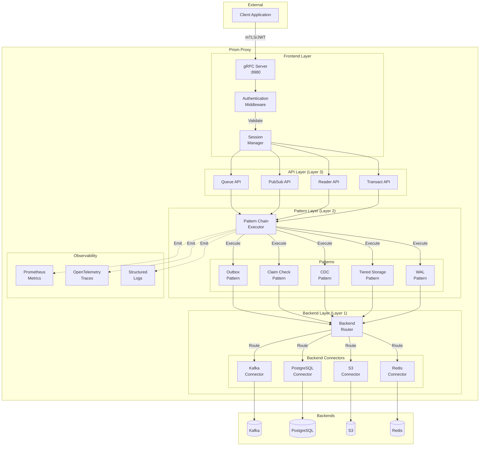
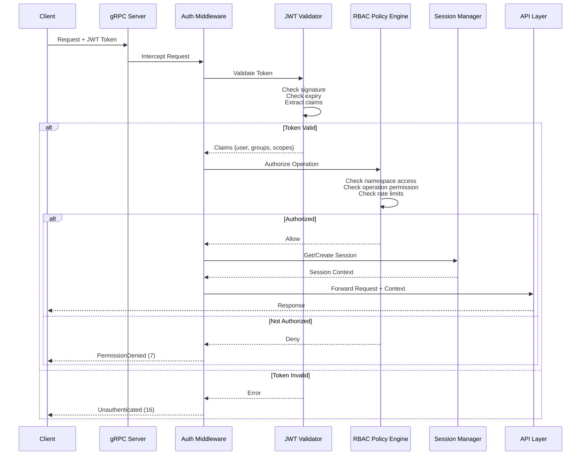
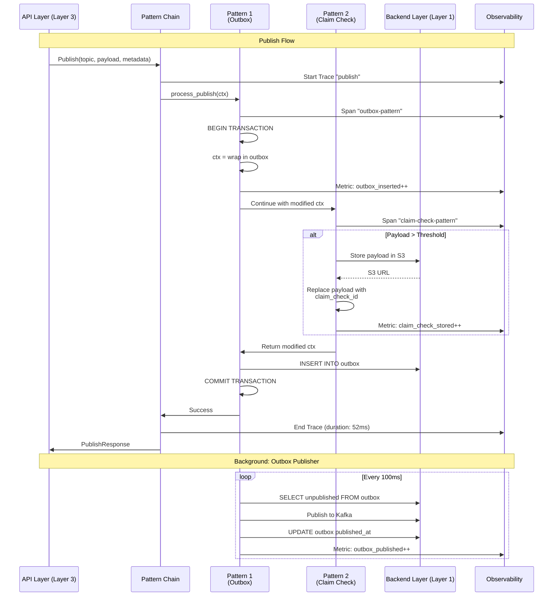
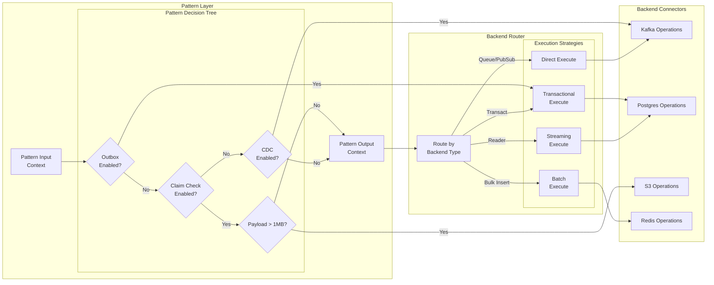
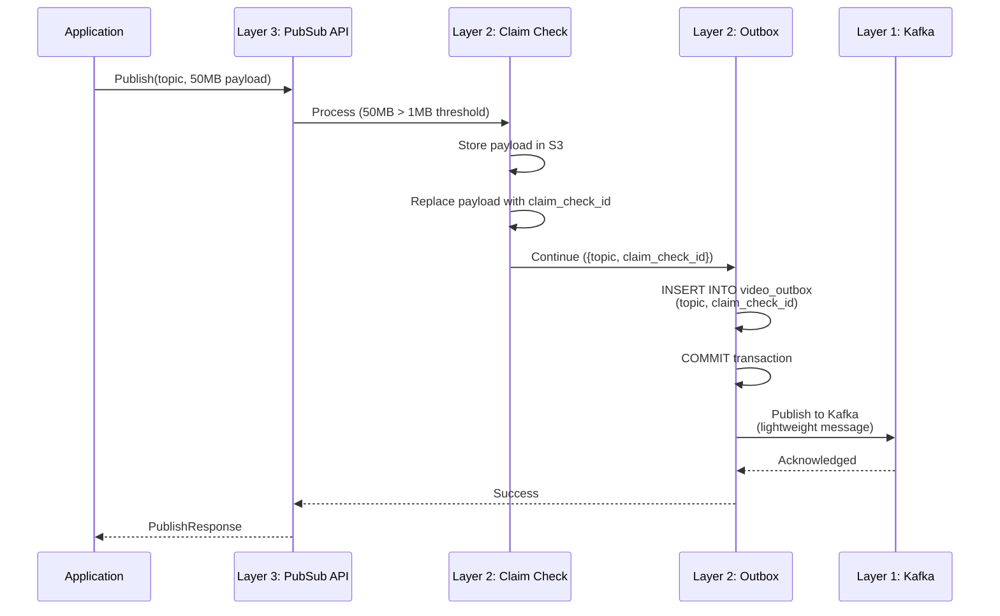
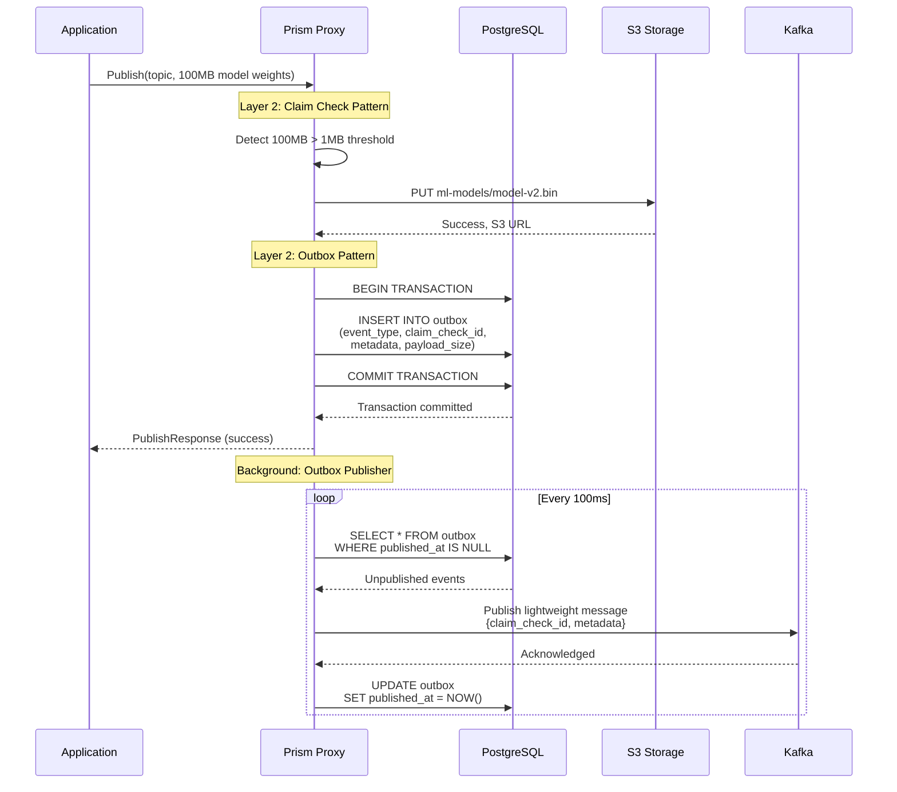

## Abstract

This RFC specifies how Prism separates the **client API** (data access patterns like Queue, PubSub, Reader) from the **backend implementation** (composed strategies for satisfying those APIs). By layering reliability patterns (Claim Check, Outbox, CDC, Tiered Storage) beneath client-facing interfaces, Prism enables powerful data access capabilities without exposing complexity to applications.

## Motivation

Modern distributed applications require complex reliability patterns, but implementing them correctly is difficult:

**Problems**:
- Applications must implement reliability logic (claim check, outbox, tiered storage) themselves
- Backend-specific logic leaks into application code
- Switching backends requires rewriting application logic
- Patterns (e.g., Claim Check + Pub/Sub) must be composed manually
- Testing reliability patterns requires complex infrastructure

**Solution**: Prism provides a **layered architecture** that separates concerns:

```
┌──────────────────────────────────────────────────────────┐
│         Layer 3: Client API (What)                       │
│  Queue | PubSub | Reader | Transact | Cache             │
│  "I want to publish messages to a queue"                 │
└──────────────────────────────────────────────────────────┘
                        │
                        ▼
┌──────────────────────────────────────────────────────────┐
│         Layer 2: Pattern Composition (How)               │
│  Claim Check | Outbox | CDC | Tiered Storage | WAL      │
│  "Automatically store large payloads in S3"              │
└──────────────────────────────────────────────────────────┘
                        │
                        ▼
┌──────────────────────────────────────────────────────────┐
│         Layer 1: Backend Execution (Where)               │
│  Kafka | NATS | Postgres | Redis | S3 | ClickHouse      │
│  "Connect to and execute operations on backend"          │
└──────────────────────────────────────────────────────────┘
```

**Goals:**
- Define clear separation between client API and backend strategies
- Document how to compose multiple patterns for a single API
- Provide configuration-based pattern selection
- Enable testing patterns independently
- Support backend migration without client changes

**Non-Goals:**
- Runtime pattern switching (patterns chosen at namespace creation)
- Arbitrary pattern composition (only compatible patterns can layer)
- Application-level customization of patterns (Prism controls implementation)

## Architecture Overview

### Proxy Internal Structure

The Prism proxy is structured to cleanly separate concerns across layers:



### Authentication and Authorization Flow



### Pattern Layer Execution Flow



### Pattern Routing and Backend Execution



### Three-Layer Model

#### Layer 3: Client API (Abstraction)

The **What** layer - defines the interface applications use:

```protobuf
// Example: PubSub Service
service PubSubService {
  rpc Publish(PublishRequest) returns (PublishResponse);
  rpc Subscribe(SubscribeRequest) returns (stream Event);
}

message PublishRequest {
  string topic = 1;
  bytes payload = 2;  // Application doesn't know about Claim Check
  map<string, string> metadata = 3;
}
```

**Key Characteristics:**
- Backend-agnostic (no Kafka/NATS specific details)
- Pattern-agnostic (no Claim Check/Outbox details)
- Stable API (evolves slowly)
- Type-safe via protobuf

#### Layer 2: Pattern Composition (Strategy)

The **How** layer - implements reliability patterns transparently:

```yaml
# Namespace configuration
namespaces:
  - name: video-processing
    # Layer 3: Client sees PubSub API
    client_api: pubsub

    # Layer 2: Composed patterns (order matters!)
    patterns:
      - type: claim-check        # Pattern 1: Handle large payloads
        threshold: 1MB
        storage: s3
        bucket: video-processing

      - type: outbox             # Pattern 2: Transactional guarantees
        table: video_outbox
        database: postgres

    # Layer 1: Backend execution
    backend:
      queue: kafka
      topic_prefix: video
```

**Pattern Execution Order:**



#### Layer 1: Backend Execution (Implementation)

The **Where** layer - connects to and executes on specific backends:

```rust
// Backend-specific implementation
impl KafkaBackend {
    async fn publish(&self, topic: &str, payload: &[u8]) -> Result<Offset> {
        self.producer
            .send(topic, payload, None)
            .await
            .map_err(|e| Error::Backend(e))
    }
}
```

**Key Characteristics:**
- Backend-specific logic encapsulated
- Connection pooling and retries
- Performance optimization per backend
- Pluggable (new backends without API changes)

## Pattern Composition

### Compatible Pattern Combinations

Not all patterns can be layered together. Compatibility depends on:
- **Ordering**: Some patterns must come before others
- **Data Flow**: Patterns must pass compatible data structures
- **Semantics**: Patterns can't contradict (e.g., eventual + strong consistency)

#### Composition Matrix

| Base API | Compatible Patterns (In Order) | Example Use Case |
|----------|-------------------------------|------------------|
| **PubSub** | Claim Check → Kafka/NATS | Large payload pub/sub |
| **PubSub** | Outbox → Claim Check → Kafka | Transactional large payloads |
| **Queue** | Claim Check → Kafka | Large message queue |
| **Queue** | WAL → Tiered Storage | Fast writes + archival |
| **Reader** | Cache (Look-Aside) → Postgres | Frequent reads |
| **Reader** | CDC → Cache Invalidation | Fresh cached reads |
| **Transact** | Outbox → Queue Publisher | Transactional messaging |
| **Transact** | Event Sourcing → Materialized Views | Audit + performance |

### Publisher with Claim Check Pattern

**Scenario**: Application needs to publish large video files (50MB-5GB) to a pub/sub system, but Kafka/NATS have 1-10MB message limits.

#### Without Layering (Application Code)

```python
# Application must implement Claim Check manually
def publish_video(video_id, video_bytes):
    if len(video_bytes) > 1_000_000:  # > 1MB
        # Upload to S3
        s3_key = f"videos/{video_id}"
        s3.put_object(Bucket="videos", Key=s3_key, Body=video_bytes)

        # Publish reference
        kafka.produce("videos", {
            "video_id": video_id,
            "s3_reference": s3_key,
            "size": len(video_bytes)
        })
    else:
        # Publish inline
        kafka.produce("videos", {
            "video_id": video_id,
            "payload": video_bytes
        })

# Consumer must implement Claim Check retrieval
def consume_video():
    msg = kafka.consume("videos")
    if "s3_reference" in msg:
        # Download from S3
        video_bytes = s3.get_object(
            Bucket="videos",
            Key=msg["s3_reference"]
        )["Body"].read()
    else:
        video_bytes = msg["payload"]

    process_video(video_bytes)
```

**Problems**:
- 20+ lines of boilerplate per producer/consumer
- Must handle S3 credentials, retries, errors
- No automatic cleanup of claim check objects
- Different logic for small vs large payloads

#### With Prism Layering (Zero Application Code)

**Configuration**:
```yaml
namespaces:
  - name: video-processing
    client_api: pubsub

    patterns:
      - type: claim-check
        threshold: 1MB
        storage:
          backend: s3
          bucket: prism-claim-checks
          prefix: videos/
        cleanup:
          strategy: on_consume
          ttl: 604800  # 7 days fallback

    backend:
      type: kafka
      brokers: [kafka-1:9092, kafka-2:9092]
      topic: videos
```

**Application Code**:
```python
# Producer: Prism handles Claim Check automatically
client.publish("videos", video_bytes)
# Prism:
# 1. Detects size > 1MB
# 2. Uploads to S3: s3://prism-claim-checks/videos/{uuid}
# 3. Publishes Kafka: {claim_check_id, size, metadata}

# Consumer: Prism reconstructs full payload
event = client.subscribe("videos")
video_bytes = event.payload  # Prism fetched from S3 automatically
process_video(video_bytes)
```

**Benefits**:
- 2 lines of application code (vs 20+)
- Automatic threshold detection
- Transparent S3 upload/download
- Automatic cleanup after consumption
- Same API for small and large payloads

### Outbox + Claim Check Layering

**Scenario**: Application needs **transactional guarantees** (outbox) AND **large payload handling** (claim check).

#### Pattern Layering



**Configuration**:
```yaml
namespaces:
  - name: ml-model-releases
    client_api: pubsub

    patterns:
      # Order matters: Outbox runs first (wraps everything in transaction)
      - type: outbox
        database: postgres
        table: ml_model_outbox
        publisher:
          interval: 100ms
          batch_size: 100

      # Claim Check runs second (inside outbox transaction)
      - type: claim-check
        threshold: 10MB
        storage:
          backend: s3
          bucket: ml-models
          prefix: releases/
        metadata_field: claim_check_id  # Store S3 reference in outbox

    backend:
      type: kafka
      topic: model-releases
```

**Guarantees**:
- ✅ If transaction commits, event WILL be published (outbox)
- ✅ If transaction fails, S3 object can be garbage collected
- ✅ Large models don't block database (claim check)
- ✅ Kafka receives lightweight messages (&lt;1KB)

### CDC + Cache Invalidation Layering

**Scenario**: Keep cache synchronized with database changes using CDC.

#### Pattern Composition

```yaml
namespaces:
  - name: user-profiles
    client_api: reader

    patterns:
      # Pattern 1: Look-Aside Cache (fast reads)
      - type: cache
        strategy: look-aside
        backend: redis
        ttl: 900  # 15 minutes
        key_pattern: "user:{id}:profile"

      # Pattern 2: CDC for cache invalidation
      - type: cdc
        source:
          backend: postgres
          database: users_db
          table: user_profiles
        sink:
          backend: kafka
          topic: user-profile-changes

        # Consumers: Cache invalidator
        consumers:
          - name: cache-invalidator
            type: cache_invalidator
            backend: redis
            operations: [UPDATE, DELETE]
            key_extractor: "user:{after.id}:profile"

    backend:
      type: postgres
      database: users_db
```

**Data Flow**:

```mermaid
graph LR
    App[Application]
    Prism[Prism Proxy]
    Cache[Redis Cache]
    DB[(PostgreSQL)]
    CDC[CDC Connector]
    Kafka[Kafka]
    Invalidator[Cache Invalidator]

    App -->|Read user profile| Prism

    Prism -->|1. Check cache| Cache
    Cache -.->|Cache Hit| Prism

    Prism -->|2. Query DB<br/>(on miss)| DB
    DB -.->|User data| Prism
    Prism -.->|3. Populate cache| Cache

    App2[Another App] -->|Update profile| DB
    DB -->|WAL stream| CDC
    CDC -->|Parse changes| Kafka
    Kafka -->|Subscribe| Invalidator
    Invalidator -->|DEL user:123:profile| Cache
```

**Benefits**:
- Applications always read from cache (fast)
- Cache stays synchronized with database
- No dual writes or race conditions
- Automatic invalidation on UPDATE/DELETE

## Separation of Concerns

### Client API vs Backend Strategy

#### Example: Queue Service

**Client API (Layer 3)** - Stable interface:
```protobuf
service QueueService {
  rpc Publish(PublishRequest) returns (PublishResponse);
  rpc Subscribe(SubscribeRequest) returns (stream Message);
}
```

**Backend Strategy (Layer 2 + 1)** - Implementation details:

| Strategy Combination | Backends | Use Case |
|---------------------|----------|----------|
| Queue (simple) | Kafka | Standard message queue |
| WAL + Queue | Kafka WAL → Postgres | Durable + queryable queue |
| Claim Check + Queue | S3 + Kafka | Large message queue |
| Outbox + Queue | Postgres outbox → Kafka | Transactional queue |
| Tiered Queue | Redis (hot) → Postgres (warm) → S3 (cold) | Multi-tier retention |

**Application doesn't know which strategy** - same API for all:
```python
# Works with ANY backend strategy
client.publish("events", payload)
messages = client.subscribe("events")
```

### Pattern Configuration Encapsulation

Applications declare requirements; Prism selects patterns:

```yaml
# Application-facing configuration
namespaces:
  - name: video-processing
    requirements:
      message_size: 5GB              # Prism adds Claim Check
      consistency: strong            # Prism adds Outbox
      retention: 30 days             # Prism adds Tiered Storage
      throughput: 10k msgs/s         # Prism sizes Kafka partitions

# Prism generates internal config:
namespaces:
  - name: video-processing
    client_api: pubsub
    patterns:
      - type: outbox              # For consistency
      - type: claim-check         # For message_size
      - type: tiered-storage      # For retention
    backend:
      type: kafka
      partitions: 20              # For throughput
```

## Stitching Patterns Together

### Pattern Interfaces

Each pattern implements standard interfaces for composability:

```rust
/// Pattern trait for composing reliability patterns
#[async_trait]
pub trait Pattern: Send + Sync {
    /// Process outgoing data (before backend)
    async fn process_publish(
        &self,
        ctx: &mut PublishContext,
    ) -> Result<()>;

    /// Process incoming data (after backend)
    async fn process_consume(
        &self,
        ctx: &mut ConsumeContext,
    ) -> Result<()>;

    /// Pattern metadata
    fn metadata(&self) -> PatternMetadata;
}

pub struct PublishContext {
    pub topic: String,
    pub payload: Vec<u8>,
    pub metadata: HashMap<String, String>,
    pub backend: BackendType,
}

pub struct ConsumeContext {
    pub message_id: String,
    pub payload: Vec<u8>,
    pub metadata: HashMap<String, String>,
}
```

### Example: Claim Check Pattern Implementation

```rust
pub struct ClaimCheckPattern {
    threshold: usize,
    storage: Arc<dyn ObjectStorage>,
}

#[async_trait]
impl Pattern for ClaimCheckPattern {
    async fn process_publish(&self, ctx: &mut PublishContext) -> Result<()> {
        // Check threshold
        if ctx.payload.len() > self.threshold {
            // Store in object storage
            let claim_check_id = Uuid::new_v4().to_string();
            let key = format!("claim-checks/{}", claim_check_id);

            self.storage.put(&key, &ctx.payload).await?;

            // Replace payload with reference
            ctx.metadata.insert("claim_check_id".to_string(), claim_check_id);
            ctx.metadata.insert("payload_size".to_string(), ctx.payload.len().to_string());
            ctx.payload = vec![];  // Empty payload, reference in metadata
        }

        Ok(())
    }

    async fn process_consume(&self, ctx: &mut ConsumeContext) -> Result<()> {
        // Check for claim check reference
        if let Some(claim_check_id) = ctx.metadata.get("claim_check_id") {
            let key = format!("claim-checks/{}", claim_check_id);

            // Fetch from object storage
            ctx.payload = self.storage.get(&key).await?;

            // Optional: Delete claim check after consumption
            // self.storage.delete(&key).await?;
        }

        Ok(())
    }

    fn metadata(&self) -> PatternMetadata {
        PatternMetadata {
            name: "claim-check".to_string(),
            version: "1.0.0".to_string(),
            compatible_backends: vec![BackendType::Kafka, BackendType::Nats],
        }
    }
}
```

### Pattern Chain Execution

Prism executes patterns in order:

```rust
pub struct PatternChain {
    patterns: Vec<Box<dyn Pattern>>,
}

impl PatternChain {
    pub async fn process_publish(&self, mut ctx: PublishContext) -> Result<PublishContext> {
        // Execute patterns in order
        for pattern in &self.patterns {
            pattern.process_publish(&mut ctx).await?;
        }
        Ok(ctx)
    }

    pub async fn process_consume(&self, mut ctx: ConsumeContext) -> Result<ConsumeContext> {
        // Execute patterns in reverse order for consume
        for pattern in self.patterns.iter().rev() {
            pattern.process_consume(&mut ctx).await?;
        }
        Ok(ctx)
    }
}
```

**Example execution with Outbox + Claim Check**:

```
Publish Flow:
  App → [Layer 3: PubSub API]
    → [Layer 2: Outbox Pattern] (begin transaction)
      → [Layer 2: Claim Check Pattern] (store large payload)
        → [Layer 1: Kafka Backend] (publish lightweight message)
      ← (commit transaction)
    ← (return success)
  ← PublishResponse

Consume Flow:
  [Layer 1: Kafka Backend] (receive message)
    → [Layer 2: Claim Check Pattern] (fetch from S3)
      → [Layer 2: Outbox Pattern] (no-op for consume)
        → [Layer 3: PubSub API]
          → App (full payload reconstructed)
```

## Building on Existing RFCs

This RFC builds on and connects:

### RFC-001: Prism Architecture
- **Layer 3 Client API** maps to RFC-001 "Interface Layers" (Queue, PubSub, Reader, Transact)
- **Layer 1 Backend Execution** maps to RFC-001 "Container Plugin Model"
- **Layer 2 Pattern Composition** is NEW - enables powerful combinations

### RFC-002: Data Layer Interface
- Client-facing protobuf APIs defined in RFC-002
- Applications use stable APIs from RFC-002
- Patterns (Layer 2) transparently implement RFC-002 interfaces

### RFC-007: Cache Strategies
- Look-Aside and Write-Through caching are **patterns** (Layer 2)
- Can compose with other patterns (e.g., CDC + Cache Invalidation)
- Cache configuration moves from application to namespace config

### RFC-009: Distributed Reliability Patterns
- All 7 patterns (Claim Check, Outbox, WAL, CDC, Tiered Storage, Event Sourcing, CQRS) live in Layer 2
- Can be composed as shown in RFC-009 "Pattern Composition and Layering" section
- This RFC formalizes the layering architecture

### RFC-010: Admin Protocol with OIDC
- Admin API operates at Layer 3 (control plane, not data plane)
- Patterns configured via admin API
- Observability of pattern health exposed via admin API

### RFC-011: Data Proxy Authentication
- Authentication happens at Layer 3 (before patterns)
- Patterns inherit session context
- Backend credentials managed at Layer 1

## Configuration Schema

### Namespace Pattern Configuration

```yaml
namespaces:
  - name: video-processing

    # Layer 3: Client API
    client_api: pubsub

    # Layer 2: Pattern composition (ordered!)
    patterns:
      - type: outbox
        enabled: true
        config:
          database: postgres
          table: video_outbox
          publisher:
            interval: 100ms
            batch_size: 100

      - type: claim-check
        enabled: true
        config:
          threshold: 1MB
          storage:
            backend: s3
            bucket: prism-claim-checks
            prefix: videos/
          compression: gzip
          cleanup:
            strategy: on_consume
            ttl: 604800

      - type: tiered-storage
        enabled: false  # Optional pattern

    # Layer 1: Backend configuration
    backend:
      type: kafka
      brokers: [kafka-1:9092, kafka-2:9092]
      topic: videos
      partitions: 10
      replication: 3

    # Observability
    observability:
      trace_patterns: true  # Trace each pattern execution
      pattern_metrics: true
```

### Pattern Validation

Prism validates pattern compatibility at namespace creation:

```rust
pub fn validate_pattern_chain(
    api: ClientApi,
    patterns: &[PatternConfig],
    backend: &BackendConfig,
) -> Result<()> {
    // Check API compatibility
    for pattern in patterns {
        if !pattern.supports_api(&api) {
            return Err(Error::IncompatiblePattern {
                pattern: pattern.type_name(),
                api: api.name(),
            });
        }
    }

    // Check pattern ordering
    for window in patterns.windows(2) {
        if !window[1].compatible_with(&window[0]) {
            return Err(Error::IncompatiblePatternOrder {
                first: window[0].type_name(),
                second: window[1].type_name(),
            });
        }
    }

    // Check backend compatibility
    if !backend.supports_patterns(patterns) {
        return Err(Error::BackendIncompatibleWithPatterns);
    }

    Ok(())
}
```

## Testing Strategy

### Unit Tests: Individual Patterns

```rust
#[tokio::test]
async fn test_claim_check_pattern_threshold() {
    let storage = Arc::new(MockObjectStorage::new());
    let pattern = ClaimCheckPattern {
        threshold: 1_000_000,  // 1MB
        storage: storage.clone(),
    };

    // Small payload - should not trigger claim check
    let mut ctx = PublishContext {
        topic: "test".to_string(),
        payload: vec![0u8; 500_000],  // 500KB
        ..Default::default()
    };

    pattern.process_publish(&mut ctx).await.unwrap();
    assert!(!ctx.metadata.contains_key("claim_check_id"));
    assert_eq!(ctx.payload.len(), 500_000);

    // Large payload - should trigger claim check
    let mut ctx = PublishContext {
        topic: "test".to_string(),
        payload: vec![0u8; 2_000_000],  // 2MB
        ..Default::default()
    };

    pattern.process_publish(&mut ctx).await.unwrap();
    assert!(ctx.metadata.contains_key("claim_check_id"));
    assert_eq!(ctx.payload.len(), 0);  // Payload replaced
    assert_eq!(storage.object_count(), 1);
}
```

### Integration Tests: Pattern Chains

```rust
#[tokio::test]
async fn test_outbox_claim_check_chain() {
    let db = setup_test_db().await;
    let s3 = setup_test_s3().await;
    let kafka = setup_test_kafka().await;

    let chain = PatternChain::new(vec![
        Box::new(OutboxPattern::new(db.clone())),
        Box::new(ClaimCheckPattern::new(1_000_000, s3.clone())),
    ]);

    // Publish large payload
    let ctx = PublishContext {
        topic: "test".to_string(),
        payload: vec![0u8; 5_000_000],  // 5MB
        ..Default::default()
    };

    let ctx = chain.process_publish(ctx).await.unwrap();

    // Verify outbox entry created
    let outbox_entries = db.query("SELECT * FROM outbox WHERE published_at IS NULL").await.unwrap();
    assert_eq!(outbox_entries.len(), 1);

    // Verify S3 object stored
    assert_eq!(s3.object_count(), 1);

    // Verify Kafka message is lightweight
    assert!(ctx.metadata.contains_key("claim_check_id"));
    assert_eq!(ctx.payload.len(), 0);
}
```

### End-to-End Tests

```python
def test_e2e_large_payload_pubsub():
    # Setup Prism with Outbox + Claim Check
    prism = PrismTestServer(config={
        "namespace": "test",
        "client_api": "pubsub",
        "patterns": [
            {"type": "outbox", "database": "postgres"},
            {"type": "claim-check", "threshold": "1MB", "storage": "s3"}
        ],
        "backend": {"type": "kafka"}
    })

    client = prism.client()

    # Publish 10MB payload
    large_payload = b"x" * 10_000_000
    response = client.publish("test-topic", large_payload)
    assert response.success

    # Consume and verify full payload reconstructed
    subscriber = client.subscribe("test-topic")
    event = next(subscriber)
    assert event.payload == large_payload

    # Verify S3 object cleaned up after consumption
    assert prism.s3.object_count() == 0
```

## Performance Characteristics

### Pattern Overhead

| Pattern | Latency Added | Memory Overhead | Use When |
|---------|---------------|-----------------|----------|
| **None** | 0ms | 0MB | Simple use cases |
| **Claim Check** | +10-50ms (S3 upload) | ~10MB (buffer) | Payload > 1MB |
| **Outbox** | +5-10ms (DB write) | ~1MB (buffer) | Need transactions |
| **CDC** | Background | ~5MB (replication) | Keep systems synced |
| **Tiered Storage** | Variable | ~10MB (tier metadata) | Hot/warm/cold data |
| **WAL** | +2-5ms (log append) | ~50MB (WAL buffer) | High write throughput |

### Example: Outbox + Claim Check Performance

**Baseline (no patterns)**: 10ms P99 latency, 10k RPS

**With Outbox + Claim Check**:
- Small payloads (&lt;1MB): 15ms P99 (+5ms for outbox), 8k RPS
- Large payloads (&gt;1MB): 60ms P99 (+50ms for S3 upload), 1k RPS

**Trade-off**: Slightly higher latency for **strong guarantees** (transactional + large payload support).

## Migration Strategy

### Phase 1: Single Pattern (Low Risk)

Start with one pattern per namespace:

```yaml
# Before: Direct Kafka
backend: kafka

# After: Add Claim Check only
patterns:
  - type: claim-check
    threshold: 1MB
backend: kafka
```

### Phase 2: Compose Two Patterns (Medium Risk)

Add second compatible pattern:

```yaml
patterns:
  - type: outbox         # Transactional guarantees
  - type: claim-check    # Large payload handling
backend: kafka
```

### Phase 3: Complex Composition (Higher Risk)

Layer 3+ patterns for advanced use cases:

```yaml
patterns:
  - type: outbox
  - type: claim-check
  - type: tiered-storage  # Archive old messages to S3
  - type: cdc             # Replicate to analytics DB
backend: kafka
```

## Observability

### Pattern Metrics

```
# Claim Check
prism_pattern_claim_check_stored_total{namespace="videos"} 1234
prism_pattern_claim_check_retrieved_total{namespace="videos"} 1230
prism_pattern_claim_check_storage_bytes{namespace="videos"} 5.2e9
prism_pattern_claim_check_cleanup_success{namespace="videos"} 1230

# Outbox
prism_pattern_outbox_inserted_total{namespace="videos"} 1234
prism_pattern_outbox_published_total{namespace="videos"} 1234
prism_pattern_outbox_lag_seconds{namespace="videos"} 0.15
prism_pattern_outbox_pending_count{namespace="videos"} 5

# Pattern Chain
prism_pattern_chain_duration_seconds{namespace="videos", pattern="claim-check"} 0.042
prism_pattern_chain_duration_seconds{namespace="videos", pattern="outbox"} 0.008
```

### Distributed Tracing

```
Trace: Publish large video
├─ Span: PubSubService.Publish [12ms]
│  ├─ Span: OutboxPattern.process_publish [8ms]
│  │  ├─ Span: db.begin_transaction [1ms]
│  │  ├─ Span: ClaimCheckPattern.process_publish [45ms]
│  │  │  ├─ Span: s3.put_object [42ms]
│  │  │  └─ Span: generate_claim_check_id [0.1ms]
│  │  ├─ Span: db.insert_outbox [2ms]
│  │  └─ Span: db.commit_transaction [1ms]
│  └─ Span: kafka.produce [3ms]
```

## References

### Related RFCs
- RFC-001: Prism Architecture - Defines interface layers
- RFC-002: Data Layer Interface - Client API specifications
- RFC-007: Cache Strategies - Cache as a pattern
- RFC-009: Distributed Reliability Patterns - Individual patterns
- RFC-010: Admin Protocol with OIDC - Pattern configuration
- RFC-011: Data Proxy Authentication - Authentication layer

### External References
- [Enterprise Integration Patterns](https://www.enterpriseintegrationpatterns.com/)
- [Claim Check Pattern](https://www.enterpriseintegrationpatterns.com/patterns/messaging/StoreInLibrary.html)
- [Transactional Outbox](https://microservices.io/patterns/data/transactional-outbox.html)
- [Decorator Pattern](https://en.wikipedia.org/wiki/Decorator_pattern) - Inspiration for pattern composition

### ADRs
- ADR-024: Layered Interface Hierarchy
- ADR-025: Container Plugin Model
- ADR-034: Product/Feature Sharding Strategy

## Open Questions

1. **Pattern Hot-Reload**: Can patterns be added/removed without restarting proxy?
2. **Pattern Configuration Evolution**: How to update pattern config for existing namespaces?
3. **Pattern Performance Profiling**: Which patterns add most latency in production?
4. **Custom Patterns**: Can users define custom patterns via plugins?
5. **Pattern Versioning**: How to version patterns independently of proxy?

## Revision History

- 2025-10-09: Initial draft defining layered data access patterns, pattern composition, and separation of client API from backend strategies
