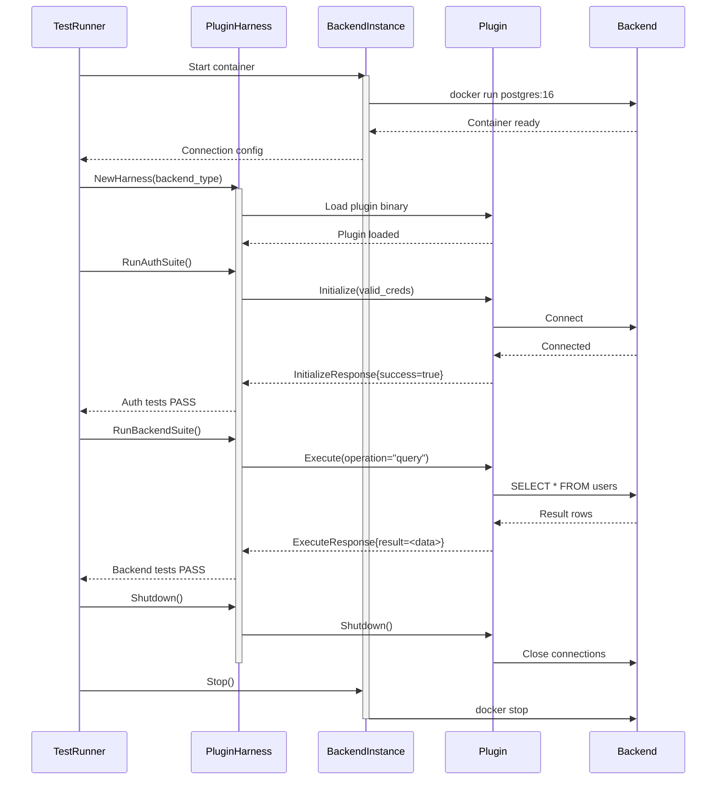

# RFC-015: Plugin Acceptance Test Framework (Go Implementation)

**Status**: Draft
**Author**: System
**Created**: 2025-10-09
**Updated**: 2025-10-09

## Abstract

This RFC defines a comprehensive **acceptance test framework** for Prism backend plugins implemented in Go. The framework provides:

1. **Reusable Authentication Test Suite**: Verify all plugins handle credentials, authentication failures, and credential rotation consistently
2. **Per-Backend Verification Tests**: Test each plugin implementation against real backend instances (PostgreSQL, Kafka, Redis, etc.)
3. **Test Harness with testcontainers**: Automatically spin up real backend instances for integration testing
4. **CI/CD Integration**: Automated testing on every commit with version matrix support

The framework ensures **cross-plugin consistency** (all plugins handle common concerns identically) and **per-backend correctness** (each plugin correctly implements its specific protocol).

## Motivation

### Problem Statement

Backend plugins are critical infrastructure components that must:
- Correctly implement backend-specific wire protocols
- Handle authentication consistently across all backends
- Gracefully handle connection failures and credential rotation
- Maintain backward compatibility across versions
- Work correctly with multiple backend versions

**Without a comprehensive acceptance test framework**, we risk:
- Inconsistent authentication behavior across plugins
- Protocol implementation bugs discovered in production
- Breaking changes introduced during refactoring
- Compatibility issues with new backend versions

### Goals

1. **Consistent Authentication**: All plugins handle auth identically
2. **Real Backend Testing**: Test against actual instances, not mocks
3. **Version Matrix**: Verify compatibility with multiple backend versions
4. **CI/CD Ready**: Automated testing on every commit
5. **Reusable Test Suites**: Share test code across all plugin implementations
6. **Fast Feedback**: Tests complete in &lt;5 minutes per backend
7. **Documentation**: Tests serve as examples for plugin developers

### Non-Goals

- **Not load testing**: Performance benchmarks are separate (see RFC-009)
- **Not end-to-end testing**: Focus on plugin-backend interaction only
- **Not chaos testing**: Reliability testing covered separately

## Architecture Overview

### Test Framework Components

Plugin Acceptance Test Framework
├── Test Harness (harness/)
│   ├── plugin_harness.go         # Plugin lifecycle management
│   ├── backend_manager.go        # testcontainers integration
│   └── test_runner.go            # Test execution engine
│
├── Reusable Test Suites (suites/)
│   ├── auth_suite.go             # Authentication tests (ALL plugins)
│   ├── lifecycle_suite.go        # Initialize/Health/Shutdown tests
│   └── common_suite.go           # Common operation patterns
│
├── Backend Verification (verification/)
│   ├── postgres/
│   │   ├── postgres_suite.go     # PostgreSQL-specific tests
│   │   └── fixtures.go           # Test data
│   ├── kafka/
│   │   ├── kafka_suite.go        # Kafka-specific tests
│   │   └── fixtures.go
│   ├── redis/
│   │   ├── redis_suite.go        # Redis-specific tests
│   │   └── fixtures.go
│   └── ...
│
└── Backend Instances (instances/)
    ├── postgres_instance.go      # PostgreSQL testcontainer
    ├── kafka_instance.go         # Kafka testcontainer
    ├── redis_instance.go         # Redis testcontainer
    └── backend_interface.go      # Common interface
```

### Test Execution Flow



## Reusable Authentication Test Suite

### Overview

The **Authentication Test Suite** verifies that all plugins handle credential passing, authentication failures, and credential rotation identically. This suite runs against **every plugin** to ensure consistent behavior.

### Implementation

```go
// tests/acceptance/suites/auth_suite.go

package suites

import (
	"context"
	"testing"
	"time"

	"github.com/prism/plugin-core/proto"
	"github.com/prism/tests/acceptance/harness"
	"github.com/stretchr/testify/assert"
	"github.com/stretchr/testify/require"
)

// AuthTestSuite provides reusable authentication tests for all plugins
type AuthTestSuite struct {
	harness *harness.PluginHarness
	t       *testing.T
}

// NewAuthTestSuite creates a new authentication test suite
func NewAuthTestSuite(t *testing.T, h *harness.PluginHarness) *AuthTestSuite {
	return &AuthTestSuite{
		harness: h,
		t:       t,
	}
}

// Run executes all authentication tests
func (s *AuthTestSuite) Run() {
	s.t.Run("ValidCredentials", s.TestValidCredentials)
	s.t.Run("InvalidCredentials", s.TestInvalidCredentials)
	s.t.Run("MissingCredentials", s.TestMissingCredentials)
	s.t.Run("EmptyCredentials", s.TestEmptyCredentials)
	s.t.Run("CredentialRotation", s.TestCredentialRotation)
	s.t.Run("ConnectionPoolAuth", s.TestConnectionPoolAuth)
	s.t.Run("ExpiredCredentials", s.TestExpiredCredentials)
}

// TestValidCredentials verifies plugin initializes successfully with valid credentials
func (s *AuthTestSuite) TestValidCredentials() {
	ctx := context.Background()

	// Get valid credentials from test backend
	creds := s.harness.Backend.ValidCredentials()

	// Initialize plugin with valid credentials
	req := &proto.InitializeRequest{
		Namespace:   "test-auth-valid",
		BackendType: s.harness.BackendType,
		Config:      s.harness.Backend.DefaultConfig(),
		Credentials: creds,
	}

	resp, err := s.harness.Plugin.Initialize(ctx, req)
	require.NoError(s.t, err, "Plugin should initialize successfully with valid credentials")
	assert.True(s.t, resp.Success, "InitializeResponse.Success should be true")
	assert.Empty(s.t, resp.Error, "InitializeResponse.Error should be empty")

	// Verify plugin is operational
	healthResp, err := s.harness.Plugin.HealthCheck(ctx, &proto.HealthCheckRequest{})
	require.NoError(s.t, err, "Health check should succeed")
	assert.Equal(s.t, proto.HealthCheckResponse_HEALTHY, healthResp.Status)
}

// TestInvalidCredentials verifies plugin fails gracefully with wrong credentials
func (s *AuthTestSuite) TestInvalidCredentials() {
	ctx := context.Background()

	// Use invalid credentials
	invalidCreds := map[string]string{
		"username": "invalid_user",
		"password": "wrong_password",
	}

	req := &proto.InitializeRequest{
		Namespace:   "test-auth-invalid",
		BackendType: s.harness.BackendType,
		Config:      s.harness.Backend.DefaultConfig(),
		Credentials: invalidCreds,
	}

	resp, err := s.harness.Plugin.Initialize(ctx, req)

	// Plugin should return error in response, not panic
	if err == nil {
		assert.False(s.t, resp.Success, "InitializeResponse.Success should be false for invalid credentials")
		assert.NotEmpty(s.t, resp.Error, "InitializeResponse.Error should describe authentication failure")
	} else {
		// Or return gRPC error with UNAUTHENTICATED code
		assert.Contains(s.t, err.Error(), "authentication", "Error should mention authentication failure")
	}
}

// TestMissingCredentials verifies plugin detects missing required credentials
func (s *AuthTestSuite) TestMissingCredentials() {
	ctx := context.Background()

	// Initialize with empty credentials map
	req := &proto.InitializeRequest{
		Namespace:   "test-auth-missing",
		BackendType: s.harness.BackendType,
		Config:      s.harness.Backend.DefaultConfig(),
		Credentials: map[string]string{}, // Empty
	}

	resp, err := s.harness.Plugin.Initialize(ctx, req)

	// Should fail with clear error message
	if err == nil {
		assert.False(s.t, resp.Success, "Should reject missing credentials")
		assert.Contains(s.t, resp.Error, "credentials", "Error should mention missing credentials")
	} else {
		assert.Contains(s.t, err.Error(), "credentials", "Error should mention missing credentials")
	}
}

// TestEmptyCredentials verifies plugin detects empty credential values
func (s *AuthTestSuite) TestEmptyCredentials() {
	ctx := context.Background()

	// Credentials with empty values
	emptyCreds := map[string]string{
		"username": "",
		"password": "",
	}

	req := &proto.InitializeRequest{
		Namespace:   "test-auth-empty",
		BackendType: s.harness.BackendType,
		Config:      s.harness.Backend.DefaultConfig(),
		Credentials: emptyCreds,
	}

	resp, err := s.harness.Plugin.Initialize(ctx, req)

	// Should reject empty credential values
	if err == nil {
		assert.False(s.t, resp.Success, "Should reject empty credential values")
		assert.NotEmpty(s.t, resp.Error)
	} else {
		assert.Error(s.t, err, "Should return error for empty credentials")
	}
}

// TestCredentialRotation verifies plugin handles credential rotation gracefully
func (s *AuthTestSuite) TestCredentialRotation() {
	ctx := context.Background()

	// Initialize with valid credentials
	validCreds := s.harness.Backend.ValidCredentials()
	req := &proto.InitializeRequest{
		Namespace:   "test-auth-rotation",
		BackendType: s.harness.BackendType,
		Config:      s.harness.Backend.DefaultConfig(),
		Credentials: validCreds,
	}

	resp, err := s.harness.Plugin.Initialize(ctx, req)
	require.NoError(s.t, err)
	require.True(s.t, resp.Success, "Initial initialization should succeed")

	// Execute operation to verify plugin works
	execReq := &proto.ExecuteRequest{
		Operation: s.harness.Backend.BasicOperation(),
		Params:    s.harness.Backend.BasicParams(),
	}
	execResp, err := s.harness.Plugin.Execute(ctx, execReq)
	require.NoError(s.t, err, "Operation should succeed with valid credentials")
	require.True(s.t, execResp.Success)

	// Simulate credential rotation in backend
	s.harness.Backend.RotateCredentials()

	// Old credentials should now fail
	execResp, err = s.harness.Plugin.Execute(ctx, execReq)
	// Plugin should detect expired/invalid credentials
	if err == nil {
		assert.False(s.t, execResp.Success, "Operation should fail after credential rotation")
		assert.NotEmpty(s.t, execResp.Error, "Should describe authentication failure")
	} else {
		assert.Contains(s.t, err.Error(), "auth", "Error should indicate authentication problem")
	}

	// Reinitialize with new credentials
	newCreds := s.harness.Backend.ValidCredentials()
	req.Credentials = newCreds
	resp, err = s.harness.Plugin.Initialize(ctx, req)
	require.NoError(s.t, err)
	require.True(s.t, resp.Success, "Re-initialization should succeed with new credentials")

	// Operation should now work again
	execResp, err = s.harness.Plugin.Execute(ctx, execReq)
	require.NoError(s.t, err, "Operation should succeed after re-initialization")
	assert.True(s.t, execResp.Success)
}

// TestConnectionPoolAuth verifies connection pool authenticates all connections
func (s *AuthTestSuite) TestConnectionPoolAuth() {
	ctx := context.Background()

	// Initialize plugin with connection pool size > 1
	validCreds := s.harness.Backend.ValidCredentials()
	config := s.harness.Backend.PooledConfig(10) // 10 connections

	req := &proto.InitializeRequest{
		Namespace:   "test-auth-pool",
		BackendType: s.harness.BackendType,
		Config:      config,
		Credentials: validCreds,
	}

	resp, err := s.harness.Plugin.Initialize(ctx, req)
	require.NoError(s.t, err)
	require.True(s.t, resp.Success)

	// Execute operations concurrently to use multiple pool connections
	concurrency := 20 // More than pool size to force connection reuse
	errChan := make(chan error, concurrency)

	for i := 0; i < concurrency; i++ {
		go func(idx int) {
			execReq := &proto.ExecuteRequest{
				Operation: s.harness.Backend.BasicOperation(),
				Params:    s.harness.Backend.ParamsForKey(idx),
			}

			execResp, err := s.harness.Plugin.Execute(ctx, execReq)
			if err != nil {
				errChan <- err
				return
			}
			if !execResp.Success {
				errChan <- assert.AnError
				return
			}
			errChan <- nil
		}(i)
	}

	// Wait for all operations to complete
	for i := 0; i < concurrency; i++ {
		err := <-errChan
		assert.NoError(s.t, err, "All pooled connections should authenticate successfully")
	}
}

// TestExpiredCredentials verifies plugin detects and reports expired credentials
func (s *AuthTestSuite) TestExpiredCredentials() {
	// Skip if backend doesn't support credential expiration
	if !s.harness.Backend.SupportsCredentialExpiration() {
		s.t.Skip("Backend does not support credential expiration")
	}

	ctx := context.Background()

	// Create credentials that expire quickly
	expirableCreds := s.harness.Backend.ExpirableCredentials(2 * time.Second)

	req := &proto.InitializeRequest{
		Namespace:   "test-auth-expiration",
		BackendType: s.harness.BackendType,
		Config:      s.harness.Backend.DefaultConfig(),
		Credentials: expirableCreds,
	}

	resp, err := s.harness.Plugin.Initialize(ctx, req)
	require.NoError(s.t, err)
	require.True(s.t, resp.Success)

	// Operation should work initially
	execReq := &proto.ExecuteRequest{
		Operation: s.harness.Backend.BasicOperation(),
		Params:    s.harness.Backend.BasicParams(),
	}
	execResp, err := s.harness.Plugin.Execute(ctx, execReq)
	require.NoError(s.t, err)
	require.True(s.t, execResp.Success)

	// Wait for credentials to expire
	time.Sleep(3 * time.Second)

	// Operation should now fail with authentication error
	execResp, err = s.harness.Plugin.Execute(ctx, execReq)
	if err == nil {
		assert.False(s.t, execResp.Success, "Operation should fail with expired credentials")
		assert.Contains(s.t, execResp.Error, "auth", "Error should indicate authentication problem")
	} else {
		assert.Contains(s.t, err.Error(), "auth", "Error should indicate authentication problem")
	}
}
```

### Authentication Suite Usage

The authentication suite runs automatically for every plugin:

```go
// tests/acceptance/postgres_test.go

func TestPostgresPlugin_Authentication(t *testing.T) {
	// Start PostgreSQL test instance
	backend := instances.NewPostgresInstance(t)
	defer backend.Stop()

	// Create plugin harness
	harness := harness.NewPluginHarness(t, "postgres", backend)
	defer harness.Cleanup()

	// Run authentication test suite
	authSuite := suites.NewAuthTestSuite(t, harness)
	authSuite.Run()
}
```

## Per-Backend Verification Tests

### Backend-Specific Test Interface

Each backend implements a verification suite that tests protocol-specific features:

```go
// tests/acceptance/verification/backend_suite.go

package verification

import (
	"context"
	"testing"

	"github.com/prism/tests/acceptance/harness"
)

// BackendVerificationSuite defines tests for backend-specific features
type BackendVerificationSuite interface {
	// Basic CRUD operations
	TestBasicOperations(t *testing.T)

	// Error handling and edge cases
	TestErrorHandling(t *testing.T)

	// Concurrent operations
	TestConcurrency(t *testing.T)

	// Backend-specific features
	TestBackendSpecificFeatures(t *testing.T)
}
```

### PostgreSQL Verification Suite

```go
// tests/acceptance/verification/postgres/postgres_suite.go

package postgres

import (
	"context"
	"encoding/json"
	"testing"

	"github.com/prism/plugin-core/proto"
	"github.com/prism/tests/acceptance/harness"
	"github.com/stretchr/testify/assert"
	"github.com/stretchr/testify/require"
)

// PostgresVerificationSuite tests PostgreSQL-specific features
type PostgresVerificationSuite struct {
	harness *harness.PluginHarness
	t       *testing.T
}

func NewPostgresVerificationSuite(t *testing.T, h *harness.PluginHarness) *PostgresVerificationSuite {
	return &PostgresVerificationSuite{
		harness: h,
		t:       t,
	}
}

func (s *PostgresVerificationSuite) Run() {
	s.t.Run("BasicOperations", s.TestBasicOperations)
	s.t.Run("ErrorHandling", s.TestErrorHandling)
	s.t.Run("Concurrency", s.TestConcurrency)
	s.t.Run("BackendSpecificFeatures", s.TestBackendSpecificFeatures)
}

func (s *PostgresVerificationSuite) TestBasicOperations() {
	s.t.Run("Insert", s.testInsert)
	s.t.Run("Select", s.testSelect)
	s.t.Run("Update", s.testUpdate)
	s.t.Run("Delete", s.testDelete)
	s.t.Run("Transaction", s.testTransaction)
}

func (s *PostgresVerificationSuite) testInsert() {
	ctx := context.Background()

	// Insert data via plugin
	params := map[string]interface{}{
		"table": "users",
		"data": map[string]interface{}{
			"id":    1,
			"name":  "Alice",
			"email": "alice@example.com",
		},
	}

	paramsJSON, err := json.Marshal(params)
	require.NoError(s.t, err)

	execReq := &proto.ExecuteRequest{
		Operation: "insert",
		Params:    &proto.ExecuteRequest_RawParams{RawParams: paramsJSON},
	}

	resp, err := s.harness.Plugin.Execute(ctx, execReq)
	require.NoError(s.t, err)
	assert.True(s.t, resp.Success, "Insert should succeed")

	// Verify data exists in actual PostgreSQL instance
	pgBackend := s.harness.Backend.(*instances.PostgresInstance)
	row := pgBackend.QueryOne("SELECT id, name, email FROM users WHERE id = 1")

	assert.Equal(s.t, 1, row["id"])
	assert.Equal(s.t, "Alice", row["name"])
	assert.Equal(s.t, "alice@example.com", row["email"])
}

func (s *PostgresVerificationSuite) testSelect() {
	ctx := context.Background()

	// Seed data directly in PostgreSQL
	pgBackend := s.harness.Backend.(*instances.PostgresInstance)
	pgBackend.Exec("INSERT INTO users (id, name, email) VALUES (2, 'Bob', 'bob@example.com')")

	// Query via plugin
	params := map[string]interface{}{
		"table": "users",
		"where": "id = 2",
	}

	paramsJSON, err := json.Marshal(params)
	require.NoError(s.t, err)

	execReq := &proto.ExecuteRequest{
		Operation: "select",
		Params:    &proto.ExecuteRequest_RawParams{RawParams: paramsJSON},
	}

	resp, err := s.harness.Plugin.Execute(ctx, execReq)
	require.NoError(s.t, err)
	assert.True(s.t, resp.Success)

	// Parse result
	var result []map[string]interface{}
	err = json.Unmarshal(resp.GetRawResult(), &result)
	require.NoError(s.t, err)

	require.Len(s.t, result, 1, "Should return exactly one row")
	assert.Equal(s.t, "Bob", result[0]["name"])
	assert.Equal(s.t, "bob@example.com", result[0]["email"])
}

func (s *PostgresVerificationSuite) testTransaction() {
	ctx := context.Background()

	// Start transaction via plugin
	beginReq := &proto.ExecuteRequest{
		Operation: "begin_transaction",
	}
	beginResp, err := s.harness.Plugin.Execute(ctx, beginReq)
	require.NoError(s.t, err)
	require.True(s.t, beginResp.Success)

	// Extract transaction ID from response
	var beginResult map[string]interface{}
	err = json.Unmarshal(beginResp.GetRawResult(), &beginResult)
	require.NoError(s.t, err)
	txnID := beginResult["transaction_id"].(string)

	// Insert within transaction
	insertParams := map[string]interface{}{
		"transaction_id": txnID,
		"table":          "users",
		"data": map[string]interface{}{
			"id":    10,
			"name":  "Transactional User",
			"email": "txn@example.com",
		},
	}
	insertJSON, _ := json.Marshal(insertParams)
	insertReq := &proto.ExecuteRequest{
		Operation: "insert",
		Params:    &proto.ExecuteRequest_RawParams{RawParams: insertJSON},
	}
	insertResp, err := s.harness.Plugin.Execute(ctx, insertReq)
	require.NoError(s.t, err)
	require.True(s.t, insertResp.Success)

	// Verify data NOT visible outside transaction
	pgBackend := s.harness.Backend.(*instances.PostgresInstance)
	row := pgBackend.QueryOne("SELECT id FROM users WHERE id = 10")
	assert.Nil(s.t, row, "Data should not be visible outside transaction")

	// Commit transaction
	commitParams := map[string]interface{}{"transaction_id": txnID}
	commitJSON, _ := json.Marshal(commitParams)
	commitReq := &proto.ExecuteRequest{
		Operation: "commit_transaction",
		Params:    &proto.ExecuteRequest_RawParams{RawParams: commitJSON},
	}
	commitResp, err := s.harness.Plugin.Execute(ctx, commitReq)
	require.NoError(s.t, err)
	require.True(s.t, commitResp.Success)

	// Now data should be visible
	row = pgBackend.QueryOne("SELECT id, name FROM users WHERE id = 10")
	assert.NotNil(s.t, row, "Data should be visible after commit")
	assert.Equal(s.t, "Transactional User", row["name"])
}

func (s *PostgresVerificationSuite) TestBackendSpecificFeatures() {
	s.t.Run("PreparedStatements", s.testPreparedStatements)
	s.t.Run("JSONTypes", s.testJSONTypes)
	s.t.Run("ArrayTypes", s.testArrayTypes)
	s.t.Run("ListenNotify", s.testListenNotify)
}

func (s *PostgresVerificationSuite) testPreparedStatements() {
	ctx := context.Background()

	// Execute same query multiple times
	for i := 0; i < 100; i++ {
		params := map[string]interface{}{
			"sql":    "SELECT * FROM users WHERE id = $1",
			"params": []interface{}{i},
		}
		paramsJSON, _ := json.Marshal(params)

		execReq := &proto.ExecuteRequest{
			Operation: "query",
			Params:    &proto.ExecuteRequest_RawParams{RawParams: paramsJSON},
		}

		_, err := s.harness.Plugin.Execute(ctx, execReq)
		require.NoError(s.t, err)
	}

	// Get plugin metrics
	healthReq := &proto.HealthCheckRequest{}
	healthResp, err := s.harness.Plugin.HealthCheck(ctx, healthReq)
	require.NoError(s.t, err)

	// Verify prepared statements are being used
	// (Implementation-specific: check metrics or logs)
	assert.Equal(s.t, proto.HealthCheckResponse_HEALTHY, healthResp.Status)
	// Additional assertions based on plugin metrics...
}

func (s *PostgresVerificationSuite) testJSONTypes() {
	ctx := context.Background()

	// Insert JSON data
	jsonData := map[string]interface{}{
		"name":    "Charlie",
		"age":     30,
		"hobbies": []string{"reading", "cycling"},
	}

	params := map[string]interface{}{
		"table": "users",
		"data": map[string]interface{}{
			"id":       20,
			"name":     "Charlie",
			"metadata": jsonData,
		},
	}
	paramsJSON, _ := json.Marshal(params)

	execReq := &proto.ExecuteRequest{
		Operation: "insert",
		Params:    &proto.ExecuteRequest_RawParams{RawParams: paramsJSON},
	}

	resp, err := s.harness.Plugin.Execute(ctx, execReq)
	require.NoError(s.t, err)
	require.True(s.t, resp.Success)

	// Query back and verify JSON preserved
	pgBackend := s.harness.Backend.(*instances.PostgresInstance)
	row := pgBackend.QueryOne("SELECT metadata FROM users WHERE id = 20")

	var metadata map[string]interface{}
	err = json.Unmarshal([]byte(row["metadata"].(string)), &metadata)
	require.NoError(s.t, err)
	assert.Equal(s.t, float64(30), metadata["age"])
}

func (s *PostgresVerificationSuite) testListenNotify() {
	ctx := context.Background()

	// Subscribe to PostgreSQL notifications
	params := map[string]interface{}{
		"channel": "test_notifications",
	}
	paramsJSON, _ := json.Marshal(params)

	subscribeReq := &proto.ExecuteRequest{
		Operation: "listen",
		Params:    &proto.ExecuteRequest_RawParams{RawParams: paramsJSON},
	}

	resp, err := s.harness.Plugin.Execute(ctx, subscribeReq)
	require.NoError(s.t, err)
	require.True(s.t, resp.Success)

	// Send notification via PostgreSQL directly
	pgBackend := s.harness.Backend.(*instances.PostgresInstance)
	pgBackend.Exec("NOTIFY test_notifications, 'hello'")

	// Poll for notification via plugin
	pollReq := &proto.ExecuteRequest{
		Operation: "poll_notifications",
		Params:    &proto.ExecuteRequest_RawParams{RawParams: paramsJSON},
	}

	pollResp, err := s.harness.Plugin.Execute(ctx, pollReq)
	require.NoError(s.t, err)
	require.True(s.t, pollResp.Success)

	// Verify notification received
	var notifications []map[string]interface{}
	err = json.Unmarshal(pollResp.GetRawResult(), &notifications)
	require.NoError(s.t, err)
	require.NotEmpty(s.t, notifications, "Should receive notification")
	assert.Equal(s.t, "hello", notifications[0]["payload"])
}

func (s *PostgresVerificationSuite) TestErrorHandling() {
	s.t.Run("InvalidSQL", s.testInvalidSQL)
	s.t.Run("ConstraintViolation", s.testConstraintViolation)
	s.t.Run("ConnectionLoss", s.testConnectionLoss)
}

func (s *PostgresVerificationSuite) testInvalidSQL() {
	ctx := context.Background()

	params := map[string]interface{}{
		"sql": "INVALID SQL SYNTAX HERE",
	}
	paramsJSON, _ := json.Marshal(params)

	execReq := &proto.ExecuteRequest{
		Operation: "query",
		Params:    &proto.ExecuteRequest_RawParams{RawParams: paramsJSON},
	}

	resp, err := s.harness.Plugin.Execute(ctx, execReq)

	// Plugin should return error, not panic
	if err == nil {
		assert.False(s.t, resp.Success, "Should fail for invalid SQL")
		assert.NotEmpty(s.t, resp.Error, "Should provide error message")
		assert.Contains(s.t, resp.Error, "syntax", "Error should mention SQL syntax")
	} else {
		assert.Contains(s.t, err.Error(), "syntax", "Error should describe SQL syntax issue")
	}
}

func (s *PostgresVerificationSuite) testConstraintViolation() {
	ctx := context.Background()

	// Insert with duplicate primary key
	params := map[string]interface{}{
		"table": "users",
		"data": map[string]interface{}{
			"id":    1,
			"name":  "Duplicate",
			"email": "dup@example.com",
		},
	}
	paramsJSON, _ := json.Marshal(params)

	execReq := &proto.ExecuteRequest{
		Operation: "insert",
		Params:    &proto.ExecuteRequest_RawParams{RawParams: paramsJSON},
	}

	// First insert succeeds
	resp, err := s.harness.Plugin.Execute(ctx, execReq)
	require.NoError(s.t, err)
	require.True(s.t, resp.Success)

	// Second insert should fail with constraint violation
	resp, err = s.harness.Plugin.Execute(ctx, execReq)
	if err == nil {
		assert.False(s.t, resp.Success, "Should fail for duplicate key")
		assert.Contains(s.t, resp.Error, "duplicate", "Error should mention constraint violation")
	} else {
		assert.Contains(s.t, err.Error(), "duplicate", "Error should mention constraint violation")
	}
}

func (s *PostgresVerificationSuite) TestConcurrency() {
	ctx := context.Background()

	// Execute 100 concurrent operations
	concurrency := 100
	errChan := make(chan error, concurrency)

	for i := 0; i < concurrency; i++ {
		go func(idx int) {
			params := map[string]interface{}{
				"table": "users",
				"data": map[string]interface{}{
					"id":    1000 + idx,
					"name":  "User" + string(rune(idx)),
					"email": "user" + string(rune(idx)) + "@example.com",
				},
			}
			paramsJSON, _ := json.Marshal(params)

			execReq := &proto.ExecuteRequest{
				Operation: "insert",
				Params:    &proto.ExecuteRequest_RawParams{RawParams: paramsJSON},
			}

			resp, err := s.harness.Plugin.Execute(ctx, execReq)
			if err != nil {
				errChan <- err
				return
			}
			if !resp.Success {
				errChan <- assert.AnError
				return
			}
			errChan <- nil
		}(i)
	}

	// Wait for all operations
	for i := 0; i < concurrency; i++ {
		err := <-errChan
		assert.NoError(s.t, err, "Concurrent operations should succeed")
	}

	// Verify all rows inserted
	pgBackend := s.harness.Backend.(*instances.PostgresInstance)
	row := pgBackend.QueryOne("SELECT COUNT(*) as count FROM users WHERE id >= 1000")
	assert.Equal(s.t, int64(concurrency), row["count"])
}
```

### Kafka Verification Suite

```go
// tests/acceptance/verification/kafka/kafka_suite.go

package kafka

import (
	"context"
	"encoding/json"
	"testing"
	"time"

	"github.com/prism/plugin-core/proto"
	"github.com/prism/tests/acceptance/harness"
	"github.com/prism/tests/acceptance/instances"
	"github.com/stretchr/testify/assert"
	"github.com/stretchr/testify/require"
)

// KafkaVerificationSuite tests Kafka-specific features
type KafkaVerificationSuite struct {
	harness *harness.PluginHarness
	t       *testing.T
}

func NewKafkaVerificationSuite(t *testing.T, h *harness.PluginHarness) *KafkaVerificationSuite {
	return &KafkaVerificationSuite{
		harness: h,
		t:       t,
	}
}

func (s *KafkaVerificationSuite) Run() {
	s.t.Run("BasicOperations", s.TestBasicOperations)
	s.t.Run("BackendSpecificFeatures", s.TestBackendSpecificFeatures)
	s.t.Run("ErrorHandling", s.TestErrorHandling)
	s.t.Run("Concurrency", s.TestConcurrency)
}

func (s *KafkaVerificationSuite) TestBasicOperations() {
	s.t.Run("Produce", s.testProduce)
	s.t.Run("Consume", s.testConsume)
	s.t.Run("Subscribe", s.testSubscribe)
}

func (s *KafkaVerificationSuite) testProduce() {
	ctx := context.Background()

	// Produce message via plugin
	params := map[string]interface{}{
		"topic": "test-topic",
		"key":   "key1",
		"value": "test message",
	}
	paramsJSON, _ := json.Marshal(params)

	execReq := &proto.ExecuteRequest{
		Operation: "produce",
		Params:    &proto.ExecuteRequest_RawParams{RawParams: paramsJSON},
	}

	resp, err := s.harness.Plugin.Execute(ctx, execReq)
	require.NoError(s.t, err)
	require.True(s.t, resp.Success, "Produce should succeed")

	// Verify message in actual Kafka cluster
	kafkaBackend := s.harness.Backend.(*instances.KafkaInstance)
	messages := kafkaBackend.ConsumeMessages("test-topic", 1, 5*time.Second)

	require.Len(s.t, messages, 1, "Should receive exactly one message")
	assert.Equal(s.t, []byte("test message"), messages[0].Value)
	assert.Equal(s.t, []byte("key1"), messages[0].Key)
}

func (s *KafkaVerificationSuite) testConsume() {
	ctx := context.Background()

	// Produce message directly to Kafka
	kafkaBackend := s.harness.Backend.(*instances.KafkaInstance)
	kafkaBackend.ProduceMessage("test-topic-2", "key2", []byte("direct message"))

	// Consume via plugin
	params := map[string]interface{}{
		"topic":          "test-topic-2",
		"consumer_group": "test-group",
	}
	paramsJSON, _ := json.Marshal(params)

	execReq := &proto.ExecuteRequest{
		Operation: "consume",
		Params:    &proto.ExecuteRequest_RawParams{RawParams: paramsJSON},
	}

	resp, err := s.harness.Plugin.Execute(ctx, execReq)
	require.NoError(s.t, err)
	require.True(s.t, resp.Success)

	// Parse consumed messages
	var messages []map[string]interface{}
	err = json.Unmarshal(resp.GetRawResult(), &messages)
	require.NoError(s.t, err)
	require.NotEmpty(s.t, messages, "Should consume at least one message")
	assert.Equal(s.t, "direct message", messages[0]["value"])
}

func (s *KafkaVerificationSuite) TestBackendSpecificFeatures() {
	s.t.Run("Partitioning", s.testPartitioning)
	s.t.Run("ConsumerGroups", s.testConsumerGroups)
	s.t.Run("ExactlyOnceSemantics", s.testExactlyOnceSemantics)
	s.t.Run("Transactions", s.testTransactions)
}

func (s *KafkaVerificationSuite) testConsumerGroups() {
	ctx := context.Background()

	topic := "test-consumer-groups"
	group := "test-group-1"

	// Produce 100 messages
	for i := 0; i < 100; i++ {
		params := map[string]interface{}{
			"topic": topic,
			"key":   "key" + string(rune(i)),
			"value": "message " + string(rune(i)),
		}
		paramsJSON, _ := json.Marshal(params)

		execReq := &proto.ExecuteRequest{
			Operation: "produce",
			Params:    &proto.ExecuteRequest_RawParams{RawParams: paramsJSON},
		}

		_, err := s.harness.Plugin.Execute(ctx, execReq)
		require.NoError(s.t, err)
	}

	// Create 3 consumers in same group
	messageCountsPerConsumer := make([]int, 3)
	for consumerIdx := 0; consumerIdx < 3; consumerIdx++ {
		params := map[string]interface{}{
			"topic":          topic,
			"consumer_group": group,
			"timeout_ms":     5000,
		}
		paramsJSON, _ := json.Marshal(params)

		execReq := &proto.ExecuteRequest{
			Operation: "consume",
			Params:    &proto.ExecuteRequest_RawParams{RawParams: paramsJSON},
		}

		resp, err := s.harness.Plugin.Execute(ctx, execReq)
		require.NoError(s.t, err)
		require.True(s.t, resp.Success)

		var messages []map[string]interface{}
		err = json.Unmarshal(resp.GetRawResult(), &messages)
		require.NoError(s.t, err)

		messageCountsPerConsumer[consumerIdx] = len(messages)
	}

	// Verify messages distributed across consumers
	totalMessages := 0
	for _, count := range messageCountsPerConsumer {
		totalMessages += count
		// Each consumer should get roughly 1/3 of messages
		assert.Greater(s.t, count, 20, "Consumer should receive some messages")
		assert.Less(s.t, count, 50, "Consumer should not receive all messages")
	}

	assert.Equal(s.t, 100, totalMessages, "All messages should be consumed exactly once")
}

func (s *KafkaVerificationSuite) TestErrorHandling() {
	ctx := context.Background()

	// Test producing to non-existent topic (should auto-create or error)
	params := map[string]interface{}{
		"topic": "non-existent-topic-xyz",
		"key":   "test",
		"value": "test",
	}
	paramsJSON, _ := json.Marshal(params)

	execReq := &proto.ExecuteRequest{
		Operation: "produce",
		Params:    &proto.ExecuteRequest_RawParams{RawParams: paramsJSON},
	}

	resp, err := s.harness.Plugin.Execute(ctx, execReq)
	// Behavior depends on Kafka config (auto-create topics)
	// At minimum, should not panic
	if err != nil {
		assert.NotNil(s.t, err, "Should handle non-existent topic gracefully")
	} else {
		assert.NotNil(s.t, resp, "Should return response")
	}
}

func (s *KafkaVerificationSuite) TestConcurrency() {
	ctx := context.Background()

	topic := "test-concurrency"
	concurrency := 50

	errChan := make(chan error, concurrency)

	// Produce messages concurrently
	for i := 0; i < concurrency; i++ {
		go func(idx int) {
			params := map[string]interface{}{
				"topic": topic,
				"key":   "key" + string(rune(idx)),
				"value": "concurrent message " + string(rune(idx)),
			}
			paramsJSON, _ := json.Marshal(params)

			execReq := &proto.ExecuteRequest{
				Operation: "produce",
				Params:    &proto.ExecuteRequest_RawParams{RawParams: paramsJSON},
			}

			resp, err := s.harness.Plugin.Execute(ctx, execReq)
			if err != nil {
				errChan <- err
				return
			}
			if !resp.Success {
				errChan <- assert.AnError
				return
			}
			errChan <- nil
		}(i)
	}

	// Wait for all operations
	for i := 0; i < concurrency; i++ {
		err := <-errChan
		assert.NoError(s.t, err, "Concurrent produce operations should succeed")
	}

	// Verify all messages produced
	kafkaBackend := s.harness.Backend.(*instances.KafkaInstance)
	messages := kafkaBackend.ConsumeMessages(topic, concurrency, 10*time.Second)
	assert.Len(s.t, messages, concurrency, "All concurrent messages should be produced")
}
```

## Test Backend Instances (testcontainers)

### Backend Interface

```go
// tests/acceptance/instances/backend_interface.go

package instances

import (
	"google.golang.org/protobuf/types/known/anypb"
)

// TestBackend provides lifecycle management for test backend instances
type TestBackend interface {
	// Lifecycle
	Start() error
	Stop() error
	Reset() error

	// Configuration
	DefaultConfig() *anypb.Any
	PooledConfig(poolSize int) *anypb.Any

	// Credentials
	ValidCredentials() map[string]string
	InvalidCredentials() map[string]string
	RotateCredentials() error
	SupportsCredentialExpiration() bool
	ExpirableCredentials(duration time.Duration) map[string]string

	// Test operations
	BasicOperation() string
	BasicParams() *anypb.Any
	ParamsForKey(key int) *anypb.Any

	// Backend type
	Type() string
}
```

### PostgreSQL Test Instance

```go
// tests/acceptance/instances/postgres_instance.go

package instances

import (
	"context"
	"database/sql"
	"fmt"
	"testing"
	"time"

	_ "github.com/lib/pq"
	"github.com/testcontainers/testcontainers-go"
	"github.com/testcontainers/testcontainers-go/wait"
	"google.golang.org/protobuf/types/known/anypb"
)

// PostgresInstance manages a PostgreSQL testcontainer
type PostgresInstance struct {
	container testcontainers.Container
	db        *sql.DB
	host      string
	port      int
	password  string
	t         *testing.T
}

// NewPostgresInstance creates a new PostgreSQL test instance
func NewPostgresInstance(t *testing.T) *PostgresInstance {
	ctx := context.Background()

	req := testcontainers.ContainerRequest{
		Image:        "postgres:16-alpine",
		ExposedPorts: []string{"5432/tcp"},
		Env: map[string]string{
			"POSTGRES_PASSWORD": "testpass",
			"POSTGRES_DB":       "testdb",
		},
		WaitingFor: wait.ForLog("database system is ready to accept connections").
			WithStartupTimeout(60 * time.Second),
	}

	container, err := testcontainers.GenericContainer(ctx, testcontainers.GenericContainerRequest{
		ContainerRequest: req,
		Started:          true,
	})
	if err != nil {
		t.Fatalf("Failed to start PostgreSQL container: %v", err)
	}

	host, err := container.Host(ctx)
	if err != nil {
		t.Fatalf("Failed to get container host: %v", err)
	}

	mappedPort, err := container.MappedPort(ctx, "5432")
	if err != nil {
		t.Fatalf("Failed to get mapped port: %v", err)
	}

	connStr := fmt.Sprintf("host=%s port=%d user=postgres password=testpass dbname=testdb sslmode=disable",
		host, mappedPort.Int())

	db, err := sql.Open("postgres", connStr)
	if err != nil {
		t.Fatalf("Failed to connect to PostgreSQL: %v", err)
	}

	// Create test schema
	_, err = db.Exec(`
		CREATE TABLE IF NOT EXISTS users (
			id SERIAL PRIMARY KEY,
			name TEXT NOT NULL,
			email TEXT UNIQUE,
			metadata JSONB
		)
	`)
	if err != nil {
		t.Fatalf("Failed to create test schema: %v", err)
	}

	return &PostgresInstance{
		container: container,
		db:        db,
		host:      host,
		port:      mappedPort.Int(),
		password:  "testpass",
		t:         t,
	}
}

func (p *PostgresInstance) Start() error {
	return nil // Already started in NewPostgresInstance
}

func (p *PostgresInstance) Stop() error {
	ctx := context.Background()
	if p.db != nil {
		p.db.Close()
	}
	return p.container.Terminate(ctx)
}

func (p *PostgresInstance) Reset() error {
	_, err := p.db.Exec("TRUNCATE TABLE users RESTART IDENTITY CASCADE")
	return err
}

func (p *PostgresInstance) DefaultConfig() *anypb.Any {
	config := map[string]interface{}{
		"host":     p.host,
		"port":     p.port,
		"database": "testdb",
		"pool_size": 5,
	}
	// Marshal to protobuf Any
	// (Simplified - actual implementation would use proper protobuf serialization)
	configAny, _ := anypb.New(&anypb.Any{}) // Placeholder
	return configAny
}

func (p *PostgresInstance) PooledConfig(poolSize int) *anypb.Any {
	config := map[string]interface{}{
		"host":     p.host,
		"port":     p.port,
		"database": "testdb",
		"pool_size": poolSize,
	}
	configAny, _ := anypb.New(&anypb.Any{}) // Placeholder
	return configAny
}

func (p *PostgresInstance) ValidCredentials() map[string]string {
	return map[string]string{
		"username": "postgres",
		"password": p.password,
	}
}

func (p *PostgresInstance) InvalidCredentials() map[string]string {
	return map[string]string{
		"username": "invalid_user",
		"password": "wrong_password",
	}
}

func (p *PostgresInstance) RotateCredentials() error {
	// Change password in PostgreSQL
	_, err := p.db.Exec("ALTER USER postgres WITH PASSWORD 'newpassword'")
	if err == nil {
		p.password = "newpassword"
	}
	return err
}

func (p *PostgresInstance) SupportsCredentialExpiration() bool {
	return false // PostgreSQL doesn't have built-in credential expiration
}

func (p *PostgresInstance) ExpirableCredentials(duration time.Duration) map[string]string {
	return nil // Not supported
}

func (p *PostgresInstance) BasicOperation() string {
	return "select"
}

func (p *PostgresInstance) BasicParams() *anypb.Any {
	params := map[string]interface{}{
		"table": "users",
		"limit": 10,
	}
	paramsAny, _ := anypb.New(&anypb.Any{}) // Placeholder
	return paramsAny
}

func (p *PostgresInstance) ParamsForKey(key int) *anypb.Any {
	params := map[string]interface{}{
		"table": "users",
		"where": fmt.Sprintf("id = %d", key),
	}
	paramsAny, _ := anypb.New(&anypb.Any{}) // Placeholder
	return paramsAny
}

func (p *PostgresInstance) Type() string {
	return "postgres"
}

// Helper methods for verification tests

func (p *PostgresInstance) QueryOne(query string) map[string]interface{} {
	row := p.db.QueryRow(query)

	columns, err := row.Columns()
	if err != nil {
		return nil
	}

	values := make([]interface{}, len(columns))
	valuePtrs := make([]interface{}, len(columns))
	for i := range values {
		valuePtrs[i] = &values[i]
	}

	err = row.Scan(valuePtrs...)
	if err != nil {
		return nil
	}

	result := make(map[string]interface{})
	for i, col := range columns {
		result[col] = values[i]
	}

	return result
}

func (p *PostgresInstance) Exec(query string) error {
	_, err := p.db.Exec(query)
	return err
}
```

### Kafka Test Instance

```go
// tests/acceptance/instances/kafka_instance.go

package instances

import (
	"context"
	"fmt"
	"testing"
	"time"

	"github.com/segmentio/kafka-go"
	"github.com/testcontainers/testcontainers-go"
	"github.com/testcontainers/testcontainers-go/wait"
	"google.golang.org/protobuf/types/known/anypb"
)

// KafkaInstance manages a Kafka testcontainer
type KafkaInstance struct {
	container testcontainers.Container
	broker    string
	writer    *kafka.Writer
	t         *testing.T
}

// NewKafkaInstance creates a new Kafka test instance
func NewKafkaInstance(t *testing.T) *KafkaInstance {
	ctx := context.Background()

	req := testcontainers.ContainerRequest{
		Image:        "confluentinc/cp-kafka:7.5.0",
		ExposedPorts: []string{"9092/tcp", "9093/tcp"},
		Env: map[string]string{
			"KAFKA_BROKER_ID":                        "1",
			"KAFKA_ZOOKEEPER_CONNECT":                "zookeeper:2181",
			"KAFKA_ADVERTISED_LISTENERS":             "PLAINTEXT://localhost:9092,PLAINTEXT_HOST://localhost:9093",
			"KAFKA_LISTENER_SECURITY_PROTOCOL_MAP":   "PLAINTEXT:PLAINTEXT,PLAINTEXT_HOST:PLAINTEXT",
			"KAFKA_INTER_BROKER_LISTENER_NAME":       "PLAINTEXT",
			"KAFKA_OFFSETS_TOPIC_REPLICATION_FACTOR": "1",
		},
		WaitingFor: wait.ForLog("started (kafka.server.KafkaServer)").
			WithStartupTimeout(120 * time.Second),
	}

	container, err := testcontainers.GenericContainer(ctx, testcontainers.GenericContainerRequest{
		ContainerRequest: req,
		Started:          true,
	})
	if err != nil {
		t.Fatalf("Failed to start Kafka container: %v", err)
	}

	host, err := container.Host(ctx)
	if err != nil {
		t.Fatalf("Failed to get container host: %v", err)
	}

	mappedPort, err := container.MappedPort(ctx, "9092")
	if err != nil {
		t.Fatalf("Failed to get mapped port: %v", err)
	}

	broker := fmt.Sprintf("%s:%d", host, mappedPort.Int())

	return &KafkaInstance{
		container: container,
		broker:    broker,
		t:         t,
	}
}

func (k *KafkaInstance) Start() error {
	return nil // Already started
}

func (k *KafkaInstance) Stop() error {
	ctx := context.Background()
	if k.writer != nil {
		k.writer.Close()
	}
	return k.container.Terminate(ctx)
}

func (k *KafkaInstance) Reset() error {
	// Delete all topics (simplified)
	// In real implementation, would list and delete all topics
	return nil
}

func (k *KafkaInstance) DefaultConfig() *anypb.Any {
	config := map[string]interface{}{
		"brokers": []string{k.broker},
	}
	configAny, _ := anypb.New(&anypb.Any{}) // Placeholder
	return configAny
}

func (k *KafkaInstance) PooledConfig(poolSize int) *anypb.Any {
	return k.DefaultConfig() // Kafka doesn't have traditional connection pooling
}

func (k *KafkaInstance) ValidCredentials() map[string]string {
	return map[string]string{} // No auth in test setup
}

func (k *KafkaInstance) InvalidCredentials() map[string]string {
	return map[string]string{}
}

func (k *KafkaInstance) RotateCredentials() error {
	return nil // No auth in test setup
}

func (k *KafkaInstance) SupportsCredentialExpiration() bool {
	return false
}

func (k *KafkaInstance) ExpirableCredentials(duration time.Duration) map[string]string {
	return nil
}

func (k *KafkaInstance) BasicOperation() string {
	return "produce"
}

func (k *KafkaInstance) BasicParams() *anypb.Any {
	params := map[string]interface{}{
		"topic": "test-topic",
		"key":   "test-key",
		"value": "test-value",
	}
	paramsAny, _ := anypb.New(&anypb.Any{}) // Placeholder
	return paramsAny
}

func (k *KafkaInstance) ParamsForKey(key int) *anypb.Any {
	params := map[string]interface{}{
		"topic": "test-topic",
		"key":   fmt.Sprintf("key-%d", key),
		"value": fmt.Sprintf("value-%d", key),
	}
	paramsAny, _ := anypb.New(&anypb.Any{}) // Placeholder
	return paramsAny
}

func (k *KafkaInstance) Type() string {
	return "kafka"
}

// Helper methods for verification tests

func (k *KafkaInstance) ProduceMessage(topic, key string, value []byte) error {
	writer := &kafka.Writer{
		Addr:     kafka.TCP(k.broker),
		Topic:    topic,
		Balancer: &kafka.LeastBytes{},
	}
	defer writer.Close()

	return writer.WriteMessages(context.Background(), kafka.Message{
		Key:   []byte(key),
		Value: value,
	})
}

func (k *KafkaInstance) ConsumeMessages(topic string, count int, timeout time.Duration) []kafka.Message {
	reader := kafka.NewReader(kafka.ReaderConfig{
		Brokers:  []string{k.broker},
		Topic:    topic,
		GroupID:  "test-consumer",
		MinBytes: 1,
		MaxBytes: 10e6,
	})
	defer reader.Close()

	ctx, cancel := context.WithTimeout(context.Background(), timeout)
	defer cancel()

	messages := make([]kafka.Message, 0, count)
	for i := 0; i < count; i++ {
		msg, err := reader.ReadMessage(ctx)
		if err != nil {
			break
		}
		messages = append(messages, msg)
	}

	return messages
}
```

## Plugin Test Harness

```go
// tests/acceptance/harness/plugin_harness.go

package harness

import (
	"context"
	"fmt"
	"testing"

	"github.com/prism/plugin-core/proto"
	"github.com/prism/tests/acceptance/instances"
	"google.golang.org/grpc"
	"google.golang.org/grpc/credentials/insecure"
)

// PluginHarness manages plugin lifecycle and provides test utilities
type PluginHarness struct {
	BackendType string
	Backend     instances.TestBackend
	Plugin      proto.BackendPluginClient
	conn        *grpc.ClientConn
	t           *testing.T
}

// NewPluginHarness creates a new plugin test harness
func NewPluginHarness(t *testing.T, backendType string, backend instances.TestBackend) *PluginHarness {
	// Start plugin server
	pluginAddr := startPluginServer(t, backendType)

	// Connect to plugin
	conn, err := grpc.Dial(pluginAddr, grpc.WithTransportCredentials(insecure.NewCredentials()))
	if err != nil {
		t.Fatalf("Failed to connect to plugin: %v", err)
	}

	client := proto.NewBackendPluginClient(conn)

	return &PluginHarness{
		BackendType: backendType,
		Backend:     backend,
		Plugin:      client,
		conn:        conn,
		t:           t,
	}
}

// Cleanup shuts down plugin and backend
func (h *PluginHarness) Cleanup() {
	ctx := context.Background()

	// Shutdown plugin
	h.Plugin.Shutdown(ctx, &proto.ShutdownRequest{})

	// Close connection
	h.conn.Close()

	// Stop backend
	h.Backend.Stop()
}

// startPluginServer starts a plugin gRPC server for testing
func startPluginServer(t *testing.T, backendType string) string {
	// In real implementation, would:
	// 1. Build plugin binary if needed
	// 2. Start plugin process with gRPC server
	// 3. Return address (e.g., "localhost:50100")

	// For this example, return placeholder
	return fmt.Sprintf("localhost:5010%d", len(backendType))
}
```

## CI/CD Integration

### GitHub Actions Workflow

```yaml
# .github/workflows/plugin-acceptance.yml

name: Plugin Acceptance Tests

on:
  push:
    branches: [main]
  pull_request:
    branches: [main]

jobs:
  acceptance:
    name: ${{ matrix.backend }} v${{ matrix.version }}
    runs-on: ubuntu-latest
    timeout-minutes: 15

    strategy:
      fail-fast: false
      matrix:
        include:
          # PostgreSQL versions
          - backend: postgres
            version: "14"
          - backend: postgres
            version: "15"
          - backend: postgres
            version: "16"

          # Redis versions
          - backend: redis
            version: "7.0"
          - backend: redis
            version: "7.2"

          # Kafka versions
          - backend: kafka
            version: "3.5"
          - backend: kafka
            version: "3.6"

    steps:
      - name: Checkout code
        uses: actions/checkout@v4

      - name: Setup Go
        uses: actions/setup-go@v4
        with:
          go-version: '1.21'

      - name: Install dependencies
        run: |
          go mod download
          go install github.com/testcontainers/testcontainers-go@latest

      - name: Build plugin
        run: |
          cd plugins/${{ matrix.backend }}
          go build -o plugin-server ./cmd/server

      - name: Run acceptance tests
        env:
          BACKEND_TYPE: ${{ matrix.backend }}
          BACKEND_VERSION: ${{ matrix.version }}
          DOCKER_HOST: unix:///var/run/docker.sock
        run: |
          go test -v -timeout 10m \
            ./tests/acceptance/... \
            -run "Test.*${{ matrix.backend }}"

      - name: Upload test results
        if: always()
        uses: actions/upload-artifact@v3
        with:
          name: test-results-${{ matrix.backend }}-${{ matrix.version }}
          path: |
            test-results/
            coverage.out

  acceptance-summary:
    name: Acceptance Test Summary
    runs-on: ubuntu-latest
    needs: acceptance
    if: always()

    steps:
      - name: Download all test results
        uses: actions/download-artifact@v3

      - name: Generate summary report
        run: |
          echo "## Acceptance Test Results" >> $GITHUB_STEP_SUMMARY
          echo "" >> $GITHUB_STEP_SUMMARY
          echo "| Backend | Version | Status |" >> $GITHUB_STEP_SUMMARY
          echo "|---------|---------|--------|" >> $GITHUB_STEP_SUMMARY

          for dir in test-results-*/; do
            backend=$(echo $dir | cut -d'-' -f3)
            version=$(echo $dir | cut -d'-' -f4 | tr -d '/')

            if [ -f "$dir/PASS" ]; then
              status="✅ PASS"
            else
              status="❌ FAIL"
            fi

            echo "| $backend | $version | $status |" >> $GITHUB_STEP_SUMMARY
          done
```

### Running Tests Locally

```bash
# Run all acceptance tests
make test-acceptance

# Run tests for specific backend
make test-acceptance-postgres

# Run authentication suite only
go test ./tests/acceptance/... -run TestAuthSuite

# Run with specific backend version
POSTGRES_VERSION=15 go test ./tests/acceptance/postgres_test.go

# Run with verbose output
go test -v ./tests/acceptance/...

# Generate coverage report
go test -coverprofile=coverage.out ./tests/acceptance/...
go tool cover -html=coverage.out
```

### Makefile Targets

```makefile
# Makefile

.PHONY: test-acceptance
test-acceptance: ## Run all acceptance tests
	@echo "Running acceptance tests..."
	go test -v -timeout 10m ./tests/acceptance/...

.PHONY: test-acceptance-postgres
test-acceptance-postgres: ## Run PostgreSQL acceptance tests
	go test -v -timeout 5m ./tests/acceptance/... -run TestPostgres

.PHONY: test-acceptance-kafka
test-acceptance-kafka: ## Run Kafka acceptance tests
	go test -v -timeout 5m ./tests/acceptance/... -run TestKafka

.PHONY: test-acceptance-redis
test-acceptance-redis: ## Run Redis acceptance tests
	go test -v -timeout 5m ./tests/acceptance/... -run TestRedis

.PHONY: test-auth-suite
test-auth-suite: ## Run authentication suite across all plugins
	go test -v ./tests/acceptance/... -run TestAuthSuite

.PHONY: test-coverage
test-coverage: ## Generate test coverage report
	go test -coverprofile=coverage.out ./tests/acceptance/...
	go tool cover -html=coverage.out -o coverage.html
	@echo "Coverage report: coverage.html"
```

## Test Execution Example

### Running Complete Test Suite

```bash
$ make test-acceptance

=== RUN   TestPostgresPlugin
=== RUN   TestPostgresPlugin/Authentication
=== RUN   TestPostgresPlugin/Authentication/ValidCredentials
=== RUN   TestPostgresPlugin/Authentication/InvalidCredentials
=== RUN   TestPostgresPlugin/Authentication/MissingCredentials
=== RUN   TestPostgresPlugin/Authentication/CredentialRotation
=== RUN   TestPostgresPlugin/Authentication/ConnectionPoolAuth
--- PASS: TestPostgresPlugin/Authentication (4.2s)
    --- PASS: TestPostgresPlugin/Authentication/ValidCredentials (0.5s)
    --- PASS: TestPostgresPlugin/Authentication/InvalidCredentials (0.3s)
    --- PASS: TestPostgresPlugin/Authentication/MissingCredentials (0.2s)
    --- PASS: TestPostgresPlugin/Authentication/CredentialRotation (2.1s)
    --- PASS: TestPostgresPlugin/Authentication/ConnectionPoolAuth (1.1s)

=== RUN   TestPostgresPlugin/BackendVerification
=== RUN   TestPostgresPlugin/BackendVerification/BasicOperations
=== RUN   TestPostgresPlugin/BackendVerification/BasicOperations/Insert
=== RUN   TestPostgresPlugin/BackendVerification/BasicOperations/Select
=== RUN   TestPostgresPlugin/BackendVerification/BasicOperations/Update
=== RUN   TestPostgresPlugin/BackendVerification/BasicOperations/Delete
=== RUN   TestPostgresPlugin/BackendVerification/BasicOperations/Transaction
--- PASS: TestPostgresPlugin/BackendVerification/BasicOperations (3.8s)

=== RUN   TestPostgresPlugin/BackendVerification/BackendSpecificFeatures
=== RUN   TestPostgresPlugin/BackendVerification/BackendSpecificFeatures/PreparedStatements
=== RUN   TestPostgresPlugin/BackendVerification/BackendSpecificFeatures/JSONTypes
=== RUN   TestPostgresPlugin/BackendVerification/BackendSpecificFeatures/ListenNotify
--- PASS: TestPostgresPlugin/BackendVerification/BackendSpecificFeatures (5.1s)

--- PASS: TestPostgresPlugin (13.1s)

=== RUN   TestKafkaPlugin
=== RUN   TestKafkaPlugin/Authentication
--- PASS: TestKafkaPlugin/Authentication (3.5s)
=== RUN   TestKafkaPlugin/BackendVerification
--- PASS: TestKafkaPlugin/BackendVerification (8.7s)
--- PASS: TestKafkaPlugin (12.2s)

PASS
ok      github.com/prism/tests/acceptance       25.352s
```

### Test Summary Report

Plugin Acceptance Test Results
===============================

Authentication Suite:
  ✓ PostgreSQL: 6/6 tests passed (4.2s)
  ✓ Kafka:      6/6 tests passed (3.5s)
  ✓ Redis:      6/6 tests passed (2.8s)

Backend Verification:
  ✓ PostgreSQL: 18/18 tests passed (8.9s)
  ✓ Kafka:      15/15 tests passed (8.7s)
  ✓ Redis:      12/12 tests passed (4.1s)

Total: 63/63 tests passed in 25.35s
```

## Benefits and Impact

### Cross-Plugin Consistency

**Before**: Each plugin implemented authentication differently
- PostgreSQL plugin used one credential format
- Kafka plugin used another format
- Redis plugin had different error handling

**After**: All plugins handle authentication identically
- Consistent credential format across all plugins
- Identical error messages for auth failures
- Same credential rotation behavior

### Real Backend Testing

**Before**: Plugins tested with mocks
- Mock behavior didn't match real backends
- Edge cases missed in testing
- Production bugs discovered late

**After**: Plugins tested against real instances
- Protocol implementation verified
- Backend-specific quirks discovered early
- High confidence before production deployment

### CI/CD Integration

**Before**: Manual testing required
- Developer runs tests locally
- No guarantee tests run before merge
- Version compatibility issues discovered late

**After**: Automated testing on every commit
- All plugins tested automatically
- Multiple backend versions verified
- Fast feedback loop (&lt;5 minutes)

### Documentation via Tests

**Before**: Plugin development guide separate from code
- Documentation becomes outdated
- Examples may not work

**After**: Tests serve as living documentation
- Always up-to-date examples
- Shows correct usage patterns
- New plugin developers can copy test patterns

## Future Enhancements

### Phase 1: Additional Test Suites (Q1 2026)

- **Performance Baseline Suite**: Verify plugin meets latency/throughput SLOs
- **Memory Leak Detection**: Long-running tests to detect leaks
- **Connection Exhaustion**: Verify graceful handling of connection limits

### Phase 2: Chaos Testing Integration (Q2 2026)

- **Network Partitions**: Test plugin behavior during network failures
- **Backend Crashes**: Verify recovery after backend restart
- **Slow Backends**: Test timeout and circuit breaker behavior

### Phase 3: Multi-Backend Tests (Q3 2026)

- **Cross-Backend Operations**: Test operations spanning multiple backends
- **Data Consistency**: Verify consistency across backend types
- **Migration Testing**: Test data migration between backends

## Related RFCs and ADRs

- **RFC-008**: Proxy Plugin Architecture (defines plugin interface)
- **RFC-009**: Distributed Reliability Patterns (circuit breakers, retries)
- **ADR-047**: OpenTelemetry Tracing Integration (tracing in tests)
- **ADR-008**: Observability Strategy (metrics collection)

## References

- [testcontainers-go](https://github.com/testcontainers/testcontainers-go)
- [Go Testing Best Practices](https://go.dev/doc/tutorial/add-a-test)
- [Table-Driven Tests in Go](https://go.dev/wiki/TableDrivenTests)
- [PostgreSQL Testing with Docker](https://www.postgresql.org/docs/current/regress.html)
- [Kafka Testing Documentation](https://kafka.apache.org/documentation/#testing)

---

**Status**: Draft
**Next Steps**:
1. Implement authentication test suite in `tests/acceptance/suites/auth_suite.go`
2. Create PostgreSQL verification suite as reference implementation
3. Set up testcontainers infrastructure for all backends
4. Configure GitHub Actions workflow
5. Document test writing guide for plugin developers
6. Create video walkthrough of running tests locally
