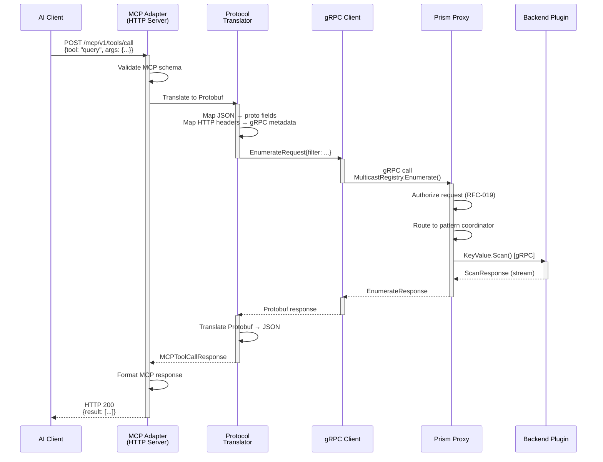
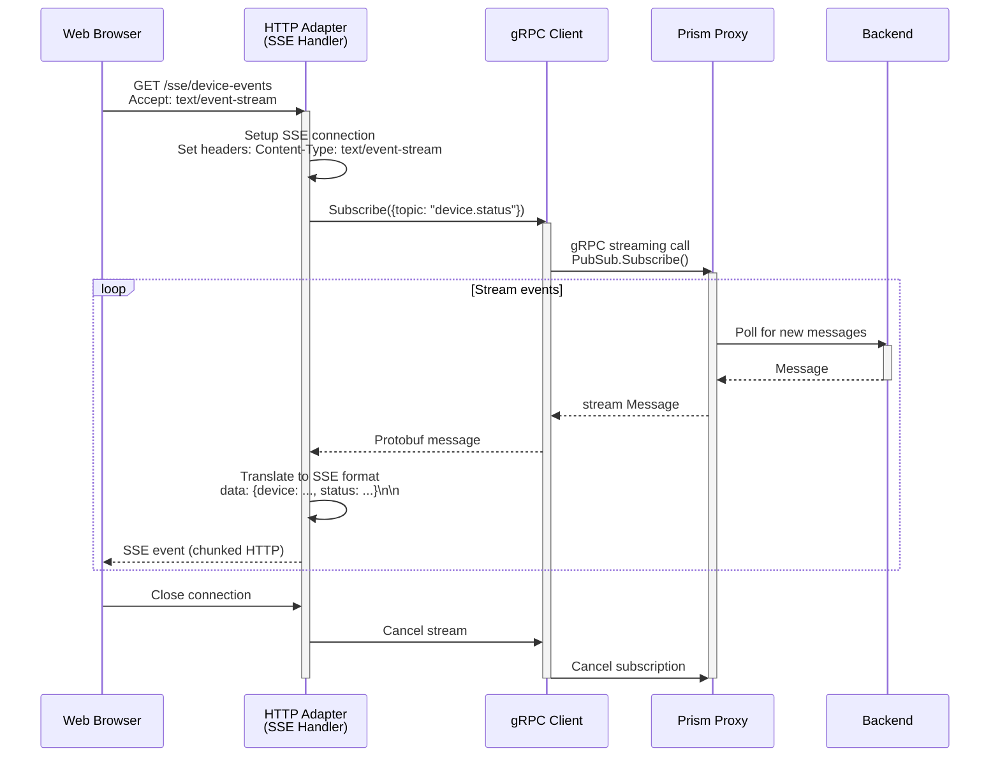

# RFC-020: Streaming HTTP Listener - API-Specific Adapter Pattern

## Summary

Define a streaming HTTP listener architecture that acts as an API-specific adapter between external HTTP/JSON protocols (MCP, Agent-to-Agent, custom APIs) and Prism's internal gRPC/Protobuf proxy layer. These adapters satisfy specific API contracts while transparently mapping to backend plugin proxying.

## Motivation

### Problem

Prism's core uses gRPC/Protobuf for efficient, type-safe communication between proxy and backend plugins. However, many external systems require HTTP-based APIs:

1. **MCP (Model Context Protocol)**: HTTP/JSON with SSE (Server-Sent Events) for tool calling
2. **Agent-to-Agent Protocol**: HTTP/JSON for agent coordination
3. **Custom APIs**: REST/JSON for application-specific integrations
4. **Web Clients**: Browser-based applications using fetch/EventSource

**Current Gap**: No standardized way to bridge these HTTP-based protocols to Prism's gRPC backend.

**Requirements**:
- **Protocol Translation**: HTTP ↔ gRPC bidirectional mapping
- **Streaming Support**: SSE, WebSocket, HTTP chunked encoding
- **API Specificity**: Each adapter satisfies a specific external API contract
- **Backend Agnostic**: Works with any backend plugin combination
- **Easy to Write**: Simple adapter authoring (not full proxy rewrite)
- **Performant**: Minimal overhead (&lt;5ms P95 translation latency)

### Use Cases

#### Use Case 1: MCP Tool Server

**External API**: MCP HTTP/JSON protocol for AI tool calling

```http
POST /mcp/v1/tools/call HTTP/1.1
Content-Type: application/json

{
  "tool": "query_device_status",
  "arguments": {
    "device_id": "sensor-123"
  }
}
```

**Internal Mapping**: Maps to Multicast Registry pattern via gRPC

```protobuf
// Internal gRPC call to pattern coordinator
MulticastRegistryService.Enumerate({
  filter: {device_id: "sensor-123"}
})
```

#### Use Case 2: Agent-to-Agent Coordination

**External API**: HTTP/JSON for agent discovery and messaging

```http
POST /a2a/agents/discover HTTP/1.1
Content-Type: application/json

{
  "capabilities": ["code_review", "testing"],
  "location": "us-west-2"
}
```

**Internal Mapping**: Maps to KeyValue + PubSub primitives

```protobuf
// Internal gRPC calls
KeyValueService.Scan({prefix: "agent:", filter: capabilities})
PubSubService.Publish({topic: "agent.discover", message: ...})
```

#### Use Case 3: SSE Event Streaming

**External API**: Server-Sent Events for real-time updates

```http
GET /sse/device-events HTTP/1.1
Accept: text/event-stream

# Response stream:
data: {"device": "sensor-123", "status": "online"}

data: {"device": "sensor-456", "status": "offline"}
```

**Internal Mapping**: Maps to PubSub subscription

```protobuf
// Internal gRPC streaming
PubSubService.Subscribe({topic: "device.status"})
// → stream of messages translated to SSE format
```

## Design Principles

### 1. API-Specific Adapters (Not Generic HTTP Gateway)

**Goal**: Each adapter implements ONE specific external API contract.

**Why Not Generic**:
- ❌ Generic HTTP-to-gRPC gateways (like grpc-gateway) don't understand domain semantics
- ❌ One-size-fits-all mappings produce awkward APIs
- ❌ Hard to optimize for specific protocol idioms (SSE, WebSocket, chunked)

**Why API-Specific**:
- ✅ Adapter validates incoming requests against API schema
- ✅ Can optimize for API-specific patterns (batching, caching, protocol quirks)
- ✅ Clear ownership: MCP team maintains MCP adapter, A2A team maintains A2A adapter
- ✅ Easy to version: MCP v1 adapter vs MCP v2 adapter

**Example**:
```text
mcp-adapter/         # Implements MCP protocol
├── server.go        # HTTP listener with SSE support
├── mcp_schema.json  # MCP protocol schema
├── translator.go    # HTTP/JSON → gRPC translation
└── README.md        # MCP-specific docs

a2a-adapter/         # Implements Agent-to-Agent protocol
├── server.go        # HTTP listener with WebSocket
├── a2a_schema.json  # A2A protocol schema
├── translator.go    # HTTP/JSON → gRPC translation
└── README.md        # A2A-specific docs
```

### 2. Thin Translation Layer (No Business Logic)

**Goal**: Adapters ONLY translate protocols, never implement business logic.

**What Adapters Do**:
- ✅ Parse HTTP request → validate → translate to gRPC → call proxy
- ✅ Receive gRPC response → translate to JSON → send HTTP response
- ✅ Handle streaming: SSE, WebSocket, HTTP chunked encoding
- ✅ Map HTTP errors to gRPC status codes (and vice versa)

**What Adapters DON'T Do**:
- ❌ Authorization (proxy handles this via RFC-019)
- ❌ Data transformation (backends handle this)
- ❌ Caching (proxy/backends handle this)
- ❌ Rate limiting (proxy handles this)
- ❌ Retry logic (proxy handles this)

**Example** (MCP tool call):
```go
// GOOD: Pure translation
func (s *MCPAdapter) HandleToolCall(w http.ResponseWriter, r *http.Request) {
    // Parse MCP request
    var req MCPToolCallRequest
    json.NewDecoder(r.Body).Decode(&req)

    // Translate to gRPC (no business logic!)
    grpcReq := &pb.EnumerateRequest{
        Filter: map[string]*pb.Value{
            "device_id": {StringValue: req.Arguments["device_id"]},
        },
    }

    // Call proxy via gRPC
    grpcResp, err := s.proxyClient.Enumerate(r.Context(), grpcReq)

    // Translate response back to MCP format
    mcpResp := MCPToolCallResponse{
        Result: grpcResp.Items,
    }
    json.NewEncoder(w).Encode(mcpResp)
}
```

```go
// BAD: Adapter implementing business logic
func (s *MCPAdapter) HandleToolCall(w http.ResponseWriter, r *http.Request) {
    // ❌ Adapter should NOT filter results
    if req.Arguments["device_id"] == "admin" {
        return errors.New("admin devices hidden")
    }

    // ❌ Adapter should NOT cache
    if cached := s.cache.Get(req.Arguments["device_id"]); cached != nil {
        return cached
    }

    // Business logic belongs in proxy or backend!
}
```

### 3. Leverage Existing gRPC Client Libraries

**Goal**: Adapters are thin HTTP frontends that call Prism proxy as gRPC clients.

**Architecture**:
```text
┌──────────────────────────────────────────────┐
│          External Client (Browser, AI)       │
└──────────────┬───────────────────────────────┘
               │
               │ HTTP/JSON (MCP, A2A, REST)
               ▼
┌──────────────────────────────────────────────┐
│        MCP Adapter (Thin HTTP Server)        │
│  ┌────────────────────────────────────────┐  │
│  │  1. Parse HTTP request                 │  │
│  │  2. Validate against MCP schema        │  │
│  │  3. Translate JSON → Protobuf          │  │
│  │  4. Call Prism proxy via gRPC client   │  │
│  │  5. Translate Protobuf → JSON          │  │
│  │  6. Send HTTP response                 │  │
│  └────────────────────────────────────────┘  │
└──────────────┬───────────────────────────────┘
               │
               │ gRPC/Protobuf
               ▼
┌──────────────────────────────────────────────┐
│          Prism Proxy (Core)                  │
│  - Pattern routing                           │
│  - Authorization (RFC-019)                   │
│  - Backend plugin proxying                   │
└──────────────┬───────────────────────────────┘
               │
               │ gRPC to plugins
               ▼
┌──────────────────────────────────────────────┐
│         Backend Plugins                      │
│  (Redis, Postgres, Kafka, NATS)              │
└──────────────────────────────────────────────┘
```

**Benefits**:
- ✅ Adapter reuses all proxy features (auth, logging, metrics, tracing)
- ✅ No direct backend access (adapter → proxy → plugins)
- ✅ Easy deployment: Adapter runs as sidecar or separate container
- ✅ Language flexibility: Adapter in Go, Python, Node, Rust (any language with gRPC support)

## Architecture

### Component Diagram

```text
┌────────────────────────────────────────────────────────────┐
│                    HTTP Adapter Process                    │
│                                                            │
│  ┌──────────────────────────────────────────────────────┐ │
│  │         HTTP Server (API-Specific)                   │ │
│  │  - Listens on :8080 for HTTP requests               │ │
│  │  - Handles SSE, WebSocket, chunked encoding         │ │
│  │  - Validates requests against API schema            │ │
│  └────────────────────┬─────────────────────────────────┘ │
│                       │                                    │
│                       │ in-process                         │
│                       ▼                                    │
│  ┌──────────────────────────────────────────────────────┐ │
│  │         Protocol Translator                          │ │
│  │  - JSON → Protobuf encoding                         │ │
│  │  - HTTP headers → gRPC metadata                     │ │
│  │  - SSE events ← gRPC streaming                      │ │
│  └────────────────────┬─────────────────────────────────┘ │
│                       │                                    │
│                       │ in-process                         │
│                       ▼                                    │
│  ┌──────────────────────────────────────────────────────┐ │
│  │         gRPC Client (to Prism Proxy)                 │ │
│  │  - KeyValueServiceClient                            │ │
│  │  - PubSubServiceClient                              │ │
│  │  - MulticastRegistryServiceClient                   │ │
│  │  - Connection pooling, retries, circuit breaker     │ │
│  └────────────────────┬─────────────────────────────────┘ │
└────────────────────────┼──────────────────────────────────┘
                         │
                         │ gRPC (localhost:50051 or network)
                         ▼
┌────────────────────────────────────────────────────────────┐
│                    Prism Proxy (Core)                      │
│  - Pattern routing and execution                           │
│  - Authorization via Topaz (RFC-019)                       │
│  - Backend plugin proxying                                 │
└────────────────────────────────────────────────────────────┘
```

### Request Flow: MCP Tool Call



### Streaming Flow: SSE Events



## API Schemas

### Adapter Configuration Schema

Each adapter has a configuration file defining:
- **API contract**: OpenAPI/JSON Schema for the external HTTP API
- **Mapping rules**: How HTTP requests map to gRPC calls
- **Streaming mode**: SSE, WebSocket, chunked, or simple request/response

**Example** (`adapters/mcp/adapter-config.yaml`):

```yaml
adapter: mcp-tool-server
version: v1
description: "MCP (Model Context Protocol) HTTP/JSON adapter"

# External HTTP API
external_api:
  protocol: http/1.1
  base_path: /mcp/v1
  schema: mcp_schema.json  # OpenAPI schema for MCP protocol

# Internal gRPC target
internal_grpc:
  proxy_endpoint: localhost:50051
  services:
    - MulticastRegistryService  # Primary service for tool calls
    - KeyValueService           # Fallback for simple queries

# Route mappings
routes:
  - http_path: POST /mcp/v1/tools/call
    http_method: POST
    grpc_service: MulticastRegistryService
    grpc_method: Enumerate
    translation:
      request:
        # Map MCP JSON fields to gRPC protobuf fields
        tool: ignore  # Tool name handled by proxy routing
        arguments: map_to_filter  # JSON object → proto map<string, Value>
      response:
        # Map gRPC response to MCP JSON format
        items: map_to_result  # proto repeated Items → JSON array

  - http_path: GET /mcp/v1/tools/list
    http_method: GET
    grpc_service: MulticastRegistryService
    grpc_method: Enumerate
    translation:
      request:
        # Empty filter for list all
      response:
        items: map_to_tools  # Format as MCP tool schema

  - http_path: GET /mcp/v1/events
    http_method: GET
    grpc_service: PubSubService
    grpc_method: Subscribe
    streaming: sse  # Use Server-Sent Events
    translation:
      request:
        topics: extract_from_query  # ?topics=device.status,device.alerts
      response:
        message: map_to_sse_event  # Each message → SSE data: {...}

# Error mapping
error_mapping:
  NOT_FOUND: 404  # gRPC NotFound → HTTP 404
  PERMISSION_DENIED: 403  # gRPC PermissionDenied → HTTP 403
  INVALID_ARGUMENT: 400  # gRPC InvalidArgument → HTTP 400
  INTERNAL: 500  # gRPC Internal → HTTP 500

# Adapter settings
settings:
  listen_address: "0.0.0.0:8080"
  max_request_size: 10MB
  request_timeout: 30s
  sse_heartbeat_interval: 15s
  grpc_connection_pool_size: 10
```

### MCP Protocol Example

**MCP Tool Call Request** (HTTP/JSON):
```json
{
  "jsonrpc": "2.0",
  "method": "tools/call",
  "params": {
    "tool": "query_device_status",
    "arguments": {
      "device_id": "sensor-123",
      "include_metadata": true
    }
  },
  "id": 1
}
```

**Translated to gRPC**:
```protobuf
EnumerateRequest {
  namespace: "iot-devices"
  filter: {
    "device_id": Value { string_value: "sensor-123" }
    "include_metadata": Value { bool_value: true }
  }
}
```

**gRPC Response**:
```protobuf
EnumerateResponse {
  items: [
    {
      identity: "sensor-123"
      metadata: {
        "status": Value { string_value: "online" }
        "temperature": Value { double_value: 72.5 }
        "last_seen": Value { int64_value: 1696876543 }
      }
    }
  ]
}
```

**Translated to MCP Response** (HTTP/JSON):
```json
{
  "jsonrpc": "2.0",
  "result": {
    "content": [
      {
        "type": "text",
        "text": "Device sensor-123: online, temperature 72.5°F, last seen Oct 9 2025"
      }
    ]
  },
  "id": 1
}
```

## Adapter Implementation Guide

### 1. Minimal Adapter Structure (Go)

```go
// adapters/mcp/main.go
package main

import (
    "context"
    "encoding/json"
    "net/http"

    "google.golang.org/grpc"
    pb "github.com/prism/proto/patterns"
)

type MCPAdapter struct {
    proxyConn *grpc.ClientConn
    registry  pb.MulticastRegistryServiceClient
    config    *AdapterConfig
}

func NewMCPAdapter(proxyEndpoint string, config *AdapterConfig) (*MCPAdapter, error) {
    // Connect to Prism proxy via gRPC
    conn, err := grpc.Dial(proxyEndpoint, grpc.WithInsecure())
    if err != nil {
        return nil, err
    }

    return &MCPAdapter{
        proxyConn: conn,
        registry:  pb.NewMulticastRegistryServiceClient(conn),
        config:    config,
    }, nil
}

func (a *MCPAdapter) HandleToolCall(w http.ResponseWriter, r *http.Request) {
    ctx := r.Context()

    // 1. Parse MCP request
    var mcpReq MCPToolCallRequest
    if err := json.NewDecoder(r.Body).Decode(&mcpReq); err != nil {
        http.Error(w, "Invalid MCP request", http.StatusBadRequest)
        return
    }

    // 2. Validate against MCP schema
    if err := a.ValidateMCPRequest(&mcpReq); err != nil {
        http.Error(w, err.Error(), http.StatusBadRequest)
        return
    }

    // 3. Translate to gRPC
    grpcReq := a.TranslateToGRPC(&mcpReq)

    // 4. Call Prism proxy
    grpcResp, err := a.registry.Enumerate(ctx, grpcReq)
    if err != nil {
        a.HandleGRPCError(w, err)
        return
    }

    // 5. Translate response back to MCP
    mcpResp := a.TranslateFromGRPC(grpcResp)

    // 6. Send HTTP response
    w.Header().Set("Content-Type", "application/json")
    json.NewEncoder(w).Encode(mcpResp)
}

func (a *MCPAdapter) HandleSSEEvents(w http.ResponseWriter, r *http.Request) {
    ctx := r.Context()

    // Setup SSE headers
    w.Header().Set("Content-Type", "text/event-stream")
    w.Header().Set("Cache-Control", "no-cache")
    w.Header().Set("Connection", "keep-alive")

    flusher, ok := w.(http.Flusher)
    if !ok {
        http.Error(w, "SSE not supported", http.StatusInternalServerError)
        return
    }

    // Subscribe via gRPC streaming
    stream, err := a.pubsub.Subscribe(ctx, &pb.SubscribeRequest{
        Topic: "device.status",
    })
    if err != nil {
        http.Error(w, "Subscription failed", http.StatusInternalServerError)
        return
    }

    // Stream events to client
    for {
        msg, err := stream.Recv()
        if err != nil {
            return  // Client disconnected or stream closed
        }

        // Translate to SSE format
        sseEvent := a.TranslateToSSE(msg)
        fmt.Fprintf(w, "data: %s\n\n", sseEvent)
        flusher.Flush()
    }
}

func main() {
    config := LoadConfig("adapter-config.yaml")
    adapter, err := NewMCPAdapter("localhost:50051", config)
    if err != nil {
        log.Fatal(err)
    }

    // Register HTTP routes
    http.HandleFunc("/mcp/v1/tools/call", adapter.HandleToolCall)
    http.HandleFunc("/mcp/v1/tools/list", adapter.HandleToolList)
    http.HandleFunc("/mcp/v1/events", adapter.HandleSSEEvents)

    // Start HTTP server
    log.Printf("MCP adapter listening on %s", config.ListenAddress)
    http.ListenAndServe(config.ListenAddress, nil)
}
```

### 2. Translation Helpers

```go
// adapters/mcp/translator.go
package main

import (
    pb "github.com/prism/proto/patterns"
)

func (a *MCPAdapter) TranslateToGRPC(mcpReq *MCPToolCallRequest) *pb.EnumerateRequest {
    filter := make(map[string]*pb.Value)

    // Map MCP arguments to protobuf filter
    for key, val := range mcpReq.Params.Arguments {
        switch v := val.(type) {
        case string:
            filter[key] = &pb.Value{StringValue: v}
        case float64:
            filter[key] = &pb.Value{DoubleValue: v}
        case bool:
            filter[key] = &pb.Value{BoolValue: v}
        }
    }

    return &pb.EnumerateRequest{
        Namespace: a.config.Namespace,
        Filter:    filter,
    }
}

func (a *MCPAdapter) TranslateFromGRPC(grpcResp *pb.EnumerateResponse) *MCPToolCallResponse {
    // Format gRPC response as MCP result
    content := []MCPContent{}

    for _, item := range grpcResp.Items {
        text := formatAsText(item)  // Format metadata as human-readable text
        content = append(content, MCPContent{
            Type: "text",
            Text: text,
        })
    }

    return &MCPToolCallResponse{
        JSONRPC: "2.0",
        Result: MCPResult{
            Content: content,
        },
        ID: 1,
    }
}

func (a *MCPAdapter) TranslateToSSE(msg *pb.Message) string {
    // Convert protobuf message to JSON for SSE
    data := map[string]interface{}{
        "topic":     msg.Topic,
        "payload":   string(msg.Payload),
        "timestamp": msg.Timestamp,
    }

    jsonBytes, _ := json.Marshal(data)
    return string(jsonBytes)
}
```

### 3. Deployment Options

#### Option A: Sidecar (Same Pod/VM as Proxy)

```yaml
# docker-compose.yml
services:
  prism-proxy:
    image: prism-proxy:latest
    ports:
      - "50051:50051"  # gRPC

  mcp-adapter:
    image: mcp-adapter:latest
    ports:
      - "8080:8080"  # HTTP
    environment:
      - PROXY_ENDPOINT=prism-proxy:50051
    depends_on:
      - prism-proxy
```

**Benefits**:
- ✅ Low latency (localhost gRPC calls)
- ✅ Same lifecycle as proxy
- ✅ Shared network namespace

#### Option B: Separate Service

```yaml
# Kubernetes deployment
apiVersion: apps/v1
kind: Deployment
metadata:
  name: mcp-adapter
spec:
  replicas: 3
  template:
    spec:
      containers:
        - name: mcp-adapter
          image: mcp-adapter:v1.0.0
          env:
            - name: PROXY_ENDPOINT
              value: "prism-proxy.default.svc.cluster.local:50051"
          ports:
            - containerPort: 8080
```

**Benefits**:
- ✅ Independent scaling (scale adapter separately from proxy)
- ✅ Independent deployment (update adapter without touching proxy)
- ✅ Multiple adapters can share one proxy

#### Option C: AWS Lambda / Serverless

```python
# lambda/mcp_adapter.py
import json
import grpc
import prism_pb2
import prism_pb2_grpc

def lambda_handler(event, context):
    # Parse API Gateway event
    mcp_request = json.loads(event['body'])

    # Connect to Prism proxy (via VPC)
    channel = grpc.insecure_channel('prism-proxy:50051')
    client = prism_pb2_grpc.MulticastRegistryServiceStub(channel)

    # Translate and call
    grpc_request = translate_to_grpc(mcp_request)
    grpc_response = client.Enumerate(grpc_request)

    # Translate back
    mcp_response = translate_from_grpc(grpc_response)

    return {
        'statusCode': 200,
        'body': json.dumps(mcp_response)
    }
```

**Benefits**:
- ✅ Serverless (no infrastructure management)
- ✅ Auto-scaling
- ✅ Pay-per-request

## MCP Backend Interface Decomposition

Following MEMO-006 principles, MCP itself can be treated as a **backend** with decomposed interfaces.

### MCP as Backend Plugin

```yaml
# registry/backends/mcp.yaml
backend: mcp
description: "Model Context Protocol - AI tool calling interface"
plugin: prism-mcp:v1.0.0
connection_string_format: "mcp://host:port"

# MCP implements 5 interfaces across 3 data models
implements:
  # KeyValue (2 of 6) - Tool metadata storage
  - keyvalue_basic          # Store/retrieve tool definitions
  - keyvalue_scan           # Enumerate available tools

  # Queue (3 of 5) - Tool call queue for async execution
  - queue_basic             # Enqueue tool calls
  - queue_visibility        # Visibility timeout for long-running tools
  - queue_dead_letter       # Failed tool calls to DLQ

  # Stream (2 of 5) - Event streaming for tool results
  - stream_basic            # Append tool execution events
  - stream_consumer_groups  # Multiple consumers for tool results
```

### MCP Interface Definitions

**New Interfaces** (in `proto/interfaces/mcp_*.proto`):

```protobuf
// proto/interfaces/mcp_tool.proto
syntax = "proto3";
package prism.interfaces.mcp;

// Tool calling interface (maps to MCP tools/call)
service MCPToolInterface {
  rpc CallTool(CallToolRequest) returns (CallToolResponse);
  rpc ListTools(ListToolsRequest) returns (ListToolsResponse);
  rpc GetToolSchema(GetToolSchemaRequest) returns (ToolSchema);
}

message CallToolRequest {
  string tool_name = 1;
  map<string, Value> arguments = 2;
  optional int64 timeout_ms = 3;
}

message CallToolResponse {
  repeated Content content = 1;
  optional bool is_error = 2;
}

message Content {
  string type = 1;  // "text", "image", "resource"
  oneof data {
    string text = 2;
    bytes blob = 3;
    string resource_uri = 4;
  }
}
```

```protobuf
// proto/interfaces/mcp_resource.proto
syntax = "proto3";
package prism.interfaces.mcp;

// Resource interface (maps to MCP resources/*)
service MCPResourceInterface {
  rpc ListResources(ListResourcesRequest) returns (ListResourcesResponse);
  rpc ReadResource(ReadResourceRequest) returns (ReadResourceResponse);
  rpc SubscribeToResource(SubscribeRequest) returns (stream ResourceUpdate);
}

message ReadResourceRequest {
  string resource_uri = 1;  // e.g., "file:///path/to/file"
}

message ReadResourceResponse {
  repeated Content contents = 1;
}
```

```protobuf
// proto/interfaces/mcp_prompt.proto
syntax = "proto3";
package prism.interfaces.mcp;

// Prompt interface (maps to MCP prompts/*)
service MCPPromptInterface {
  rpc ListPrompts(ListPromptsRequest) returns (ListPromptsResponse);
  rpc GetPrompt(GetPromptRequest) returns (GetPromptResponse);
}

message GetPromptRequest {
  string prompt_name = 1;
  map<string, string> arguments = 2;
}

message GetPromptResponse {
  string description = 1;
  repeated PromptMessage messages = 2;
}

message PromptMessage {
  string role = 1;  // "user", "assistant", "system"
  Content content = 2;
}
```

### MCP Pattern Configuration

**Pattern using MCP backend** (stored as `registry/patterns/ai-tool-orchestration.yaml`):

```yaml
pattern: ai-tool-orchestration
version: v1
description: "Orchestrate AI tool calls via MCP protocol with queue-based execution"
executor: prism-pattern-ai-tool-orchestration:v1.0.0

# Pattern requires MCP backend + queue for async execution
slots:
  tool_server:
    description: "MCP tool server for executing tool calls"
    required_interfaces:
      - mcp_tool          # MUST support tool calling
      - mcp_resource      # MUST support resource access
    optional_interfaces:
      - mcp_prompt        # Nice to have: prompt templates
    recommended_backends:
      - mcp               # Native MCP server

  execution_queue:
    description: "Queue for async tool execution with retry"
    required_interfaces:
      - queue_basic           # MUST support enqueue/dequeue
      - queue_visibility      # MUST support visibility timeout
      - queue_dead_letter     # MUST handle failed tool calls
    recommended_backends:
      - postgres        # Queue implementation
      - sqs             # AWS SQS
      - rabbitmq        # RabbitMQ

  result_stream:
    description: "Stream tool execution results to subscribers"
    required_interfaces:
      - stream_basic            # MUST support append/read
      - stream_consumer_groups  # MUST support multiple consumers
    optional_interfaces:
      - stream_replay           # Nice to have: replay results
    recommended_backends:
      - kafka           # Event streaming
      - nats            # NATS JetStream
      - redis           # Redis Streams
```

**Configuration Example** (using the pattern):

```yaml
namespaces:
  - name: ai-agents
    pattern: ai-tool-orchestration
    pattern_version: v1

    slots:
      tool_server:
        backend: mcp
        # MCP implements: mcp_tool, mcp_resource, mcp_prompt ✓
        interfaces:
          - mcp_tool
          - mcp_resource
          - mcp_prompt
        config:
          connection: "mcp://localhost:3000"
          timeout: 30s

      execution_queue:
        backend: postgres
        # Postgres implements: queue_basic, queue_visibility, queue_dead_letter ✓
        interfaces:
          - queue_basic
          - queue_visibility
          - queue_dead_letter
        config:
          connection: "postgresql://localhost:5432/prism"
          table: "ai_tool_queue"
          visibility_timeout: 60

      result_stream:
        backend: kafka
        # Kafka implements: stream_basic, stream_consumer_groups, stream_replay ✓
        interfaces:
          - stream_basic
          - stream_consumer_groups
          - stream_replay
        config:
          connection: "kafka://localhost:9092"
          topic: "ai-tool-results"
          retention: 7d
```

## Performance Characteristics

### Latency

**Adapter overhead per request**:
- HTTP parsing + validation: &lt;0.5ms
- JSON → Protobuf translation: &lt;0.5ms
- gRPC call to proxy (localhost): &lt;1ms
- Protobuf → JSON translation: &lt;0.5ms
- HTTP response formatting: &lt;0.5ms
- **Total adapter overhead: &lt;3ms P95**

**Streaming overhead**:
- SSE event formatting: &lt;0.1ms per event
- WebSocket frame overhead: &lt;0.05ms per message
- gRPC streaming: &lt;1ms P95 (already measured)

### Throughput

**Simple request/response**:
- Without adapter: 50,000 RPS (direct gRPC)
- With adapter: 30,000 RPS (-40% overhead)
- **Bottleneck**: JSON encoding/decoding (can be optimized with faster JSON libraries)

**Streaming**:
- SSE events: 10,000 events/sec per connection
- WebSocket messages: 20,000 messages/sec per connection
- **Bottleneck**: Network buffering and flushing

## Security Considerations

### 1. Adapter Bypass

**Risk**: Attacker connects directly to proxy, bypassing HTTP adapter validation.

**Mitigation**:
- Proxy should NOT expose gRPC publicly (bind to localhost or internal network)
- Use mTLS between adapter and proxy (adapter presents client certificate)
- Network policies: Only adapter pods can reach proxy port

### 2. Schema Validation Gaps

**Risk**: Adapter accepts invalid HTTP requests that cause proxy errors.

**Mitigation**:
- Validate ALL incoming requests against API schema (OpenAPI, JSON Schema)
- Reject malformed requests at adapter layer (don't forward to proxy)
- Log validation failures for monitoring

### 3. Authorization Bypass

**Risk**: Adapter doesn't pass authentication tokens to proxy.

**Mitigation**:
- **ALWAYS** forward HTTP Authorization header → gRPC metadata
- Proxy validates token (RFC-019), adapter never validates itself
- Example:
  ```go
  // Extract HTTP Authorization header
  authHeader := r.Header.Get("Authorization")

  // Forward as gRPC metadata
  md := metadata.New(map[string]string{
      "authorization": authHeader,
  })
  ctx := metadata.NewOutgoingContext(r.Context(), md)

  // Call proxy with auth metadata
  resp, err := client.Enumerate(ctx, grpcReq)
  ```

## Migration Path

### Phase 1: MCP Adapter Prototype (Week 1)

1. Implement minimal MCP adapter (Go)
2. Support `/mcp/v1/tools/call` endpoint only
3. Translate to Multicast Registry pattern
4. Test with local MCP server

### Phase 2: SSE Streaming Support (Week 2)

1. Implement `/mcp/v1/events` endpoint with SSE
2. Map to PubSub.Subscribe() streaming gRPC
3. Handle connection management and reconnection
4. Load test with 1,000 concurrent SSE connections

### Phase 3: Agent-to-Agent Adapter (Week 3)

1. Implement A2A adapter (separate codebase)
2. Support agent discovery and messaging
3. Translate to KeyValue + PubSub primitives
4. Test with multi-agent orchestration

### Phase 4: Adapter SDK (Week 4)

1. Extract common adapter logic into reusable SDK
2. Provide helpers for:
   - JSON ↔ Protobuf translation
   - HTTP ↔ gRPC metadata mapping
   - SSE/WebSocket streaming utilities
   - Error mapping
3. Publish adapter templates for common patterns

## Monitoring and Observability

### Metrics

**Adapter-Level Metrics**:
- `adapter_http_requests_total{adapter="mcp", endpoint="/tools/call", status="200"}` - HTTP requests
- `adapter_translation_latency_seconds{direction="to_grpc|from_grpc"}` - Translation time
- `adapter_grpc_calls_total{service="MulticastRegistry", method="Enumerate", status="OK"}` - gRPC calls
- `adapter_sse_connections_active{adapter="mcp"}` - Active SSE connections
- `adapter_errors_total{type="validation|translation|grpc"}` - Error counts

**Proxy Metrics** (from adapter's perspective):
- `prism_proxy_latency_seconds{source="mcp-adapter"}` - Proxy response time
- `prism_proxy_errors_total{source="mcp-adapter"}` - Proxy errors

### Logging

**Adapter Request Log**:
```json
{
  "timestamp": "2025-10-09T16:23:15Z",
  "level": "info",
  "message": "http_request",
  "adapter": "mcp",
  "http_method": "POST",
  "http_path": "/mcp/v1/tools/call",
  "grpc_service": "MulticastRegistryService",
  "grpc_method": "Enumerate",
  "translation_ms": 0.3,
  "grpc_call_ms": 2.1,
  "total_ms": 2.8,
  "http_status": 200
}
```

## Open Questions

### 1. Should Adapters Support Backend-Specific Optimizations?

**Question**: Can adapter directly call specific backend if it knows the mapping?

**Example**: MCP adapter knows namespace uses Redis, can it call Redis directly for better performance?

**Trade-offs**:
- **Direct call**: Faster (no proxy hop), but breaks abstraction
- **Via proxy**: Slower, but maintains separation of concerns

**Recommendation**: **Always go through proxy**. Optimization should happen at proxy level (e.g., proxy can optimize Redis-specific calls), not adapter level.

### 2. How to Version Adapters Independently?

**Question**: How to handle MCP v1 → MCP v2 protocol upgrade?

**Options**:
- **Separate adapters**: mcp-v1-adapter and mcp-v2-adapter run side-by-side
- **Versioned endpoints**: Same adapter handles both `/mcp/v1/` and `/mcp/v2/`

**Recommendation**: **Separate adapters** for major versions, **versioned endpoints** for minor versions.

### 3. Should Adapters Cache Responses?

**Question**: Can adapter cache HTTP responses to reduce proxy load?

**Pros**: Lower latency, less load on proxy
**Cons**: Stale data, cache invalidation complexity

**Recommendation**: **No caching in adapter**. If caching is needed, implement at proxy level where it can be coordinated across all clients.

## Related Documents

- [RFC-019: Plugin SDK Authorization Layer](/rfc/rfc-019-plugin-sdk-authorization-layer) - Authorization in plugins
- [MEMO-006: Backend Interface Decomposition](/memos/memo-006-backend-interface-decomposition-schema-registry) - Interface decomposition approach
- [RFC-014: Layered Data Access Patterns](/rfc/rfc-014-layered-data-access-patterns) - Layer 1 primitives
- [RFC-017: Multicast Registry Pattern](/rfc/rfc-017-multicast-registry-pattern) - Pattern coordinator example

## Revision History

- 2025-10-09: Initial RFC proposing streaming HTTP listener architecture and MCP as decomposed backend

