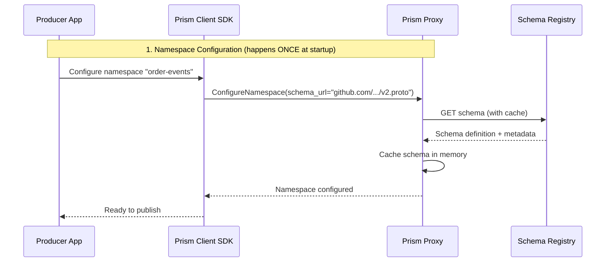
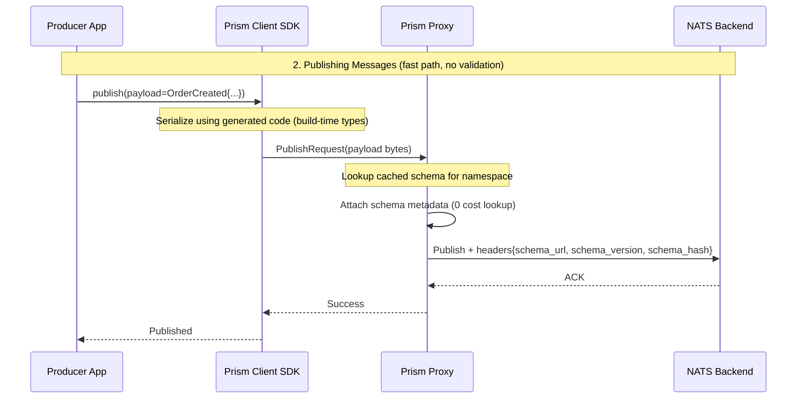
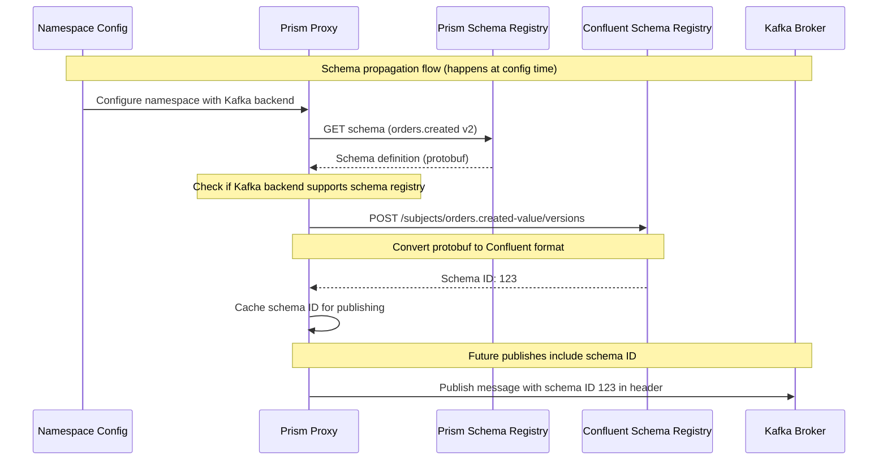
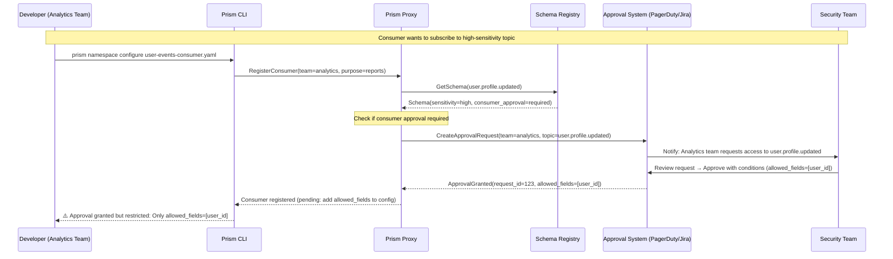

## Abstract

This RFC addresses schema evolution and validation for publisher/consumer patterns in Prism where producers and consumers are decoupled across async teams with different workflows and GitHub repositories. It proposes a schema registry approach that enables producers to declare publish schemas (GitHub or dedicated registry), consumers to validate compatibility at runtime, and platform teams to enforce governance while maintaining development velocity.

## Motivation

### The Decoupling Problem

Prism's pub/sub and queue patterns intentionally decouple producers from consumers:

**Current Architecture:**
```text
┌─────────────────┐         ┌─────────────────┐
│  Producer App   │         │  Consumer App   │
│  (Team A, Repo 1)│        │  (Team B, Repo 2)│
└────────┬────────┘         └────────┬────────┘
         │                           │
         │  Publish                  │  Subscribe
         │  events                   │  events
         └───────────┐     ┌─────────┘
                     ▼     ▼
              ┌──────────────────┐
              │  Prism Proxy     │
              │  NATS/Kafka      │
              └──────────────────┘
```

**Problems This Creates:**

1. **Schema Discovery**: Consumer teams don't know what schema producers use
   - No centralized documentation
   - Tribal knowledge or Slack asks: "Hey, what fields does `user.created` have?"
   - Breaking changes discovered at runtime

2. **Version Mismatches**: Producer evolves schema, consumer breaks
   - Producer adds required field → consumers crash on deserialization
   - Producer removes field → consumers get `null` unexpectedly
   - Producer changes field type → silent data corruption

3. **Cross-Repo Workflows**: Teams can't coordinate deploys
   - Producer Team A deploys v2 schema on Monday
   - Consumer Team B still running v1 code on Friday
   - No visibility into downstream breakage

4. **Testing Challenges**: Consumers can't test against producer changes
   - Integration tests use mock data
   - Mocks drift from real schemas
   - Production is first place incompatibility detected

5. **Governance Vacuum**: No platform control over data quality
   - No PII tagging enforcement
   - No backward compatibility checks
   - No schema approval workflows

### Why This Matters for PRD-001 Goals

**PRD-001 Core Goals This Blocks:**

| Goal | Blocked By | Impact |
|------|------------|--------|
| **Accelerate Development** | Waiting for schema docs from other teams | Delays feature delivery |
| **Enable Migrations** | Can't validate consumers before backend change | Risky migrations |
| **Reduce Operational Cost** | Runtime failures from schema mismatches | Incident toil |
| **Improve Reliability** | Silent data corruption from type changes | Data quality issues |
| **Foster Innovation** | Fear of breaking downstream consumers | Slows experimentation |

### Real-World Scenarios

**Scenario 1: E-Commerce Order Events**

```text
Producer: Order Service (Team A)
  - Publishes: orders.created
  - Schema: {order_id, user_id, items[], total, currency}

Consumers:
  - Fulfillment Service (Team B): Needs order_id, items[]
  - Analytics Pipeline (Team C): Needs all fields
  - Email Service (Team D): Needs order_id, user_id, total

Problem: Team A wants to add `tax_amount` field (required)
  - How do they know which consumers will break?
  - How do consumers discover this change before deploy?
  - What happens if Team D deploys before Team A?
```

**Scenario 2: IoT Sensor Data**

```text
Producer: IoT Gateway (Team A)
  - Publishes: sensor.readings
  - Schema: {sensor_id, timestamp, temperature, humidity}

Consumers:
  - Alerting Service (Team B): Needs sensor_id, temperature
  - Data Lake (Team C): Needs all fields
  - Dashboard (Team D): Needs sensor_id, timestamp, temperature

Problem: Team A changes `temperature` from int (Celsius) to float (Fahrenheit)
  - Type change breaks deserialization
  - Semantic change breaks business logic
  - How to test this without breaking production?
```

**Scenario 3: User Profile Updates**

```text
Producer: User Service (Team A)
  - Publishes: user.profile.updated
  - Schema: {user_id, email, name, avatar_url}
  - Contains PII: email, name

Consumer: Search Indexer (Team B)
  - Stores ALL fields in Elasticsearch (public-facing search)

Problem: PII leak due to missing governance
  - Producer doesn't tag PII fields
  - Consumer indexes email addresses
  - Compliance violation, data breach risk
```

## Goals

1. **Schema Discovery**: Consumers can find producer schemas without asking humans
2. **Compatibility Validation**: Consumers detect breaking changes before deploy
3. **Decoupled Evolution**: Producers evolve schemas without coordinating deploys
4. **Testing Support**: Consumers test against real schemas in CI/CD
5. **Governance Enforcement**: Platform enforces PII tagging, compatibility rules
6. **Developer Velocity**: Schema changes take minutes, not days of coordination

## Non-Goals

1. **Runtime Schema Transformation**: No automatic v1 → v2 translation (use separate topics)
2. **Cross-Language Type System**: Won't solve Go struct ↔ Python dict ↔ Rust enum mapping
3. **Schema Inference**: Won't auto-generate schemas from published data
4. **Global Schema Uniqueness**: Same event type can have different schemas per namespace
5. **Zero Downtime Schema Migration**: Producers/consumers must handle overlapping schema versions

## Proposed Solution: Layered Schema Registry

### Architecture Overview

```text
┌────────────────────────────────────────────────────────────┐
│                  Producer Workflow                          │
├────────────────────────────────────────────────────────────┤
│                                                            │
│  1. Define Schema (protobuf/json-schema/avro)             │
│     ├─ orders.created.v2.proto                            │
│     ├─ PII tags: @prism.pii(type="email")                 │
│     └─ Backward compat: optional new fields               │
│                                                            │
│  2. Register Schema                                        │
│     ├─ Option A: Push to GitHub (git tag release)        │
│     ├─ Option B: POST to Prism Schema Registry           │
│     └─ CI/CD validates compat                             │
│                                                            │
│  3. Publish with Schema Reference                         │
│     client.publish(topic="orders.created", payload=data,  │
│                    schema_url="github.com/.../v2.proto")  │
│                                                            │
└────────────────────────────────────────────────────────────┘

┌────────────────────────────────────────────────────────────┐
│                  Consumer Workflow                          │
├────────────────────────────────────────────────────────────┤
│                                                            │
│  1. Discover Schema                                        │
│     ├─ List available schemas for topic                   │
│     ├─ GET github.com/.../orders.created.v2.proto         │
│     └─ Generate client code (protoc)                      │
│                                                            │
│  2. Validate Compatibility (CI/CD)                        │
│     ├─ prism schema check --consumer my-schema.proto      │
│     ├─ Fails if producer added required fields           │
│     └─ Warns if producer removed fields                   │
│                                                            │
│  3. Subscribe with Schema Assertion                       │
│     client.subscribe(topic="orders.created",              │
│                      expected_schema="v2",                │
│                      on_mismatch="warn")                  │
│                                                            │
└────────────────────────────────────────────────────────────┘

┌────────────────────────────────────────────────────────────┐
│              Prism Proxy (Schema Enforcement)               │
├────────────────────────────────────────────────────────────┤
│                                                            │
│  - Caches schemas from registry/GitHub                    │
│  - Validates published messages match declared schema     │
│  - Attaches schema metadata to messages                   │
│  - Enforces PII tagging policy                            │
│  - Tracks schema versions per topic                       │
│                                                            │
└────────────────────────────────────────────────────────────┘
```

### Three-Tier Schema Storage

#### Tier 1: GitHub (Developer-Friendly, Git-Native)

**Use Case**: Open-source workflows, multi-repo teams, audit trail via Git history

```text
# Producer repository structure
my-service/
├── schemas/
│   └── events/
│       ├── orders.created.v1.proto
│       ├── orders.created.v2.proto
│       └── orders.updated.v1.proto
├── prism-config.yaml
└── README.md

# prism-config.yaml
namespaces:
  - name: orders
    pattern: pubsub
    schema:
      registry_type: github
      repository: github.com/myorg/my-service
      path: schemas/events
      branch: main  # or use git tags for immutability
```

**Schema URL Format:**
```text
github.com/myorg/my-service/blob/main/schemas/events/orders.created.v2.proto
github.com/myorg/my-service/blob/v2.1.0/schemas/events/orders.created.v2.proto  # Tagged release
```

**Pros**:
- ✅ Familiar Git workflow (PR reviews, version tags)
- ✅ Public schemas for open-source projects
- ✅ Free (GitHub hosts)
- ✅ Change history and blame
- ✅ CI/CD integration via GitHub Actions

**Cons**:
- ❌ Requires GitHub access (not suitable for air-gapped envs)
- ❌ Rate limits (5000 req/hour authenticated)
- ❌ Latency (300-500ms per fetch)

#### Tier 2: Prism Schema Registry (Platform-Managed, High Performance)

**Use Case**: Enterprise, high-throughput, governance controls, private networks

```text
# POST /v1/schemas
POST https://prism-registry.example.com/v1/schemas

{
  "namespace": "orders",
  "topic": "orders.created",
  "version": "v2",
  "format": "protobuf",
  "schema": "<base64-encoded proto>",
  "metadata": {
    "owner_team": "order-team",
    "pii_fields": ["email", "billing_address"],
    "compatibility_mode": "backward"
  }
}

# Response
{
  "schema_id": "schema-abc123",
  "schema_url": "prism-registry.example.com/v1/schemas/schema-abc123",
  "validation": {
    "compatible_with_v1": true,
    "breaking_changes": [],
    "warnings": ["Field 'tax_amount' added as optional"]
  }
}
```

**Pros**:
- ✅ Low latency (&lt;10ms, in-cluster)
- ✅ No external dependencies
- ✅ Governance hooks (approval workflows)
- ✅ Caching (aggressive, TTL=1h)
- ✅ Observability (metrics, audit logs)

**Cons**:
- ❌ Requires infrastructure (deploy + maintain registry service)
- ❌ Not Git-native (must integrate with Git repos separately)

#### Tier 3: Confluent Schema Registry (Kafka-Native)

**Use Case**: Kafka-heavy deployments, existing Confluent infrastructure

```text
# Use Confluent REST API
POST http://kafka-schema-registry:8081/subjects/orders.created-value/versions

{
  "schema": "{...protobuf IDL...}",
  "schemaType": "PROTOBUF"
}

# Prism adapter translates to Confluent API
prism-config.yaml:
  schema:
    registry_type: confluent
    url: http://kafka-schema-registry:8081
    compatibility: BACKWARD
```

**Pros**:
- ✅ Kafka ecosystem integration
- ✅ Mature, battle-tested (100k+ deployments)
- ✅ Built-in compatibility checks

**Cons**:
- ❌ Kafka-specific (doesn't work with NATS)
- ❌ Licensing (Confluent Community vs Enterprise)
- ❌ Heavy (JVM-based, 1GB+ memory)

### Comparison with Kafka Ecosystem Registries

**Validation Against Existing Standards:**

Prism's schema registry approach is validated against three major Kafka ecosystem registries:

| Feature | Confluent Schema Registry | AWS Glue Schema Registry | Apicurio Registry | Prism Schema Registry |
|---------|---------------------------|--------------------------|-------------------|----------------------|
| **Protocol Support** | REST | REST | REST | gRPC + REST |
| **Schema Formats** | Avro, Protobuf, JSON Schema | Avro, JSON Schema, Protobuf | Avro, Protobuf, JSON, OpenAPI, AsyncAPI | Protobuf, JSON Schema, Avro |
| **Backend Lock-In** | Kafka-specific | AWS-specific | Multi-backend | Multi-backend (NATS, Kafka, etc.) |
| **Compatibility Checking** | ✅ Backward, Forward, Full | ✅ Backward, Forward, Full, None | ✅ Backward, Forward, Full | ✅ Backward, Forward, Full, None |
| **Schema Evolution** | ✅ Subject-based versioning | ✅ Version-based | ✅ Artifact-based | ✅ Topic + namespace versioning |
| **Language-agnostic** | ✅ Yes | ✅ Yes | ✅ Yes | ✅ Yes |
| **Storage Backend** | Kafka topic | DynamoDB | PostgreSQL, Kafka, Infinispan | SQLite (dev), Postgres (prod) |
| **Git Integration** | ❌ No | ❌ No | ⚠️ External only | ✅ Native GitHub support |
| **Client-Side Caching** | ⚠️ Manual | ⚠️ Manual | ⚠️ Manual | ✅ Built-in (namespace config) |
| **PII Governance** | ❌ No | ❌ No | ❌ No | ✅ Prism annotations |
| **Deployment** | JVM (1GB+) | Managed service | JVM or native | Rust (<50MB) |
| **Latency (P99)** | 10-20ms | 20-50ms | 10-30ms | &lt;10ms (in-cluster) |
| **Pricing** | Free (OSS) / Enterprise $$ | Per API call | Free (OSS) | Free (OSS) |

**Key Differentiators:**

1. **Multi-Backend Support**: Prism works with NATS, Kafka, RabbitMQ, etc. (not Kafka-specific)
2. **Git-Native**: Schemas can live in GitHub repos (no separate registry infrastructure for OSS)
3. **Config-Time Resolution**: Schema validated once at namespace config, not per-message
4. **PII Governance**: Built-in `@prism.pii` annotations for compliance
5. **Lightweight**: Rust-based registry (50MB) vs JVM-based (1GB+)

**Standard Compatibility:**

Prism implements the same compatibility modes as Confluent:
- **BACKWARD**: New schema can read old data (add optional fields)
- **FORWARD**: Old schema can read new data (delete optional fields)
- **FULL**: Both backward and forward
- **NONE**: No compatibility checks

Prism can also **interoperate** with Confluent Schema Registry via Tier 3 adapter (see above).

### Build vs Buy: Custom Prism Schema Registry Feasibility Analysis

**CRITICAL DECISION**: Should Prism build its own schema registry or rely on existing solutions?

**Decision Criteria:**

| Criterion | Custom Prism Registry | Existing Solutions (Confluent, Apicurio) | Weight |
|-----------|----------------------|------------------------------------------|--------|
| **Multi-Backend Support** | ✅ Works with NATS, Kafka, Redis, etc. | ⚠️ Kafka-specific (Confluent) or heavyweight (Apicurio) | HIGH |
| **Development Effort** | ❌ 3-4 months initial + ongoing maintenance | ✅ Zero dev effort, use off-the-shelf | HIGH |
| **Deployment Complexity** | ⚠️ Another service to deploy/monitor | ❌ Same (JVM-based, 1GB+ memory) | MEDIUM |
| **Performance** | ✅ Rust-based (&lt;50MB, &lt;10ms P99) | ⚠️ JVM overhead (100ms+ P99 at scale) | MEDIUM |
| **Git Integration** | ✅ Native GitHub support (Tier 1) | ❌ No native Git integration | HIGH |
| **PII Governance** | ✅ Built-in `@prism.pii` annotations | ❌ Not supported (manual enforcement) | MEDIUM |
| **Operational Maturity** | ❌ New, unproven at scale | ✅ Battle-tested (100k+ deployments) | HIGH |
| **Ecosystem Tools** | ❌ No existing tooling | ✅ Rich ecosystem (CLI, UI, plugins) | MEDIUM |
| **Licensing** | ✅ Open-source (Apache 2.0) | ⚠️ Confluent: Community (limited) vs Enterprise | MEDIUM |
| **Air-Gap Support** | ✅ Works offline with Git repos | ❌ Requires external registry service | LOW |

**Recommendation: Hybrid Approach (Build Lightweight Custom Registry + Support Existing)**

**Phase 1: Minimal Viable Registry (8 weeks)**

Build a **lightweight Prism Schema Registry** focused on features that existing solutions don't provide:

1. **Core Features (Must-Have)**:
   - Schema CRUD (register, get, list, delete)
   - Protobuf + JSON Schema support
   - Backward/forward compatibility checks
   - SQLite (dev) + PostgreSQL (prod) storage
   - REST + gRPC API
   - GitHub URL resolution (Tier 1 support)

2. **Prism-Specific Features (Differentiators)**:
   - PII annotation validation (`@prism.pii`)
   - Multi-backend schema propagation (push to Kafka/NATS)
   - Namespace-scoped schemas (tenant isolation)
   - Schema trust verification (SHA256 hash, allowed sources)
   - Deprecation warnings via field tags

3. **NOT Building (Use Existing)**:
   - Complex UI (use Apicurio for browsing)
   - Schema transformation (avro ↔ protobuf)
   - Advanced governance (approval workflows - Phase 2)

**Phase 2: Interoperability (4 weeks)**

Add adapters to **use existing registries** where already deployed:

```yaml
# Use existing Confluent Schema Registry
namespaces:
  - name: order-events
    schema:
      registry_type: confluent
      registry_url: http://kafka-schema-registry:8081
      # Prism acts as pass-through, no custom registry needed

# Use existing Apicurio Registry
namespaces:
  - name: user-events
    schema:
      registry_type: apicurio
      registry_url: http://apicurio-registry:8080
      # Prism fetches schemas from Apicurio
```

**Phase 3: Federation (Future)**

Allow **multiple registries** to work together:

```yaml
# Federated schema discovery
namespaces:
  - name: order-events
    schema:
      registry_type: federated
      registries:
        - type: prism
          url: https://prism-registry.example.com
          priority: 1  # Try first
        - type: confluent
          url: http://kafka-registry:8081
          priority: 2  # Fallback
        - type: github
          url: github.com/myorg/schemas
          priority: 3  # Last resort
```

**Build Feasibility Assessment:**

**Timeline Estimate:**

| Phase | Effort | Calendar Time | Team Size |
|-------|--------|---------------|-----------|
| **Phase 1: Core Registry** | 320 hours | 8 weeks | 2 engineers |
| **Phase 2: Interoperability** | 160 hours | 4 weeks | 1 engineer |
| **Phase 3: Federation** | 240 hours | 6 weeks | 2 engineers |
| **Ongoing Maintenance** | 80 hours/quarter | Continuous | 1 engineer (20%) |

**Technical Risks:**

1. **Risk: Schema validation complexity**
   - Protobuf has subtle compatibility rules (field renumbering, one-of changes)
   - Mitigation: Use existing protobuf-go libraries, test against Confluent test suite

2. **Risk: Operational overhead**
   - Another service to deploy, monitor, scale
   - Mitigation: Deploy as sidecar to Prism proxy, share lifecycle

3. **Risk: Ecosystem fragmentation**
   - Teams may already standardize on Confluent Schema Registry
   - Mitigation: Support interoperability (Phase 2), not replacement

**When to Use Custom Prism Registry:**

| Scenario | Use Prism Registry | Use Existing Registry |
|----------|-------------------|----------------------|
| **New Prism deployment** | ✅ Yes (simple, integrated) | ⚠️ If already using Kafka heavily |
| **Multi-backend (NATS + Kafka + Redis)** | ✅ Yes (unified registry) | ❌ No (need separate registries per backend) |
| **PII compliance required** | ✅ Yes (built-in governance) | ❌ No (manual enforcement) |
| **Existing Confluent deployment** | ❌ No (keep Confluent) | ✅ Yes (use adapter) |
| **Air-gapped environment** | ✅ Yes (works offline) | ⚠️ Need to deploy registry |
| **Open-source projects** | ✅ Yes (GitHub Tier 1) | ❌ No (extra infra) |

**Cost-Benefit Analysis:**

**Benefits of Building Custom Registry:**
1. ✅ **Multi-Backend Support**: One registry for NATS, Kafka, Redis, PostgreSQL
2. ✅ **PII Governance**: Mandatory PII tagging enforced at registration
3. ✅ **Git-Native**: Schemas live in Git repos, no separate infrastructure
4. ✅ **Performance**: Rust-based, &lt;50MB memory, &lt;10ms P99 latency
5. ✅ **Simplicity**: Tightly integrated with Prism proxy (shared config, auth, observability)

**Costs of Building Custom Registry:**
1. ❌ **Development Time**: 8-12 weeks initial + ongoing maintenance
2. ❌ **Operational Overhead**: Another service to deploy/monitor
3. ❌ **Ecosystem Gap**: No existing tooling, community support
4. ❌ **Adoption Risk**: Teams may resist non-standard solution

**FINAL RECOMMENDATION:**

**Build a minimal Prism Schema Registry (Phase 1) with these constraints:**

1. **Scope**: Focus on Prism-specific features (PII, multi-backend, Git integration)
2. **Interoperability**: Support existing registries via adapters (Phase 2)
3. **Default to GitHub**: Make Tier 1 (GitHub) the default for simplicity
4. **Optional Deployment**: Prism Registry is opt-in, not required

**Decision Matrix:**

```text
┌─────────────────────────────────────────────────────────────┐
│  Deployment Scenario                    │ Recommended Registry│
├─────────────────────────────────────────┼─────────────────────┤
│  New Prism deployment                   │ GitHub (Tier 1)     │
│  Multi-backend (NATS + Kafka)           │ Prism Registry      │
│  Existing Confluent infrastructure      │ Confluent (Tier 3)  │
│  PII compliance required                │ Prism Registry      │
│  Open-source project                    │ GitHub (Tier 1)     │
│  High-throughput (&gt;100k RPS)            │ Prism Registry      │
│  Air-gapped network                     │ Prism Registry      │
└─────────────────────────────────────────┴─────────────────────┘
```

**Validation Checklist Before Building:**

- [ ] **Survey existing users**: Do they already use Confluent/Apicurio? (If yes, interop only)
- [ ] **Prototype GitHub adapter**: Can we meet 80% of needs with Tier 1 only? (If yes, delay registry)
- [ ] **Load test Apicurio**: Does it meet performance needs at our scale? (If yes, consider using it)
- [ ] **Cost estimate**: What's the TCO of running JVM registry vs Rust registry? (Compare ops cost)
- [ ] **Compliance review**: Do we need PII features for regulatory reasons? (If yes, must build)

If 3+ boxes checked "build not needed", defer custom registry to Phase 2.

### Internet-Scale Decoupled Usage Scenarios

**CRITICAL DESIGN REQUIREMENT**: System must support truly independent producers/consumers across organizational boundaries.

**Scenario 1: Open-Source Data Exchange**

```text
Producer: IoT Device Manufacturer (Acme Corp)
  - Ships devices that publish telemetry to customer's Prism proxy
  - Schema: github.com/acme/device-schemas/telemetry.v1.proto
  - Public GitHub repo with MIT license

Consumer: Independent Developer (Alice)
  - Builds monitoring dashboard for Acme devices
  - Discovers schema via GitHub
  - Never talks to Acme directly

Key Challenge: Alice discovers schema change (v2) 6 months after Acme ships it
  - Solution: Backward compatibility enforced at Acme's CI/CD
  - Alice's v1 consumer continues working
  - Alice upgrades to v2 when ready (no coordination)
```

**Scenario 2: Multi-Tenant SaaS Platform**

```text
Producers: 1000s of customer applications (different companies)
  - Each publishes events to their isolated namespace
  - Schemas registered per-customer: customer123.orders.created

Consumers: Platform analytics service (SaaS vendor)
  - Subscribes to events from all customers
  - Needs to handle schema drift per customer

Key Challenge: Customer A uses v1 schema, Customer B uses v3 schema
  - Solution: Schema metadata in message headers
  - Consumer deserializes per-message using attached schema
  - No cross-customer coordination needed
```

**Scenario 3: Public API Webhooks**

```text
Producer: Payment Gateway (Stripe-like)
  - Sends webhook events to merchant endpoints
  - Schema: stripe.com/schemas/payment.succeeded.v2.json

Consumers: 100k+ merchants worldwide
  - Implement webhook handlers in various languages
  - Download JSON schema from public URL

Key Challenge: Payment gateway evolves schema, merchants deploy asynchronously
  - Solution: Public schema registry (read-only for merchants)
  - Merchants use prism schema check in CI/CD
  - Breaking changes trigger merchant notifications
```

**Scenario 4: Federated Event Bus**

```text
Producers: Multiple organizations in supply chain
  - Manufacturer publishes: mfg.shipment.created
  - Distributor publishes: dist.delivery.scheduled
  - Retailer publishes: retail.order.fulfilled

Consumers: Each organization subscribes to others' events
  - No direct contracts between organizations
  - Schema discovery via public registry

Key Challenge: No central authority to enforce schemas
  - Solution: Each organization runs own Prism Schema Registry
  - Cross-organization schema discovery via DNS (schema-registry.mfg.example.com)
  - Federation via schema URLs (like ActivityPub for events)
```

**Internet-Scale Design Principles:**

1. **No Coordination Assumption**: Producers/consumers never talk directly
2. **Public Schema Discovery**: Schemas must be fetchable via HTTPS
3. **Long Version Lifetimes**: Schemas supported for years (not weeks)
4. **Graceful Degradation**: Old consumers ignore new fields silently
5. **Namespace Isolation**: Per-tenant/organization namespaces prevent conflicts

### Schema Declaration in Namespace Config

**CRITICAL ARCHITECTURAL DECISION**: Schema is declared ONCE in namespace configuration, not per-message. The proxy automatically attaches schema metadata to all published messages.

**Client-Originated Configuration (RFC-014):**

```yaml
# Producer namespace config - schema declared at configuration time
namespaces:
  - name: order-events
    pattern: pubsub
    backend:
      type: nats
      topic: orders.created

    # Schema declaration (ONCE per namespace, not per publish)
    # IMPORTANT: Schema is referenced by URL only (no inline schema content)
    schema:
      # Option 1: GitHub reference
      registry_type: github
      url: github.com/myorg/order-service/schemas/orders.created.v2.proto
      version: v2  # Explicit version for this namespace

      # Option 2: Prism Schema Registry reference
      registry_type: prism
      registry_url: https://schema-registry.example.com
      subject: orders.created  # Subject name in registry
      version: v2

      # Option 3: Any HTTPS endpoint
      registry_type: https
      url: https://schemas.example.com/orders/created/v2.proto

      # Schema trust verification (mandatory for external URLs)
      trust:
        schema_name: "orders.OrderCreated"  # Protobuf message name for verification
        sha256_hash: "abc123..."  # Optional: Verify schema integrity
        allowed_sources:  # Optional: Restrict schema sources
          - "github.com/myorg/*"
          - "schemas.example.com/*"

      # When validation happens:
      validation:
        config_time: true   # Validate schema exists when namespace is configured
        build_time: true    # Generate typed clients at build time
        publish_time: false # NO per-message validation (performance)

      # Compatibility policy
      compatibility: backward  # v2 consumers can read v1 data

      # PII enforcement (checked at registration time, not runtime)
      pii_validation: enforce  # fail if PII fields not tagged
```

**Key Design Principles:**

1. **Configuration-Time Schema Resolution**: When namespace is configured, Prism:
   - Fetches schema from registry/GitHub
   - Validates schema exists and is parseable
   - Caches schema definition in proxy memory
   - Generates code gen artifacts (if requested)

2. **Zero Per-Message Overhead**: Proxy attaches cached schema metadata to every message without re-validation

3. **Build-Time Assertions**: Client code generation ensures type safety at compile time

4. **Optional Runtime Validation**: Only enabled explicitly for debugging (huge performance cost)

### Schema Attachment at Publish Time

**Configuration-Time Schema Resolution (ONCE):**



**Publish Flow (NO per-message validation):**



**Optional Runtime Validation (debugging only):**

```text
# Enable ONLY for debugging - huge performance cost
validation:
  config_time: true
  build_time: true
  publish_time: true  # ⚠️ WARNING: +50% latency overhead

# Proxy validates every message against schema
# Use only when debugging schema issues
```

**Message Format with Schema Metadata:**

```text
# NATS message headers
X-Prism-Schema-URL: github.com/myorg/order-service/schemas/orders.created.v2.proto
X-Prism-Schema-Version: v2
X-Prism-Schema-Hash: sha256:abc123...  # For immutability check
X-Prism-Namespace: order-events
X-Prism-Published-At: 2025-10-13T10:30:00Z

# Payload (protobuf binary)
<binary protobuf OrderCreated>
```

### Consumer Schema Discovery and Validation

**Discovery API:**

```bash
# List all schemas for a topic
prism schema list --topic orders.created

# Output:
# VERSION   URL                                                    PUBLISHED     CONSUMERS
# v2        github.com/.../orders.created.v2.proto                 2025-10-13    3 active
# v1        github.com/.../orders.created.v1.proto                 2025-09-01    1 active (deprecated)

# Get schema definition
prism schema get --topic orders.created --version v2

# Output: (downloads proto file)
syntax = "proto3";
message OrderCreated {
  string order_id = 1;
  string user_id = 2;
  string email = 3;
  repeated OrderItem items = 4;
  double total = 5;
  string currency = 6;
  optional double tax_amount = 7;  // Added in v2
}

# Generate client code
prism schema codegen --topic orders.created --version v2 --language go --output ./proto
# Generates: orders_created.pb.go
```

**Consumer Compatibility Check (CI/CD):**

```bash
# In consumer CI pipeline
prism schema check \
  --topic orders.created \
  --consumer-schema ./schemas/my_consumer_schema.proto \
  --mode strict

# Output:
✅ Compatible with producer schema v2
⚠️  Warning: Producer added optional field 'tax_amount' (not in consumer schema)
❌ Error: Consumer expects required field 'discount_code' (not in producer schema)

# Exit code: 1 (fail CI)
```

**Consumer Subscription with Schema Assertion:**

```python
# Python consumer with schema validation
from prism_sdk import PrismClient
from prism_sdk.schema import SchemaValidator

client = PrismClient(namespace="order-events")

# Option 1: Validate at subscribe time (fail-fast)
stream = client.subscribe(
    topic="orders.created",
    schema_assertion={
        "expected_version": "v2",
        "on_mismatch": "error",  # Options: error | warn | ignore
        "compatibility_mode": "forward"  # v1 consumer reads v2 data
    }
)

# Option 2: Validate per-message (flexible)
for event in stream:
    try:
        # Client SDK deserializes using schema from message headers
        order = event.payload  # Typed OrderCreated object

        # Explicit validation
        if event.schema_version != "v2":
            logger.warning(f"Unexpected schema version: {event.schema_version}")
            continue

        process_order(order)
        event.ack()

    except SchemaValidationError as e:
        logger.error(f"Schema mismatch: {e}")
        event.nack()  # Reject message, will retry or DLQ
```

### Backend Schema Propagation

**CRITICAL REQUIREMENT**: Prism must push schema metadata to backend systems to enable native schema validation and discovery within each backend's ecosystem.

**Backend Interface for Schema Distribution:**

```go
// Backend plugin interface extension for schema propagation
type SchemaAwareBackend interface {
    Backend  // Standard backend interface

    // PushSchema distributes schema to backend-specific registry
    PushSchema(ctx context.Context, req *PushSchemaRequest) (*PushSchemaResponse, error)

    // GetBackendSchemaURL returns backend-specific schema location
    GetBackendSchemaURL(namespace, topic, version string) (string, error)

    // SupportsSchemaRegistry indicates if backend has native schema support
    SupportsSchemaRegistry() bool
}

type PushSchemaRequest struct {
    Namespace     string
    Topic         string
    Version       string
    SchemaFormat  string  // "protobuf", "json-schema", "avro"
    SchemaContent []byte
    Metadata      map[string]string
}
```

**Kafka Backend: Schema Registry Integration**

```yaml
# Namespace config with Kafka backend
namespaces:
  - name: order-events
    pattern: pubsub
    backend:
      type: kafka
      broker: kafka.example.com:9092
      topic: orders.created

      # Enable automatic schema propagation to Confluent Schema Registry
      schema_propagation:
        enabled: true
        registry_url: http://schema-registry.kafka.example.com:8081
        subject_naming: "TopicNameStrategy"  # or RecordNameStrategy, TopicRecordNameStrategy
        compatibility: BACKWARD

    schema:
      registry_type: prism
      registry_url: https://schema-registry.example.com
      subject: orders.created
      version: v2
```

**How Kafka Schema Propagation Works:**



**NATS Backend: JetStream Metadata**

```yaml
# Namespace config with NATS backend
namespaces:
  - name: order-events
    pattern: pubsub
    backend:
      type: nats
      url: nats://nats.example.com:4222
      subject: orders.created

      # Enable schema metadata in stream configuration
      schema_propagation:
        enabled: true
        method: "stream_metadata"  # or "message_headers"

    schema:
      registry_type: github
      url: github.com/myorg/schemas/orders.created.v2.proto
      version: v2
```

**NATS Schema Propagation Methods:**

**Method 1: Stream Metadata (Config-Time)**

```go
// Prism creates NATS stream with schema metadata
stream := &nats.StreamConfig{
    Name:     "ORDER_EVENTS",
    Subjects: []string{"orders.created"},
    Metadata: map[string]string{
        "schema_url":     "github.com/myorg/schemas/orders.created.v2.proto",
        "schema_version": "v2",
        "schema_format":  "protobuf",
        "schema_hash":    "sha256:abc123...",
    },
}
js.AddStream(stream)
```

**Method 2: Message Headers (Publish-Time)**

```go
// Prism attaches schema metadata to every message
msg := &nats.Msg{
    Subject: "orders.created",
    Data:    protobufPayload,
    Header: nats.Header{
        "Prism-Schema-URL":     []string{"github.com/myorg/schemas/orders.created.v2.proto"},
        "Prism-Schema-Version": []string{"v2"},
        "Prism-Schema-Hash":    []string{"sha256:abc123..."},
    },
}
```

**Schema Propagation Trade-Offs:**

| Backend | Native Registry | Propagation Method | Performance | Discovery |
|---------|----------------|-------------------|-------------|-----------|
| **Kafka** | ✅ Confluent Schema Registry | POST to registry at config time | Excellent (schema ID in msg) | Native Kafka tooling |
| **NATS** | ⚠️ No native registry | Stream metadata + msg headers | Good (header overhead ~200 bytes) | Custom via stream metadata |
| **RabbitMQ** | ❌ No native support | Message headers only | Good | Custom via headers |
| **Redis** | ❌ No native support | Key prefix (schema:topic:version) | Excellent | Custom via key scan |
| **PostgreSQL** | ❌ No native support | Schema table (topic, version, content) | Good | SQL query |

**Configuration-Time vs Runtime Propagation:**

```yaml
# Configuration-time propagation (recommended)
schema_propagation:
  mode: config_time  # Push schema to backend when namespace is configured
  enabled: true
  # Pros: Zero per-message overhead, backend-native discovery
  # Cons: Schema changes require namespace reconfiguration

# Runtime propagation (fallback)
schema_propagation:
  mode: runtime  # Attach schema metadata to every message
  enabled: true
  method: message_headers
  # Pros: Works with any backend, no backend-specific integration
  # Cons: +200 bytes per message, no backend-native discovery
```

**Schema Discovery from Backend Systems:**

```bash
# Kafka: Use native Confluent tooling
curl http://schema-registry:8081/subjects/orders.created-value/versions/latest

# NATS: Query stream metadata via CLI
nats stream info ORDER_EVENTS --json | jq '.config.metadata'

# Output:
# {
#   "schema_url": "github.com/myorg/schemas/orders.created.v2.proto",
#   "schema_version": "v2",
#   "schema_format": "protobuf"
# }

# PostgreSQL: Query schema table
SELECT schema_url, version, format FROM prism_schemas
WHERE topic = 'orders.created' ORDER BY created_at DESC LIMIT 1;
```

**Benefits of Backend Schema Propagation:**

1. **Native Tooling**: Kafka consumers can use Confluent's schema registry client libraries
2. **Backend-Aware Validation**: Kafka brokers can enforce schema validation (Confluent Server feature)
3. **Ecosystem Integration**: Works with existing monitoring/debugging tools for each backend
4. **Reduced Coupling**: Consumers don't need Prism SDK to discover schemas
5. **Compliance**: Audit trail lives in backend-specific systems

### Optional Field Enforcement for Producers

**BEST PRACTICE**: Prism strongly recommends (and can enforce) that all fields in producer schemas are `optional` to maintain maximum backward compatibility.

**Why Optional Fields Matter:**

```protobuf
// ❌ BAD: Required fields break backward compatibility
message OrderCreated {
  string order_id = 1;       // Implicitly required (proto3)
  string user_id = 2;        // Implicitly required
  double total = 3;          // Implicitly required
  string payment_method = 4; // NEW field - BREAKS v1 consumers!
}

// ✅ GOOD: Optional fields preserve compatibility
message OrderCreated {
  optional string order_id = 1;       // Explicitly optional
  optional string user_id = 2;        // Explicitly optional
  optional double total = 3;          // Explicitly optional
  optional string payment_method = 4; // NEW field - v1 consumers ignore it
}
```

**Prism Optional Field Validation:**

```yaml
# Enable optional field enforcement in schema validation
schema:
  registry_type: prism
  registry_url: https://schema-registry.example.com
  version: v2

  # Validation rules
  validation:
    config_time: true
    build_time: true
    enforce_optional_fields: true  # Reject schemas with required fields
    optional_field_exceptions:      # Allow exceptions for specific fields
      - "id"         # Primary keys can be required
      - "*_id"       # Foreign keys can be required
      - "timestamp"  # Timestamps can be required
```

**Schema Registration with Enforcement:**

```bash
# Producer tries to register schema with required fields
prism schema register --file order_created.proto --enforce-optional

# Prism validation output:
❌ Error: Field 'order_id' is required (not marked optional)
❌ Error: Field 'user_id' is required (not marked optional)
❌ Error: Field 'total' is required (not marked optional)

ℹ️  Recommendation: Mark fields as 'optional' to maintain backward compatibility
ℹ️  Example: optional string order_id = 1;

# Registration fails (exit code 1)
```

**Enforcement Levels:**

```yaml
# Level 1: Warn only (default, non-blocking)
validation:
  enforce_optional_fields: warn  # Log warnings but allow registration

# Level 2: Enforce with exceptions (recommended)
validation:
  enforce_optional_fields: true
  optional_field_exceptions: ["*_id", "timestamp"]

# Level 3: Strict enforcement (no exceptions)
validation:
  enforce_optional_fields: strict  # All fields MUST be optional
```

**Migration Path for Existing Schemas:**

```bash
# Step 1: Audit existing schemas for required fields
prism schema audit --check-optional-fields

# Output:
# Topic: orders.created (v2)
#   ❌ Field 'order_id' is required (recommend: optional)
#   ❌ Field 'user_id' is required (recommend: optional)
#   ❌ Field 'total' is required (recommend: optional)
#
# Topic: user.profile.updated (v3)
#   ✅ All fields are optional (backward compatible)

# Step 2: Create v3 schema with all optional fields
cat > orders.created.v3.proto <<EOF
syntax = "proto3";
message OrderCreated {
  optional string order_id = 1;
  optional string user_id = 2;
  optional double total = 3;
  optional string currency = 4;
}
EOF

# Step 3: Register new schema version
prism schema register --file orders.created.v3.proto --enforce-optional
✅ Schema registered: All fields properly marked optional

# Step 4: Gradual consumer migration (v2 → v3)
#    Both schemas coexist during transition period
```

**Benefits of Optional Field Enforcement:**

1. ✅ **Backward Compatibility**: Old consumers continue working when fields added
2. ✅ **Forward Compatibility**: New consumers handle missing fields gracefully
3. ✅ **Schema Evolution**: Producers can add fields without breaking changes
4. ✅ **Zero Coordination**: No need to coordinate producer/consumer deployments
5. ✅ **Reduced Risk**: Eliminates class of breaking changes at registration time

**Trade-Offs:**

- ⚠️ **Validation Overhead**: Consumers must check for presence of optional fields
- ⚠️ **Default Values**: Optional fields need sensible defaults or null handling
- ⚠️ **Type Safety**: Some languages (Go) treat optional differently than required

**Example: Consumer Handling Optional Fields:**

```python
# Python consumer handling optional fields
from prism_sdk import PrismClient

client = PrismClient(namespace="order-events")
stream = client.subscribe("orders.created")

for event in stream:
    order = event.payload  # OrderCreated protobuf

    # Optional fields: Check presence before access
    if order.HasField("order_id"):
        print(f"Order ID: {order.order_id}")
    else:
        print("Order ID: <missing>")  # Handle missing field

    # Alternative: Use getattr with default
    total = getattr(order, 'total', 0.0)  # Default to 0.0 if missing
    currency = getattr(order, 'currency', 'USD')  # Default to USD

    process_order(order)
```

```go
// Go consumer handling optional fields
func handleOrderCreated(msg *OrderCreated) {
    // Optional fields are pointers in Go (protobuf)
    if msg.OrderId != nil {
        fmt.Printf("Order ID: %s\n", *msg.OrderId)
    } else {
        fmt.Println("Order ID: <missing>")
    }

    // Safe access with default
    total := 0.0
    if msg.Total != nil {
        total = *msg.Total
    }

    currency := "USD"
    if msg.Currency != nil {
        currency = *msg.Currency
    }

    processOrder(msg)
}
```

### Backward/Forward Compatibility Modes

**Compatibility Matrix:**

| Mode | Producer Changes Allowed | Consumer Requirement |
|------|-------------------------|---------------------|
| **Backward** | Add optional fields | Old consumers work with new data |
| **Forward** | Delete optional fields | New consumers work with old data |
| **Full** | Add/delete optional fields | Bidirectional compatibility |
| **None** | Any changes | No compatibility guarantees |

**Example: Backward Compatibility**

```text
# Producer v1 schema
message OrderCreated {
  string order_id = 1;
  string user_id = 2;
  double total = 3;
}

# Producer v2 schema (backward compatible)
message OrderCreated {
  string order_id = 1;
  string user_id = 2;
  double total = 3;
  optional double tax_amount = 4;  # NEW: Optional field
  optional string promo_code = 5;  # NEW: Optional field
}

# Consumer still on v1 code
order = OrderCreated.decode(payload)
print(order.total)  # Works! Ignores unknown fields (tax_amount, promo_code)
```

**Example: Forward Compatibility**

```text
# Producer v1 schema
message OrderCreated {
  string order_id = 1;
  string user_id = 2;
  double total = 3;
  optional string notes = 4;  # Optional field
}

# Producer v2 schema (forward compatible)
message OrderCreated {
  string order_id = 1;
  string user_id = 2;
  double total = 3;
  # Removed: optional string notes = 4;
}

# Consumer on v2 code reads v1 message
order = OrderCreated.decode(payload)
print(order.notes)  # Empty/default value, no error
```

### Governance: Schema and Consumer Tags for Distributed Teams

**CRITICAL VALUE PROPOSITION**: Prism-level governance tags enable platform teams to enforce policies across distributed teams without manual coordination.

**Why Governance Tags Matter:**

In distributed organizations with 10+ teams publishing/consuming events:
- **Problem 1**: No visibility into who accesses sensitive data
- **Problem 2**: No automated enforcement of compliance policies (GDPR, HIPAA, SOC2)
- **Problem 3**: Manual approval workflows slow down development
- **Problem 4**: Audit trails require custom tooling per backend

**Solution**: Declarative tags in schemas + automated enforcement at Prism proxy

---

#### Schema-Level Governance Tags

**Tag Categories:**

```protobuf
syntax = "proto3";

import "prism/annotations.proto";

// Schema-level tags (message options)
message UserProfileUpdated {
  option (prism.sensitivity) = "high";           // low | medium | high | critical
  option (prism.compliance) = "gdpr,hipaa";      // Comma-separated compliance frameworks
  option (prism.retention_days) = 90;            // Data retention policy
  option (prism.owner_team) = "user-platform";   // Team responsible for schema
  option (prism.consumer_approval) = "required"; // Require approval for new consumers
  option (prism.audit_log) = "enabled";          // Log all access to this topic
  option (prism.data_classification) = "confidential";  // public | internal | confidential | restricted

  string user_id = 1 [(prism.index) = "primary"];

  // Field-level tags
  string email = 2 [
    (prism.pii) = "email",
    (prism.encrypt) = "aes256",
    (prism.masking) = "hash"  // hash | redact | tokenize | none
  ];

  string full_name = 3 [
    (prism.pii) = "name",
    (prism.masking) = "redact"
  ];

  string phone = 4 [
    (prism.pii) = "phone",
    (prism.masking) = "hash",
    (prism.deprecated) = "2025-12-31",  // Deprecation date
    (prism.deprecated_reason) = "Use phone_e164 instead"
  ];

  string phone_e164 = 5 [(prism.pii) = "phone"];  // Replacement field

  // Non-PII fields
  string avatar_url = 6;
  int64 created_at = 7;
}
```

**Schema Tag Validation at Registration:**

```bash
# Producer tries to register schema
prism schema register --file user_profile.proto --namespace user-events

# Prism validation checks:
✅ Sensitivity: high (requires encryption for PII fields)
✅ Compliance: gdpr,hipaa (PII fields properly tagged)
❌ Error: Field 'email' marked as PII but missing encryption annotation
❌ Error: Schema sensitivity=high but no owner_team specified
ℹ️  Hint: Add [(prism.encrypt) = "aes256"] to field 'email'

# Exit code: 1 (registration fails until tags are correct)
```

---

#### Consumer-Level Governance Tags

**Consumer Registration with Tags:**

```yaml
# Consumer declares itself when subscribing
namespaces:
  - name: user-events-consumer
    pattern: pubsub
    backend:
      type: nats
      subject: user.profile.updated

    # Consumer metadata (governance tags)
    consumer:
      team: "analytics-team"
      purpose: "Generate user behavior reports"
      data_usage: "analytics"  # analytics | operational | ml_training | debugging
      pii_access: "required"   # required | not_needed
      retention_days: 30       # How long consumer retains data
      compliance_frameworks: ["gdpr", "ccpa"]  # Must match schema requirements
      approved_by: "security-team"  # Approval ticket/email
      approval_date: "2025-10-01"
      access_pattern: "read_only"  # read_only | write_through | bidirectional

      # Rate limiting (prevent abuse)
      rate_limit:
        max_messages_per_second: 1000
        max_consumers: 5  # Max concurrent consumer instances

      # Allowed fields (column-level access control)
      allowed_fields: ["user_id", "avatar_url", "created_at"]  # Cannot access email, phone
```

**Consumer Approval Workflow:**



**Enforcement at Subscribe Time:**

```python
# Consumer tries to subscribe
from prism_sdk import PrismClient

client = PrismClient(namespace="user-events-consumer")

# Prism checks consumer tags against schema tags
stream = client.subscribe("user.profile.updated")

# Enforcement scenarios:

# Scenario 1: Consumer missing required compliance tag
❌ SubscribeError: Schema requires compliance=[gdpr,hipaa], consumer declares compliance=[gdpr]
   Add 'hipaa' to consumer.compliance_frameworks in config

# Scenario 2: Consumer requests PII but doesn't need it
⚠️  Warning: Consumer declares pii_access=required but allowed_fields excludes all PII fields
   Consider setting pii_access=not_needed

# Scenario 3: Consumer exceeds rate limit
❌ SubscribeError: Consumer rate limit exceeded (1050 msg/s > 1000 msg/s limit)
   Increase rate_limit in config or reduce consumer count

# Scenario 4: Consumer approved for specific fields only
✅ Subscribed with field filtering: Only fields [user_id, avatar_url] will be delivered
   Other fields automatically filtered by Prism proxy
```

---

#### Governance Tag Enforcement Matrix

| Tag | Enforced At | Validation | Action on Violation |
|-----|-------------|------------|---------------------|
| **prism.sensitivity** | Schema registration | Check PII fields have encryption/masking | Reject schema registration |
| **prism.compliance** | Consumer subscribe | Match consumer compliance frameworks | Block subscription |
| **prism.owner_team** | Schema registration | Team exists in org directory | Reject schema |
| **prism.consumer_approval** | Consumer subscribe | Check approval ticket exists | Block until approved |
| **prism.pii** | Schema registration | Field name matches PII patterns | Reject schema |
| **prism.encrypt** | Publish time | Payload field is encrypted | Reject publish |
| **prism.masking** | Consumer delivery | Apply masking before delivery | Auto-mask field |
| **prism.deprecated** | Consumer subscribe | Warn about deprecated fields | Log warning, continue |
| **prism.retention_days** | Consumer subscribe | Consumer retention ≤ schema retention | Block subscription |
| **prism.allowed_fields** | Consumer delivery | Filter fields not in allowed list | Auto-filter fields |
| **prism.rate_limit** | Consumer delivery | Track message rate per consumer | Throttle/block |
| **prism.audit_log** | All operations | Log to audit system | N/A (always logged) |

---

#### Field-Level Access Control (Column Security)

**Problem**: Consumer needs some fields but not PII fields

**Solution**: Prism proxy auto-filters fields based on `allowed_fields` tag

```yaml
# Consumer config with field restrictions
namespaces:
  - name: user-events-limited
    pattern: pubsub
    backend:
      type: nats
      subject: user.profile.updated

    consumer:
      team: "dashboard-team"
      allowed_fields: ["user_id", "avatar_url", "created_at"]  # No PII fields
```

**Proxy Filtering Behavior:**

```python
# Producer publishes full message
producer.publish("user.profile.updated", {
    "user_id": "user-123",
    "email": "alice@example.com",      # PII
    "full_name": "Alice Johnson",      # PII
    "phone": "+1-555-1234",            # PII
    "avatar_url": "https://...",
    "created_at": 1697200000
})

# Consumer receives filtered message (auto-applied by Prism)
message = consumer.receive()
print(message.payload)
# Output:
# {
#     "user_id": "user-123",
#     "avatar_url": "https://...",
#     "created_at": 1697200000
#     # email, full_name, phone REMOVED by proxy
# }
```

**Benefits**:
- ✅ Consumers can't accidentally access PII
- ✅ No code changes needed (filtering is transparent)
- ✅ Audit logs show which fields were filtered
- ✅ Reduces compliance risk

---

#### Deprecation Warnings for Schema Evolution

**Problem**: Producer wants to deprecate field, needs to warn consumers

**Solution**: `@prism.deprecated` tag with date and reason

```protobuf
message OrderCreated {
  string order_id = 1;

  // Old field (deprecated)
  string status = 2 [
    (prism.deprecated) = "2025-12-31",
    (prism.deprecated_reason) = "Use order_status enum instead for type safety"
  ];

  // New field (replacement)
  OrderStatus order_status = 3;
}

enum OrderStatus {
  ORDER_STATUS_UNKNOWN = 0;
  ORDER_STATUS_PENDING = 1;
  ORDER_STATUS_CONFIRMED = 2;
  ORDER_STATUS_SHIPPED = 3;
  ORDER_STATUS_DELIVERED = 4;
}
```

**Consumer Warnings at Runtime:**

```python
# Consumer subscribes to orders.created
stream = client.subscribe("orders.created")

for event in stream:
    order = event.payload

    # Accessing deprecated field triggers warning
    print(order.status)
    # Warning: Field 'status' is deprecated as of 2025-12-31
    #          Reason: Use order_status enum instead for type safety
    #          Migration guide: https://docs.example.com/migrate-order-status

    # Accessing new field (no warning)
    print(order.order_status)  # ✅ Preferred
```

**Deprecation Lifecycle:**

```bash
# 1. Add deprecation tag (2025-10-01)
#    Consumers get warnings but continue working

# 2. Monitor deprecation warnings (2025-10 → 2025-12)
prism schema deprecation-report --topic orders.created
# Output:
# Field: status
# Deprecated: 2025-12-31
# Active consumers: 3
#   - inventory-service (12k accesses/day)
#   - analytics-pipeline (8k accesses/day)
#   - email-service (2k accesses/day)

# 3. Notify teams (2025-11-01)
prism schema notify-consumers --topic orders.created --field status
# Sends email to teams: "Field 'status' will be removed on 2025-12-31"

# 4. Remove field (2026-01-01, after deprecation date)
#    Only after all consumers migrated
```

---

#### Audit Logging and Compliance

**Automatic Audit Trails:**

```json
// Every schema access logged to audit system (e.g., CloudWatch, Splunk)
{
  "event": "consumer_access",
  "timestamp": "2025-10-13T10:30:00Z",
  "topic": "user.profile.updated",
  "schema_version": "v2",
  "consumer_team": "analytics-team",
  "consumer_id": "analytics-pipeline-pod-42",
  "fields_accessed": ["user_id", "avatar_url"],
  "fields_filtered": ["email", "full_name", "phone"],  // PII fields not delivered
  "pii_access": false,
  "compliance_frameworks": ["gdpr", "ccpa"],
  "approval_ticket": "SEC-12345",
  "message_count": 1,
  "action": "delivered"
}

{
  "event": "schema_registration",
  "timestamp": "2025-10-13T09:00:00Z",
  "topic": "user.profile.updated",
  "schema_version": "v3",
  "owner_team": "user-platform",
  "sensitivity": "high",
  "pii_fields": ["email", "full_name", "phone"],
  "compliance_frameworks": ["gdpr", "hipaa"],
  "registered_by": "alice@example.com",
  "action": "approved"
}

{
  "event": "consumer_blocked",
  "timestamp": "2025-10-13T10:35:00Z",
  "topic": "user.profile.updated",
  "consumer_team": "external-vendor",
  "reason": "Missing compliance framework: hipaa",
  "action": "blocked"
}
```

**Compliance Reporting:**

```bash
# Generate GDPR compliance report
prism governance report --framework gdpr --start 2025-10-01 --end 2025-10-31

# Output:
# GDPR Compliance Report (2025-10-01 to 2025-10-31)
#
# Topics with PII:
#   - user.profile.updated: 3 consumers, 1.2M messages
#   - order.created: 2 consumers, 800K messages
#
# PII Access by Team:
#   - analytics-team: 1.2M messages (approved: SEC-12345)
#   - email-service: 500K messages (approved: SEC-67890)
#   - dashboard-team: 0 messages (field filtering active)
#
# Violations: 0
# Warnings: 1 (analytics-team exceeded rate limit 3 times)
```

---

#### Governance Tag Best Practices

**For Platform Teams:**

1. **Start with Required Tags**: Make `owner_team`, `sensitivity`, `compliance` mandatory
2. **Automate Approvals**: Integrate with PagerDuty/Jira for approval workflows
3. **Enforce at Registration**: Block schema registration if tags missing
4. **Audit Everything**: Enable `audit_log=enabled` for all high-sensitivity topics
5. **Field-Level Control**: Use `allowed_fields` to implement principle of least privilege

**For Producer Teams:**

1. **Tag PII Fields**: Use `@prism.pii` annotation for all PII
2. **Set Sensitivity**: Mark schemas as `high` if contains PII
3. **Document Deprecations**: Use `@prism.deprecated` with clear migration path
4. **Specify Retention**: Set `retention_days` based on legal requirements
5. **Optional Fields**: Use `optional` for all new fields to maintain backward compatibility

**For Consumer Teams:**

1. **Declare Purpose**: Be specific about `data_usage` (analytics vs operational)
2. **Minimize Access**: Only request `allowed_fields` you actually need
3. **Match Compliance**: Ensure your `compliance_frameworks` match schema requirements
4. **Set Retention**: Don't exceed schema's `retention_days` policy
5. **Handle Deprecations**: Monitor warnings and migrate before deadline

---

#### Example: End-to-End Governance Flow

**Scenario: Analytics team wants to analyze user behavior**

```bash
# Step 1: User Platform team creates schema with governance tags
cat > user_events.proto <<EOF
syntax = "proto3";
import "prism/annotations.proto";

message UserActivityEvent {
  option (prism.sensitivity) = "high";
  option (prism.compliance) = "gdpr,ccpa";
  option (prism.retention_days) = 90;
  option (prism.owner_team) = "user-platform";
  option (prism.consumer_approval) = "required";

  string user_id = 1 [(prism.index) = "primary"];
  string email = 2 [(prism.pii) = "email", (prism.encrypt) = "aes256"];
  string activity_type = 3;  // "login", "purchase", "view"
  int64 timestamp = 4;
}
EOF

# Step 2: Register schema (enforces governance tags)
prism schema register --file user_events.proto --topic user.activity
✅ Schema registered (approval required for new consumers)

# Step 3: Analytics team requests consumer access
cat > analytics_consumer.yaml <<EOF
namespaces:
  - name: user-analytics
    pattern: pubsub
    backend:
      type: nats
      subject: user.activity
    consumer:
      team: "analytics-team"
      purpose: "User behavior analysis for product recommendations"
      data_usage: "analytics"
      pii_access: "not_needed"  # Don't need email
      retention_days: 30
      compliance_frameworks: ["gdpr", "ccpa"]
      allowed_fields: ["user_id", "activity_type", "timestamp"]  # Exclude email
EOF

prism namespace configure analytics_consumer.yaml
⚠️  Consumer registration requires approval (high sensitivity topic)
    Approval request created: SEC-99999

# Step 4: Security team approves (automated via Jira/PagerDuty)
# Security reviews: purpose, allowed_fields, retention
✅ Approval granted: SEC-99999

# Step 5: Analytics team subscribes (approval verified automatically)
prism namespace configure analytics_consumer.yaml
✅ Consumer registered and approved

# Step 6: Consumer receives filtered messages (PII auto-removed)
# Consumer code:
stream = client.subscribe("user.activity")
for event in stream:
    print(event.payload)
    # { "user_id": "u123", "activity_type": "login", "timestamp": 1697200000 }
    # "email" field NOT delivered (filtered by Prism proxy)

# Step 7: Audit trail generated automatically
# All accesses logged with team, purpose, fields accessed, PII filtering applied
```

**Benefits of Governance Tags:**

1. ✅ **Self-Service**: Teams can request access without manual coordination
2. ✅ **Automated Enforcement**: Prism proxy blocks non-compliant consumers
3. ✅ **Audit Trail**: Every access logged for compliance reporting
4. ✅ **Least Privilege**: Field-level filtering prevents accidental PII access
5. ✅ **Deprecation Management**: Consumers warned before breaking changes
6. ✅ **Compliance Ready**: GDPR/HIPAA/SOC2 reports generated automatically

### Schema Evolution Workflow

**Scenario: Add Optional Field (Backward Compatible)**

```bash
# Step 1: Producer team updates schema
# schemas/orders.created.v2.proto
message OrderCreated {
  string order_id = 1;
  string user_id = 2;
  double total = 3;
  optional double tax_amount = 4;  # NEW
}

# Step 2: Validate compatibility
prism schema validate --file orders.created.v2.proto --check-backward

# Output:
✅ Backward compatible with v1
   - Added optional field 'tax_amount' (safe)

# Step 3: Register new schema version
prism schema register \
  --file orders.created.v2.proto \
  --topic orders.created \
  --version v2 \
  --compatibility backward

# Output:
✅ Schema registered: schema-xyz789
   URL: github.com/myorg/order-service/schemas/orders.created.v2.proto
   Compatible consumers: v1 (3 instances)

# Step 4: Update producer code to publish v2
# Producer code change
client.publish(
    topic="orders.created",
    payload=order_v2,  # Includes tax_amount
    schema_version="v2"
)

# Step 5: Deploy producer (v1 consumers still work!)
kubectl apply -f producer-deployment.yaml

# Step 6: Consumers discover new schema
prism schema list --topic orders.created
# v2 now available, v1 consumers keep working

# Step 7: Consumer teams upgrade when ready (no coordination!)
# Consumer Team B: Updates code to use tax_amount
# Consumer Team C: Ignores new field (still works)
```

**Scenario: Add Required Field (Breaking Change)**

```bash
# Producer wants to add required field
message OrderCreated {
  string order_id = 1;
  string user_id = 2;
  double total = 3;
  string payment_method = 4;  # NEW: Required field
}

# Validation fails
prism schema validate --file orders.created.v3.proto --check-backward

# Output:
❌ NOT backward compatible with v2
   - Added required field 'payment_method' (BREAKING)

ℹ️  Recommendation: Use new topic 'orders.created.v3' or make field optional

# Producer options:
# Option A: New topic (clean separation)
client.publish(topic="orders.created.v3", payload=order_v3)

# Option B: Make field optional (non-breaking)
optional string payment_method = 4;

# Option C: Parallel publish (transition period)
client.publish(topic="orders.created", payload=order_v2)  # Old consumers
client.publish(topic="orders.created.v3", payload=order_v3)  # New consumers
```

### Schema Registry API Specification

**gRPC Service:**

```protobuf
syntax = "proto3";

package prism.schema.v1;

service SchemaRegistryService {
  // Register new schema version
  rpc RegisterSchema(RegisterSchemaRequest) returns (RegisterSchemaResponse);

  // Get schema by topic + version
  rpc GetSchema(GetSchemaRequest) returns (GetSchemaResponse);

  // List all schema versions for topic
  rpc ListSchemas(ListSchemasRequest) returns (ListSchemasResponse);

  // Check compatibility between schemas
  rpc CheckCompatibility(CheckCompatibilityRequest) returns (CheckCompatibilityResponse);

  // Delete schema version (with safety checks)
  rpc DeleteSchema(DeleteSchemaRequest) returns (DeleteSchemaResponse);

  // Get active consumers for schema version
  rpc GetConsumers(GetConsumersRequest) returns (GetConsumersResponse);
}

message RegisterSchemaRequest {
  string namespace = 1;
  string topic = 2;
  string version = 3;  // e.g., "v2", "1.0.0"

  SchemaFormat format = 4;
  bytes schema_content = 5;  // Protobuf IDL, JSON Schema, Avro, etc.

  CompatibilityMode compatibility = 6;
  map<string, string> metadata = 7;  // owner_team, description, etc.
}

enum SchemaFormat {
  SCHEMA_FORMAT_UNSPECIFIED = 0;
  SCHEMA_FORMAT_PROTOBUF = 1;
  SCHEMA_FORMAT_JSON_SCHEMA = 2;
  SCHEMA_FORMAT_AVRO = 3;
}

enum CompatibilityMode {
  COMPATIBILITY_MODE_UNSPECIFIED = 0;
  COMPATIBILITY_MODE_NONE = 1;
  COMPATIBILITY_MODE_BACKWARD = 2;
  COMPATIBILITY_MODE_FORWARD = 3;
  COMPATIBILITY_MODE_FULL = 4;
}

message RegisterSchemaResponse {
  string schema_id = 1;
  string schema_url = 2;
  ValidationResult validation = 3;
}

message ValidationResult {
  bool is_compatible = 1;
  repeated string breaking_changes = 2;
  repeated string warnings = 3;
  repeated string compatible_versions = 4;
}

message GetSchemaRequest {
  string namespace = 1;
  string topic = 2;
  string version = 3;  // or "latest"
}

message GetSchemaResponse {
  string schema_id = 1;
  string version = 2;
  SchemaFormat format = 3;
  bytes schema_content = 4;
  SchemaMetadata metadata = 5;
}

message SchemaMetadata {
  string owner_team = 1;
  string description = 2;
  google.protobuf.Timestamp created_at = 3;
  string created_by = 4;
  repeated string pii_fields = 5;
  CompatibilityMode compatibility = 6;
  int32 active_consumers = 7;
}
```

### Developer Workflows

**Workflow 1: New Producer Team**

```bash
# 1. Create schema file
mkdir -p schemas/events
cat > schemas/events/notification.sent.v1.proto <<EOF
syntax = "proto3";
message NotificationSent {
  string notification_id = 1;
  string user_id = 2;
  string channel = 3;  // email, sms, push
  string status = 4;
}
EOF

# 2. Register schema
prism schema register \
  --file schemas/events/notification.sent.v1.proto \
  --topic notification.sent \
  --version v1 \
  --compatibility backward \
  --owner-team notifications-team

# 3. Generate client code
prism schema codegen \
  --topic notification.sent \
  --version v1 \
  --language python \
  --output ./generated

# 4. Publish with schema reference
from generated import notification_sent_pb2
from prism_sdk import PrismClient

client = PrismClient(namespace="notifications", schema_validation=True)

notification = notification_sent_pb2.NotificationSent(
    notification_id="notif-123",
    user_id="user-456",
    channel="email",
    status="sent"
)

client.publish(
    topic="notification.sent",
    payload=notification,
    schema_version="v1"
)
```

**Workflow 2: Existing Consumer Team**

```bash
# 1. Discover available schemas
prism schema list --topic orders.created

# Output:
# VERSION   STATUS       CONSUMERS   PUBLISHED
# v2        current      3           2025-10-13
# v1        deprecated   1           2025-09-01

# 2. Get schema definition
prism schema get --topic orders.created --version v2 --output ./schemas

# 3. Check compatibility with current consumer code
prism schema check \
  --topic orders.created \
  --consumer-schema ./schemas/my_orders_v1.proto \
  --mode strict

# Output:
⚠️  Warning: Producer added field 'tax_amount' (optional)
✅ Your consumer code will continue to work

# 4. Generate updated client code
prism schema codegen \
  --topic orders.created \
  --version v2 \
  --language rust \
  --output ./src/generated

# 5. Update consumer code
use prism_sdk::PrismClient;
use generated::orders_created::OrderCreated;

let client = PrismClient::new("order-events")
    .with_schema_validation(true);

let stream = client.subscribe("orders.created")
    .with_schema_assertion("v2", OnMismatch::Warn)
    .build()?;

for event in stream {
    let order: OrderCreated = event.payload()?;

    // New field available (optional)
    if let Some(tax) = order.tax_amount {
        println!("Tax: ${}", tax);
    }

    process_order(&order)?;
    event.ack()?;
}
```

**Workflow 3: Platform Team Governance**

```bash
# Audit all schemas for PII tagging
prism schema audit --check-pii

# Output:
❌ orders.created.v2: Field 'email' missing @prism.pii tag
❌ user.profile.updated.v1: Field 'phone' missing @prism.pii tag
✅ notification.sent.v1: All PII fields tagged

# Enforce compatibility policy
prism schema policy set \
  --namespace orders \
  --compatibility backward \
  --require-pii-tags \
  --approval-required-for breaking

# Block incompatible schema registration
prism schema register --file orders.created.v3.proto

# Output:
❌ Registration blocked: Breaking changes detected
   - Removed field 'currency' (required)
   - Added required field 'payment_method'

ℹ️  Policy requires approval for breaking changes
   Create approval request: prism schema approve-request --schema-file orders.created.v3.proto
```

## Implementation Plan

### Phase 1: GitHub-Based Registry (Weeks 1-3)

**Deliverables:**
- ✅ Schema URL parsing (github.com/org/repo/path)
- ✅ GitHub API client (fetch schema files)
- ✅ Local schema cache (TTL=1h)
- ✅ Publish-time schema attachment (message headers)
- ✅ Consumer schema discovery CLI (`prism schema list/get`)

**Success Criteria:**
- Producer can reference GitHub schema in config
- Consumer can fetch schema from GitHub
- Message headers include schema metadata

### Phase 2: Schema Validation (Weeks 4-6)

**Deliverables:**
- ✅ Protobuf schema parser
- ✅ Publish-time payload validation
- ✅ Compatibility checker (backward/forward)
- ✅ CI/CD integration (`prism schema check`)
- ✅ Consumer-side schema assertion

**Success Criteria:**
- Invalid publish rejected with clear error
- CI pipeline catches breaking changes before merge
- Consumer can opt into strict schema validation

### Phase 3: Prism Schema Registry (Weeks 7-10)

**Deliverables:**
- ✅ Schema Registry gRPC service
- ✅ SQLite storage (local dev), Postgres (prod)
- ✅ REST API adapter (for non-gRPC clients)
- ✅ Admin UI (Ember.js) for browsing schemas
- ✅ Migration from GitHub to registry

**Success Criteria:**
- Schema registry handles 10k req/sec
- &lt;10ms P99 latency for schema fetch
- UI shows schema versions, consumers, compatibility

### Phase 4: Governance and PII (Weeks 11-13)

**Deliverables:**
- ✅ PII annotation parser (`@prism.pii`)
- ✅ PII validation at schema registration
- ✅ Approval workflows for breaking changes
- ✅ Audit logs (who registered what, when)
- ✅ Consumer PII awareness SDK

**Success Criteria:**
- Schema without PII tags rejected
- Breaking changes require approval
- Audit trail for compliance

### Phase 5: Code Generation (Weeks 14-16)

**Deliverables:**
- ✅ `prism schema codegen` CLI
- ✅ Protobuf → Go structs
- ✅ Protobuf → Python dataclasses
- ✅ Protobuf → Rust structs
- ✅ JSON Schema → TypeScript interfaces

**Success Criteria:**
- One command generates client code
- Generated code includes PII awareness
- Works with all supported languages (Go, Python, Rust)

## Trade-Offs and Alternatives

### Alternative 1: No Schema Registry (Status Quo)

**Pros:**
- ✅ Zero infrastructure overhead
- ✅ No coordination needed

**Cons:**
- ❌ Runtime failures from schema mismatches
- ❌ No PII governance
- ❌ Manual coordination for schema changes
- ❌ Testing impossible without mocks

**Verdict:** Unacceptable for PRD-001 reliability goals

### Alternative 2: Confluent Schema Registry Only

**Pros:**
- ✅ Battle-tested at scale
- ✅ Rich compatibility checks
- ✅ Kafka ecosystem integration

**Cons:**
- ❌ Kafka-specific (doesn't work with NATS)
- ❌ JVM-based (1GB+ memory)
- ❌ Licensing complexity
- ❌ Not Git-native

**Verdict:** Good for Kafka-heavy deployments, but too narrow for Prism's multi-backend vision

### Alternative 3: Git-Only (No Registry Service)

**Pros:**
- ✅ Familiar Git workflow
- ✅ Free (GitHub)
- ✅ Version control built-in

**Cons:**
- ❌ GitHub rate limits (5000 req/hour)
- ❌ High latency (300-500ms)
- ❌ No runtime governance
- ❌ Poor observability

**Verdict:** Good for low-throughput, open-source projects, but insufficient for enterprise

### Proposed Hybrid Approach

**Use all three tiers based on context:**

| Scenario | Recommended Registry | Rationale |
|----------|---------------------|-----------|
| **Open-source project** | GitHub | Public schemas, Git workflow |
| **Internal services (&lt;1k RPS)** | GitHub | Simple, no infra |
| **Production (&gt;10k RPS)** | Prism Registry | Performance, governance |
| **Kafka-native pipeline** | Confluent Registry | Ecosystem integration |
| **Air-gapped network** | Prism Registry | No external dependencies |

## Security Considerations

### Schema Tampering

**Risk:** Attacker modifies schema to inject malicious fields

**Mitigation:**
- Schema hash verification (SHA256)
- Immutable schema versions (can't edit v2 after publish)
- Git commit signatures (for GitHub registry)
- Audit logs (who changed what)

### PII Leakage

**Risk:** Consumer accidentally logs PII field

**Mitigation:**
- Mandatory PII tagging at registration
- SDK warnings on PII field access
- Automatic masking in logs (via SDK)
- Compliance scanning of schemas

### Schema Poisoning

**Risk:** Malicious producer registers incompatible schema

**Mitigation:**
- Namespace-based authorization (only owner team can register)
- Approval workflows for breaking changes
- Rollback capability (revert to previous version)
- Canary deployments (gradual rollout)

## Performance Characteristics

### Per-Message Validation Performance Trade-Offs

**CRITICAL DESIGN DECISION**: Prism does **NOT** validate every message against schema by default (performance reasons).

**Validation Timing Options:**

| Validation Type | When | Cost | Use Case |
|----------------|------|------|----------|
| **Config-Time** | Namespace registration | One-time (~100ms) | Schema exists and is parseable |
| **Build-Time** | Code generation | One-time (~1s) | Type safety in client code |
| **Publish-Time** | Every message | **+50% latency** | Debugging schema issues |

**Per-Message Validation Cost Analysis:**

```text
# Baseline: No validation
Publish latency (P99): 10ms
Throughput: 100k msg/s per proxy instance

# With per-message validation (protobuf deserialization + validation)
Publish latency (P99): 15ms (+50%)
Throughput: 66k msg/s per proxy instance (-34%)

# Cost breakdown per message:
#   - Deserialize payload: +3ms
#   - Validate required fields: +1ms
#   - Validate field types: +1ms
#   - Total overhead: +5ms (50% increase)
```

**Why Per-Message Validation is Expensive:**

1. **Binary Passthrough Problem**: Pattern provider plugins (Kafka, NATS, Redis) treat payloads as **opaque binary blobs**
   - Plugins forward bytes without knowing structure
   - Validation requires deserialization → validation → re-serialization
   - Triple overhead: parse + validate + encode

2. **Schema Lookup**: Every message needs schema metadata
   - Cache hit: ~0.1ms (fast, but adds up at scale)
   - Cache miss: ~10ms (fetch from registry)

3. **Type Checking**: Protobuf validation is non-trivial
   - Check required fields present
   - Validate field types match schema
   - Check enum values are valid
   - Validate repeated field constraints

**Recommended Approach: Build-Time + Config-Time Validation**

```yaml
# Recommended configuration
schema:
  registry_type: prism
  url: https://schema-registry.example.com
  version: v2

  validation:
    config_time: true    # ✅ Validate schema exists when namespace configured
    build_time: true     # ✅ Generate typed client code (compile-time safety)
    publish_time: false  # ❌ NO per-message validation (performance)

    # Optional: Enable for debugging only
    # publish_time: true  # ⚠️  WARNING: +50% latency, -34% throughput
```

**When to Enable Per-Message Validation:**

```yaml
# Scenario 1: Development/staging environment
# Use case: Catch schema bugs before production
validation:
  publish_time: true
  on_validation_failure: reject  # Block invalid messages

# Scenario 2: Production debugging
# Use case: Investigate why consumers are failing
validation:
  publish_time: true
  on_validation_failure: warn  # Log errors but allow publish
  sample_rate: 0.01  # Only validate 1% of messages (reduce overhead)

# Scenario 3: Critical compliance topic
# Use case: Must guarantee schema compliance for audit
validation:
  publish_time: true
  on_validation_failure: reject
  # Accept performance trade-off for compliance
```

**Pattern Providers: Schema-Agnostic Binary Passthrough**

**IMPORTANT ARCHITECTURAL PRINCIPLE**: Backend pattern provider plugins (Kafka, NATS, Redis, PostgreSQL) are **schema-agnostic**.

```go
// Backend plugin interface - no schema knowledge
type Producer interface {
    // Publish accepts opaque binary payload
    // Plugin does NOT know if payload is protobuf, JSON, Avro, etc.
    Publish(ctx context.Context, topic string, payload []byte, headers map[string]string) error
}

type Consumer interface {
    // Subscribe delivers opaque binary payload
    // Plugin does NOT deserialize or validate
    Subscribe(ctx context.Context, topic string) (<-chan Message, error)
}

type Message struct {
    Topic    string
    Payload  []byte  // Opaque bytes (could be protobuf, JSON, avro, etc.)
    Headers  map[string]string
    Offset   int64
}
```

**Why Schema-Agnostic Design:**

1. ✅ **Performance**: Zero deserialization overhead in hot path
2. ✅ **Flexibility**: Same plugin works with protobuf, JSON Schema, Avro, custom formats
3. ✅ **Simplicity**: Plugin logic focuses on backend-specific concerns (connection, retries, etc.)
4. ✅ **Composability**: Schema validation is orthogonal concern (handled by proxy)

**Schema Validation Responsibility Split:**

```text
┌─────────────────────────────────────────────────────────┐
│  Prism Proxy (Schema Aware)                             │
│  - Fetches schema from registry                         │
│  - Optionally validates payload at publish time         │
│  - Attaches schema metadata to message headers          │
└─────────────────────────┬───────────────────────────────┘
                          │ Binary payload + headers
                          ▼
┌─────────────────────────────────────────────────────────┐
│  Pattern Provider Plugin (Schema Agnostic)              │
│  - Treats payload as opaque []byte                      │
│  - Forwards to backend (NATS, Kafka, etc.)              │
│  - No knowledge of protobuf/JSON/Avro                   │
└─────────────────────────┬───────────────────────────────┘
                          │ Binary payload + headers
                          ▼
┌─────────────────────────────────────────────────────────┐
│  Backend (NATS/Kafka/Redis)                             │
│  - Stores bytes as-is                                   │
│  - No deserialization                                   │
└─────────────────────────────────────────────────────────┘
```

**Schema-Specific Consumers/Producers (Optional)**

**While pattern providers are schema-agnostic, applications can build schema-specific consumers for type safety:**

```go
// Generic schema-agnostic consumer (default)
func GenericConsumer(prismClient *prism.Client, topic string) {
    stream, _ := prismClient.Subscribe(topic)
    for msg := range stream {
        payload := msg.Payload()  // []byte - opaque binary
        // Application deserializes based on schema metadata in headers
        schemaURL := msg.Header("X-Prism-Schema-URL")
        schema := fetchSchema(schemaURL)
        data := deserialize(payload, schema)
        process(data)
    }
}

// Schema-specific consumer (type-safe, generated code)
func OrderCreatedConsumer(prismClient *prism.Client) {
    stream, _ := prismClient.SubscribeTyped[OrderCreated]("orders.created")
    for msg := range stream {
        order := msg.Payload()  // *OrderCreated - strongly typed!
        // No manual deserialization needed
        fmt.Printf("Order ID: %s, Total: %.2f\n", order.OrderId, order.Total)
        process(order)
    }
}

// Generated typed client (code gen from schema)
type TypedClient struct {
    client *prism.Client
    schema *prism.Schema
}

func (c *TypedClient) SubscribeTyped[T proto.Message](topic string) (<-chan TypedMessage[T], error) {
    rawStream, err := c.client.Subscribe(topic)
    if err != nil {
        return nil, err
    }

    typedStream := make(chan TypedMessage[T])
    go func() {
        for msg := range rawStream {
            // Deserialize using schema
            var payload T
            proto.Unmarshal(msg.Payload(), &payload)

            // Optional: Validate against schema
            if c.schema.Validate(&payload) != nil {
                continue  // Skip invalid messages
            }

            typedStream <- TypedMessage[T]{Payload: payload, Metadata: msg.Metadata()}
        }
    }()

    return typedStream, nil
}
```

**Code Generation for Schema-Specific Clients:**

```bash
# Generate typed client from schema
prism schema codegen \
  --topic orders.created \
  --version v2 \
  --language go \
  --output ./generated/orders

# Generated code provides:
# - Strongly typed OrderCreated struct
# - Type-safe Subscribe[OrderCreated]() method
# - Automatic deserialization
# - Optional validation
```

**Trade-Offs: Generic vs Schema-Specific Consumers:**

| Approach | Type Safety | Performance | Flexibility | Complexity |
|----------|-------------|-------------|-------------|------------|
| **Generic (schema-agnostic)** | ❌ Runtime errors | ✅ Fast (no validation) | ✅ Works with any schema | ✅ Simple |
| **Schema-Specific (typed)** | ✅ Compile-time safety | ⚠️ Slower (validation) | ❌ One consumer per schema | ⚠️ Code gen required |
| **Hybrid (typed + optional validation)** | ✅ Compile-time safety | ✅ Fast (validation disabled) | ⚠️ Moderate | ⚠️ Code gen + config |

### Schema Registry Benchmarks

| Operation | Latency (P99) | Throughput | Caching |
|-----------|---------------|------------|---------|
| **GitHub fetch** | 500ms | 5k req/hour | TTL=1h |
| **Registry fetch** | 10ms | 100k RPS | Aggressive |
| **Compatibility check** | 50ms | 10k RPS | N/A |
| **Config-time validation** | 100ms | N/A (one-time) | N/A |
| **Per-message validation** | 5ms | 50k RPS | In-memory |

### Publish Overhead

**Without schema validation:** 10ms P99
**With per-message validation:** 15ms P99 (+50% overhead)

**Rationale:** Per-message validation is expensive, use config-time + build-time validation instead

## Observability

### Metrics

```text
# Schema registry
prism_schema_registry_requests_total{operation="get_schema", status="success"}
prism_schema_registry_cache_hit_rate{namespace="orders"}
prism_schema_registry_validation_failures{topic="orders.created", reason="missing_field"}

# Publisher
prism_publish_schema_validation_duration_seconds{topic="orders.created", result="valid"}
prism_publish_schema_mismatch_total{topic="orders.created", error_type="missing_field"}

# Consumer
prism_subscribe_schema_assertion_failures{topic="orders.created", expected_version="v2", actual_version="v1"}
prism_consumer_schema_incompatible_messages{topic="orders.created", action="dropped"}
```

### Logs

```json
{
  "event": "schema_validation_failed",
  "topic": "orders.created",
  "schema_version": "v2",
  "error": "Field 'email' missing (required)",
  "publisher_id": "order-service-pod-123",
  "timestamp": "2025-10-13T10:30:00Z"
}
```

### Traces

```text
Span: PublishWithSchemaValidation [15ms]
├─ Span: FetchSchema (cached) [2ms]
├─ Span: ValidatePayload [8ms]
│  ├─ Check required fields [2ms]
│  ├─ Check PII tags [1ms]
│  └─ Type validation [5ms]
└─ Span: PublishToBackend [5ms]
```

## Testing Strategy

### Unit Tests

```go
func TestSchemaCompatibilityBackward(t *testing.T) {
    v1 := loadSchema("orders.created.v1.proto")
    v2 := loadSchema("orders.created.v2.proto")

    checker := NewCompatibilityChecker(CompatibilityBackward)
    result := checker.Check(v1, v2)

    assert.True(t, result.IsCompatible)
    assert.Contains(t, result.Warnings, "Added optional field 'tax_amount'")
}

func TestSchemaValidationFailure(t *testing.T) {
    schema := loadSchema("orders.created.v2.proto")
    payload := map[string]interface{}{
        "order_id": "order-123",
        "user_id": "user-456",
        // Missing required field 'total'
    }

    validator := NewSchemaValidator(schema)
    err := validator.Validate(payload)

    assert.Error(t, err)
    assert.Contains(t, err.Error(), "Field 'total' missing")
}
```

### Integration Tests

```python
def test_publish_with_schema_validation(prism_client, schema_registry):
    # Register schema
    schema_id = schema_registry.register(
        topic="test.events",
        version="v1",
        schema=load_proto("test_events.v1.proto")
    )

    # Publish valid message
    response = prism_client.publish(
        topic="test.events",
        payload={"event_id": "evt-123", "data": "foo"},
        schema_version="v1"
    )
    assert response.success

    # Publish invalid message (should fail)
    with pytest.raises(SchemaValidationError):
        prism_client.publish(
            topic="test.events",
            payload={"event_id": "evt-456"},  # Missing 'data' field
            schema_version="v1"
        )
```

### End-to-End Tests

```bash
# Test full workflow: register → publish → consume → validate
make test-e2e-schema

# Steps:
# 1. Start Prism proxy + schema registry
# 2. Register schema via CLI
# 3. Producer publishes with schema reference
# 4. Consumer subscribes with schema assertion
# 5. Verify consumer receives typed payload
# 6. Verify incompatible message rejected
```

## Migration Path

### Phase 0: No Schemas (Current State)

```yaml
# Producers publish arbitrary payloads
client.publish(topic="orders.created", payload={"order_id": "123", ...})
```

### Phase 1: Optional Schema References (Soft Launch)

```yaml
# Producers optionally declare schema URL
namespaces:
  - name: orders
    schema:
      url: github.com/.../orders.created.v1.proto
      validation: warn  # Log warnings, don't fail
```

### Phase 2: Mandatory Schemas for New Topics

```yaml
# New topics require schema declaration
namespaces:
  - name: new-events
    schema:
      url: github.com/.../new_events.v1.proto
      validation: strict  # Fail on mismatch
```

### Phase 3: Governance Enforcement

```yaml
# All topics require schema + PII tags
prism schema policy set --require-pii-tags --global
```

## Success Criteria

1. **Schema Discovery**: Consumer finds producer schema in <10 seconds
2. **Breaking Change Detection**: CI catches incompatible schema in <30 seconds
3. **Publish Overhead**: &lt;15ms P99 with validation enabled
4. **Developer Adoption**: 80% of new topics use schemas within 6 months
5. **PII Compliance**: 100% of schemas with PII have tags within 12 months

## Open Questions

1. **Schema Versioning**: Semantic versioning (1.0.0) or simple (v1, v2)?
2. **Schema Deletion**: Allow deletion of old versions with active consumers?
3. **Cross-Namespace Schemas**: Can schemas be shared across namespaces?
4. **Schema Testing**: How to test schema changes before production?
5. **Schema Ownership**: Team-based or individual ownership model?

## References

- **PRD-001**: Prism Data Access Gateway (core product goals)
- **RFC-002**: Data Layer Interface Specification (PubSub service)
- **RFC-014**: Layered Data Access Patterns (pub/sub patterns)
- **ADR-003**: Protobuf Single Source of Truth (protobuf strategy)
- [Confluent Schema Registry](https://docs.confluent.io/platform/current/schema-registry/index.html)
- [Google Pub/Sub Schema Validation](https://cloud.google.com/pubsub/docs/schemas)
- [AWS EventBridge Schema Registry](https://docs.aws.amazon.com/eventbridge/latest/userguide/eb-schema.html)

## Revision History

- 2025-10-13 (v3): Governance, performance, and feasibility enhancements based on user feedback:
  - **Removed inline schema option**: Config now uses URL references only (no inline protobuf content)
  - **Fixed Mermaid diagrams**: Changed from ```text to ```mermaid for proper rendering
  - **Backend schema propagation**: Added SchemaAwareBackend interface for pushing schemas to Kafka/NATS
  - **Schema trust verification**: Added schema_name, sha256_hash, allowed_sources for URL-based schemas
  - **HTTPS schema registry support**: Any HTTPS endpoint can serve schemas (not just GitHub)
  - **Build vs Buy analysis**: Comprehensive feasibility study for custom Prism Schema Registry
  - **Governance tags (MAJOR)**: Schema-level and consumer-level tags for distributed teams:
    - Schema tags: sensitivity, compliance, retention_days, owner_team, consumer_approval, audit_log
    - Consumer tags: team, purpose, data_usage, pii_access, compliance_frameworks, allowed_fields
    - Field-level access control: Prism proxy auto-filters fields based on allowed_fields
    - Deprecation warnings: @prism.deprecated tag with date and reason
    - Audit logging: Automatic compliance reporting for GDPR/HIPAA/SOC2
  - **Optional field enforcement**: Prism can enforce that all fields are optional for backward compatibility
  - **Per-message validation trade-offs**: Detailed performance analysis (+50% latency, -34% throughput)
  - **Pattern providers schema-agnostic**: Clarified that plugins treat payloads as opaque binary blobs
  - **Schema-specific consumers**: Added examples of typed consumers with code generation

- 2025-10-13 (v2): Major architectural revisions based on feedback:
  - **Schema declaration moved to namespace config** (not per-publish) for performance
  - **Validation timing clarified**: Build-time (code gen) + config-time (validation), NOT runtime per-message
  - **Comparison with Kafka ecosystem registries**: Confluent, AWS Glue, Apicurio feature matrix
  - **Internet-scale scenarios added**: Open-source data exchange, multi-tenant SaaS, public webhooks, federated event bus
  - **Key principle**: Zero per-message overhead via config-time schema resolution

- 2025-10-13 (v1): Initial draft exploring schema evolution and validation for decoupled pub/sub
