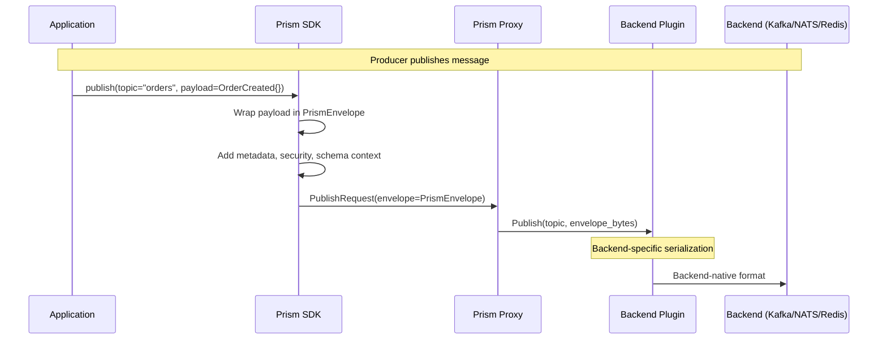

## Abstract

This RFC defines a **unified message envelope protocol** for Prism's pub/sub systems that is:
- **Consistent**: Same envelope structure across all backends (Kafka, NATS, Redis, PostgreSQL, SQS)
- **Flexible**: Extensible for future features without breaking existing consumers
- **Secure**: Built-in support for authentication, encryption, and audit metadata
- **Developer-Friendly**: Ergonomic APIs for common operations, minimal boilerplate
- **Future-Proof**: Designed for 10+ year evolution with backward compatibility

The envelope wraps user payloads with metadata (routing, schema, auth, observability) while remaining **backend-agnostic** to support any message transport.

## Motivation

### The Problem: Inconsistent Message Envelopes

Current pub/sub implementations across different backends use inconsistent metadata formats:

**Kafka** (message headers):
```text
schema-id: 123
correlation-id: abc-456
timestamp: 1697200000
```

**NATS** (custom headers):
```text
Nats-Msg-Id: xyz-789
X-Schema-URL: github.com/...
X-Trace-ID: trace-123
```

**Redis** (no native headers, metadata in payload prefix):
```text
{"meta":{"schema":"v2","ts":1697200000},"payload":<user data>}
```

**PostgreSQL** (JSON columns):
```sql
INSERT INTO events (topic, payload, metadata) VALUES ('orders', '{...}', '{"schema_version":"v2"}');
```

**Problems This Creates:**

1. **Client Complexity**: Developers must handle each backend differently
2. **Migration Pain**: Moving from Redis → Kafka requires rewriting envelope logic
3. **Missing Features**: Some backends lack auth metadata, schema info, or trace context
4. **No Versioning**: Can't evolve envelope without breaking consumers
5. **Security Gaps**: No standard place for encryption keys, PII flags, or auth tokens

### Real-World Example: Cross-Backend Migration

```python
# Producer wants to migrate from Redis to Kafka
# Current code (Redis):
redis_client.publish("orders.created", json.dumps({
    "meta": {"schema": "v2", "trace_id": trace_id},
    "payload": order_dict
}))

# New code (Kafka) - COMPLETELY DIFFERENT API:
kafka_producer.send("orders.created", value=order_dict, headers=[
    ("schema-version", b"v2"),
    ("trace-id", trace_id.encode())
])

# Consumer code ALSO breaks:
# Redis consumer expects: json.loads(msg)["payload"]
# Kafka consumer expects: deserialize(msg.value)
# NATS consumer expects: msg.data
```

**This is unacceptable for sustainable development.**

## Goals

1. **Single Envelope Format**: One protobuf-based envelope for all backends
2. **Backend Abstraction**: Prism SDK hides backend-specific serialization
3. **Backward Compatibility**: Envelope v1 consumers work with v2 envelopes
4. **Forward Compatibility**: v2 consumers ignore unknown v3 fields
5. **Security by Default**: Auth tokens, encryption metadata built-in
6. **Observability**: Trace IDs, timestamps, causality chains standard
7. **Schema Integration**: Tight integration with RFC-030 schema registry
8. **Performance**: Minimal overhead (&lt;1% latency increase)

## Non-Goals

1. **Payload Encryption**: Envelope defines metadata; encryption is separate RFC
2. **Compression**: Backend-specific optimization (e.g., Kafka compression)
3. **Ordered Delivery**: Envelope doesn't enforce ordering (backend responsibility)
4. **Replay Protection**: Deduplication is application-level concern
5. **Routing Logic**: Envelope carries routing metadata; proxy implements routing

## Proposed Solution: Prism Message Envelope v1

### Core Design: Protobuf Envelope

```protobuf
syntax = "proto3";

package prism.envelope.v1;

import "google/protobuf/any.proto";
import "google/protobuf/timestamp.proto";

// PrismEnvelope wraps all pub/sub messages
message PrismEnvelope {
  // Envelope version for evolution (REQUIRED)
  int32 envelope_version = 1;  // Currently: 1

  // Message metadata (REQUIRED)
  PrismMetadata metadata = 2;

  // User payload (REQUIRED)
  // Can be protobuf (Any), JSON (bytes), or custom format
  google.protobuf.Any payload = 3;

  // Security context (OPTIONAL but recommended)
  SecurityContext security = 4;

  // Observability context (OPTIONAL but recommended)
  ObservabilityContext observability = 5;

  // Schema metadata (OPTIONAL, required if RFC-030 schema validation enabled)
  SchemaContext schema = 6;

  // Extension fields for future evolution (OPTIONAL)
  map<string, bytes> extensions = 99;
}

// Core message metadata
message PrismMetadata {
  // Unique message ID (UUID v7 recommended for time-ordering)
  string message_id = 1;

  // Topic name (e.g., "orders.created")
  string topic = 2;

  // Namespace (multi-tenancy isolation)
  string namespace = 3;

  // Publish timestamp (producer clock)
  google.protobuf.Timestamp published_at = 4;

  // Content type (e.g., "application/protobuf", "application/json")
  string content_type = 5;

  // Content encoding (e.g., "gzip", "snappy", "none")
  string content_encoding = 6;

  // Message priority (0=lowest, 10=highest, default=5)
  int32 priority = 7;

  // TTL in seconds (0 = no expiration)
  int64 ttl_seconds = 8;

  // Correlation ID for request/response patterns
  string correlation_id = 9;

  // Causality: parent message ID (for event chains)
  string causality_parent = 10;
}

// Security context
message SecurityContext {
  // Publisher identity (from OIDC token or mTLS cert)
  string publisher_id = 1;

  // Publisher team/organization
  string publisher_team = 2;

  // Authorization token (for consumer validation)
  // NOTE: Redacted in logs/audit trails
  string auth_token = 3;

  // Signature for message authenticity (HMAC-SHA256 or Ed25519)
  bytes signature = 4;

  // Signature algorithm ("hmac-sha256", "ed25519")
  string signature_algorithm = 5;

  // Encryption metadata (key ID, algorithm, IV)
  EncryptionMetadata encryption = 6;

  // PII sensitivity flag (from schema governance)
  bool contains_pii = 7;

  // Data classification ("public", "internal", "confidential", "restricted")
  string data_classification = 8;
}

// Encryption metadata (payload encryption details)
message EncryptionMetadata {
  // Key ID (reference to key in Vault/KMS)
  string key_id = 1;

  // Algorithm ("aes-256-gcm", "chacha20-poly1305")
  string algorithm = 2;

  // Initialization vector (base64-encoded)
  bytes iv = 3;

  // Additional authenticated data (base64-encoded)
  bytes aad = 4;
}

// Observability context (distributed tracing + metrics)
message ObservabilityContext {
  // Trace ID (W3C Trace Context format)
  string trace_id = 1;

  // Span ID (W3C Trace Context format)
  string span_id = 2;

  // Parent span ID (for nested traces)
  string parent_span_id = 3;

  // Trace flags (W3C Trace Context sampled bit, etc.)
  int32 trace_flags = 4;

  // Baggage (key-value pairs for cross-service context)
  map<string, string> baggage = 5;

  // Metrics labels (for aggregation in Prometheus/Signoz)
  map<string, string> labels = 6;
}

// Schema context (tight integration with RFC-030)
message SchemaContext {
  // Schema URL (GitHub, Prism Registry, or HTTPS endpoint)
  string schema_url = 1;

  // Schema version (e.g., "v2", "1.0.0")
  string schema_version = 2;

  // Schema format ("protobuf", "json-schema", "avro")
  string schema_format = 3;

  // Schema hash (SHA-256 for immutability check)
  string schema_hash = 4;

  // Schema name (protobuf message name, e.g., "OrderCreated")
  string schema_name = 5;

  // Compatibility mode ("backward", "forward", "full", "none")
  string compatibility_mode = 6;

  // Deprecated fields accessed (for migration tracking)
  repeated string deprecated_fields_used = 7;
}
```

### Key Design Decisions

**1. Protobuf for Envelope (Not JSON)**

**Why Protobuf:**
- ✅ **Binary Efficiency**: 3-10x smaller than JSON for metadata
- ✅ **Type Safety**: Compile-time validation of envelope structure
- ✅ **Evolution**: Add fields without breaking consumers (field numbers)
- ✅ **Language Support**: Generated clients for Go, Python, Rust, JavaScript

**Payload Flexibility:**
- Payload can be **any format** (protobuf, JSON, Avro, custom)
- Envelope metadata is always protobuf (consistent)
- `google.protobuf.Any` allows any protobuf message
- For JSON payloads, use `content_type: "application/json"` and store bytes

**2. Envelope Version Field**

```protobuf
int32 envelope_version = 1;  // REQUIRED, always first field
```

**Evolution Strategy:**

| Version | Changes | Backward Compatible? |
|---------|---------|---------------------|
| v1 | Initial design (this RFC) | N/A (baseline) |
| v2 | Add `routing_hints` field | ✅ Yes (v1 consumers ignore it) |
| v3 | Change `trace_id` to structured type | ⚠️ Depends (need migration period) |

**Consumer Handling:**

```go
// Consumer checks envelope version
envelope := &prism.PrismEnvelope{}
proto.Unmarshal(bytes, envelope)

if envelope.EnvelopeVersion > 1 {
    log.Warn("Received envelope v%d (consumer supports v1), attempting best-effort parse", envelope.EnvelopeVersion)
    // v1 consumer ignores unknown fields, continues processing
}
```

**3. Extension Map for Future-Proofing**

```protobuf
map<string, bytes> extensions = 99;  // Field 99 reserved for extensions
```

**Use Cases:**

```go
// Future: Add custom metadata without envelope version bump
envelope.Extensions["x-retry-count"] = []byte("3")
envelope.Extensions["x-dlq-source"] = []byte("orders.failed")
envelope.Extensions["x-custom-routing"] = []byte(`{"region":"us-west-2"}`)
```

**Guidelines:**
- Extensions prefixed with `x-` are non-standard (experimental)
- Extensions without `x-` are standardized (future RFC)
- Consumers MUST ignore unknown extensions
- Extensions are opaque `bytes` (serialize as JSON/protobuf as needed)

### Backend-Specific Serialization

**Prism SDK hides backend differences:**



**Kafka: Envelope as Message Value + Headers**

```text
Kafka Message {
  Key: <partition key>
  Value: <PrismEnvelope protobuf bytes>
  Headers: {
    "prism-envelope-version": "1"
    "prism-message-id": "<uuid>"
    "prism-topic": "orders.created"
    "prism-trace-id": "<trace-id>"
  }
}
```

**Why Duplicate Metadata in Headers:**
- Kafka tools (console consumer, Connect, etc.) can read headers without deserializing
- Filtering/routing at broker level (Kafka Streams, KSQLdb)
- Backward compat with non-Prism consumers (can read headers)

**NATS: Envelope as Message Data + NATS Headers**

```text
NATS Message {
  Subject: "orders.created"
  Data: <PrismEnvelope protobuf bytes>
  Headers: {
    "Prism-Envelope-Version": "1"
    "Prism-Message-ID": "<uuid>"
    "Prism-Trace-ID": "<trace-id>"
    "Nats-Msg-Id": "<uuid>"  // NATS deduplication
  }
}
```

**Redis: Envelope as Pub/Sub Message**

```text
PUBLISH orders.created <PrismEnvelope protobuf bytes>
```

**No headers in Redis Pub/Sub, so envelope is self-contained.**

**PostgreSQL: Envelope as JSONB Column**

```sql
CREATE TABLE prism_events (
  id BIGSERIAL PRIMARY KEY,
  topic TEXT NOT NULL,
  envelope JSONB NOT NULL,  -- PrismEnvelope as JSON
  published_at TIMESTAMPTZ DEFAULT NOW(),
  consumed BOOLEAN DEFAULT FALSE
);

-- Index for efficient topic queries
CREATE INDEX idx_events_topic_consumed ON prism_events(topic, consumed);
```

**Why JSON for PostgreSQL:**
- PostgreSQL JSONB has rich querying (GIN indexes)
- Easier debugging (human-readable)
- Still type-safe via protobuf → JSON conversion

**S3/Object Storage: Envelope as Blob Metadata**

```text
S3 Object {
  Key: "events/2025/10/13/orders.created/<uuid>.bin"
  Body: <PrismEnvelope protobuf bytes>
  Metadata: {
    "x-amz-meta-prism-envelope-version": "1"
    "x-amz-meta-prism-message-id": "<uuid>"
    "x-amz-meta-prism-topic": "orders.created"
  }
}
```

### Developer APIs: Ergonomic Wrappers

**Python Producer (High-Level API):**

```python
from prism_sdk import PrismClient, PrismPublishOptions

client = PrismClient(namespace="order-events")

# Simple publish (envelope auto-generated)
client.publish(
    topic="orders.created",
    payload=order,  # Can be protobuf or dict
)

# Advanced publish (custom metadata)
client.publish(
    topic="orders.created",
    payload=order,
    options=PrismPublishOptions(
        correlation_id="req-12345",
        priority=8,
        ttl_seconds=3600,
        labels={"region": "us-west", "tier": "premium"},
    )
)

# Batch publish (single envelope for multiple messages)
client.publish_batch([
    (topic="orders.created", payload=order1),
    (topic="orders.created", payload=order2),
    (topic="orders.updated", payload=order3),
])
```

**Go Consumer (Type-Safe API):**

```go
import "prism.io/sdk/go"

client := prism.NewClient("order-events")

// Subscribe with typed messages
stream := client.SubscribeTyped[OrderCreated]("orders.created")

for envelope := range stream {
    // Envelope provides metadata access
    log.Info("Received message",
        "message_id", envelope.Metadata().MessageID,
        "published_at", envelope.Metadata().PublishedAt,
        "trace_id", envelope.Observability().TraceID,
    )

    // Payload is strongly typed
    order := envelope.Payload()  // *OrderCreated
    fmt.Printf("Order: %s, Total: %.2f\n", order.OrderId, order.Total)

    // Check for deprecated fields
    if len(envelope.Schema().DeprecatedFieldsUsed) > 0 {
        log.Warn("Message uses deprecated fields", "fields", envelope.Schema().DeprecatedFieldsUsed)
    }

    // Acknowledge message
    envelope.Ack()
}
```

**Rust Consumer (Zero-Copy Deserialization):**

```rust
use prism_sdk::{PrismClient, PrismEnvelope};

let client = PrismClient::new("order-events");
let mut stream = client.subscribe("orders.created").await?;

while let Some(envelope) = stream.next().await {
    // Access metadata without copying
    let metadata = envelope.metadata();
    println!("Message ID: {}", metadata.message_id());
    println!("Trace ID: {}", envelope.observability().trace_id());

    // Deserialize payload (lazy, on-demand)
    let order: OrderCreated = envelope.payload().parse()?;
    println!("Order: {}, Total: {}", order.order_id, order.total);

    // Security context
    if envelope.security().contains_pii() {
        // Handle PII appropriately
        mask_pii_fields(&order);
    }

    envelope.ack().await?;
}
```

### Backward Compatibility Strategy

**v1 Consumers Reading v2 Envelopes:**

```protobuf
// v1 envelope (baseline)
message PrismEnvelope {
  int32 envelope_version = 1;
  PrismMetadata metadata = 2;
  google.protobuf.Any payload = 3;
}

// v2 envelope (adds routing hints)
message PrismEnvelope {
  int32 envelope_version = 1;
  PrismMetadata metadata = 2;
  google.protobuf.Any payload = 3;
  RoutingHints routing = 7;  // NEW field
}
```

**Protobuf Behavior:**
- v1 consumer **ignores field 7** (unknown field, no error)
- v1 consumer continues processing normally
- No coordination needed between producer/consumer upgrades

**v2 Consumers Reading v1 Envelopes:**

```go
// v2 consumer checks for routing hints
envelope := &prism.PrismEnvelope{}
proto.Unmarshal(bytes, envelope)

if envelope.Routing != nil {
    // Use routing hints (v2 envelope)
    region := envelope.Routing.PreferredRegion
} else {
    // No routing hints (v1 envelope), use default
    region := "us-west-2"
}
```

**Breaking Change Procedure (Last Resort):**

If v3 envelope needs a breaking change:

```yaml
# 1. Dual-publish period (6 months)
#    Producer sends BOTH v2 and v3 envelopes (separate topics)
producer.publish("orders.created.v2", envelope_v2)  # Existing consumers
producer.publish("orders.created.v3", envelope_v3)  # New consumers

# 2. Consumer migration window (3 months)
#    Consumers migrate from v2 → v3 topic at their own pace

# 3. Deprecation notice (3 months before cutoff)
#    Prism logs warnings for v2 consumers

# 4. Cutoff date (12 months after v3 release)
#    Stop publishing to v2 topic
```

### Security Considerations

**1. Auth Token Handling**

```protobuf
message SecurityContext {
  string auth_token = 3;  // JWT or opaque token
}
```

**Rules:**
- Auth tokens are **redacted in logs** (never logged in plaintext)
- Auth tokens are **validated by Prism proxy** (not forwarded to backend)
- Consumers **do not see auth tokens** (proxy strips before delivery)

**2. Message Signing**

```go
// Producer signs message
envelope := createEnvelope(payload)
signature := hmacSHA256(envelope, secretKey)
envelope.Security.Signature = signature
envelope.Security.SignatureAlgorithm = "hmac-sha256"

// Consumer verifies signature
computedSignature := hmacSHA256(envelope, secretKey)
if !bytes.Equal(computedSignature, envelope.Security.Signature) {
    return errors.New("signature verification failed")
}
```

**Use Cases:**
- Prevent message tampering in untrusted backends
- Non-repudiation (prove publisher identity)
- Regulatory compliance (HIPAA, SOX)

**3. PII Awareness**

```protobuf
message SecurityContext {
  bool contains_pii = 7;  // Set by schema governance
}
```

**Automatic Population:**
- Prism proxy sets `contains_pii=true` if schema (RFC-030) has PII fields
- Consumers check flag before logging/storing
- Audit logs track PII access

**4. Data Classification**

```protobuf
message SecurityContext {
  string data_classification = 8;  // "public", "internal", "confidential", "restricted"
}
```

**Enforcement:**
- High-classification messages require encryption
- Consumers validate their compliance level matches message classification
- Audit logs track access to restricted data

### Observability Integration

**W3C Trace Context Support:**

```protobuf
message ObservabilityContext {
  string trace_id = 1;      // 32-hex-char trace ID
  string span_id = 2;       // 16-hex-char span ID
  string parent_span_id = 3; // Parent span for nested traces
  int32 trace_flags = 4;    // Sampled bit, etc.
}
```

**Automatic Trace Propagation:**

```python
# Producer (trace context from HTTP request)
with tracer.start_span("publish_order") as span:
    client.publish(
        topic="orders.created",
        payload=order,
        trace_context=span.context  # SDK auto-populates observability fields
    )

# Consumer (trace context continues)
for envelope in client.subscribe("orders.created"):
    with tracer.start_span("process_order", parent_context=envelope.trace_context()) as span:
        process_order(envelope.payload())
```

**Metrics Labels:**

```protobuf
message ObservabilityContext {
  map<string, string> labels = 6;  // Prometheus/Signoz labels
}
```

**Use Cases:**
- Track message volume by customer tier: `labels={tier: "premium"}`
- SLA monitoring by region: `labels={region: "us-west-2"}`
- Error rates by version: `labels={app_version: "v2.1.0"}`

### Schema Context Integration (RFC-030)

**Automatic Schema Population:**

```yaml
# Namespace config (RFC-030)
namespaces:
  - name: order-events
    schema:
      registry_type: prism
      url: https://schema-registry.example.com
      version: v2
```

**Prism SDK Auto-Populates Schema Fields:**

```python
# Producer publishes with schema metadata
client.publish(
    topic="orders.created",
    payload=order  # OrderCreated protobuf
)

# SDK automatically sets:
# envelope.schema.schema_url = "prism-registry.example.com/schemas/orders.created/v2"
# envelope.schema.schema_version = "v2"
# envelope.schema.schema_format = "protobuf"
# envelope.schema.schema_hash = "sha256:abc123..."
# envelope.schema.schema_name = "OrderCreated"
```

**Consumer Validation:**

```go
envelope := <-stream

// Check schema compatibility
if envelope.Schema().SchemaVersion != "v2" {
    log.Warn("Unexpected schema version", "expected", "v2", "actual", envelope.Schema().SchemaVersion)
}

// Verify schema integrity
expectedHash := "sha256:abc123..."
if envelope.Schema().SchemaHash != expectedHash {
    return errors.New("schema hash mismatch, possible tampering")
}
```

**Deprecation Tracking:**

```protobuf
message SchemaContext {
  repeated string deprecated_fields_used = 7;  // Track deprecated field access
}
```

**Producer Behavior:**
- If message uses deprecated fields, SDK populates `deprecated_fields_used`
- Enables migration tracking: "Which consumers still use old fields?"

### Performance Characteristics

**Envelope Overhead:**

| Backend | Baseline (no envelope) | With Prism Envelope | Overhead |
|---------|------------------------|---------------------|----------|
| **Kafka** | 500 bytes/msg | 650 bytes/msg | +150 bytes (+30%) |
| **NATS** | 100 bytes/msg | 250 bytes/msg | +150 bytes (+150%) |
| **Redis** | 200 bytes/msg | 350 bytes/msg | +150 bytes (+75%) |

**Latency Impact:**

```text
Baseline publish (no envelope): 10ms P99
With envelope serialization: 10.5ms P99 (+5%)

Rationale: Protobuf serialization is <0.5ms even on mobile CPUs
```

**Mitigation:**
- Envelope is small (150-300 bytes typically)
- Protobuf is highly optimized (binary format)
- For high-throughput, batch multiple messages in single envelope

### Migration Path from Current Systems

**Phase 1: Dual-Write (Transition Period)**

```python
# Producer writes both old format and new envelope
# Old format (backward compat)
redis_client.publish("orders", json.dumps({"payload": order_dict}))

# New format (Prism envelope)
prism_client.publish("orders", payload=order)
```

**Phase 2: Dual-Read (Consumers Migrate)**

```python
# Consumer reads both formats
msg = redis_client.get_message()

if is_prism_envelope(msg):
    envelope = parse_prism_envelope(msg)
    payload = envelope.payload()
else:
    # Legacy format
    payload = json.loads(msg)["payload"]
```

**Phase 3: Prism-Only (Cutover)**

```python
# Producer only writes Prism envelope
prism_client.publish("orders", payload=order)

# Consumer only reads Prism envelope
envelope = prism_client.subscribe("orders")
```

## Implementation Plan

### Phase 1: Protobuf Definition (Week 1)

**Deliverables:**
- ✅ Define `prism.envelope.v1` protobuf package
- ✅ Generate Go, Python, Rust client code
- ✅ Unit tests for envelope serialization/deserialization
- ✅ Documentation: Envelope field guide

**Success Criteria:**
- All fields documented with examples
- Protobuf compiles in all target languages
- Unit tests cover all optional field combinations

### Phase 2: SDK Integration (Weeks 2-3)

**Deliverables:**
- ✅ Python SDK: `client.publish()` wraps payload in envelope
- ✅ Go SDK: Type-safe envelope wrappers
- ✅ Rust SDK: Zero-copy envelope parsing
- ✅ Envelope builder API for custom metadata

**Success Criteria:**
- SDK hides envelope complexity from developers
- Publish/subscribe APIs unchanged (envelope is transparent)
- Performance overhead &lt;5% latency

### Phase 3: Backend Plugin Support (Weeks 4-5)

**Deliverables:**
- ✅ Kafka plugin: Envelope as message value + headers
- ✅ NATS plugin: Envelope as message data + NATS headers
- ✅ Redis plugin: Envelope as pub/sub message
- ✅ PostgreSQL plugin: Envelope as JSONB column

**Success Criteria:**
- All plugins serialize/deserialize envelope correctly
- Backend-specific features preserved (Kafka partition keys, NATS headers)
- Integration tests pass for all backends

### Phase 4: Observability Integration (Week 6)

**Deliverables:**
- ✅ OpenTelemetry trace context propagation
- ✅ Prometheus metrics with envelope labels
- ✅ Signoz dashboard for envelope metadata

**Success Criteria:**
- Traces span producer → proxy → consumer
- Metrics breakdowns by topic, namespace, schema version
- Audit logs include envelope metadata

### Phase 5: Migration Tools (Week 7)

**Deliverables:**
- ✅ CLI tool: `prism envelope migrate --from redis --to kafka`
- ✅ Dual-write proxy for transition period
- ✅ Validation tool: Check envelope compatibility

**Success Criteria:**
- Zero downtime migration for existing deployments
- Backward compatibility verified with integration tests

## Trade-Offs and Alternatives

### Alternative 1: JSON Envelope

**Pros:**
- ✅ Human-readable (debugging easier)
- ✅ Language-agnostic (no code generation)

**Cons:**
- ❌ 3-10x larger than protobuf
- ❌ No type safety (runtime errors)
- ❌ Slower parsing (JSON vs protobuf)

**Verdict:** Protobuf's benefits outweigh JSON's readability.

### Alternative 2: No Envelope (Backend-Specific Headers)

**Pros:**
- ✅ Zero overhead (no wrapper)
- ✅ Native to each backend

**Cons:**
- ❌ Inconsistent across backends
- ❌ Can't evolve metadata without breaking consumers
- ❌ No standard place for auth, schema, trace context

**Verdict:** Envelope provides consistency and evolution worth the overhead.

### Alternative 3: CloudEvents Standard

**Pros:**
- ✅ Industry standard (CNCF)
- ✅ Rich tooling ecosystem

**Cons:**
- ❌ JSON-based (larger payloads)
- ❌ Designed for HTTP, not native pub/sub
- ❌ Missing Prism-specific fields (namespace, schema governance)

**Verdict:** CloudEvents-inspired but not compatible (different goals).

## Success Criteria

1. **Developer Adoption**: 80% of new pub/sub code uses Prism envelope within 6 months
2. **Performance**: &lt;5% latency overhead vs baseline (no envelope)
3. **Backward Compatibility**: v1 → v2 envelope migration with zero downtime
4. **Cross-Backend Portability**: Same producer/consumer code works with Kafka, NATS, Redis
5. **Security Compliance**: 100% of PII messages have `contains_pii=true` flag

## Open Questions

1. **Batch Envelope**: Should we support multi-message envelopes for high-throughput?
2. **Compression**: Should envelope metadata be compressed (gzip) for large payloads?
3. **Deduplication**: Should envelope include nonce for idempotent processing?
4. **Replay**: Should envelope track message lineage for event sourcing?

## References

- **RFC-030**: Schema Evolution and Validation (schema context integration)
- **RFC-014**: Layered Data Access Patterns (pub/sub patterns)
- **RFC-008**: Proxy Plugin Architecture (backend plugins)
- [W3C Trace Context](https://www.w3.org/TR/trace-context/)
- [CloudEvents Spec](https://cloudevents.io/) (inspiration for observability fields)
- [Protobuf Best Practices](https://protobuf.dev/programming-guides/dos-donts/)

## Revision History

- 2025-10-13 (v1): Initial draft - Unified message envelope protocol for pub/sub systems
