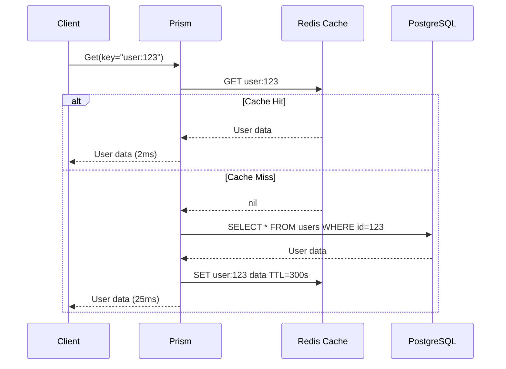
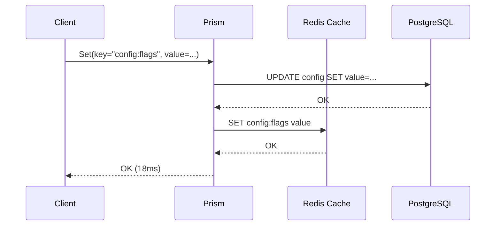
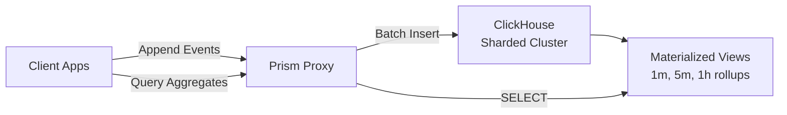
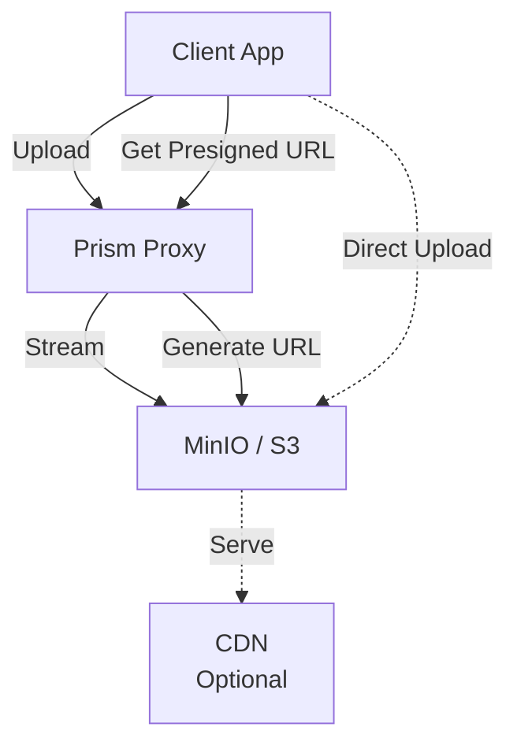
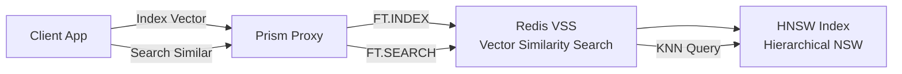
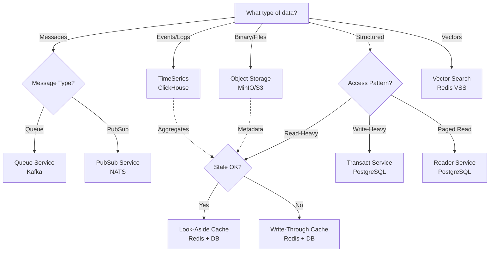
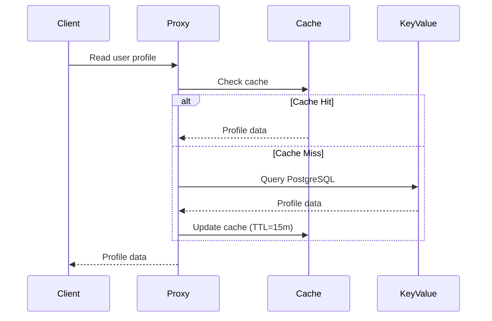
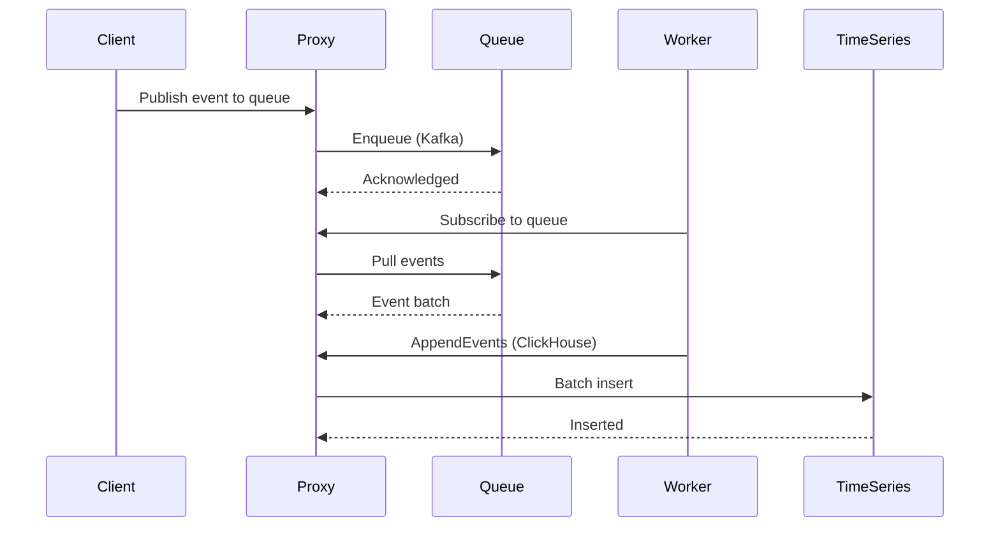

## Abstract

This RFC specifies the complete data layer interface for Prism, defining all gRPC services, message formats, error handling, and client patterns. The interface provides a unified API for accessing heterogeneous backends through five core abstractions: Sessions, Queues, PubSub, Readers, and Transactions.

## 1. Introduction

### 1.1 Purpose

The Prism data layer interface provides:

1. **Unified API**: Single gRPC interface for all data operations
2. **Type Safety**: Protobuf-defined messages with code generation
3. **Streaming**: First-class support for server/client/bidirectional streaming
4. **Abstraction**: Backend-agnostic operations that map to multiple implementations
5. **Evolution**: Forward/backward compatibility through versioned APIs

### 1.2 Design Principles

- **Session-based**: All operations require authenticated session
- **Layered**: Progressive disclosure from basic to specialized
- **Streaming-first**: Use streaming for pagination, pub/sub, transactions
- **Typed**: All requests/responses strongly typed via protobuf
- **Versioned**: APIs versioned (v1, v2, etc.) for evolution

### 1.3 Service Overview

┌────────────────────────────────────────────┐
│           Session Service (v1)             │
│  - CreateSession, CloseSession, Heartbeat  │
└────────────────┬───────────────────────────┘
                 │
     ┌───────────┴───────────┐
     │                       │
┌────▼────────┐      ┌───────▼────────┐
│Queue Service│      │PubSub Service  │
│    (v1)     │      │     (v1)       │
└─────────────┘      └────────────────┘
     │                       │
┌────▼────────┐      ┌───────▼────────┐
│Reader       │      │Transact Service│
│Service (v1) │      │     (v1)       │
└─────────────┘      └────────────────┘
```text

## 2. Session Service

### 2.1 Overview

Foundation service for authentication, authorization, and connection management.

### 2.2 Service Definition

```
syntax = "proto3";

package prism.session.v1;

import "google/protobuf/timestamp.proto";
import "google/protobuf/duration.proto";
import "prism/config/v1/client_config.proto";

service SessionService {
  // Create new authenticated session
  rpc CreateSession(CreateSessionRequest) returns (CreateSessionResponse);

  // Close session and release resources
  rpc CloseSession(CloseSessionRequest) returns (CloseSessionResponse);

  // Heartbeat to keep session alive
  rpc Heartbeat(HeartbeatRequest) returns (HeartbeatResponse);

  // Get session metadata
  rpc GetSession(GetSessionRequest) returns (GetSessionResponse);

  // Refresh session (extend expiration)
  rpc RefreshSession(RefreshSessionRequest) returns (RefreshSessionResponse);
}
```text

### 2.3 Messages

```
message CreateSessionRequest {
  // Authentication credentials
  oneof auth {
    string api_key = 1;
    string jwt_token = 2;
    MutualTLSAuth mtls = 3;
  }

  // Client configuration
  oneof config {
    string config_name = 4;              // Use named config
    prism.config.v1.ClientConfig inline_config = 5;  // Inline config
  }

  // Client metadata
  string client_id = 6;
  string client_version = 7;
  map<string, string> metadata = 8;
}

message MutualTLSAuth {
  bytes client_cert = 1;
}

message CreateSessionResponse {
  // Session token for subsequent requests
  string session_token = 1;

  // Session metadata
  string session_id = 2;
  google.protobuf.Timestamp created_at = 3;
  google.protobuf.Timestamp expires_at = 4;

  // Resolved configuration
  prism.config.v1.ClientConfig config = 5;

  // Server capabilities
  repeated string supported_features = 6;
}

message CloseSessionRequest {
  string session_token = 1;
  bool force = 2;  // Force close even with pending operations
}

message CloseSessionResponse {
  bool success = 1;
  string message = 2;
  int32 pending_operations = 3;  // Count of operations not completed
}

message HeartbeatRequest {
  string session_token = 1;
}

message HeartbeatResponse {
  google.protobuf.Timestamp server_time = 1;
  google.protobuf.Duration ttl = 2;  // Time until session expires
  SessionStatus status = 3;
}

enum SessionStatus {
  SESSION_STATUS_UNSPECIFIED = 0;
  SESSION_STATUS_ACTIVE = 1;
  SESSION_STATUS_EXPIRING = 2;      // Near expiration
  SESSION_STATUS_READ_ONLY = 3;     // Read operations only
  SESSION_STATUS_TERMINATING = 4;   // Shutting down
}

message GetSessionRequest {
  string session_token = 1;
}

message GetSessionResponse {
  string session_id = 1;
  SessionStatus status = 2;
  google.protobuf.Timestamp created_at = 3;
  google.protobuf.Timestamp expires_at = 4;
  google.protobuf.Timestamp last_activity = 5;
  prism.config.v1.ClientConfig config = 6;
  SessionMetrics metrics = 7;
}

message SessionMetrics {
  int64 requests_processed = 1;
  int64 bytes_sent = 2;
  int64 bytes_received = 3;
  int32 active_streams = 4;
}

message RefreshSessionRequest {
  string session_token = 1;
  google.protobuf.Duration extension = 2;  // How long to extend
}

message RefreshSessionResponse {
  google.protobuf.Timestamp new_expires_at = 1;
}
```text

### 2.4 Usage Examples

**Create Session (Named Config):**
```
client := session.NewSessionServiceClient(conn)

resp, err := client.CreateSession(ctx, &session.CreateSessionRequest{
    Auth: &session.CreateSessionRequest_ApiKey{
        ApiKey: "key-123",
    },
    Config: &session.CreateSessionRequest_ConfigName{
        ConfigName: "user-profiles",
    },
    ClientId: "app-service-v1",
    ClientVersion: "1.0.0",
})

sessionToken := resp.SessionToken
```text

**Heartbeat Loop:**
```
ticker := time.NewTicker(30 * time.Second)
defer ticker.Stop()

for {
    select {
    case <-ticker.C:
        resp, err := client.Heartbeat(ctx, &session.HeartbeatRequest{
            SessionToken: sessionToken,
        })
        if err != nil {
            log.Error("heartbeat failed", err)
            return
        }
        log.Debug("heartbeat ok", "ttl", resp.Ttl)
    case <-done:
        return
    }
}
```text

## 3. Queue Service

### 3.1 Overview

Kafka-style message queue operations with topics, partitions, and offsets.

### 3.2 Service Definition

```
syntax = "proto3";

package prism.queue.v1;

import "google/protobuf/timestamp.proto";
import "google/protobuf/duration.proto";

service QueueService {
  // Publish message to topic
  rpc Publish(PublishRequest) returns (PublishResponse);

  // Publish batch of messages
  rpc PublishBatch(PublishBatchRequest) returns (PublishBatchResponse);

  // Subscribe to topic (server streaming)
  rpc Subscribe(SubscribeRequest) returns (stream Message);

  // Acknowledge message processing
  rpc Acknowledge(AcknowledgeRequest) returns (AcknowledgeResponse);

  // Commit offset for consumer group
  rpc Commit(CommitRequest) returns (CommitResponse);

  // Seek to specific offset
  rpc Seek(SeekRequest) returns (SeekResponse);

  // Get topic metadata
  rpc GetTopicInfo(GetTopicInfoRequest) returns (GetTopicInfoResponse);
}
```text

### 3.3 Messages

```
message PublishRequest {
  string session_token = 1;
  string topic = 2;
  bytes payload = 3;
  map<string, string> headers = 4;
  optional string partition_key = 5;
  optional int32 partition = 6;  // Explicit partition
}

message PublishResponse {
  string message_id = 1;
  int64 offset = 2;
  int32 partition = 3;
  google.protobuf.Timestamp timestamp = 4;
}

message PublishBatchRequest {
  string session_token = 1;
  string topic = 2;
  repeated BatchMessage messages = 3;
}

message BatchMessage {
  bytes payload = 1;
  map<string, string> headers = 2;
  optional string partition_key = 3;
}

message PublishBatchResponse {
  repeated PublishResponse results = 1;
  int32 success_count = 2;
  int32 failure_count = 3;
}

message SubscribeRequest {
  string session_token = 1;
  string topic = 2;
  string consumer_group = 3;

  // Starting position
  oneof start_position {
    int64 offset = 4;
    google.protobuf.Timestamp timestamp = 5;
    StartPosition position = 6;
  }

  // Flow control
  optional int32 max_messages = 7;
  optional google.protobuf.Duration timeout = 8;
}

enum StartPosition {
  START_POSITION_UNSPECIFIED = 0;
  START_POSITION_EARLIEST = 1;
  START_POSITION_LATEST = 2;
  START_POSITION_COMMITTED = 3;  // Last committed offset
}

message Message {
  string message_id = 1;
  string topic = 2;
  int32 partition = 3;
  int64 offset = 4;
  bytes payload = 5;
  map<string, string> headers = 6;
  google.protobuf.Timestamp timestamp = 7;

  // Metadata
  optional string producer_id = 8;
  optional int32 attempt = 9;  // For retries
}

message AcknowledgeRequest {
  string session_token = 1;
  repeated string message_ids = 2;
}

message AcknowledgeResponse {
  int32 acknowledged_count = 1;
  repeated string failed_ids = 2;
}

message CommitRequest {
  string session_token = 1;
  string topic = 2;
  string consumer_group = 3;
  repeated PartitionOffset offsets = 4;
}

message PartitionOffset {
  int32 partition = 1;
  int64 offset = 2;
}

message CommitResponse {
  bool success = 1;
  repeated PartitionOffset committed = 2;
}

message SeekRequest {
  string session_token = 1;
  string topic = 2;
  string consumer_group = 3;
  repeated PartitionOffset positions = 4;
}

message SeekResponse {
  bool success = 1;
}

message GetTopicInfoRequest {
  string session_token = 1;
  string topic = 2;
}

message GetTopicInfoResponse {
  string topic = 1;
  int32 partition_count = 2;
  int64 message_count = 3;
  repeated PartitionInfo partitions = 4;
}

message PartitionInfo {
  int32 partition = 1;
  int64 earliest_offset = 2;
  int64 latest_offset = 3;
  int64 message_count = 4;
}
```text

### 3.4 Usage Examples

**Publish:**
```
let response = client.publish(PublishRequest {
    session_token: token.clone(),
    topic: "events".to_string(),
    payload: serde_json::to_vec(&event)?,
    headers: headers,
    partition_key: Some(user_id),
    ..Default::default()
}).await?;

println!("Published to partition {} offset {}",
    response.partition, response.offset);
```text

**Subscribe (Streaming):**
```
let mut stream = client.subscribe(SubscribeRequest {
    session_token: token.clone(),
    topic: "events".to_string(),
    consumer_group: "processors".to_string(),
    start_position: Some(
        subscribe_request::StartPosition::Position(StartPosition::Latest as i32)
    ),
    ..Default::default()
}).await?.into_inner();

while let Some(message) = stream.message().await? {
    process_message(&message).await?;

    client.acknowledge(AcknowledgeRequest {
        session_token: token.clone(),
        message_ids: vec![message.message_id],
    }).await?;
}
```text

## 4. PubSub Service

### 4.1 Overview

NATS-style publish-subscribe with topic patterns and wildcards.

### 4.2 Service Definition

```
syntax = "proto3";

package prism.pubsub.v1;

import "google/protobuf/timestamp.proto";

service PubSubService {
  // Publish event to topic
  rpc Publish(PublishRequest) returns (PublishResponse);

  // Subscribe to topic pattern (server streaming)
  rpc Subscribe(SubscribeRequest) returns (stream Event);

  // Unsubscribe from topic pattern
  rpc Unsubscribe(UnsubscribeRequest) returns (UnsubscribeResponse);

  // List active subscriptions
  rpc ListSubscriptions(ListSubscriptionsRequest) returns (ListSubscriptionsResponse);
}
```text

### 4.3 Messages

```
message PublishRequest {
  string session_token = 1;
  string topic = 2;  // e.g., "events.user.created"
  bytes payload = 3;
  map<string, string> metadata = 4;
  optional string correlation_id = 5;
  optional string reply_to = 6;  // For request-reply pattern
}

message PublishResponse {
  string event_id = 1;
  google.protobuf.Timestamp published_at = 2;
  int32 subscriber_count = 3;  // How many subscribers received it
}

message SubscribeRequest {
  string session_token = 1;
  string topic_pattern = 2;  // e.g., "events.user.*", "events.>"
  optional string queue_group = 3;  // For load balancing
  SubscriptionOptions options = 4;
}

message SubscriptionOptions {
  bool auto_acknowledge = 1;  // Auto-ack on delivery
  optional int32 max_messages = 2;  // Limit total messages
  optional google.protobuf.Duration max_duration = 3;  // Subscription timeout
}

message Event {
  string event_id = 1;
  string topic = 2;
  bytes payload = 3;
  map<string, string> metadata = 4;
  google.protobuf.Timestamp timestamp = 5;

  // Request-reply support
  optional string correlation_id = 6;
  optional string reply_to = 7;

  // Subscription info
  string subscription_id = 8;
}

message UnsubscribeRequest {
  string session_token = 1;
  string subscription_id = 2;
}

message UnsubscribeResponse {
  bool success = 1;
}

message ListSubscriptionsRequest {
  string session_token = 1;
}

message ListSubscriptionsResponse {
  repeated Subscription subscriptions = 1;
}

message Subscription {
  string subscription_id = 1;
  string topic_pattern = 2;
  optional string queue_group = 3;
  google.protobuf.Timestamp created_at = 4;
  int64 messages_received = 5;
  bool active = 6;
}
```text

### 4.4 Usage Examples

**Subscribe with Wildcard:**
```
stream, err := client.Subscribe(ctx, &pubsub.SubscribeRequest{
    SessionToken: token,
    TopicPattern: "events.user.*",  // Match all user events
    QueueGroup: "processors",        // Load balance across group
    Options: &pubsub.SubscriptionOptions{
        AutoAcknowledge: true,
    },
})

for {
    event, err := stream.Recv()
    if err == io.EOF {
        break
    }
    if err != nil {
        log.Error("stream error", err)
        break
    }

    log.Info("received event", "topic", event.Topic, "id", event.EventId)
    processEvent(event)
}
```text

## 5. Reader Service

### 5.1 Overview

Database-style paged reading with queries and filters.

### 5.2 Service Definition

```
syntax = "proto3";

package prism.reader.v1;

import "google/protobuf/struct.proto";
import "google/protobuf/timestamp.proto";

service ReaderService {
  // Read pages of data (server streaming)
  rpc Read(ReadRequest) returns (stream Page);

  // Query with filters (server streaming)
  rpc Query(QueryRequest) returns (stream Row);

  // Count matching records
  rpc Count(CountRequest) returns (CountResponse);

  // Get single record by ID
  rpc Get(GetRequest) returns (GetResponse);
}
```text

### 5.3 Messages

```
message ReadRequest {
  string session_token = 1;
  string collection = 2;
  int32 page_size = 3;
  optional string cursor = 4;  // Continuation token
  repeated string fields = 5;  // Projection (empty = all fields)
  optional Filter filter = 6;
  repeated Sort sort = 7;
}

message Page {
  repeated Row rows = 1;
  optional string next_cursor = 2;
  bool has_more = 3;
  PageMetadata metadata = 4;
}

message PageMetadata {
  int32 row_count = 1;
  int32 page_number = 2;
  google.protobuf.Timestamp generated_at = 3;
}

message Row {
  map<string, google.protobuf.Value> fields = 1;
  optional RowMetadata metadata = 2;
}

message RowMetadata {
  google.protobuf.Timestamp created_at = 1;
  google.protobuf.Timestamp updated_at = 2;
  string version = 3;  // For optimistic locking
}

message QueryRequest {
  string session_token = 1;
  string collection = 2;
  Filter filter = 3;
  repeated Sort sort = 4;
  optional int32 limit = 5;
  optional int32 offset = 6;
  repeated string fields = 7;
}

message Filter {
  oneof filter {
    FieldFilter field = 1;
    CompositeFilter composite = 2;
  }
}

message FieldFilter {
  string field = 1;
  Operator op = 2;
  google.protobuf.Value value = 3;

  enum Operator {
    OPERATOR_UNSPECIFIED = 0;
    OPERATOR_EQUALS = 1;
    OPERATOR_NOT_EQUALS = 2;
    OPERATOR_GREATER_THAN = 3;
    OPERATOR_GREATER_THAN_OR_EQUALS = 4;
    OPERATOR_LESS_THAN = 5;
    OPERATOR_LESS_THAN_OR_EQUALS = 6;
    OPERATOR_IN = 7;
    OPERATOR_NOT_IN = 8;
    OPERATOR_CONTAINS = 9;
    OPERATOR_STARTS_WITH = 10;
    OPERATOR_ENDS_WITH = 11;
  }
}

message CompositeFilter {
  LogicalOperator op = 1;
  repeated Filter filters = 2;

  enum LogicalOperator {
    LOGICAL_OPERATOR_UNSPECIFIED = 0;
    LOGICAL_OPERATOR_AND = 1;
    LOGICAL_OPERATOR_OR = 2;
    LOGICAL_OPERATOR_NOT = 3;
  }
}

message Sort {
  string field = 1;
  Direction direction = 2;

  enum Direction {
    DIRECTION_UNSPECIFIED = 0;
    DIRECTION_ASC = 1;
    DIRECTION_DESC = 2;
  }
}

message CountRequest {
  string session_token = 1;
  string collection = 2;
  optional Filter filter = 3;
}

message CountResponse {
  int64 count = 1;
}

message GetRequest {
  string session_token = 1;
  string collection = 2;
  string id = 3;
  repeated string fields = 4;
}

message GetResponse {
  optional Row row = 1;
  bool found = 2;
}
```text

### 5.4 Usage Examples

**Paged Reading:**
```
stream = client.Read(reader_pb2.ReadRequest(
    session_token=token,
    collection="users",
    page_size=100,
    fields=["id", "name", "email"],
    sort=[
        reader_pb2.Sort(field="created_at", direction=reader_pb2.Sort.DIRECTION_DESC)
    ]
))

for page in stream:
    for row in page.rows:
        user_id = row.fields["id"].string_value
        name = row.fields["name"].string_value
        print(f"User: {user_id} - {name}")

    if not page.has_more:
        break
```text

**Query with Filter:**
```
# Complex filter: active users created in last 30 days
filter = reader_pb2.Filter(
    composite=reader_pb2.CompositeFilter(
        op=reader_pb2.CompositeFilter.LOGICAL_OPERATOR_AND,
        filters=[
            reader_pb2.Filter(
                field=reader_pb2.FieldFilter(
                    field="status",
                    op=reader_pb2.FieldFilter.OPERATOR_EQUALS,
                    value=Value(string_value="active")
                )
            ),
            reader_pb2.Filter(
                field=reader_pb2.FieldFilter(
                    field="created_at",
                    op=reader_pb2.FieldFilter.OPERATOR_GREATER_THAN,
                    value=Value(string_value="2025-09-07T00:00:00Z")
                )
            )
        ]
    )
)

stream = client.Query(reader_pb2.QueryRequest(
    session_token=token,
    collection="users",
    filter=filter,
    limit=1000
))

for row in stream:
    process_user(row)
```text

## 6. Transact Service

### 6.1 Overview

Transactional writes across two tables (inbox/outbox pattern).

### 6.2 Service Definition

```
syntax = "proto3";

package prism.transact.v1;

import "google/protobuf/struct.proto";
import "google/protobuf/timestamp.proto";

service TransactService {
  // Single transactional write
  rpc Write(WriteRequest) returns (WriteResponse);

  // Streaming transaction (begin, writes, commit/rollback)
  rpc Transaction(stream TransactRequest) returns (stream TransactResponse);

  // Read mailbox messages
  rpc ReadMailbox(ReadMailboxRequest) returns (stream MailboxMessage);

  // Mark mailbox messages as processed
  rpc ProcessMailbox(ProcessMailboxRequest) returns (ProcessMailboxResponse);
}
```text

### 6.3 Messages

```
message WriteRequest {
  string session_token = 1;

  // Data table write
  DataWrite data = 2;

  // Mailbox table write
  MailboxWrite mailbox = 3;

  // Transaction options
  TransactionOptions options = 4;
}

message DataWrite {
  string table = 1;
  map<string, google.protobuf.Value> record = 2;
  WriteMode mode = 3;
  optional string id_field = 4;  // For updates

  enum WriteMode {
    WRITE_MODE_UNSPECIFIED = 0;
    WRITE_MODE_INSERT = 1;
    WRITE_MODE_UPDATE = 2;
    WRITE_MODE_UPSERT = 3;
    WRITE_MODE_DELETE = 4;
  }
}

message MailboxWrite {
  string mailbox_id = 1;
  bytes message = 2;
  map<string, string> metadata = 3;
  optional string message_type = 4;
  optional int32 priority = 5;
}

message TransactionOptions {
  IsolationLevel isolation = 1;
  int32 timeout_ms = 2;
  bool idempotent = 3;  // Safe to retry
  optional string idempotency_key = 4;

  enum IsolationLevel {
    ISOLATION_LEVEL_UNSPECIFIED = 0;
    ISOLATION_LEVEL_READ_COMMITTED = 1;
    ISOLATION_LEVEL_REPEATABLE_READ = 2;
    ISOLATION_LEVEL_SERIALIZABLE = 3;
  }
}

message WriteResponse {
  string transaction_id = 1;
  bool committed = 2;
  DataWriteResult data_result = 3;
  MailboxWriteResult mailbox_result = 4;
  google.protobuf.Timestamp timestamp = 5;
}

message DataWriteResult {
  int64 rows_affected = 1;
  map<string, google.protobuf.Value> generated_values = 2;  // Auto-generated IDs, etc.
}

message MailboxWriteResult {
  string message_id = 1;
  int64 sequence = 2;
}

// Streaming transaction messages
message TransactRequest {
  oneof request {
    BeginTransaction begin = 1;
    WriteRequest write = 2;
    CommitTransaction commit = 3;
    RollbackTransaction rollback = 4;
  }
}

message BeginTransaction {
  string session_token = 1;
  TransactionOptions options = 2;
}

message CommitTransaction {
  // Empty - just signals commit
}

message RollbackTransaction {
  string reason = 1;
}

message TransactResponse {
  oneof response {
    TransactionStarted started = 1;
    WriteResponse write_result = 2;
    TransactionCommitted committed = 3;
    TransactionRolledBack rolled_back = 4;
    TransactionError error = 5;
  }
}

message TransactionStarted {
  string transaction_id = 1;
  google.protobuf.Timestamp started_at = 2;
}

message TransactionCommitted {
  bool success = 1;
  int32 write_count = 2;
}

message TransactionRolledBack {
  string reason = 1;
}

message TransactionError {
  string code = 1;
  string message = 2;
}

message ReadMailboxRequest {
  string session_token = 1;
  string mailbox_id = 2;
  optional int64 since_sequence = 3;
  optional int32 limit = 4;
  optional bool unprocessed_only = 5;
}

message MailboxMessage {
  string message_id = 1;
  string mailbox_id = 2;
  int64 sequence = 3;
  bytes message = 4;
  map<string, string> metadata = 5;
  optional string message_type = 6;
  google.protobuf.Timestamp created_at = 7;
  bool processed = 8;
  optional google.protobuf.Timestamp processed_at = 9;
}

message ProcessMailboxRequest {
  string session_token = 1;
  repeated string message_ids = 2;
}

message ProcessMailboxResponse {
  int32 processed_count = 1;
  repeated string failed_ids = 2;
}
```text

### 6.4 Usage Examples

**Single Transaction:**
```
let response = client.write(WriteRequest {
    session_token: token.clone(),
    data: Some(DataWrite {
        table: "orders".to_string(),
        record: order_data,
        mode: WriteMode::Insert as i32,
        ..Default::default()
    }),
    mailbox: Some(MailboxWrite {
        mailbox_id: "order-events".to_string(),
        message: event_bytes,
        metadata: metadata,
        message_type: Some("order.created".to_string()),
        ..Default::default()
    }),
    options: Some(TransactionOptions {
        isolation: IsolationLevel::Serializable as i32,
        idempotent: true,
        idempotency_key: Some(order_id.clone()),
        ..Default::default()
    }),
}).await?;

println!("Transaction {} committed", response.transaction_id);
```text

**Streaming Transaction:**
```
let (mut tx, mut rx) = client.transaction().await?.into_inner().split();

// Begin
tx.send(TransactRequest {
    request: Some(transact_request::Request::Begin(BeginTransaction {
        session_token: token.clone(),
        ..Default::default()
    }))
}).await?;

let started = rx.message().await?.unwrap();

// Multiple writes
for order in orders {
    tx.send(TransactRequest {
        request: Some(transact_request::Request::Write(/* ... */))
    }).await?;

    let result = rx.message().await?;
}

// Commit
tx.send(TransactRequest {
    request: Some(transact_request::Request::Commit(CommitTransaction {}))
}).await?;

let committed = rx.message().await?.unwrap();
```text

## 7. Error Handling

### 7.1 gRPC Status Codes

All services use standard gRPC status codes:

| Code | Usage |
|------|-------|
| `OK` | Success |
| `CANCELLED` | Client cancelled |
| `INVALID_ARGUMENT` | Invalid request parameters |
| `DEADLINE_EXCEEDED` | Timeout |
| `NOT_FOUND` | Resource not found |
| `ALREADY_EXISTS` | Duplicate creation |
| `PERMISSION_DENIED` | Authorization failure |
| `RESOURCE_EXHAUSTED` | Rate limit exceeded |
| `FAILED_PRECONDITION` | Precondition not met |
| `ABORTED` | Transaction conflict |
| `OUT_OF_RANGE` | Invalid range |
| `UNIMPLEMENTED` | Feature not available |
| `INTERNAL` | Server error |
| `UNAVAILABLE` | Service unavailable |
| `UNAUTHENTICATED` | Invalid/missing auth |

### 7.2 Error Details

Use `google.rpc.ErrorInfo` for structured errors:

```
import "google/rpc/error_details.proto";

// In error response metadata
google.rpc.ErrorInfo {
  reason: "INVALID_SESSION_TOKEN"
  domain: "prism.session.v1"
  metadata: {
    "session_id": "sess-123"
    "expired_at": "2025-10-07T12:00:00Z"
  }
}
```text

### 7.3 Client Error Handling

```
resp, err := client.Publish(ctx, req)
if err != nil {
    st, ok := status.FromError(err)
    if !ok {
        // Non-gRPC error
        return err
    }

    switch st.Code() {
    case codes.Unauthenticated:
        // Refresh session
        return refreshAndRetry()
    case codes.ResourceExhausted:
        // Rate limited, backoff
        time.Sleep(backoff)
        return retry()
    case codes.Unavailable:
        // Service down, circuit breaker
        return circuitBreaker.RecordFailure(err)
    default:
        return err
    }
}
```text

## 8. Backward Compatibility

### 8.1 Versioning Strategy

- **API Version**: `v1`, `v2` in package name (`prism.queue.v1`)
- **Service Version**: Separate services for major versions
- **Message Evolution**: Additive changes only within version

### 8.2 Compatible Changes

✅ **Allowed:**
- Add new RPC methods
- Add new optional fields
- Add new enum values (with `UNSPECIFIED` default)
- Add new message types
- Deprecate (but don't remove) fields

❌ **Not Allowed:**
- Remove or rename fields
- Change field numbers
- Change field types
- Remove RPC methods
- Change RPC signatures

### 8.3 Deprecation Process

```
message OldRequest {
  string field1 = 1;
  string field2 = 2 [deprecated = true];  // Mark deprecated
  string field3 = 3;  // New replacement
}

service MyService {
  rpc OldMethod(OldRequest) returns (OldResponse) {
    option deprecated = true;  // Mark deprecated
  }
  rpc NewMethod(NewRequest) returns (NewResponse);
}
```text

## 9. Client Libraries

### 9.1 Repository Location

**GitHub Repository**: `https://github.com/jrepp/prism-data-layer`

All externally-facing Go library packages are published from this repository. When importing Prism SDK components, use the GitHub module path:

```
import (
    "github.com/jrepp/prism-data-layer/plugin-sdk/auth"
    "github.com/jrepp/prism-data-layer/plugin-sdk/authz"
    "github.com/jrepp/prism-data-layer/plugin-sdk/plugin"
)
```text

### 9.2 Generated Clients

All languages get generated clients:

```
# Rust
buf generate --template buf.gen.rust.yaml

# Go
buf generate --template buf.gen.go.yaml

# Python
buf generate --template buf.gen.python.yaml
```text

### 9.3 Client Patterns

**Connection Management:**
```
// Create connection with keepalive
conn, err := grpc.Dial(
    "prism.example.com:8980",
    grpc.WithTransportCredentials(creds),
    grpc.WithKeepaliveParams(keepalive.ClientParameters{
        Time:    30 * time.Second,
        Timeout: 10 * time.Second,
    }),
)
defer conn.Close()

// Create clients
sessionClient := session.NewSessionServiceClient(conn)
queueClient := queue.NewQueueServiceClient(conn)
```text

**Metadata Propagation:**
```
// Add session token to metadata
md := metadata.Pairs("x-session-token", sessionToken)
ctx := metadata.NewOutgoingContext(ctx, md)

// Or use interceptor
func sessionTokenInterceptor(token string) grpc.UnaryClientInterceptor {
    return func(ctx context.Context, method string, req, reply interface{},
        cc *grpc.ClientConn, invoker grpc.UnaryInvoker, opts ...grpc.CallOption) error {

        md := metadata.Pairs("x-session-token", token)
        ctx = metadata.NewOutgoingContext(ctx, md)
        return invoker(ctx, method, req, reply, cc, opts...)
    }
}
```text

## 10. Performance Considerations

### 10.1 Connection Pooling

- Reuse gRPC connections
- Use HTTP/2 multiplexing (multiple RPCs per connection)
- Configure connection pool size based on load

### 10.2 Streaming Best Practices

**Server Streaming:**
- Use backpressure (flow control)
- Set reasonable page sizes
- Use cursors for resumption

**Client Streaming:**
- Batch writes when possible
- Use buffering to reduce round trips

### 10.3 Timeouts

Set appropriate timeouts:

```
ctx, cancel := context.WithTimeout(ctx, 5*time.Second)
defer cancel()

resp, err := client.Publish(ctx, req)
```text

## 11. Security

### 11.1 Transport Security

- TLS 1.3 required
- mTLS for service-to-service
- Certificate rotation support

### 11.2 Authentication

Session tokens in metadata:
x-session-token: sess-abc123def456
```

### 11.3 Authorization

- Namespace-level permissions
- Operation-level permissions
- Row-level security (future)

## 12. Testing

### 12.1 Unit Tests

Test generated code and client logic:

```go
func TestPublish(t *testing.T) {
    // Mock server
    server := &mockQueueService{
        publishFunc: func(ctx context.Context, req *queue.PublishRequest) (*queue.PublishResponse, error) {
            return &queue.PublishResponse{
                MessageId: "msg-123",
                Offset: 42,
                Partition: 0,
            }, nil
        },
    }

    // Test client
    resp, err := client.Publish(ctx, req)
    assert.NoError(t, err)
    assert.Equal(t, "msg-123", resp.MessageId)
}
```

### 12.2 Integration Tests

Test against real server:

```go
func TestQueueIntegration(t *testing.T) {
    // Start test server
    server := startTestServer(t)
    defer server.Stop()

    // Create client
    conn := dialTestServer(t, server.Addr())
    client := queue.NewQueueServiceClient(conn)

    // Test flow
    pubResp, _ := client.Publish(ctx, &queue.PublishRequest{...})

    stream, _ := client.Subscribe(ctx, &queue.SubscribeRequest{...})
    msg, _ := stream.Recv()

    assert.Equal(t, pubResp.MessageId, msg.MessageId)
}
```

## 13. References

- RFC-001: Prism Architecture
- ADR-023: gRPC-First Interface Design
- ADR-024: Layered Interface Hierarchy
- [gRPC Documentation](https://grpc.io/docs/)
- [Protobuf Style Guide](https://protobuf.dev/programming-guides/style/)

## 14. Cache Service (RFC-007)

### 14.1 Overview

Transparent caching layer with look-aside and write-through strategies for high-performance data access.

### 14.2 Service Definition

```protobuf
syntax = "proto3";

package prism.cache.v1;

service CacheService {
  // Get value from cache (look-aside pattern)
  rpc Get(GetRequest) returns (GetResponse);

  // Set value in cache
  rpc Set(SetRequest) returns (SetResponse);

  // Delete cache entry
  rpc Delete(DeleteRequest) returns (DeleteResponse);

  // Get multiple values (batch)
  rpc GetMulti(GetMultiRequest) returns (GetMultiResponse);

  // Check if key exists
  rpc Exists(ExistsRequest) returns (ExistsResponse);

  // Set with expiration
  rpc SetEx(SetExRequest) returns (SetExResponse);

  // Increment counter
  rpc Increment(IncrementRequest) returns (IncrementResponse);
}
```

### 14.3 Cache Patterns

**Look-Aside (Cache-Aside)**:



**Write-Through**:



### 14.4 Use-Case Recommendations

| Use Case | Strategy | TTL | Rationale |
|----------|----------|-----|-----------|
| ✅ **User Sessions** | Look-Aside | 24h | High read, low write |
| ✅ **API Responses** | Look-Aside | 5-15m | Tolerate stale data |
| ✅ **Product Catalog** | Look-Aside | 1h | Read-only reference data |
| ✅ **User Profiles** | Look-Aside | 15m | Frequently accessed |
| ✅ **Application Config** | Write-Through | Infinite | Require consistency |
| ✅ **Feature Flags** | Write-Through | Infinite | Must be fresh |
| ✅ **Rate Limit Counters** | Cache-Only | 1m | Temporary state |
| ❌ **Financial Transactions** | No Cache | N/A | Require strong consistency |
| ❌ **Audit Logs** | No Cache | N/A | Write-once, read-rarely |

## 15. TimeSeries Service (RFC-005)

### 15.1 Overview

ClickHouse-backed time series analytics for high-volume event data with OLAP queries.

### 15.2 Service Definition

```protobuf
syntax = "proto3";

package prism.timeseries.v1;

service TimeSeriesService {
  // Append event(s) to time series
  rpc AppendEvents(AppendEventsRequest) returns (AppendEventsResponse);

  // Stream events for continuous ingestion
  rpc StreamEvents(stream Event) returns (StreamEventsResponse);

  // Query events with time range and filters
  rpc QueryEvents(QueryRequest) returns (QueryResponse);

  // Query pre-aggregated data
  rpc QueryAggregates(AggregateRequest) returns (AggregateResponse);

  // Stream query results
  rpc StreamQuery(QueryRequest) returns (stream Event);
}

message Event {
  int64 timestamp = 1;  // Unix nanoseconds
  string event_type = 2;
  string source = 3;
  map<string, string> dimensions = 4;
  map<string, double> metrics = 5;
  string payload = 6;
}
```

### 15.3 Architecture



### 15.4 Use-Case Recommendations

| Use Case | Ingestion Rate | Retention | Rationale |
|----------|----------------|-----------|-----------|
| ✅ **Application Logs** | 100k events/s | 30 days | High volume, short retention |
| ✅ **Observability Metrics** | 1M events/s | 90 days | Standard monitoring retention |
| ✅ **User Analytics** | 10k events/s | 1 year | Business analytics |
| ✅ **IoT Sensor Data** | 500k events/s | 90 days | High frequency measurements |
| ✅ **Click Stream** | 50k events/s | 180 days | User behavior analysis |
| ✅ **Audit Events** | 1k events/s | 7 years | Compliance requirements |
| ❌ **Real-Time Transactions** | N/A | N/A | Use transactional DB instead |

## 16. Object Storage Service (ADR-032)

### 16.1 Overview

S3-compatible object storage for blobs with MinIO for local development.

### 16.2 Service Definition

```protobuf
syntax = "proto3";

package prism.objectstore.v1;

service ObjectStoreService {
  // Upload object (streaming for large files)
  rpc PutObject(stream PutObjectRequest) returns (PutObjectResponse);

  // Download object (streaming)
  rpc GetObject(GetObjectRequest) returns (stream GetObjectResponse);

  // Delete object
  rpc DeleteObject(DeleteObjectRequest) returns (DeleteObjectResponse);

  // List objects in bucket/prefix
  rpc ListObjects(ListObjectsRequest) returns (ListObjectsResponse);

  // Get object metadata
  rpc HeadObject(HeadObjectRequest) returns (HeadObjectResponse);

  // Generate presigned URL
  rpc GetPresignedURL(PresignedURLRequest) returns (PresignedURLResponse);
}

message PutObjectRequest {
  string bucket = 1;
  string key = 2;
  map<string, string> metadata = 3;
  string content_type = 4;
  optional int64 ttl_seconds = 5;
  bytes chunk = 6;  // Streaming chunk
}
```

### 16.3 Architecture



### 16.4 Use-Case Recommendations

| Use Case | Object Size | TTL | Rationale |
|----------|-------------|-----|-----------|
| ✅ **File Uploads** | 1KB - 100MB | 90 days | User-generated content |
| ✅ **Profile Pictures** | 10KB - 5MB | 1 year | Long-lived media |
| ✅ **Build Artifacts** | 10MB - 2GB | 30 days | CI/CD outputs |
| ✅ **ML Models** | 100MB - 10GB | Infinite | Model serving |
| ✅ **Backups** | 1GB - 100GB | 90 days | Database backups |
| ✅ **Video/Audio** | 10MB - 5GB | 1 year | Media streaming |
| ✅ **Log Archives** | 100MB - 10GB | 7 years | Compliance |
| ❌ **Small Metadata** | < 1KB | N/A | Use KeyValue instead |

## 17. Vector Search Service (RFC-004)

### 17.1 Overview

Redis-backed vector similarity search for ML embeddings and semantic search.

### 17.2 Service Definition

```protobuf
syntax = "proto3";

package prism.vector.v1;

service VectorService {
  // Index vector embedding
  rpc IndexVector(IndexVectorRequest) returns (IndexVectorResponse);

  // Search for similar vectors
  rpc SearchSimilar(SearchRequest) returns (SearchResponse);

  // Batch index vectors
  rpc BatchIndex(stream IndexVectorRequest) returns (BatchIndexResponse);

  // Delete vector
  rpc DeleteVector(DeleteVectorRequest) returns (DeleteVectorResponse);

  // Get vector by ID
  rpc GetVector(GetVectorRequest) returns (GetVectorResponse);
}

message IndexVectorRequest {
  string id = 1;
  repeated float vector = 2;  // Embedding (e.g., 768 dims)
  map<string, string> metadata = 3;
}

message SearchRequest {
  repeated float query_vector = 1;
  int32 top_k = 2;  // Return top K similar
  optional float min_score = 3;
  map<string, string> filters = 4;
}

message SearchResponse {
  repeated SimilarVector results = 1;
}

message SimilarVector {
  string id = 1;
  float score = 2;  // Similarity score (0-1)
  map<string, string> metadata = 3;
}
```

### 17.3 Architecture



### 17.4 Use-Case Recommendations

| Use Case | Vector Dims | Index Size | Rationale |
|----------|-------------|------------|-----------|
| ✅ **Semantic Search** | 384-768 | 1M vectors | Document similarity |
| ✅ **Image Similarity** | 512-2048 | 10M vectors | Visual search |
| ✅ **Product Recommendations** | 256-512 | 5M vectors | E-commerce similarity |
| ✅ **Duplicate Detection** | 128-384 | 100k vectors | Content deduplication |
| ✅ **Anomaly Detection** | 64-256 | 1M vectors | Pattern matching |
| ❌ **High-Dimensional (>4096)** | N/A | N/A | Use specialized vector DB |
| ❌ **Exact Match** | N/A | N/A | Use KeyValue index instead |

## 18. Data Access Pattern Decision Tree



## 19. Performance Comparison

| Pattern | Latency (P99) | Throughput | Use When |
|---------|---------------|------------|----------|
| **Cache (Hit)** | < 5ms | 50k RPS | Frequent reads |
| **Cache (Miss)** | < 50ms | 5k RPS | First access |
| **KeyValue** | < 20ms | 10k RPS | Transactional data |
| **TimeSeries** | < 100ms | 1M events/s | Analytics |
| **Object Storage** | < 500ms | 1k RPS | Large files |
| **Vector Search** | < 50ms | 5k RPS | Similarity queries |
| **Queue** | < 30ms | 100k msgs/s | Async processing |
| **PubSub** | < 10ms | 50k msgs/s | Real-time events |

## 20. Consistency Guarantees

| Pattern | Consistency | Durability | Rationale |
|---------|-------------|------------|-----------|
| **Look-Aside Cache** | Eventual | Cache: None, DB: Strong | Tolerate stale reads |
| **Write-Through Cache** | Strong | Cache: None, DB: Strong | Fresh reads required |
| **KeyValue (Transact)** | Serializable | Strong | ACID transactions |
| **TimeSeries** | Eventual | Strong | Analytics, not transactions |
| **Object Storage** | Strong | Strong | Immutable objects |
| **Vector Search** | Eventual | None (Cache) | Search results, not source of truth |
| **Queue** | At-least-once | Strong | Message delivery |
| **PubSub** | At-most-once | None | Real-time, ephemeral |

## 21. Integration Patterns

### 21.1 Cache + KeyValue



### 21.2 Queue + TimeSeries



### 21.3 Object Storage + Cache

```mermaid
sequenceDiagram
    Client->>Proxy: Get object metadata
    Proxy->>Cache: Check metadata cache
    alt Cache Hit
        Cache-->>Proxy: Metadata
    else Cache Miss
        Proxy->>ObjectStore: HeadObject
        ObjectStore-->>Proxy: Metadata
        Proxy->>Cache: Cache metadata (TTL=1h)
    end
    Proxy-->>Client: Metadata

    Client->>Proxy: GetPresignedURL
    Proxy->>ObjectStore: Generate URL
    ObjectStore-->>Proxy: Presigned URL
    Proxy-->>Client: URL
    Client-.Direct Download.->ObjectStore
```

## 22. Migration Guide

### 22.1 Moving from Direct Backend to Prism

**Before (Direct PostgreSQL)**:
```python
import psycopg2

conn = psycopg2.connect("postgres://localhost/mydb")
cursor = conn.cursor()
cursor.execute("SELECT * FROM users WHERE id = %s", (user_id,))
user = cursor.fetchone()
```

**After (Prism Reader Service)**:
```python
from prism_sdk import PrismClient

client = PrismClient(namespace="users")
response = client.get(collection="users", id=user_id)
user = response.row.fields
```

### 22.2 Adding Cache Layer

**Before (Direct DB reads)**:
```python
user = db.query("SELECT * FROM users WHERE id = ?", user_id)
```

**After (Look-Aside Cache via Prism)**:
```python
# Prism handles cache check + DB fallback automatically
user = client.get(collection="users", id=user_id)
# First call: ~20ms (DB), subsequent: ~2ms (cache)
```

### 22.3 Event Streaming

**Before (Direct Kafka)**:
```python
producer = KafkaProducer(bootstrap_servers="kafka:9092")
producer.send("events", event_data)
```

**After (Prism Queue Service)**:
```python
client.publish(topic="events", payload=event_data)
# Prism handles Kafka producer config, retries, partitioning
```

## 23. Revision History

- 2025-10-07: Initial draft
- 2025-10-08: Added Cache, TimeSeries, Object Storage, Vector Search services; decision tree; integration patterns