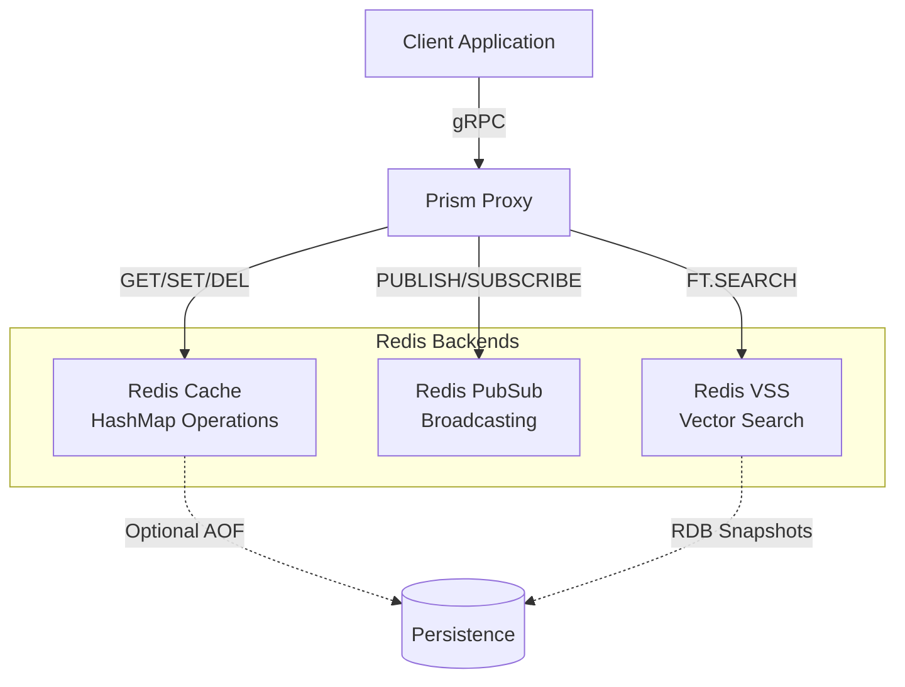
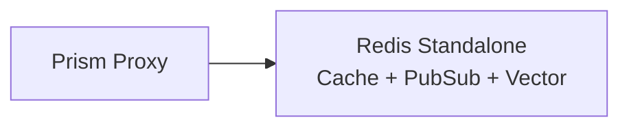
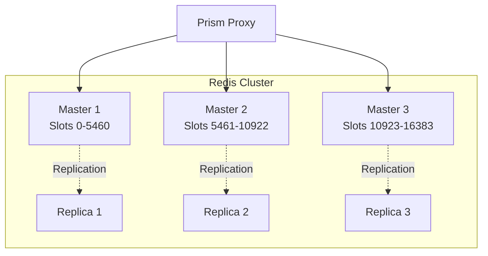
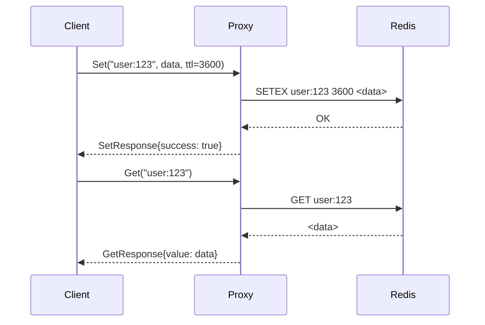
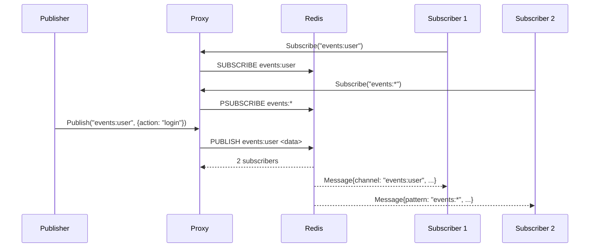
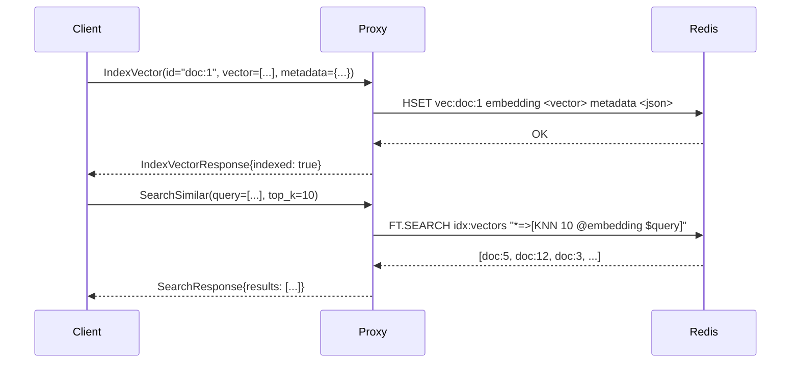

## Abstract

This RFC specifies the integration of Redis into Prism as a high-performance backend for three distinct use cases: key-value caching (HashMap), publish-subscribe messaging, and vector similarity search. Redis provides sub-millisecond latency for hot data paths while maintaining operational simplicity through a single backend technology.

## 1. Introduction

### 1.1 Purpose

Redis integration addresses three critical data access patterns:

1. **Cache (HashMap)**: In-memory key-value store with TTL support for application-level caching
2. **PubSub**: High-throughput message broadcasting for event distribution and real-time updates
3. **Vector Database**: Similarity search using Redis Vector Similarity Search (VSS) for ML/AI workloads

### 1.2 Goals

- **Performance**: P50 latency `<1ms`, P99 `<5ms` for cache operations
- **Throughput**: Support 100k+ ops/sec per Redis instance
- **Flexibility**: Single Redis deployment serves multiple access patterns
- **Scalability**: Redis Cluster support for horizontal scaling
- **Persistence**: Configurable persistence (AOF/RDB) per use case

### 1.3 Non-Goals

- **Not a primary database**: Redis is for hot paths, not source of truth
- **Not for large objects**: Objects `>1MB` should use blob storage
- **Not for complex queries**: Use ClickHouse or Postgres for analytics
- **Not for transactions**: Use Postgres for ACID requirements

## 2. Architecture Overview

### 2.1 Redis Access Patterns



### 2.2 Deployment Models

**Single Redis (Development)**


**Redis Cluster (Production)**


## 3. Cache (HashMap) Access Pattern

### 3.1 Use Cases

- **Session storage**: User sessions, JWT tokens
- **API response caching**: Computed results, aggregations
- **Configuration caching**: Feature flags, application settings
- **Rate limiting**: Request counters with TTL
- **Temporary data**: Job results, computation intermediates

### 3.2 Interface

```protobuf
syntax = "proto3";

package prism.cache.v1;

service CacheService {
  // Get value by key
  rpc Get(GetRequest) returns (GetResponse);

  // Set value with optional TTL
  rpc Set(SetRequest) returns (SetResponse);

  // Delete key
  rpc Delete(DeleteRequest) returns (DeleteResponse);

  // Get multiple keys (batch)
  rpc GetMulti(GetMultiRequest) returns (GetMultiRequest);

  // Check if key exists
  rpc Exists(ExistsRequest) returns (ExistsResponse);

  // Set with expiration (atomic)
  rpc SetEx(SetExRequest) returns (SetExResponse);

  // Increment/Decrement (atomic counters)
  rpc Increment(IncrementRequest) returns (IncrementResponse);
}

message SetRequest {
  string session_id = 1;
  string namespace = 2;
  string key = 3;
  bytes value = 4;

  // Optional TTL in seconds (0 = no expiration)
  int32 ttl_seconds = 5;

  // Optional flags
  bool only_if_not_exists = 6;  // SET NX
  bool only_if_exists = 7;      // SET XX
}
```

### 3.3 Performance Targets

- **Latency**: P50 `<500µs`, P99 `<2ms`
- **Throughput**: 100k ops/sec per instance
- **Hit Rate**: Track and expose cache hit ratio
- **Memory**: Eviction policies (LRU, LFU, TTL)

### 3.4 Implementation Flow



## 4. PubSub Access Pattern

### 4.1 Use Cases

- **Event broadcasting**: Notify all subscribers of system events
- **Real-time updates**: Push notifications, live dashboards
- **Cache invalidation**: Notify caches to evict stale data
- **Webhook fanout**: Distribute webhooks to multiple consumers
- **Presence detection**: Online/offline user status

### 4.2 Interface

```protobuf
syntax = "proto3";

package prism.pubsub.v1;

service PubSubService {
  // Publish message to channel
  rpc Publish(PublishRequest) returns (PublishResponse);

  // Subscribe to channels (streaming)
  rpc Subscribe(SubscribeRequest) returns (stream Message);

  // Pattern-based subscription
  rpc PatternSubscribe(PatternSubscribeRequest) returns (stream Message);

  // Unsubscribe from channels
  rpc Unsubscribe(UnsubscribeRequest) returns (UnsubscribeResponse);
}

message PublishRequest {
  string session_id = 1;
  string namespace = 2;
  string channel = 3;
  bytes payload = 4;

  // Optional metadata
  map<string, string> headers = 5;
}

message Message {
  string channel = 1;
  bytes payload = 2;
  google.protobuf.Timestamp published_at = 3;
  map<string, string> headers = 4;
}
```

### 4.3 Characteristics

- **Fire-and-forget**: No message persistence (use Kafka/NATS for durability)
- **Fan-out**: All subscribers receive all messages
- **No ordering guarantees**: Use Kafka for ordered streams
- **Pattern matching**: Subscribe to `user:*` for all user events

### 4.4 Implementation Flow



## 5. Vector Search Access Pattern

### 5.1 Use Cases

- **Semantic search**: Find similar documents, products, images
- **Recommendation systems**: Similar items, collaborative filtering
- **Anomaly detection**: Find outliers in embedding space
- **Duplicate detection**: Near-duplicate content identification
- **RAG (Retrieval Augmented Generation)**: Context retrieval for LLMs

### 5.2 Interface

```protobuf
syntax = "proto3";

package prism.vector.v1;

service VectorService {
  // Index a vector with metadata
  rpc IndexVector(IndexVectorRequest) returns (IndexVectorResponse);

  // Search for similar vectors (KNN)
  rpc SearchSimilar(SearchRequest) returns (SearchResponse);

  // Batch index vectors
  rpc BatchIndex(stream IndexVectorRequest) returns (BatchIndexResponse);

  // Delete vector by ID
  rpc DeleteVector(DeleteVectorRequest) returns (DeleteVectorResponse);

  // Get vector by ID
  rpc GetVector(GetVectorRequest) returns (GetVectorResponse);
}

message IndexVectorRequest {
  string session_id = 1;
  string namespace = 2;
  string vector_id = 3;

  // Vector embeddings (float32)
  repeated float vector = 4;

  // Optional metadata for filtering
  map<string, string> metadata = 5;
}

message SearchRequest {
  string session_id = 1;
  string namespace = 2;

  // Query vector
  repeated float query_vector = 3;

  // Number of results
  int32 top_k = 4;

  // Optional filters
  map<string, string> filters = 5;

  // Distance metric (COSINE, L2, IP)
  string metric = 6;
}

message SearchResponse {
  repeated SearchResult results = 1;
}

message SearchResult {
  string vector_id = 1;
  float score = 2;
  map<string, string> metadata = 3;
}
```

### 5.3 Redis VSS Configuration

```redis
# Create vector index
FT.CREATE idx:vectors
  ON HASH
  PREFIX 1 "vec:"
  SCHEMA
    embedding VECTOR HNSW 6
      TYPE FLOAT32
      DIM 768
      DISTANCE_METRIC COSINE
    metadata TAG
```

### 5.4 Implementation Flow



## 6. Configuration

### 6.1 Client Configuration

```protobuf
message RedisBackendConfig {
  // Backend type
  BackendType type = 1;

  enum BackendType {
    CACHE = 0;
    PUBSUB = 1;
    VECTOR = 2;
  }

  // Connection settings
  string host = 2;
  int32 port = 3;
  int32 db = 4;

  // Cluster mode
  bool cluster_mode = 5;
  repeated string cluster_nodes = 6;

  // Cache-specific
  int32 default_ttl_seconds = 7;
  string eviction_policy = 8;  // "allkeys-lru", "volatile-ttl"

  // Vector-specific
  int32 vector_dimensions = 9;
  string distance_metric = 10;  // "COSINE", "L2", "IP"

  // Performance
  int32 pool_size = 11;
  google.protobuf.Duration timeout = 12;
}
```

### 6.2 Server Configuration

```yaml
# config/redis.yaml
redis:
  cache:
    host: redis-cache.internal
    port: 6379
    db: 0
    pool_size: 50
    default_ttl: 3600
    max_memory: "4gb"
    eviction_policy: "allkeys-lru"

  pubsub:
    host: redis-pubsub.internal
    port: 6379
    db: 1
    pool_size: 100

  vector:
    cluster_mode: true
    cluster_nodes:
      - "redis-vec-1.internal:6379"
      - "redis-vec-2.internal:6379"
      - "redis-vec-3.internal:6379"
    dimensions: 768
    metric: "COSINE"
```

## 7. Operational Considerations

### 7.1 Persistence

- **Cache**: `appendonly no` (ephemeral, repopulate from source)
- **PubSub**: No persistence (fire-and-forget)
- **Vector**: `appendonly yes` + RDB snapshots (vectors expensive to recompute)

### 7.2 Monitoring

```yaml
metrics:
  cache:
    - hit_rate
    - miss_rate
    - eviction_count
    - memory_usage
    - avg_ttl

  pubsub:
    - messages_published
    - subscriber_count
    - channel_count
    - message_rate

  vector:
    - index_size
    - search_latency_p99
    - index_throughput
    - memory_per_vector
```

### 7.3 Capacity Planning

**Cache**
- Memory: `(avg_key_size + avg_value_size) × expected_keys × 1.2` (20% overhead)
- Example: 1KB avg × 1M keys × 1.2 = ~1.2GB

**Vector**
- Memory: `vector_dimensions × 4 bytes × num_vectors × 2` (HNSW overhead)
- Example: 768 dim × 4 bytes × 1M vectors × 2 = ~6GB

## 8. Migration Path

### 8.1 Phase 1: Cache (Week 1-2)

- Deploy Redis standalone
- Implement CacheService gRPC interface
- Add Redis connection pool to proxy
- Integration tests with real Redis

### 8.2 Phase 2: PubSub (Week 3-4)

- Implement PubSubService with streaming
- Add Redis SUBSCRIBE/PUBLISH support
- Pattern subscription support
- Load testing (100k msg/sec)

### 8.3 Phase 3: Vector Search (Week 5-8)

- Enable Redis Stack (RedisSearch module)
- Implement VectorService
- Create vector indices
- Benchmark with real embeddings (OpenAI, etc.)

## 9. Use Case Recommendations

### 9.1 When to Use Redis Cache

✅ **Use When**:
- Sub-millisecond latency required
- Data can be recomputed if lost
- Working set fits in memory
- Simple key-value access pattern

❌ **Avoid When**:
- Data must be durable (use Postgres)
- Complex queries needed (use ClickHouse)
- Objects `>1MB` (use S3/blob storage)

### 9.2 When to Use Redis PubSub

✅ **Use When**:
- Broadcasting to multiple subscribers
- Fire-and-forget messaging acceptable
- Real-time updates needed
- Message loss acceptable

❌ **Avoid When**:
- Message durability required (use Kafka)
- Ordered processing needed (use Kafka)
- Point-to-point messaging (use queues)

### 9.3 When to Use Redis Vector Search

✅ **Use When**:
- Similarity search on embeddings
- Low-latency retrieval (`<10ms`)
- Moderate dataset size (`<10M` vectors)
- Real-time recommendations

❌ **Avoid When**:
- `>50M` vectors (use dedicated vector DB)
- Complex metadata filtering (use Postgres with pgvector)
- Training ML models (use analytical DB)

## 10. References

- [Redis Documentation](https://redis.io/docs/)
- [Redis Vector Similarity Search](https://redis.io/docs/stack/search/reference/vectors/)
- [Redis Cluster Specification](https://redis.io/docs/reference/cluster-spec/)
- [Redis Persistence](https://redis.io/docs/manual/persistence/)

## 11. Revision History

- 2025-10-08: Initial draft