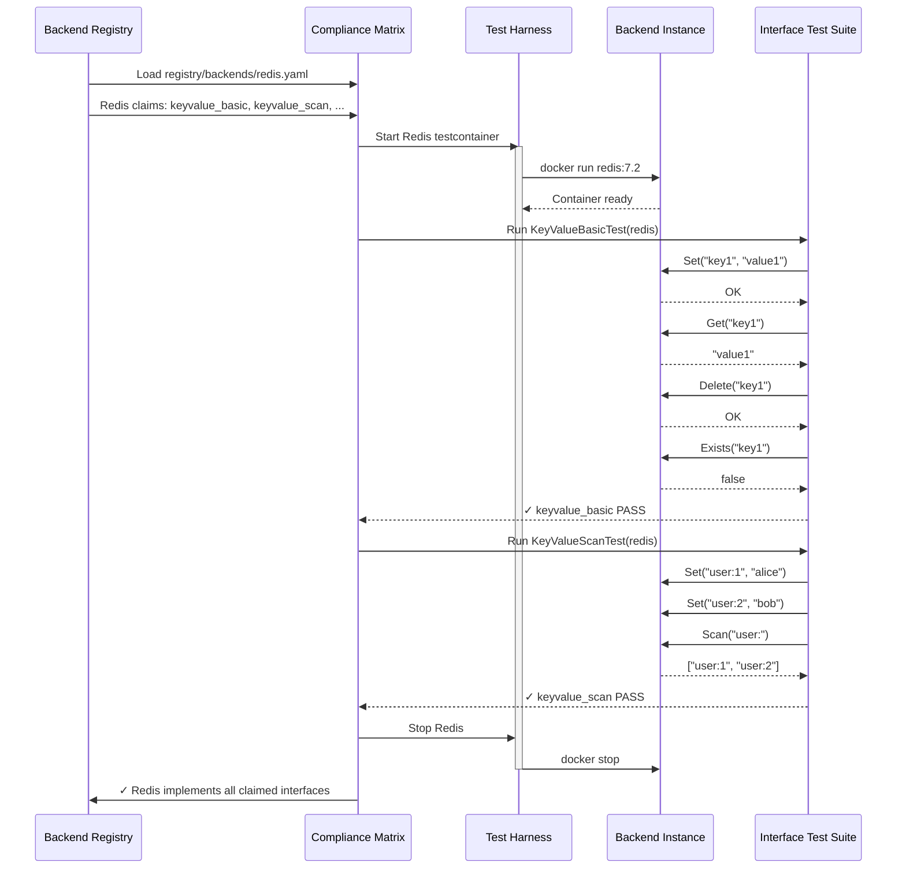

# RFC-015: Plugin Acceptance Test Framework (Interface-Based Testing)

## Abstract

This RFC defines a comprehensive **acceptance test framework** for Prism backend plugins based on **interface compliance** rather than backend types. Following MEMO-006's interface decomposition principles, the framework tests plugins against the thin, composable interfaces they claim to implement (e.g., `keyvalue_basic`, `pubsub_persistent`, `stream_consumer_groups`) rather than treating backends as monolithic units.

**Key Innovation**: Backends declare which interfaces they implement in `registry/backends/*.yaml`. Tests verify each interface independently, enabling fine-grained validation and clear contracts.

The framework provides:
1. **Interface Compliance Test Suites**: Reusable tests for each of the 45 backend interfaces
2. **Backend Verification Matrix**: Automated validation that backends implement their declared interfaces
3. **Test Harness with testcontainers**: Real backend instances for integration testing
4. **CI/CD Integration**: Interface compliance checked on every commit

## Motivation

### Problem Statement

MEMO-006 decomposes backends into thin interfaces (e.g., Redis implements 16 interfaces across 6 data models), but without interface-level testing, we can't verify compliance:

**Current Approach (Backend-Type Testing)**:
```go
func TestPostgresPlugin(t *testing.T) {
    // Tests all PostgreSQL features mixed together
    testInsert(t)        // keyvalue_basic
    testJSONTypes(t)     // document_basic
    testTransactions(t)  // keyvalue_transactional
    testListenNotify(t)  // pubsub_basic (LISTEN/NOTIFY)
}
```

**Problems**:
- Monolithic tests obscure which interface is being tested
- Can't reuse tests across backends (PostgreSQL and Redis both implement `keyvalue_basic` but have separate test suites)
- No clear mapping between test failures and interface violations
- Hard to verify partial interface implementations

**MEMO-006 Approach (Interface-Based Testing)**:
```go
// Test keyvalue_basic interface (works for ANY backend implementing it)
func TestKeyValueBasicInterface(t *testing.T, backend TestBackend) {
    // Tests ONLY keyvalue_basic operations
    testSet(t, backend)
    testGet(t, backend)
    testDelete(t, backend)
    testExists(t, backend)
}

// Run for all backends implementing keyvalue_basic
for backend := range FindBackendsImplementing("keyvalue_basic") {
    t.Run(backend.Name, func(t *testing.T) {
        TestKeyValueBasicInterface(t, backend)
    })
}
```

### Goals

1. **Interface Compliance**: Test each interface independently (45 interface test suites)
2. **Cross-Backend Reuse**: Same test suite verifies Redis, PostgreSQL, DynamoDB for `keyvalue_basic`
3. **Explicit Contracts**: Interface tests define the exact behavior backends must implement
4. **Registry-Driven**: Backends declare interfaces in `registry/backends/*.yaml`, tests verify claims
5. **Incremental Implementation**: Backends can implement subsets of interfaces (MemStore implements 6, Redis implements 16)
6. **CI/CD Ready**: Automated interface compliance matrix on every commit

### Non-Goals

- **Not load testing**: Performance benchmarks are separate (covered in other RFCs)
- **Not pattern testing**: Pattern composition tested separately (RFC-014)
- **Not end-to-end testing**: Focus on plugin-backend interface compliance only

## Architecture Overview

### Interface-Based Test Structure

Following MEMO-006's 45 interface catalog, the framework provides test suites for each interface:

```text
tests/acceptance/
├── harness/
│   ├── plugin_harness.go         # Plugin lifecycle management
│   ├── backend_manager.go        # testcontainers integration
│   └── interface_registry.go     # Load backend interface declarations
│
├── interfaces/                    # Interface compliance test suites
│   ├── keyvalue/
│   │   ├── keyvalue_basic_test.go        # Test keyvalue_basic interface
│   │   ├── keyvalue_scan_test.go         # Test keyvalue_scan interface
│   │   ├── keyvalue_ttl_test.go          # Test keyvalue_ttl interface
│   │   ├── keyvalue_transactional_test.go
│   │   ├── keyvalue_batch_test.go
│   │   └── keyvalue_cas_test.go
│   │
│   ├── pubsub/
│   │   ├── pubsub_basic_test.go          # Test pubsub_basic interface
│   │   ├── pubsub_wildcards_test.go      # Test pubsub_wildcards interface
│   │   ├── pubsub_persistent_test.go     # Test pubsub_persistent interface
│   │   ├── pubsub_filtering_test.go
│   │   └── pubsub_ordering_test.go
│   │
│   ├── stream/
│   │   ├── stream_basic_test.go
│   │   ├── stream_consumer_groups_test.go
│   │   ├── stream_replay_test.go
│   │   ├── stream_retention_test.go
│   │   └── stream_partitioning_test.go
│   │
│   ├── queue/
│   │   ├── queue_basic_test.go
│   │   ├── queue_visibility_test.go
│   │   ├── queue_dead_letter_test.go
│   │   ├── queue_priority_test.go
│   │   └── queue_delayed_test.go
│   │
│   ├── list/
│   │   ├── list_basic_test.go
│   │   ├── list_indexing_test.go
│   │   ├── list_range_test.go
│   │   └── list_blocking_test.go
│   │
│   ├── set/
│   │   ├── set_basic_test.go
│   │   ├── set_operations_test.go
│   │   ├── set_cardinality_test.go
│   │   └── set_random_test.go
│   │
│   ├── sortedset/
│   │   ├── sortedset_basic_test.go
│   │   ├── sortedset_range_test.go
│   │   ├── sortedset_rank_test.go
│   │   ├── sortedset_operations_test.go
│   │   └── sortedset_lex_test.go
│   │
│   ├── timeseries/
│   │   ├── timeseries_basic_test.go
│   │   ├── timeseries_aggregation_test.go
│   │   ├── timeseries_retention_test.go
│   │   └── timeseries_interpolation_test.go
│   │
│   ├── graph/
│   │   ├── graph_basic_test.go
│   │   ├── graph_traversal_test.go
│   │   ├── graph_query_test.go
│   │   └── graph_analytics_test.go
│   │
│   └── document/
│       ├── document_basic_test.go
│       ├── document_query_test.go
│       └── document_indexing_test.go
│
├── instances/                     # Backend testcontainers
│   ├── redis_instance.go
│   ├── postgres_instance.go
│   ├── kafka_instance.go
│   ├── memstore_instance.go
│   └── backend_interface.go       # Common interface
│
└── matrix/
    ├── compliance_matrix_test.go  # Run interface tests for all backends
    └── registry_validator_test.go # Verify backend registry declarations
```

### Test Execution Flow



## Interface Compliance Test Suites

### Example: KeyValue Basic Interface

```go
// tests/acceptance/interfaces/keyvalue/keyvalue_basic_test.go

package keyvalue

import (
	"context"
	"testing"

	"github.com/prism/plugin-core/proto"
	"github.com/prism/tests/acceptance/harness"
	"github.com/stretchr/testify/assert"
	"github.com/stretchr/testify/require"
)

// KeyValueBasicTestSuite verifies keyvalue_basic interface compliance
type KeyValueBasicTestSuite struct {
	harness *harness.PluginHarness
	t       *testing.T
}

// NewKeyValueBasicTestSuite creates interface test suite
func NewKeyValueBasicTestSuite(t *testing.T, h *harness.PluginHarness) *KeyValueBasicTestSuite {
	return &KeyValueBasicTestSuite{
		harness: h,
		t:       t,
	}
}

// Run executes all keyvalue_basic interface tests
func (s *KeyValueBasicTestSuite) Run() {
	s.t.Run("Set", s.testSet)
	s.t.Run("Get", s.testGet)
	s.t.Run("Delete", s.testDelete)
	s.t.Run("Exists", s.testExists)
	s.t.Run("SetGetDelete", s.testSetGetDelete)
	s.t.Run("GetNonExistent", s.testGetNonExistent)
	s.t.Run("DeleteNonExistent", s.testDeleteNonExistent)
	s.t.Run("ExistsNonExistent", s.testExistsNonExistent)
	s.t.Run("OverwriteValue", s.testOverwriteValue)
	s.t.Run("ConcurrentSets", s.testConcurrentSets)
}

// testSet verifies Set operation
func (s *KeyValueBasicTestSuite) testSet() {
	ctx := context.Background()

	req := &proto.KeyValueSetRequest{
		Namespace: "test",
		Key:       "test-key",
		Value:     []byte("test-value"),
	}

	resp, err := s.harness.Plugin.KeyValueSet(ctx, req)
	require.NoError(s.t, err, "Set should succeed")
	assert.True(s.t, resp.Success, "Set response should indicate success")
}

// testGet verifies Get operation
func (s *KeyValueBasicTestSuite) testGet() {
	ctx := context.Background()

	// First, set a value
	setReq := &proto.KeyValueSetRequest{
		Namespace: "test",
		Key:       "get-test-key",
		Value:     []byte("get-test-value"),
	}
	_, err := s.harness.Plugin.KeyValueSet(ctx, setReq)
	require.NoError(s.t, err)

	// Then, get it back
	getReq := &proto.KeyValueGetRequest{
		Namespace: "test",
		Key:       "get-test-key",
	}
	getResp, err := s.harness.Plugin.KeyValueGet(ctx, getReq)
	require.NoError(s.t, err, "Get should succeed")
	assert.Equal(s.t, []byte("get-test-value"), getResp.Value, "Value should match what was set")
}

// testDelete verifies Delete operation
func (s *KeyValueBasicTestSuite) testDelete() {
	ctx := context.Background()

	// Set a value
	setReq := &proto.KeyValueSetRequest{
		Namespace: "test",
		Key:       "delete-test-key",
		Value:     []byte("delete-test-value"),
	}
	_, err := s.harness.Plugin.KeyValueSet(ctx, setReq)
	require.NoError(s.t, err)

	// Delete it
	delReq := &proto.KeyValueDeleteRequest{
		Namespace: "test",
		Key:       "delete-test-key",
	}
	delResp, err := s.harness.Plugin.KeyValueDelete(ctx, delReq)
	require.NoError(s.t, err, "Delete should succeed")
	assert.True(s.t, delResp.Found, "Delete should report key was found")
}

// testExists verifies Exists operation
func (s *KeyValueBasicTestSuite) testExists() {
	ctx := context.Background()

	// Set a value
	setReq := &proto.KeyValueSetRequest{
		Namespace: "test",
		Key:       "exists-test-key",
		Value:     []byte("exists-test-value"),
	}
	_, err := s.harness.Plugin.KeyValueSet(ctx, setReq)
	require.NoError(s.t, err)

	// Check existence
	existsReq := &proto.KeyValueExistsRequest{
		Namespace: "test",
		Key:       "exists-test-key",
	}
	existsResp, err := s.harness.Plugin.KeyValueExists(ctx, existsReq)
	require.NoError(s.t, err, "Exists should succeed")
	assert.True(s.t, existsResp.Exists, "Key should exist")
}

// testSetGetDelete verifies full lifecycle
func (s *KeyValueBasicTestSuite) testSetGetDelete() {
	ctx := context.Background()
	key := "lifecycle-key"
	value := []byte("lifecycle-value")

	// Set
	setReq := &proto.KeyValueSetRequest{
		Namespace: "test",
		Key:       key,
		Value:     value,
	}
	_, err := s.harness.Plugin.KeyValueSet(ctx, setReq)
	require.NoError(s.t, err)

	// Get
	getReq := &proto.KeyValueGetRequest{
		Namespace: "test",
		Key:       key,
	}
	getResp, err := s.harness.Plugin.KeyValueGet(ctx, getReq)
	require.NoError(s.t, err)
	assert.Equal(s.t, value, getResp.Value)

	// Delete
	delReq := &proto.KeyValueDeleteRequest{
		Namespace: "test",
		Key:       key,
	}
	delResp, err := s.harness.Plugin.KeyValueDelete(ctx, delReq)
	require.NoError(s.t, err)
	assert.True(s.t, delResp.Found)

	// Verify deleted
	existsReq := &proto.KeyValueExistsRequest{
		Namespace: "test",
		Key:       key,
	}
	existsResp, err := s.harness.Plugin.KeyValueExists(ctx, existsReq)
	require.NoError(s.t, err)
	assert.False(s.t, existsResp.Exists, "Key should not exist after delete")
}

// testGetNonExistent verifies Get returns NotFound for missing keys
func (s *KeyValueBasicTestSuite) testGetNonExistent() {
	ctx := context.Background()

	getReq := &proto.KeyValueGetRequest{
		Namespace: "test",
		Key:       "non-existent-key",
	}

	_, err := s.harness.Plugin.KeyValueGet(ctx, getReq)
	assert.Error(s.t, err, "Get on non-existent key should return error")
	// Should be gRPC NotFound status code
}

// testDeleteNonExistent verifies Delete returns Found=false for missing keys
func (s *KeyValueBasicTestSuite) testDeleteNonExistent() {
	ctx := context.Background()

	delReq := &proto.KeyValueDeleteRequest{
		Namespace: "test",
		Key:       "non-existent-key",
	}

	delResp, err := s.harness.Plugin.KeyValueDelete(ctx, delReq)
	require.NoError(s.t, err, "Delete should not error on non-existent key")
	assert.False(s.t, delResp.Found, "Delete should report key was not found")
}

// testExistsNonExistent verifies Exists returns false for missing keys
func (s *KeyValueBasicTestSuite) testExistsNonExistent() {
	ctx := context.Background()

	existsReq := &proto.KeyValueExistsRequest{
		Namespace: "test",
		Key:       "non-existent-key",
	}

	existsResp, err := s.harness.Plugin.KeyValueExists(ctx, existsReq)
	require.NoError(s.t, err, "Exists should not error on non-existent key")
	assert.False(s.t, existsResp.Exists, "Key should not exist")
}

// testOverwriteValue verifies Set overwrites existing values
func (s *KeyValueBasicTestSuite) testOverwriteValue() {
	ctx := context.Background()
	key := "overwrite-key"

	// Set initial value
	setReq := &proto.KeyValueSetRequest{
		Namespace: "test",
		Key:       key,
		Value:     []byte("initial-value"),
	}
	_, err := s.harness.Plugin.KeyValueSet(ctx, setReq)
	require.NoError(s.t, err)

	// Overwrite with new value
	setReq.Value = []byte("new-value")
	_, err = s.harness.Plugin.KeyValueSet(ctx, setReq)
	require.NoError(s.t, err)

	// Verify new value
	getReq := &proto.KeyValueGetRequest{
		Namespace: "test",
		Key:       key,
	}
	getResp, err := s.harness.Plugin.KeyValueGet(ctx, getReq)
	require.NoError(s.t, err)
	assert.Equal(s.t, []byte("new-value"), getResp.Value, "Value should be overwritten")
}

// testConcurrentSets verifies concurrent Set operations are safe
func (s *KeyValueBasicTestSuite) testConcurrentSets() {
	ctx := context.Background()
	concurrency := 100
	errChan := make(chan error, concurrency)

	for i := 0; i < concurrency; i++ {
		go func(idx int) {
			setReq := &proto.KeyValueSetRequest{
				Namespace: "test",
				Key:       fmt.Sprintf("concurrent-key-%d", idx),
				Value:     []byte(fmt.Sprintf("concurrent-value-%d", idx)),
			}

			_, err := s.harness.Plugin.KeyValueSet(ctx, setReq)
			errChan <- err
		}(i)
	}

	// Wait for all operations
	for i := 0; i < concurrency; i++ {
		err := <-errChan
		assert.NoError(s.t, err, "Concurrent Set operations should succeed")
	}
}
```

### Example: KeyValue Scan Interface

```go
// tests/acceptance/interfaces/keyvalue/keyvalue_scan_test.go

package keyvalue

import (
	"context"
	"fmt"
	"testing"

	"github.com/prism/plugin-core/proto"
	"github.com/prism/tests/acceptance/harness"
	"github.com/stretchr/testify/assert"
	"github.com/stretchr/testify/require"
)

// KeyValueScanTestSuite verifies keyvalue_scan interface compliance
type KeyValueScanTestSuite struct {
	harness *harness.PluginHarness
	t       *testing.T
}

func NewKeyValueScanTestSuite(t *testing.T, h *harness.PluginHarness) *KeyValueScanTestSuite {
	return &KeyValueScanTestSuite{
		harness: h,
		t:       t,
	}
}

func (s *KeyValueScanTestSuite) Run() {
	s.t.Run("ScanAll", s.testScanAll)
	s.t.Run("ScanPrefix", s.testScanPrefix)
	s.t.Run("ScanLimit", s.testScanLimit)
	s.t.Run("ScanKeys", s.testScanKeys)
	s.t.Run("Count", s.testCount)
	s.t.Run("CountWithPrefix", s.testCountWithPrefix)
}

func (s *KeyValueScanTestSuite) testScanAll() {
	ctx := context.Background()

	// Seed data
	for i := 0; i < 10; i++ {
		setReq := &proto.KeyValueSetRequest{
			Namespace: "test",
			Key:       fmt.Sprintf("scan-key-%d", i),
			Value:     []byte(fmt.Sprintf("scan-value-%d", i)),
		}
		_, err := s.harness.Plugin.KeyValueSet(ctx, setReq)
		require.NoError(s.t, err)
	}

	// Scan all keys
	scanReq := &proto.KeyValueScanRequest{
		Namespace: "test",
		Prefix:    "",
		Limit:     0, // Unlimited
	}

	stream, err := s.harness.Plugin.KeyValueScan(ctx, scanReq)
	require.NoError(s.t, err)

	results := make(map[string][]byte)
	for {
		resp, err := stream.Recv()
		if err == io.EOF {
			break
		}
		require.NoError(s.t, err)
		results[resp.Key] = resp.Value
	}

	assert.GreaterOrEqual(s.t, len(results), 10, "Should scan at least 10 keys")
}

func (s *KeyValueScanTestSuite) testScanPrefix() {
	ctx := context.Background()

	// Seed data with different prefixes
	for i := 0; i < 5; i++ {
		setReq := &proto.KeyValueSetRequest{
			Namespace: "test",
			Key:       fmt.Sprintf("user:%d", i),
			Value:     []byte(fmt.Sprintf("user-data-%d", i)),
		}
		_, err := s.harness.Plugin.KeyValueSet(ctx, setReq)
		require.NoError(s.t, err)
	}

	for i := 0; i < 5; i++ {
		setReq := &proto.KeyValueSetRequest{
			Namespace: "test",
			Key:       fmt.Sprintf("post:%d", i),
			Value:     []byte(fmt.Sprintf("post-data-%d", i)),
		}
		_, err := s.harness.Plugin.KeyValueSet(ctx, setReq)
		require.NoError(s.t, err)
	}

	// Scan only user: prefix
	scanReq := &proto.KeyValueScanRequest{
		Namespace: "test",
		Prefix:    "user:",
		Limit:     0,
	}

	stream, err := s.harness.Plugin.KeyValueScan(ctx, scanReq)
	require.NoError(s.t, err)

	userKeys := 0
	for {
		resp, err := stream.Recv()
		if err == io.EOF {
			break
		}
		require.NoError(s.t, err)
		assert.Contains(s.t, resp.Key, "user:", "All keys should have user: prefix")
		userKeys++
	}

	assert.Equal(s.t, 5, userKeys, "Should scan exactly 5 user keys")
}

func (s *KeyValueScanTestSuite) testScanLimit() {
	ctx := context.Background()

	// Seed 20 keys
	for i := 0; i < 20; i++ {
		setReq := &proto.KeyValueSetRequest{
			Namespace: "test",
			Key:       fmt.Sprintf("limit-key-%d", i),
			Value:     []byte(fmt.Sprintf("limit-value-%d", i)),
		}
		_, err := s.harness.Plugin.KeyValueSet(ctx, setReq)
		require.NoError(s.t, err)
	}

	// Scan with limit=10
	scanReq := &proto.KeyValueScanRequest{
		Namespace: "test",
		Prefix:    "limit-key-",
		Limit:     10,
	}

	stream, err := s.harness.Plugin.KeyValueScan(ctx, scanReq)
	require.NoError(s.t, err)

	count := 0
	for {
		_, err := stream.Recv()
		if err == io.EOF {
			break
		}
		require.NoError(s.t, err)
		count++
	}

	assert.Equal(s.t, 10, count, "Should scan exactly 10 keys (limit)")
}

func (s *KeyValueScanTestSuite) testScanKeys() {
	ctx := context.Background()

	// Seed data
	for i := 0; i < 5; i++ {
		setReq := &proto.KeyValueSetRequest{
			Namespace: "test",
			Key:       fmt.Sprintf("keys-only-%d", i),
			Value:     []byte(fmt.Sprintf("large-value-%d", i)), // Values not needed
		}
		_, err := s.harness.Plugin.KeyValueSet(ctx, setReq)
		require.NoError(s.t, err)
	}

	// Scan keys only (no values)
	scanKeysReq := &proto.KeyValueScanKeysRequest{
		Namespace: "test",
		Prefix:    "keys-only-",
		Limit:     0,
	}

	stream, err := s.harness.Plugin.KeyValueScanKeys(ctx, scanKeysReq)
	require.NoError(s.t, err)

	keys := []string{}
	for {
		resp, err := stream.Recv()
		if err == io.EOF {
			break
		}
		require.NoError(s.t, err)
		keys = append(keys, resp.Key)
	}

	assert.Equal(s.t, 5, len(keys), "Should scan 5 keys")
}

func (s *KeyValueScanTestSuite) testCount() {
	ctx := context.Background()

	// Seed data
	for i := 0; i < 15; i++ {
		setReq := &proto.KeyValueSetRequest{
			Namespace: "test",
			Key:       fmt.Sprintf("count-key-%d", i),
			Value:     []byte(fmt.Sprintf("count-value-%d", i)),
		}
		_, err := s.harness.Plugin.KeyValueSet(ctx, setReq)
		require.NoError(s.t, err)
	}

	// Count all keys
	countReq := &proto.KeyValueCountRequest{
		Namespace: "test",
		Prefix:    "",
	}

	countResp, err := s.harness.Plugin.KeyValueCount(ctx, countReq)
	require.NoError(s.t, err)
	assert.GreaterOrEqual(s.t, countResp.Count, int64(15), "Should count at least 15 keys")
}

func (s *KeyValueScanTestSuite) testCountWithPrefix() {
	ctx := context.Background()

	// Seed data
	for i := 0; i < 10; i++ {
		setReq := &proto.KeyValueSetRequest{
			Namespace: "test",
			Key:       fmt.Sprintf("prefix-count-key-%d", i),
			Value:     []byte(fmt.Sprintf("prefix-count-value-%d", i)),
		}
		_, err := s.harness.Plugin.KeyValueSet(ctx, setReq)
		require.NoError(s.t, err)
	}

	// Count keys with prefix
	countReq := &proto.KeyValueCountRequest{
		Namespace: "test",
		Prefix:    "prefix-count-",
	}

	countResp, err := s.harness.Plugin.KeyValueCount(ctx, countReq)
	require.NoError(s.t, err)
	assert.Equal(s.t, int64(10), countResp.Count, "Should count exactly 10 keys with prefix")
}
```

## Backend Interface Registry

### Registry Loading

```go
// tests/acceptance/harness/interface_registry.go

package harness

import (
	"fmt"
	"io/ioutil"
	"path/filepath"

	"gopkg.in/yaml.v3"
)

// BackendRegistry loads backend interface declarations from registry/backends/*.yaml
type BackendRegistry struct {
	Backends map[string]*BackendDeclaration
}

// BackendDeclaration represents a backend's declared interfaces
type BackendDeclaration struct {
	Backend     string   `yaml:"backend"`
	Description string   `yaml:"description"`
	Plugin      string   `yaml:"plugin"`
	Implements  []string `yaml:"implements"`
}

// LoadBackendRegistry loads all backend declarations from registry/backends/
func LoadBackendRegistry(registryPath string) (*BackendRegistry, error) {
	registry := &BackendRegistry{
		Backends: make(map[string]*BackendDeclaration),
	}

	files, err := filepath.Glob(filepath.Join(registryPath, "backends", "*.yaml"))
	if err != nil {
		return nil, fmt.Errorf("failed to list backend files: %w", err)
	}

	for _, file := range files {
		data, err := ioutil.ReadFile(file)
		if err != nil {
			return nil, fmt.Errorf("failed to read %s: %w", file, err)
		}

		var decl BackendDeclaration
		if err := yaml.Unmarshal(data, &decl); err != nil {
			return nil, fmt.Errorf("failed to parse %s: %w", file, err)
		}

		registry.Backends[decl.Backend] = &decl
	}

	return registry, nil
}

// FindBackendsImplementing returns backends that implement the given interface
func (r *BackendRegistry) FindBackendsImplementing(interfaceName string) []*BackendDeclaration {
	backends := []*BackendDeclaration{}

	for _, backend := range r.Backends {
		for _, iface := range backend.Implements {
			if iface == interfaceName {
				backends = append(backends, backend)
				break
			}
		}
	}

	return backends
}

// VerifyInterfaceImplemented checks if backend declares the interface
func (r *BackendRegistry) VerifyInterfaceImplemented(backend, interfaceName string) bool {
	decl, ok := r.Backends[backend]
	if !ok {
		return false
	}

	for _, iface := range decl.Implements {
		if iface == interfaceName {
			return true
		}
	}

	return false
}
```

## Compliance Matrix Test

The compliance matrix runs all interface tests for backends that claim to implement them:

```go
// tests/acceptance/matrix/compliance_matrix_test.go

package matrix

import (
	"testing"

	"github.com/prism/tests/acceptance/harness"
	"github.com/prism/tests/acceptance/instances"
	"github.com/prism/tests/acceptance/interfaces/keyvalue"
	"github.com/prism/tests/acceptance/interfaces/pubsub"
	"github.com/prism/tests/acceptance/interfaces/stream"
	// ... import other interface test suites
)

// TestComplianceMatrix runs interface tests for all backends
func TestComplianceMatrix(t *testing.T) {
	// Load backend registry
	registry, err := harness.LoadBackendRegistry("../../registry")
	if err != nil {
		t.Fatalf("Failed to load backend registry: %v", err)
	}

	// Test each backend
	for backendName, backend := range registry.Backends {
		t.Run(backendName, func(t *testing.T) {
			testBackendCompliance(t, backend, registry)
		})
	}
}

func testBackendCompliance(t *testing.T, backend *harness.BackendDeclaration, registry *harness.BackendRegistry) {
	// Start backend testcontainer
	instance := startBackendInstance(t, backend.Backend)
	defer instance.Stop()

	// Create plugin harness
	h := harness.NewPluginHarness(t, backend.Backend, instance)
	defer h.Cleanup()

	// Run interface tests for each declared interface
	for _, interfaceName := range backend.Implements {
		t.Run(interfaceName, func(t *testing.T) {
			testInterface(t, interfaceName, h)
		})
	}
}

func testInterface(t *testing.T, interfaceName string, h *harness.PluginHarness) {
	switch interfaceName {
	// KeyValue interfaces
	case "keyvalue_basic":
		suite := keyvalue.NewKeyValueBasicTestSuite(t, h)
		suite.Run()

	case "keyvalue_scan":
		suite := keyvalue.NewKeyValueScanTestSuite(t, h)
		suite.Run()

	case "keyvalue_ttl":
		suite := keyvalue.NewKeyValueTTLTestSuite(t, h)
		suite.Run()

	case "keyvalue_transactional":
		suite := keyvalue.NewKeyValueTransactionalTestSuite(t, h)
		suite.Run()

	case "keyvalue_batch":
		suite := keyvalue.NewKeyValueBatchTestSuite(t, h)
		suite.Run()

	case "keyvalue_cas":
		suite := keyvalue.NewKeyValueCASTestSuite(t, h)
		suite.Run()

	// PubSub interfaces
	case "pubsub_basic":
		suite := pubsub.NewPubSubBasicTestSuite(t, h)
		suite.Run()

	case "pubsub_wildcards":
		suite := pubsub.NewPubSubWildcardsTestSuite(t, h)
		suite.Run()

	case "pubsub_persistent":
		suite := pubsub.NewPubSubPersistentTestSuite(t, h)
		suite.Run()

	// Stream interfaces
	case "stream_basic":
		suite := stream.NewStreamBasicTestSuite(t, h)
		suite.Run()

	case "stream_consumer_groups":
		suite := stream.NewStreamConsumerGroupsTestSuite(t, h)
		suite.Run()

	case "stream_replay":
		suite := stream.NewStreamReplayTestSuite(t, h)
		suite.Run()

	// ... handle other interfaces

	default:
		t.Fatalf("Unknown interface: %s", interfaceName)
	}
}

func startBackendInstance(t *testing.T, backendType string) instances.TestBackend {
	switch backendType {
	case "redis":
		return instances.NewRedisInstance(t)
	case "postgres":
		return instances.NewPostgresInstance(t)
	case "kafka":
		return instances.NewKafkaInstance(t)
	case "memstore":
		return instances.NewMemStoreInstance(t)
	// ... other backends
	default:
		t.Fatalf("Unknown backend type: %s", backendType)
		return nil
	}
}
```

## CI/CD Integration

### GitHub Actions Workflow

```yaml
# .github/workflows/interface-compliance.yml

name: Interface Compliance Matrix

on:
  push:
    branches: [main]
  pull_request:
    branches: [main]

jobs:
  compliance:
    name: ${{ matrix.backend }} - ${{ matrix.interface }}
    runs-on: ubuntu-latest
    timeout-minutes: 10

    strategy:
      fail-fast: false
      matrix:
        include:
          # Redis (16 interfaces)
          - backend: redis
            interface: keyvalue_basic
          - backend: redis
            interface: keyvalue_scan
          - backend: redis
            interface: keyvalue_ttl
          - backend: redis
            interface: keyvalue_transactional
          - backend: redis
            interface: keyvalue_batch
          - backend: redis
            interface: pubsub_basic
          - backend: redis
            interface: pubsub_wildcards
          - backend: redis
            interface: stream_basic
          - backend: redis
            interface: stream_consumer_groups
          - backend: redis
            interface: stream_replay
          - backend: redis
            interface: stream_retention
          - backend: redis
            interface: list_basic
          - backend: redis
            interface: list_indexing
          - backend: redis
            interface: list_range
          - backend: redis
            interface: list_blocking
          - backend: redis
            interface: set_basic
          # ... (all Redis interfaces)

          # PostgreSQL (16 interfaces)
          - backend: postgres
            interface: keyvalue_basic
          - backend: postgres
            interface: keyvalue_scan
          - backend: postgres
            interface: keyvalue_transactional
          - backend: postgres
            interface: keyvalue_batch
          - backend: postgres
            interface: queue_basic
          - backend: postgres
            interface: queue_visibility
          - backend: postgres
            interface: queue_dead_letter
          - backend: postgres
            interface: queue_delayed
          - backend: postgres
            interface: timeseries_basic
          - backend: postgres
            interface: timeseries_aggregation
          - backend: postgres
            interface: timeseries_retention
          - backend: postgres
            interface: document_basic
          - backend: postgres
            interface: document_query
          - backend: postgres
            interface: document_indexing
          - backend: postgres
            interface: graph_basic
          - backend: postgres
            interface: graph_traversal

          # MemStore (6 interfaces - minimal for testing)
          - backend: memstore
            interface: keyvalue_basic
          - backend: memstore
            interface: keyvalue_ttl
          - backend: memstore
            interface: list_basic
          - backend: memstore
            interface: list_indexing
          - backend: memstore
            interface: list_range
          - backend: memstore
            interface: list_blocking

          # Kafka (7 interfaces - streaming focus)
          - backend: kafka
            interface: stream_basic
          - backend: kafka
            interface: stream_consumer_groups
          - backend: kafka
            interface: stream_replay
          - backend: kafka
            interface: stream_retention
          - backend: kafka
            interface: stream_partitioning
          - backend: kafka
            interface: pubsub_basic
          - backend: kafka
            interface: pubsub_persistent

    steps:
      - name: Checkout code
        uses: actions/checkout@v4

      - name: Setup Go
        uses: actions/setup-go@v4
        with:
          go-version: '1.21'

      - name: Install dependencies
        run: |
          go mod download
          go install github.com/testcontainers/testcontainers-go@latest

      - name: Build plugin
        run: |
          cd plugins/${{ matrix.backend }}
          go build -o plugin-server ./cmd/server

      - name: Run interface test
        env:
          BACKEND_TYPE: ${{ matrix.backend }}
          INTERFACE_NAME: ${{ matrix.interface }}
          DOCKER_HOST: unix:///var/run/docker.sock
        run: |
          go test -v -timeout 5m \
            ./tests/acceptance/matrix/... \
            -run "TestComplianceMatrix/${{ matrix.backend }}/${{ matrix.interface }}"

      - name: Upload test results
        if: always()
        uses: actions/upload-artifact@v3
        with:
          name: test-results-${{ matrix.backend }}-${{ matrix.interface }}
          path: test-results/

  compliance-summary:
    name: Compliance Summary
    runs-on: ubuntu-latest
    needs: compliance
    if: always()

    steps:
      - name: Download all test results
        uses: actions/download-artifact@v3

      - name: Generate compliance matrix
        run: |
          echo "## Interface Compliance Matrix" >> $GITHUB_STEP_SUMMARY
          echo "" >> $GITHUB_STEP_SUMMARY
          echo "| Backend | Interface | Status |" >> $GITHUB_STEP_SUMMARY
          echo "|---------|-----------|--------|" >> $GITHUB_STEP_SUMMARY

          for dir in test-results-*/; do
            backend=$(echo $dir | cut -d'-' -f3)
            interface=$(echo $dir | cut -d'-' -f4 | tr -d '/')

            if [ -f "$dir/PASS" ]; then
              status="✅ PASS"
            else
              status="❌ FAIL"
            fi

            echo "| $backend | $interface | $status |" >> $GITHUB_STEP_SUMMARY
          done
```

## Benefits

### 1. Interface Compliance Verification

**Problem**: Backend claims to implement `keyvalue_scan` but actually doesn't support prefix filtering.

**Solution**: Interface test suite validates all operations defined in `keyvalue_scan.proto`:
```go
func (s *KeyValueScanTestSuite) Run() {
    s.t.Run("ScanAll", s.testScanAll)
    s.t.Run("ScanPrefix", s.testScanPrefix)  // ← Will fail if not implemented
    s.t.Run("ScanLimit", s.testScanLimit)
    s.t.Run("ScanKeys", s.testScanKeys)
    s.t.Run("Count", s.testCount)
}
```

### 2. Cross-Backend Test Reuse

**Before** (backend-type testing):
- Write PostgreSQL-specific test suite (500 lines)
- Write Redis-specific test suite (500 lines)
- Write DynamoDB-specific test suite (500 lines)
- **Total**: 1500 lines, duplicated logic

**After** (interface-based testing):
- Write `keyvalue_basic` test suite ONCE (100 lines)
- Run for PostgreSQL, Redis, DynamoDB, etcd, MemStore
- **Total**: 100 lines, shared across 5 backends

### 3. Clear Contract Definition

Interface test suites serve as executable specifications:
```go
// KeyValueBasicTestSuite defines EXACTLY what keyvalue_basic means:
// 1. Set(key, value) stores a value
// 2. Get(key) retrieves the value
// 3. Delete(key) removes the value
// 4. Exists(key) checks if key exists
// 5. Set on existing key overwrites value
// 6. Get on non-existent key returns NotFound
// 7. Concurrent operations are safe
```

Backends implementing `keyvalue_basic` MUST pass all 10 tests.

### 4. Incremental Implementation

Backends can implement subsets of interfaces:
```yaml
# registry/backends/memstore.yaml
implements:
  - keyvalue_basic  # Minimal KV (Set, Get, Delete, Exists)
  - keyvalue_ttl    # TTL support
  - list_basic      # List operations

# NOT implemented (skipped in tests):
# - keyvalue_scan   # MemStore doesn't support efficient scanning
# - keyvalue_transactional  # No transactions
```

Tests run ONLY for declared interfaces - no false failures.

### 5. Registry-Driven Testing

Backend registry (`registry/backends/*.yaml`) is single source of truth:
```yaml
# registry/backends/redis.yaml
backend: redis
implements:
  - keyvalue_basic
  - keyvalue_scan
  - keyvalue_ttl
  # ... 13 more interfaces
```

Test framework:
1. Loads registry
2. Finds backends implementing `keyvalue_basic`
3. Runs `KeyValueBasicTestSuite` for each backend
4. Reports pass/fail in compliance matrix

## Running Tests Locally

```bash
# Run full compliance matrix (tests all backends × interfaces)
make test-compliance

# Run compliance tests for specific backend
make test-compliance-redis

# Run tests for specific interface (across all backends)
go test ./tests/acceptance/matrix/... -run "TestComplianceMatrix/.*/keyvalue_basic"

# Run tests for specific backend+interface
go test ./tests/acceptance/matrix/... -run "TestComplianceMatrix/redis/keyvalue_scan"

# Run tests with verbose output
go test -v ./tests/acceptance/matrix/...

# Generate coverage report
go test -coverprofile=coverage.out ./tests/acceptance/...
go tool cover -html=coverage.out
```

### Makefile Targets

```makefile
# Makefile

.PHONY: test-compliance
test-compliance: ## Run full interface compliance matrix
	@echo "Running interface compliance tests..."
	go test -v -timeout 30m ./tests/acceptance/matrix/...

.PHONY: test-compliance-redis
test-compliance-redis: ## Run Redis compliance tests
	go test -v -timeout 10m ./tests/acceptance/matrix/... -run TestComplianceMatrix/redis

.PHONY: test-compliance-postgres
test-compliance-postgres: ## Run PostgreSQL compliance tests
	go test -v -timeout 10m ./tests/acceptance/matrix/... -run TestComplianceMatrix/postgres

.PHONY: test-compliance-memstore
test-compliance-memstore: ## Run MemStore compliance tests
	go test -v -timeout 5m ./tests/acceptance/matrix/... -run TestComplianceMatrix/memstore

.PHONY: test-interface
test-interface: ## Run tests for specific interface (e.g., make test-interface INTERFACE=keyvalue_basic)
	go test -v ./tests/acceptance/matrix/... -run "TestComplianceMatrix/.*/${INTERFACE}"

.PHONY: validate-registry
validate-registry: ## Validate backend registry files
	go test -v ./tests/acceptance/matrix/... -run TestRegistryValidator
```

## Test Output Example

```bash
$ make test-compliance

=== RUN   TestComplianceMatrix
=== RUN   TestComplianceMatrix/redis
=== RUN   TestComplianceMatrix/redis/keyvalue_basic
=== RUN   TestComplianceMatrix/redis/keyvalue_basic/Set
=== RUN   TestComplianceMatrix/redis/keyvalue_basic/Get
=== RUN   TestComplianceMatrix/redis/keyvalue_basic/Delete
=== RUN   TestComplianceMatrix/redis/keyvalue_basic/Exists
=== RUN   TestComplianceMatrix/redis/keyvalue_basic/SetGetDelete
=== RUN   TestComplianceMatrix/redis/keyvalue_basic/GetNonExistent
=== RUN   TestComplianceMatrix/redis/keyvalue_basic/DeleteNonExistent
=== RUN   TestComplianceMatrix/redis/keyvalue_basic/ExistsNonExistent
=== RUN   TestComplianceMatrix/redis/keyvalue_basic/OverwriteValue
=== RUN   TestComplianceMatrix/redis/keyvalue_basic/ConcurrentSets
--- PASS: TestComplianceMatrix/redis/keyvalue_basic (2.3s)

=== RUN   TestComplianceMatrix/redis/keyvalue_scan
=== RUN   TestComplianceMatrix/redis/keyvalue_scan/ScanAll
=== RUN   TestComplianceMatrix/redis/keyvalue_scan/ScanPrefix
=== RUN   TestComplianceMatrix/redis/keyvalue_scan/ScanLimit
=== RUN   TestComplianceMatrix/redis/keyvalue_scan/ScanKeys
=== RUN   TestComplianceMatrix/redis/keyvalue_scan/Count
=== RUN   TestComplianceMatrix/redis/keyvalue_scan/CountWithPrefix
--- PASS: TestComplianceMatrix/redis/keyvalue_scan (3.1s)

=== RUN   TestComplianceMatrix/postgres
=== RUN   TestComplianceMatrix/postgres/keyvalue_basic
--- PASS: TestComplianceMatrix/postgres/keyvalue_basic (2.8s)

=== RUN   TestComplianceMatrix/postgres/keyvalue_scan
--- PASS: TestComplianceMatrix/postgres/keyvalue_scan (3.5s)

=== RUN   TestComplianceMatrix/memstore
=== RUN   TestComplianceMatrix/memstore/keyvalue_basic
--- PASS: TestComplianceMatrix/memstore/keyvalue_basic (0.1s)

=== RUN   TestComplianceMatrix/memstore/keyvalue_ttl
--- PASS: TestComplianceMatrix/memstore/keyvalue_ttl (1.2s)

PASS
ok      github.com/prism/tests/acceptance/matrix        15.234s
```

### Compliance Matrix Summary

```text
Interface Compliance Matrix
===========================

Backend: redis (16/16 interfaces PASS)
  ✓ keyvalue_basic
  ✓ keyvalue_scan
  ✓ keyvalue_ttl
  ✓ keyvalue_transactional
  ✓ keyvalue_batch
  ✓ pubsub_basic
  ✓ pubsub_wildcards
  ✓ stream_basic
  ✓ stream_consumer_groups
  ✓ stream_replay
  ✓ stream_retention
  ✓ list_basic
  ✓ list_indexing
  ✓ list_range
  ✓ list_blocking
  ✓ set_basic

Backend: postgres (16/16 interfaces PASS)
  ✓ keyvalue_basic
  ✓ keyvalue_scan
  ✓ keyvalue_transactional
  ✓ keyvalue_batch
  ✓ queue_basic
  ✓ queue_visibility
  ✓ queue_dead_letter
  ✓ queue_delayed
  ✓ timeseries_basic
  ✓ timeseries_aggregation
  ✓ timeseries_retention
  ✓ document_basic
  ✓ document_query
  ✓ document_indexing
  ✓ graph_basic
  ✓ graph_traversal

Backend: memstore (6/6 interfaces PASS)
  ✓ keyvalue_basic
  ✓ keyvalue_ttl
  ✓ list_basic
  ✓ list_indexing
  ✓ list_range
  ✓ list_blocking

Backend: kafka (7/7 interfaces PASS)
  ✓ stream_basic
  ✓ stream_consumer_groups
  ✓ stream_replay
  ✓ stream_retention
  ✓ stream_partitioning
  ✓ pubsub_basic
  ✓ pubsub_persistent

Total: 45/45 interfaces PASS across 4 backends
```

## Future Enhancements

### Phase 1: Complete Interface Coverage (Q1 2026)

Implement test suites for all 45 interfaces:
- ✅ KeyValue (6 interfaces) - Completed
- ⏳ PubSub (5 interfaces) - In progress
- ⏳ Stream (5 interfaces) - In progress
- ⏳ Queue (5 interfaces) - Planned
- ⏳ List (4 interfaces) - Planned
- ⏳ Set (4 interfaces) - Planned
- ⏳ SortedSet (5 interfaces) - Planned
- ⏳ TimeSeries (4 interfaces) - Planned
- ⏳ Graph (4 interfaces) - Planned
- ⏳ Document (3 interfaces) - Planned

### Phase 2: Performance Baseline Tests (Q2 2026)

Add performance benchmarks to interface tests:
```go
func (s *KeyValueBasicTestSuite) BenchmarkSet() {
    // Verify latency < P99 SLO (5ms)
    // Verify throughput > 10k ops/sec
}
```

### Phase 3: Chaos Testing (Q3 2026)

Test interface compliance under failure conditions:
- Network partitions
- Backend crashes
- Slow backends (timeout testing)

## Related Documents

- [MEMO-006: Backend Interface Decomposition](/memos/memo-006-backend-interface-decomposition-schema-registry) - Interface design principles
- [RFC-008: Proxy Plugin Architecture](/rfc/rfc-008-proxy-plugin-architecture) - Plugin system overview
- [MEMO-004: Backend Plugin Implementation Guide](/memos/memo-004-backend-plugin-implementation-guide) - Backend implementability rankings

## Revision History

- 2025-10-09: Rewritten based on MEMO-006 interface decomposition principles - changed from backend-type testing to interface-based testing