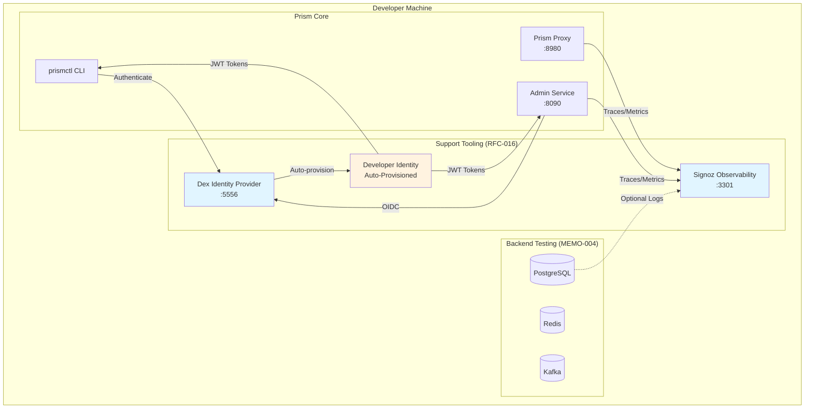

# RFC-016: Local Development Infrastructure

**Status**: Draft
**Author**: Platform Team
**Created**: 2025-10-09
**Updated**: 2025-10-09

## Abstract

This RFC defines the **local development infrastructure** for Prism, covering support tooling that must be "online and locally supported" for a complete development experience. This includes:

1. **Signoz**: OpenTelemetry observability (traces, metrics, logs)
2. **Dex**: Identity provider for OIDC authentication
3. **Developer Identity Auto-Provisioning**: Simplified authentication for local development
4. **Lifecycle Management**: How these components are versioned, updated, and managed
5. **Independence**: Each stack runs independently without coupling to backend testing infrastructure

The goal is to provide developers with **production-like infrastructure locally** while maintaining **simplicity and low resource footprint**.

## Motivation

### Problem Statement

**Current Pain Points:**
1. **No Local Observability**: Developers debug with console logs, can't see distributed traces
2. **Manual Auth Setup**: Dex requires manual configuration, slows down local testing
3. **Scattered Infrastructure**: Backend compose files mix testing and support services
4. **Login Friction**: Every local restart requires re-authentication
5. **No Lifecycle Management**: No clear process for updating support tooling versions

**Requirements:**
- **Observability**: Full OpenTelemetry stack (traces, metrics, logs) for debugging
- **Authentication**: OIDC provider (Dex) for admin API and data proxy
- **Developer UX**: Auto-login, pre-provisioned identity, zero-config setup
- **Independence**: Each service runs standalone, can be started/stopped individually
- **Resource Efficient**: &lt;3GB RAM total for all support services
- **Production Parity**: Same patterns local and production (OpenTelemetry, OIDC)

### Goals

1. **Complete Local Stack**: Observability + Auth + Support tooling
2. **Zero-Config Developer Experience**: Run `make dev-up` → everything works
3. **Auto-Provisioned Identity**: Developer user pre-configured in Dex
4. **Independent Lifecycle**: Update Signoz without touching Dex or backends
5. **Clear Documentation**: Developers know what each service does and how to use it

### Non-Goals

- **Production Deployment**: This RFC covers local development only
- **Scalability**: Local instances are single-node, not HA
- **Multi-tenancy**: Local dev assumes single developer environment
- **CI/CD**: Separate RFC will cover CI observability and auth

## Architecture Overview

### Support Tooling Categories



**Category 1: Observability**
- **Signoz**: Traces, metrics, logs (ADR-048)
- **Purpose**: Debug distributed systems, validate instrumentation
- **Lifecycle**: Independent, updated quarterly

**Category 2: Authentication**
- **Dex**: OIDC identity provider (ADR-046)
- **Developer Identity**: Auto-provisioned user for local development
- **Purpose**: Test OIDC flows, avoid login friction
- **Lifecycle**: Independent, updated yearly

**Category 3: Backend Testing**
- **Postgres, Redis, Kafka**: Data backends (MEMO-004)
- **Purpose**: Integration and acceptance testing
- **Lifecycle**: Per-backend versioning, testcontainers

### Independence Principle

Each support service has its own Docker Compose file:

local-dev/
├── signoz/
│   ├── docker-compose.signoz.yml
│   ├── otel-collector-config.yaml
│   └── README.md
├── dex/
│   ├── docker-compose.dex.yml
│   ├── dex-config.yaml
│   ├── static-users.yaml
│   └── README.md
└── all/
    ├── docker-compose.all.yml  # Start everything
    └── Makefile
```text

**Benefits:**
- Start/stop services independently
- Update versions without affecting other services
- Developer can choose what to run (only Dex, only Signoz, or both)
- Clear ownership and documentation per service

## Component 1: Signoz Observability

**See ADR-048 for complete details.**

### Quick Start

```
# Start Signoz
cd local-dev/signoz
docker-compose -f docker-compose.signoz.yml up -d

# Access UI
open http://localhost:3301

# Configure Prism to send telemetry
export OTEL_EXPORTER_OTLP_ENDPOINT=http://localhost:4317
```text

### Integration Points

**Prism Proxy:**
```
// Automatically uses OTEL_EXPORTER_OTLP_ENDPOINT if set
// proxy/src/main.rs
fn main() {
    init_observability()?; // Sets up OpenTelemetry
    // ...
}
```text

**Backend Plugins:**
```
// plugins/<backend>/main.go
func main() {
    observability.InitTracer("prism-plugin-postgres")
    // Reads OTEL_EXPORTER_OTLP_ENDPOINT from environment
}
```text

### Resource Usage

- **Memory**: ~1.5GB (ClickHouse + services)
- **CPU**: 2 cores max
- **Ports**: 3301 (UI), 4317 (OTLP gRPC), 4318 (OTLP HTTP)
- **Startup Time**: ~20 seconds

## Component 2: Dex Identity Provider

**Builds on ADR-046.**

### Architecture

```
sequenceDiagram
    participant Dev as Developer
    participant CLI as prismctl
    participant Dex as Dex (Local)
    participant Admin as Admin Service

    Note over Dex: Pre-provisioned user:<br/>dev@local.prism

    Dev->>CLI: prism namespace list
    CLI->>Dex: Check cached token<br/>~/.prism/token

    alt Token Valid
        CLI->>Admin: Request with JWT
    else Token Missing/Expired
        CLI->>Dex: Device code flow
        Dex-->>CLI: Auto-approve for dev@local.prism
        CLI->>CLI: Cache token (~/.prism/token)
        CLI->>Admin: Request with JWT
    end

    Admin->>Dex: Validate JWT (JWKS)
    Dex-->>Admin: Valid
    Admin-->>CLI: Response
    CLI-->>Dev: Result
```text

### Dex Configuration

Location: `local-dev/dex/dex-config.yaml`

```
issuer: http://localhost:5556/dex

storage:
  type: sqlite3
  config:
    file: /var/dex/dex.db

web:
  http: 0.0.0.0:5556

telemetry:
  http: 0.0.0.0:5558

# CORS for local development
grpc:
  addr: 0.0.0.0:5557
  tlsCert: ""
  tlsKey: ""

# Static clients (prismctl, admin UI)
staticClients:
  - id: prismctl
    name: "Prism CLI"
    secret: local-dev-secret-not-for-production
    redirectURIs:
      - http://localhost:8090/auth/callback
      - http://127.0.0.1:8090/auth/callback
    public: true  # Public client (no client secret required)

  - id: prism-admin-ui
    name: "Prism Admin UI"
    secret: admin-ui-local-secret
    redirectURIs:
      - http://localhost:3000/auth/callback
      - http://127.0.0.1:3000/auth/callback

# Enable device code flow for CLI
oauth2:
  skipApprovalScreen: true  # Auto-approve for local dev
  responseTypes: ["code", "token", "id_token"]

# Connectors: Static users for local dev
connectors:
  - type: local
    id: local
    name: Local
    config:
      enablePasswordDB: true

# Enable password grant (for automated testing)
enablePasswordDB: true
```text

### Static Developer User

Location: `local-dev/dex/static-users.yaml`

```
# Pre-provisioned developer user
# Password is bcrypt hash of "devpass"
staticPasswords:
  - email: "dev@local.prism"
    hash: "$2a$10$2b2cU8CPhOTaGrs1HRQuAueS7JTT5ZHsHSzYiFPm1leZck7Mc8T4W"
    username: "developer"
    userID: "08a8684b-db88-4b73-90a9-3cd1661f5466"
    groups:
      - "prism:admin"
      - "prism:operator"
      - "prism:viewer"

  - email: "test@local.prism"
    hash: "$2a$10$2b2cU8CPhOTaGrs1HRQuAueS7JTT5ZHsHSzYiFPm1leZck7Mc8T4W"
    username: "testuser"
    userID: "a0b1c2d3-e4f5-6789-0123-456789abcdef"
    groups:
      - "prism:viewer"
```text

**Default Credentials:**
- **Email**: `dev@local.prism`
- **Password**: `devpass`
- **Groups**: admin, operator, viewer (full access)

### Docker Compose Configuration

Location: `local-dev/dex/docker-compose.dex.yml`

```
version: '3.8'

services:
  dex:
    image: ghcr.io/dexidp/dex:v2.37.0
    container_name: prism-dex
    command: ["dex", "serve", "/etc/dex/dex-config.yaml"]
    volumes:
      - ./dex-config.yaml:/etc/dex/dex-config.yaml:ro
      - ./static-users.yaml:/etc/dex/static-users.yaml:ro
      - dex-data:/var/dex
    ports:
      - "5556:5556"  # HTTP
      - "5557:5557"  # gRPC
      - "5558:5558"  # Telemetry
    environment:
      - DEX_ISSUER=http://localhost:5556/dex
    mem_limit: 256m
    cpus: 0.25
    networks:
      - prism
    healthcheck:
      test: ["CMD", "wget", "-q", "-O-", "http://localhost:5556/dex/.well-known/openid-configuration"]
      interval: 10s
      timeout: 5s
      retries: 3

volumes:
  dex-data:
    driver: local

networks:
  prism:
    driver: bridge
    external: false
```text

### Developer Identity Auto-Provisioning

**Problem**: Logging in on every local restart is tedious.

**Solution**: CLI auto-authenticates with developer user credentials.

#### Implementation: Auto-Login Flow

```
// cli/src/auth/auto_login.rs

pub struct AutoLoginConfig {
    pub enabled: bool,
    pub email: String,
    pub password: String,
    pub issuer: String,
}

impl Default for AutoLoginConfig {
    fn default() -> Self {
        Self {
            enabled: is_local_dev(),
            email: "dev@local.prism".to_string(),
            password: "devpass".to_string(),
            issuer: "http://localhost:5556/dex".to_string(),
        }
    }
}

pub async fn auto_authenticate(config: &AutoLoginConfig) -> Result<TokenResponse> {
    if !config.enabled {
        return Err(Error::AutoLoginDisabled);
    }

    // Use resource owner password credentials grant (for local dev only)
    let client = reqwest::Client::new();
    let params = [
        ("grant_type", "password"),
        ("username", &config.email),
        ("password", &config.password),
        ("client_id", "prismctl"),
        ("scope", "openid profile email groups offline_access"),
    ];

    let response = client
        .post(format!("{}/token", config.issuer))
        .form(&params)
        .send()
        .await?;

    if !response.status().is_success() {
        return Err(Error::AutoLoginFailed(response.text().await?));
    }

    let token_response: TokenResponse = response.json().await?;

    // Cache token for future use
    cache_token(&token_response)?;

    Ok(token_response)
}

fn is_local_dev() -> bool {
    // Check environment variable or hostname
    env::var("PRISM_LOCAL_DEV")
        .map(|v| v == "true")
        .unwrap_or(false)
}
```text

#### CLI Integration

```
// cli/src/commands/namespace.rs

async fn list_namespaces(ctx: &Context) -> Result<()> {
    // Step 1: Check cached token
    let token = match load_cached_token() {
        Ok(token) if !token.is_expired() => {
            debug!("Using cached token");
            token
        }
        _ => {
            // Step 2: Auto-login if local dev
            if let Ok(token) = auto_authenticate(&AutoLoginConfig::default()).await {
                info!("Auto-authenticated as dev@local.prism");
                token
            } else {
                // Step 3: Fall back to device code flow
                info!("Starting OIDC device code flow...");
                device_code_flow(&ctx.config).await?
            }
        }
    };

    // Step 4: Make API call with token
    let namespaces = ctx.admin_client
        .list_namespaces()
        .bearer_auth(&token.access_token)
        .send()
        .await?
        .json()
        .await?;

    // Display results
    println!("{}", format_namespaces(&namespaces));
    Ok(())
}
```text

#### Environment Variable Toggle

```
# Enable auto-login (default for local dev)
export PRISM_LOCAL_DEV=true

# Disable auto-login (force device code flow)
export PRISM_LOCAL_DEV=false

# Prism CLI will auto-detect and authenticate
prism namespace list
# Output:
# [INFO] Auto-authenticated as dev@local.prism
# NAME              STATUS    BACKEND
# analytics         active    postgres
# events            active    kafka
```text

### Resource Usage

- **Memory**: ~256MB
- **CPU**: 0.25 cores
- **Ports**: 5556 (HTTP), 5557 (gRPC), 5558 (telemetry)
- **Startup Time**: ~5 seconds

## Component 3: Lifecycle Management

### Versioning Strategy

**Signoz:**
- Version: Pinned in `docker-compose.signoz.yml`
- Update Frequency: Quarterly (or when new features needed)
- Upgrade Path: Stop → pull new images → up → verify

**Dex:**
- Version: Pinned in `docker-compose.dex.yml`
- Update Frequency: Yearly (stable, infrequent releases)
- Upgrade Path: Stop → pull new image → up → verify OIDC flow

**Coordination:**
- No version dependencies between Signoz and Dex
- Can update independently
- Breaking changes documented in CHANGELOG

### Update Process

```
# Update Signoz
cd local-dev/signoz
docker-compose -f docker-compose.signoz.yml pull
docker-compose -f docker-compose.signoz.yml up -d

# Update Dex
cd local-dev/dex
docker-compose -f docker-compose.dex.yml pull
docker-compose -f docker-compose.dex.yml up -d

# Update all
cd local-dev
make update-support-services
```text

### Version Tracking

Location: `local-dev/versions.yaml`

```
# Prism Local Development Support Services
# Last updated: 2025-10-09

support_services:
  signoz:
    version: "0.39.0"
    updated: "2025-10-09"
    update_frequency: "quarterly"
    breaking_changes:
      - "0.39.0: ClickHouse schema migration required"

  signoz_otel_collector:
    version: "0.79.9"
    updated: "2025-10-09"
    update_frequency: "quarterly"

  clickhouse:
    version: "23.7-alpine"
    updated: "2025-10-09"
    update_frequency: "quarterly"

  dex:
    version: "v2.37.0"
    updated: "2025-10-09"
    update_frequency: "yearly"
    breaking_changes:
      - "v2.37.0: Static password hash format changed to bcrypt"

backend_testing:
  postgres:
    version: "16-alpine"
  redis:
    version: "7-alpine"
  kafka:
    version: "7.5.0"
  # See MEMO-004 for complete backend versions
```text

### Health Checks

```
# Check all support services
cd local-dev
./scripts/health-check.sh

# Output:
# ✅ Signoz UI (http://localhost:3301): healthy
# ✅ Signoz OTLP (grpc://localhost:4317): healthy
# ✅ Dex OIDC (http://localhost:5556): healthy
# ✅ Dex well-known config: valid
```text

## Usage Patterns

### Pattern 1: Start Everything

```
# Start all support services
cd local-dev
make dev-up

# Equivalent to:
# docker-compose -f signoz/docker-compose.signoz.yml up -d
# docker-compose -f dex/docker-compose.dex.yml up -d
```text

### Pattern 2: Start Only Signoz

```
# Just observability, no auth
cd local-dev/signoz
docker-compose -f docker-compose.signoz.yml up -d

# Start Prism without Dex (local mode, no auth)
export PRISM_AUTH_DISABLED=true
cargo run --release
```text

### Pattern 3: Start Only Dex

```
# Just auth, no observability
cd local-dev/dex
docker-compose -f docker-compose.dex.yml up -d

# Test OIDC flow
prism auth login
# Opens browser to http://localhost:5556/dex/auth
```text

### Pattern 4: Full Stack with Backends

```
# Start support services
make dev-up

# Start Redis backend
cd local-dev/backends
docker-compose -f docker-compose.backends.yml up redis -d

# Start Prism proxy with Redis plugin
export OTEL_EXPORTER_OTLP_ENDPOINT=http://localhost:4317
export PRISM_LOCAL_DEV=true
cargo run --release
```text

## Configuration Injection

### Environment Variables

Support services expose configuration via standard environment variables:

**Signoz (OpenTelemetry):**
```
# OTLP endpoint for Prism components
export OTEL_EXPORTER_OTLP_ENDPOINT=http://localhost:4317

# Service name (auto-detected by component)
# Proxy: prism-proxy
# Plugin: prism-plugin-{backend}
# Admin: prism-admin

# Environment label
export OTEL_RESOURCE_ATTRIBUTES="deployment.environment=local"
```text

**Dex (OIDC):**
```
# Issuer URL
export PRISM_OIDC_ISSUER=http://localhost:5556/dex

# Client ID for CLI
export PRISM_OIDC_CLIENT_ID=prismctl

# Auto-login (local dev only)
export PRISM_LOCAL_DEV=true
```text

### Configuration Files

**Prism Proxy Config:**
```
# proxy/config.yaml
observability:
  tracing:
    enabled: true
    # OTEL_EXPORTER_OTLP_ENDPOINT used if set
    # Default: http://localhost:4317
    otlp_endpoint: ${OTEL_EXPORTER_OTLP_ENDPOINT}
    service_name: prism-proxy

authentication:
  oidc:
    enabled: true
    issuer: ${PRISM_OIDC_ISSUER:-http://localhost:5556/dex}
    client_id: prism-proxy
    # Auto-discover JWKS from .well-known/openid-configuration
```text

**CLI Config:**
```
# ~/.prism/config.yaml
admin:
  endpoint: http://localhost:8090

auth:
  oidc:
    issuer: http://localhost:5556/dex
    client_id: prismctl
    auto_login: true  # Local dev only
```text

## Developer Workflows

### Workflow 1: First-Time Setup

```
# Clone repository
git clone https://github.com/org/prism.git
cd prism

# Bootstrap local development
make bootstrap

# What it does:
# 1. Creates ~/.prism/ directory
# 2. Generates default config.yaml
# 3. Pulls Docker images for support services
# 4. Starts Signoz and Dex
# 5. Waits for health checks
# 6. Auto-authenticates with dev@local.prism
# 7. Displays access URLs

# Output:
# ✅ Support services ready!
# 🔭 Signoz UI: http://localhost:3301
# 🔐 Dex OIDC: http://localhost:5556/dex
# 👤 Auto-authenticated as: dev@local.prism
```text

### Workflow 2: Daily Development

```
# Start support services (if not running)
make dev-up

# Start Prism proxy
cd proxy
cargo run --release

# In another terminal: Start backend plugin
cd plugins/postgres
go run ./cmd/server

# In another terminal: Use CLI
prism namespace list  # Auto-authenticates
prism session list
prism health
```text

### Workflow 3: Testing OIDC Integration

```
# Start Dex
cd local-dev/dex
docker-compose -f docker-compose.dex.yml up -d

# Test device code flow (manual)
export PRISM_LOCAL_DEV=false  # Disable auto-login
prism auth login

# Output:
# Visit: http://localhost:5556/dex/device
# Enter code: ABCD-1234
# [Opens browser]
# [User logs in as dev@local.prism with password: devpass]
# ✅ Authenticated successfully

# Test token caching
cat ~/.prism/token
# {
#   "access_token": "eyJh...",
#   "refresh_token": "Cgk...",
#   "expires_at": "2025-10-09T11:00:00Z"
# }
```text

### Workflow 4: Debugging with Traces

```
# Ensure Signoz is running
make dev-signoz-up

# Set OTLP endpoint
export OTEL_EXPORTER_OTLP_ENDPOINT=http://localhost:4317

# Start components with tracing
cargo run --release  # Proxy
go run ./cmd/server  # Plugin

# Make some requests
prism namespace create analytics --backend postgres
prism session list --namespace analytics

# View traces in Signoz
open http://localhost:3301
# Navigate to Traces tab
# Filter by service: prism-proxy
# Click trace to see full waterfall showing:
#   prism-proxy → admin-service → postgres
```text

## Production Considerations

**This RFC covers local development only.**

For production:
- **Signoz**: Deploy as HA cluster (see Signoz docs)
- **Dex**: Deploy with Kubernetes connector or enterprise SSO
- **Identity**: Connect to real identity providers (Okta, Azure AD, Google)
- **Secrets**: Use secret management, not static passwords

**Migration Path:**
1. Develop locally with RFC-016 infrastructure
2. Test with ADR-046 Dex setup
3. Deploy to staging with production OIDC provider
4. Validate observability with production Signoz cluster
5. Deploy to production with full monitoring

## Open Questions

1. **Auto-Update**: Should support services auto-update, or require manual upgrade?
   - **Proposal**: Manual upgrade with notifications
   - **Reasoning**: Avoid breaking changes mid-development

2. **Shared Network**: Should Signoz and Dex share Docker network with backends?
   - **Proposal**: Separate networks, bridge when needed
   - **Reasoning**: Clear service boundaries

3. **Data Retention**: How long to keep Signoz data locally?
   - **Proposal**: 3 days default, configurable
   - **Reasoning**: Balance disk space vs debugging needs

4. **Multi-User**: Support multiple developer identities?
   - **Proposal**: Start with single identity, add later if needed
   - **Reasoning**: YAGNI for local dev

5. **Windows Support**: How do these stacks run on Windows?
   - **Proposal**: Docker Desktop + WSL2
   - **Reasoning**: Standard Docker Compose should work

## Related Documents

- [ADR-047: OpenTelemetry Tracing Integration](/adr/adr-047)
- [ADR-046: Dex IDP for Local Identity Testing](/adr/adr-046)
- [ADR-048: Local Signoz Instance for Observability Testing](/adr/adr-048)
- [RFC-010: Admin Protocol with OIDC](/rfc/rfc-010)
- [RFC-011: Data Proxy Authentication](/rfc/rfc-011)
- [MEMO-004: Backend Plugin Implementation Guide](/memos/memo-004)

## Revision History

- 2025-10-09: Initial draft covering Signoz, Dex, developer identity auto-provisioning, and lifecycle management

```