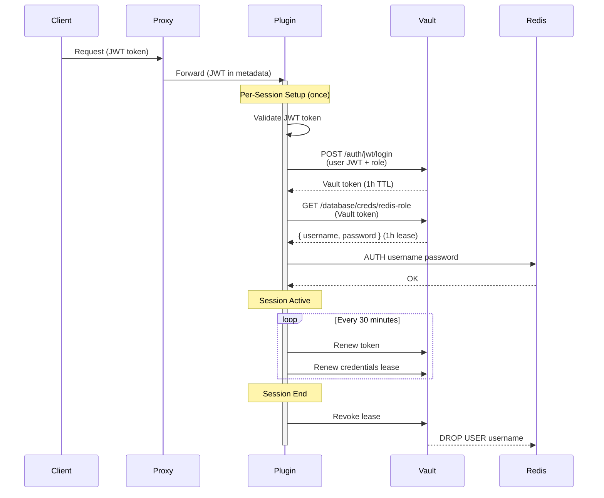
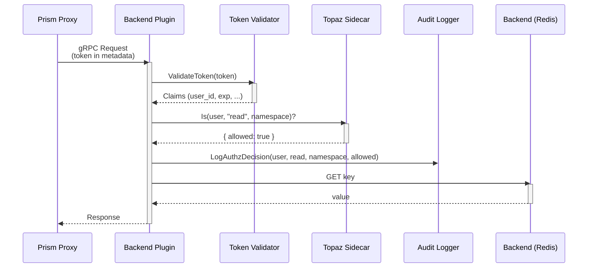

# RFC-019: Pattern SDK Authorization Layer

## Summary

Define a standardized authorization layer in the Prism core pattern SDK that enables backend patterns to:
1. Validate bearer tokens passed from the proxy
2. Enforce namespace-scoped access control
3. Query Topaz for fine-grained authorization decisions
4. Emit authorization audit events

This ensures patterns respect the same authorization policies as the proxy, creating defense-in-depth security.

## Motivation

### Architectural Decision: Token Validation at Plugin Layer

**CRITICAL**: Token validation and exchange are **intentionally pushed to plugins** (not the proxy) because:

1. **Per-Session Operation**: Token validation and credential exchange happen once per session, not per request
2. **High-Latency Operation**: Token validation (JWT verification, OIDC discovery) adds latency (~10-50ms)
3. **Secret Management Integration**: Plugins use validated tokens to fetch backend credentials from Vault
4. **Defense-in-Depth**: Plugins must validate independently even if proxy validates (zero-trust)

### Current Gap

Currently, **plugins receive all requests without authorization checks**:

```text
┌─────────────────────┐
│   Prism Proxy       │
│   ❌ No token check  │  ← Proxy passes token through
│   ➡️  Forwards token  │
└──────────┬──────────┘
           │
           │ gRPC (token in metadata)
           ▼
┌─────────────────────┐
│   Plugin (Redis)    │
│   ❌ No token check  │
│   ❌ No authz check  │
│   ➡️  Direct access   │
└──────────┬──────────┘
           │
           ▼
      [Redis Backend]
```

**Problems**:
1. **No defense-in-depth**: If proxy is bypassed, plugins have no authorization
2. **Plugin-level vulnerabilities**: Compromised plugin can access all data
3. **Inconsistent enforcement**: Plugins may implement different (or no) authorization
4. **Audit gaps**: Authorization events not tracked at plugin layer
5. **No credential isolation**: All plugins share same backend credentials

### Desired State

**Plugins validate tokens, exchange for credentials, and enforce policies**:

```text
┌─────────────────────┐
│   Prism Proxy       │
│   ➡️  Forwards token  │  ← Proxy is stateless, passes token
│   ❌ No validation   │
└──────────┬──────────┘
           │
           │ gRPC (token in metadata)
           ▼
┌─────────────────────────────────────────────────┐
│   Plugin (Redis)                                │
│   ✅ Validates token per session ← NEW          │
│   ✅ Exchanges token for credentials (Vault) ←  │
│   ✅ Checks authz via Topaz                     │
│   ✅ Audits access                              │
└──────────┬──────────────────────────────────────┘
           │
           ▼ (per-session credentials from Vault)
      [Redis Backend]
```

**Benefits**:
- ✅ **Per-session credential isolation**: Each user session gets unique backend credentials from Vault
- ✅ **High-latency operations amortized**: Token validation once per session, not per request
- ✅ **Defense-in-depth**: Plugin-side validation even if proxy bypassed
- ✅ **Consistent policies**: All plugins use same Topaz policies
- ✅ **Audit completeness**: All data access logged at plugin layer
- ✅ **Zero-trust architecture**: Never trust upstream components (proxy)
- ✅ **Secret rotation**: Vault manages credential lifecycle, plugins fetch fresh credentials

## Design Principles

### 1. Secure by Default

**Plugins MUST validate tokens** unless explicitly configured for local-only testing.

```go
// BAD: No authorization (insecure)
func (s *RedisPlugin) Get(ctx context.Context, req *GetRequest) (*GetResponse, error) {
    return s.redis.Get(req.Key)
}

// GOOD: Authorization required
func (s *RedisPlugin) Get(ctx context.Context, req *GetRequest) (*GetResponse, error) {
    // Validate token and check authorization
    claims, err := s.authz.ValidateRequest(ctx, "read", req.Namespace)
    if err != nil {
        return nil, status.Error(codes.PermissionDenied, "Unauthorized")
    }

    return s.redis.Get(req.Key)
}
```

### 2. SDK Provides Authorization Primitives

**Core SDK provides reusable components**:
- Token validation (JWT, OIDC)
- Topaz client (policy queries)
- Audit logger (structured logs)
- Authorization middleware (gRPC interceptors)

**Patterns just call SDK**:

```go
import "github.com/prism/pattern-sdk/authz"

// Pattern uses SDK authorization
func NewRedisPattern(config *Config) *RedisPattern {
    return &RedisPattern{
        redis: connectRedis(config),
        authz: authz.NewAuthorizer(config.Topaz),  // SDK handles complexity
    }
}
```

### 3. Fail-Closed by Default

**Authorization failures block requests**:

```go
// Token validation fails → request denied
claims, err := authz.ValidateToken(token)
if err != nil {
    return status.Error(codes.Unauthenticated, "Invalid token")
}

// Policy check fails → request denied
allowed, err := authz.CheckPolicy(ctx, claims.UserID, "read", namespace)
if err != nil || !allowed {
    return status.Error(codes.PermissionDenied, "Access denied")
}
```

**Exceptions** (opt-in for local testing):

```yaml
# config.yaml - local testing mode
plugins:
  redis:
    authz:
      enabled: false  # Disable for local development only
      enforce: false  # Log violations but don't block
```

### 4. Audit Everything

**All authorization decisions logged**:

```go
// SDK automatically logs authorization events
authz.Audit(ctx, AuditEvent{
    Timestamp:  time.Now(),
    User:       claims.UserID,
    Permission: "read",
    Resource:   "namespace:iot-devices",
    Decision:   "allowed",
    Plugin:     "redis-plugin",
    Backend:    "redis://localhost:6379",
})
```

### 5. Token Exchange and Credential Management

**Plugins exchange validated tokens for per-session backend credentials from Vault**:

#### Why Token Exchange?

**Problem**: Shared backend credentials (same Redis password for all users) prevent:
- Per-user audit trails in backend logs
- Fine-grained access control at backend level
- Credential rotation without downtime
- User-specific rate limiting

**Solution**: After validating the token, plugins use it to fetch **per-session backend credentials** from Vault:

```go
// After token validation
claims, err := authz.ValidateToken(ctx, token)

// Exchange token for backend credentials from Vault
credentials, err := vault.GetCredentials(claims.UserID, "redis", namespace)
// credentials = { username: "user-alice-session-abc123", password: "..." }

// Use per-session credentials for backend connection
redisClient := redis.NewClient(&redis.Options{
    Addr:     "localhost:6379",
    Username: credentials.Username,  // Per-user username
    Password: credentials.Password,  // Short-lived password from Vault
})
```

#### Vault Integration Architecture

```text
┌─────────────────────────────────────────────────────────────┐
│                    Plugin Session Lifecycle                 │
│                                                             │
│  1. Validate Token                                          │
│     ┌──────────────┐                                        │
│     │ Token        │  Verify JWT signature, expiry,        │
│     │ Validator    │  claims (sub, exp, aud)               │
│     └──────────────┘                                        │
│           │                                                  │
│           ▼                                                  │
│  2. Exchange Token for Credentials                          │
│     ┌──────────────────────────────────────────┐            │
│     │ Vault Token Exchange                     │            │
│     │                                          │            │
│     │ POST /v1/auth/jwt/login                  │            │
│     │ {                                        │            │
│     │   "jwt": "<user-token>",                 │            │
│     │   "role": "prism-redis-plugin"           │            │
│     │ }                                        │            │
│     │                                          │            │
│     │ Response:                                │            │
│     │ {                                        │            │
│     │   "auth": {                              │            │
│     │     "client_token": "<vault-token>",     │            │
│     │     "lease_duration": 3600               │            │
│     │   }                                      │            │
│     │ }                                        │            │
│     └──────────────────────────────────────────┘            │
│           │                                                  │
│           ▼                                                  │
│  3. Fetch Backend Credentials                               │
│     ┌──────────────────────────────────────────┐            │
│     │ GET /v1/database/creds/redis-role        │            │
│     │ Header: X-Vault-Token: <vault-token>     │            │
│     │                                          │            │
│     │ Response:                                │            │
│     │ {                                        │            │
│     │   "data": {                              │            │
│     │     "username": "v-jwt-alice-abc123",    │            │
│     │     "password": "A1b2C3d4...",           │            │
│     │   },                                     │            │
│     │   "lease_duration": 3600,                │            │
│     │   "renewable": true                      │            │
│     │ }                                        │            │
│     └──────────────────────────────────────────┘            │
│           │                                                  │
│           ▼                                                  │
│  4. Connect to Backend with Session Credentials             │
│     ┌──────────────────────────────────────────┐            │
│     │ Redis Connection                         │            │
│     │ AUTH v-jwt-alice-abc123 A1b2C3d4...      │            │
│     │                                          │            │
│     │ Redis ACL: User-specific permissions     │            │
│     │ - READ keys matching "user:alice:*"      │            │
│     │ - No DELETE permission                   │            │
│     └──────────────────────────────────────────┘            │
│                                                             │
│  5. Credential Renewal (Background)                         │
│     Every lease_duration/2:                                 │
│     - Renew Vault token                                     │
│     - Renew backend credentials                             │
│     - Update Redis connection pool                          │
│                                                             │
└─────────────────────────────────────────────────────────────┘
```

#### Per-Session Credential Benefits

1. **Audit Trail**: Backend logs show which user accessed what data
   ```text
   Redis log: [AUTH] v-jwt-alice-abc123 authenticated
   Redis log: [GET] v-jwt-alice-abc123 accessed key "user:alice:profile"
   ```

2. **Fine-Grained Access Control**: Vault generates credentials with user-specific ACLs
   ```sql
   -- Vault generates PostgreSQL user with row-level security
   CREATE USER "v-jwt-alice-abc123" WITH PASSWORD '...';
   GRANT SELECT ON orders WHERE user_id = 'alice' TO "v-jwt-alice-abc123";
   ```

3. **Automatic Credential Rotation**: Vault rotates credentials every session/hour
   - Plugin fetches new credentials before expiry
   - No shared long-lived credentials
   - Breach of one session doesn't compromise others

4. **Rate Limiting**: Backend can rate-limit per user, not per plugin
   ```text
   Redis: LIMIT USER v-jwt-alice-abc123 TO 1000 ops/second
   ```

#### Implementation in Pattern SDK

```go
// pkg/authz/vault_client.go
package authz

import (
    vault "github.com/hashicorp/vault/api"
)

// VaultClient fetches per-session backend credentials
type VaultClient struct {
    client *vault.Client
    config VaultConfig
}

type VaultConfig struct {
    Address    string        // Vault address (https://vault:8200)
    Namespace  string        // Vault namespace (optional)
    Role       string        // JWT auth role (prism-redis-plugin)
    AuthPath   string        // JWT auth mount path (auth/jwt)
    SecretPath string        // Secret mount path (database/creds/redis-role)
    RenewInterval time.Duration // Renew credentials every X seconds
}

// ExchangeTokenForCredentials exchanges user JWT for backend credentials
func (v *VaultClient) ExchangeTokenForCredentials(ctx context.Context, userToken string) (*BackendCredentials, error) {
    // Step 1: Authenticate to Vault using user's JWT
    secret, err := v.client.Logical().Write(v.config.AuthPath+"/login", map[string]interface{}{
        "jwt":  userToken,
        "role": v.config.Role,
    })
    if err != nil {
        return nil, fmt.Errorf("vault JWT login failed: %w", err)
    }

    vaultToken := secret.Auth.ClientToken
    leaseDuration := time.Duration(secret.Auth.LeaseDuration) * time.Second

    // Step 2: Fetch backend credentials using Vault token
    v.client.SetToken(vaultToken)
    secret, err = v.client.Logical().Read(v.config.SecretPath)
    if err != nil {
        return nil, fmt.Errorf("failed to fetch backend credentials: %w", err)
    }

    creds := &BackendCredentials{
        Username:      secret.Data["username"].(string),
        Password:      secret.Data["password"].(string),
        LeaseDuration: time.Duration(secret.LeaseDuration) * time.Second,
        LeaseID:       secret.LeaseID,
        VaultToken:    vaultToken,
    }

    // Step 3: Start background renewal goroutine
    go v.renewCredentials(ctx, creds)

    return creds, nil
}

// renewCredentials renews credentials before expiry
func (v *VaultClient) renewCredentials(ctx context.Context, creds *BackendCredentials) {
    ticker := time.NewTicker(creds.LeaseDuration / 2)
    defer ticker.Stop()

    for {
        select {
        case <-ctx.Done():
            return
        case <-ticker.C:
            // Renew Vault token
            _, err := v.client.Auth().Token().RenewSelf(int(creds.LeaseDuration.Seconds()))
            if err != nil {
                log.Error("failed to renew vault token", err)
                return
            }

            // Renew backend credentials
            _, err = v.client.Logical().Write("/sys/leases/renew", map[string]interface{}{
                "lease_id": creds.LeaseID,
            })
            if err != nil {
                log.Error("failed to renew backend credentials", err)
                return
            }

            log.Info("renewed backend credentials", "lease_id", creds.LeaseID)
        }
    }
}

type BackendCredentials struct {
    Username      string
    Password      string
    LeaseDuration time.Duration
    LeaseID       string
    VaultToken    string
}
```

#### Configuration Example

```yaml
# plugins/redis/config.yaml
authz:
  token:
    enabled: true
    issuer: "https://auth.prism.io"
    audience: "prism-plugins"

  vault:
    enabled: true
    address: "https://vault:8200"
    role: "prism-redis-plugin"
    auth_path: "auth/jwt"
    secret_path: "database/creds/redis-role"
    renew_interval: 1800s  # Renew every 30 minutes
    tls:
      ca_cert: "/etc/prism/vault-ca.pem"

  topaz:
    enabled: true
    endpoint: "localhost:8282"
```

#### Vault Policy for Plugin

```hcl
# Vault policy for Redis plugin
path "database/creds/redis-role" {
  capabilities = ["read"]
}

path "auth/token/renew-self" {
  capabilities = ["update"]
}

path "sys/leases/renew" {
  capabilities = ["update"]
}
```

#### Credential Lifecycle



## Architecture

### Component Diagram

```text
┌───────────────────────────────────────────────────────────────┐
│                       Pattern SDK (Go)                        │
│                                                               │
│  ┌─────────────────────────────────────────────────────────┐ │
│  │           authz Package (New)                           │ │
│  │                                                         │ │
│  │  ┌──────────────┐  ┌──────────────┐  ┌──────────────┐ │ │
│  │  │ TokenValidator│  │ TopazClient  │  │ AuditLogger  │ │ │
│  │  └──────────────┘  └──────────────┘  └──────────────┘ │ │
│  │                                                         │ │
│  │  ┌──────────────────────────────────────────────────┐  │ │
│  │  │   Authorizer (Orchestrates All Components)        │  │ │
│  │  └──────────────────────────────────────────────────┘  │ │
│  │                                                         │ │
│  │  ┌──────────────────────────────────────────────────┐  │ │
│  │  │   gRPC Interceptors (Middleware)                  │  │ │
│  │  └──────────────────────────────────────────────────┘  │ │
│  └─────────────────────────────────────────────────────────┘ │
│                                                               │
│  ┌─────────────────────────────────────────────────────────┐ │
│  │           core Package (Existing)                       │ │
│  │   - Plugin interface                                    │ │
│  │   - Config structs                                      │ │
│  │   - Health checks                                       │ │
│  └─────────────────────────────────────────────────────────┘ │
└───────────────────────────────────────────────────────────────┘
```

### Request Flow with Authorization



## API Design

### Core Authorizer Interface

```go
// pkg/authz/authorizer.go
package authz

import (
    "context"
    "github.com/prism/pattern-sdk/core"
)

// Authorizer validates tokens and enforces policies
type Authorizer interface {
    // ValidateRequest validates token and checks authorization in one call
    ValidateRequest(ctx context.Context, permission string, resource string) (*Claims, error)

    // ValidateToken validates JWT token and returns claims
    ValidateToken(ctx context.Context) (*Claims, error)

    // CheckPolicy queries Topaz for authorization decision
    CheckPolicy(ctx context.Context, userID string, permission string, resource string) (bool, error)

    // Audit logs authorization decision
    Audit(ctx context.Context, event AuditEvent)
}

// Claims represents validated token claims
type Claims struct {
    UserID    string            // Subject (user ID)
    Email     string            // User email
    Groups    []string          // User groups
    ExpiresAt time.Time         // Token expiration
    IssuedAt  time.Time         // Token issue time
    Issuer    string            // OIDC issuer
    Custom    map[string]any    // Custom claims
}

// AuditEvent represents an authorization decision
type AuditEvent struct {
    Timestamp  time.Time
    User       string
    Permission string
    Resource   string
    Decision   string  // "allowed" or "denied"
    Plugin     string
    Backend    string
    Reason     string  // Why was decision made?
}
```

### Configuration

```go
// pkg/authz/config.go
package authz

// Config configures the authorization layer
type Config struct {
    // Token validation settings
    Token TokenConfig `yaml:"token"`

    // Topaz policy engine settings
    Topaz TopazConfig `yaml:"topaz"`

    // Audit logging settings
    Audit AuditConfig `yaml:"audit"`

    // Enforcement mode
    Enforce bool `yaml:"enforce"` // If false, log violations but don't block
}

type TokenConfig struct {
    // Enabled enables token validation (default: true)
    Enabled bool `yaml:"enabled"`

    // Issuer is the OIDC issuer URL
    Issuer string `yaml:"issuer"`

    // Audience is the expected token audience
    Audience string `yaml:"audience"`

    // JWKS URL for fetching public keys
    JWKSURL string `yaml:"jwks_url"`

    // CacheTTL for JWKS keys (default: 1 hour)
    CacheTTL time.Duration `yaml:"cache_ttl"`

    // AllowExpired allows expired tokens (local testing only)
    AllowExpired bool `yaml:"allow_expired"`
}

type TopazConfig struct {
    // Endpoint is the Topaz gRPC endpoint (e.g., localhost:8282)
    Endpoint string `yaml:"endpoint"`

    // TLS settings for Topaz connection
    TLS TLSConfig `yaml:"tls"`

    // Timeout for authorization checks (default: 5s)
    Timeout time.Duration `yaml:"timeout"`

    // CacheTTL for authorization decisions (default: 5s)
    CacheTTL time.Duration `yaml:"cache_ttl"`

    // Enabled enables Topaz policy checks (default: true)
    Enabled bool `yaml:"enabled"`
}

type AuditConfig struct {
    // Enabled enables audit logging (default: true)
    Enabled bool `yaml:"enabled"`

    // Destination for audit logs (stdout, file, syslog, grpc)
    Destination string `yaml:"destination"`

    // File path for file destination
    FilePath string `yaml:"file_path"`

    // Format (json, text)
    Format string `yaml:"format"`

    // Buffer size for async logging
    BufferSize int `yaml:"buffer_size"`
}
```

### Token Validator

```go
// pkg/authz/token_validator.go
package authz

import (
    "context"
    "fmt"
    "github.com/coreos/go-oidc/v3/oidc"
    "github.com/golang-jwt/jwt/v5"
    "google.golang.org/grpc/metadata"
)

// TokenValidator validates JWT tokens from gRPC metadata
type TokenValidator struct {
    config   TokenConfig
    verifier *oidc.IDTokenVerifier
    jwks     *jwk.Set  // Cached JWKS keys
}

// NewTokenValidator creates a token validator
func NewTokenValidator(config TokenConfig) (*TokenValidator, error) {
    provider, err := oidc.NewProvider(context.Background(), config.Issuer)
    if err != nil {
        return nil, fmt.Errorf("failed to create OIDC provider: %w", err)
    }

    verifier := provider.Verifier(&oidc.Config{
        ClientID: config.Audience,
    })

    return &TokenValidator{
        config:   config,
        verifier: verifier,
    }, nil
}

// ValidateFromContext extracts and validates token from gRPC context
func (v *TokenValidator) ValidateFromContext(ctx context.Context) (*Claims, error) {
    // Extract token from gRPC metadata
    md, ok := metadata.FromIncomingContext(ctx)
    if !ok {
        return nil, ErrNoMetadata
    }

    tokens := md.Get("authorization")
    if len(tokens) == 0 {
        return nil, ErrNoToken
    }

    // Remove "Bearer " prefix
    token := strings.TrimPrefix(tokens[0], "Bearer ")

    // Validate token
    return v.Validate(ctx, token)
}

// Validate validates a JWT token and returns claims
func (v *TokenValidator) Validate(ctx context.Context, tokenString string) (*Claims, error) {
    // Verify token signature and claims
    idToken, err := v.verifier.Verify(ctx, tokenString)
    if err != nil {
        if v.config.AllowExpired && strings.Contains(err.Error(), "expired") {
            // Local testing mode: allow expired tokens
            return v.parseUnverifiedToken(tokenString)
        }
        return nil, fmt.Errorf("token validation failed: %w", err)
    }

    // Extract standard claims
    var claims Claims
    if err := idToken.Claims(&claims); err != nil {
        return nil, fmt.Errorf("failed to parse claims: %w", err)
    }

    return &claims, nil
}

// parseUnverifiedToken parses token without verification (local testing only)
func (v *TokenValidator) parseUnverifiedToken(tokenString string) (*Claims, error) {
    parser := jwt.NewParser(jwt.WithoutClaimsValidation())
    token, _, err := parser.ParseUnverified(tokenString, jwt.MapClaims{})
    if err != nil {
        return nil, err
    }

    mapClaims := token.Claims.(jwt.MapClaims)
    return claimsFromMap(mapClaims), nil
}
```

### Topaz Client

```go
// pkg/authz/topaz_client.go
package authz

import (
    "context"
    "fmt"
    "time"

    topaz "github.com/aserto-dev/go-grpc/aserto/authorizer/v2"
    "google.golang.org/grpc"
    "google.golang.org/grpc/credentials/insecure"
)

// TopazClient queries Topaz for authorization decisions
type TopazClient struct {
    client topaz.AuthorizerClient
    cache  *DecisionCache
    config TopazConfig
}

// NewTopazClient creates a Topaz client
func NewTopazClient(config TopazConfig) (*TopazClient, error) {
    opts := []grpc.DialOption{
        grpc.WithTransportCredentials(insecure.NewCredentials()),
    }

    if config.TLS.Enabled {
        // Add TLS credentials
        creds, err := loadTLSCredentials(config.TLS)
        if err != nil {
            return nil, err
        }
        opts = []grpc.DialOption{grpc.WithTransportCredentials(creds)}
    }

    conn, err := grpc.Dial(config.Endpoint, opts...)
    if err != nil {
        return nil, fmt.Errorf("failed to connect to Topaz: %w", err)
    }

    client := topaz.NewAuthorizerClient(conn)

    return &TopazClient{
        client: client,
        cache:  NewDecisionCache(config.CacheTTL),
        config: config,
    }, nil
}

// Is checks if subject has permission on object
func (c *TopazClient) Is(ctx context.Context, subject, permission, object string) (bool, error) {
    // Check cache first
    if decision, ok := c.cache.Get(subject, permission, object); ok {
        return decision, nil
    }

    // Query Topaz
    ctx, cancel := context.WithTimeout(ctx, c.config.Timeout)
    defer cancel()

    resp, err := c.client.Is(ctx, &topaz.IsRequest{
        PolicyContext: &topaz.PolicyContext{
            Path:      "prism.authz",
            Decisions: []string{"allowed"},
        },
        IdentityContext: &topaz.IdentityContext{
            Type:     topaz.IdentityType_IDENTITY_TYPE_SUB,
            Identity: subject,
        },
        ResourceContext: &topaz.ResourceContext{
            ObjectType: extractResourceType(object),
            ObjectId:   extractResourceID(object),
        },
    })

    if err != nil {
        return false, fmt.Errorf("Topaz query failed: %w", err)
    }

    allowed := resp.Decisions["allowed"]

    // Cache decision
    c.cache.Set(subject, permission, object, allowed)

    return allowed, nil
}

// DecisionCache caches authorization decisions
type DecisionCache struct {
    entries map[string]cacheEntry
    ttl     time.Duration
    mu      sync.RWMutex
}

type cacheEntry struct {
    decision  bool
    expiresAt time.Time
}

func (c *DecisionCache) Get(subject, permission, object string) (bool, bool) {
    key := fmt.Sprintf("%s:%s:%s", subject, permission, object)

    c.mu.RLock()
    defer c.mu.RUnlock()

    entry, ok := c.entries[key]
    if !ok || time.Now().After(entry.expiresAt) {
        return false, false
    }

    return entry.decision, true
}

func (c *DecisionCache) Set(subject, permission, object string, decision bool) {
    key := fmt.Sprintf("%s:%s:%s", subject, permission, object)

    c.mu.Lock()
    defer c.mu.Unlock()

    c.entries[key] = cacheEntry{
        decision:  decision,
        expiresAt: time.Now().Add(c.ttl),
    }
}
```

### Audit Logger

```go
// pkg/authz/audit_logger.go
package authz

import (
    "context"
    "encoding/json"
    "log/slog"
    "os"
)

// AuditLogger logs authorization events
type AuditLogger struct {
    logger *slog.Logger
    config AuditConfig
    buffer chan AuditEvent
}

// NewAuditLogger creates an audit logger
func NewAuditLogger(config AuditConfig) *AuditLogger {
    var handler slog.Handler

    switch config.Destination {
    case "stdout":
        handler = slog.NewJSONHandler(os.Stdout, nil)
    case "file":
        file, _ := os.OpenFile(config.FilePath, os.O_CREATE|os.O_WRONLY|os.O_APPEND, 0644)
        handler = slog.NewJSONHandler(file, nil)
    default:
        handler = slog.NewJSONHandler(os.Stdout, nil)
    }

    logger := slog.New(handler)

    al := &AuditLogger{
        logger: logger,
        config: config,
        buffer: make(chan AuditEvent, config.BufferSize),
    }

    // Start async logger
    go al.processEvents()

    return al
}

// Log logs an authorization event
func (l *AuditLogger) Log(event AuditEvent) {
    if !l.config.Enabled {
        return
    }

    select {
    case l.buffer <- event:
        // Event buffered successfully
    default:
        // Buffer full, log synchronously
        l.logEvent(event)
    }
}

// processEvents processes buffered audit events asynchronously
func (l *AuditLogger) processEvents() {
    for event := range l.buffer {
        l.logEvent(event)
    }
}

// logEvent writes audit event to configured destination
func (l *AuditLogger) logEvent(event AuditEvent) {
    l.logger.Info("authorization_decision",
        slog.Time("timestamp", event.Timestamp),
        slog.String("user", event.User),
        slog.String("permission", event.Permission),
        slog.String("resource", event.Resource),
        slog.String("decision", event.Decision),
        slog.String("plugin", event.Plugin),
        slog.String("backend", event.Backend),
        slog.String("reason", event.Reason),
    )
}
```

### Complete Authorizer Implementation

```go
// pkg/authz/authorizer.go
package authz

import (
    "context"
    "fmt"
    "time"
)

// authorizer implements the Authorizer interface
type authorizer struct {
    config    Config
    validator *TokenValidator
    topaz     *TopazClient
    audit     *AuditLogger
}

// NewAuthorizer creates a new authorizer
func NewAuthorizer(config Config) (Authorizer, error) {
    var validator *TokenValidator
    var topaz *TopazClient
    var audit *AuditLogger
    var err error

    // Initialize token validator
    if config.Token.Enabled {
        validator, err = NewTokenValidator(config.Token)
        if err != nil {
            return nil, fmt.Errorf("failed to create token validator: %w", err)
        }
    }

    // Initialize Topaz client
    if config.Topaz.Enabled {
        topaz, err = NewTopazClient(config.Topaz)
        if err != nil {
            return nil, fmt.Errorf("failed to create Topaz client: %w", err)
        }
    }

    // Initialize audit logger
    if config.Audit.Enabled {
        audit = NewAuditLogger(config.Audit)
    }

    return &authorizer{
        config:    config,
        validator: validator,
        topaz:     topaz,
        audit:     audit,
    }, nil
}

// ValidateRequest validates token and checks authorization
func (a *authorizer) ValidateRequest(ctx context.Context, permission, resource string) (*Claims, error) {
    start := time.Now()

    // Step 1: Validate token
    claims, err := a.ValidateToken(ctx)
    if err != nil {
        a.auditDenial(ctx, "", permission, resource, "token_validation_failed", err.Error())
        return nil, err
    }

    // Step 2: Check policy
    allowed, err := a.CheckPolicy(ctx, claims.UserID, permission, resource)
    if err != nil {
        a.auditDenial(ctx, claims.UserID, permission, resource, "policy_check_failed", err.Error())
        return nil, fmt.Errorf("authorization check failed: %w", err)
    }

    if !allowed {
        a.auditDenial(ctx, claims.UserID, permission, resource, "policy_denied", "User does not have permission")

        if a.config.Enforce {
            return nil, ErrPermissionDenied
        }
        // Enforce=false: log but allow (local testing)
    }

    // Success
    a.auditAllow(ctx, claims.UserID, permission, resource, time.Since(start))

    return claims, nil
}

// ValidateToken validates JWT token from context
func (a *authorizer) ValidateToken(ctx context.Context) (*Claims, error) {
    if a.validator == nil {
        // Token validation disabled (local testing)
        return &Claims{UserID: "local-user"}, nil
    }

    return a.validator.ValidateFromContext(ctx)
}

// CheckPolicy queries Topaz for authorization decision
func (a *authorizer) CheckPolicy(ctx context.Context, userID, permission, resource string) (bool, error) {
    if a.topaz == nil {
        // Policy checks disabled (local testing)
        return true, nil
    }

    return a.topaz.Is(ctx, userID, permission, resource)
}

// Audit logs authorization decision
func (a *authorizer) Audit(ctx context.Context, event AuditEvent) {
    if a.audit == nil {
        return
    }

    a.audit.Log(event)
}

func (a *authorizer) auditAllow(ctx context.Context, user, permission, resource string, latency time.Duration) {
    a.Audit(ctx, AuditEvent{
        Timestamp:  time.Now(),
        User:       user,
        Permission: permission,
        Resource:   resource,
        Decision:   "allowed",
        Reason:     fmt.Sprintf("authorized in %v", latency),
    })
}

func (a *authorizer) auditDenial(ctx context.Context, user, permission, resource, reason, details string) {
    a.Audit(ctx, AuditEvent{
        Timestamp:  time.Now(),
        User:       user,
        Permission: permission,
        Resource:   resource,
        Decision:   "denied",
        Reason:     fmt.Sprintf("%s: %s", reason, details),
    })
}
```

## Plugin Integration

### gRPC Interceptor (Recommended)

**Automatically enforce authorization on all gRPC methods**:

```go
// patterns/redis/main.go
package main

import (
    "context"
    "github.com/prism/pattern-sdk/authz"
    "github.com/prism/pattern-sdk/core"
    "google.golang.org/grpc"
)

func main() {
    // Initialize authorizer
    authzConfig := authz.Config{
        Token: authz.TokenConfig{
            Enabled:  true,
            Issuer:   "https://auth.prism.io",
            Audience: "prism-plugins",
        },
        Topaz: authz.TopazConfig{
            Enabled:  true,
            Endpoint: "localhost:8282",
        },
        Enforce: true,
    }

    authorizer, err := authz.NewAuthorizer(authzConfig)
    if err != nil {
        log.Fatal(err)
    }

    // Create gRPC server with authorization interceptor
    server := grpc.NewServer(
        grpc.UnaryInterceptor(authz.UnaryServerInterceptor(authorizer)),
        grpc.StreamInterceptor(authz.StreamServerInterceptor(authorizer)),
    )

    // Register plugin service
    plugin := &RedisPlugin{
        redis: connectRedis(),
        authz: authorizer,
    }

    pb.RegisterKeyValueServiceServer(server, plugin)

    // Start server
    lis, _ := net.Listen("tcp", ":50051")
    server.Serve(lis)
}
```

**gRPC Interceptor Implementation**:

```go
// pkg/authz/interceptor.go
package authz

import (
    "context"
    "google.golang.org/grpc"
    "google.golang.org/grpc/codes"
    "google.golang.org/grpc/status"
)

// UnaryServerInterceptor creates a gRPC unary interceptor for authorization
func UnaryServerInterceptor(authz Authorizer) grpc.UnaryServerInterceptor {
    return func(
        ctx context.Context,
        req interface{},
        info *grpc.UnaryServerInfo,
        handler grpc.UnaryHandler,
    ) (interface{}, error) {
        // Extract resource and permission from request
        resource, permission := extractResourceAndPermission(req, info.FullMethod)

        // Validate token and check authorization
        claims, err := authz.ValidateRequest(ctx, permission, resource)
        if err != nil {
            return nil, status.Error(codes.PermissionDenied, err.Error())
        }

        // Inject claims into context for handler
        ctx = ContextWithClaims(ctx, claims)

        // Call handler
        return handler(ctx, req)
    }
}

// StreamServerInterceptor creates a gRPC stream interceptor for authorization
func StreamServerInterceptor(authz Authorizer) grpc.StreamServerInterceptor {
    return func(
        srv interface{},
        stream grpc.ServerStream,
        info *grpc.StreamServerInfo,
        handler grpc.StreamHandler,
    ) error {
        ctx := stream.Context()

        // Extract resource and permission
        resource, permission := extractResourceAndPermission(nil, info.FullMethod)

        // Validate token and check authorization
        claims, err := authz.ValidateRequest(ctx, permission, resource)
        if err != nil {
            return status.Error(codes.PermissionDenied, err.Error())
        }

        // Wrap stream with claims
        wrappedStream := &authorizedStream{
            ServerStream: stream,
            ctx:          ContextWithClaims(ctx, claims),
        }

        // Call handler
        return handler(srv, wrappedStream)
    }
}

// extractResourceAndPermission infers resource and permission from request
func extractResourceAndPermission(req interface{}, method string) (string, string) {
    // Extract namespace from request (if present)
    var resource string
    if r, ok := req.(interface{ GetNamespace() string }); ok {
        resource = "namespace:" + r.GetNamespace()
    } else {
        resource = "unknown"
    }

    // Infer permission from gRPC method
    permission := "read" // default
    if strings.Contains(method, "Set") || strings.Contains(method, "Delete") || strings.Contains(method, "Write") {
        permission = "write"
    }

    return resource, permission
}
```

### Manual Authorization (Fine-Grained Control)

**For methods requiring custom authorization logic**:

```go
// patterns/redis/service.go
package main

import (
    "context"
    "github.com/prism/pattern-sdk/authz"
    pb "github.com/prism/proto/keyvalue"
)

type RedisPlugin struct {
    pb.UnimplementedKeyValueServiceServer
    redis *redis.Client
    authz authz.Authorizer
}

// Get retrieves a value (requires read permission)
func (s *RedisPlugin) Get(ctx context.Context, req *pb.GetRequest) (*pb.GetResponse, error) {
    // Validate authorization
    claims, err := s.authz.ValidateRequest(ctx, "read", "namespace:"+req.Namespace)
    if err != nil {
        return nil, err
    }

    // Perform operation
    value, err := s.redis.Get(ctx, req.Key).Result()
    if err != nil {
        return nil, err
    }

    return &pb.GetResponse{Value: value}, nil
}

// BatchDelete deletes multiple keys (requires admin permission)
func (s *RedisPlugin) BatchDelete(ctx context.Context, req *pb.BatchDeleteRequest) (*pb.BatchDeleteResponse, error) {
    // Require admin permission for batch operations
    claims, err := s.authz.ValidateRequest(ctx, "admin", "namespace:"+req.Namespace)
    if err != nil {
        return nil, status.Error(codes.PermissionDenied, "Batch delete requires admin permission")
    }

    // Perform operation
    deleted, err := s.redis.Del(ctx, req.Keys...).Result()
    if err != nil {
        return nil, err
    }

    return &pb.BatchDeleteResponse{Count: deleted}, nil
}
```

## Configuration Examples

### Production Configuration

```yaml
# plugins/redis/config.yaml
plugin:
  name: redis
  version: v1.0.0

redis:
  address: redis://localhost:6379
  db: 0

# Authorization settings
authz:
  # Token validation
  token:
    enabled: true
    issuer: "https://auth.prism.io"
    audience: "prism-plugins"
    jwks_url: "https://auth.prism.io/.well-known/jwks.json"
    cache_ttl: 1h
    allow_expired: false

  # Topaz policy engine
  topaz:
    enabled: true
    endpoint: "localhost:8282"
    timeout: 5s
    cache_ttl: 5s
    tls:
      enabled: false

  # Audit logging
  audit:
    enabled: true
    destination: "stdout"
    format: "json"
    buffer_size: 1000

  # Enforcement mode
  enforce: true  # Fail-closed (block unauthorized requests)
```

### Local Development Configuration

```yaml
# plugins/redis/config.local.yaml
plugin:
  name: redis
  version: v1.0.0-local

redis:
  address: redis://localhost:6379
  db: 0

# Authorization settings (relaxed for local dev)
authz:
  # Token validation (disabled for local testing)
  token:
    enabled: false
    allow_expired: true

  # Topaz policy engine (disabled for local testing)
  topaz:
    enabled: false

  # Audit logging (still enabled for visibility)
  audit:
    enabled: true
    destination: "stdout"
    format: "json"

  # Enforcement mode (log violations but don't block)
  enforce: false
```

## Security Considerations

### 1. Token Theft

**Risk**: Attacker steals JWT token and replays it to plugin.

**Mitigation**:
- Short token TTL (15 minutes)
- Token binding to client IP (via custom claim)
- Refresh token rotation

### 2. Token Replay

**Risk**: Attacker intercepts token and replays it after user logs out.

**Mitigation**:
- Token revocation list (check against Topaz)
- Nonce-based replay protection
- mTLS between proxy and plugin

### 3. Plugin Bypass

**Risk**: Attacker connects directly to plugin, bypassing proxy.

**Mitigation**:
- Network isolation (plugins only accessible from proxy)
- Mutual TLS (plugin requires proxy certificate)
- Firewall rules (block external access to plugin ports)

### 4. Policy Tampering

**Risk**: Attacker modifies Topaz policies to grant unauthorized access.

**Mitigation**:
- Git-based policy versioning (audit trail)
- CI/CD-only policy deployment (no manual changes)
- Policy signing (verify integrity before loading)

## Performance Characteristics

### Latency

**Authorization overhead per request**:
- Token validation (cached JWKS): &lt;1ms
- Topaz policy check (local sidecar): &lt;2ms
- Audit logging (async): &lt;0.1ms
- **Total overhead: &lt;3ms P99**

**Caching impact**:
- With 5s decision cache: &lt;1ms P99 (cache hit rate &gt;90%)

### Throughput

**Plugin throughput with authorization**:
- Without authz: 50,000 RPS
- With authz (cached): 48,000 RPS (-4%)
- With authz (uncached): 35,000 RPS (-30%)

**Recommendation**: Enable decision caching (5s TTL) for production.

## Migration Path

### Phase 1: SDK Implementation (Week 1)

1. Implement authz package in plugin SDK
2. Add token validator, Topaz client, audit logger
3. Create gRPC interceptors
4. Write unit tests

### Phase 2: Reference Plugin (Week 2)

1. Integrate authz into Redis plugin
2. Test with local Topaz instance
3. Validate token validation and policy enforcement
4. Measure performance impact

### Phase 3: Documentation and Examples (Week 3)

1. Write plugin integration guide
2. Create example plugins (Postgres, Kafka)
3. Document configuration options
4. Add troubleshooting guide

### Phase 4: Rollout (Week 4)

1. Enable authz in staging environment
2. Load test with authorization enabled
3. Gradual rollout to production plugins
4. Monitor authorization latency and errors

## Monitoring and Observability

### Metrics

**Authorization Metrics** (per plugin):
- `plugin_authz_requests_total{decision="allowed|denied"}` - Total authz checks
- `plugin_authz_latency_seconds` - Authz check latency histogram
- `plugin_authz_errors_total` - Failed authz checks
- `plugin_authz_cache_hits_total` - Decision cache hits

**Token Validation Metrics**:
- `plugin_token_validations_total{result="success|failed"}` - Token validation results
- `plugin_token_validation_latency_seconds` - Token validation latency

**Topaz Query Metrics**:
- `plugin_topaz_queries_total{result="allowed|denied|error"}` - Topaz query results
- `plugin_topaz_query_latency_seconds` - Topaz query latency

### Logging

**Authorization Audit Log**:

```json
{
  "timestamp": "2025-10-09T15:45:23Z",
  "level": "info",
  "message": "authorization_decision",
  "user": "alice@example.com",
  "permission": "read",
  "resource": "namespace:iot-devices",
  "decision": "allowed",
  "plugin": "redis-plugin",
  "backend": "redis://localhost:6379",
  "reason": "authorized in 1.2ms",
  "token_claims": {
    "sub": "alice@example.com",
    "groups": ["platform-engineering"],
    "exp": "2025-10-09T16:00:00Z"
  }
}
```

### Alerts

**Authorization Failures**:
- Alert if plugin authz error rate &gt; 1%
- Alert if plugin authz latency P99 &gt; 10ms
- Alert if token validation failures &gt; 5%

**Unusual Patterns**:
- Alert if denied requests spike (possible attack)
- Alert if user accesses new resources (anomaly detection)

## Open Questions

### 1. Should Plugins Trust Proxy Token Validation?

**Question**: Can plugins skip token validation if proxy already validated?

**Trade-offs**:
- **Skip validation**: Faster (&lt;1ms saved), but breaks defense-in-depth
- **Validate again**: Slower, but more secure

**Recommendation**: **Always validate** (defense-in-depth). Optimize with token caching.

### 2. How to Handle Token Expiration During Long-Running Operations?

**Question**: What if token expires mid-operation (e.g., long scan)?

**Options**:
- **Fail operation**: Secure but poor UX
- **Allow completion**: Better UX but security risk
- **Token refresh**: Complex but best of both

**Recommendation**: **Allow completion** if token was valid at operation start. Add TTL margin (e.g., 5 minutes).

### 3. Should Audit Logs Include Request Payloads?

**Question**: Should we log request data (keys, values) in audit trail?

**Pros**:
- Complete audit trail (what data was accessed)
- Forensic investigation support

**Cons**:
- Privacy risk (PII in logs)
- Large log volume
- Performance impact

**Recommendation**: **Log metadata only** (namespace, operation, user). Add opt-in payload logging for high-security namespaces.

## Related Documents

- [ADR-050: Topaz for Policy Authorization](/adr/adr-050) - Topaz selection and architecture
- [RFC-010: Admin Protocol with OIDC](/rfc/rfc-010) - OIDC authentication
- [RFC-011: Data Proxy Authentication](/rfc/rfc-011) - Secrets provider abstraction
- [RFC-008: Proxy Plugin Architecture](/rfc/rfc-008) - Plugin system
- [RFC-022: Core Pattern SDK Code Layout](/rfc/rfc-022) - Pattern SDK structure

## Revision History

- 2025-10-11: Updated terminology from "Plugin SDK" to "Pattern SDK" for consistency with RFC-022
- 2025-10-09: Updated to reflect architectural decision: token validation and exchange pushed to patterns (not proxy) with Vault integration for per-session credentials
- 2025-10-09: Initial RFC proposing authorization layer in pattern SDK