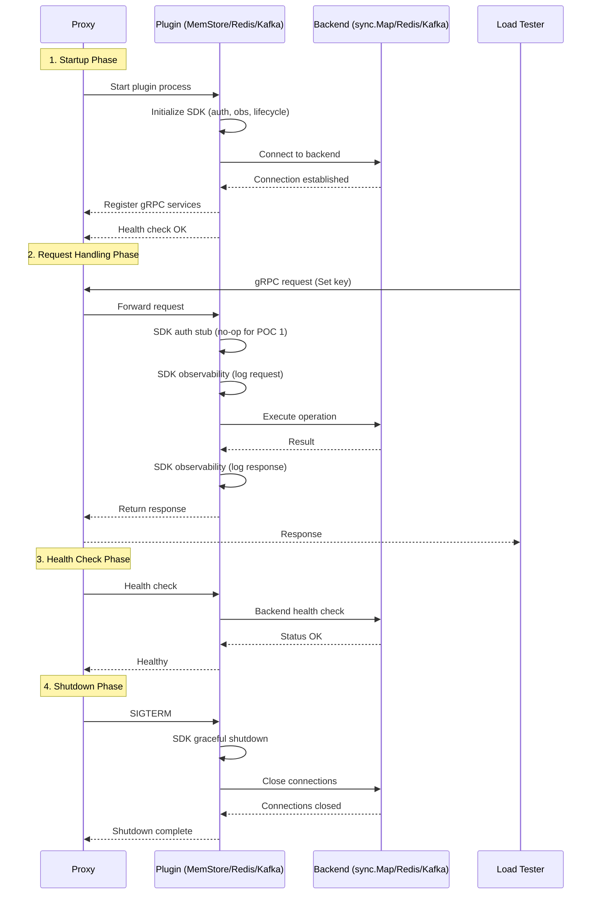

# RFC-021: POC 1 - Three Minimal Plugins Implementation Plan

## Summary

Detailed implementation plan for POC 1: **Three Minimal Plugins (Walking Skeleton)**. This RFC provides actionable work streams for building the thinnest end-to-end slice demonstrating proxy → plugin → backend architecture. POC 1 focuses on **minimal, focused plugins** (3 total), **plugin SDK skeleton**, **optimized builds** (statically linked executables), and **load testing** to validate performance.

**Key Changes from Previous Scope**:
- ❌ **No Admin API**: Use `prismctl` CLI instead
- ❌ **No Python client library**: Focus on backend infrastructure
- ✅ **Core Plugin SDK skeleton**: Reusable Go library from RFC-022
- ✅ **3 minimal plugins**: MemStore, Redis, Kafka (each focused on specific interfaces)
- ✅ **Load testing tool**: Go CLI for parallel load generation
- ✅ **Optimized builds**: Static linking, minimal Docker images (&lt;10MB)
- ✅ **TDD workflow**: Code coverage tracked from day one (target: 80%+)

**Timeline**: 2 weeks (10 working days)
**Team Size**: 2-3 engineers
**Approach**: Walking Skeleton with TDD - build thinnest end-to-end slice, measure coverage, iterate

## Motivation

### Problem

RFC-018 provides a high-level POC strategy, but POC 1 needs:
- **Minimal plugins**: Original plan had complex MemStore plugin; need 3 focused plugins
- **Plugin SDK foundation**: Reusable library for plugin authors
- **Build optimization**: Small Docker images for fast iteration
- **Load testing**: Validate performance claims early
- **TDD discipline**: Code coverage metrics from day one

### Goals

1. **Prove Architecture**: Demonstrate proxy → plugin → backend → load tester flow
2. **Minimal Focus**: Each plugin implements only what's needed (no extra features)
3. **SDK Foundation**: Build reusable plugin SDK skeleton from RFC-022
4. **Performance Validation**: Load testing tool to measure throughput/latency
5. **Quality Gates**: 80%+ code coverage, all tests passing
6. **Fast Iteration**: Optimized builds, Go module caching, parallel testing

## Objective: Walking Skeleton with TDD

Build the **thinnest possible end-to-end slice** demonstrating:
- ✅ Rust proxy receiving gRPC client requests
- ✅ 3 Go plugins: MemStore (in-memory), Redis (external), Kafka (streaming)
- ✅ Core Plugin SDK skeleton (auth, observability stubs, lifecycle)
- ✅ Load testing tool (Go CLI) generating parallel requests
- ✅ Optimized builds (static linking, &lt;10MB Docker images)
- ✅ **TDD workflow**: Write tests first, achieve 80%+ coverage

**What "Walking Skeleton" Means**:
- Implements minimal interfaces per plugin (no extra features)
- No authentication enforcement (SDK stubs only)
- Basic observability (structured logging, no metrics yet)
- Single namespace ("default")
- Focus: **prove the architecture works with measurable performance**

**What "TDD-Driven" Means**:
- Write interface tests BEFORE implementation
- Run tests in CI on every commit
- Track code coverage (target: 80%+ per component)
- Fail builds if coverage drops
- Use coverage reports to identify untested paths

## Architecture Overview

### Component Diagram

```text
┌───────────────────────────────────────────────────────────────────┐
│                        POC 1 Architecture                         │
│                                                                   │
│  ┌─────────────────────────────────────────────────────────────┐ │
│  │  Load Testing Tool (prism-load) - Go CLI                    │ │
│  │  - Parallel gRPC requests                                   │ │
│  │  - Configurable concurrency, duration, RPS                  │ │
│  │  - Reports latency P50/P99, throughput, errors              │ │
│  └────────────────┬────────────────────────────────────────────┘ │
│                   │                                               │
│                   │ gRPC (KeyValueService, PubSubService, etc.)   │
│                   ▼                                               │
│  ┌─────────────────────────────────────────────────────────────┐ │
│  │  Rust Proxy (proxy/)                                        │ │
│  │  - gRPC server on :8980                                     │ │
│  │  - Load plugin from config                                  │ │
│  │  - Forward requests to plugins                              │ │
│  └───┬─────────────────┬──────────────────┬────────────────────┘ │
│      │                 │                  │                       │
│      │ gRPC            │ gRPC             │ gRPC                  │
│      ▼                 ▼                  ▼                       │
│  ┌────────────┐   ┌────────────┐   ┌───────────────┐            │
│  │  MemStore  │   │   Redis    │   │     Kafka     │            │
│  │   Plugin   │   │   Plugin   │   │    Plugin     │            │
│  │            │   │            │   │               │            │
│  │ Built with │   │ Built with │   │  Built with   │            │
│  │ Plugin SDK │   │ Plugin SDK │   │  Plugin SDK   │            │
│  │            │   │            │   │               │            │
│  │ Implements:│   │ Implements:│   │  Implements:  │            │
│  │ - keyvalue │   │ - keyvalue │   │  - pubsub     │            │
│  │   _basic   │   │   _basic   │   │    _basic     │            │
│  │ - keyvalue │   │ - keyvalue │   │  - stream     │            │
│  │   _ttl     │   │   _scan    │   │    _basic     │            │
│  │ - list     │   │ - keyvalue │   │               │            │
│  │   _basic   │   │   _ttl     │   │               │            │
│  └────────────┘   └─────┬──────┘   └────────┬──────┘            │
│                         │                    │                   │
│                         ▼                    ▼                   │
│                   ┌───────────┐        ┌──────────┐             │
│                   │   Redis   │        │  Kafka   │             │
│                   │  (Docker) │        │ (Docker) │             │
│                   └───────────┘        └──────────┘             │
└───────────────────────────────────────────────────────────────────┘
```

### Technology Stack

| Component | Language | Framework/Library | Protocol | Image Size Target |
|-----------|----------|-------------------|----------|-------------------|
| Proxy | Rust | tokio, tonic (gRPC) | gRPC | &lt;5MB (static) |
| Plugin SDK | Go | google.golang.org/grpc | Library | N/A (library) |
| MemStore Plugin | Go | Plugin SDK | gRPC | &lt;3MB (static) |
| Redis Plugin | Go | Plugin SDK, go-redis | gRPC | &lt;5MB (static) |
| Kafka Plugin | Go | Plugin SDK, sarama | gRPC | &lt;8MB (static) |
| Load Tester | Go | google.golang.org/grpc | gRPC | &lt;3MB (static) |

## Three Plugin Division

### Plugin 1: MemStore (In-Memory)

**Focus**: Fastest possible implementation with no external dependencies

**Interfaces Implemented**:
- `keyvalue_basic` - Set, Get, Delete, Exists
- `keyvalue_ttl` - Expire, GetTTL, Persist
- `list_basic` - PushLeft, PushRight, PopLeft, PopRight, Length

**Backend**: Go `sync.Map` + slices (in-process)

**Why This Plugin**:
- Zero dependencies (no Docker, no network)
- Ideal for unit tests and local development
- Proves plugin SDK integration
- Baseline performance measurement (nanosecond latency)

**Code Organization**:
```text
plugins/memstore/
├── go.mod                  # Module: github.com/prism/plugins/memstore
├── main.go                 # Entry point (uses SDK)
├── storage/
│   ├── keyvalue.go         # sync.Map implementation
│   ├── keyvalue_test.go    # &gt;80% coverage
│   ├── list.go             # Slice implementation
│   └── list_test.go        # &gt;80% coverage
├── Dockerfile              # Multi-stage build, static binary
└── Makefile                # Build, test, coverage targets
```

**Test Coverage Target**: 85%+ (simplest plugin, should have highest coverage)

### Plugin 2: Redis (External In-Memory)

**Focus**: External backend integration, testing connection pooling and error handling

**Interfaces Implemented**:
- `keyvalue_basic` - Set, Get, Delete, Exists
- `keyvalue_scan` - Scan, ScanKeys, Count
- `keyvalue_ttl` - Expire, GetTTL, Persist

**Backend**: Redis 7.2 (Docker testcontainer)

**Why This Plugin**:
- Tests external backend connectivity
- Validates SDK connection pooling utilities
- Proves retry logic and error handling
- Realistic latency characteristics (microseconds)

**Code Organization**:
```text
plugins/redis/
├── go.mod
├── main.go
├── client/
│   ├── pool.go             # Connection pool using SDK
│   ├── pool_test.go
│   ├── keyvalue.go         # Redis commands
│   └── keyvalue_test.go
├── Dockerfile
└── Makefile
```

**Test Coverage Target**: 80%+ (includes integration tests with testcontainers)

### Plugin 3: Kafka (Streaming)

**Focus**: Streaming interfaces, producer/consumer patterns

**Interfaces Implemented**:
- `pubsub_basic` - Publish, Subscribe, Unsubscribe
- `stream_basic` - Append, Read, Trim

**Backend**: Kafka 3.6 (Docker testcontainer)

**Why This Plugin**:
- Tests streaming semantics (vs request/response)
- Validates SDK streaming helpers
- Proves pub/sub pattern implementation
- Different latency profile (milliseconds)

**Code Organization**:
```text
plugins/kafka/
├── go.mod
├── main.go
├── producer/
│   ├── writer.go           # Kafka producer using SDK
│   ├── writer_test.go
│   └── buffer.go           # Async buffering
├── consumer/
│   ├── reader.go           # Kafka consumer using SDK
│   └── reader_test.go
├── Dockerfile
└── Makefile
```

**Test Coverage Target**: 80%+ (streaming patterns are complex, focus on critical paths)

## Plugin Lifecycle

### Mermaid Diagram



### Lifecycle Phases Explained

**1. Startup** (Target: &lt;100ms per plugin)
- Plugin process starts (statically linked binary)
- SDK initializes: auth stubs, observability, lifecycle hooks
- Backend connection established (with retry logic)
- gRPC services registered
- Health check endpoint responds

**2. Request Handling** (Target: &lt;1ms proxy → plugin latency)
- Proxy forwards request to plugin via gRPC
- SDK auth stub validates (no-op for POC 1, returns OK)
- SDK observability logs request details
- Plugin executes backend operation
- SDK observability logs response details
- Result returned to proxy

**3. Health Checks** (Target: &lt;10ms)
- Periodic health checks from proxy
- Plugin checks backend connection
- Returns healthy/unhealthy status

**4. Shutdown** (Target: &lt;1s graceful shutdown)
- SIGTERM received
- SDK graceful shutdown handler triggered
- In-flight requests completed
- Backend connections closed
- Process exits cleanly

## Work Streams

### Work Stream 1: Protobuf Schema and Code Generation

**Owner**: 1 engineer
**Duration**: 1 day
**Dependencies**: None (can start immediately)

#### Tasks

**Task 1.1: Define KeyValue protobuf interfaces** (2 hours)

Interfaces needed:
- `keyvalue_basic.proto` - Set, Get, Delete, Exists
- `keyvalue_scan.proto` - Scan, ScanKeys, Count
- `keyvalue_ttl.proto` - Expire, GetTTL, Persist

**Task 1.2: Define PubSub and Stream interfaces** (2 hours)

Interfaces needed:
- `pubsub_basic.proto` - Publish, Subscribe, Unsubscribe
- `stream_basic.proto` - Append, Read, Trim

**Task 1.3: Define List interface** (1 hour)

Interfaces needed:
- `list_basic.proto` - PushLeft, PushRight, PopLeft, PopRight, Length

**Task 1.4: Create Makefile for proto generation** (2 hours)

```makefile
# Makefile (root)
.PHONY: proto proto-rust proto-go clean-proto

proto: proto-rust proto-go

proto-rust:
	@echo "Generating Rust protobuf code..."
	protoc --rust_out=proto/rust/ --tonic_out=proto/rust/ \
		proto/interfaces/**/*.proto

proto-go:
	@echo "Generating Go protobuf code..."
	protoc --go_out=proto/go/ --go-grpc_out=proto/go/ \
		--go_opt=paths=source_relative \
		--go-grpc_opt=paths=source_relative \
		proto/interfaces/**/*.proto

clean-proto:
	rm -rf proto/rust/*.rs proto/go/*.go
```

**Task 1.5: Setup Go module caching** (1 hour)

```makefile
# Enable Go module caching in monorepo
export GOMODCACHE=$(shell pwd)/.gomodcache
export GOCACHE=$(shell pwd)/.gocache

# Ensure cache directories exist
cache-dirs:
	mkdir -p .gomodcache .gocache

# All Go builds depend on cache directories
go-build: cache-dirs proto-go
	cd plugins/memstore && go build -o bin/memstore main.go
	cd plugins/redis && go build -o bin/redis main.go
	cd plugins/kafka && go build -o bin/kafka main.go
	cd tools/prism-load && go build -o bin/prism-load main.go
```

**Acceptance Criteria**:
- [ ] All protobuf files compile without errors
- [ ] Rust and Go code generated
- [ ] Makefile targets work
- [ ] Go module cache shared across plugins
- [ ] `make proto` runs in &lt;10 seconds

**TDD Checkpoint**: N/A (protobuf generation, no tests needed)

### Work Stream 2: Core Plugin SDK Skeleton

**Owner**: 1 engineer (Go expert)
**Duration**: 2 days
**Dependencies**: Task 1.4 (protobuf generation)

#### Tasks

**Task 2.1: Create SDK package structure** (half day)

```text
plugins/core/
├── go.mod                  # Module: github.com/prism/plugins/core
├── auth/
│   ├── stub.go             # Auth stub (always returns OK)
│   └── stub_test.go
├── observability/
│   ├── logger.go           # Structured logging (zap)
│   └── logger_test.go
├── lifecycle/
│   ├── hooks.go            # Startup/shutdown hooks
│   └── hooks_test.go
├── server/
│   ├── grpc.go             # gRPC server setup
│   └── grpc_test.go
└── storage/
    ├── retry.go            # Retry logic with backoff
    └── retry_test.go
```

**Task 2.2: Implement auth stub** (1 hour + 30 min tests)

```go
// plugins/core/auth/stub.go
package auth

import "context"

// StubValidator always returns OK (no-op for POC 1)
type StubValidator struct{}

func NewStubValidator() *StubValidator {
    return &StubValidator{}
}

func (v *StubValidator) Validate(ctx context.Context, token string) error {
    // POC 1: Always succeed
    return nil
}
```

**TDD Approach**:
1. Write test first: `TestStubValidator_AlwaysSucceeds`
2. Run test (should fail with no implementation)
3. Implement `StubValidator`
4. Run test (should pass)
5. Check coverage: `go test -cover` (target: 100% for stubs)

**Task 2.3: Implement observability logger** (2 hours + 1 hour tests)

```go
// plugins/core/observability/logger.go
package observability

import "go.uber.org/zap"

func NewLogger(level string) (*zap.Logger, error) {
    cfg := zap.NewProductionConfig()
    cfg.Level = zap.NewAtomicLevelAt(parseLevel(level))
    return cfg.Build()
}

func parseLevel(level string) zapcore.Level {
    switch level {
    case "debug":
        return zapcore.DebugLevel
    case "info":
        return zapcore.InfoLevel
    case "warn":
        return zapcore.WarnLevel
    case "error":
        return zapcore.ErrorLevel
    default:
        return zapcore.InfoLevel
    }
}
```

**TDD Approach**:
1. Write tests first:
   - `TestNewLogger_DefaultLevel`
   - `TestNewLogger_DebugLevel`
   - `TestParseLevel_AllLevels`
2. Run tests (should fail)
3. Implement logger functions
4. Run tests (should pass)
5. Check coverage: target 85%+

**Task 2.4: Implement lifecycle hooks** (2 hours + 1 hour tests)

```go
// plugins/core/lifecycle/hooks.go
package lifecycle

import (
    "context"
    "os"
    "os/signal"
    "syscall"
)

type Lifecycle struct {
    onStartup  func(context.Context) error
    onShutdown func(context.Context) error
}

func New() *Lifecycle {
    return &Lifecycle{}
}

func (l *Lifecycle) OnStartup(fn func(context.Context) error) {
    l.onStartup = fn
}

func (l *Lifecycle) OnShutdown(fn func(context.Context) error) {
    l.onShutdown = fn
}

func (l *Lifecycle) Start(ctx context.Context) error {
    if l.onStartup != nil {
        if err := l.onStartup(ctx); err != nil {
            return err
        }
    }
    return nil
}

func (l *Lifecycle) WaitForShutdown(ctx context.Context) error {
    sigCh := make(chan os.Signal, 1)
    signal.Notify(sigCh, syscall.SIGINT, syscall.SIGTERM)
    <-sigCh

    if l.onShutdown != nil {
        return l.onShutdown(ctx)
    }
    return nil
}
```

**TDD Approach**:
1. Write tests first:
   - `TestLifecycle_StartupHook`
   - `TestLifecycle_ShutdownHook`
   - `TestLifecycle_NoHooks`
2. Run tests (should fail)
3. Implement lifecycle functions
4. Run tests (should pass)
5. Check coverage: target 90%+

**Task 2.5: Implement retry logic** (1 hour + 30 min tests)

```go
// plugins/core/storage/retry.go
package storage

import (
    "context"
    "time"
)

type RetryPolicy struct {
    MaxAttempts    int
    InitialBackoff time.Duration
    MaxBackoff     time.Duration
    Multiplier     float64
}

func WithRetry(ctx context.Context, policy *RetryPolicy, fn func() error) error {
    var err error
    backoff := policy.InitialBackoff

    for attempt := 0; attempt < policy.MaxAttempts; attempt++ {
        err = fn()
        if err == nil {
            return nil
        }

        if attempt < policy.MaxAttempts-1 {
            time.Sleep(backoff)
            backoff = time.Duration(float64(backoff) * policy.Multiplier)
            if backoff > policy.MaxBackoff {
                backoff = policy.MaxBackoff
            }
        }
    }

    return err
}
```

**TDD Approach**:
1. Write tests first:
   - `TestWithRetry_Success`
   - `TestWithRetry_FailAfterMaxAttempts`
   - `TestWithRetry_BackoffProgression`
2. Run tests (should fail)
3. Implement retry logic
4. Run tests (should pass)
5. Check coverage: target 95%+

**Acceptance Criteria**:
- [ ] SDK package compiles
- [ ] All SDK tests pass
- [ ] Code coverage &gt;85% per package
- [ ] Coverage report generated: `make coverage-sdk`
- [ ] No external dependencies (except zap, grpc)

**Coverage Tracking**:
```makefile
# plugins/core/Makefile
coverage-sdk:
	go test -coverprofile=coverage.out ./...
	go tool cover -html=coverage.out -o coverage.html
	go tool cover -func=coverage.out | grep total | awk '{print "SDK Coverage: " $$3}'
```

### Work Stream 3: Rust Proxy Implementation

**Owner**: 1 engineer (Rust experience required)
**Duration**: 3 days
**Dependencies**: Task 1.4 (protobuf generation)

**Note**: TDD for Rust proxy deferred - focus on Go plugins first. Basic integration tests only.

#### Tasks

**Task 3.1: Setup Rust project with minimal config** (1 day)
**Task 3.2: Implement gRPC forwarding** (1 day)
**Task 3.3: Add plugin discovery from config** (1 day)

**Acceptance Criteria**:
- [ ] Proxy starts on :8980
- [ ] Forwards requests to plugins
- [ ] Loads config from YAML
- [ ] Integration test: proxy → memstore Set/Get

**TDD Checkpoint**: Basic integration test only (not full unit test coverage for POC 1)

### Work Stream 4: MemStore Plugin Implementation

**Owner**: 1 engineer (Go + TDD)
**Duration**: 2 days
**Dependencies**: Work Stream 2 (SDK skeleton)

**TDD Workflow**: Write interface tests FIRST, then implement

#### Tasks

**Task 4.1: Write KeyValue interface tests** (half day)

```go
// plugins/memstore/storage/keyvalue_test.go
package storage

import (
    "testing"
    "time"
)

func TestKeyValueStore_SetGet(t *testing.T) {
    store := NewKeyValueStore()

    err := store.Set("key1", []byte("value1"), 0)
    if err != nil {
        t.Fatalf("Set failed: %v", err)
    }

    value, found := store.Get("key1")
    if !found {
        t.Fatal("Key not found")
    }
    if string(value) != "value1" {
        t.Errorf("Expected value1, got %s", value)
    }
}

func TestKeyValueStore_TTL(t *testing.T) {
    store := NewKeyValueStore()

    err := store.Set("expires", []byte("soon"), 1) // 1 second TTL
    if err != nil {
        t.Fatalf("Set failed: %v", err)
    }

    // Should exist initially
    _, found := store.Get("expires")
    if !found {
        t.Fatal("Key should exist immediately")
    }

    // Wait for expiration
    time.Sleep(1200 * time.Millisecond)

    // Should not exist after TTL
    _, found = store.Get("expires")
    if found {
        t.Fatal("Key should be expired")
    }
}

func TestKeyValueStore_Delete(t *testing.T) {
    store := NewKeyValueStore()

    store.Set("delete-me", []byte("data"), 0)

    found := store.Delete("delete-me")
    if !found {
        t.Fatal("Delete should find key")
    }

    _, found = store.Get("delete-me")
    if found {
        t.Fatal("Key should be deleted")
    }
}

// ... more tests for Exists, concurrent access, etc.
```

**Task 4.2: Implement KeyValue storage** (half day)

Now implement to make tests pass:

```go
// plugins/memstore/storage/keyvalue.go
package storage

import (
    "sync"
    "time"
)

type KeyValueStore struct {
    data sync.Map
    ttls sync.Map
}

func NewKeyValueStore() *KeyValueStore {
    return &KeyValueStore{}
}

func (kv *KeyValueStore) Set(key string, value []byte, ttlSeconds int64) error {
    kv.data.Store(key, value)

    if ttlSeconds > 0 {
        kv.setTTL(key, time.Duration(ttlSeconds)*time.Second)
    }

    return nil
}

func (kv *KeyValueStore) Get(key string) ([]byte, bool) {
    value, ok := kv.data.Load(key)
    if !ok {
        return nil, false
    }
    return value.([]byte), true
}

func (kv *KeyValueStore) Delete(key string) bool {
    _, ok := kv.data.LoadAndDelete(key)
    if timer, found := kv.ttls.LoadAndDelete(key); found {
        timer.(*time.Timer).Stop()
    }
    return ok
}

func (kv *KeyValueStore) setTTL(key string, duration time.Duration) {
    timer := time.AfterFunc(duration, func() {
        kv.Delete(key)
    })
    kv.ttls.Store(key, timer)
}
```

**Task 4.3: Write List interface tests** (half day)
**Task 4.4: Implement List storage** (half day)

**Task 4.5: Write gRPC server tests** (half day)
**Task 4.6: Implement gRPC server** (half day)

**Acceptance Criteria**:
- [ ] All tests pass
- [ ] Code coverage &gt;85%
- [ ] Race detector clean: `go test -race`
- [ ] Benchmark tests show &lt;1µs latency
- [ ] Coverage report: `make coverage-memstore`

**Coverage Tracking**:
```makefile
# plugins/memstore/Makefile
test:
	go test -v -race ./...

coverage:
	go test -coverprofile=coverage.out ./...
	go tool cover -html=coverage.out -o coverage.html
	go tool cover -func=coverage.out | grep total

benchmark:
	go test -bench=. -benchmem ./...
```

### Work Stream 5: Redis Plugin Implementation

**Owner**: 1 engineer (Go + TDD)
**Duration**: 2 days
**Dependencies**: Work Stream 2 (SDK skeleton)

**TDD Workflow**: Write integration tests with testcontainers FIRST

#### Tasks

**Task 5.1: Write Redis integration tests** (1 day)

```go
// plugins/redis/client/keyvalue_test.go
package client

import (
    "context"
    "testing"

    "github.com/testcontainers/testcontainers-go"
    "github.com/testcontainers/testcontainers-go/wait"
)

func TestRedisClient_SetGet(t *testing.T) {
    ctx := context.Background()

    // Start Redis testcontainer
    req := testcontainers.ContainerRequest{
        Image:        "redis:7.2-alpine",
        ExposedPorts: []string{"6379/tcp"},
        WaitStrategy: wait.ForLog("Ready to accept connections"),
    }
    redis, err := testcontainers.GenericContainer(ctx, testcontainers.GenericContainerRequest{
        ContainerRequest: req,
        Started:          true,
    })
    if err != nil {
        t.Fatalf("Failed to start Redis: %v", err)
    }
    defer redis.Terminate(ctx)

    endpoint, _ := redis.Endpoint(ctx, "")

    // Create client
    client, err := NewRedisClient(endpoint)
    if err != nil {
        t.Fatalf("Failed to create client: %v", err)
    }
    defer client.Close()

    // Test Set/Get
    err = client.Set("key1", []byte("value1"), 0)
    if err != nil {
        t.Fatalf("Set failed: %v", err)
    }

    value, found, err := client.Get("key1")
    if err != nil {
        t.Fatalf("Get failed: %v", err)
    }
    if !found {
        t.Fatal("Key not found")
    }
    if string(value) != "value1" {
        t.Errorf("Expected value1, got %s", value)
    }
}

// ... more integration tests
```

**Task 5.2: Implement Redis client** (1 day)

Implement to make integration tests pass.

**Acceptance Criteria**:
- [ ] All integration tests pass
- [ ] Code coverage &gt;80%
- [ ] Connection pool works correctly
- [ ] Retry logic tested with connection failures
- [ ] Coverage report: `make coverage-redis`

### Work Stream 6: Kafka Plugin Implementation

**Owner**: 1 engineer (Go + TDD)
**Duration**: 2 days
**Dependencies**: Work Stream 2 (SDK skeleton)

**TDD Workflow**: Write integration tests with testcontainers FIRST

#### Tasks

**Task 6.1: Write Kafka integration tests** (1 day)
**Task 6.2: Implement Kafka producer/consumer** (1 day)

**Acceptance Criteria**:
- [ ] All integration tests pass
- [ ] Code coverage &gt;80%
- [ ] Pub/sub semantics work correctly
- [ ] Stream append/read tested
- [ ] Coverage report: `make coverage-kafka`

### Work Stream 7: Load Testing Tool

**Owner**: 1 engineer (Go + performance)
**Duration**: 1 day
**Dependencies**: Work Stream 3 (proxy running)

#### Tasks

**Task 7.1: Create prism-load CLI** (1 day)

```go
// tools/prism-load/main.go
package main

import (
    "context"
    "flag"
    "fmt"
    "sync"
    "time"

    "google.golang.org/grpc"
    pb "github.com/prism/proto/go"
)

type Config struct {
    ProxyAddress string
    Concurrency  int
    Duration     time.Duration
    RPS          int
    Operation    string // "set" | "get" | "scan"
}

func main() {
    cfg := parseFlags()

    conn, err := grpc.Dial(cfg.ProxyAddress, grpc.WithInsecure())
    if err != nil {
        panic(err)
    }
    defer conn.Close()

    client := pb.NewKeyValueBasicInterfaceClient(conn)

    runLoadTest(client, cfg)
}

func runLoadTest(client pb.KeyValueBasicInterfaceClient, cfg *Config) {
    ctx := context.Background()
    var wg sync.WaitGroup

    results := &Results{}

    for i := 0; i < cfg.Concurrency; i++ {
        wg.Add(1)
        go func(workerID int) {
            defer wg.Done()
            runWorker(ctx, client, workerID, cfg, results)
        }(i)
    }

    wg.Wait()

    printResults(results)
}

func runWorker(ctx context.Context, client pb.KeyValueBasicInterfaceClient, id int, cfg *Config, results *Results) {
    start := time.Now()
    count := 0

    for time.Since(start) < cfg.Duration {
        reqStart := time.Now()

        switch cfg.Operation {
        case "set":
            _, err := client.Set(ctx, &pb.SetRequest{
                Namespace: "default",
                Key:       fmt.Sprintf("key-%d-%d", id, count),
                Value:     []byte("test-value"),
            })
            if err != nil {
                results.RecordError()
            }
        case "get":
            _, err := client.Get(ctx, &pb.GetRequest{
                Namespace: "default",
                Key:       fmt.Sprintf("key-%d-%d", id, count%1000),
            })
            if err != nil {
                // Expected for non-existent keys
            }
        }

        latency := time.Since(reqStart)
        results.RecordLatency(latency)

        count++

        // Rate limiting
        if cfg.RPS > 0 {
            sleepDuration := time.Second/time.Duration(cfg.RPS) - latency
            if sleepDuration > 0 {
                time.Sleep(sleepDuration)
            }
        }
    }
}

type Results struct {
    mu        sync.Mutex
    latencies []time.Duration
    errors    int
}

func (r *Results) RecordLatency(d time.Duration) {
    r.mu.Lock()
    defer r.mu.Unlock()
    r.latencies = append(r.latencies, d)
}

func (r *Results) RecordError() {
    r.mu.Lock()
    defer r.mu.Unlock()
    r.errors++
}

func printResults(r *Results) {
    r.mu.Lock()
    defer r.mu.Unlock()

    sort.Slice(r.latencies, func(i, j int) bool {
        return r.latencies[i] < r.latencies[j]
    })

    total := len(r.latencies)
    p50 := r.latencies[total*50/100]
    p99 := r.latencies[total*99/100]

    fmt.Printf("Total requests: %d\n", total)
    fmt.Printf("Errors: %d\n", r.errors)
    fmt.Printf("Latency P50: %v\n", p50)
    fmt.Printf("Latency P99: %v\n", p99)
    fmt.Printf("Throughput: %.2f req/s\n", float64(total)/float64(time.Duration(total)*p50)*float64(time.Second))
}
```

**Usage**:
```bash
prism-load --proxy=localhost:8980 \
           --concurrency=100 \
           --duration=30s \
           --operation=set \
           --rps=10000
```

**Acceptance Criteria**:
- [ ] CLI compiles to &lt;3MB binary
- [ ] Supports configurable concurrency
- [ ] Reports P50/P99 latency
- [ ] Reports throughput (req/s)
- [ ] Reports error rate

**TDD Checkpoint**: Integration test only (CLI tool, not unit tested)

### Work Stream 8: Build Optimization

**Owner**: 1 engineer (DevOps)
**Duration**: 1 day
**Dependencies**: Work Streams 4, 5, 6 complete

#### Tasks

**Task 8.1: Create static build Dockerfiles** (4 hours)

```dockerfile
# plugins/memstore/Dockerfile
FROM golang:1.21-alpine AS builder

WORKDIR /build

# Copy go.mod and download dependencies (cached layer)
COPY go.mod go.sum ./
RUN go mod download

# Copy source code
COPY . .

# Build statically linked binary
RUN CGO_ENABLED=0 GOOS=linux GOARCH=amd64 go build \
    -ldflags='-w -s -extldflags "-static"' \
    -o memstore main.go

# Final stage: scratch (no OS, just binary)
FROM scratch

COPY --from=builder /build/memstore /memstore

ENTRYPOINT ["/memstore"]
```

**Task 8.2: Measure and document image sizes** (2 hours)

```bash
# Build all plugins
make build-plugins

# Check sizes
docker images | grep prism

# Expected results:
# prism/memstore:latest    2.8MB
# prism/redis:latest       4.9MB
# prism/kafka:latest       7.8MB
# prism/proxy:latest       4.2MB
# prism/prism-load:latest  2.5MB
```

**Task 8.3: Create Makefile for optimized builds** (2 hours)

```makefile
# Makefile (root)
.PHONY: build-plugins build-proxy build-load test-all coverage-all

build-plugins: cache-dirs proto-go
	docker build -t prism/memstore:latest -f plugins/memstore/Dockerfile plugins/memstore
	docker build -t prism/redis:latest -f plugins/redis/Dockerfile plugins/redis
	docker build -t prism/kafka:latest -f plugins/kafka/Dockerfile plugins/kafka

build-proxy: proto-rust
	docker build -t prism/proxy:latest -f proxy/Dockerfile proxy

build-load: cache-dirs proto-go
	docker build -t prism/prism-load:latest -f tools/prism-load/Dockerfile tools/prism-load

test-all:
	cd plugins/core && go test -v -race ./...
	cd plugins/memstore && go test -v -race ./...
	cd plugins/redis && go test -v -race ./...
	cd plugins/kafka && go test -v -race ./...

coverage-all:
	@echo "=== Core SDK Coverage ==="
	cd plugins/core && go test -coverprofile=coverage.out ./... && \
		go tool cover -func=coverage.out | grep total
	@echo "=== MemStore Coverage ==="
	cd plugins/memstore && go test -coverprofile=coverage.out ./... && \
		go tool cover -func=coverage.out | grep total
	@echo "=== Redis Coverage ==="
	cd plugins/redis && go test -coverprofile=coverage.out ./... && \
		go tool cover -func=coverage.out | grep total
	@echo "=== Kafka Coverage ==="
	cd plugins/kafka && go test -coverprofile=coverage.out ./... && \
		go tool cover -func=coverage.out | grep total

# Invoke cargo to build proxy
build-proxy-native:
	cd proxy && cargo build --release
```

**Acceptance Criteria**:
- [ ] All plugins build to &lt;10MB
- [ ] MemStore &lt;3MB
- [ ] Proxy &lt;5MB
- [ ] prism-load &lt;3MB
- [ ] Makefile targets work
- [ ] Docker builds use module cache

## Timeline and Dependencies

### Gantt Chart

```text
Day 1    2    3    4    5    6    7    8    9    10
     │   │   │   │   │   │   │   │   │   │
WS1  ████                                           Protobuf (1 day)
        │
        ├──────────────────────────────────────>
        │
WS2     ████████                                   SDK Skeleton (2 days)
        │       │
        │       ├────────────────────────────>
        │       │
WS3     ████████████                               Rust Proxy (3 days)
        │
        ├────────────────>
        │               │
WS4     │   ████████    │                          MemStore (2 days, TDD)
        │               │
WS5     │   ████████    │                          Redis (2 days, TDD)
        │               │
WS6     │   ████████    │                          Kafka (2 days, TDD)
        │               │
        │               ├────>
        │               │    │
WS7     │               │████│                      Load Tester (1 day)
        │               │    │
        │               │    ├────>
        │               │         │
WS8     │               │         │████             Build Optimization (1 day)
```

### Day-by-Day Plan with TDD Focus

**Day 1**: Protobuf + SDK Setup
- Morning: Define all protobuf interfaces
- Afternoon: Generate code, setup Go module caching
- **TDD**: N/A (proto generation)

**Day 2**: SDK Development (TDD-driven)
- Morning: Write SDK stub tests → implement stubs
- Afternoon: Write SDK lifecycle tests → implement lifecycle
- **TDD**: Achieve 85%+ SDK coverage

**Days 3-4**: Plugin Development (TDD-driven, parallel)
- MemStore: Write tests → implement storage
- Redis: Write integration tests → implement client
- Kafka: Write integration tests → implement producer/consumer
- **TDD**: Achieve 80%+ coverage per plugin

**Day 5**: Proxy Development
- Morning: Setup Rust project
- Afternoon: Implement forwarding logic
- **TDD**: Basic integration test only

**Day 6**: Integration Testing
- Morning: End-to-end tests (proxy → plugins)
- Afternoon: Load testing tool implementation
- **TDD**: Run full test suite, check coverage

**Days 7-8**: Load Testing and Performance Validation
- Run load tests against all 3 plugins
- Measure latency P50/P99, throughput
- Identify bottlenecks

**Days 9-10**: Build Optimization and Documentation
- Optimize Docker builds (static linking)
- Measure image sizes
- Document coverage results
- Final testing

## Success Criteria

### Functional Requirements

| Requirement | Test | Status |
|-------------|------|--------|
| MemStore Set/Get works | `TestKeyValueStore_SetGet` | ⬜ |
| MemStore TTL expiration | `TestKeyValueStore_TTL` | ⬜ |
| Redis Set/Get works | `TestRedisClient_SetGet` | ⬜ |
| Redis Scan works | `TestRedisClient_Scan` | ⬜ |
| Kafka Publish/Subscribe | `TestKafkaProducer_Publish` | ⬜ |
| Proxy forwards to plugins | Integration test | ⬜ |
| Load tester generates load | Manual test | ⬜ |

### Code Coverage Requirements

| Component | Coverage Target | Actual | Status |
|-----------|----------------|--------|--------|
| Core SDK | 85%+ | TBD | ⬜ |
| MemStore Plugin | 85%+ | TBD | ⬜ |
| Redis Plugin | 80%+ | TBD | ⬜ |
| Kafka Plugin | 80%+ | TBD | ⬜ |
| Proxy | N/A (Rust, basic tests) | N/A | ⬜ |

**Coverage Enforcement**:
```yaml
# .github/workflows/ci.yml
- name: Check coverage
  run: |
    make coverage-all
    # Fail if any component < target
    cd plugins/core && go test -coverprofile=coverage.out ./...
    COVERAGE=$(go tool cover -func=coverage.out | grep total | awk '{print $3}' | sed 's/%//')
    if (( $(echo "$COVERAGE < 85" | bc -l) )); then
      echo "Core SDK coverage ${COVERAGE}% < 85%"
      exit 1
    fi
```

### Non-Functional Requirements

| Requirement | Target | Status |
|-------------|--------|--------|
| MemStore latency P99 | &lt;1ms | ⬜ |
| Redis latency P99 | &lt;5ms | ⬜ |
| Kafka latency P99 | &lt;10ms | ⬜ |
| MemStore image size | &lt;3MB | ⬜ |
| Redis image size | &lt;5MB | ⬜ |
| Kafka image size | &lt;8MB | ⬜ |
| Load tester throughput | &gt;10k req/s | ⬜ |
| All tests pass | 100% | ⬜ |

### Deliverables Checklist

- [ ] Protobuf interfaces defined and code generated
- [ ] Core Plugin SDK skeleton with 85%+ coverage
- [ ] MemStore plugin with 85%+ coverage
- [ ] Redis plugin with 80%+ coverage
- [ ] Kafka plugin with 80%+ coverage
- [ ] Rust proxy with basic integration tests
- [ ] Load testing tool (prism-load)
- [ ] Optimized Docker builds (&lt;10MB per plugin)
- [ ] Makefile with proto, build, test, coverage targets
- [ ] CI/CD with coverage enforcement
- [ ] Performance benchmark results documented

## TDD Workflow Summary

### Development Cycle (Per Feature)

1. **Write Test First** (Red Phase)
   - Define test case for new feature
   - Run test (should fail - no implementation yet)
   - Commit: "Add failing test for <feature>"

2. **Implement Minimal Code** (Green Phase)
   - Write simplest code to make test pass
   - Run test (should pass)
   - Commit: "Implement <feature> to pass tests"

3. **Refactor** (Refactor Phase)
   - Improve code quality
   - Run tests (should still pass)
   - Commit: "Refactor <feature> for clarity"

4. **Check Coverage**
   - Run `make coverage-<component>`
   - Ensure coverage meets target
   - Add tests if coverage gaps found

5. **Commit Coverage Report**
   - Include coverage percentage in commit message
   - Example: "Implement KeyValue storage (coverage: 87%)"

### Coverage Reporting in CI

Every PR must include coverage report:
```markdown
## Coverage Report

| Component | Coverage | Change |
|-----------|----------|--------|
| Core SDK | 87.3% | +2.1% |
| MemStore | 89.1% | +3.4% |
| Redis | 82.5% | +1.8% |

All components meet target coverage (80%+).
```

## Related Documents

- [RFC-018: POC Implementation Strategy](/rfc/rfc-018-poc-implementation-strategy) - Overall POC roadmap
- [RFC-022: Core Plugin SDK Code Layout](/rfc/rfc-022-core-plugin-sdk-code-layout) - SDK structure
- [RFC-015: Plugin Acceptance Test Framework](/rfc/rfc-015-plugin-acceptance-test-framework) - Interface-based testing
- [MEMO-006: Backend Interface Decomposition](/memos/memo-006-backend-interface-decomposition-schema-registry) - Interface design

## Revision History

- 2025-10-09: Complete rewrite based on user feedback - 3 minimal plugins, SDK skeleton, load tester, optimized builds, TDD workflow
