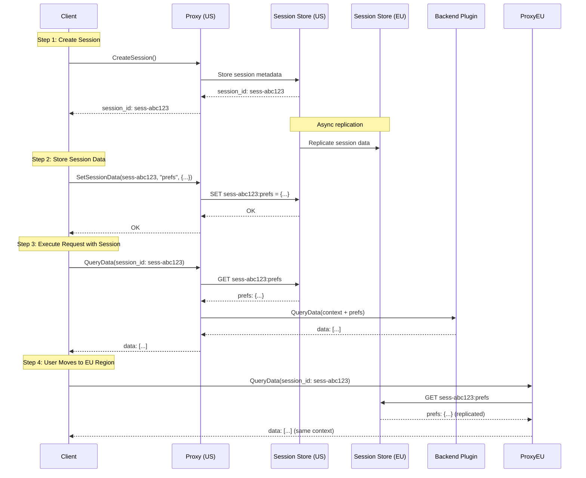

# RFC-024: Distributed Session Store Pattern

## Summary

Define a **Distributed Session Store** pattern that maintains session state (attributes, key-value pairs) across multiple regions and data centers. This pattern enables stateful interactions with Prism while supporting:
- Cross-region session access (user connects to different regions)
- Session attribute storage (metadata, preferences, context)
- Proto-typed key-value data per session
- Eventual consistency with configurable replication strategies

## Motivation

### Problem: Stateless Proxy Limits Session-Aware Applications

Currently, Prism proxy is **stateless**: each request is independent, with no session memory.

**Challenges this creates**:
1. **Multi-Request Workflows**: Applications must pass all context in every request
2. **Cross-Region User Mobility**: User connects to US region, then switches to EU region - no shared session state
3. **Large Session Context**: Passing 10KB+ of session data on every request wastes bandwidth
4. **Session-Scoped Caching**: No place to cache per-session data (parsed tokens, resolved policies, backend connections)

**Example**: Multi-step data pipeline
```text
# Without session store: Pass full context every request
Request 1: Fetch user preferences → 200 OK (prefs: {theme: dark, lang: en})
Request 2: Query data + attach prefs → 200 OK (data: [...], need to send prefs again)
Request 3: Transform data + attach prefs → 200 OK (transformed: [...], prefs sent again)

# With session store: Store context once, reference session ID
Request 1: Create session → 200 OK (session_id: sess-abc123)
Request 2: Store prefs in session → 200 OK
Request 3: Query data (session_id) → Proxy retrieves prefs from session store
Request 4: Transform data (session_id) → Proxy retrieves prefs from session store
```

### Use Cases

#### 1. Cross-Region User Mobility

**Scenario**: User starts work in US region, travels to EU, continues work from EU region.

**Without Session Store**:
- User re-authenticates in EU region
- Previous session state (preferences, context) lost
- Application must re-fetch all state from backend

**With Session Store**:
- Session replicated to EU region (eventual consistency)
- User reconnects with same session_id
- EU proxy retrieves session state from EU replica
- Seamless continuation of work

#### 2. Multi-Request Workflows

**Scenario**: Data ingestion pipeline with 5 steps, each step requires session context.

**Without Session Store**:
```python
# Client must attach context to every request
context = {"user_id": "alice", "workspace": "project-x", "batch_id": "batch-123"}

step1(context)  # 5KB context sent
step2(context)  # 5KB context sent again
step3(context)  # 5KB context sent again
step4(context)  # 5KB context sent again
step5(context)  # 5KB context sent again
# Total: 25KB bandwidth wasted
```

**With Session Store**:
```python
# Client stores context once
session_id = create_session()
set_session_data(session_id, context)  # 5KB context stored once

step1(session_id)  # Just 16-byte session ID
step2(session_id)  # Just 16-byte session ID
step3(session_id)  # Just 16-byte session ID
step4(session_id)  # Just 16-byte session ID
step5(session_id)  # Just 16-byte session ID
# Total: 5KB + (5 × 16 bytes) = ~5KB bandwidth
```

#### 3. Session-Scoped Backend Connections

**Scenario**: Plugin establishes expensive backend connection (Vault credentials, database connection pool) per session.

**Without Session Store**:
- Plugin must establish new connection for every request
- No way to share connection across requests from same session
- Vault token fetched on every request (~50ms latency)

**With Session Store**:
- Plugin stores backend connection handle in session store
- Subsequent requests reuse connection
- Vault token fetched once per session, cached in session store

#### 4. Collaborative Editing / Real-Time Applications

**Scenario**: Multiple users editing shared document, need to track who is active.

**With Session Store**:
- Store active user sessions for document: `doc-123 → [sess-alice, sess-bob]`
- When user joins: Add session to document's active sessions
- When user disconnects: Remove session from document's active sessions
- Cross-region replication ensures all regions see active users

## Design Principles

### 1. Region-Local Reads, Global Writes

**Session store optimized for**:
- **Fast local reads**: Proxy reads from local replica (&lt;1ms P99)
- **Asynchronous writes**: Write to local replica, replicate to other regions (eventual consistency)

```text
┌──────────────────────────────────────────────────────────────┐
│                 Global Session Store                         │
│                                                              │
│  ┌──────────────┐       ┌──────────────┐     ┌────────────┐│
│  │ US Region    │       │ EU Region    │     │ APAC Region││
│  │ (Primary)    │──────▶│ (Replica)    │────▶│ (Replica)  ││
│  │              │       │              │     │            ││
│  │ sess-abc123: │       │ sess-abc123: │     │ sess-abc123││
│  │ {            │       │ {            │     │ {          ││
│  │   user: alice│       │   user: alice│     │   user: ... ││
│  │   prefs: {...│       │   prefs: {...│     │            ││
│  │ }            │       │ }            │     │            ││
│  └──────────────┘       └──────────────┘     └────────────┘│
│         │                       ▲                    ▲       │
│         │                       │                    │       │
│         └───────────────────────┴────────────────────┘       │
│                   Replication Stream                         │
└──────────────────────────────────────────────────────────────┘
```

### 2. Proto-Typed Session Data

**Session store supports structured data** using protobuf:

```protobuf
message SessionData {
  string session_id = 1;

  // Session metadata
  SessionMetadata metadata = 2;

  // Key-value storage (proto Any type for flexibility)
  map<string, google.protobuf.Any> data = 3;

  // Session lifecycle
  google.protobuf.Timestamp created_at = 4;
  google.protobuf.Timestamp last_accessed = 5;
  google.protobuf.Timestamp expires_at = 6;
}

message SessionMetadata {
  string user_id = 1;
  string region = 2;  // Where session was created
  string client_id = 3;
  map<string, string> attributes = 4;  // Unstructured metadata
}
```

**Why protobuf?**
- Type safety: Client and proxy agree on data structure
- Versioning: Forward/backward compatibility via protobuf field evolution
- Efficient encoding: Smaller payloads than JSON (30-50% reduction)
- Language-agnostic: Works with Go, Python, Rust, Java clients

### 3. Pluggable Replication Strategies

**Session store pattern is backend-agnostic**:

| Backend | Replication Strategy | Consistency | Use Case |
|---------|---------------------|-------------|----------|
| **Redis Cluster** | Hash slot sharding | Eventual | Low latency, high throughput |
| **PostgreSQL + pglogical** | Logical replication | Strong (sync) | Strong consistency required |
| **DynamoDB Global Tables** | Multi-region replication | Eventual | AWS-native, auto-scaling |
| **CockroachDB** | Raft consensus | Serializable | Global distributed SQL |
| **Cassandra** | Multi-datacenter replication | Tunable | Massive scale, tunable consistency |

**Configuration**:
```yaml
session_store:
  backend: redis-cluster
  replication:
    strategy: eventual
    regions: [us-west-2, eu-central-1, ap-southeast-1]
    sync_interval: 100ms

  ttl: 86400  # 24 hours
  max_size: 1MB  # Per session
```

### 4. Session Lifecycle Management

**Sessions have expiration**:
- **TTL-based expiration**: Session expires after inactivity (default: 24h)
- **Explicit deletion**: Client can delete session
- **Automatic cleanup**: Background job removes expired sessions from all replicas

```text
Session Lifecycle:

1. Create    → session_id assigned, metadata stored, TTL set
2. Access    → last_accessed updated, TTL extended (sliding window)
3. Update    → data modified, change replicated to other regions
4. Expire    → TTL reached, session marked for deletion
5. Cleanup   → Background job removes from all replicas
```

## Architecture

### Component Diagram

```text
┌──────────────────────────────────────────────────────────────┐
│                        Client Application                    │
└────────────────────────┬─────────────────────────────────────┘
                         │
                         │ gRPC (session_id in metadata)
                         ▼
┌──────────────────────────────────────────────────────────────┐
│                    Prism Proxy (Region: US)                  │
│                                                              │
│  ┌────────────────────────────────────────────────────────┐ │
│  │  Session Interceptor                                   │ │
│  │  - Extract session_id from metadata                    │ │
│  │  - Fetch session data from local store                 │ │
│  │  - Inject session data into request context            │ │
│  └────────────────────────────────────────────────────────┘ │
│                         │                                    │
│                         ▼                                    │
│  ┌────────────────────────────────────────────────────────┐ │
│  │  Session Store Client (Plugin)                         │ │
│  │  - Get(session_id) → SessionData                       │ │
│  │  - Set(session_id, key, value)                         │ │
│  │  - Delete(session_id)                                  │ │
│  └────────────────────┬───────────────────────────────────┘ │
└────────────────────────┼─────────────────────────────────────┘
                         │
                         ▼
┌──────────────────────────────────────────────────────────────┐
│          Session Store Backend (Redis Cluster)               │
│                                                              │
│  ┌──────────────┐       ┌──────────────┐     ┌────────────┐│
│  │ US Shard 1   │       │ US Shard 2   │     │ US Shard 3 ││
│  │ Hash Slot:   │       │ Hash Slot:   │     │ Hash Slot: ││
│  │ 0-5461       │       │ 5462-10922   │     │10923-16383 ││
│  └──────────────┘       └──────────────┘     └────────────┘│
│         │                       │                    │       │
│         └───────────────────────┴────────────────────┘       │
│                   Replication to EU/APAC                     │
└──────────────────────────────────────────────────────────────┘
```

### Request Flow with Session Store



## API Design

### Session Store Service (gRPC)

```protobuf
syntax = "proto3";

package prism.session_store.v1;

import "google/protobuf/any.proto";
import "google/protobuf/timestamp.proto";

service SessionStoreService {
  // Create new session
  rpc CreateSession(CreateSessionRequest) returns (CreateSessionResponse);

  // Get session data
  rpc GetSession(GetSessionRequest) returns (GetSessionResponse);

  // Set session data
  rpc SetSessionData(SetSessionDataRequest) returns (SetSessionDataResponse);

  // Get session data by key
  rpc GetSessionData(GetSessionDataRequest) returns (GetSessionDataResponse);

  // Delete session data by key
  rpc DeleteSessionData(DeleteSessionDataRequest) returns (DeleteSessionDataResponse);

  // Delete entire session
  rpc DeleteSession(DeleteSessionRequest) returns (DeleteSessionResponse);

  // Extend session TTL
  rpc ExtendSession(ExtendSessionRequest) returns (ExtendSessionResponse);

  // List sessions (admin)
  rpc ListSessions(ListSessionsRequest) returns (ListSessionsResponse);
}

message CreateSessionRequest {
  SessionMetadata metadata = 1;
  int64 ttl_seconds = 2;  // Default: 86400 (24h)
}

message CreateSessionResponse {
  string session_id = 1;
  google.protobuf.Timestamp created_at = 2;
  google.protobuf.Timestamp expires_at = 3;
}

message GetSessionRequest {
  string session_id = 1;
}

message GetSessionResponse {
  SessionData session = 1;
  bool found = 2;
}

message SetSessionDataRequest {
  string session_id = 1;
  string key = 2;
  google.protobuf.Any value = 3;
}

message SetSessionDataResponse {
  bool success = 1;
}

message GetSessionDataRequest {
  string session_id = 1;
  string key = 2;
}

message GetSessionDataResponse {
  google.protobuf.Any value = 1;
  bool found = 2;
}

message DeleteSessionDataRequest {
  string session_id = 1;
  string key = 2;
}

message DeleteSessionDataResponse {
  bool success = 1;
}

message DeleteSessionRequest {
  string session_id = 1;
}

message DeleteSessionResponse {
  bool success = 1;
}

message ExtendSessionRequest {
  string session_id = 1;
  int64 additional_seconds = 2;
}

message ExtendSessionResponse {
  google.protobuf.Timestamp new_expires_at = 1;
}

message ListSessionsRequest {
  string user_id = 1;  // Filter by user
  string region = 2;   // Filter by region
  int32 page_size = 3;
  string page_token = 4;
}

message ListSessionsResponse {
  repeated SessionData sessions = 1;
  string next_page_token = 2;
}

message SessionData {
  string session_id = 1;
  SessionMetadata metadata = 2;
  map<string, google.protobuf.Any> data = 3;
  google.protobuf.Timestamp created_at = 4;
  google.protobuf.Timestamp last_accessed = 5;
  google.protobuf.Timestamp expires_at = 6;
}

message SessionMetadata {
  string user_id = 1;
  string region = 2;
  string client_id = 3;
  map<string, string> attributes = 4;
}
```

### Client Usage Examples

#### Python Client

```python
from prism_sdk import PrismClient, SessionData
from google.protobuf.struct_pb2 import Struct

# Create client
client = PrismClient(config_name="my-app")

# Step 1: Create session
session_id = client.create_session(
    user_id="alice",
    region="us-west-2",
    ttl_seconds=86400  # 24 hours
)
print(f"Session created: {session_id}")

# Step 2: Store user preferences in session
prefs = Struct()
prefs.update({"theme": "dark", "language": "en", "timezone": "America/Los_Angeles"})
client.set_session_data(session_id, "preferences", prefs)

# Step 3: Store workflow context
context = Struct()
context.update({"workflow_id": "wf-123", "step": 3, "checkpoint": "transform-data"})
client.set_session_data(session_id, "workflow_context", context)

# Step 4: Execute queries with session context
# Proxy automatically injects session data into request context
result = client.query_data(
    collection="events",
    filter={"user_id": "alice"},
    session_id=session_id  # Session context attached
)

# Step 5: Retrieve session data
prefs = client.get_session_data(session_id, "preferences")
print(f"User preferences: {prefs}")

# Step 6: Clean up
client.delete_session(session_id)
```

#### Go Client

```go
package main

import (
    "context"
    "github.com/prism/sdk-go"
    "google.golang.org/protobuf/types/known/structpb"
)

func main() {
    client := sdk.NewClient(sdk.Config{
        ConfigName: "my-app",
    })

    ctx := context.Background()

    // Create session
    session, err := client.CreateSession(ctx, &sdk.CreateSessionRequest{
        Metadata: &sdk.SessionMetadata{
            UserID:   "alice",
            Region:   "us-west-2",
            ClientID: "go-client-v1",
        },
        TTLSeconds: 86400,
    })
    if err != nil {
        panic(err)
    }

    sessionID := session.SessionID

    // Store preferences
    prefs := &structpb.Struct{
        Fields: map[string]*structpb.Value{
            "theme": structpb.NewStringValue("dark"),
            "language": structpb.NewStringValue("en"),
        },
    }
    err = client.SetSessionData(ctx, sessionID, "preferences", prefs)

    // Query with session context
    result, err := client.QueryData(ctx, &sdk.QueryRequest{
        Collection: "events",
        SessionID:  sessionID,  // Proxy retrieves session data
    })

    // Cleanup
    client.DeleteSession(ctx, sessionID)
}
```

## Backend Plugin Implementation

### Redis Cluster Backend

**Configuration**:
```yaml
session_store:
  backend: redis-cluster
  config:
    addresses:
      - redis-us-1.example.com:6379
      - redis-us-2.example.com:6379
      - redis-us-3.example.com:6379
    password: "${REDIS_PASSWORD}"
    pool_size: 100

  replication:
    enabled: true
    regions:
      us-west-2:
        primary: true
        addresses: [redis-us-1:6379, redis-us-2:6379, redis-us-3:6379]
      eu-central-1:
        primary: false
        addresses: [redis-eu-1:6379, redis-eu-2:6379, redis-eu-3:6379]
      ap-southeast-1:
        primary: false
        addresses: [redis-ap-1:6379, redis-ap-2:6379, redis-ap-3:6379]

    sync_interval: 100ms
    conflict_resolution: last-write-wins
```

**Implementation**:
```go
// plugins/session-store-redis/service.go
package main

import (
    "context"
    "encoding/json"
    "github.com/go-redis/redis/v8"
    pb "github.com/prism/proto/session_store/v1"
)

type RedisSessionStore struct {
    pb.UnimplementedSessionStoreServiceServer
    cluster *redis.ClusterClient
    replicas map[string]*redis.ClusterClient  // Region → replica
}

// CreateSession stores new session in Redis cluster
func (s *RedisSessionStore) CreateSession(ctx context.Context, req *pb.CreateSessionRequest) (*pb.CreateSessionResponse, error) {
    sessionID := generateSessionID()

    session := &pb.SessionData{
        SessionId: sessionID,
        Metadata:  req.Metadata,
        Data:      make(map[string]*anypb.Any),
        CreatedAt: timestamppb.Now(),
        ExpiresAt: timestamppb.New(time.Now().Add(time.Duration(req.TtlSeconds) * time.Second)),
    }

    // Serialize session data
    data, err := proto.Marshal(session)
    if err != nil {
        return nil, err
    }

    // Store in Redis with TTL
    key := "session:" + sessionID
    err = s.cluster.Set(ctx, key, data, time.Duration(req.TtlSeconds)*time.Second).Err()
    if err != nil {
        return nil, err
    }

    // Replicate to other regions (async)
    go s.replicateToRegions(ctx, key, data)

    return &pb.CreateSessionResponse{
        SessionId: sessionID,
        CreatedAt: session.CreatedAt,
        ExpiresAt: session.ExpiresAt,
    }, nil
}

// GetSession retrieves session from local Redis replica
func (s *RedisSessionStore) GetSession(ctx context.Context, req *pb.GetSessionRequest) (*pb.GetSessionResponse, error) {
    key := "session:" + req.SessionId

    // Try local replica first
    data, err := s.cluster.Get(ctx, key).Bytes()
    if err == redis.Nil {
        // Session not found locally, try other regions
        for region, replica := range s.replicas {
            data, err = replica.Get(ctx, key).Bytes()
            if err == nil {
                // Found in other region, cache locally
                s.cluster.Set(ctx, key, data, 0)  // Copy to local
                break
            }
        }

        if err != nil {
            return &pb.GetSessionResponse{Found: false}, nil
        }
    } else if err != nil {
        return nil, err
    }

    // Deserialize
    session := &pb.SessionData{}
    err = proto.Unmarshal(data, session)
    if err != nil {
        return nil, err
    }

    // Update last accessed
    session.LastAccessed = timestamppb.Now()
    s.updateSession(ctx, session)

    return &pb.GetSessionResponse{
        Session: session,
        Found:   true,
    }, nil
}

// SetSessionData updates session key-value data
func (s *RedisSessionStore) SetSessionData(ctx context.Context, req *pb.SetSessionDataRequest) (*pb.SetSessionDataResponse, error) {
    key := "session:" + req.SessionId

    // Fetch existing session
    resp, err := s.GetSession(ctx, &pb.GetSessionRequest{SessionId: req.SessionId})
    if err != nil || !resp.Found {
        return nil, status.Error(codes.NotFound, "Session not found")
    }

    session := resp.Session

    // Update data field
    if session.Data == nil {
        session.Data = make(map[string]*anypb.Any)
    }
    session.Data[req.Key] = req.Value

    // Serialize and store
    data, err := proto.Marshal(session)
    if err != nil {
        return nil, err
    }

    // Update in Redis
    err = s.cluster.Set(ctx, key, data, time.Until(session.ExpiresAt.AsTime())).Err()
    if err != nil {
        return nil, err
    }

    // Replicate to other regions
    go s.replicateToRegions(ctx, key, data)

    return &pb.SetSessionDataResponse{Success: true}, nil
}

// replicateToRegions asynchronously replicates session to other regions
func (s *RedisSessionStore) replicateToRegions(ctx context.Context, key string, data []byte) {
    for region, replica := range s.replicas {
        err := replica.Set(ctx, key, data, 0).Err()  // 0 = inherit TTL from primary
        if err != nil {
            log.Error("Failed to replicate to region", "region", region, "error", err)
        }
    }
}
```

### PostgreSQL + pglogical Backend

**Configuration**:
```yaml
session_store:
  backend: postgres-pglogical
  config:
    primary:
      host: postgres-us.example.com
      port: 5432
      database: prism_sessions
      user: prism
      password: "${POSTGRES_PASSWORD}"

    replicas:
      eu-central-1:
        host: postgres-eu.example.com
        port: 5432
        replication_slot: prism_sessions_eu
      ap-southeast-1:
        host: postgres-ap.example.com
        port: 5432
        replication_slot: prism_sessions_ap

    replication:
      synchronous: false  # Async replication for low latency
      lag_threshold: 5s   # Alert if replication lag > 5s
```

**Schema**:
```sql
CREATE TABLE sessions (
    session_id UUID PRIMARY KEY,
    user_id TEXT NOT NULL,
    region TEXT NOT NULL,
    metadata JSONB,
    data JSONB,  -- Key-value pairs
    created_at TIMESTAMPTZ NOT NULL DEFAULT NOW(),
    last_accessed TIMESTAMPTZ NOT NULL DEFAULT NOW(),
    expires_at TIMESTAMPTZ NOT NULL,
    INDEX idx_sessions_user (user_id),
    INDEX idx_sessions_region (region),
    INDEX idx_sessions_expires (expires_at)
);

-- Enable pglogical replication
SELECT pglogical.create_node(
    node_name := 'prism_us',
    dsn := 'host=postgres-us.example.com port=5432 dbname=prism_sessions'
);

SELECT pglogical.create_replication_set('prism_sessions_repl');

SELECT pglogical.replication_set_add_table(
    set_name := 'prism_sessions_repl',
    relation := 'sessions'
);

-- Subscribe from EU region
SELECT pglogical.create_subscription(
    subscription_name := 'prism_sessions_sub_eu',
    provider_dsn := 'host=postgres-us.example.com port=5432 dbname=prism_sessions',
    replication_sets := ARRAY['prism_sessions_repl']
);
```

## Cross-Region Replication Strategies

### Strategy 1: Active-Passive (Leader-Follower)

**Architecture**:
- **Primary region**: All writes go here
- **Replica regions**: Read-only, asynchronous replication
- **Failover**: Promote replica to primary if primary fails

**Pros**:
- Simple consistency model (no write conflicts)
- Easy to reason about data flow

**Cons**:
- Higher write latency for users far from primary region
- Single point of failure (primary)

**Use Cases**:
- Strong consistency required
- Write volume concentrated in one region

### Strategy 2: Multi-Primary (Active-Active)

**Architecture**:
- **All regions accept writes**
- **Bidirectional replication** between regions
- **Conflict resolution** required (last-write-wins, vector clocks, CRDTs)

**Pros**:
- Low latency writes from any region
- No single point of failure

**Cons**:
- Complex conflict resolution
- Eventual consistency (window of inconsistency during replication)

**Use Cases**:
- Global user base
- High write volume
- Can tolerate eventual consistency

**Conflict Resolution Example**:
```text
Scenario: Alice updates session from US, Bob updates same key from EU simultaneously

US Region:                                    EU Region:
SET sess-abc123:prefs.theme = "dark"          SET sess-abc123:prefs.theme = "light"
  timestamp: 2025-10-09T10:00:00.000Z           timestamp: 2025-10-09T10:00:00.100Z

After replication:
US Region sees:   theme = "light"  (EU's write won, later timestamp)
EU Region sees:   theme = "light"  (EU's write, local)

Result: Last-write-wins based on timestamp (EU's write at 10:00:00.100Z wins)
```

### Strategy 3: Regional Partitioning

**Architecture**:
- **Each region owns subset of sessions**
- **No replication** between regions (sessions are region-local)
- **Session ID encodes region**: `sess-us-abc123`, `sess-eu-def456`

**Pros**:
- No replication overhead
- Perfect consistency (no conflicts)

**Cons**:
- Users cannot move between regions
- Regional failures lose sessions

**Use Cases**:
- Compliance requires data residency (GDPR, data sovereignty)
- Users stay in one region

## Sharding and Work Distribution

### Problem: Single Session Store Bottleneck

**At scale**:
- 100,000 active sessions
- 10,000 writes/sec
- 50,000 reads/sec

**Single Redis instance cannot handle this load.**

### Solution: Consistent Hashing for Sharding

**Shard by session_id**:
```text
Hash(session_id) → Shard

Shard 0: session_ids with hash % 16 == 0
Shard 1: session_ids with hash % 16 == 1
...
Shard 15: session_ids with hash % 16 == 15

Each shard has 1/16 of the load:
  - ~6,250 active sessions
  - ~625 writes/sec
  - ~3,125 reads/sec
```

**Redis Cluster automatically does this**:
- 16,384 hash slots
- Each node owns subset of slots
- Client library routes requests to correct node

**Diagram**:
```text
┌──────────────────────────────────────────────────────────────┐
│            Session Store Cluster (16 Shards)                 │
│                                                              │
│  ┌──────────┐ ┌──────────┐ ┌──────────┐     ┌──────────┐  │
│  │ Shard 0  │ │ Shard 1  │ │ Shard 2  │ ... │ Shard 15 │  │
│  │ Slots:   │ │ Slots:   │ │ Slots:   │     │ Slots:   │  │
│  │ 0-1023   │ │1024-2047 │ │2048-3071 │     │15360-    │  │
│  │          │ │          │ │          │     │16383     │  │
│  └──────────┘ └──────────┘ └──────────┘     └──────────┘  │
│                                                              │
│  Client Request: GET sess-abc123                            │
│  Hash(sess-abc123) = 5234 → Shard 3                         │
└──────────────────────────────────────────────────────────────┘
```

### Session Affinity vs Session Mobility

**Trade-off**:
- **Session Affinity**: Route user's requests to same shard (faster, less replication)
- **Session Mobility**: User can connect to any shard (more flexible, more replication)

**Recommendation**: **Session Mobility** for global users.

## Performance Characteristics

### Latency

| Operation | Redis Cluster | PostgreSQL | DynamoDB Global |
|-----------|---------------|------------|-----------------|
| CreateSession | 2ms P99 | 10ms P99 | 15ms P99 |
| GetSession (local) | 1ms P99 | 5ms P99 | 8ms P99 |
| GetSession (remote) | 50ms P99 | 100ms P99 | 80ms P99 |
| SetSessionData | 2ms P99 | 10ms P99 | 15ms P99 |

### Throughput

| Backend | Reads/sec (per shard) | Writes/sec (per shard) | Scaling |
|---------|----------------------|------------------------|---------|
| Redis Cluster | 100k | 20k | Horizontal (add shards) |
| PostgreSQL | 10k | 2k | Vertical + read replicas |
| DynamoDB | 40k | 10k | Auto-scaling |

### Replication Lag

| Replication | Typical Lag | P99 Lag | Recovery Time |
|-------------|-------------|---------|---------------|
| Redis Cluster | 10ms | 100ms | 1s |
| pglogical | 100ms | 1s | 10s |
| DynamoDB Global | 500ms | 2s | 30s |

## Monitoring and Observability

### Metrics

**Session Store Metrics**:
- `session_store_sessions_active` - Active session count per region
- `session_store_operations_total{operation="create|get|set|delete"}` - Operation counts
- `session_store_operation_latency_seconds` - Operation latency histogram
- `session_store_replication_lag_seconds` - Replication lag per region
- `session_store_size_bytes` - Session data size per session (avg/max)

**Alerts**:
- Session store latency P99 > 10ms
- Replication lag > 5s
- Session store unavailable

### Logging

**Session Events**:
```json
{
  "event": "session_created",
  "session_id": "sess-abc123",
  "user_id": "alice",
  "region": "us-west-2",
  "client_id": "go-client-v1",
  "timestamp": "2025-10-09T10:00:00Z"
}

{
  "event": "session_replicated",
  "session_id": "sess-abc123",
  "source_region": "us-west-2",
  "target_region": "eu-central-1",
  "replication_lag_ms": 85,
  "timestamp": "2025-10-09T10:00:00.085Z"
}

{
  "event": "session_expired",
  "session_id": "sess-abc123",
  "user_id": "alice",
  "created_at": "2025-10-08T10:00:00Z",
  "last_accessed": "2025-10-09T09:30:00Z",
  "expires_at": "2025-10-09T10:00:00Z",
  "lifetime_seconds": 84600
}
```

## Security Considerations

### 1. Session Hijacking

**Risk**: Attacker steals session_id and impersonates user.

**Mitigation**:
- **Bind session to client IP**: Check IP matches on every request
- **Session token rotation**: Rotate session_id periodically
- **Short TTL**: Expire sessions after 24h inactivity
- **mTLS**: Require client certificate for session creation

### 2. Session Data Tampering

**Risk**: Attacker modifies session data in backend store.

**Mitigation**:
- **Sign session data**: Use HMAC to detect tampering
- **Encrypt sensitive data**: Encrypt PII fields in session store
- **Access control**: Limit who can modify session store (plugins only)

### 3. Cross-Region Data Leakage

**Risk**: Session replicated to region with weaker security.

**Mitigation**:
- **Regional encryption keys**: Each region uses different encryption key
- **Compliance-aware replication**: Don't replicate EU sessions to US if GDPR forbids
- **Audit replication**: Log all cross-region transfers

## Migration Path

### Phase 1: Implement Session Store Backend (Week 1-2)

1. Implement Redis Cluster session store plugin
2. Deploy to staging environment
3. Test session creation, retrieval, updates
4. Measure performance (latency, throughput)

### Phase 2: Integrate with Proxy (Week 3)

1. Add session interceptor to proxy
2. Extract session_id from gRPC metadata
3. Inject session data into request context
4. Test with sample applications

### Phase 3: Cross-Region Replication (Week 4-5)

1. Configure Redis Cluster replication to EU region
2. Test session mobility (create in US, read from EU)
3. Measure replication lag
4. Implement conflict resolution (last-write-wins)

### Phase 4: Production Rollout (Week 6)

1. Enable session store for pilot applications
2. Monitor performance and replication lag
3. Gradual rollout to all applications
4. Document usage patterns and best practices

## Open Questions

### 1. How to Handle Session Conflicts in Multi-Primary?

**Question**: Two regions modify same session key simultaneously. How to resolve?

**Options**:
1. **Last-write-wins** (timestamp-based)
2. **Vector clocks** (causal ordering)
3. **CRDTs** (conflict-free replicated data types)
4. **Application-defined** (conflict resolution callback)

**Recommendation**: Start with **last-write-wins** (simplest), add CRDTs for specific use cases (e.g., collaborative editing).

### 2. Should Session Store Support Transactions?

**Question**: Can client atomically update multiple session keys?

**Example**:
```python
# Atomic update: prefs AND context in single transaction
with client.session_transaction(session_id) as tx:
    tx.set("preferences", prefs)
    tx.set("context", context)
    tx.commit()
```

**Pros**: Consistency (all or nothing)
**Cons**: Complexity, cross-region transactions hard

**Recommendation**: **No transactions** for v1. Use single SetSessionData with merged data.

### 3. How to Clean Up Expired Sessions?

**Question**: Background job or lazy deletion?

**Options**:
1. **Background job**: Scan session store every hour, delete expired
2. **Lazy deletion**: Delete on next access (Redis built-in)
3. **Hybrid**: Lazy + periodic cleanup

**Recommendation**: **Hybrid** (Redis TTL + daily cleanup job for replicas).

## Related Documents

- [RFC-019: Plugin SDK Authorization Layer](/rfc/rfc-019-plugin-sdk-authorization-layer) - Token validation and credentials
- [RFC-014: Layered Data Access Patterns](/rfc/rfc-014-layered-data-access-patterns) - Pattern composition
- [RFC-011: Data Proxy Authentication](/rfc/rfc-011-data-proxy-authentication) - Secrets provider abstraction
- [ADR-050: Topaz for Policy Authorization](/adr/adr-050-topaz-policy-authorization) - Policy enforcement

## Revision History

- 2025-10-09: Initial RFC proposing distributed session store pattern with cross-region replication strategies