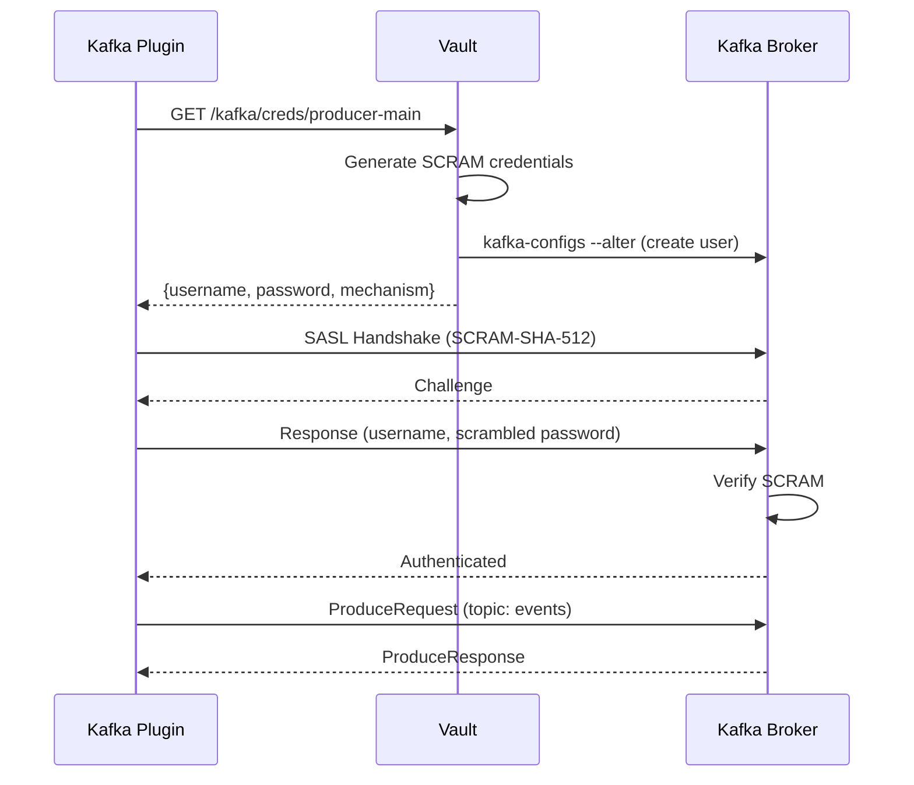

# Kafka Backend Plugin

Kafka plugin for Prism data gateway, implementing event streaming and queue abstractions.

## Architecture

Based on:
- **RFC-011**: Data Proxy Authentication (SASL/SCRAM with Vault)
- **ADR-005**: Backend Plugin Architecture (TimeSeries/Queue traits)
- **ADR-025**: Container Plugin Model (standard interfaces)
- **ADR-026**: Distroless Container Images (security)

## Features

- Event streaming (append, tail, query)
- Queue operations (publish, consume)
- SASL/SCRAM-SHA-512 authentication
- Vault-managed dynamic credentials
- At-least-once delivery semantics
- Manual offset management
- Health check endpoints
- Prometheus metrics
- Distroless container image

## Configuration

### Environment Variables

```bash
# Required
KAFKA_BROKERS=localhost:9092,localhost:9093
PRISM_PLUGIN_CONFIG=/etc/prism/plugin.yaml

# SASL/SCRAM authentication (RFC-011)
KAFKA_SASL_USERNAME=prism-kafka-xyz789
KAFKA_SASL_PASSWORD=<scram-sha-512-password>

# Optional
KAFKA_TOPIC=events
KAFKA_CONSUMER_GROUP=prism-consumers
KAFKA_COMPRESSION=snappy
PRISM_LOG_LEVEL=info
```

### Config File

```yaml
plugin:
  name: kafka
  version: 0.1.0

control_plane:
  port: 9091

backend:
  brokers:
    - localhost:9092
  topic: "events"
  consumer_group: "prism-consumers"

  # SASL/SCRAM authentication
  sasl_mechanism: "SCRAM-SHA-512"
  sasl_username: ""  # From env
  sasl_password: ""  # From env

  # Vault-managed credentials
  vault_enabled: false
  vault_path: "kafka/creds/producer-main"

  # Producer settings
  compression: "snappy"
  acks: "all"

  # Consumer settings
  auto_offset_reset: "earliest"
```

## Building

### Local Build

```bash
cd plugins/kafka
go build -o kafka-plugin main.go
./kafka-plugin
```

### Container Build (Podman)

```bash
# Production image
podman build -t prism/kafka-plugin:latest --target production -f Dockerfile .

# Debug image
podman build -t prism/kafka-plugin:debug --target debug -f Dockerfile .
```

## Running

### Local Execution

```bash
export KAFKA_BROKERS="localhost:9092"
export PRISM_PLUGIN_CONFIG="config.yaml"
./kafka-plugin
```

### Container Execution

```bash
podman run -d \
  --name kafka-plugin \
  -e KAFKA_BROKERS="kafka-broker:9092" \
  -e KAFKA_SASL_USERNAME="prism-kafka" \
  -e KAFKA_SASL_PASSWORD="secret" \
  -p 9091:9091 \
  prism/kafka-plugin:latest
```

### Docker Compose

```yaml
services:
  kafka-plugin:
    image: prism/kafka-plugin:latest
    environment:
      - KAFKA_BROKERS=kafka:9092
      - KAFKA_TOPIC=events
      - KAFKA_CONSUMER_GROUP=prism
      - KAFKA_SASL_USERNAME=prism-kafka
      - KAFKA_SASL_PASSWORD=secret
    ports:
      - "9091:9091"
    depends_on:
      - kafka

  kafka:
    image: confluentinc/cp-kafka:7.5.0
    environment:
      - KAFKA_BROKER_ID=1
      - KAFKA_ZOOKEEPER_CONNECT=zookeeper:2181
      - KAFKA_ADVERTISED_LISTENERS=PLAINTEXT://kafka:9092
```

## Authentication Flow (RFC-011)

### SASL/SCRAM Authentication



## API Operations

### Publish (Producer)

```go
err := plugin.Publish(ctx, "events", []byte("user:123"), []byte(`{"event":"login"}`))
```

### Consume (Consumer)

The plugin automatically consumes messages from the configured topic and forwards them to the Prism proxy.

## Health Checks

```bash
# gRPC health check
grpcurl -plaintext localhost:9091 grpc.health.v1.Health/Check

# Response:
{
  "status": "SERVING"
}
```

## Observability

### Metrics

Prometheus metrics exposed on `:9091/metrics`:

- `kafka_plugin_messages_produced_total` - Total messages produced
- `kafka_plugin_messages_consumed_total` - Total messages consumed
- `kafka_plugin_producer_queue_length` - Current producer queue size
- `kafka_plugin_delivery_errors_total` - Failed deliveries
- `kafka_plugin_health_status` - Health status

### Logging

Structured JSON logging:

```json
{
  "time": "2025-10-09T12:00:00Z",
  "level": "INFO",
  "msg": "kafka plugin initialized",
  "brokers": "localhost:9092",
  "topic": "events",
  "sasl_enabled": true
}
```

## Testing

```bash
# Unit tests
go test ./...

# Integration tests (requires Kafka)
docker run -d -p 9092:9092 confluentinc/cp-kafka:7.5.0
export KAFKA_BROKERS="localhost:9092"
go test -tags=integration ./...
```

## Troubleshooting

### Debug Container

```bash
podman run -it --entrypoint /busybox/sh prism/kafka-plugin:debug
```

### Common Issues

1. **Connection refused**: Check `KAFKA_BROKERS` and Kafka is running
2. **SASL authentication failed**: Verify SCRAM credentials
3. **Consumer lag**: Check consumer group status with `kafka-consumer-groups`
4. **Producer queue backing up**: Increase Kafka throughput or add partitions

## Vault Integration

When `vault_enabled: true`:

```yaml
backend:
  vault_enabled: true
  vault_path: "kafka/creds/producer-main"
```

The plugin will:
1. Fetch dynamic SASL/SCRAM credentials from Vault
2. Use short-lived credentials (RFC-011 pattern)
3. Automatically renew credentials before expiry
4. Gracefully handle credential rotation

## References

- [RFC-011: Data Proxy Authentication](/docs-cms/rfcs/RFC-011-data-proxy-authentication.md)
- [ADR-005: Backend Plugin Architecture](/docs-cms/adr/ADR-005-backend-plugin-architecture.md)
- [ADR-025: Container Plugin Model](/docs-cms/adr/ADR-025-container-plugin-model.md)
- [ADR-026: Distroless Container Images](/docs-cms/adr/ADR-026-distroless-container-images.md)
- [Kafka SASL/SCRAM](https://kafka.apache.org/documentation/#security_sasl_scram)
