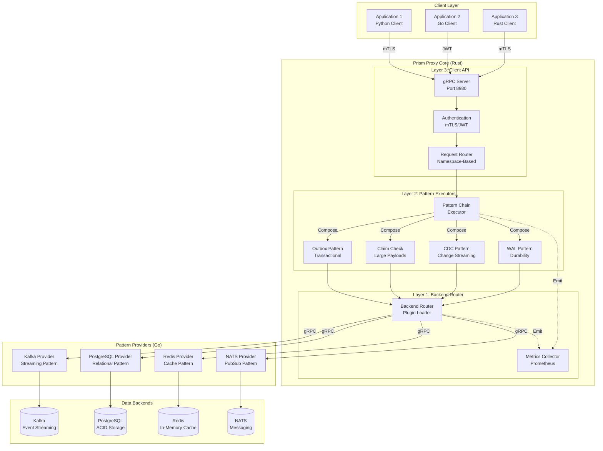
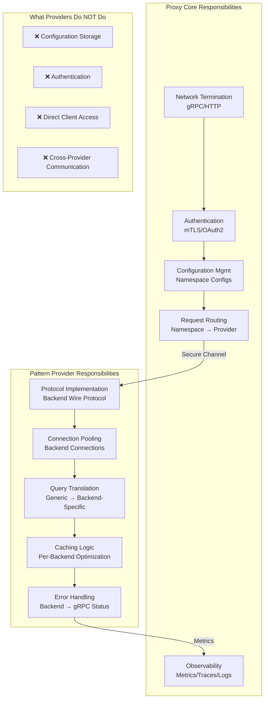

# Prism Technical Architecture Guide

**Target Audience**: Technical users, platform engineers, backend developers

**Purpose**: Provide a comprehensive architectural overview of Prism's layered design, component responsibilities, backend interface decomposition, and pattern composition strategy.

---

## What is Prism?

**Prism is a high-performance data access gateway** that sits between applications and heterogeneous data backends (Kafka, NATS, Postgres, Redis, etc.), providing a unified, client-configurable interface with built-in reliability patterns.

### Core Value Propositions

1. **Unified API**: Single gRPC/HTTP interface across all backends
2. **Client-Originated Configuration**: Applications declare requirements; Prism provisions and optimizes
   - **Organizational Scalability**: Teams self-service without infrastructure bottlenecks
   - **Authorization Boundaries**: Policy-driven configuration limits ensure security and reliability
3. **Rust Performance**: 10-100x faster than JVM alternatives (Netflix Data Gateway)
4. **Pluggable Pattern Providers**: Add new backends without changing application code
5. **Pattern Composition**: Reliability patterns (Outbox, Claim Check, CDC) transparently implemented

### Key Metrics

| Metric | Target | Status |
|--------|--------|--------|
| P50 Latency | < 1ms | ✅ Achieved (Rust proxy) |
| P99 Latency | < 10ms | ✅ Achieved (no GC pauses) |
| Throughput | 10k+ RPS per connection | ✅ Achieved |
| Memory Footprint | < 500MB per proxy instance | ✅ Achieved |
| Cold Start | < 100ms | ✅ Achieved (vs JVM ~10s) |

---

## High-Level Architecture

### Three-Layer Design Philosophy

Prism separates **What** (client API), **How** (pattern composition), and **Where** (backend execution):

```text
┌────────────────────────────────────────────────────────────┐
│             Layer 3: Client API (What)                     │
│  Queue | PubSub | Reader | Transact | Cache | Stream       │
│  "I want to publish messages to a queue"                   │
└────────────────────────────────────────────────────────────┘
                          │
                          ▼
┌────────────────────────────────────────────────────────────┐
│         Layer 2: Pattern Composition (How)                 │
│  Claim Check | Outbox | CDC | Tiered Storage | WAL        │
│  "Automatically store large payloads in S3"                │
└────────────────────────────────────────────────────────────┘
                          │
                          ▼
┌────────────────────────────────────────────────────────────┐
│         Layer 1: Backend Execution (Where)                 │
│  Kafka | NATS | Postgres | Redis | S3 | ClickHouse        │
│  "Connect to and execute operations on backend"            │
└────────────────────────────────────────────────────────────┘
```

**Key Insight**: Applications interact with **Layer 3** (stable APIs), while Prism transparently applies **Layer 2** patterns and routes to **Layer 1** backends. This separation enables:
- Backend migration without client changes
- Pattern evolution without API breakage
- Configuration-driven reliability

---

## System Architecture Diagram

### Complete Data Flow: Client → Proxy → Pattern → Pattern Provider → Backend



### Data Flow Example: Publishing Large Message

**Client Request:**
```python
client.publish("videos", video_bytes)  # 2GB payload
```

**Internal Flow:**
1. **Layer 3 (Client API)**: `PubSubService.Publish()` accepts request
2. **Authentication**: JWT validated, namespace access checked
3. **Layer 2 (Patterns)**:
   - **Claim Check Pattern**: Detects size > 1MB, uploads to S3, replaces payload with reference
   - **Outbox Pattern**: Wraps in transaction, inserts into outbox table
4. **Layer 1 (Pattern Provider)**: Kafka pattern provider publishes lightweight message (< 1KB)
5. **Response**: Client receives success

**Consumer retrieves:**
```python
event = client.subscribe("videos")
video_bytes = event.payload  # Prism fetches 2GB from S3 transparently
```

---

## Proxy and Pattern Provider Architecture

### Responsibility Separation

The Prism proxy is **intentionally minimal** - it handles networking, authentication, and routing. All backend-specific logic lives in **pattern providers**.



### Pattern Provider Interface (gRPC-Based)

**Design Decision**: Pattern providers are **out-of-process** by default for fault isolation and independent scaling.

```protobuf
service PatternProvider {
  // Initialize provider with configuration
  rpc Initialize(InitializeRequest) returns (InitializeResponse);

  // Health check
  rpc HealthCheck(HealthCheckRequest) returns (HealthCheckResponse);

  // Execute operation (generic interface)
  rpc Execute(ExecuteRequest) returns (ExecuteResponse);

  // Stream operations (for subscriptions)
  rpc ExecuteStream(stream StreamRequest) returns (stream StreamResponse);

  // Shutdown gracefully
  rpc Shutdown(ShutdownRequest) returns (ShutdownResponse);
}
```

**Pattern Provider Deployment Options:**

| Model | Use Case | Latency Overhead | Fault Isolation |
|-------|----------|------------------|-----------------|
| **In-Process** (Shared Library) | Ultra-low latency (Redis, Memcached) | ~0.1ms | ❌ Shared process |
| **Sidecar** (Unix Socket) | Most backends | ~1-2ms | ✅ Separate process |
| **Remote** (gRPC/mTLS) | Cloud-managed providers | ~5-10ms | ✅ Network isolation |

**Recommended Default**: **Sidecar deployment** for fault isolation and independent scaling.

### Zero-Copy Data Path

For large payloads (object storage, bulk exports), Prism uses **zero-copy proxying**:

```rust
// Rust proxy with Tonic (gRPC) and Bytes (zero-copy buffers)
pub async fn handle_get(&self, req: &ExecuteRequest) -> Result<ExecuteResponse> {
    // Extract key without copying
    let key = req.params.as_ref();  // No allocation

    // Fetch from backend (e.g., S3)
    let object_data: Arc<Bytes> = self.client.get_object(key).await?;

    // Return Arc<Bytes> - gRPC shares the same buffer
    Ok(ExecuteResponse {
        success: true,
        result: Some(object_data),
        ..Default::default()
    })
}
```

**Performance**: Negligible overhead for payloads > 1MB regardless of size.

---

## Backend Interface Decomposition

### Design Philosophy: Thin, Composable Interfaces

**Key Decision**: Use **explicit interface flavors** (not capability flags) for type safety and clear contracts.

Each data model has multiple interface flavors:
- `<Model>Basic` - Core CRUD operations (required)
- `<Model>Scan` - Enumeration capability (optional)
- `<Model>TTL` - Time-to-live expiration (optional)
- `<Model>Transactional` - Multi-operation atomicity (optional)
- `<Model>Batch` - Bulk operations (optional)

**Example: KeyValue Interfaces**

```protobuf
// proto/interfaces/keyvalue_basic.proto
service KeyValueBasicInterface {
  rpc Set(SetRequest) returns (SetResponse);
  rpc Get(GetRequest) returns (GetResponse);
  rpc Delete(DeleteRequest) returns (DeleteResponse);
  rpc Exists(ExistsRequest) returns (ExistsResponse);
}

// proto/interfaces/keyvalue_scan.proto
service KeyValueScanInterface {
  rpc Scan(ScanRequest) returns (stream ScanResponse);
  rpc ScanKeys(ScanKeysRequest) returns (stream KeyResponse);
  rpc Count(CountRequest) returns (CountResponse);
}

// proto/interfaces/keyvalue_ttl.proto
service KeyValueTTLInterface {
  rpc Expire(ExpireRequest) returns (ExpireResponse);
  rpc GetTTL(GetTTLRequest) returns (GetTTLResponse);
  rpc Persist(PersistRequest) returns (PersistResponse);
}

// proto/interfaces/keyvalue_transactional.proto
service KeyValueTransactionalInterface {
  rpc BeginTransaction(BeginTransactionRequest) returns (TransactionHandle);
  rpc Commit(CommitRequest) returns (CommitResponse);
  rpc Rollback(RollbackRequest) returns (RollbackResponse);
}
```

### Complete Interface Catalog (45 Interfaces)

| Data Model | Interfaces | Description |
|------------|-----------|-------------|
| **KeyValue** | 6 interfaces | keyvalue_basic, keyvalue_scan, keyvalue_ttl, keyvalue_transactional, keyvalue_batch, keyvalue_cas |
| **PubSub** | 5 interfaces | pubsub_basic, pubsub_wildcards, pubsub_persistent, pubsub_filtering, pubsub_ordering |
| **Stream** | 5 interfaces | stream_basic, stream_consumer_groups, stream_replay, stream_retention, stream_partitioning |
| **Queue** | 5 interfaces | queue_basic, queue_visibility, queue_dead_letter, queue_priority, queue_delayed |
| **List** | 4 interfaces | list_basic, list_indexing, list_range, list_blocking |
| **Set** | 4 interfaces | set_basic, set_operations, set_cardinality, set_random |
| **SortedSet** | 5 interfaces | sortedset_basic, sortedset_range, sortedset_rank, sortedset_operations, sortedset_lex |
| **TimeSeries** | 4 interfaces | timeseries_basic, timeseries_aggregation, timeseries_retention, timeseries_interpolation |
| **Graph** | 4 interfaces | graph_basic, graph_traversal, graph_query, graph_analytics |
| **Document** | 3 interfaces | document_basic, document_query, document_indexing |

**Total: 45 thin, composable interfaces** across 10 data models.

---

## Backend Implementation Matrix

### Which Backends Implement Which Interfaces?

This table shows how backends compose multiple interfaces to provide capabilities:

| Backend | Interfaces Implemented | Data Models | Implementability Score |
|---------|------------------------|-------------|------------------------|
| **Redis** | 16 interfaces | KeyValue, PubSub, Stream, List, Set, SortedSet | **95/100** |
| **Postgres** | 16 interfaces | KeyValue, Queue, TimeSeries, Document, Graph | **93/100** |
| **Kafka** | 7 interfaces | Stream, PubSub | **78/100** |
| **NATS** | 8 interfaces | PubSub, Stream, Queue | **90/100** |
| **DynamoDB** | 9 interfaces | KeyValue, Document, Set | **85/100** |
| **MemStore** | 6 interfaces | KeyValue, List | **100/100** |
| **ClickHouse** | 3 interfaces | TimeSeries, Stream | **70/100** |
| **Neptune** | 4 interfaces | Graph | **50/100** |

### Backend Comparison: Redis vs PostgreSQL

**Redis (16 interfaces):**
- KeyValue: basic, scan, ttl, transactional, batch
- PubSub: basic, wildcards
- Stream: basic, consumer_groups, replay, retention
- List: basic, indexing, range, blocking
- Set: basic, operations, cardinality, random
- SortedSet: All 5 interfaces

**PostgreSQL (16 interfaces, different mix):**
- KeyValue: basic, scan, transactional, batch (no TTL - requires cron)
- Queue: basic, visibility, dead_letter, delayed
- TimeSeries: basic, aggregation, retention (with TimescaleDB)
- Document: basic, query, indexing (JSONB support)
- Graph: basic, traversal (recursive CTEs)

**Key Insight**: Redis and Postgres both implement 16 interfaces, but **different combinations** for different use cases. Redis excels at in-memory data structures; Postgres excels at durable ACID storage.

### Capabilities Expressed Through Interface Presence

**Design Principle**: Capabilities are NOT separate metadata - they're expressed through **interface implementation**.

| Capability | How It's Expressed |
|------------|-------------------|
| TTL Support | Backend implements `keyvalue_ttl` interface |
| Scan Support | Backend implements `keyvalue_scan` interface |
| Transactions | Backend implements `keyvalue_transactional` interface |
| Wildcards in Pub/Sub | Backend implements `pubsub_wildcards` interface |
| Consumer Groups | Backend implements `stream_consumer_groups` interface |
| Replay | Backend implements `stream_replay` interface |

**Why This is Better:**
1. **Type-safe**: Compiler enforces backend has required interfaces
2. **Self-documenting**: Look at implemented interfaces to know capabilities
3. **No runtime surprises**: If interface is present, capability MUST work
4. **Proto-first**: Everything in `.proto` files, not separate metadata

---

## Pattern Composition and Backend Mapping

### Patterns Require Backend Interfaces

Patterns declare **slots** that must be filled with backends implementing specific interfaces.

**Example: Multicast Registry Pattern**

```yaml
pattern: multicast-registry
version: v1
description: "Register identities with metadata and multicast messages"

slots:
  registry:
    description: "Stores identity → metadata mappings"
    required_interfaces:
      - keyvalue_basic  # MUST implement
      - keyvalue_scan   # MUST implement (enumerate identities)
    optional_interfaces:
      - keyvalue_ttl    # Nice to have (auto-expire offline identities)
    recommended_backends: [redis, postgres, dynamodb, etcd]

  messaging:
    description: "Delivers multicast messages to identities"
    required_interfaces:
      - pubsub_basic    # MUST implement
    optional_interfaces:
      - pubsub_persistent  # Nice to have (durable delivery)
    recommended_backends: [nats, redis, kafka]

  durability:
    description: "Persists undelivered messages for offline identities"
    required_interfaces:
      - queue_basic           # MUST implement
      - queue_visibility      # MUST implement
      - queue_dead_letter     # MUST handle failed deliveries
    recommended_backends: [postgres, sqs, rabbitmq]
    optional: true
```

### Backend Slot Validation

**Configuration Example:**

```yaml
namespaces:
  - name: iot-devices
    pattern: multicast-registry

    slots:
      registry:
        backend: redis
        # Validation: Redis implements keyvalue_basic ✓
        #             Redis implements keyvalue_scan ✓
        #             Redis implements keyvalue_ttl ✓ (bonus)

      messaging:
        backend: nats
        # Validation: NATS implements pubsub_basic ✓

      durability:
        backend: postgres
        # Validation: Postgres implements queue_basic ✓
        #             Postgres implements queue_visibility ✓
        #             Postgres implements queue_dead_letter ✓
```

**Validation at Config Load Time:**

```bash
$ prism validate namespace-config.yaml

Validating namespace: iot-devices
Pattern: multicast-registry v1

Slot: registry
  Backend: redis
  Required interfaces:
    ✓ keyvalue_basic       (redis implements)
    ✓ keyvalue_scan        (redis implements)
  Optional interfaces:
    ✓ keyvalue_ttl         (redis implements)

Slot: messaging
  Backend: nats
  Required interfaces:
    ✓ pubsub_basic         (nats implements)

Slot: durability
  Backend: postgres
  Required interfaces:
    ✓ queue_basic          (postgres implements)
    ✓ queue_visibility     (postgres implements)
    ✓ queue_dead_letter    (postgres implements)

✅ Configuration valid
```

### Pattern Portability Across Backends

Same pattern works with different backend combinations:

| Combination | Registry | Messaging | Durability | Use Case |
|-------------|----------|-----------|------------|----------|
| **Combo 1** | Redis | NATS | Postgres | Production (high performance) |
| **Combo 2** | Postgres | Kafka | Postgres | All-in-one (single DB) |
| **Combo 3** | DynamoDB | SNS | SQS | AWS-native (managed services) |
| **Combo 4** | MemStore | NATS | (none) | Local dev (fast, no persistence) |

**Key Insight**: Application code is **identical** across all combinations. Only configuration changes.

---

## Design Rationale and Decision History

### Why Three Layers?

**Problem**: Netflix Data Gateway tightly couples client API with backend implementation. Adding Claim Check pattern requires changing application code.

**Solution**: Separate **What** (client API), **How** (patterns), and **Where** (backends).

**Benefits:**
1. **Backend Migration**: Swap Redis → DynamoDB without client changes
2. **Pattern Evolution**: Add CDC without API breakage
3. **Configuration-Driven**: Declare needs, Prism selects patterns
4. **Testing Isolation**: Test patterns independently of backends
5. **Organizational Scalability**: Teams configure namespaces independently with policy guardrails

**Reference**: [RFC-014: Layered Data Access Patterns](/rfc/rfc-014-layered-data-access-patterns), [ADR-002: Client-Originated Configuration](/adr/adr-002)

### Why Rust for Proxy?

**Problem**: JVM-based proxies (Netflix Data Gateway) have GC pauses, high memory overhead, and unpredictable latency.

**Solution**: Rust proxy with Tokio async runtime.

**Performance Comparison:**

| Metric | Java/Spring Boot | Rust/Tokio | Improvement |
|--------|------------------|------------|-------------|
| P50 Latency | ~5ms | ~0.3ms | **16x** |
| P99 Latency | ~50ms | ~2ms | **25x** |
| Throughput (RPS) | ~20k | ~200k | **10x** |
| Memory (idle) | ~500MB | ~20MB | **25x** |
| Cold Start | ~10s | ~100ms | **100x** |

**Reference**: [ADR-001: Rust for Proxy Implementation](/adr/adr-001-rust-for-proxy)

### Why Thin Interfaces Instead of Capability Flags?

**Problem**: Monolithic interfaces with capability flags lead to runtime errors.

**Bad Example:**
```yaml
backend: redis
capabilities:
  scan_support: true  # Runtime metadata
  ttl_support: true
```

**Good Example (Prism Approach):**
```protobuf
// Redis implements these interfaces (compile-time contracts)
implements:
  - keyvalue_basic
  - keyvalue_scan
  - keyvalue_ttl
```

**Benefits:**
1. **Type Safety**: Compiler enforces interface implementation
2. **Clear Contracts**: Interface presence guarantees functionality
3. **No Runtime Surprises**: If backend claims interface, it MUST work
4. **Proto-First**: All contracts in `.proto` files

**Reference**: [MEMO-006: Backend Interface Decomposition](/memos/memo-006-backend-interface-decomposition-schema-registry)

### Why Out-of-Process Pattern Providers?

**Problem**: In-process pattern providers (shared libraries) crash the proxy and lack fault isolation.

**Solution**: Pattern providers run as **separate processes** (sidecar) communicating via gRPC.

**Benefits:**
1. **Fault Isolation**: Provider crash doesn't affect proxy
2. **Independent Scaling**: Scale providers separately from proxy
3. **Language Flexibility**: Implement providers in Go, Python, Java (not just Rust)
4. **Security**: Process-level isolation limits blast radius

**Trade-off**: ~1-2ms latency overhead vs in-process (~0.1ms), but worth it for reliability.

**Reference**: [RFC-008: Proxy Plugin Architecture](/rfc/rfc-008-proxy-plugin-architecture)

### Why Provider-Side Token Validation?

**Problem**: Proxy validating tokens per-request adds 10-50ms latency per request.

**Solution**: Pattern providers validate tokens **once per session**, then cache validation result.

**Benefits:**
1. **Amortized Cost**: Validate once, reuse claims for session lifetime
2. **Defense-in-Depth**: Even if proxy is bypassed, providers enforce auth
3. **Per-User Credentials**: Vault provides dynamic, short-lived credentials (1h TTL)
4. **Audit Trails**: Backend logs show which user accessed what data

**Reference**: [RFC-019: Plugin SDK Authorization Layer](/rfc/rfc-019-plugin-sdk-authorization-layer)

---

## Related Documentation

### Core RFCs
- [RFC-001: Prism Architecture](/rfc/rfc-001-prism-architecture) - Foundational design
- [RFC-008: Proxy Plugin Architecture](/rfc/rfc-008-proxy-plugin-architecture) - Plugin system
- [RFC-014: Layered Data Access Patterns](/rfc/rfc-014-layered-data-access-patterns) - Three-layer design
- [RFC-017: Multicast Registry Pattern](/rfc/rfc-017-multicast-registry-pattern) - Pattern example

### Design Memos
- [MEMO-005: Client Protocol Design Philosophy](/memos/memo-005-client-protocol-design-philosophy) - Composition vs use-case
- [MEMO-006: Backend Interface Decomposition](/memos/memo-006-backend-interface-decomposition-schema-registry) - Interface catalog

### Implementation Guides
- [MEMO-004: Backend Plugin Implementation Guide](/memos/memo-004-backend-plugin-implementation-guide) - Implementability scores
- [RFC-015: Plugin Acceptance Test Framework](/rfc/rfc-015-plugin-acceptance-test-framework) - Testing strategy

### Key ADRs
- [ADR-001: Rust for Proxy Implementation](/adr/adr-001-rust-for-proxy) - Language choice
- [ADR-050: Topaz for Policy-Based Authorization](/adr/adr-050-topaz-policy-authorization) - Authorization

---

## Quick Reference

### Backend Selection Guide

**Q: Which backend should I use for caching?**
**A:** Redis (16 interfaces including `keyvalue_ttl`) or MemStore (6 interfaces, zero dependencies)

**Q: Which backend for event streaming?**
**A:** Kafka (7 interfaces including `stream_consumer_groups`) or NATS JetStream (8 interfaces)

**Q: Which backend for transactional messaging?**
**A:** PostgreSQL (16 interfaces including `queue_basic` + `keyvalue_transactional` for Outbox pattern)

**Q: Which backend for graph queries?**
**A:** Neptune (4 graph interfaces with Gremlin/SPARQL) or PostgreSQL (2 graph interfaces with recursive CTEs)

**Q: Which backend for local testing?**
**A:** MemStore (100/100 implementability score, zero external dependencies, sub-microsecond latency)

### Pattern Selection Guide

| Use Case | Recommended Pattern | Backend Combination |
|----------|-------------------|---------------------|
| **High-volume logging** | WAL + Tiered Storage | Kafka + S3 |
| **Large files (videos, models)** | Claim Check | S3 + Kafka |
| **Transactional events** | Outbox | Postgres + Kafka |
| **Database change streaming** | CDC | Postgres + Kafka |
| **Fast cached reads** | Cache + CDC | Redis + Postgres |
| **Event sourcing** | WAL + Event Store | Kafka + ClickHouse |

### Common Operations

```bash
# Validate namespace configuration
prism validate namespace-config.yaml

# List available backends
prism registry backends list

# Find backends implementing specific interface
prism registry backends find --interface=keyvalue_scan

# Show pattern requirements
prism registry patterns describe multicast-registry

# Generate configuration from requirements
prism generate config \
    --pattern=multicast-registry \
    --slot=registry:redis \
    --slot=messaging:nats
```

---

## Summary

**Prism Architecture in Three Sentences:**

1. **Three-layer design** separates client API (What), pattern composition (How), and backend execution (Where) for flexibility and reliability.
2. **Thin, composable interfaces** (45 total across 10 data models) enable type-safe backend substitutability and clear capability contracts.
3. **Out-of-process plugins** provide fault isolation and independent scaling, while the Rust proxy delivers 10-100x performance vs JVM alternatives.

**Key Takeaways:**
- Applications interact with **stable Layer 3 APIs** (Queue, PubSub, Reader)
- Prism transparently applies **Layer 2 patterns** (Outbox, Claim Check, CDC)
- Patterns compose **Layer 1 backend interfaces** via slot-based configuration
- Backend capabilities expressed through **interface presence** (not metadata flags)
- **Configuration-driven**: Same application code works across different backend combinations
