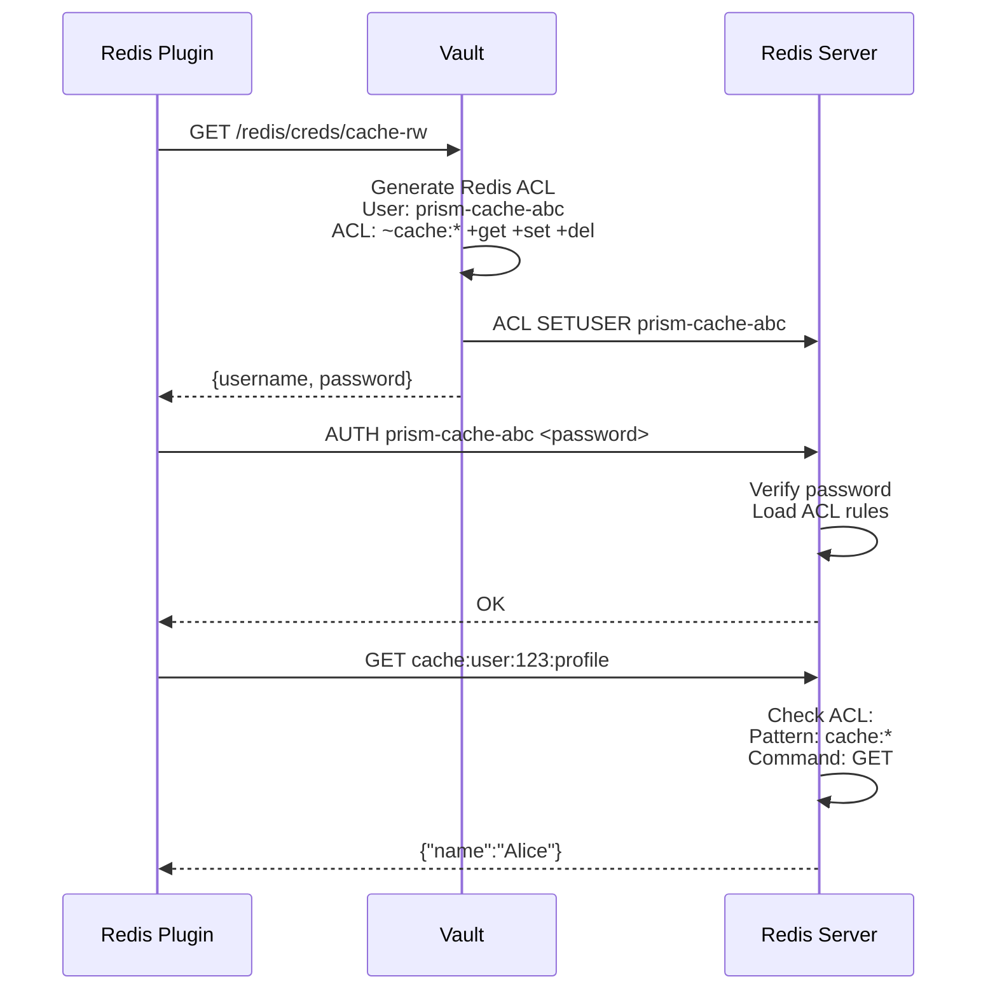

# Redis Backend Plugin

Redis plugin for Prism data gateway, implementing the caching layer abstraction.

## Architecture

Based on:
- **RFC-011**: Data Proxy Authentication (ACL + password with Vault)
- **ADR-010**: Caching Layer Design (look-aside pattern)
- **ADR-025**: Container Plugin Model (standard interfaces)
- **ADR-026**: Distroless Container Images (security)

## Features

- Cache operations (Get, Set, Delete, MGet)
- ACL-based authentication
- Vault-managed dynamic credentials
- Connection pooling
- TTL support
- Key namespacing
- Health check endpoints
- Prometheus metrics
- Distroless container image

## Configuration

### Environment Variables

```bash
# Required
REDIS_ADDRESS=localhost:6379
PRISM_PLUGIN_CONFIG=/etc/prism/plugin.yaml

# ACL authentication (RFC-011)
REDIS_USERNAME=prism-cache-abc
REDIS_PASSWORD=<acl-password>

# Optional
REDIS_DATABASE=0
PRISM_LOG_LEVEL=info
```

### Config File

```yaml
plugin:
  name: redis
  version: 0.1.0

control_plane:
  port: 9092

backend:
  address: "localhost:6379"
  database: 0

  # ACL authentication
  username: ""  # From env
  password: ""  # From env

  # Vault-managed credentials
  vault_enabled: false
  vault_path: "redis/creds/cache-rw"

  # Connection pool
  pool_size: 10
  max_retries: 3
  min_idle_conns: 2
  conn_max_idle_time: 300s

  # Key prefix
  key_prefix: "prism:"
```

## Building

### Local Build

```bash
cd plugins/redis
go build -o redis-plugin main.go
./redis-plugin
```

### Container Build (Podman)

```bash
# Production image
podman build -t prism/redis-plugin:latest --target production -f Dockerfile .

# Debug image
podman build -t prism/redis-plugin:debug --target debug -f Dockerfile .
```

## Running

### Local Execution

```bash
export REDIS_ADDRESS="localhost:6379"
export PRISM_PLUGIN_CONFIG="config.yaml"
./redis-plugin
```

### Container Execution

```bash
podman run -d \
  --name redis-plugin \
  -e REDIS_ADDRESS="redis:6379" \
  -e REDIS_USERNAME="prism-cache" \
  -e REDIS_PASSWORD="secret" \
  -p 9092:9092 \
  prism/redis-plugin:latest
```

### Docker Compose

```yaml
services:
  redis-plugin:
    image: prism/redis-plugin:latest
    environment:
      - REDIS_ADDRESS=redis:6379
      - REDIS_USERNAME=prism-cache
      - REDIS_PASSWORD=secret
    ports:
      - "9092:9092"
    depends_on:
      - redis

  redis:
    image: redis:7-alpine
    command: redis-server --requirepass secret
    ports:
      - "6379:6379"
```

## Authentication Flow (RFC-011)

### ACL Authentication



## API Operations

### Get (Cache Lookup)

```go
value, err := plugin.Get(ctx, "user:123:profile")
// Returns nil if cache miss (not an error)
```

### Set (Cache Write)

```go
err := plugin.Set(ctx, "user:123:profile", []byte(`{"name":"Alice"}`), 5*time.Minute)
```

### Delete (Cache Invalidation)

```go
err := plugin.Delete(ctx, "user:123:profile", "user:123:session")
```

### MGet (Batch Lookup)

```go
values, err := plugin.MGet(ctx, []string{"user:123:profile", "user:456:profile"})
// Returns map with only cache hits
```

### Expire (Update TTL)

```go
err := plugin.Expire(ctx, "user:123:session", 10*time.Minute)
```

## Health Checks

```bash
# gRPC health check
grpcurl -plaintext localhost:9092 grpc.health.v1.Health/Check

# Response:
{
  "status": "SERVING"
}
```

## Observability

### Metrics

Prometheus metrics exposed on `:9092/metrics`:

- `redis_plugin_operations_total` - Total operations by type (get, set, delete)
- `redis_plugin_operation_duration_seconds` - Operation latency
- `redis_plugin_cache_hits_total` - Cache hit count
- `redis_plugin_cache_misses_total` - Cache miss count
- `redis_plugin_pool_size` - Current pool connections
- `redis_plugin_health_status` - Health status

### Logging

Structured JSON logging:

```json
{
  "time": "2025-10-09T12:00:00Z",
  "level": "INFO",
  "msg": "redis plugin initialized",
  "address": "localhost:6379",
  "pool_size": 10,
  "acl_enabled": true
}
```

## Testing

```bash
# Unit tests
go test ./...

# Integration tests (requires Redis)
docker run -d -p 6379:6379 redis:7-alpine
export REDIS_ADDRESS="localhost:6379"
go test -tags=integration ./...
```

## Troubleshooting

### Debug Container

```bash
podman run -it --entrypoint /busybox/sh prism/redis-plugin:debug
```

### Common Issues

1. **Connection refused**: Check `REDIS_ADDRESS` and Redis is running
2. **NOAUTH Authentication required**: Set `REDIS_PASSWORD`
3. **NOPERM No permissions**: Check ACL rules match operation
4. **High latency**: Check Redis server load or network

## Vault Integration

When `vault_enabled: true`:

```yaml
backend:
  vault_enabled: true
  vault_path: "redis/creds/cache-rw"
```

The plugin will:
1. Fetch dynamic ACL credentials from Vault
2. Use short-lived credentials (RFC-011 pattern)
3. Automatically renew credentials before expiry
4. Gracefully handle credential rotation

Example Vault ACL policy:

```
ACL: ~cache:* +get +set +del +expire +mget
```

## References

- [RFC-011: Data Proxy Authentication](/docs-cms/rfcs/RFC-011-data-proxy-authentication.md)
- [ADR-010: Caching Layer Design](/docs-cms/adr/ADR-010-caching-layer.md)
- [ADR-025: Container Plugin Model](/docs-cms/adr/ADR-025-container-plugin-model.md)
- [ADR-026: Distroless Container Images](/docs-cms/adr/ADR-026-distroless-container-images.md)
- [Redis ACL](https://redis.io/docs/management/security/acl/)
